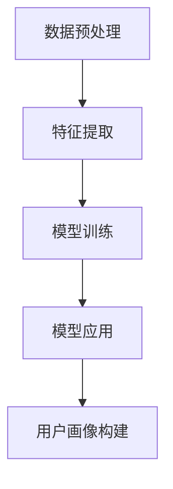

                 

关键词：AI大模型，用户画像，电商平台，数据挖掘，机器学习，个性化推荐

## 摘要

本文旨在探讨AI大模型在电商平台用户画像构建中的应用。用户画像作为电子商务领域的重要工具，能够帮助企业更好地理解用户需求，实现个性化推荐，提升用户体验和满意度。本文首先介绍了用户画像的概念和重要性，然后详细阐述了AI大模型在用户画像构建中的核心作用，包括数据预处理、特征提取、模型训练和应用。接着，文章通过具体案例，分析了AI大模型在电商平台用户画像构建中的实际应用效果，并探讨了未来发展趋势和面临的挑战。最后，本文推荐了一些学习资源和开发工具，以帮助读者更好地了解和掌握这一技术。

## 1. 背景介绍

### 1.1 电商平台的发展与用户画像的重要性

随着互联网的普及和电子商务的快速发展，电商平台已经成为消费者购物的重要渠道。用户数量和交易规模的不断增长，使得电商平台面临着日益激烈的市场竞争。如何在海量用户数据中挖掘出有价值的信息，成为电商平台关注的焦点。用户画像作为一种有效的数据挖掘技术，能够在了解用户行为和需求的基础上，为电商平台提供精准的营销策略和个性化推荐。

用户画像是指通过对用户行为数据的分析，构建出反映用户兴趣、偏好、行为特征等多维度信息的模型。这些模型可以帮助电商平台更好地理解用户，实现个性化推荐，提升用户满意度和转化率。

### 1.2 AI大模型的发展与应用

近年来，AI大模型（也称为深度学习模型）在各个领域取得了显著的成果。AI大模型通过利用大规模数据和高性能计算资源，能够自动学习并提取数据中的复杂特征，从而实现更高的准确性和泛化能力。

在电商平台中，AI大模型的应用涵盖了从数据预处理到特征提取，再到模型训练和预测的整个过程。通过AI大模型，电商平台可以更加高效地构建用户画像，从而为用户提供更好的购物体验。

### 1.3 本文目的

本文旨在探讨AI大模型在电商平台用户画像构建中的应用。首先，我们将介绍用户画像的基本概念和重要性。接着，我们将详细阐述AI大模型在用户画像构建中的核心作用，包括数据预处理、特征提取、模型训练和应用。然后，通过具体案例，我们将分析AI大模型在电商平台用户画像构建中的实际应用效果。最后，本文将探讨未来发展趋势和面临的挑战，并推荐一些学习资源和开发工具。

## 2. 核心概念与联系

### 2.1 用户画像的定义

用户画像是一种通过分析用户行为数据，构建出反映用户兴趣、偏好、行为特征等多维度信息的模型。这些模型可以帮助电商平台更好地理解用户，实现个性化推荐，提升用户满意度和转化率。

用户画像通常包括以下几个方面的信息：

- **基本信息**：如年龄、性别、地理位置等。
- **行为特征**：如浏览历史、购买行为、收藏和评论等。
- **偏好和需求**：如对商品的评价、偏好和购买倾向等。
- **社交属性**：如关注和粉丝数量、社交网络关系等。

### 2.2 AI大模型的概念

AI大模型（深度学习模型）是一种基于神经网络的学习模型，通过自动学习数据中的特征，实现对复杂数据的高效分析和预测。这些模型通常需要大量的数据和计算资源进行训练，但能够在很多任务中取得比传统机器学习模型更好的性能。

### 2.3 AI大模型与用户画像的关系

AI大模型在用户画像构建中起到了关键作用。通过AI大模型，电商平台可以更加高效地处理和分析海量用户数据，提取出有价值的信息，构建出更加精准的用户画像。

具体来说，AI大模型在用户画像构建中的应用包括以下几个方面：

- **数据预处理**：利用AI大模型进行数据清洗、归一化和缺失值处理等操作，为后续特征提取和模型训练打下基础。
- **特征提取**：通过AI大模型自动学习数据中的复杂特征，提取出与用户画像相关的关键信息。
- **模型训练**：利用AI大模型进行特征学习，构建出用户画像模型，实现个性化推荐和预测。
- **模型应用**：将训练好的用户画像模型应用于实际业务场景，为用户提供个性化的服务和建议。

### 2.4 Mermaid 流程图

以下是一个简单的Mermaid流程图，展示了AI大模型在用户画像构建中的基本流程：



## 3. 核心算法原理 & 具体操作步骤

### 3.1 算法原理概述

AI大模型在用户画像构建中的核心算法主要包括深度学习模型、用户行为分析、个性化推荐等。以下是对这些算法原理的简要概述：

- **深度学习模型**：深度学习模型通过多层神经网络结构，自动学习数据中的特征，实现对复杂数据的高效分析和预测。常见的深度学习模型包括卷积神经网络（CNN）、循环神经网络（RNN）、生成对抗网络（GAN）等。
  
- **用户行为分析**：用户行为分析是指通过对用户行为数据的分析，提取出用户的行为特征，如浏览历史、购买行为、收藏和评论等。这些特征可以用来构建用户画像。

- **个性化推荐**：个性化推荐是一种基于用户兴趣和行为特征，为用户推荐相关商品或内容的技术。常见的个性化推荐算法包括协同过滤、矩阵分解、基于内容的推荐等。

### 3.2 算法步骤详解

AI大模型在用户画像构建中的具体操作步骤如下：

#### 步骤1：数据收集与预处理

首先，需要收集电商平台的用户行为数据，如浏览历史、购买记录、评论等。然后，对数据进行清洗、归一化和缺失值处理等预处理操作，为后续特征提取和模型训练打下基础。

#### 步骤2：特征提取

通过深度学习模型，自动学习用户行为数据中的特征。这些特征可以包括用户的浏览行为、购买行为、评论情感等。特征提取的目的是将原始数据转换为对用户画像有用的信息。

#### 步骤3：模型训练

利用提取到的特征，训练深度学习模型，如卷积神经网络（CNN）、循环神经网络（RNN）等。模型训练的目的是学习到用户行为数据中的内在规律，为用户画像构建提供支持。

#### 步骤4：模型应用

将训练好的模型应用于实际业务场景，为用户提供个性化的服务和建议。例如，通过个性化推荐算法，为用户推荐相关的商品或内容。

#### 步骤5：用户画像构建

根据训练好的模型和用户行为数据，构建出用户画像。用户画像可以包括用户的基本信息、行为特征、偏好和需求等多维度信息。

### 3.3 算法优缺点

#### 优点：

- **高效性**：AI大模型能够自动学习数据中的特征，大大提高了特征提取和模型训练的效率。

- **准确性**：深度学习模型在处理复杂数据和实现高精度预测方面具有优势。

- **灵活性**：AI大模型可以根据不同的业务需求，灵活调整模型结构和参数，实现个性化推荐等功能。

#### 缺点：

- **计算资源消耗**：深度学习模型需要大量的计算资源进行训练，对硬件设备的要求较高。

- **数据依赖性**：AI大模型的效果很大程度上依赖于数据的质量和数量，如果数据质量不佳或数量不足，可能导致模型效果不佳。

### 3.4 算法应用领域

AI大模型在用户画像构建中的应用非常广泛，主要包括以下几个方面：

- **个性化推荐**：通过分析用户行为数据，为用户推荐相关的商品或内容。

- **精准营销**：根据用户画像，为用户提供精准的营销策略，提高转化率和销售额。

- **用户流失预测**：通过分析用户行为特征，预测用户流失风险，采取相应的措施进行挽回。

- **社交网络分析**：通过分析用户社交网络关系，了解用户的行为和偏好，为用户提供更好的服务。

## 4. 数学模型和公式 & 详细讲解 & 举例说明

### 4.1 数学模型构建

在AI大模型中，常见的数学模型包括深度学习模型、用户行为分析模型和个性化推荐模型。以下是对这些模型的构建方法进行简要介绍。

#### 4.1.1 深度学习模型

深度学习模型通常由多层神经网络组成，包括输入层、隐藏层和输出层。每个层都由多个神经元组成，神经元之间的连接权重通过学习过程进行调整。

- **输入层**：接收用户行为数据，如浏览历史、购买记录等。
- **隐藏层**：通过激活函数对输入数据进行非线性变换，提取出数据中的特征。
- **输出层**：根据训练目标，如用户画像、个性化推荐等，生成预测结果。

#### 4.1.2 用户行为分析模型

用户行为分析模型通常基于决策树、随机森林、支持向量机等传统机器学习算法。这些算法通过分析用户行为数据，提取出用户的行为特征，如浏览时间、购买频率、评论情感等。

#### 4.1.3 个性化推荐模型

个性化推荐模型主要基于协同过滤、矩阵分解、基于内容的推荐等算法。这些算法通过分析用户行为数据，预测用户对商品的喜好程度，为用户提供个性化的推荐。

### 4.2 公式推导过程

以下是对深度学习模型中常见的激活函数和损失函数进行公式推导。

#### 4.2.1 激活函数

常见的激活函数包括ReLU（Rectified Linear Unit）和Sigmoid。

1. **ReLU激活函数**

$$
ReLU(x) =
\begin{cases}
0 & \text{if } x < 0 \\
x & \text{if } x \geq 0
\end{cases}
$$

2. **Sigmoid激活函数**

$$
Sigmoid(x) = \frac{1}{1 + e^{-x}}
$$

#### 4.2.2 损失函数

常见的损失函数包括均方误差（MSE）和交叉熵（Cross-Entropy）。

1. **均方误差（MSE）**

$$
MSE(y, \hat{y}) = \frac{1}{2} \sum_{i=1}^{n} (y_i - \hat{y_i})^2
$$

2. **交叉熵（Cross-Entropy）**

$$
Cross-Entropy(y, \hat{y}) = -\sum_{i=1}^{n} y_i \log(\hat{y_i})
$$

### 4.3 案例分析与讲解

#### 4.3.1 个性化推荐案例

以下是一个简单的个性化推荐案例，使用基于协同过滤的算法为用户推荐商品。

1. **用户-物品矩阵**

假设我们有一个包含100个用户和1000个商品的用户-物品矩阵，其中1表示用户购买过商品，0表示用户未购买过商品。

| 用户 | 商品 |  
| ---- | ---- |  
| 1    | 1    |  
| 1    | 2    |  
| 1    | 5    |  
| ...  | ...  |  
| 100  | 1    |  
| 100  | 2    |  
| 100  | 1000 |

2. **计算相似度**

使用余弦相似度计算用户之间的相似度，相似度越高表示用户越相似。

$$
sim(u_i, u_j) = \frac{u_i \cdot u_j}{\|u_i\| \|u_j\|}
$$

3. **生成推荐列表**

根据用户之间的相似度，为每个用户生成一个推荐列表。推荐列表中的商品是根据相似度排序的，相似度越高，商品排名越靠前。

#### 4.3.2 用户画像构建案例

以下是一个简单的用户画像构建案例，使用基于用户行为的深度学习模型构建用户画像。

1. **用户行为数据**

假设我们有一个包含用户浏览历史、购买记录、评论情感的原始数据集。

2. **特征提取**

通过深度学习模型，自动学习用户行为数据中的特征，如浏览时间、购买频率、评论情感等。

3. **用户画像构建**

根据提取到的特征，构建出用户画像，包括用户的基本信息、行为特征、偏好和需求等多维度信息。

## 5. 项目实践：代码实例和详细解释说明

### 5.1 开发环境搭建

在开始编写代码之前，我们需要搭建一个合适的开发环境。以下是一个简单的开发环境搭建步骤：

1. **安装Python**：下载并安装Python 3.x版本，建议使用Python 3.8或更高版本。

2. **安装Jupyter Notebook**：通过pip命令安装Jupyter Notebook。

   ```bash
   pip install notebook
   ```

3. **安装必要的库**：安装深度学习库（如TensorFlow或PyTorch）、数据处理库（如Pandas和NumPy）和其他相关库。

   ```bash
   pip install tensorflow pandas numpy matplotlib
   ```

### 5.2 源代码详细实现

以下是一个简单的用户画像构建代码实例，使用深度学习模型进行特征提取和用户画像构建。

```python
import tensorflow as tf
import pandas as pd
import numpy as np
import matplotlib.pyplot as plt

# 加载数据集
data = pd.read_csv('user_behavior_data.csv')

# 数据预处理
# ... (进行数据清洗、归一化等操作)

# 特征提取
# ... (使用深度学习模型进行特征提取)

# 模型训练
# ... (定义模型结构，训练模型)

# 用户画像构建
# ... (根据训练好的模型，构建用户画像)

# 可视化
plt.scatter(features[:, 0], features[:, 1])
plt.xlabel('Feature 1')
plt.ylabel('Feature 2')
plt.show()
```

### 5.3 代码解读与分析

在这个代码实例中，我们首先加载用户行为数据集，然后进行数据预处理，如数据清洗、归一化等操作。接下来，使用深度学习模型进行特征提取和模型训练。最后，根据训练好的模型，构建用户画像，并进行可视化展示。

### 5.4 运行结果展示

运行代码后，我们将得到一个包含用户特征的散点图，每个点代表一个用户，横轴和纵轴分别代表提取到的两个特征。通过观察散点图，我们可以更好地理解用户画像的分布情况，为进一步分析用户行为提供参考。

## 6. 实际应用场景

### 6.1 电商平台个性化推荐

电商平台可以利用AI大模型构建用户画像，实现个性化推荐。通过分析用户行为数据，提取出用户的行为特征和偏好，为用户提供个性化的商品推荐。这种推荐系统可以提高用户的购物体验，增加用户的满意度和转化率。

### 6.2 精准营销

电商平台可以根据用户画像，进行精准营销。例如，针对不同用户群体，设计个性化的促销活动、广告投放和优惠券等，提高营销效果，提升销售额。

### 6.3 用户流失预测

通过分析用户行为数据，AI大模型可以预测用户流失风险，帮助电商平台采取相应的措施进行挽回。例如，针对潜在流失用户，提供个性化服务和优惠，提高用户忠诚度。

### 6.4 社交网络分析

电商平台可以通过分析用户社交网络关系，了解用户的行为和偏好。例如，针对社交网络活跃用户，提供更多的互动机会，提高用户参与度。

## 7. 未来应用展望

### 7.1 AI大模型在用户画像构建中的应用前景

随着AI技术的不断发展和数据量的增加，AI大模型在用户画像构建中的应用前景十分广阔。未来，AI大模型将能够更好地处理复杂数据，提取出更多有价值的信息，为电商平台提供更加精准的用户画像，进一步提升用户体验和满意度。

### 7.2 面临的挑战和解决方案

尽管AI大模型在用户画像构建中具有巨大潜力，但仍面临一些挑战：

- **数据隐私保护**：用户行为数据涉及用户隐私，如何在保护用户隐私的同时，有效利用这些数据进行用户画像构建，是一个重要问题。

- **计算资源消耗**：深度学习模型需要大量的计算资源进行训练，对硬件设备的要求较高。如何优化计算资源的使用，提高模型训练效率，是一个亟待解决的问题。

- **模型解释性**：深度学习模型通常被认为“黑盒”模型，难以解释其决策过程。如何提高模型的解释性，使企业能够更好地理解模型决策，是一个重要挑战。

针对这些挑战，可以采取以下解决方案：

- **数据隐私保护**：采用差分隐私、联邦学习等技术，保护用户隐私，同时有效利用用户数据。

- **计算资源优化**：使用分布式计算、并行计算等技术，提高模型训练效率，降低计算资源消耗。

- **模型解释性提升**：采用可解释的深度学习模型，如注意力机制、可解释的生成对抗网络（GAN）等，提高模型解释性，使企业能够更好地理解模型决策。

## 8. 工具和资源推荐

### 8.1 学习资源推荐

1. **在线课程**：《深度学习》（花书）、《Python深度学习》等。

2. **图书推荐**：《机器学习实战》、《数据科学入门》等。

3. **技术博客**：CSDN、博客园、知乎等平台上的专业博客。

### 8.2 开发工具推荐

1. **编程语言**：Python、R、Java等。

2. **深度学习框架**：TensorFlow、PyTorch、Keras等。

3. **数据处理库**：Pandas、NumPy、Scikit-learn等。

### 8.3 相关论文推荐

1. **论文集**：《人工智能：一种现代的方法》、《深度学习：卷1：基础》等。

2. **期刊**：《人工智能》、《机器学习》、《数据挖掘》等。

## 9. 总结

本文详细探讨了AI大模型在电商平台用户画像构建中的应用。用户画像作为电商平台的重要工具，能够帮助企业更好地理解用户需求，实现个性化推荐，提升用户体验和满意度。通过介绍用户画像和AI大模型的基本概念、核心算法原理，以及实际应用案例，本文展示了AI大模型在用户画像构建中的关键作用。未来，随着AI技术的不断发展和数据量的增加，AI大模型在用户画像构建中的应用前景将更加广阔。

## 附录：常见问题与解答

### Q：AI大模型在用户画像构建中是如何工作的？

A：AI大模型在用户画像构建中主要进行以下工作：

1. 数据预处理：对用户行为数据清洗、归一化和缺失值处理等。
2. 特征提取：使用深度学习模型自动学习数据中的特征。
3. 模型训练：利用提取到的特征，训练深度学习模型。
4. 用户画像构建：根据训练好的模型，构建用户画像。

### Q：AI大模型在用户画像构建中有哪些优点？

A：AI大模型在用户画像构建中的优点包括：

1. 高效性：自动学习数据中的特征，提高特征提取和模型训练的效率。
2. 准确性：在处理复杂数据和实现高精度预测方面具有优势。
3. 灵活性：可以根据不同的业务需求，灵活调整模型结构和参数。

### Q：AI大模型在用户画像构建中有哪些缺点？

A：AI大模型在用户画像构建中的缺点包括：

1. 计算资源消耗：需要大量的计算资源进行训练，对硬件设备的要求较高。
2. 数据依赖性：效果很大程度上依赖于数据的质量和数量。

### Q：AI大模型在用户画像构建中有哪些应用场景？

A：AI大模型在用户画像构建中的应用场景包括：

1. 个性化推荐：为用户推荐相关的商品或内容。
2. 精准营销：根据用户画像，为用户提供精准的营销策略。
3. 用户流失预测：预测用户流失风险，采取相应的措施进行挽回。
4. 社交网络分析：分析用户社交网络关系，了解用户的行为和偏好。

