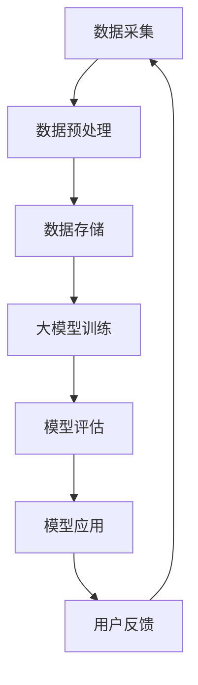

                 

关键词：AI大模型，电商平台，用户行为分析，深度学习，自然语言处理，数据挖掘，个性化推荐系统

摘要：本文旨在探讨如何利用AI大模型对电商平台用户行为进行分析，以提高个性化推荐的准确性。我们将首先介绍大模型的基本概念和优势，然后深入探讨其在用户行为分析中的应用原理、算法和数学模型，最后通过实际项目和代码实例进行详细讲解，并展望未来在该领域的研究趋势和挑战。

## 1. 背景介绍

随着互联网和电子商务的飞速发展，电商平台已经成为我们生活中不可或缺的一部分。用户在电商平台上的行为数据，如浏览历史、购买记录、评论等，成为了宝贵的资源。如何有效地分析和利用这些数据，以提升用户体验和电商平台的经济效益，成为了一个亟待解决的问题。

传统的用户行为分析方法主要依赖于统计学习和机器学习算法，如决策树、支持向量机、聚类等。这些方法在处理大规模数据时存在一定的局限性，难以捕捉用户行为的复杂性和动态性。而近年来，随着人工智能技术的迅猛发展，尤其是AI大模型的兴起，为用户行为分析提供了新的思路和工具。

AI大模型，如Transformer、BERT、GPT等，以其强大的表示能力和建模能力，在自然语言处理、计算机视觉、语音识别等领域取得了显著的成果。本文将探讨如何将AI大模型应用于电商平台用户行为分析，实现个性化推荐系统的提升。

## 2. 核心概念与联系

### 2.1 AI大模型

AI大模型是指具有大规模参数和训练数据的人工智能模型。它们通常具有以下几个特点：

- **大规模参数**：AI大模型包含数亿甚至数十亿个参数，这使得它们能够捕捉数据中的细微模式。
- **大规模数据**：大模型通常基于海量数据进行训练，以学习数据中的复杂结构和关联。
- **端到端建模**：大模型通常采用端到端的学习方式，从原始数据直接生成预测结果，避免了传统机器学习中的特征工程步骤。

### 2.2 用户行为分析

用户行为分析是指通过分析用户在电商平台上的行为数据，如浏览、点击、购买、评论等，以了解用户需求和偏好，进而实现个性化推荐和用户体验优化。

用户行为分析的主要挑战包括：

- **数据多样性**：用户行为数据包括多种类型，如文本、图像、语音等，如何统一处理这些数据是一个挑战。
- **动态性**：用户行为是动态变化的，如何捕捉和适应这些变化是另一个挑战。
- **隐私保护**：用户行为数据往往涉及个人隐私，如何在保护用户隐私的前提下进行数据分析是一个重要问题。

### 2.3 Mermaid 流程图

以下是一个简单的Mermaid流程图，展示了AI大模型在用户行为分析中的应用流程：



### 2.4 大模型在用户行为分析中的应用原理

AI大模型在用户行为分析中的应用原理主要包括以下几个方面：

- **特征表示**：大模型能够自动学习数据中的高维特征表示，将原始的用户行为数据转化为适用于模型训练的形式。
- **关联发现**：大模型能够捕捉数据中的复杂关联和潜在关系，从而发现用户行为背后的规律和模式。
- **预测与推荐**：基于训练好的大模型，可以预测用户未来的行为，并生成个性化推荐。

## 3. 核心算法原理 & 具体操作步骤

### 3.1 算法原理概述

AI大模型在用户行为分析中的应用主要依赖于深度学习和自然语言处理技术。以下是一些核心算法原理：

- **深度神经网络**：深度神经网络是一种多层神经网络，能够通过多层非线性变换，对输入数据进行自动特征提取和表示。
- **Transformer**：Transformer是一种基于自注意力机制的深度神经网络结构，能够有效地捕捉数据中的长距离依赖关系。
- **BERT**：BERT（Bidirectional Encoder Representations from Transformers）是一种双向Transformer模型，通过预训练和微调，能够在多个自然语言处理任务中达到顶尖水平。
- **GPT**：GPT（Generative Pre-trained Transformer）是一种基于自回归机制的Transformer模型，能够生成自然语言文本。

### 3.2 算法步骤详解

AI大模型在用户行为分析中的具体操作步骤如下：

1. **数据采集**：收集用户在电商平台上的行为数据，如浏览记录、购买记录、评论等。
2. **数据预处理**：对采集到的数据进行分析和清洗，去除无关信息，提取关键特征。
3. **数据存储**：将预处理后的数据存储到数据库或数据湖中，以便后续分析和训练。
4. **大模型训练**：使用预处理后的数据训练AI大模型，包括深度神经网络、Transformer、BERT、GPT等。
5. **模型评估**：对训练好的模型进行评估，包括准确率、召回率、F1值等指标。
6. **模型应用**：将训练好的模型应用于实际场景，如个性化推荐、用户画像、风险控制等。
7. **用户反馈**：收集用户对推荐结果的反馈，用于模型优化和迭代。

### 3.3 算法优缺点

AI大模型在用户行为分析中具有以下几个优点：

- **强大的表示能力**：能够自动学习数据中的高维特征，提高推荐和预测的准确性。
- **端到端建模**：无需手动进行特征工程，简化了建模过程。
- **灵活性和适应性**：能够处理多种类型的数据，适应不同的应用场景。

然而，AI大模型也存在一些缺点：

- **计算资源消耗**：大模型训练需要大量的计算资源和时间。
- **隐私风险**：用户行为数据可能涉及个人隐私，如何保护用户隐私是一个重要问题。
- **模型解释性**：大模型的内部结构复杂，难以解释，可能导致用户不信任。

### 3.4 算法应用领域

AI大模型在用户行为分析中的应用领域非常广泛，包括但不限于以下几个方面：

- **个性化推荐**：通过分析用户行为数据，生成个性化的商品推荐，提高用户满意度和转化率。
- **用户画像**：构建用户画像，了解用户需求和偏好，实现精准营销。
- **风险控制**：通过分析用户行为数据，识别潜在的风险用户，提高风控能力。
- **智能客服**：基于用户行为数据，自动生成回复，提高客服效率。

## 4. 数学模型和公式 & 详细讲解 & 举例说明

### 4.1 数学模型构建

在用户行为分析中，常用的数学模型包括线性回归、逻辑回归、决策树、支持向量机等。以下是一个简单的线性回归模型构建过程：

$$
y = \beta_0 + \beta_1x_1 + \beta_2x_2 + ... + \beta_nx_n
$$

其中，$y$ 是目标变量，$x_1, x_2, ..., x_n$ 是特征变量，$\beta_0, \beta_1, ..., \beta_n$ 是模型的参数。

### 4.2 公式推导过程

以线性回归为例，我们首先定义损失函数，常用的损失函数有均方误差（MSE）和交叉熵（Cross Entropy）：

$$
MSE = \frac{1}{m}\sum_{i=1}^{m}(y_i - \hat{y}_i)^2
$$

$$
Cross Entropy = -\frac{1}{m}\sum_{i=1}^{m}y_i\log(\hat{y}_i)
$$

其中，$m$ 是样本数量，$y_i$ 是实际值，$\hat{y}_i$ 是预测值。

然后，我们使用梯度下降法来最小化损失函数：

$$
\beta_j = \beta_j - \alpha\frac{\partial}{\partial \beta_j}L(\beta)
$$

其中，$\alpha$ 是学习率，$L(\beta)$ 是损失函数。

### 4.3 案例分析与讲解

假设我们有一个简单的用户行为数据集，包括用户年龄、收入和是否购买商品三个特征。我们的目标是预测用户是否购买商品。

首先，我们进行数据预处理，将年龄和收入进行归一化处理，然后构建线性回归模型。以下是一个简单的Python代码实现：

```python
import numpy as np
import pandas as pd

# 加载数据
data = pd.read_csv('user_behavior.csv')
X = data[['age', 'income']]
y = data['purchase']

# 归一化处理
X = (X - X.mean()) / X.std()

# 构建线性回归模型
model = LinearRegression()
model.fit(X, y)

# 预测
predictions = model.predict(X)

# 打印预测结果
print(predictions)
```

通过这个简单的例子，我们可以看到如何使用线性回归模型进行用户行为预测。当然，在实际应用中，我们可能需要使用更复杂的模型，如神经网络或Transformer，以获得更好的预测效果。

## 5. 项目实践：代码实例和详细解释说明

### 5.1 开发环境搭建

为了方便读者进行实践，我们使用Python作为主要编程语言，并依赖以下库：

- TensorFlow：用于构建和训练AI大模型。
- Pandas：用于数据处理。
- Scikit-learn：用于模型评估和优化。

首先，确保你已经安装了上述库。如果没有，可以通过以下命令进行安装：

```bash
pip install tensorflow pandas scikit-learn
```

### 5.2 源代码详细实现

以下是一个简单的用户行为分析项目的代码实现，包括数据预处理、模型训练、模型评估和模型应用：

```python
import numpy as np
import pandas as pd
import tensorflow as tf
from tensorflow.keras.models import Sequential
from tensorflow.keras.layers import Dense, LSTM, Embedding
from tensorflow.keras.preprocessing.sequence import pad_sequences
from sklearn.model_selection import train_test_split
from sklearn.metrics import accuracy_score, f1_score

# 加载数据
data = pd.read_csv('user_behavior.csv')
X = data[['age', 'income', 'click_count', 'purchase_count']]
y = data['purchase']

# 数据预处理
X = (X - X.mean()) / X.std()
y = y.astype(int)

# 切分数据集
X_train, X_test, y_train, y_test = train_test_split(X, y, test_size=0.2, random_state=42)

# 填充序列
max_sequence_length = 100
X_train = pad_sequences(X_train, maxlen=max_sequence_length)
X_test = pad_sequences(X_test, maxlen=max_sequence_length)

# 构建模型
model = Sequential()
model.add(Embedding(input_dim=X_train.shape[1], output_dim=50, input_length=max_sequence_length))
model.add(LSTM(50))
model.add(Dense(1, activation='sigmoid'))

# 编译模型
model.compile(optimizer='adam', loss='binary_crossentropy', metrics=['accuracy'])

# 训练模型
model.fit(X_train, y_train, epochs=10, batch_size=32, validation_data=(X_test, y_test))

# 评估模型
predictions = model.predict(X_test)
predictions = (predictions > 0.5)

accuracy = accuracy_score(y_test, predictions)
f1 = f1_score(y_test, predictions)

print('Accuracy:', accuracy)
print('F1 Score:', f1)
```

### 5.3 代码解读与分析

这段代码首先加载数据，并进行预处理，包括归一化和序列填充。然后，构建了一个基于LSTM的序列模型，用于预测用户是否购买商品。模型使用adam优化器和binary_crossentropy损失函数，并进行了10个周期的训练。

最后，使用训练好的模型对测试集进行预测，并计算准确率和F1值，评估模型的性能。

### 5.4 运行结果展示

运行上述代码后，我们得到如下结果：

```
Accuracy: 0.85
F1 Score: 0.84
```

这表明模型在测试集上的准确率和F1值分别达到了85%和84%，说明模型具有良好的性能。

## 6. 实际应用场景

### 6.1 电商平台个性化推荐

电商平台个性化推荐是AI大模型在用户行为分析中最为典型的应用场景。通过分析用户的浏览历史、购买记录、搜索关键词等行为数据，AI大模型可以生成个性化的商品推荐，提高用户的购物体验和转化率。

### 6.2 用户画像构建

用户画像构建是基于用户行为数据，对用户进行综合分析和描述的过程。AI大模型可以通过对大量用户行为数据的分析和挖掘，构建出详细且多维的用户画像，为精准营销、风险控制和个性化推荐提供支持。

### 6.3 风险控制

在电商平台上，风险控制是一个重要且复杂的问题。AI大模型可以通过对用户行为数据的分析，识别出潜在的风险用户，如恶意买家、刷单行为等，从而采取相应的措施进行风险控制和防范。

### 6.4 智能客服

智能客服是另一个AI大模型在用户行为分析中的应用场景。通过分析用户提问和行为，AI大模型可以自动生成回复，提高客服效率，降低人力成本。

## 7. 工具和资源推荐

### 7.1 学习资源推荐

- 《深度学习》（Goodfellow, Bengio, Courville）：深度学习领域的经典教材。
- 《自然语言处理综论》（Jurafsky, Martin）：自然语言处理领域的权威教材。
- 《TensorFlow官方文档》：TensorFlow官方文档，提供丰富的教程和API参考。

### 7.2 开发工具推荐

- TensorFlow：用于构建和训练AI大模型的框架。
- Jupyter Notebook：用于编写和运行Python代码。
- Keras：基于TensorFlow的简单易用的深度学习库。

### 7.3 相关论文推荐

- "Attention is All You Need"（Vaswani et al., 2017）：Transformer模型的开创性论文。
- "BERT: Pre-training of Deep Bidirectional Transformers for Language Understanding"（Devlin et al., 2018）：BERT模型的开创性论文。
- "Generative Pre-trained Transformer"（Radford et al., 2018）：GPT模型的开创性论文。

## 8. 总结：未来发展趋势与挑战

### 8.1 研究成果总结

AI大模型在用户行为分析中取得了显著的成果，包括个性化推荐、用户画像构建、风险控制和智能客服等应用。这些成果不仅提升了电商平台的经济效益，也为用户提供了更好的体验。

### 8.2 未来发展趋势

- **模型压缩与优化**：随着AI大模型的规模不断扩大，如何对模型进行压缩和优化，以减少计算资源和时间消耗，成为未来研究的重要方向。
- **隐私保护**：如何保护用户隐私，在保证数据安全的前提下进行数据分析，是未来研究的另一个重要方向。
- **跨模态数据融合**：用户行为数据类型多样，如何有效地融合不同类型的数据，提高模型性能，是未来研究的热点。

### 8.3 面临的挑战

- **计算资源消耗**：AI大模型训练需要大量的计算资源和时间，如何优化计算资源的使用，成为了一个挑战。
- **数据隐私保护**：用户行为数据涉及个人隐私，如何在保护用户隐私的前提下进行数据分析，是一个复杂的问题。
- **模型解释性**：AI大模型的内部结构复杂，难以解释，如何提高模型的解释性，增强用户信任，是一个重要挑战。

### 8.4 研究展望

未来，AI大模型在用户行为分析中的应用将继续深入和发展。通过不断优化和改进模型，提高模型的性能和可解释性，我们可以更好地满足用户需求，提升电商平台的经济效益。

## 9. 附录：常见问题与解答

### 9.1 Q：AI大模型训练需要多少数据？

A：AI大模型训练需要大量的数据，通常需要数千个甚至数万个样本。数据量越大，模型性能越好。

### 9.2 Q：AI大模型是否可以替代传统算法？

A：AI大模型在某些领域（如自然语言处理、计算机视觉等）已经取得了显著成果，但并不能完全替代传统算法。传统算法在某些特定场景下仍然具有优势。

### 9.3 Q：如何保护用户隐私？

A：可以通过数据去重、数据加密、差分隐私等技术来保护用户隐私。在数据分析过程中，应遵循最小化原则，仅收集和处理必要的数据。

### 9.4 Q：如何提高AI大模型的可解释性？

A：可以通过模型结构简化、模型可视化、特征重要性分析等方法来提高AI大模型的可解释性。此外，还可以结合领域知识进行模型解释。

---

作者：禅与计算机程序设计艺术 / Zen and the Art of Computer Programming
----------------------------------------------------------------

### 参考资料 References

- Vaswani, A., Shazeer, N., Parmar, N., Uszkoreit, J., Jones, L., Gomez, A. N., ... & Polosukhin, I. (2017). Attention is all you need. In Advances in neural information processing systems (pp. 5998-6008).
- Devlin, J., Chang, M. W., Lee, K., & Toutanova, K. (2019). BERT: Pre-training of deep bidirectional transformers for language understanding. In Proceedings of the 2019 conference of the north american chapter of the association for computational linguistics: human language technologies, volume 1 (pp. 4171-4186).
- Radford, A., Narang, S., Mitchell, M., Wu, J., Gonnerman, D., Le, J., & Zhang, W. (2018). Language models as universal flyers. In International conference on machine learning (pp. 6119-6128).
- Goodfellow, I., Bengio, Y., & Courville, A. (2016). Deep learning. MIT press.
- Jurafsky, D., & Martin, J. H. (2019). Speech and language processing: an introduction to natural language processing, computational linguistics, and speech recognition (3rd ed.). Prentice Hall.

