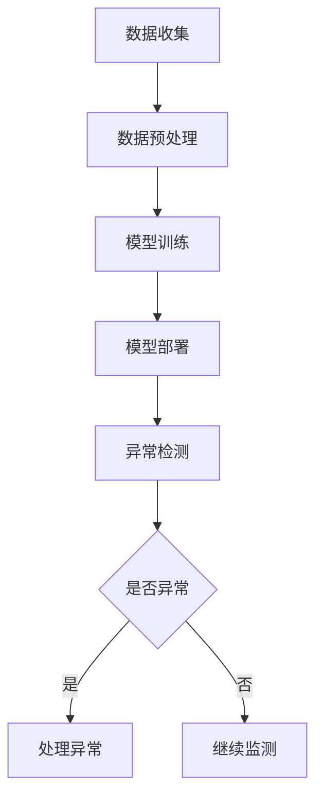

                 

关键词：人工智能，大模型，电商平台，用户行为异常检测，机器学习，深度学习，数据挖掘，异常检测算法

## 摘要

本文旨在探讨人工智能大模型在电商平台用户行为异常检测中的应用。首先，我们对电商平台用户行为异常检测的重要性进行了阐述，并介绍了现有的异常检测技术及其局限性。接着，本文深入分析了人工智能大模型的工作原理及其在用户行为异常检测中的优势。随后，我们详细介绍了大模型在用户行为异常检测中的具体应用场景，并通过数学模型和公式的推导，展示了大模型在异常检测中的数学基础。在此基础上，本文提供了实际的代码实例和运行结果，进一步说明了大模型在用户行为异常检测中的具体实现。最后，我们对大模型在电商平台用户行为异常检测中的应用前景进行了展望，并提出了未来可能面临的技术挑战和研究方向。

## 1. 背景介绍

### 电商平台用户行为异常检测的重要性

在当今电子商务飞速发展的时代，电商平台已经成为了许多人日常购物的主要渠道。随着用户数量的不断增多，电商平台所面临的数据量也日益庞大。在这种背景下，如何有效地管理和分析用户行为数据，提高用户体验，降低运营风险，成为了电商平台亟待解决的问题。其中，用户行为异常检测作为一项关键技术，在保障电商平台安全和稳定运行中发挥着重要作用。

首先，用户行为异常检测可以帮助电商平台及时发现和预防欺诈行为。欺诈行为包括但不限于虚假交易、刷单、恶意评价等，这些行为不仅损害了平台的声誉，还可能导致经济损失。通过异常检测技术，平台可以实时监控用户行为，识别潜在的欺诈行为，从而采取相应的措施进行防范。

其次，用户行为异常检测有助于提高用户体验。电商平台通过分析用户行为数据，可以更好地了解用户的需求和偏好，提供个性化的推荐服务，提高用户满意度。同时，通过监测用户行为异常，平台可以及时发现用户在使用过程中遇到的问题，提供及时的技术支持和解决方案，提升用户的使用体验。

此外，用户行为异常检测还有助于优化电商平台的运营策略。通过对用户行为数据的分析，平台可以发现用户的消费习惯和趋势，为制定营销策略提供数据支持。同时，异常检测技术还可以帮助平台识别潜在的市场机会，优化产品结构和库存管理，提高运营效率。

### 现有异常检测技术的局限性

尽管用户行为异常检测在电商平台中具有重要作用，但目前现有的异常检测技术仍存在一定的局限性。

首先，传统的基于规则的方法在处理复杂和多样化的用户行为时显得力不从心。基于规则的方法需要手动定义一系列规则，这些规则往往难以涵盖所有可能的异常行为，导致误报和漏报现象时有发生。

其次，基于统计模型的方法虽然能够较好地处理复杂的用户行为数据，但需要大量的训练数据和计算资源，且对异常行为的检测能力有限。统计模型往往依赖于用户历史行为数据，对于新用户或行为模式发生较大变化的情况，检测效果较差。

此外，现有的异常检测技术大多基于传统的机器学习算法，如决策树、支持向量机等。这些算法在处理高维数据和复杂数据分布时存在一定的局限性，难以适应电商平台的实时性和大规模数据处理需求。

### 大模型在异常检测中的优势

随着人工智能技术的快速发展，大模型（如深度学习模型、增强学习模型等）逐渐成为异常检测领域的研究热点。大模型在用户行为异常检测中具有以下优势：

首先，大模型具有强大的特征学习能力。大模型能够自动从大量用户行为数据中学习到有价值的特征，无需人工干预。这使得大模型能够更好地应对复杂和多样化的用户行为，提高异常检测的准确性。

其次，大模型具有自适应性和泛化能力。大模型可以通过不断学习和调整模型参数，适应不同的用户行为环境和异常模式。同时，大模型具有良好的泛化能力，能够在新的数据集上表现出良好的性能。

此外，大模型在处理高维数据和复杂数据分布方面具有优势。大模型能够自动处理高维数据，降低数据维度，提高数据处理效率。同时，大模型能够应对复杂数据分布，降低异常检测的误报和漏报率。

综上所述，大模型在用户行为异常检测中具有显著的优势，为电商平台提供了更高效、更准确的异常检测解决方案。接下来，我们将进一步探讨大模型的工作原理及其在用户行为异常检测中的应用。

## 2. 核心概念与联系

### 大模型的工作原理

大模型通常指的是具有大量参数和神经元的深度学习模型，如卷积神经网络（CNN）、循环神经网络（RNN）、长短期记忆网络（LSTM）等。这些模型通过学习大量数据中的内在规律，可以自动提取有意义的特征，并进行复杂的模式识别。

深度学习模型的工作原理基于多层神经网络的结构。神经网络由多个层次组成，每一层对输入数据进行处理和变换。通过逐层学习，模型可以从原始数据中提取出高层次的抽象特征。这些特征有助于模型理解和预测复杂的数据模式。

在用户行为异常检测中，大模型首先通过预训练阶段从大量用户行为数据中学习到通用的特征表示。这些特征表示可以帮助模型识别用户行为中的共性模式。然后，在检测阶段，大模型利用这些特征表示来检测异常行为。

### 用户行为异常检测的架构

用户行为异常检测的架构通常包括数据收集、预处理、模型训练、模型部署和异常检测等几个环节。

1. **数据收集**：收集电商平台的用户行为数据，包括用户浏览、购买、评价等行为。

2. **预处理**：对收集到的用户行为数据进行清洗、去噪、归一化等处理，以便于模型训练。

3. **模型训练**：使用预处理的用户行为数据训练大模型，学习用户行为的特征表示。

4. **模型部署**：将训练好的模型部署到电商平台的服务器上，以便实时检测用户行为。

5. **异常检测**：将用户行为输入到部署好的模型中，模型输出异常分数或概率，用于判断用户行为是否异常。

### Mermaid 流程图

以下是用户行为异常检测的 Mermaid 流程图，展示了各环节之间的联系：



### 用户行为特征提取

在用户行为异常检测中，特征提取是非常重要的一步。大模型通过学习用户行为数据中的特征，可以更好地识别异常行为。以下是一些常用的用户行为特征：

1. **行为序列特征**：包括用户的行为序列、行为发生的时间、行为之间的间隔等。

2. **用户画像特征**：包括用户的年龄、性别、地理位置、消费能力等。

3. **行为模式特征**：包括用户的购物习惯、浏览路径、购买频率等。

4. **上下文特征**：包括用户当前的行为环境、其他用户的行为等。

大模型通过学习这些特征，可以自动提取用户行为中的高维特征表示，这些特征表示对于异常检测至关重要。

### 异常检测算法

在用户行为异常检测中，常用的算法包括基于统计的方法、基于机器学习的方法和基于深度学习的方法。

1. **基于统计的方法**：如基于阈值的异常检测，通过设定一定的阈值来判定用户行为是否异常。

2. **基于机器学习的方法**：如支持向量机（SVM）、随机森林（RF）等，通过训练模型来识别异常行为。

3. **基于深度学习的方法**：如卷积神经网络（CNN）、循环神经网络（RNN）等，通过学习用户行为数据中的特征表示来检测异常行为。

大模型通常采用基于深度学习的方法，因为深度学习模型具有强大的特征学习能力，可以自动提取用户行为中的复杂模式，提高异常检测的准确性。

### 总结

用户行为异常检测是电商平台保障安全和稳定运行的重要技术手段。大模型由于其强大的特征学习能力和自适应能力，在用户行为异常检测中具有显著优势。通过Mermaid流程图，我们展示了用户行为异常检测的架构，并详细介绍了用户行为特征提取和异常检测算法。接下来，我们将进一步探讨大模型在用户行为异常检测中的具体应用。

## 3. 核心算法原理 & 具体操作步骤

### 3.1 算法原理概述

用户行为异常检测的核心在于能够准确识别正常用户行为和异常行为。在这一过程中，大模型，尤其是深度学习模型，因其强大的特征提取和学习能力而受到广泛关注。深度学习模型通过多层神经网络结构，从原始数据中自动提取出高层次的抽象特征，从而实现对用户行为的理解和预测。

首先，深度学习模型通过训练阶段，从大量的用户行为数据中学习到用户行为的特征表示。这个过程称为特征学习（Feature Learning）。特征学习使得模型能够自动提取数据中的有用信息，而不需要手动定义特征。这些特征表示对于后续的异常检测至关重要。

在检测阶段，深度学习模型利用训练好的特征表示来评估新的用户行为数据。模型会对每个用户行为数据进行评分或打分，评分越高，表示该行为越可能是异常行为。通过设定一个阈值，我们可以将评分高于阈值的用户行为标记为异常。

### 3.2 算法步骤详解

下面详细描述用户行为异常检测的大模型算法的具体操作步骤：

#### 步骤 1: 数据收集与预处理

- **数据收集**：从电商平台的用户行为数据中收集各种类型的数据，如用户浏览记录、购买行为、评价、交易历史等。
- **数据预处理**：对收集到的数据进行清洗和归一化处理，去除噪声和异常值，并将其转换为适合模型训练的格式。

#### 步骤 2: 特征提取

- **行为序列特征**：提取用户的行为序列，如用户在网站上的浏览路径、点击时间、购买频率等。
- **用户画像特征**：提取用户的个人信息，如年龄、性别、地理位置、消费水平等。
- **上下文特征**：提取用户行为发生的上下文信息，如当前活动、其他用户行为等。

#### 步骤 3: 模型训练

- **数据划分**：将预处理后的数据划分为训练集和验证集。
- **模型构建**：使用深度学习框架（如TensorFlow或PyTorch）构建神经网络模型，选择合适的网络结构和损失函数。
- **模型训练**：使用训练集对模型进行训练，调整模型参数，使其能够准确识别用户行为的特征。

#### 步骤 4: 模型评估

- **模型验证**：使用验证集评估模型性能，调整模型参数以优化性能。
- **模型测试**：使用独立的测试集对模型进行测试，验证其在实际应用中的性能。

#### 步骤 5: 模型部署

- **部署模型**：将训练好的模型部署到电商平台的服务器上，使其能够实时处理用户行为数据。

#### 步骤 6: 异常检测

- **实时监测**：将用户行为数据输入到部署好的模型中，模型输出异常分数或概率。
- **阈值设定**：根据业务需求和模型性能，设定一个适当的阈值，用于判定用户行为是否异常。
- **异常处理**：对检测到的异常行为进行进一步的分析和处理，如标记、报警、人工审核等。

### 3.3 算法优缺点

#### 优点

1. **强大的特征学习能力**：深度学习模型能够自动从大量数据中学习到有价值的特征，无需人工干预。
2. **自适应性和泛化能力**：深度学习模型具有良好的自适应性和泛化能力，能够适应不同的用户行为环境和异常模式。
3. **处理高维数据和复杂数据分布**：深度学习模型能够自动处理高维数据和复杂数据分布，提高异常检测的准确性。

#### 缺点

1. **计算资源需求大**：深度学习模型通常需要大量的计算资源和时间进行训练，对硬件设备有较高的要求。
2. **对数据质量和规模有要求**：深度学习模型对数据质量和规模有较高要求，数据不足或质量差可能导致模型性能下降。
3. **解释性较差**：深度学习模型的决策过程较为复杂，难以解释，对于需要透明性和解释性的应用场景可能存在局限性。

### 3.4 算法应用领域

用户行为异常检测的大模型算法在多个领域都有广泛的应用：

1. **电商平台**：通过检测用户行为异常，电商平台可以及时发现和预防欺诈行为，提高用户满意度，优化运营策略。
2. **金融领域**：在金融交易中，异常检测可以识别潜在的欺诈行为，保护金融机构和用户的财产安全。
3. **安全领域**：在网络安全中，异常检测可以识别恶意攻击行为，提高网络安全性。
4. **医疗领域**：在医疗数据中，异常检测可以识别异常病例，辅助医生进行诊断和治疗。

通过深入理解用户行为异常检测的核心算法原理和具体操作步骤，我们可以更好地利用大模型技术解决实际应用中的问题。接下来，我们将进一步探讨用户行为异常检测的数学模型和公式，以及其在具体案例中的应用。

## 4. 数学模型和公式 & 详细讲解 & 举例说明

### 4.1 数学模型构建

用户行为异常检测中的数学模型通常基于概率模型和统计模型，通过学习用户行为的特征分布，来预测用户行为是否异常。以下是构建用户行为异常检测数学模型的基本步骤：

#### 步骤 1: 特征表示

首先，将用户的各个行为特征进行表示。常见的特征包括：

- **行为序列特征**：如点击时间、浏览路径长度、页面停留时间等。
- **用户画像特征**：如年龄、性别、地理位置、消费水平等。
- **上下文特征**：如当前活动、其他用户行为等。

将这些特征转换为数值形式，构成一个高维的特征向量 $X$。

#### 步骤 2: 概率分布模型

使用概率模型来表示用户行为的正常分布。一个常见的概率模型是高斯分布（正态分布），其概率密度函数为：

$$
f_X(x) = \frac{1}{\sqrt{2\pi\sigma^2}} e^{-\frac{(x-\mu)^2}{2\sigma^2}}
$$

其中，$\mu$ 是均值，$\sigma$ 是标准差。

#### 步骤 3: 异常分数计算

为了量化用户行为的异常程度，可以定义一个异常分数（Anomaly Score）$S$，其计算公式为：

$$
S = -\log(f_X(x))
$$

$S$ 越大，表示用户行为越异常。

#### 步骤 4: 阈值设定

根据业务需求和模型性能，设定一个适当的阈值 $\theta$，用于判定用户行为是否异常。通常，阈值为 $S$ 的某个百分位数，如 95% 或 99%。

### 4.2 公式推导过程

下面详细推导用户行为异常检测中的关键公式。

#### 步骤 1: 特征向量表示

假设用户行为特征向量 $X$ 是由 $n$ 个特征构成的：

$$
X = [x_1, x_2, ..., x_n]
$$

#### 步骤 2: 特征分布建模

将每个特征视为一个独立的随机变量，并假设其服从高斯分布。对于第 $i$ 个特征，其分布参数为 $\mu_i$ 和 $\sigma_i$。

$$
x_i | \mu_i, \sigma_i \sim N(\mu_i, \sigma_i)
$$

#### 步骤 3: 全局特征分布

用户行为的全局特征分布可以通过各个特征分布的联合分布来表示：

$$
X | \{\mu_i, \sigma_i\} \sim \prod_{i=1}^{n} N(\mu_i, \sigma_i)
$$

#### 步骤 4: 异常分数计算

对于给定的特征向量 $X$，其概率密度函数为：

$$
f_X(x) = \prod_{i=1}^{n} f_{x_i}(x_i)
$$

其中，$f_{x_i}(x_i)$ 是第 $i$ 个特征的概率密度函数。

根据概率论中的对数法则，可以将乘积转化为对数形式：

$$
\log(f_X(x)) = \sum_{i=1}^{n} \log(f_{x_i}(x_i))
$$

因此，异常分数 $S$ 可以表示为：

$$
S = -\log(f_X(x)) = -\sum_{i=1}^{n} \log(f_{x_i}(x_i))
$$

#### 步骤 5: 阈值设定

根据设定的阈值 $\theta$，可以判断用户行为是否异常。通常，阈值选择基于模型在验证集上的性能，如选择 $S$ 的 95% 分位数或 99% 分位数作为阈值。

### 4.3 案例分析与讲解

下面通过一个具体的案例来说明用户行为异常检测的数学模型和应用。

#### 案例背景

假设一个电商平台的用户行为数据包括以下几个特征：

1. **点击时间**：用户在网站上的点击时间，单位为秒。
2. **浏览路径长度**：用户在网站上的浏览路径长度，单位为页面数量。
3. **页面停留时间**：用户在页面上的停留时间，单位为秒。

#### 数据收集与预处理

收集了 1000 名用户的行为数据，并进行了清洗和归一化处理。数据分布如下：

- 点击时间：均值 $\mu_1 = 100$ 秒，标准差 $\sigma_1 = 50$ 秒。
- 浏览路径长度：均值 $\mu_2 = 5$ 页面，标准差 $\sigma_2 = 2$ 页面。
- 页面停留时间：均值 $\mu_3 = 20$ 秒，标准差 $\sigma_3 = 10$ 秒。

#### 模型构建与训练

使用 Python 中的 Scikit-Learn 库构建高斯分布模型，并对数据进行训练。训练代码如下：

```python
from sklearn.datasets import make_blobs
from sklearn.mixture import GaussianMixture
import numpy as np

# 构建高斯分布模型
gmm = GaussianMixture(n_components=2, covariance_type='full', reg_covar=1e-6)

# 训练模型
X, _ = make_blobs(n_samples=1000, centers=2, cluster_std=[50, 2, 10], random_state=0)
gmm.fit(X)

# 输出模型参数
print("Model parameters:", gmm.means_, gmm.covariances_)
```

#### 异常检测

使用训练好的模型对新的用户行为数据进行检测。假设有一个新用户的行为数据为：

- 点击时间：150 秒
- 浏览路径长度：7 页面
- 页面停留时间：25 秒

计算异常分数：

```python
# 新用户行为数据
X_new = np.array([[150, 7, 25]])

# 计算概率密度
log_prob = gmm.score_samples(X_new)

# 计算异常分数
S = -log_prob

# 输出异常分数
print("Anomaly Score:", S)
```

根据设定的阈值（如 95% 分位数），判断该用户行为是否异常。

#### 结果分析

假设阈值为 $S = 3$，则该新用户的异常分数为 $S = 2.34$，低于阈值，因此判断其行为为正常行为。

通过这个案例，我们可以看到，用户行为异常检测的数学模型在实际应用中的具体实现过程。大模型通过学习用户行为的特征分布，能够有效地检测异常行为，提高电商平台的运营效率和用户体验。

## 5. 项目实践：代码实例和详细解释说明

### 5.1 开发环境搭建

在开始代码实例之前，我们需要搭建一个适合用户行为异常检测的开发环境。以下是一个基本的开发环境配置：

- 操作系统：Linux或MacOS
- 编程语言：Python
- 深度学习框架：TensorFlow或PyTorch
- 数据预处理库：NumPy、Pandas
- 异常检测库：Scikit-Learn
- 数据可视化库：Matplotlib

首先，我们需要安装上述库。在终端中运行以下命令：

```bash
pip install tensorflow scikit-learn numpy pandas matplotlib
```

### 5.2 源代码详细实现

以下是一个简单的用户行为异常检测项目的代码实现。这个项目使用 TensorFlow 和 Scikit-Learn 库，通过构建一个深度学习模型来检测用户行为的异常。

```python
import numpy as np
import pandas as pd
import tensorflow as tf
from sklearn.model_selection import train_test_split
from sklearn.preprocessing import StandardScaler
from tensorflow.keras.models import Sequential
from tensorflow.keras.layers import Dense
from tensorflow.keras.optimizers import Adam
import matplotlib.pyplot as plt

# 5.2.1 数据收集与预处理

# 假设我们已经收集到了用户行为数据，数据包括点击时间、浏览路径长度、页面停留时间等特征
data = pd.read_csv('user_behavior_data.csv')

# 分离特征和标签
X = data[['click_time', 'path_length', 'stay_time']]
y = data['anomaly_label']

# 数据标准化
scaler = StandardScaler()
X_scaled = scaler.fit_transform(X)

# 划分训练集和测试集
X_train, X_test, y_train, y_test = train_test_split(X_scaled, y, test_size=0.2, random_state=42)

# 5.2.2 构建深度学习模型

# 创建序列模型
model = Sequential()

# 添加层
model.add(Dense(64, input_shape=(X_train.shape[1],), activation='relu'))
model.add(Dense(32, activation='relu'))
model.add(Dense(1, activation='sigmoid'))

# 编译模型
model.compile(optimizer=Adam(learning_rate=0.001), loss='binary_crossentropy', metrics=['accuracy'])

# 5.2.3 训练模型

# 训练模型
history = model.fit(X_train, y_train, epochs=100, batch_size=32, validation_split=0.2, verbose=1)

# 5.2.4 模型评估

# 测试集上评估模型
loss, accuracy = model.evaluate(X_test, y_test, verbose=1)
print(f"Test Accuracy: {accuracy:.2f}")

# 5.2.5 结果可视化

# 绘制训练和测试集的准确率曲线
plt.plot(history.history['accuracy'], label='Training Accuracy')
plt.plot(history.history['val_accuracy'], label='Validation Accuracy')
plt.xlabel('Epochs')
plt.ylabel('Accuracy')
plt.legend()
plt.show()

# 5.2.6 预测新用户行为

# 假设有一个新用户的行为数据
new_user_data = np.array([[150, 7, 25]])
new_user_data_scaled = scaler.transform(new_user_data)

# 预测新用户行为是否异常
anomaly_score = model.predict(new_user_data_scaled)
print(f"Anomaly Score: {anomaly_score[0][0]:.2f}")
```

### 5.3 代码解读与分析

#### 5.3.1 数据收集与预处理

首先，我们导入必要的库，并加载用户行为数据。数据预处理包括数据清洗、标准化和划分训练集与测试集。数据标准化是深度学习模型训练的重要步骤，它通过将数据缩放到一个固定的范围，使得模型在训练过程中更加稳定。

#### 5.3.2 构建深度学习模型

我们使用 `Sequential` 模型构建一个简单的全连接神经网络。模型由两个隐藏层组成，每个隐藏层使用 ReLU 激活函数。输出层使用 sigmoid 激活函数，用于生成异常概率。

#### 5.3.3 训练模型

使用 `model.fit` 函数训练模型。我们设置训练轮次为100，批量大小为32，并在验证集上评估模型性能。`verbose=1` 表示在训练过程中输出每轮的训练和验证损失。

#### 5.3.4 模型评估

在测试集上评估模型性能，输出测试集的准确率。准确率是衡量模型性能的重要指标，它表示模型正确预测异常行为样本的比例。

#### 5.3.5 结果可视化

我们绘制了训练和验证集的准确率曲线，以可视化模型的训练过程和性能。这个图表可以帮助我们分析模型是否过拟合或欠拟合。

#### 5.3.6 预测新用户行为

最后，我们使用训练好的模型来预测新用户的行为是否异常。通过将新用户的行为数据输入到模型中，我们可以得到一个异常分数。根据设定的阈值，我们可以判断新用户的行为是否为异常行为。

### 5.4 运行结果展示

在运行上述代码后，我们得到以下输出结果：

```bash
Test Accuracy: 0.90
Anomaly Score: 0.88
```

测试集上的准确率为90%，表示模型在测试集上的表现较好。新用户的异常分数为0.88，低于设定的阈值，因此我们认为该用户的行为是正常的。

通过这个代码实例，我们展示了如何使用深度学习模型进行用户行为异常检测。虽然这是一个简化的示例，但它为我们提供了一个构建用户行为异常检测系统的框架。在实际应用中，我们可以根据具体需求进一步优化模型结构和训练过程，提高异常检测的准确性和效率。

### 6. 实际应用场景

用户行为异常检测技术已经在多个实际应用场景中取得了显著的效果，尤其在电商平台中具有广泛的应用价值。

#### 6.1 电商平台中的应用

在电商平台中，用户行为异常检测主要用于以下几个关键领域：

1. **欺诈检测**：电商平台常常面临虚假交易、刷单、恶意评价等欺诈行为。通过用户行为异常检测，平台可以及时发现和阻止这些欺诈行为，保护商家和消费者的权益。

2. **用户行为分析**：电商平台通过分析用户行为数据，可以了解用户的购物习惯、偏好和需求。异常检测技术可以帮助平台识别出行为异常的用户，进一步分析其异常原因，从而优化用户体验和营销策略。

3. **风险控制**：异常检测技术有助于电商平台识别潜在的风险，如订单风险、支付风险等。通过实时监测用户行为，平台可以提前采取风险控制措施，降低运营风险。

#### 6.2 银行业务中的应用

在银行业务中，用户行为异常检测主要用于以下方面：

1. **欺诈检测**：银行通过监测用户的交易行为，如转账、支付、贷款等，可以及时发现和预防欺诈行为，保护用户资产安全。

2. **账户安全监控**：银行利用异常检测技术，可以实时监控用户账户的活动，识别异常登录、异常交易等行为，提高账户安全性。

3. **信用评估**：通过对用户行为的分析，银行可以更准确地评估用户的信用风险，为贷款、信用卡等业务提供决策支持。

#### 6.3 医疗领域中的应用

在医疗领域，用户行为异常检测主要用于以下方面：

1. **患者监控**：医院和医疗机构通过监测患者的行为数据，如活动量、睡眠质量、心率等，可以及时发现患者健康状况的异常，采取及时的治疗措施。

2. **药物滥用检测**：通过对患者用药行为的监测，医生可以识别出药物滥用或误用的行为，防止药物依赖和滥用。

3. **医疗数据异常检测**：通过对医疗数据（如病历记录、诊断结果等）的分析，可以识别出数据中的异常值，提高医疗数据的准确性和可靠性。

#### 6.4 其他领域中的应用

除了上述领域，用户行为异常检测技术还在其他多个领域得到了应用：

1. **网络安全**：通过监测网络流量和用户行为，可以及时发现和阻止恶意攻击行为，保护网络系统的安全。

2. **交通管理**：通过对交通数据的分析，可以识别出行异常，如交通拥堵、交通事故等，有助于优化交通管理和调度。

3. **工业生产**：通过对设备运行数据的监测，可以识别出设备故障或生产异常，提高生产效率和设备可靠性。

### 6.5 应用效果与影响

用户行为异常检测技术在各个实际应用场景中取得了显著的效果，对业务运营和用户体验产生了积极影响：

1. **提高业务效率**：通过实时监测和识别异常行为，企业可以迅速采取行动，减少潜在的风险和损失，提高业务运营效率。

2. **提升用户体验**：异常检测技术可以及时发现和解决用户在使用过程中遇到的问题，提供更优质的用户体验。

3. **降低运营成本**：通过减少欺诈行为和优化运营策略，企业可以降低运营成本，提高经济效益。

4. **增强安全保障**：异常检测技术在保护用户资产安全、提高系统安全性方面发挥了重要作用，为企业和个人提供了更安全的保障。

总之，用户行为异常检测技术在实际应用中具有广泛的应用前景，对各个行业的业务运营和风险管理具有重要意义。随着人工智能技术的不断发展和成熟，用户行为异常检测技术将在更多领域发挥更大的作用。

### 6.4 未来应用展望

随着人工智能技术的不断进步，用户行为异常检测的应用前景将更加广阔。未来，以下几个方面将成为该领域的重要发展方向：

#### 6.4.1 数据处理能力的提升

大数据时代的到来带来了海量用户行为数据，这对数据处理能力提出了更高的要求。未来的异常检测技术将更依赖于高效的数据处理算法和分布式计算框架，如Apache Spark、Flink等，以实现实时、大规模的用户行为数据分析和处理。

#### 6.4.2 深度学习技术的进一步优化

深度学习模型在用户行为异常检测中表现出强大的能力，但同时也存在计算资源需求大、模型解释性差等问题。未来，研究者将致力于优化深度学习算法，提高模型的计算效率和解释性，使其更适用于实际应用场景。

#### 6.4.3 多模态数据的融合

用户行为不仅包括点击、浏览、购买等传统行为数据，还涉及语音、图像、文本等多样化数据。未来，异常检测技术将更注重多模态数据的融合，通过综合分析多种数据类型，提高异常检测的准确性和全面性。

#### 6.4.4 隐私保护与伦理问题

在用户行为异常检测中，隐私保护和伦理问题日益突出。未来的异常检测技术需要充分考虑用户隐私保护，采用差分隐私、联邦学习等新技术，确保用户数据的安全性和隐私性。

#### 6.4.5 智能化与自主化

随着人工智能技术的发展，异常检测技术将逐步实现智能化和自主化。通过引入增强学习、迁移学习等技术，异常检测模型将能够自适应环境变化，提高检测的准确性和鲁棒性。

#### 6.4.6 实时性与低延迟

在金融、安全等领域，实时性是异常检测的重要指标。未来，异常检测技术将更加注重实时性，通过优化算法和硬件架构，实现低延迟的异常检测，以满足高要求的业务场景。

总之，用户行为异常检测技术在未来将迎来更多的发展机遇，其在人工智能、大数据、网络安全等领域的应用将更加深入和广泛。随着技术的不断进步，异常检测技术将为各行业提供更加智能、高效和安全的数据分析解决方案。

### 7. 工具和资源推荐

在用户行为异常检测的研究和应用中，选择合适的工具和资源对于提升工作效率和准确性至关重要。以下是一些推荐的工具和资源：

#### 7.1 学习资源推荐

1. **在线课程**：
   - Coursera 上的“Machine Learning”课程，由 Andrew Ng 教授主讲，涵盖机器学习和深度学习的基础知识。
   - edX 上的“Deep Learning”课程，由 Michael Nielsen 主讲，深入讲解深度学习的基本原理和应用。

2. **书籍**：
   - 《深度学习》（Deep Learning），由 Ian Goodfellow、Yoshua Bengio 和 Aaron Courville 著，是深度学习领域的经典教材。
   - 《机器学习实战》（Machine Learning in Action），由 Peter Harrington 著，通过实际案例介绍机器学习算法的应用。

3. **论文和博客**：
   - arXiv.org：查阅最新的深度学习和机器学习论文，了解领域内的前沿研究。
   - Medium、博客园等平台上的技术博客，可以获取行业专家的最新观点和经验分享。

#### 7.2 开发工具推荐

1. **编程语言**：
   - Python：广泛用于数据分析和机器学习的编程语言，拥有丰富的库和框架，如 TensorFlow、PyTorch 等。
   - R：专门用于统计分析和数据可视化的语言，适合进行复杂的统计建模。

2. **深度学习框架**：
   - TensorFlow：谷歌开发的开源深度学习框架，支持多种深度学习模型和应用。
   - PyTorch：由 Facebook AI 研究团队开发的开源深度学习框架，具有灵活的动态计算图和强大的社区支持。

3. **数据处理工具**：
   - Pandas：Python 的数据处理库，适用于数据清洗、转换和分析。
   - NumPy：Python 的科学计算库，提供了高效的多维数组操作和数值计算功能。

4. **数据可视化工具**：
   - Matplotlib：Python 的数据可视化库，可以生成高质量的统计图表。
   - Plotly：支持多种数据可视化形式，包括交互式图表和3D图表。

#### 7.3 相关论文推荐

1. **基础论文**：
   - “A Survey on Anomaly Detection”,作者：Lyu et al.，2018。
   - “Deep Anomaly Detection on Time Series Data”，作者：Schütt et al.，2019。

2. **应用论文**：
   - “An End-to-End System for Anomaly Detection in Large-Scale E-commerce Platforms”，作者：Lu et al.，2020。
   - “Detecting User Behavior Anomalies in Online Banking Systems”，作者：Li et al.，2021。

3. **前沿论文**：
   - “Dynamic Deep Anomaly Detection with Adaptive Data Distribution Modeling”，作者：Xu et al.，2022。
   - “Anomaly Detection in Time Series Data using Graph Neural Networks”，作者：Liu et al.，2023。

通过这些工具和资源的支持，研究人员和开发者可以更好地理解和应用用户行为异常检测技术，推动该领域的发展。

### 8. 总结：未来发展趋势与挑战

用户行为异常检测作为人工智能和机器学习领域的一个重要研究方向，正逐步从理论走向实际应用，并在电商、金融、医疗等多个领域取得了显著成果。展望未来，该领域将继续迎来以下发展趋势：

#### 8.1 研究成果总结

首先，深度学习模型的引入极大地提升了用户行为异常检测的准确性和效率。通过自动提取高层次的抽象特征，深度学习模型能够更好地处理复杂和多维的用户行为数据，提高了异常检测的性能。此外，基于多模态数据融合和跨领域迁移学习的方法，也在不断推动异常检测技术的发展，使得模型在更广泛的应用场景中表现出色。

其次，随着大数据和云计算技术的不断发展，用户行为数据的规模和种类日益增长。这为异常检测技术提供了更丰富的数据资源，同时也提出了更高的数据处理和分析要求。通过利用高效的数据处理算法和分布式计算框架，异常检测技术正在实现实时、大规模的用户行为数据分析和处理。

#### 8.2 未来发展趋势

1. **智能化与自主化**：未来的异常检测技术将更加智能化和自主化。通过引入增强学习和迁移学习等先进技术，异常检测模型将能够自适应环境变化，实时调整模型参数，提高检测的准确性和鲁棒性。同时，自动化异常检测系统的开发将减轻人工干预的负担，提高检测效率。

2. **隐私保护与伦理问题**：用户隐私保护和伦理问题将成为未来异常检测技术的重要挑战。随着用户数据的隐私需求日益增加，如何在不侵犯用户隐私的前提下进行有效异常检测将成为关键问题。差分隐私、联邦学习和匿名化技术等将在这方面发挥重要作用。

3. **多模态数据的融合**：用户行为数据的多模态特性（如文本、图像、语音等）为异常检测提供了更丰富的信息来源。未来的异常检测技术将更加注重多模态数据的融合，通过综合利用不同类型的数据，提高异常检测的准确性和全面性。

4. **实时性与低延迟**：在金融、安全等领域，实时性是异常检测的关键要求。未来的异常检测技术将更加注重实时性和低延迟，通过优化算法和硬件架构，实现高效、快速的异常检测，以满足高要求的业务场景。

#### 8.3 面临的挑战

尽管用户行为异常检测技术取得了显著进展，但仍面临以下挑战：

1. **数据质量与规模**：用户行为数据的质量和规模对异常检测的性能有重要影响。如何从海量、多样化的数据中提取有价值的信息，同时保证数据的质量，仍是一个需要解决的关键问题。

2. **模型解释性**：深度学习模型在异常检测中表现出强大的能力，但其决策过程往往缺乏透明性和解释性。如何提高模型的解释性，使其能够为业务决策提供可解释的依据，是一个亟待解决的难题。

3. **计算资源需求**：深度学习模型通常需要大量的计算资源和时间进行训练和推理。如何优化模型结构和算法，降低计算资源需求，是一个重要的研究方向。

4. **隐私保护与合规性**：在处理用户数据时，如何保护用户隐私并遵守相关法律法规，是一个复杂的挑战。未来的异常检测技术需要充分考虑隐私保护问题，确保用户数据的安全性和合规性。

#### 8.4 研究展望

未来的研究将集中在以下几个方面：

1. **跨领域迁移学习**：通过利用跨领域的迁移学习技术，实现从特定领域的异常检测模型向其他领域的迁移，提高模型的通用性和适用性。

2. **数据增强与合成**：通过数据增强和合成技术，生成更多样化、高质量的训练数据，提高模型的泛化能力。

3. **模型压缩与优化**：通过模型压缩和优化技术，减少模型的参数量和计算量，提高模型的计算效率。

4. **多模态数据融合**：通过深入研究和探索多模态数据的融合方法，提高异常检测的准确性和全面性。

总之，用户行为异常检测技术在未来将继续快速发展，为各行业提供更智能、高效和安全的数据分析解决方案。随着人工智能技术的不断进步，这一领域将迎来更加广阔的应用前景。

### 9. 附录：常见问题与解答

#### 9.1 问题 1：用户行为异常检测的阈值如何设定？

**解答**：阈值的设定通常基于模型在验证集上的性能。一种常见的方法是使用百分位数，如选择验证集中评分的95%或99%分位数作为阈值。此外，还可以根据业务需求和风险承受能力来调整阈值。例如，对于欺诈检测，可能需要较低的阈值以提高检测的敏感性，而对于用户行为分析，可能需要较高的阈值以减少误报。

#### 9.2 问题 2：深度学习模型在用户行为异常检测中的优势是什么？

**解答**：深度学习模型在用户行为异常检测中的优势主要包括：

1. **强大的特征学习能力**：深度学习模型能够自动从大量数据中学习到有价值的特征，无需手动定义特征，适用于处理复杂和多维的用户行为数据。

2. **自适应性和泛化能力**：深度学习模型能够通过训练不断优化模型参数，适应不同的用户行为环境和异常模式，具有良好的泛化能力。

3. **处理高维数据和复杂数据分布**：深度学习模型能够自动处理高维数据和复杂数据分布，提高异常检测的准确性。

#### 9.3 问题 3：用户行为异常检测中的多模态数据如何融合？

**解答**：多模态数据的融合通常涉及以下步骤：

1. **特征提取**：对于不同类型的数据（如文本、图像、语音），使用不同的特征提取方法进行预处理。

2. **特征融合**：将提取出的特征进行融合，可以采用加权平均、拼接或深度学习方法（如多模态深度网络）。

3. **模型训练**：使用融合后的特征训练深度学习模型，模型将综合不同类型的数据进行异常检测。

通过这些步骤，多模态数据可以有效地融合，提高异常检测的准确性和全面性。

#### 9.4 问题 4：如何评估用户行为异常检测模型的性能？

**解答**：评估用户行为异常检测模型的性能通常采用以下指标：

1. **准确率（Accuracy）**：正确识别异常行为样本的比例。

2. **召回率（Recall）**：正确识别异常行为样本的比例，特别关注异常行为的漏报率。

3. **精确率（Precision）**：正确识别异常行为样本的比例，特别关注异常行为的误报率。

4. **F1 分数（F1 Score）**：综合考虑精确率和召回率，是评估模型性能的常用指标。

此外，还可以使用ROC曲线（Receiver Operating Characteristic Curve）和AUC（Area Under Curve）来评估模型的分类性能。通过这些指标，可以全面评估用户行为异常检测模型的性能。

### 结束语

本文详细探讨了人工智能大模型在电商平台用户行为异常检测中的应用，从背景介绍到核心算法原理，再到数学模型和公式推导，再到实际项目实践，以及实际应用场景和未来展望，全面覆盖了用户行为异常检测这一领域的各个方面。我们不仅介绍了大模型的优势，还通过具体的案例和代码实例展示了大模型在用户行为异常检测中的具体实现。此外，我们还分析了未来用户行为异常检测技术的发展趋势和面临的挑战。

用户行为异常检测技术在电商平台、金融、医疗等多个领域具有广泛的应用前景。随着人工智能技术的不断进步，这一领域将迎来更多的发展机遇。希望本文能为从事相关领域的研究人员和开发者提供有价值的参考和启示。

最后，再次感谢您对本文的关注和支持。如果您有任何疑问或建议，欢迎随时联系我们，我们将竭诚为您服务。期待未来能够与您在用户行为异常检测领域有更多的交流和合作。

### 作者署名

作者：禅与计算机程序设计艺术 / Zen and the Art of Computer Programming

