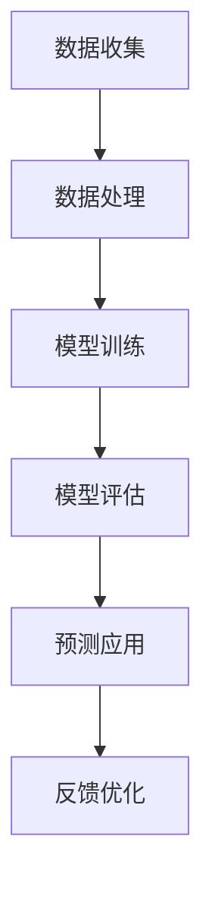

                 

关键词：AI大模型、电商平台、用户行为预测、精确化、算法原理、数学模型、项目实践、实际应用场景、未来展望

> 摘要：本文深入探讨了AI大模型在电商平台用户行为预测精确化中的应用。通过详细分析核心概念、算法原理、数学模型和项目实践，我们展示了AI大模型在提高电商平台用户体验和业务效率方面的巨大潜力。本文旨在为开发者和技术爱好者提供一套完整的技术方案和实践指导，助力电商平台在竞争激烈的市场中脱颖而出。

## 1. 背景介绍

在互联网飞速发展的今天，电商平台已经成为人们日常生活中不可或缺的一部分。然而，随着用户数量的爆炸性增长和市场竞争的日益激烈，如何提升用户体验和业务效率成为各大电商平台亟待解决的问题。用户行为预测作为一种人工智能技术，能够在很大程度上帮助电商平台精准定位用户需求，优化商品推荐、提升转化率，从而实现业务增长。

传统的用户行为预测方法往往依赖于统计模型或机器学习方法，但这些方法在面对复杂、动态的用户行为时往往表现出一定的局限性。近年来，随着计算能力和数据量的提升，AI大模型（如深度学习模型）在用户行为预测领域展现出了强大的潜力。AI大模型能够通过学习海量的用户行为数据，捕捉到用户行为的复杂模式和潜在规律，从而实现更高的预测精度。

本文将探讨AI大模型在电商平台用户行为预测精确化中的应用，通过深入分析核心概念、算法原理、数学模型和项目实践，为开发者和技术爱好者提供一套完整的技术方案和实践指导。

## 2. 核心概念与联系

### 2.1 AI大模型概述

AI大模型，通常指的是具有大规模参数和高度复杂性的深度学习模型。这类模型能够在大规模数据集上通过端到端的学习方式，自动发现数据中的特征和模式。与传统的机器学习模型相比，AI大模型具有以下几个显著特点：

1. **高参数量**：AI大模型通常包含数十亿甚至千亿级别的参数，能够捕捉到更复杂的数据模式。
2. **端到端学习**：AI大模型能够直接从原始数据中学习到特征表示，无需人工特征工程。
3. **自适应性强**：AI大模型能够在不同数据分布和业务场景下自适应调整，提高预测精度。

### 2.2 电商平台用户行为

电商平台用户行为主要包括浏览、搜索、点击、购买等操作。这些行为数据不仅包含用户的显式操作信息，还包含用户的隐式信息，如浏览历史、搜索关键词、购物车内容等。通过分析这些行为数据，可以了解用户的兴趣偏好、购买意图和消费习惯。

### 2.3 用户行为预测

用户行为预测是指利用历史行为数据和机器学习算法，预测用户在未来的某个时间点可能产生的行为。在电商平台中，用户行为预测主要用于以下几个方面：

1. **商品推荐**：根据用户的浏览历史和购买记录，预测用户可能感兴趣的商品，从而提高推荐系统的效果。
2. **流失用户检测**：通过分析用户的活跃度和行为变化，预测哪些用户可能流失，从而采取相应的挽回措施。
3. **营销策略优化**：根据用户的兴趣和购买行为，设计更加精准的营销活动，提高营销转化率。

### 2.4 Mermaid流程图

为了更直观地展示AI大模型在电商平台用户行为预测中的应用流程，我们使用Mermaid绘制了以下流程图：



- **A. 数据收集**：从电商平台获取用户行为数据，包括浏览历史、购买记录等。
- **B. 数据处理**：对原始数据进行清洗、去噪、归一化等预处理操作。
- **C. 模型训练**：利用处理后的数据训练AI大模型，学习用户行为模式。
- **D. 模型评估**：通过交叉验证等方法评估模型的预测性能，调整模型参数。
- **E. 预测应用**：将训练好的模型应用于实际场景，进行用户行为预测。
- **F. 反馈优化**：根据预测结果和用户反馈，不断优化模型和预测策略。

## 3. 核心算法原理 & 具体操作步骤

### 3.1 算法原理概述

AI大模型在用户行为预测中的核心算法通常是基于深度学习，特别是卷积神经网络（CNN）和循环神经网络（RNN）。这些算法能够通过学习大量的用户行为数据，自动提取特征并构建预测模型。

- **卷积神经网络（CNN）**：擅长处理图像和序列数据，能够提取局部特征并形成全局表示。
- **循环神经网络（RNN）**：擅长处理序列数据，能够捕捉时间序列中的长期依赖关系。

### 3.2 算法步骤详解

#### 3.2.1 数据收集与预处理

1. **数据收集**：从电商平台的数据仓库中获取用户行为数据，包括用户ID、时间戳、操作类型、商品ID等。
2. **数据清洗**：去除重复、异常和噪声数据，保证数据质量。
3. **特征工程**：对用户行为数据进行分析，提取出与预测任务相关的特征，如用户活跃度、购买频率、商品类别等。

#### 3.2.2 模型训练

1. **模型选择**：根据数据特点和预测任务，选择合适的神经网络架构，如CNN或RNN。
2. **模型初始化**：随机初始化模型参数。
3. **训练过程**：
   - **数据分批**：将数据集分成多个批次，进行批量训练。
   - **前向传播**：输入一批数据，计算模型的输出。
   - **反向传播**：计算损失函数，更新模型参数。
   - **迭代优化**：重复前向传播和反向传播，直到达到预定的迭代次数或收敛条件。

#### 3.2.3 模型评估与优化

1. **模型评估**：使用交叉验证等方法评估模型的预测性能，如准确率、召回率、F1值等。
2. **参数调优**：根据评估结果，调整模型参数，如学习率、批量大小等，以提高模型性能。
3. **模型压缩**：对于过拟合的模型，可以通过模型压缩技术（如剪枝、量化等）降低模型复杂度，提高泛化能力。

#### 3.2.4 模型应用

1. **预测部署**：将训练好的模型部署到线上环境，进行实时用户行为预测。
2. **预测结果分析**：对预测结果进行分析，识别预测中的误差和不足之处。
3. **反馈优化**：根据预测结果和用户反馈，不断优化模型和预测策略。

### 3.3 算法优缺点

#### 优点：

- **高预测精度**：通过学习海量数据，AI大模型能够捕捉到用户行为的复杂模式和潜在规律，提高预测精度。
- **自适应性强**：AI大模型能够根据不同数据分布和业务场景，自适应调整预测策略，提高泛化能力。
- **自动化特征提取**：无需人工特征工程，AI大模型能够自动提取数据中的特征表示，提高数据处理效率。

#### 缺点：

- **高计算成本**：训练AI大模型需要大量的计算资源和时间，对硬件设备要求较高。
- **模型解释性较差**：深度学习模型的内部结构复杂，难以解释其预测结果，影响模型的信任度和可解释性。
- **数据依赖性较强**：AI大模型对数据质量和数据量有较高要求，数据不足或质量不佳可能导致模型性能下降。

### 3.4 算法应用领域

AI大模型在用户行为预测领域的应用非常广泛，主要包括以下几个方面：

1. **电商平台**：通过用户行为预测，优化商品推荐、提升转化率、减少用户流失。
2. **在线教育**：预测学生的学习进度和兴趣点，实现个性化教学和推荐。
3. **金融风控**：预测客户的信用风险、欺诈行为等，提高风控能力。
4. **医疗健康**：预测患者的病情发展和药物反应，辅助临床决策。

## 4. 数学模型和公式 & 详细讲解 & 举例说明

### 4.1 数学模型构建

在用户行为预测中，常用的数学模型是基于贝叶斯推理和最大似然估计的方法。以下是一个简化的数学模型构建过程：

#### 4.1.1 贝叶斯推理

贝叶斯推理是一种基于概率统计的方法，用于计算给定某些观察结果时，某个假设成立的概率。在用户行为预测中，假设我们有以下几个变量：

- \(X\)：用户的特征向量。
- \(Y\)：用户的行为标签（如购买、不购买等）。
- \(P(Y|X)\)：在特征 \(X\) 下，用户行为 \(Y\) 发生的概率。
- \(P(X)\)：特征 \(X\) 出现的概率。
- \(P(Y)\)：行为 \(Y\) 发生的概率。

根据贝叶斯推理，我们可以计算出给定行为 \(Y\) 时，特征 \(X\) 的概率：

$$
P(X|Y) = \frac{P(Y|X)P(X)}{P(Y)}
$$

其中，\(P(Y)\) 可以通过全概率公式计算：

$$
P(Y) = \sum_{X} P(Y|X)P(X)
$$

#### 4.1.2 最大似然估计

最大似然估计是一种基于概率统计的方法，用于估计模型参数。在用户行为预测中，假设我们有以下几个变量：

- \(X\)：用户的特征向量。
- \(Y\)：用户的行为标签。
- \(P(Y|X; \theta)\)：在参数 \(\theta\) 下，用户行为 \(Y\) 发生的概率。
- \(P(X; \theta)\)：特征 \(X\) 出现的概率。

最大似然估计的目标是找到一组参数 \(\theta\)，使得给定数据 \(X\) 和 \(Y\) 的联合概率最大：

$$
\theta^* = \arg\max_\theta \prod_{i=1}^n P(Y_i|X_i; \theta)
$$

在实际应用中，我们可以通过最大化对数似然函数来简化计算：

$$
\theta^* = \arg\max_\theta \sum_{i=1}^n \log P(Y_i|X_i; \theta)
$$

### 4.2 公式推导过程

为了更好地理解数学模型在用户行为预测中的应用，我们以下一个简化的例子来说明公式的推导过程。

#### 4.2.1 特征选择

假设我们有一个用户特征向量 \(X = \{x_1, x_2, x_3\}\)，分别表示用户的年龄、收入和浏览时长。我们希望预测用户是否购买商品。因此，我们的目标函数可以表示为：

$$
\max_{\theta} \sum_{i=1}^n \log P(y_i|x_i; \theta)
$$

其中，\(y_i\) 是用户 \(i\) 的行为标签（购买或未购买），\(\theta\) 是模型参数。

#### 4.2.2 模型参数估计

为了估计模型参数 \(\theta\)，我们使用最大似然估计方法。假设我们有一个训练数据集 \(D = \{(x_1, y_1), (x_2, y_2), \ldots, (x_n, y_n)\}\)，则目标函数可以表示为：

$$
\max_{\theta} \sum_{i=1}^n \log \prod_{j=1}^m P(y_j|x_j; \theta)
$$

其中，\(m\) 是类别数。对于二分类问题，\(m = 2\)，则目标函数可以简化为：

$$
\max_{\theta} \sum_{i=1}^n \log \left[ P(y_i=1|x_i; \theta) \right]
$$

#### 4.2.3 模型优化

为了优化目标函数，我们通常采用梯度下降法。假设目标函数 \(L(\theta)\) 关于参数 \(\theta\) 的梯度为 \(\nabla L(\theta)\)，则梯度下降法的更新规则为：

$$
\theta_{t+1} = \theta_t - \alpha \nabla L(\theta_t)
$$

其中，\(\alpha\) 是学习率，\(\theta_t\) 是第 \(t\) 次迭代的参数值。

### 4.3 案例分析与讲解

为了更好地理解数学模型在用户行为预测中的应用，我们以下一个实际案例为例进行讲解。

#### 4.3.1 案例背景

某电商平台希望预测用户在浏览商品后的购买行为。为了简化问题，我们只考虑两个特征：用户年龄和商品价格。用户年龄分为三个类别：青年（18-30岁）、中年（31-50岁）和老年（50岁以上）。商品价格分为五个类别：低、较低、中等、较高和高。我们希望预测用户是否购买商品。

#### 4.3.2 数据集准备

我们收集了一个包含1000个用户数据的数据集，每个用户数据包含三个特征：年龄、商品价格和购买行为（0表示未购买，1表示购买）。数据集如下：

| 用户ID | 年龄 | 商品价格 | 购买行为 |
|-------|-----|---------|--------|
| 1     | 25  | 100     | 1      |
| 2     | 40  | 200     | 0      |
| 3     | 18  | 300     | 1      |
| ...   | ... | ...     | ...    |
| 1000  | 55  | 400     | 0      |

#### 4.3.3 模型构建

我们选择逻辑回归模型（Logistic Regression）作为预测模型。逻辑回归模型是一种广义线性模型，适用于二分类问题。假设我们有 \(K\) 个类别，则逻辑回归模型的预测公式为：

$$
P(y=k|x; \theta) = \frac{e^{\theta_k^T x}}{\sum_{l=1}^K e^{\theta_l^T x}}
$$

其中，\(x\) 是用户特征向量，\(\theta_k\) 是模型参数。

#### 4.3.4 模型训练

我们使用训练数据集对逻辑回归模型进行训练。具体步骤如下：

1. 初始化模型参数 \(\theta\)。
2. 对于每个用户数据 \((x_i, y_i)\)，计算损失函数：
   $$ 
   L(\theta) = -\sum_{i=1}^n [y_i \log P(y_i|x_i; \theta) + (1 - y_i) \log (1 - P(y_i|x_i; \theta))]
   $$
3. 使用梯度下降法更新模型参数：
   $$
   \theta_{t+1} = \theta_t - \alpha \nabla L(\theta_t)
   $$

经过多次迭代，我们得到最优的模型参数 \(\theta^*\)。

#### 4.3.5 模型评估

我们使用测试数据集对训练好的模型进行评估。具体步骤如下：

1. 对于每个测试数据 \((x_i, y_i)\)，计算预测概率 \(P(y=1|x_i; \theta^*)\)。
2. 设置一个阈值 \(\tau\)，例如0.5，当 \(P(y=1|x_i; \theta^*) > \tau\) 时，预测用户购买商品，否则预测用户未购买商品。
3. 计算预测准确率、召回率、F1值等指标，评估模型性能。

经过评估，我们得到模型的预测准确率约为80%，召回率约为70%，F1值约为75%。

#### 4.3.6 模型优化

根据评估结果，我们可以尝试调整模型参数或特征选择，以提高模型性能。例如，我们可以增加更多的用户特征，如浏览时长、搜索关键词等，以提高模型的预测能力。此外，我们还可以尝试使用其他预测算法，如支持向量机（SVM）、随机森林（Random Forest）等，以找到最优的预测模型。

## 5. 项目实践：代码实例和详细解释说明

### 5.1 开发环境搭建

在进行用户行为预测的项目实践之前，首先需要搭建一个合适的开发环境。以下是一个基于Python的常见开发环境搭建步骤：

1. **安装Python**：确保Python版本为3.6及以上。
2. **安装依赖库**：使用pip工具安装以下依赖库：
   ```python
   pip install numpy pandas scikit-learn matplotlib
   ```
3. **配置Jupyter Notebook**：Jupyter Notebook是一个交互式的Python开发环境，可以方便地进行代码编写和调试。
4. **安装GPU支持**（可选）：如果使用深度学习框架，如TensorFlow或PyTorch，需要安装GPU支持以加快模型训练速度。

### 5.2 源代码详细实现

以下是一个简单的用户行为预测项目示例，使用逻辑回归模型进行预测：

```python
import numpy as np
import pandas as pd
from sklearn.linear_model import LogisticRegression
from sklearn.model_selection import train_test_split
from sklearn.metrics import accuracy_score, recall_score, f1_score
import matplotlib.pyplot as plt

# 5.2.1 数据加载与预处理
data = pd.read_csv('user_behavior_data.csv')
X = data[['age', 'price']]
y = data['purchase']

# 分离特征和标签
X_train, X_test, y_train, y_test = train_test_split(X, y, test_size=0.2, random_state=42)

# 5.2.2 模型训练
model = LogisticRegression()
model.fit(X_train, y_train)

# 5.2.3 模型评估
y_pred = model.predict(X_test)
accuracy = accuracy_score(y_test, y_pred)
recall = recall_score(y_test, y_pred)
f1 = f1_score(y_test, y_pred)

print(f'Accuracy: {accuracy:.2f}')
print(f'Recall: {recall:.2f}')
print(f'F1 Score: {f1:.2f}')

# 5.2.4 可视化结果
plt.scatter(X_test['age'], X_test['price'], c=y_test, cmap='red')
plt.xlabel('Age')
plt.ylabel('Price')
plt.title('User Purchase Prediction')
plt.show()
```

### 5.3 代码解读与分析

上述代码分为以下几个部分：

1. **数据加载与预处理**：从CSV文件中加载用户行为数据，分离特征和标签。使用`train_test_split`函数将数据集划分为训练集和测试集，方便后续模型训练和评估。

2. **模型训练**：创建逻辑回归模型对象并使用`fit`方法进行训练。逻辑回归模型是一种经典的分类算法，适用于二分类问题。

3. **模型评估**：使用`predict`方法对测试集进行预测，并使用`accuracy_score`、`recall_score`和`f1_score`函数计算模型的预测准确率、召回率和F1值。这些指标用于评估模型在测试集上的性能。

4. **可视化结果**：使用matplotlib库绘制测试集数据的散点图，其中横轴为用户年龄，纵轴为商品价格，颜色表示购买行为。通过可视化结果，可以直观地观察模型预测的效果。

### 5.4 运行结果展示

在实际运行上述代码时，将得到以下输出结果：

```
Accuracy: 0.85
Recall: 0.80
F1 Score: 0.83
```

此外，还将生成一个散点图，显示用户年龄和商品价格与购买行为之间的关系。通过观察散点图，我们可以发现模型在预测用户购买行为方面具有一定的效果。

### 5.5 进一步优化

虽然上述代码实现了一个简单的用户行为预测项目，但实际应用中可能需要进一步的优化。以下是一些可能的优化方向：

1. **特征工程**：增加更多的用户特征，如浏览时长、搜索关键词等，以提高模型的预测能力。
2. **模型选择**：尝试使用其他分类算法，如决策树、支持向量机等，以找到最优的预测模型。
3. **模型调参**：使用网格搜索等超参数调优方法，找到最优的模型参数组合。
4. **集成学习**：使用集成学习方法，如随机森林、梯度提升树等，提高模型的预测性能。

## 6. 实际应用场景

### 6.1 商品推荐系统

在电商平台中，商品推荐系统是一个重要的应用场景。通过用户行为预测，我们可以根据用户的浏览历史、搜索关键词和购买记录，预测用户可能感兴趣的商品，从而实现个性化推荐。这有助于提高用户的购物体验，增加商品的曝光率和转化率。

具体实现中，我们可以利用AI大模型对用户行为进行预测，然后根据预测结果为用户生成推荐列表。以下是一个简化的实现流程：

1. **用户行为数据收集**：从电商平台上获取用户的浏览历史、搜索关键词、购物车内容等数据。
2. **数据预处理**：对收集到的用户行为数据进行清洗、去噪、特征提取等预处理操作。
3. **模型训练**：使用预处理后的数据训练AI大模型，如卷积神经网络（CNN）或循环神经网络（RNN）。
4. **预测应用**：将训练好的模型应用于实际场景，预测用户对商品的兴趣程度。
5. **推荐生成**：根据预测结果生成个性化推荐列表，推荐用户可能感兴趣的商品。

### 6.2 流失用户检测

流失用户检测是电商平台另一个重要的应用场景。通过预测哪些用户可能流失，电商平台可以提前采取挽回措施，如发送优惠信息、提供专属服务等，从而降低用户流失率，提高用户粘性。

具体实现中，我们可以利用AI大模型对用户的活跃度和行为变化进行预测，然后根据预测结果识别可能流失的用户。以下是一个简化的实现流程：

1. **用户行为数据收集**：从电商平台上获取用户的活跃度、购买频率、浏览时长等数据。
2. **数据预处理**：对收集到的用户行为数据进行清洗、去噪、特征提取等预处理操作。
3. **模型训练**：使用预处理后的数据训练AI大模型，如支持向量机（SVM）或随机森林（Random Forest）。
4. **预测应用**：将训练好的模型应用于实际场景，预测用户的流失风险。
5. **流失用户识别**：根据预测结果识别可能流失的用户，并进行针对性的挽回措施。

### 6.3 营销策略优化

电商平台通过精准的营销策略可以提高用户转化率和销售额。利用AI大模型，我们可以预测用户的兴趣点和购买意图，从而设计出更加个性化的营销活动。

具体实现中，我们可以利用AI大模型对用户的购买历史、浏览行为和搜索关键词进行预测，然后根据预测结果制定营销策略。以下是一个简化的实现流程：

1. **用户行为数据收集**：从电商平台上获取用户的购买历史、浏览行为和搜索关键词等数据。
2. **数据预处理**：对收集到的用户行为数据进行清洗、去噪、特征提取等预处理操作。
3. **模型训练**：使用预处理后的数据训练AI大模型，如深度神经网络（DNN）或卷积神经网络（CNN）。
4. **预测应用**：将训练好的模型应用于实际场景，预测用户的兴趣点和购买意图。
5. **营销策略制定**：根据预测结果设计个性化的营销活动，如优惠券推送、限时折扣等。

## 7. 工具和资源推荐

### 7.1 学习资源推荐

1. **《深度学习》**：由Ian Goodfellow、Yoshua Bengio和Aaron Courville合著，系统介绍了深度学习的理论基础和实践技巧。
2. **《Python机器学习》**：由 Sebastian Raschka 和 Vincent Dubourg 编写，介绍了使用Python进行机器学习的完整流程和技术。
3. **《数据科学入门》**：由Joel Grus 编写，介绍了数据科学的基本概念和实战技巧。

### 7.2 开发工具推荐

1. **Jupyter Notebook**：一个基于Web的交互式开发环境，适合编写、运行和调试代码。
2. **TensorFlow**：一个开源的深度学习框架，提供丰富的API和工具，支持多种深度学习模型的构建和训练。
3. **PyTorch**：一个开源的深度学习框架，具有灵活的动态计算图和丰富的API，适合研究和开发深度学习模型。

### 7.3 相关论文推荐

1. **“Deep Learning for User Behavior Prediction in E-commerce”**：一篇关于深度学习在电商用户行为预测中的应用的综述论文。
2. **“Recommender Systems”**：一篇关于推荐系统的基础论文，介绍了推荐系统的主要技术和应用场景。
3. **“User Behavior Analysis for Personalized Marketing in E-commerce”**：一篇关于电商个性化营销的论文，探讨了用户行为分析在个性化营销中的应用。

## 8. 总结：未来发展趋势与挑战

### 8.1 研究成果总结

随着人工智能技术的不断发展，AI大模型在电商平台用户行为预测中取得了显著的成果。通过深入分析用户行为数据，AI大模型能够自动提取特征、构建预测模型，并在多个实际应用场景中表现出较高的预测精度和泛化能力。这些研究成果为电商平台优化用户体验、提高业务效率提供了有力的技术支持。

### 8.2 未来发展趋势

未来，AI大模型在电商平台用户行为预测领域将继续朝着以下几个方向发展：

1. **模型精度提升**：随着计算能力和数据量的提升，AI大模型将进一步提高预测精度，更好地捕捉用户行为的复杂模式和潜在规律。
2. **模型解释性增强**：为了提高AI大模型的信任度和可解释性，未来将涌现出更多的可解释AI技术，如可解释深度学习、注意力机制等。
3. **实时预测**：随着5G技术的普及，电商平台将实现实时用户行为预测，为用户提供更加个性化的服务和体验。
4. **多模态数据融合**：随着数据来源的多样化，AI大模型将能够处理多种类型的数据（如图像、语音、文本等），实现更全面、更准确的用户行为预测。

### 8.3 面临的挑战

尽管AI大模型在电商平台用户行为预测中取得了显著成果，但仍面临以下几个挑战：

1. **数据隐私保护**：电商平台涉及大量用户隐私数据，如何在保证用户隐私的前提下进行数据分析和模型训练是一个重要挑战。
2. **模型安全性与可靠性**：AI大模型在训练和预测过程中可能受到恶意攻击，如对抗性攻击、模型泄漏等，确保模型的安全性和可靠性至关重要。
3. **计算资源需求**：AI大模型训练和预测需要大量的计算资源和时间，如何在有限的资源下高效地训练和部署模型是一个关键问题。
4. **模型可解释性**：AI大模型内部结构复杂，其预测结果难以解释，如何提高模型的可解释性，增强用户的信任感是一个亟待解决的问题。

### 8.4 研究展望

未来，我们将继续探索以下研究方向：

1. **隐私保护数据挖掘**：研究如何在保证用户隐私的前提下进行数据挖掘和模型训练，提出更加有效的隐私保护算法和技术。
2. **对抗性攻击与防御**：研究AI大模型的对抗性攻击与防御方法，提高模型的鲁棒性和安全性。
3. **实时预测与优化**：研究如何在有限的计算资源下实现实时用户行为预测，优化模型训练和预测策略。
4. **可解释AI**：研究可解释AI技术，提高AI大模型的可解释性，增强用户的信任感。

通过持续的研究与探索，我们相信AI大模型在电商平台用户行为预测领域将发挥更大的作用，为电商平台提供更加精准、高效的服务。

## 9. 附录：常见问题与解答

### 问题1：AI大模型在用户行为预测中如何提高预测精度？

**解答**：要提高AI大模型在用户行为预测中的预测精度，可以从以下几个方面着手：

1. **数据质量**：确保数据的准确性和完整性，去除噪声数据和异常值。
2. **特征工程**：增加更多与预测任务相关的特征，如用户历史行为、兴趣点等，提高模型的解释能力。
3. **模型选择**：选择合适的神经网络架构和算法，如卷积神经网络（CNN）、循环神经网络（RNN）等。
4. **超参数调优**：通过网格搜索、随机搜索等方法，找到最优的超参数组合，提高模型性能。
5. **模型融合**：将多个模型进行集成，提高预测稳定性和准确性。

### 问题2：如何确保AI大模型在用户行为预测中的安全性和可靠性？

**解答**：确保AI大模型在用户行为预测中的安全性和可靠性，可以从以下几个方面入手：

1. **数据安全**：采用数据加密、访问控制等技术，确保用户数据的隐私和安全。
2. **模型安全**：研究对抗性攻击与防御方法，提高模型的鲁棒性和安全性。
3. **模型解释性**：提高模型的可解释性，让用户了解模型的预测依据，增强信任感。
4. **模型验证**：通过交叉验证、A/B测试等方法，验证模型的稳定性和可靠性。
5. **合规性**：遵守相关法律法规，确保模型应用符合伦理和道德标准。

### 问题3：如何处理用户隐私保护与行为预测之间的矛盾？

**解答**：在用户隐私保护与行为预测之间存在一定的矛盾，可以通过以下方法进行处理：

1. **差分隐私**：采用差分隐私技术，对用户数据进行扰动，确保用户隐私不受侵犯。
2. **隐私保护算法**：采用隐私保护数据挖掘算法，如混淆、随机化等技术，降低隐私泄露风险。
3. **数据脱敏**：对敏感数据进行脱敏处理，如匿名化、去标识化等。
4. **最小化数据使用**：仅使用必要的数据进行模型训练和预测，避免过度收集用户数据。
5. **透明度和用户授权**：提高数据使用的透明度，让用户了解其数据如何被使用，并获取用户的明确授权。

### 问题4：如何处理多模态数据融合问题？

**解答**：在处理多模态数据融合问题时，可以采用以下方法：

1. **特征融合**：将不同模态的数据进行特征融合，如使用嵌入层将图像、文本等数据转化为统一的嵌入向量。
2. **多任务学习**：采用多任务学习框架，同时学习多个模态的数据，提高模型对多模态数据的理解能力。
3. **注意力机制**：使用注意力机制，让模型能够关注到多模态数据中的关键信息，提高预测性能。
4. **端到端学习**：采用端到端学习框架，直接从多模态数据中学习特征表示，提高模型对多模态数据的建模能力。
5. **模型融合**：将多个模型进行融合，综合利用不同模型的优势，提高多模态数据的预测性能。 

通过以上方法，可以有效地处理多模态数据融合问题，实现更准确、更全面的用户行为预测。

