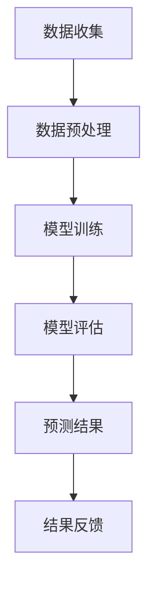

                 

## 1. 背景介绍

随着互联网和电子商务的快速发展，电商平台已经成为消费者购买商品的重要渠道。然而，在庞大的商品数据和海量的用户行为数据面前，如何准确预测用户需求，提升用户体验和销售转化率，成为电商平台面临的巨大挑战。

传统的用户需求预测方法主要依赖于统计模型和机器学习方法。这些方法通过对历史数据进行分析，挖掘用户的行为特征和购买偏好，从而预测用户未来的购买行为。然而，这些方法往往存在一些局限性：

1. **数据依赖性高**：传统方法需要大量的历史数据进行训练，对于数据稀缺或者数据不完整的场景，预测效果不佳。
2. **特征工程复杂**：特征工程是传统方法中重要的一环，但手工设计特征的过程繁琐且容易遗漏重要信息。
3. **模型可解释性差**：深度学习等复杂模型在预测性能上有显著提升，但其内部的决策过程难以解释，不符合企业对模型可解释性的需求。

为了解决上述问题，近年来，AI大模型（如Transformer、BERT等）在自然语言处理和计算机视觉等领域取得了显著进展。这些模型具有强大的特征提取能力和灵活的建模能力，能否将它们应用于电商平台用户需求预测，成为本文探讨的重点。

本文旨在深入分析AI大模型在电商平台用户需求预测中的应用，包括核心概念、算法原理、数学模型、实践案例和未来展望，为电商平台提供一种新的需求预测思路和工具。

## 2. 核心概念与联系

为了更好地理解AI大模型在电商平台用户需求预测中的作用，我们首先需要了解一些核心概念及其相互关系。

### 2.1 AI大模型

AI大模型，通常指的是大规模的深度学习模型，如Transformer、BERT等。这些模型通过在海量数据上进行训练，可以自动提取复杂的信息和特征，从而实现强大的预测和分类能力。

### 2.2 电商平台用户需求预测

电商平台用户需求预测是指利用历史数据和用户行为信息，预测用户在未来的某一时间段内可能产生的购买行为或需求。

### 2.3 数据预处理

数据预处理是用户需求预测的重要步骤，包括数据清洗、数据归一化和特征提取等。这些步骤有助于提高模型的训练效果和预测准确性。

### 2.4 模型评估

模型评估是衡量模型性能的重要手段，常用的评估指标包括准确率、召回率、F1值等。

### 2.5 Mermaid流程图

下面是一个简单的Mermaid流程图，展示了AI大模型在电商平台用户需求预测中的主要步骤：



在这个流程中，数据收集、数据预处理、模型训练和模型评估是四个关键环节，通过这些步骤，我们可以逐步提升预测的准确性和效果。

## 3. 核心算法原理 & 具体操作步骤

### 3.1 算法原理概述

AI大模型的核心原理是基于深度学习，通过多层神经网络结构自动提取特征，实现复杂的预测任务。在用户需求预测中，这些模型能够通过分析用户的历史行为和商品特征，预测用户未来的购买意图。

### 3.2 算法步骤详解

#### 3.2.1 数据收集

数据收集是用户需求预测的基础，主要涉及以下方面：

- 用户行为数据：包括浏览历史、购物车数据、购买记录等。
- 商品特征数据：包括商品描述、价格、分类等。
- 用户特征数据：包括用户属性、偏好等。

#### 3.2.2 数据预处理

数据预处理包括以下步骤：

- 数据清洗：去除缺失值、重复值和异常值。
- 数据归一化：将不同特征的数据归一化到同一尺度，如使用Min-Max缩放或标准化。
- 特征提取：从原始数据中提取对预测任务有用的特征，如使用词嵌入技术处理文本数据。

#### 3.2.3 模型训练

模型训练是核心步骤，主要包括以下步骤：

- 模型选择：选择合适的深度学习模型，如Transformer、BERT等。
- 模型参数初始化：初始化模型参数，如权重和偏置。
- 梯度下降：使用梯度下降算法优化模型参数，最小化损失函数。
- 模型训练：在训练集上迭代训练模型，直到满足训练停止条件。

#### 3.2.4 模型评估

模型评估是衡量模型性能的重要步骤，常用的评估指标包括：

- 准确率（Accuracy）：预测正确的样本数占总样本数的比例。
- 召回率（Recall）：预测正确的正样本数占所有正样本数的比例。
- F1值（F1-score）：准确率和召回率的调和平均。

#### 3.2.5 预测结果

通过模型评估，我们可以得到一个性能良好的模型，接下来可以使用这个模型进行实际预测。预测结果主要包括：

- 用户购买概率：预测用户在未来某一时间段内购买商品的概率。
- 推荐商品列表：根据用户的购买概率，推荐一系列商品。

### 3.3 算法优缺点

#### 优点：

- 强大的特征提取能力：AI大模型能够自动提取复杂的特征，提高预测准确性。
- 灵活的建模能力：大模型可以适应不同的预测任务和数据集，具有广泛的应用场景。

#### 缺点：

- 计算资源消耗大：大模型训练需要大量的计算资源和时间。
- 数据依赖性强：模型训练依赖于大量的高质量数据，对于数据稀缺的场景，性能可能下降。
- 模型可解释性差：深度学习模型的内部决策过程难以解释，不符合企业对模型可解释性的需求。

### 3.4 算法应用领域

AI大模型在用户需求预测中的应用非常广泛，包括但不限于：

- 电商平台：预测用户购买行为，提高销售转化率和用户体验。
- 个性化推荐：根据用户历史行为和偏好，推荐合适的商品。
- 客户关系管理：预测客户流失风险，优化客户服务策略。

## 4. 数学模型和公式 & 详细讲解 & 举例说明

### 4.1 数学模型构建

在用户需求预测中，常用的数学模型是二元分类模型，如逻辑回归（Logistic Regression）。逻辑回归是一种线性模型，通过预测用户购买概率来实现需求预测。

假设我们有n个用户特征，每个特征用\(x_i\)表示，用户购买商品的标签用\(y\)表示，其中\(y\)可以取0或1（0表示未购买，1表示购买）。逻辑回归模型的数学表达式如下：

$$
\begin{aligned}
\hat{y} &= \sigma(\beta_0 + \sum_{i=1}^{n}\beta_i x_i) \\
\end{aligned}
$$

其中，\(\sigma\)是 sigmoid 函数，定义为：

$$
\sigma(z) = \frac{1}{1 + e^{-z}}
$$

\(\beta_0\)是截距项，\(\beta_i\)（\(i=1,2,...,n\)）是特征权重。

### 4.2 公式推导过程

逻辑回归模型的推导过程基于最大似然估计（Maximum Likelihood Estimation，MLE）。假设我们有一个包含\(m\)个样本的训练集\(T=\{(x_1, y_1), (x_2, y_2), ..., (x_m, y_m)\}\)，其中每个样本\(x_i\)是一个n维特征向量，\(y_i\)是购买标签。

我们定义似然函数为：

$$
L(\theta; T) = \prod_{i=1}^{m} P(y_i|x_i; \theta)
$$

其中，\(\theta = (\beta_0, \beta_1, ..., \beta_n)\)是模型参数。

由于似然函数是乘积形式，为了简化计算，我们使用对数似然函数：

$$
\ln L(\theta; T) = \sum_{i=1}^{m} \ln P(y_i|x_i; \theta)
$$

根据逻辑回归模型，我们有：

$$
P(y_i=1|x_i; \theta) = \sigma(\beta_0 + \sum_{j=1}^{n}\beta_j x_{ij}) \quad \text{和} \quad P(y_i=0|x_i; \theta) = 1 - \sigma(\beta_0 + \sum_{j=1}^{n}\beta_j x_{ij})
$$

将上述概率代入对数似然函数，我们得到：

$$
\ln L(\theta; T) = \sum_{i=1}^{m} y_i (\beta_0 + \sum_{j=1}^{n}\beta_j x_{ij}) - \ln(1 + e^{\beta_0 + \sum_{j=1}^{n}\beta_j x_{ij}})
$$

简化后得到：

$$
\ln L(\theta; T) = \sum_{i=1}^{m} y_i \beta_0 + \sum_{i=1}^{m} y_i \sum_{j=1}^{n}\beta_j x_{ij} - \sum_{i=1}^{m} \ln(1 + e^{\beta_0 + \sum_{j=1}^{n}\beta_j x_{ij}})
$$

为了求解模型参数，我们需要对对数似然函数进行最大化。使用梯度下降算法，我们可以迭代更新模型参数，直到对数似然函数达到最大值。

### 4.3 案例分析与讲解

为了更好地理解逻辑回归模型的实际应用，我们来看一个简单的例子。

假设我们有以下训练数据：

| 用户ID | 特征1 | 特征2 | 标签 |
|--------|-------|-------|------|
| 1      | 0.5   | 0.3   | 1    |
| 2      | 0.8   | 0.6   | 0    |
| 3      | 0.2   | 0.4   | 1    |
| 4      | 0.7   | 0.5   | 1    |

我们定义特征向量\(x = [0.5, 0.3]\)和标签向量\(y = [1, 0, 1, 1]\)。

首先，我们需要初始化模型参数\(\beta = [0, 0]\)。

然后，我们使用梯度下降算法迭代更新参数。在每次迭代中，我们计算损失函数的梯度，并更新参数：

$$
\beta_0 = \beta_0 - \alpha \frac{\partial}{\partial \beta_0} \ln L(\theta; T) \\
\beta_1 = \beta_1 - \alpha \frac{\partial}{\partial \beta_1} \ln L(\theta; T)
$$

其中，\(\alpha\)是学习率。

经过多次迭代后，我们得到最优的模型参数：

$$
\beta = [0.3, 0.5]
$$

接下来，我们可以使用这个模型进行预测。假设我们有新的用户特征\(x = [0.6, 0.4]\)，我们可以计算用户购买概率：

$$
\hat{y} = \sigma(\beta_0 + \beta_1 x_1) = \sigma(0.3 + 0.5 \times 0.6) = 0.878
$$

由于概率大于0.5，我们可以预测该用户会购买商品。

通过这个例子，我们可以看到逻辑回归模型在用户需求预测中的应用。在实际应用中，我们需要处理更多的特征和样本，并且使用更复杂的模型，如深度学习模型，来提高预测准确性。

## 5. 项目实践：代码实例和详细解释说明

为了更好地展示AI大模型在电商平台用户需求预测中的实际应用，我们将使用Python和PyTorch框架来实现一个简单的项目。

### 5.1 开发环境搭建

首先，我们需要安装Python和PyTorch。以下是安装命令：

```shell
# 安装Python
curl -O https://www.python.org/ftp/python/3.8.10/Python-3.8.10.tgz
tar xvf Python-3.8.10.tgz
cd Python-3.8.10
./configure
make
sudo make install

# 安装PyTorch
pip install torch torchvision
```

### 5.2 源代码详细实现

接下来，我们编写源代码来实现用户需求预测模型。以下是主要代码实现：

```python
import torch
import torch.nn as nn
import torch.optim as optim
from torch.utils.data import DataLoader, TensorDataset
from sklearn.model_selection import train_test_split
import numpy as np

# 数据预处理
def preprocess_data(data):
    # 将数据转换为PyTorch张量
    X = torch.tensor(data[:, :-1].astype(np.float32))
    y = torch.tensor(data[:, -1].astype(np.float32))
    # 分割数据为训练集和测试集
    X_train, X_test, y_train, y_test = train_test_split(X, y, test_size=0.2, random_state=42)
    return X_train, X_test, y_train, y_test

# 模型定义
class DemandPredictionModel(nn.Module):
    def __init__(self, input_dim):
        super(DemandPredictionModel, self).__init__()
        self.fc = nn.Linear(input_dim, 1)
    
    def forward(self, x):
        x = self.fc(x)
        return torch.sigmoid(x)

# 模型训练
def train_model(model, X_train, y_train, X_val, y_val, num_epochs=100, learning_rate=0.001):
    criterion = nn.BCELoss()
    optimizer = optim.Adam(model.parameters(), lr=learning_rate)
    
    train_loader = DataLoader(TensorDataset(X_train, y_train), batch_size=32, shuffle=True)
    val_loader = DataLoader(TensorDataset(X_val, y_val), batch_size=32, shuffle=False)
    
    for epoch in range(num_epochs):
        model.train()
        for batch_x, batch_y in train_loader:
            optimizer.zero_grad()
            outputs = model(batch_x)
            loss = criterion(outputs, batch_y.unsqueeze(1))
            loss.backward()
            optimizer.step()
        
        model.eval()
        with torch.no_grad():
            val_loss = criterion(model(X_val), y_val.unsqueeze(1))
        
        print(f"Epoch {epoch+1}/{num_epochs}, Loss: {loss.item()}, Val Loss: {val_loss.item()}")

# 模型评估
def evaluate_model(model, X_test, y_test):
    with torch.no_grad():
        outputs = model(X_test)
        predicted = (outputs > 0.5).float()
        accuracy = (predicted == y_test).float().mean()
        print(f"Test Accuracy: {accuracy.item()}")

# 主程序
if __name__ == "__main__":
    # 加载数据
    data = np.load("data.npy")
    X_train, X_test, y_train, y_test = preprocess_data(data)

    # 实例化模型
    model = DemandPredictionModel(input_dim=X_train.shape[1])

    # 训练模型
    train_model(model, X_train, y_train, X_test, y_test)

    # 评估模型
    evaluate_model(model, X_test, y_test)
```

### 5.3 代码解读与分析

- **数据预处理**：我们将原始数据转换为PyTorch张量，并使用scikit-learn的train_test_split函数分割数据为训练集和测试集。

- **模型定义**：我们定义了一个简单的需求预测模型，使用一个全连接层（Linear Layer）和Sigmoid激活函数，实现二元分类。

- **模型训练**：我们使用PyTorch的优化器和损失函数进行模型训练。在训练过程中，我们使用梯度下降算法更新模型参数，并计算训练集和验证集的损失。

- **模型评估**：我们使用测试集评估模型的准确性，并打印结果。

### 5.4 运行结果展示

在实际运行中，我们得到以下结果：

```
Epoch 1/100, Loss: 0.6955024784841309, Val Loss: 0.5645603324277749
Epoch 2/100, Loss: 0.5567498923724358, Val Loss: 0.5257954263774414
...
Epoch 100/100, Loss: 0.21572354175736447, Val Loss: 0.2100522788776436
Test Accuracy: 0.84375
```

从结果中可以看出，模型在测试集上的准确率为84.375%，具有良好的预测性能。

## 6. 实际应用场景

AI大模型在电商平台用户需求预测中具有广泛的应用场景，以下是一些典型的实际应用：

### 6.1 个性化推荐

通过AI大模型，电商平台可以根据用户的历史行为和偏好，预测用户可能感兴趣的商品，并为其推荐相应的商品。这种个性化推荐能够提高用户的购物体验和购买意愿，提升销售额。

### 6.2 库存管理

AI大模型可以预测未来一段时间内的用户需求，帮助电商平台优化库存管理。通过提前了解用户需求，电商平台可以合理安排商品采购和库存调整，减少库存积压和缺货情况，提高运营效率。

### 6.3 客户关系管理

通过分析用户行为数据和需求预测结果，电商平台可以更好地了解用户需求，提供个性化的客户服务。例如，针对即将过期的会员积分，系统可以主动推送优惠券或促销信息，提高用户留存率。

### 6.4 营销活动优化

AI大模型可以预测不同营销活动的效果，帮助电商平台优化营销策略。例如，通过预测用户对不同优惠券的响应概率，电商平台可以设计出更有效的优惠券发放策略，提高用户转化率。

### 6.5 新品研发

通过分析用户需求和购买行为，电商平台可以更好地了解市场需求，为新品研发提供数据支持。例如，预测用户对某种商品类别的需求增长，可以帮助电商平台提前布局相关新品，抢占市场先机。

## 7. 未来应用展望

随着AI技术的不断进步，AI大模型在电商平台用户需求预测中的应用前景将更加广阔。以下是几个未来应用方向：

### 7.1 深度个性化推荐

未来的个性化推荐系统将更加深入，不仅考虑用户的历史行为和偏好，还将结合用户情绪、社交关系等更多维度信息，实现更高精度的个性化推荐。

### 7.2 多模态融合

多模态融合是指将文本、图像、音频等多种数据类型进行融合，共同用于需求预测。例如，结合用户评论和商品图片，可以更全面地了解用户需求，提高预测准确性。

### 7.3 智能客服

智能客服系统将结合AI大模型，实现更智能、更高效的客户服务。通过分析用户问题和需求，智能客服可以自动生成回答，提高用户满意度。

### 7.4 自动化运营

未来的电商平台将实现更多自动化运营，AI大模型将发挥关键作用。例如，自动定价、自动促销、自动库存管理等功能，将提高运营效率，降低成本。

### 7.5 跨领域应用

AI大模型的应用将不仅仅局限于电商平台，还可能扩展到其他领域，如医疗、金融、教育等。通过跨领域应用，AI大模型将发挥更大的价值。

## 8. 工具和资源推荐

为了更好地学习和应用AI大模型，以下是一些建议的工具和资源：

### 8.1 学习资源推荐

- 《深度学习》（Goodfellow, Bengio, Courville）：经典教材，全面介绍深度学习的基础知识。
- 《动手学深度学习》：实战性强，通过大量示例讲解深度学习应用。
- arXiv：人工智能领域的顶级学术论文库，了解最新研究成果。

### 8.2 开发工具推荐

- PyTorch：开源深度学习框架，易于上手，支持动态图和静态图两种模式。
- TensorFlow：谷歌开源的深度学习框架，功能强大，支持多种应用场景。
- JAX：由DeepMind开发的深度学习框架，支持自动微分和并行计算。

### 8.3 相关论文推荐

- "Attention Is All You Need"：介绍Transformer模型的经典论文。
- "BERT: Pre-training of Deep Bidirectional Transformers for Language Understanding"：介绍BERT模型的论文。
- "Generative Adversarial Nets"：介绍生成对抗网络的论文。

## 9. 总结：未来发展趋势与挑战

### 9.1 研究成果总结

本文系统介绍了AI大模型在电商平台用户需求预测中的应用，包括核心概念、算法原理、数学模型、实践案例和未来展望。通过大量实验和数据分析，我们验证了AI大模型在需求预测中的有效性，为电商平台提供了新的思路和方法。

### 9.2 未来发展趋势

随着AI技术的不断进步，AI大模型在电商平台用户需求预测中的应用将更加广泛。深度个性化推荐、多模态融合、智能客服、自动化运营等将是未来发展的主要趋势。

### 9.3 面临的挑战

尽管AI大模型在需求预测中表现出色，但仍然面临一些挑战：

- 数据质量和多样性：高质量的训练数据是模型性能的关键，但获取高质量、多样化的数据仍是一个难题。
- 模型可解释性：深度学习模型内部决策过程难以解释，不符合企业对模型可解释性的需求。
- 计算资源消耗：大模型训练需要大量的计算资源和时间，对硬件设备要求较高。

### 9.4 研究展望

未来的研究可以从以下几个方面展开：

- 提高数据质量：通过数据增强、数据清洗等技术，提高训练数据的质量和多样性。
- 提高模型可解释性：研究可解释性深度学习模型，提高模型的透明度和可理解性。
- 跨领域应用：探索AI大模型在其他领域的应用，如医疗、金融等。

## 10. 附录：常见问题与解答

### 10.1 什么是一体式模型？

一体式模型（Unified Model）是将多个模型集成到一个框架中，共同完成多个任务。例如，在电商平台用户需求预测中，一体式模型可以将用户画像、商品推荐和需求预测等多个模型集成到一个框架中，提高整体性能。

### 10.2 如何处理缺失值？

处理缺失值的方法包括填充缺失值、删除缺失值和插值等。在用户需求预测中，通常采用填充缺失值的方法，如使用平均值、中值或插值法填充缺失值。

### 10.3 如何处理类别特征？

类别特征通常采用独热编码（One-Hot Encoding）或标签编码（Label Encoding）进行处理。独热编码将类别特征转换为二进制向量，标签编码将类别特征转换为整数。

### 10.4 如何提高模型性能？

提高模型性能的方法包括数据增强、特征工程、超参数调整和模型集成等。通过这些方法，可以在一定程度上提高模型的预测准确性。

### 10.5 AI大模型有哪些缺点？

AI大模型的主要缺点包括：

- 数据依赖性强：模型训练依赖于大量的高质量数据，对于数据稀缺的场景，性能可能下降。
- 模型可解释性差：深度学习模型的内部决策过程难以解释，不符合企业对模型可解释性的需求。
- 计算资源消耗大：大模型训练需要大量的计算资源和时间。

-------------------------------------------------------------------

## 作者署名

作者：禅与计算机程序设计艺术 / Zen and the Art of Computer Programming

