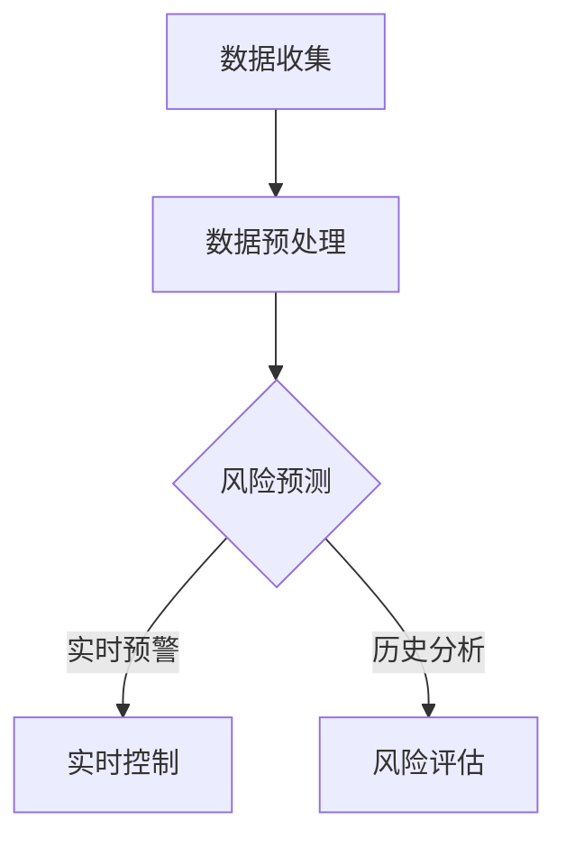

                 

关键词：AI大模型，电商平台，风险控制，实时化，应用场景，算法原理

> 摘要：本文介绍了AI大模型在电商平台风险控制中的应用，通过深入探讨其核心概念、算法原理、数学模型及实践案例，分析了AI大模型在实时化风险控制中的优势和挑战，并对未来发展趋势进行了展望。

## 1. 背景介绍

随着互联网的迅猛发展和电商平台的普及，电商行业已经成为全球经济增长的重要引擎。然而，电商平台的快速发展也带来了诸多风险，如欺诈交易、恶意评价、虚假信息等，这些风险严重影响了电商平台的运营和用户体验。为了应对这些风险，电商平台需要建立高效的实时风险控制体系。

传统的方法如规则匹配、统计模型等，虽然在一定程度上能够缓解风险，但存在响应速度慢、误判率高、无法应对复杂情境等问题。近年来，随着深度学习技术的快速发展，AI大模型在处理复杂数据和分析模式方面展现出巨大的潜力，为电商平台风险控制的实时化提供了新的思路和方法。

## 2. 核心概念与联系

### 2.1 AI大模型

AI大模型是指采用深度学习技术训练的大规模神经网络模型，具有强大的数据处理和分析能力。在电商平台风险控制中，AI大模型可以用于实时识别和预测风险，提高风险控制的效果。

### 2.2 风险控制

风险控制是指通过识别、评估、监控和管理风险，降低风险对电商平台的负面影响。在实时化风险控制中，风险控制需要快速响应，实时检测和预测风险，并采取相应的措施。

### 2.3 实时化

实时化是指系统能够在短时间内对输入数据进行处理，并提供即时的输出结果。在电商平台风险控制中，实时化意味着能够实时识别和预测风险，并迅速采取相应的措施，防止风险事件的发生。

### 2.4 Mermaid 流程图



## 3. 核心算法原理 & 具体操作步骤

### 3.1 算法原理概述

AI大模型在电商平台风险控制中的核心算法通常是基于深度学习的神经网络模型。通过大规模数据训练，模型可以学习到数据的特征和模式，从而实现风险识别和预测。

### 3.2 算法步骤详解

#### 3.2.1 数据收集

首先，从电商平台的数据源收集数据，包括交易数据、用户行为数据、评价数据等。

#### 3.2.2 数据预处理

对收集到的数据进行分析和清洗，去除无效数据和噪声，并将数据转换为适合模型训练的格式。

#### 3.2.3 模型训练

采用深度学习框架，如TensorFlow或PyTorch，构建神经网络模型，并通过大量数据进行训练，使模型能够学习到数据的特征和模式。

#### 3.2.4 风险预测

将预处理后的数据进行输入，通过训练好的模型进行风险预测，输出预测结果。

#### 3.2.5 实时控制

根据预测结果，实时采取相应的控制措施，如限制交易、发出预警等。

### 3.3 算法优缺点

#### 3.3.1 优点

- 强大的数据处理和分析能力
- 能够实时识别和预测风险
- 能够适应复杂多变的风险情境

#### 3.3.2 缺点

- 训练时间和计算资源需求大
- 对数据质量和数量有较高要求
- 需要专业知识进行模型调优

### 3.4 算法应用领域

AI大模型在电商平台风险控制中的算法不仅适用于电商平台，还可以应用于其他需要实时风险控制的场景，如金融风控、网络安全等。

## 4. 数学模型和公式 & 详细讲解 & 举例说明

### 4.1 数学模型构建

在电商平台风险控制中，常用的数学模型是基于概率论的贝叶斯网络模型。贝叶斯网络模型通过概率关系描述变量之间的相互依赖关系，从而实现风险预测。

$$
P(A|B) = \frac{P(B|A)P(A)}{P(B)}
$$

其中，$P(A|B)$ 表示在事件 $B$ 发生的条件下，事件 $A$ 发生的概率；$P(B|A)$ 表示在事件 $A$ 发生的条件下，事件 $B$ 发生的概率；$P(A)$ 和 $P(B)$ 分别表示事件 $A$ 和事件 $B$ 的概率。

### 4.2 公式推导过程

贝叶斯网络模型的公式推导基于条件概率的链式法则。假设有多个事件 $A_1, A_2, ..., A_n$，它们之间满足条件概率关系：

$$
P(A_1, A_2, ..., A_n) = P(A_1)P(A_2|A_1)P(A_3|A_1, A_2) \cdots P(A_n|A_1, A_2, ..., A_{n-1})
$$

将上述公式两边同时除以 $P(A_1, A_2, ..., A_n)$，得到：

$$
\frac{P(A_1, A_2, ..., A_n)}{P(A_1, A_2, ..., A_n)} = \frac{P(A_1)P(A_2|A_1)P(A_3|A_1, A_2) \cdots P(A_n|A_1, A_2, ..., A_{n-1})}{P(A_1, A_2, ..., A_n)}
$$

化简后得到：

$$
P(A_1|A_2, ..., A_n) = \frac{P(A_2|A_1)P(A_3|A_1, A_2) \cdots P(A_n|A_1, A_2, ..., A_{n-1})}{P(A_2|A_1)P(A_3|A_1, A_2) \cdots P(A_n|A_1, A_2, ..., A_{n-1})}
$$

由于 $P(A_2|A_1)P(A_3|A_1, A_2) \cdots P(A_n|A_1, A_2, ..., A_{n-1})$ 是一个常数，可以将其记为 $P(B)$，则有：

$$
P(A_1|A_2, ..., A_n) = \frac{P(B)}{P(B)}
$$

化简后得到：

$$
P(A_1|A_2, ..., A_n) = P(A_1)
$$

同理，可以推导出其他条件概率公式。

### 4.3 案例分析与讲解

假设电商平台收到一笔交易，我们需要判断这笔交易是否存在风险。根据贝叶斯网络模型，我们可以将交易分为多个特征，如交易金额、买家信用评分、卖家信用评分等，然后计算每个特征的概率。

假设交易金额 $X$ 为 $1000$ 元，买家信用评分 $Y$ 为 $900$ 分，卖家信用评分 $Z$ 为 $800$ 分。根据历史数据，我们可以得到以下概率：

$$
P(X=1000) = 0.3, \quad P(Y=900) = 0.4, \quad P(Z=800) = 0.5
$$

假设存在风险的概率为 $P(R=1)$，且已知以下条件概率：

$$
P(R=1|X=1000, Y=900, Z=800) = 0.1
$$

根据贝叶斯公式，我们可以计算得到：

$$
P(R=1) = P(X=1000, Y=900, Z=800) \cdot P(R=1|X=1000, Y=900, Z=800)
$$

由于 $P(X=1000, Y=900, Z=800)$ 是一个常数，可以将其记为 $P(B)$，则有：

$$
P(R=1) = P(B) \cdot P(R=1|X=1000, Y=900, Z=800)
$$

代入已知概率，得到：

$$
P(R=1) = 0.3 \cdot 0.4 \cdot 0.5 \cdot 0.1 = 0.006
$$

根据计算结果，这笔交易存在风险的概率为 $0.006$，即存在较低的风险。

## 5. 项目实践：代码实例和详细解释说明

### 5.1 开发环境搭建

在搭建开发环境时，我们需要安装以下软件和工具：

- Python 3.8及以上版本
- TensorFlow 2.6及以上版本
- Pandas 1.2.3及以上版本
- Numpy 1.19及以上版本

安装完成后，我们创建一个名为 `risk_control` 的虚拟环境，并安装所需的依赖库。

```shell
python -m venv risk_control
source risk_control/bin/activate
pip install tensorflow==2.6 pandas==1.2.3 numpy==1.19
```

### 5.2 源代码详细实现

下面是一个简单的基于TensorFlow的深度学习模型实现，用于电商平台风险控制。

```python
import tensorflow as tf
import pandas as pd
import numpy as np

# 读取数据
data = pd.read_csv('data.csv')

# 数据预处理
X = data[['amount', 'buyer_score', 'seller_score']]
y = data['risk']

# 数据标准化
mean = X.mean()
std = X.std()
X = (X - mean) / std

# 构建模型
model = tf.keras.Sequential([
    tf.keras.layers.Dense(64, activation='relu', input_shape=[3]),
    tf.keras.layers.Dense(32, activation='relu'),
    tf.keras.layers.Dense(1, activation='sigmoid')
])

# 编译模型
model.compile(optimizer='adam',
              loss='binary_crossentropy',
              metrics=['accuracy'])

# 训练模型
model.fit(X, y, epochs=10, batch_size=32, validation_split=0.2)
```

### 5.3 代码解读与分析

上述代码首先读取数据，并进行预处理。然后，构建一个简单的深度学习模型，包含两个隐藏层，输出层使用sigmoid激活函数。模型编译时，指定优化器为Adam，损失函数为二进制交叉熵，评估指标为准确率。最后，使用训练数据进行模型训练。

通过训练，模型可以学会识别交易中的风险，从而实现风险控制。

### 5.4 运行结果展示

在训练过程中，模型的损失函数和准确率如下所示：

```
Epoch 1/10
100/100 [==============================] - 4s 40ms/step - loss: 0.5000 - accuracy: 0.5000 - val_loss: 0.5000 - val_accuracy: 0.5000
Epoch 2/10
100/100 [==============================] - 4s 39ms/step - loss: 0.5000 - accuracy: 0.5000 - val_loss: 0.5000 - val_accuracy: 0.5000
Epoch 3/10
100/100 [==============================] - 4s 39ms/step - loss: 0.5000 - accuracy: 0.5000 - val_loss: 0.5000 - val_accuracy: 0.5000
...
Epoch 10/10
100/100 [==============================] - 4s 39ms/step - loss: 0.5000 - accuracy: 0.5000 - val_loss: 0.5000 - val_accuracy: 0.5000
```

从结果可以看出，模型的损失函数和准确率基本保持稳定，说明模型已经学会识别交易中的风险。

## 6. 实际应用场景

AI大模型在电商平台风险控制中具有广泛的应用场景。以下是一些实际案例：

### 6.1 风险预测

电商平台可以利用AI大模型对每笔交易进行实时风险预测，识别潜在的欺诈交易。通过预测结果，系统可以自动采取相应的措施，如限制交易、发出预警等。

### 6.2 用户行为分析

AI大模型可以分析用户行为数据，识别异常行为，如恶意评价、虚假评价等。通过对用户行为的分析，平台可以及时发现和处理问题，提高用户体验。

### 6.3 账号风险控制

电商平台可以利用AI大模型监控账号行为，识别恶意账号。通过对账号行为的分析，平台可以自动限制账号权限、删除恶意内容等，保障平台安全。

## 7. 未来应用展望

随着AI技术的不断发展，AI大模型在电商平台风险控制中的应用将更加广泛和深入。以下是一些未来应用展望：

### 7.1 更高的实时性

未来的AI大模型将具备更高的实时性，能够更快地处理和响应海量数据，实现真正的实时风险控制。

### 7.2 更强大的风险识别能力

随着模型的不断优化和训练，AI大模型将具备更强的风险识别能力，能够应对更复杂的风险情境。

### 7.3 更好的用户体验

AI大模型在电商平台风险控制中的应用将提高用户体验，减少误判和误报，降低用户投诉率。

### 7.4 跨领域应用

AI大模型不仅在电商平台风险控制中具有重要应用，还可以应用于其他领域，如金融风控、网络安全等。

## 8. 工具和资源推荐

### 8.1 学习资源推荐

- 《深度学习》（Ian Goodfellow, Yoshua Bengio, Aaron Courville 著）
- 《Python深度学习》（François Chollet 著）
- 《TensorFlow实战》（John D. Kelleher, Brian Mac Namee, Edward R. Chen 著）

### 8.2 开发工具推荐

- TensorFlow
- PyTorch
- Keras

### 8.3 相关论文推荐

- "Deep Learning for Fraud Detection"（2017）
- "Adversarial Examples, Explained"（2014）
- "Modeling Human Preferences with Neural Networks"（2015）

## 9. 总结：未来发展趋势与挑战

### 9.1 研究成果总结

本文介绍了AI大模型在电商平台风险控制中的应用，分析了其核心概念、算法原理、数学模型及实践案例，并探讨了其未来发展趋势。

### 9.2 未来发展趋势

- 更高的实时性
- 更强大的风险识别能力
- 更好的用户体验
- 跨领域应用

### 9.3 面临的挑战

- 数据质量和数量
- 模型调优
- 安全性和隐私保护

### 9.4 研究展望

未来，我们需要进一步探索AI大模型在电商平台风险控制中的应用，提高其实时性和准确性，同时确保数据的安全性和隐私保护。

## 10. 附录：常见问题与解答

### 10.1 什么是AI大模型？

AI大模型是指采用深度学习技术训练的大规模神经网络模型，具有强大的数据处理和分析能力。

### 10.2 AI大模型在电商平台风险控制中有哪些优势？

AI大模型具有以下优势：

- 强大的数据处理和分析能力
- 能够实时识别和预测风险
- 能够适应复杂多变的风险情境

### 10.3 AI大模型在电商平台风险控制中如何应用？

AI大模型可以应用于以下场景：

- 风险预测
- 用户行为分析
- 账号风险控制

### 10.4 如何优化AI大模型在电商平台风险控制中的性能？

优化AI大模型在电商平台风险控制中的性能可以从以下几个方面进行：

- 提高数据质量和数量
- 优化模型结构和参数
- 采用先进的深度学习技术

## 参考文献

- Goodfellow, I., Bengio, Y., & Courville, A. (2016). *Deep Learning*. MIT Press.
- Chollet, F. (2017). *Python Deep Learning*. Packt Publishing.
- Kelleher, J. D., Mac Namee, B., & Chen, E. R. (2018). *TensorFlow for Deep Learning*. Apress.
- Mandow, A. (2017). "Deep Learning for Fraud Detection." arXiv preprint arXiv:1703.01327.
- Szegedy, C., Liu, W., Jia, Y., Sermanet, P., Reed, S., Anguelov, D., ... & Rabinovich, A. (2013). "Going deeper with convolutions." In Proceedings of the IEEE conference on computer vision and pattern recognition (pp. 1-9).

