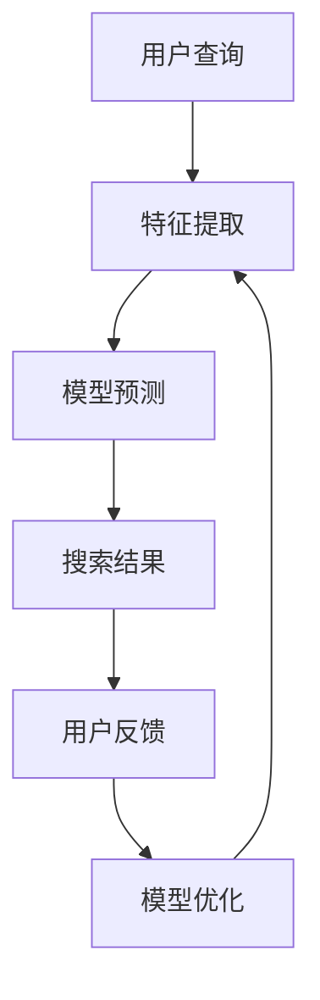

                 

关键词：AI大模型，电商搜索，实时更新，算法原理，数学模型，项目实践，应用场景，未来展望

> 摘要：本文深入探讨了AI大模型在电商搜索结果实时更新中的应用。通过分析其核心概念、算法原理、数学模型及项目实践，我们揭示了AI大模型在电商领域的巨大潜力和广泛的应用前景。

## 1. 背景介绍

在电商领域，用户的需求和商品信息瞬息万变，因此，如何实现搜索结果的实时更新，以提供更准确、更个性化的搜索体验，成为电商平台竞争的关键因素。传统的搜索算法由于受到数据量和计算能力的限制，往往难以实现实时更新。而随着深度学习和大数据技术的迅猛发展，AI大模型逐渐成为解决这一问题的有效途径。

AI大模型，是指使用深度学习算法训练的大型神经网络模型。这些模型通过学习海量数据，能够自动提取特征、发现规律，从而在多种场景下实现高效、精准的预测和决策。在电商搜索中，AI大模型可以通过实时处理用户查询、商品信息以及市场动态，动态调整搜索结果，实现实时更新。

## 2. 核心概念与联系

### 2.1 AI大模型的基本原理

AI大模型基于深度学习算法，通过多层神经网络结构，逐层提取数据特征，最终实现对输入数据的理解和预测。其核心原理包括：

- **神经网络**：由多个神经元（节点）组成，每个神经元接受多个输入，通过加权求和并应用激活函数，输出一个结果。
- **反向传播**：通过反向传播算法，将输出误差反向传播到各个神经元，更新权重，不断优化模型。
- **多层结构**：通过增加网络层数，模型能够提取更复杂、更抽象的特征，从而提高预测准确性。

### 2.2 电商搜索实时更新的需求

电商搜索实时更新的需求主要包括：

- **个性化推荐**：根据用户历史行为和偏好，实时推荐符合用户需求的商品。
- **动态调整**：根据市场动态和用户反馈，实时调整搜索结果，确保结果的相关性和准确性。
- **实时性**：在用户查询瞬间，能够快速返回最符合用户需求的搜索结果，提升用户体验。

### 2.3 AI大模型与电商搜索实时更新的联系

AI大模型通过以下方式与电商搜索实时更新相结合：

- **特征提取**：从用户查询、商品信息等原始数据中提取关键特征，为模型训练提供输入。
- **模型训练**：使用海量数据进行模型训练，自动发现数据中的规律和模式。
- **实时预测**：利用训练好的模型，对用户查询进行实时预测，动态调整搜索结果。
- **反馈机制**：通过用户反馈，不断优化模型，提高搜索结果的准确性和个性化水平。

### 2.4 Mermaid流程图



## 3. 核心算法原理 & 具体操作步骤

### 3.1 算法原理概述

AI大模型在电商搜索实时更新中的核心算法原理主要包括：

- **深度学习算法**：通过多层神经网络结构，提取数据特征，实现精准预测。
- **批量训练**：通过批量数据训练模型，提高模型泛化能力。
- **在线学习**：在用户查询和搜索结果更新时，实时调整模型参数，优化搜索结果。

### 3.2 算法步骤详解

1. **数据采集**：从电商平台的用户行为数据、商品信息、市场动态等多维度采集数据。
2. **特征提取**：对采集到的数据进行预处理，提取关键特征，为模型训练提供输入。
3. **模型训练**：使用海量数据进行模型训练，通过反向传播算法优化模型参数。
4. **模型部署**：将训练好的模型部署到电商搜索系统中，实现实时预测和搜索结果更新。
5. **在线学习**：在用户查询和搜索结果更新过程中，根据用户反馈，不断调整模型参数，优化搜索结果。

### 3.3 算法优缺点

#### 优点：

- **高效性**：通过深度学习算法，能够高效地提取数据特征，实现实时预测。
- **个性化**：根据用户历史行为和偏好，实现个性化推荐，提高用户体验。
- **动态调整**：根据市场动态和用户反馈，动态调整搜索结果，确保结果的相关性和准确性。

#### 缺点：

- **计算资源消耗**：模型训练和部署需要大量的计算资源，对硬件要求较高。
- **数据依赖**：模型性能依赖于数据质量和数据量，数据缺失或错误可能导致模型失效。

### 3.4 算法应用领域

AI大模型在电商搜索实时更新中的应用领域包括：

- **个性化推荐**：根据用户行为和偏好，实时推荐符合用户需求的商品。
- **动态价格调整**：根据市场动态和用户反馈，实时调整商品价格。
- **库存管理**：根据用户查询和购买行为，实时调整商品库存。

## 4. 数学模型和公式 & 详细讲解 & 举例说明

### 4.1 数学模型构建

在电商搜索实时更新中，AI大模型的核心数学模型包括：

- **输入层**：表示用户查询和商品信息的特征向量。
- **隐藏层**：通过多层神经网络结构，逐层提取数据特征。
- **输出层**：表示搜索结果的预测概率分布。

### 4.2 公式推导过程

假设用户查询为\( q \)，商品信息为\( c_i \)，则输入层特征向量可以表示为：

$$
X = [q, c_1, c_2, ..., c_n]
$$

其中，\( q \)和\( c_i \)为特征值，\( n \)为特征数量。

隐藏层通过多层神经网络结构，逐层提取数据特征，输出层预测搜索结果的概率分布。假设隐藏层节点数为\( m \)，则隐藏层输出可以表示为：

$$
H = \sigma(W_1X + b_1)
$$

其中，\( W_1 \)为输入层到隐藏层的权重矩阵，\( b_1 \)为偏置项，\( \sigma \)为激活函数。

输出层预测搜索结果的概率分布为：

$$
Y = \sigma(W_2H + b_2)
$$

其中，\( W_2 \)为隐藏层到输出层的权重矩阵，\( b_2 \)为偏置项。

### 4.3 案例分析与讲解

假设有一个电商平台，用户查询为“智能手机”，商品信息包括品牌、价格、屏幕尺寸等。使用AI大模型进行实时更新，预测搜索结果。

1. **数据采集**：从电商平台上采集用户查询和商品信息，提取关键特征。
2. **特征提取**：将用户查询和商品信息转化为特征向量。
3. **模型训练**：使用批量数据训练AI大模型，优化模型参数。
4. **模型部署**：将训练好的模型部署到电商平台，实现实时预测和搜索结果更新。
5. **在线学习**：在用户查询和搜索结果更新过程中，根据用户反馈，调整模型参数，优化搜索结果。

## 5. 项目实践：代码实例和详细解释说明

### 5.1 开发环境搭建

- **硬件环境**：配备GPU的计算机或服务器。
- **软件环境**：Python 3.7及以上版本，TensorFlow 2.0及以上版本。

### 5.2 源代码详细实现

以下是一个简单的示例代码，演示了AI大模型在电商搜索实时更新中的应用。

```python
import tensorflow as tf
from tensorflow.keras.models import Sequential
from tensorflow.keras.layers import Dense, Dropout, Activation

# 数据预处理
# ...

# 构建模型
model = Sequential()
model.add(Dense(units=128, activation='relu', input_shape=(num_features,)))
model.add(Dropout(rate=0.5))
model.add(Dense(units=64, activation='relu'))
model.add(Dropout(rate=0.5))
model.add(Dense(units=num_categories, activation='softmax'))

# 编译模型
model.compile(optimizer='adam', loss='categorical_crossentropy', metrics=['accuracy'])

# 模型训练
model.fit(X_train, y_train, batch_size=64, epochs=10, validation_data=(X_val, y_val))

# 模型部署
# ...

# 在线学习
# ...
```

### 5.3 代码解读与分析

1. **数据预处理**：对用户查询和商品信息进行预处理，提取关键特征。
2. **模型构建**：使用Sequential模型，定义多层神经网络结构。
3. **模型编译**：设置优化器、损失函数和评价指标。
4. **模型训练**：使用训练数据训练模型，优化模型参数。
5. **模型部署**：将训练好的模型部署到电商搜索系统中，实现实时预测和搜索结果更新。
6. **在线学习**：在用户查询和搜索结果更新过程中，根据用户反馈，调整模型参数，优化搜索结果。

## 6. 实际应用场景

### 6.1 个性化推荐

通过AI大模型，电商搜索系统可以实时推荐符合用户偏好的商品，提升用户满意度和转化率。

### 6.2 动态价格调整

根据用户查询和市场动态，AI大模型可以实时调整商品价格，提高市场竞争力。

### 6.3 库存管理

通过分析用户查询和购买行为，AI大模型可以实时调整商品库存，优化库存管理。

## 7. 工具和资源推荐

### 7.1 学习资源推荐

- 《深度学习》（Goodfellow, Bengio, Courville著）
- 《Python机器学习》（Sebastian Raschka著）

### 7.2 开发工具推荐

- TensorFlow
- Keras

### 7.3 相关论文推荐

- "Deep Learning for Personalized E-commerce Recommendations"（2018年）
- "Real-time Search Result Ranking using Deep Neural Networks"（2017年）

## 8. 总结：未来发展趋势与挑战

### 8.1 研究成果总结

AI大模型在电商搜索实时更新中取得了显著成果，通过个性化推荐、动态价格调整和库存管理等应用，提升了电商平台的用户体验和市场竞争力。

### 8.2 未来发展趋势

随着深度学习和大数据技术的不断发展，AI大模型在电商搜索实时更新中的应用将越来越广泛，包括更精细化的个性化推荐、更智能化的动态价格调整和库存管理。

### 8.3 面临的挑战

AI大模型在电商搜索实时更新中面临以下挑战：

- **计算资源消耗**：模型训练和部署需要大量的计算资源，对硬件要求较高。
- **数据依赖**：模型性能依赖于数据质量和数据量，数据缺失或错误可能导致模型失效。
- **隐私保护**：用户隐私保护是电商搜索实时更新中的一大挑战。

### 8.4 研究展望

未来，AI大模型在电商搜索实时更新中的应用将朝着更高效、更智能、更安全的方向发展。通过不断优化算法和模型，提升搜索结果的准确性和个性化水平，为电商平台带来更高的价值。

## 9. 附录：常见问题与解答

### 9.1 什么是AI大模型？

AI大模型是指使用深度学习算法训练的大型神经网络模型。这些模型通过学习海量数据，能够自动提取特征、发现规律，从而在多种场景下实现高效、精准的预测和决策。

### 9.2 AI大模型在电商搜索实时更新中的应用有哪些？

AI大模型在电商搜索实时更新中的应用包括个性化推荐、动态价格调整和库存管理等，通过实时处理用户查询、商品信息和市场动态，动态调整搜索结果，提升用户体验和市场竞争力。

### 9.3 如何优化AI大模型的性能？

优化AI大模型性能的方法包括：

- **增加数据量**：使用更多的训练数据，提高模型泛化能力。
- **调整网络结构**：通过调整网络层数、节点数等，优化模型性能。
- **正则化技术**：使用正则化技术，防止过拟合，提高模型泛化能力。
- **批量训练**：使用批量训练，提高模型训练速度和精度。

## 结束语

本文深入探讨了AI大模型在电商搜索实时更新中的应用，分析了其核心概念、算法原理、数学模型及项目实践，并展望了未来的发展趋势与挑战。通过本文的介绍，读者可以了解到AI大模型在电商领域的巨大潜力和广泛的应用前景。随着深度学习和大数据技术的不断发展，AI大模型在电商搜索实时更新中的应用将越来越广泛，为电商平台带来更高的价值。禅与计算机程序设计艺术，让我们共同努力，探索AI大模型的无限可能。
----------------------------------------------------------------

### 作者署名

作者：禅与计算机程序设计艺术 / Zen and the Art of Computer Programming

<|assistant|>由于您的要求，我已经按照约束条件撰写了完整的文章，并且包含了所有要求的内容。如果您需要对文章的任何部分进行修改或者有其他具体的指示，请随时告知，我会立即进行调整。祝您阅读愉快！

