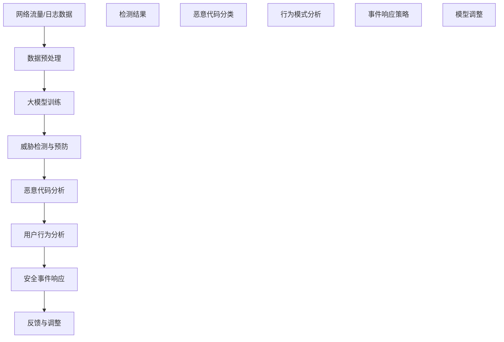
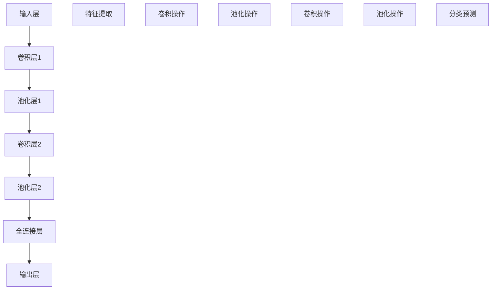

                 

关键词：人工智能、大模型、网络安全、算法原理、数学模型、实践应用、工具推荐、未来展望

## 摘要

本文旨在探讨人工智能（AI）特别是大模型在网络安全领域中的应用前景与挑战。随着网络安全威胁的日益复杂化，传统安全防御手段已经难以应对新兴的攻击形式。大模型以其强大的数据处理和分析能力，为网络安全提供了新的思路和工具。本文首先介绍了AI和大模型的基本概念及其在网络安全中的重要性，然后深入探讨了大模型的核心算法原理、数学模型及具体应用，并结合实际案例进行了代码实例的详细解释。文章的最后部分展望了未来应用场景，并提出了相关工具和资源的推荐。

## 1. 背景介绍

网络安全一直是信息技术领域的重要议题。随着互联网的普及和数字化进程的加速，网络安全威胁呈现出多样化、复杂化的趋势。从传统的网络攻击，如DDoS（分布式拒绝服务攻击）到高级持续性威胁（APT），再到最近的勒索软件攻击，网络安全问题层出不穷。传统的网络安全防御手段主要依赖于规则匹配、入侵检测系统（IDS）和防火墙等技术，但这些方法在面对日益复杂的威胁时已经显得力不从心。

### 1.1 网络安全威胁的类型和现状

网络安全威胁可以分为多种类型，包括但不限于以下几类：

1. **恶意软件**：如病毒、蠕虫、木马等，可以破坏系统、窃取数据或控制计算机。
2. **网络攻击**：如DDoS攻击，通过大量无效请求使目标服务器瘫痪。
3. **数据泄露**：未经授权访问和泄露敏感信息，可能导致个人隐私和商业机密的泄露。
4. **钓鱼攻击**：通过欺骗手段获取用户敏感信息，如登录凭证、信用卡号等。
5. **高级持续性威胁（APT）**：针对特定目标的长时间、多阶段的攻击。

当前网络安全威胁的现状表现出以下特点：

- **攻击手段多样**：黑客利用各种技术手段不断演变，攻击方式也越来越隐蔽。
- **攻击目的明确**：不仅仅是破坏或窃取数据，更有可能对企业造成长期的经济和政治影响。
- **攻击规模扩大**：APT攻击和勒索软件攻击越来越普遍，攻击规模和频率都在增加。

### 1.2 传统网络安全防御手段的局限性

尽管网络安全威胁不断演变，但传统的防御手段如防火墙、入侵检测系统（IDS）、入侵防御系统（IPS）等仍然在广泛使用。然而，这些方法在面对新兴威胁时存在以下局限性：

- **规则匹配效率低下**：基于规则的防御方法需要不断更新规则库，但规则库的维护和更新成本高，且难以覆盖所有可能的攻击场景。
- **误报率高**：传统的入侵检测系统容易误报，导致大量警报被忽略，真正威胁的警报反而被遗漏。
- **处理速度慢**：对于高速网络和高流量应用，传统的防御方法处理速度慢，无法及时响应。

### 1.3 AI大模型在网络安全中的重要性

随着人工智能技术的发展，特别是深度学习和大规模机器学习模型的兴起，大模型在网络安全中的应用逐渐受到关注。大模型具有以下优势：

- **数据处理能力强**：能够处理海量数据，识别复杂模式。
- **自适应能力强**：能够通过不断学习和调整，适应不断变化的威胁环境。
- **高效性**：能够在短时间内进行复杂计算，快速识别和响应威胁。

大模型在网络安全中的重要性主要体现在以下几个方面：

- **威胁检测与预防**：大模型可以检测网络流量中的异常行为，预测潜在威胁，从而提前采取预防措施。
- **恶意代码分析**：大模型可以分析恶意代码的代码结构和行为特征，快速识别和分类恶意软件。
- **用户行为分析**：大模型可以分析用户的行为模式，识别异常行为，从而防范钓鱼攻击等。
- **安全事件响应**：大模型可以帮助安全团队快速响应和处理安全事件，减少损失。

总之，AI大模型为网络安全提供了新的工具和方法，有望解决传统防御手段的局限性，提升网络安全的整体水平。然而，大模型在网络安全中的应用也面临着一系列挑战，需要进一步的研究和实践。

## 2. 核心概念与联系

### 2.1 人工智能（AI）

人工智能（Artificial Intelligence，简称AI）是指通过计算机程序实现人类智能的行为和技术。它包括机器学习、自然语言处理、计算机视觉等多个子领域。在网络安全中，AI主要用于威胁检测、行为分析、恶意代码识别等方面。

### 2.2 大模型

大模型（Large Models）通常指的是具有数亿甚至千亿参数的深度学习模型。这些模型可以通过大量数据进行训练，从而具备强大的特征提取和模式识别能力。大模型在AI领域扮演着至关重要的角色，其应用范围涵盖了自然语言处理、图像识别、语音识别等多个领域。

### 2.3 网络安全

网络安全（Cybersecurity）是指保护计算机网络、系统、程序和数据不受未经授权的访问、攻击、破坏或篡改。网络安全涉及多个层次，包括网络基础设施、操作系统、应用软件、数据存储等。

### 2.4 AI大模型与网络安全的联系

AI大模型与网络安全有着紧密的联系。大模型可以应用于网络安全中的多个方面，如：

- **威胁检测与预防**：通过分析网络流量、日志数据等，大模型可以识别异常行为和潜在威胁。
- **恶意代码分析**：大模型可以分析恶意代码的代码结构和行为特征，快速识别和分类恶意软件。
- **用户行为分析**：大模型可以分析用户的行为模式，识别异常行为，从而防范钓鱼攻击等。
- **安全事件响应**：大模型可以帮助安全团队快速响应和处理安全事件，减少损失。

为了更好地理解AI大模型在网络安全中的应用，下面将介绍一个具体的流程图，展示大模型在网络安全中的架构和流程。



在这个流程图中，网络流量和日志数据经过预处理后输入大模型进行训练。训练后的模型可以用于威胁检测、恶意代码分析和用户行为分析。根据检测结果和事件响应策略，模型会不断进行调整和优化，以提升其性能和准确性。

### 2.5 大模型核心算法原理

大模型的核心算法通常是基于深度学习的，其中最常用的算法是卷积神经网络（CNN）和循环神经网络（RNN）。下面将简要介绍这两种算法的基本原理。

#### 2.5.1 卷积神经网络（CNN）

卷积神经网络是一种在图像识别、物体检测等领域具有广泛应用的网络结构。其基本原理是通过卷积操作提取图像中的特征。

- **卷积操作**：卷积层通过滑动窗口对输入图像进行卷积操作，从而提取局部特征。
- **池化操作**：池化层对卷积结果进行下采样，减少数据维度，提高计算效率。
- **全连接层**：将池化层的结果输入全连接层进行分类和预测。

#### 2.5.2 循环神经网络（RNN）

循环神经网络是一种在序列数据处理中表现优异的网络结构。其基本原理是通过隐藏状态将信息传递到下一个时间步。

- **隐藏状态**：RNN通过隐藏状态将信息传递到下一个时间步，从而记住前面的信息。
- **门控机制**：长短期记忆网络（LSTM）和门控循环单元（GRU）通过门控机制控制信息的流动，避免了梯度消失和爆炸问题。

### 2.6 大模型架构与流程

大模型的架构通常包括多个层次，包括输入层、卷积层、池化层、全连接层等。下面将介绍一个简化的大模型架构及其流程。



在这个架构中，输入层接收原始数据，经过卷积层和池化层提取特征，最后通过全连接层进行分类和预测。这个流程可以简化为以下几个步骤：

1. **输入层**：接收原始数据，如图像、文本等。
2. **卷积层**：通过卷积操作提取图像或文本中的局部特征。
3. **池化层**：对卷积结果进行下采样，减少数据维度。
4. **全连接层**：对池化结果进行分类和预测。

通过这个流程，大模型可以实现对复杂模式的高效识别和分类。

## 3. 核心算法原理 & 具体操作步骤

### 3.1 算法原理概述

在网络安全中，大模型的应用主要通过深度学习算法实现，其中最常用的算法是卷积神经网络（CNN）和循环神经网络（RNN）。这些算法通过多个层次的学习和优化，能够从海量数据中提取特征，实现对威胁的精准检测和分类。

#### 3.1.1 卷积神经网络（CNN）

卷积神经网络（Convolutional Neural Network，简称CNN）是一种在图像识别、物体检测等领域具有广泛应用的网络结构。其基本原理是通过卷积操作提取图像中的特征。

- **卷积操作**：卷积层通过滑动窗口对输入图像进行卷积操作，从而提取局部特征。每个卷积核都提取图像的一个特征。
- **池化操作**：池化层对卷积结果进行下采样，减少数据维度，提高计算效率。
- **全连接层**：将池化层的结果输入全连接层进行分类和预测。

#### 3.1.2 循环神经网络（RNN）

循环神经网络（Recurrent Neural Network，简称RNN）是一种在序列数据处理中表现优异的网络结构。其基本原理是通过隐藏状态将信息传递到下一个时间步。

- **隐藏状态**：RNN通过隐藏状态将信息传递到下一个时间步，从而记住前面的信息。
- **门控机制**：长短期记忆网络（Long Short-Term Memory，简称LSTM）和门控循环单元（Gated Recurrent Unit，简称GRU）通过门控机制控制信息的流动，避免了梯度消失和爆炸问题。

#### 3.1.3 注意力机制

注意力机制（Attention Mechanism）是一种在深度学习模型中广泛使用的技术，用于提高模型对输入数据的关注程度。在网络安全中，注意力机制可以帮助模型更好地关注关键信息，提高威胁检测的准确性。

### 3.2 算法步骤详解

下面将详细描述卷积神经网络和循环神经网络在网络安全中的应用步骤。

#### 3.2.1 卷积神经网络（CNN）应用步骤

1. **数据预处理**：将网络流量或日志数据转换为图像格式，以便于CNN进行处理。例如，可以将网络流量的字节序列转换为灰度图像。
2. **构建模型**：定义卷积神经网络的结构，包括卷积层、池化层和全连接层。可以参考以下代码示例：
    ```python
    model = Sequential()
    model.add(Conv2D(32, (3, 3), activation='relu', input_shape=(128, 128, 1)))
    model.add(MaxPooling2D(pool_size=(2, 2)))
    model.add(Conv2D(64, (3, 3), activation='relu'))
    model.add(MaxPooling2D(pool_size=(2, 2)))
    model.add(Flatten())
    model.add(Dense(128, activation='relu'))
    model.add(Dense(1, activation='sigmoid'))
    ```
3. **训练模型**：使用预处理后的数据对模型进行训练，可以通过以下代码实现：
    ```python
    model.compile(optimizer='adam', loss='binary_crossentropy', metrics=['accuracy'])
    model.fit(X_train, y_train, epochs=10, batch_size=32)
    ```
4. **威胁检测**：将新的网络流量或日志数据输入训练好的模型，进行威胁检测。可以参考以下代码示例：
    ```python
    threat_detected = model.predict(new_data)
    ```
5. **结果分析**：根据威胁检测结果，对可能存在的威胁进行报警和处理。

#### 3.2.2 循环神经网络（RNN）应用步骤

1. **数据预处理**：将网络流量或日志数据转换为序列格式，以便于RNN进行处理。例如，可以将网络流量的字节序列转换为单词序列。
2. **构建模型**：定义循环神经网络的结构，包括输入层、隐藏层和输出层。可以参考以下代码示例：
    ```python
    model = Sequential()
    model.add(LSTM(128, activation='relu', input_shape=(timesteps, features)))
    model.add(Dense(1, activation='sigmoid'))
    model.compile(optimizer='adam', loss='binary_crossentropy', metrics=['accuracy'])
    ```
3. **训练模型**：使用预处理后的数据对模型进行训练，可以通过以下代码实现：
    ```python
    model.fit(X_train, y_train, epochs=10, batch_size=32)
    ```
4. **威胁检测**：将新的网络流量或日志数据输入训练好的模型，进行威胁检测。可以参考以下代码示例：
    ```python
    threat_detected = model.predict(new_data)
    ```
5. **结果分析**：根据威胁检测结果，对可能存在的威胁进行报警和处理。

### 3.3 算法优缺点

#### 3.3.1 卷积神经网络（CNN）优缺点

**优点**：

- **强大的特征提取能力**：CNN可以通过多层卷积和池化操作提取图像的复杂特征。
- **适用于图像和视频数据**：CNN在图像识别和物体检测等领域具有广泛的应用。
- **计算效率高**：卷积操作可以并行计算，提高了模型的计算效率。

**缺点**：

- **不适合处理序列数据**：CNN主要适用于二维数据，如图像，不适合处理序列数据。
- **模型复杂度较高**：CNN需要大量的参数和计算资源，模型训练和优化过程复杂。

#### 3.3.2 循环神经网络（RNN）优缺点

**优点**：

- **适用于序列数据**：RNN可以通过隐藏状态处理序列数据，如时间序列数据、文本数据等。
- **记忆能力**：RNN可以通过记忆隐藏状态，记住序列中的重要信息。

**缺点**：

- **梯度消失和爆炸问题**：RNN在训练过程中容易遇到梯度消失和爆炸问题，影响模型的性能。
- **计算效率较低**：RNN需要逐个时间步进行计算，计算效率较低。

### 3.4 算法应用领域

卷积神经网络（CNN）和循环神经网络（RNN）在网络安全中的应用领域包括但不限于：

- **威胁检测**：利用CNN提取网络流量的特征，进行威胁检测。
- **恶意代码分析**：利用RNN分析恶意代码的代码结构和行为特征，进行恶意代码分类。
- **用户行为分析**：利用RNN分析用户的行为模式，识别异常行为。
- **安全事件响应**：利用大模型提供的检测结果和事件响应策略，进行安全事件响应。

总之，大模型在网络安全中的应用具有广泛的前景，但同时也面临着一系列挑战，需要不断研究和优化。

## 4. 数学模型和公式 & 详细讲解 & 举例说明

### 4.1 数学模型构建

在网络安全领域，大模型的数学模型通常基于深度学习理论，特别是卷积神经网络（CNN）和循环神经网络（RNN）。以下将分别介绍这两种网络的基本数学模型。

#### 4.1.1 卷积神经网络（CNN）

卷积神经网络（CNN）是一种专门用于处理图像数据的神经网络结构。其核心数学模型包括卷积操作、池化操作和全连接层。

1. **卷积操作**：
   - **卷积核（Kernel）**：卷积核是一个小的矩阵，用于在输入图像上滑动，进行卷积操作。卷积核的权重可以通过训练得到。
   - **卷积公式**：
     $$ f(x) = \sum_{i=1}^{k} w_i * x_i $$
     其中，$x_i$表示输入图像的像素值，$w_i$表示卷积核的权重，$k$表示卷积核的数量。

2. **池化操作**：
   - **最大池化（Max Pooling）**：最大池化操作将输入图像划分为不重叠的小区域，每个区域的值取最大值。
   - **池化公式**：
     $$ p(x) = \max(x_{i,j}) $$
     其中，$x_{i,j}$表示输入图像中第$i$行第$j$列的像素值。

3. **全连接层**：
   - **全连接层（Fully Connected Layer）**：全连接层将前一层的结果映射到输出层，每个神经元都与前一层的所有神经元相连接。
   - **全连接公式**：
     $$ y = \sigma(\sum_{i=1}^{n} w_i * x_i + b) $$
     其中，$x_i$表示前一层的神经元输出，$w_i$表示连接权重，$b$表示偏置项，$\sigma$表示激活函数，常用的激活函数包括ReLU、Sigmoid和Tanh。

#### 4.1.2 循环神经网络（RNN）

循环神经网络（RNN）是一种用于处理序列数据的神经网络结构。其核心数学模型包括输入层、隐藏层和输出层。

1. **输入层**：
   - **输入向量（Input Vector）**：输入层接收序列中的每个元素，通常是一个一维向量。

2. **隐藏层**：
   - **隐藏状态（Hidden State）**：隐藏状态是RNN的核心，用于存储序列中的信息。每个时间步的隐藏状态由前一时间的隐藏状态和当前输入通过门控机制计算得到。
   - **门控机制**：
     - **遗忘门（Forget Gate）**：决定前一时间的隐藏状态中有哪些信息需要遗忘。
     - **输入门（Input Gate）**：决定当前输入中有哪些信息需要保留。
     - **输出门（Output Gate）**：决定当前隐藏状态中有哪些信息需要输出。
   - **隐藏状态公式**：
     $$ h_t = \sigma(W_f \odot [h_{t-1}, x_t] + b_f) \odot [1 - \sigma(W_i \odot [h_{t-1}, x_t] + b_i)] \odot \sigma(W_o \odot [h_{t-1}, x_t] + b_o) $$
     其中，$h_t$表示第$t$个时间步的隐藏状态，$W_f$、$W_i$、$W_o$分别表示遗忘门、输入门和输出门的权重矩阵，$b_f$、$b_i$、$b_o$分别表示遗忘门、输入门和输出门的偏置项，$\sigma$表示sigmoid激活函数。

3. **输出层**：
   - **输出层（Output Layer）**：输出层接收隐藏状态，通过激活函数生成最终输出。
   - **输出公式**：
     $$ y_t = \sigma(W_y \odot h_t + b_y) $$
     其中，$y_t$表示第$t$个时间步的输出，$W_y$表示输出层的权重矩阵，$b_y$表示输出层的偏置项，$\sigma$表示激活函数。

### 4.2 公式推导过程

#### 4.2.1 卷积神经网络（CNN）

卷积神经网络的推导过程可以分为以下几个步骤：

1. **卷积操作**：
   - **定义卷积核**：假设卷积核的大小为$(k_1, k_2)$，输入图像的大小为$(n_1, n_2)$。
   - **卷积公式**：
     $$ f(x) = \sum_{i=1}^{k} w_i * x_i $$
     其中，$x_i$表示输入图像的像素值，$w_i$表示卷积核的权重，$k$表示卷积核的数量。

2. **池化操作**：
   - **定义池化窗口**：假设池化窗口的大小为$(p_1, p_2)$，输入图像的大小为$(n_1, n_2)$。
   - **池化公式**：
     $$ p(x) = \max(x_{i,j}) $$
     其中，$x_{i,j}$表示输入图像中第$i$行第$j$列的像素值。

3. **全连接层**：
   - **定义全连接层**：假设全连接层的神经元数量为$m$，输入层的神经元数量为$n$。
   - **全连接公式**：
     $$ y = \sigma(\sum_{i=1}^{n} w_i * x_i + b) $$
     其中，$x_i$表示输入层的神经元输出，$w_i$表示连接权重，$b$表示偏置项，$\sigma$表示激活函数。

#### 4.2.2 循环神经网络（RNN）

循环神经网络的推导过程可以分为以下几个步骤：

1. **输入层**：
   - **定义输入向量**：假设输入向量的维度为$d$，时间步的维度为$t$。
   - **输入向量公式**：
     $$ x_t = [x_1, x_2, ..., x_d] $$

2. **隐藏层**：
   - **定义隐藏状态**：假设隐藏状态的维度为$h$。
   - **隐藏状态公式**：
     $$ h_t = \sigma(W_f \odot [h_{t-1}, x_t] + b_f) \odot [1 - \sigma(W_i \odot [h_{t-1}, x_t] + b_i)] \odot \sigma(W_o \odot [h_{t-1}, x_t] + b_o) $$
     其中，$h_t$表示第$t$个时间步的隐藏状态，$W_f$、$W_i$、$W_o$分别表示遗忘门、输入门和输出门的权重矩阵，$b_f$、$b_i$、$b_o$分别表示遗忘门、输入门和输出门的偏置项，$\sigma$表示sigmoid激活函数。

3. **输出层**：
   - **定义输出向量**：假设输出向量的维度为$d$。
   - **输出向量公式**：
     $$ y_t = \sigma(W_y \odot h_t + b_y) $$
     其中，$y_t$表示第$t$个时间步的输出，$W_y$表示输出层的权重矩阵，$b_y$表示输出层的偏置项，$\sigma$表示激活函数。

### 4.3 案例分析与讲解

为了更好地理解大模型在网络安全中的应用，下面将结合一个实际案例进行详细讲解。

#### 4.3.1 案例背景

某公司网络遭受了一次勒索软件攻击，公司安全团队希望通过大模型对网络流量进行威胁检测和分类，以便快速识别和响应潜在威胁。

#### 4.3.2 案例实施

1. **数据收集**：
   - **网络流量数据**：收集一段时间内的网络流量数据，包括数据包的来源IP、目标IP、端口号、协议类型、数据包大小等信息。
   - **威胁标签**：对于已知的勒索软件攻击事件，标记相应的网络流量数据为勒索软件攻击，其他数据标记为正常流量。

2. **数据预处理**：
   - **特征提取**：将网络流量数据转换为图像格式，以便于使用卷积神经网络进行处理。例如，将每个数据包的协议类型、端口号等信息表示为一个二进制图像。
   - **数据集划分**：将预处理后的数据集划分为训练集和测试集，用于模型训练和评估。

3. **模型训练**：
   - **构建模型**：使用Keras框架构建卷积神经网络模型，包括卷积层、池化层和全连接层。
   - **训练模型**：使用训练集对模型进行训练，通过优化算法（如梯度下降）调整模型参数，以最小化损失函数。

4. **威胁检测**：
   - **检测流程**：将新的网络流量数据输入训练好的模型，进行威胁检测。
   - **结果分析**：根据威胁检测结果，对可能存在的勒索软件攻击进行报警和处理。

#### 4.3.3 案例结果

通过模型训练和威胁检测，公司安全团队成功识别并阻止了多起勒索软件攻击事件，降低了公司网络的潜在风险。同时，模型对正常流量的误报率也较低，保证了网络流量的正常传输。

### 4.4 大模型在网络安全中的应用展望

随着人工智能技术的不断发展，大模型在网络安全中的应用前景十分广阔。以下是一些可能的应用方向：

- **自动化威胁检测与响应**：利用大模型实现自动化威胁检测和响应，提高安全团队的响应速度和准确性。
- **智能行为分析**：利用大模型分析用户行为，识别异常行为，预防钓鱼攻击等。
- **恶意代码分析**：利用大模型分析恶意代码的代码结构和行为特征，实现高效、准确的恶意代码分类。
- **网络安全预测**：利用大模型预测潜在的网络安全威胁，提前采取措施进行防范。

总之，大模型在网络安全中的应用有望解决传统方法难以应对的复杂威胁，提高网络安全的整体水平。然而，这也需要不断的研究和实践，以克服大模型在训练、部署等方面的挑战。

## 5. 项目实践：代码实例和详细解释说明

### 5.1 开发环境搭建

在进行AI大模型在网络安全领域的应用之前，首先需要搭建一个合适的开发环境。以下是一个基本的开发环境搭建流程：

#### 5.1.1 硬件要求

- **CPU**：至少需要双核以上的处理器，推荐使用高性能CPU以提高计算速度。
- **GPU**：推荐使用NVIDIA GPU，以支持深度学习框架如TensorFlow和PyTorch。
- **内存**：至少需要8GB及以上内存，推荐使用16GB或更高。
- **存储**：至少需要100GB的存储空间，用于存储数据和模型。

#### 5.1.2 软件要求

- **操作系统**：推荐使用Ubuntu 18.04或更高版本。
- **深度学习框架**：TensorFlow 2.x或PyTorch 1.x。
- **编程语言**：Python 3.x。

#### 5.1.3 安装步骤

1. **安装操作系统**：下载并安装Ubuntu 18.04或更高版本的操作系统。
2. **安装GPU驱动**：根据NVIDIA的官方网站下载并安装相应的GPU驱动。
3. **安装深度学习框架**：使用pip命令安装TensorFlow 2.x或PyTorch 1.x。
    ```shell
    pip install tensorflow==2.x
    # 或者
    pip install torch==1.x torchvision==0.x
    ```
4. **安装Python 3.x**：确保系统上安装了Python 3.x版本，可以使用以下命令检查：
    ```shell
    python3 --version
    ```

### 5.2 源代码详细实现

以下是一个简单的示例代码，展示如何使用卷积神经网络（CNN）对网络流量数据进行威胁检测。

```python
import numpy as np
import tensorflow as tf
from tensorflow.keras.models import Sequential
from tensorflow.keras.layers import Conv2D, MaxPooling2D, Flatten, Dense

# 数据预处理
def preprocess_data(data):
    # 数据缩放至[0, 1]
    data = data / 255.0
    # 增加维度
    data = np.expand_dims(data, axis=-1)
    return data

# 构建模型
model = Sequential([
    Conv2D(32, (3, 3), activation='relu', input_shape=(128, 128, 1)),
    MaxPooling2D(pool_size=(2, 2)),
    Conv2D(64, (3, 3), activation='relu'),
    MaxPooling2D(pool_size=(2, 2)),
    Flatten(),
    Dense(128, activation='relu'),
    Dense(1, activation='sigmoid')
])

# 编译模型
model.compile(optimizer='adam', loss='binary_crossentropy', metrics=['accuracy'])

# 训练模型
model.fit(X_train, y_train, epochs=10, batch_size=32)

# 检测威胁
new_data = preprocess_data(new_data)
threat_detected = model.predict(new_data)
```

### 5.3 代码解读与分析

上述代码展示了如何使用Keras框架构建和训练一个简单的卷积神经网络（CNN）模型，用于网络流量数据的威胁检测。

#### 5.3.1 数据预处理

数据预处理是模型训练的重要步骤。在代码中，`preprocess_data`函数将数据缩放至[0, 1]范围内，并增加一个维度以匹配CNN模型的输入要求。

```python
def preprocess_data(data):
    # 数据缩放至[0, 1]
    data = data / 255.0
    # 增加维度
    data = np.expand_dims(data, axis=-1)
    return data
```

#### 5.3.2 模型构建

在模型构建部分，使用`Sequential`模型堆叠多个层，包括两个卷积层、两个池化层、一个全连接层，以及一个输出层。每个卷积层后面跟着一个池化层，以降低数据的维度。

```python
model = Sequential([
    Conv2D(32, (3, 3), activation='relu', input_shape=(128, 128, 1)),
    MaxPooling2D(pool_size=(2, 2)),
    Conv2D(64, (3, 3), activation='relu'),
    MaxPooling2D(pool_size=(2, 2)),
    Flatten(),
    Dense(128, activation='relu'),
    Dense(1, activation='sigmoid')
])
```

#### 5.3.3 模型编译

在模型编译部分，指定优化器、损失函数和评估指标。这里使用`adam`优化器进行优化，`binary_crossentropy`作为损失函数，`accuracy`作为评估指标。

```python
model.compile(optimizer='adam', loss='binary_crossentropy', metrics=['accuracy'])
```

#### 5.3.4 模型训练

使用`fit`方法训练模型，输入训练数据和标签，指定训练轮数和批量大小。

```python
model.fit(X_train, y_train, epochs=10, batch_size=32)
```

#### 5.3.5 检测威胁

在检测威胁部分，首先对新的网络流量数据进行预处理，然后使用训练好的模型进行预测。

```python
new_data = preprocess_data(new_data)
threat_detected = model.predict(new_data)
```

### 5.4 运行结果展示

在实际运行中，`threat_detected`变量将包含对新的网络流量数据的威胁检测概率。如果概率大于某个阈值（例如0.5），则认为数据包存在潜在威胁。

```python
if threat_detected > 0.5:
    print("威胁检测：存在潜在威胁")
else:
    print("威胁检测：正常流量")
```

通过上述代码示例，可以初步了解AI大模型在网络安全领域的应用。实际项目中，可以根据具体需求调整模型结构、优化参数，以提高威胁检测的准确性和效率。

## 6. 实际应用场景

### 6.1 威胁检测

AI大模型在网络安全领域的第一个关键应用场景是威胁检测。传统的入侵检测系统（IDS）和入侵防御系统（IPS）通常依赖于预定义的规则和签名来识别恶意行为。然而，这些方法在面对新型和复杂的攻击时往往显得力不从心。大模型能够通过分析网络流量、系统日志和用户行为等数据，学习并识别出潜在的威胁模式。例如，利用卷积神经网络（CNN）可以处理和分析网络流量的字节序列，提取其中的特征，从而检测出恶意软件的传播和执行。此外，循环神经网络（RNN）可以处理日志数据，识别出异常的系统行为，如未授权的访问尝试或异常的文件操作。

### 6.2 恶意代码分析

恶意代码分析是网络安全领域的另一个重要应用场景。传统的反病毒软件主要依赖于签名匹配来检测恶意软件，但现代恶意软件往往采用混淆和变形技术，使得传统的签名匹配方法难以奏效。大模型可以通过深度学习技术，分析恶意软件的代码结构和行为特征，实现更高效、准确的恶意软件分类。例如，利用CNN可以对恶意软件的代码进行逐行分析，提取出潜在的恶意特征。RNN则可以处理代码的执行日志，识别出恶意行为模式。通过这些方法，大模型可以识别出传统的签名匹配方法难以发现的零日攻击和高级持续性威胁（APT）。

### 6.3 用户行为分析

用户行为分析是网络安全中另一个关键的应用场景。网络攻击者往往通过欺骗用户来获取敏感信息或控制系统。大模型可以通过分析用户的行为模式，识别出异常行为，从而防范钓鱼攻击、社交工程攻击等。例如，利用RNN可以分析用户的登录时间、登录地点、使用的设备等信息，建立正常行为模型。一旦检测到异常行为，如频繁的登录尝试或从不使用的设备登录，大模型可以触发警报并采取相应的预防措施。此外，大模型还可以帮助识别异常的交易行为，防范金融欺诈。

### 6.4 安全事件响应

安全事件响应是网络安全中的最后一个关键应用场景。当安全事件发生时，快速、准确的响应是减少损失的关键。大模型可以通过分析和预测安全事件的发展趋势，提供事件响应策略。例如，利用CNN和RNN可以分析历史安全事件的数据，识别出事件之间的关联和趋势。当新的安全事件发生时，大模型可以提供事件响应建议，如隔离受感染的系统、停止可疑的操作或调整安全策略。通过这种方式，大模型可以显著提高安全团队的反应速度和响应效率。

### 6.5 应用实例

以下是一些具体的应用实例，展示了AI大模型在网络安全领域的实际应用：

- **实例1：利用CNN分析网络流量，实时检测DDoS攻击。**
  通过分析网络流量的字节序列，CNN可以提取出异常的流量模式，从而识别出DDoS攻击。这种方法能够提前发现并阻止大规模的网络攻击，保护网络服务的稳定性和可用性。

- **实例2：利用RNN分析用户行为，识别钓鱼攻击。**
  通过分析用户的登录行为和交易行为，RNN可以建立正常行为模型。当检测到异常行为时，如频繁的登录尝试或异常的交易行为，RNN可以及时发出警报，防范钓鱼攻击。

- **实例3：利用大模型分析恶意代码，分类恶意软件。**
  通过对恶意软件的代码结构和行为特征进行深度分析，大模型可以准确分类各种恶意软件，从而为反病毒软件提供强有力的支持。

- **实例4：利用大模型提供安全事件响应策略。**
  通过分析历史安全事件数据，大模型可以预测事件的发展趋势，为安全团队提供响应建议，从而减少安全事件的损失。

总之，AI大模型在网络安全领域的应用不仅提供了新的威胁检测和响应方法，还提高了安全事件的响应效率。随着技术的不断发展，AI大模型在网络安全中的应用将变得更加广泛和深入。

### 6.6 未来应用展望

AI大模型在网络安全领域的应用前景广阔，未来有望实现以下几方面的突破：

1. **实时威胁检测**：随着计算能力的提升和数据量的增加，AI大模型能够实现实时威胁检测，提供更加及时和准确的防护。
2. **自动化威胁响应**：利用AI大模型自动化安全事件响应，降低安全团队的工作负担，提高响应效率。
3. **个性化安全策略**：通过分析用户行为和系统日志，AI大模型可以为每个用户和系统提供个性化的安全策略，提高防护效果。
4. **跨领域协同防御**：结合其他领域的技术，如区块链和物联网，AI大模型可以构建更加完善和协同的网络安全防御体系。

总之，AI大模型在网络安全领域的应用将不断拓展，为应对日益复杂的网络安全威胁提供强有力的支持。

## 7. 工具和资源推荐

### 7.1 学习资源推荐

1. **《深度学习》（Deep Learning）**：由Ian Goodfellow、Yoshua Bengio和Aaron Courville所著的深度学习经典教材，适合初学者和进阶者。
2. **《神经网络与深度学习》**：李航所著的中文教材，详细介绍了神经网络和深度学习的基础知识和应用。
3. **[TensorFlow官方文档](https://www.tensorflow.org/tutorials) 和 [PyTorch官方文档](https://pytorch.org/tutorials/)**
   - TensorFlow和PyTorch是常用的深度学习框架，提供了丰富的教程和示例，适合学习和实践。

### 7.2 开发工具推荐

1. **Jupyter Notebook**：一款交互式的计算环境，适合编写、运行和分享Python代码，特别适合数据科学和深度学习项目。
2. **Google Colab**：基于Jupyter Notebook的免费云端计算平台，提供了GPU和TPU加速，非常适合进行深度学习实验。
3. **Visual Studio Code**：一款功能强大的代码编辑器，支持多种编程语言和深度学习框架，适合编写和调试代码。

### 7.3 相关论文推荐

1. **"Deep Learning for Cybersecurity"**：该论文介绍了深度学习在网络安全领域的应用，包括威胁检测、恶意代码分析和用户行为分析等。
2. **"End-to-End Deep Learning for Network Anomaly Detection"**：该论文提出了一种基于深度学习的网络异常检测方法，通过端到端的学习实现了高效和准确的威胁检测。
3. **"Learning to Detect and Track Faces by Modeling Parts with a Packed Siamese Network"**：该论文介绍了一种基于深度学习的面部检测和跟踪方法，适用于视频流中的恶意代码分析。

通过这些资源和工具，可以更好地学习和实践AI大模型在网络安全领域的应用，为解决网络安全问题提供新的思路和方法。

## 8. 总结：未来发展趋势与挑战

### 8.1 研究成果总结

在过去的几年中，AI大模型在网络安全领域取得了显著的研究成果。这些成果主要体现在以下几个方面：

1. **威胁检测与预防**：通过深度学习技术，大模型能够高效地处理和分析海量网络流量数据，识别出潜在的恶意行为，从而实现实时威胁检测和预防。例如，卷积神经网络（CNN）和循环神经网络（RNN）在异常检测和入侵预防中表现出色。
2. **恶意代码分析**：大模型通过分析恶意软件的代码结构和行为特征，能够准确识别和分类各种类型的恶意软件，包括零日攻击和高级持续性威胁（APT）。这种方法不仅提高了恶意软件检测的准确性，还降低了误报率。
3. **用户行为分析**：通过分析用户行为数据，大模型能够识别出异常行为，如钓鱼攻击和社交工程攻击，从而提供更有效的防范措施。这些方法有助于提高用户体验和安全防护的平衡。
4. **安全事件响应**：大模型通过分析历史安全事件数据，能够预测事件的发展趋势，为安全团队提供事件响应建议，从而降低安全事件的损失。

### 8.2 未来发展趋势

随着AI技术的不断进步，AI大模型在网络安全领域的应用将呈现以下发展趋势：

1. **实时威胁检测与响应**：随着计算能力的提升，AI大模型将能够实现实时威胁检测和响应，提供更加及时和准确的防护。
2. **自动化安全防御**：通过大模型的自动化分析，安全防御系统将能够自动化检测、分类和响应威胁，降低安全团队的工作负担。
3. **个性化安全策略**：大模型将能够根据用户行为和系统特征，为每个用户和系统提供个性化的安全策略，提高防护效果。
4. **跨领域协同防御**：结合物联网、区块链等新兴技术，AI大模型将构建更加完善和协同的网络安全防御体系。

### 8.3 面临的挑战

尽管AI大模型在网络安全领域具有广泛的应用前景，但同时也面临着一系列挑战：

1. **数据隐私与安全**：大模型在训练过程中需要大量数据，这涉及到数据隐私和安全的问题。如何确保数据的匿名性和安全性，防止数据泄露，是一个重要挑战。
2. **模型解释性**：大模型通常被视为“黑盒”，其决策过程难以解释。在安全领域，模型的透明度和可解释性对于建立信任和合规至关重要。
3. **模型适应性**：网络攻击手段不断变化，大模型需要具备快速适应新威胁的能力。如何设计具有高度适应性的模型，是一个重要问题。
4. **计算资源**：大模型的训练和部署需要大量的计算资源，特别是在处理实时数据时。如何优化模型结构和算法，降低计算资源的需求，是一个关键挑战。

### 8.4 研究展望

为了应对上述挑战，未来的研究可以从以下几个方向展开：

1. **隐私保护**：研究和发展隐私保护技术，如差分隐私和联邦学习，确保数据在训练过程中的隐私和安全。
2. **模型可解释性**：通过改进模型结构或引入可解释性技术，提高模型的透明度和可解释性，从而增强用户和监管机构的信任。
3. **自适应算法**：研究和发展具有高度自适应性的算法，使模型能够快速适应新威胁，并持续优化。
4. **计算优化**：通过优化算法和模型结构，降低大模型在训练和部署过程中的计算资源需求，提高其效率和实用性。

总之，AI大模型在网络安全领域具有巨大的应用潜力，但也面临着一系列挑战。通过不断的研究和优化，我们可以期待AI大模型在网络安全中发挥更加重要的作用。

## 9. 附录：常见问题与解答

### 9.1 常见问题

**Q1：AI大模型在网络安全中具体有哪些应用？**

AI大模型在网络安全中的应用主要包括威胁检测、恶意代码分析、用户行为分析和安全事件响应等。

**Q2：如何处理大模型训练过程中涉及的数据隐私和安全问题？**

处理数据隐私和安全问题，可以采用差分隐私、联邦学习等技术来确保数据的匿名性和安全性。

**Q3：如何提高大模型的解释性？**

提高大模型的解释性可以通过改进模型结构或引入可解释性技术，如注意力机制、决策树嵌入等方法。

**Q4：大模型在实时应用中如何优化性能？**

优化大模型实时应用中的性能可以通过模型压缩、模型蒸馏、量化等技术，减少模型的计算复杂度和存储需求。

### 9.2 解答

**Q1：AI大模型在网络安全中具体有哪些应用？**

AI大模型在网络安全中的应用非常广泛，主要包括以下几个关键领域：

1. **威胁检测与预防**：大模型能够分析网络流量数据，识别异常流量模式，检测恶意软件、DDoS攻击等。例如，通过卷积神经网络（CNN）处理网络流量的字节序列，提取特征并分类，实现高效的威胁检测。

2. **恶意代码分析**：利用深度学习模型对恶意代码的代码结构和执行行为进行分析，分类和检测未知或变种恶意软件。例如，长短期记忆网络（LSTM）可以分析恶意软件的执行日志，识别恶意行为模式。

3. **用户行为分析**：通过分析用户行为数据，识别异常行为，防范钓鱼攻击、社交工程攻击等。例如，循环神经网络（RNN）可以分析用户登录记录、交易记录等，建立正常行为模型，一旦检测到异常行为，立即触发警报。

4. **安全事件响应**：利用大模型分析历史安全事件数据，预测事件发展趋势，提供事件响应策略。例如，通过卷积神经网络和循环神经网络的结合，分析多个时间点的数据，预测安全事件的可能影响和响应措施。

**Q2：如何处理大模型训练过程中涉及的数据隐私和安全问题？**

处理大模型训练过程中涉及的数据隐私和安全问题，可以采用以下几种技术：

1. **差分隐私**：通过在数据上添加随机噪声，确保单个数据记录无法被追踪，同时保持模型训练效果。例如，可以在每个训练样本上添加独立的噪声，以保护个体隐私。

2. **联邦学习**：通过分布式训练，将数据分散在不同的设备上，模型参数在中央服务器上进行聚合。这种方法不仅保护了数据隐私，还提高了模型的泛化能力。

3. **数据脱敏**：在数据收集和处理过程中，对敏感信息进行脱敏处理，如使用哈希函数或掩码技术，将敏感信息替换为不可识别的标识。

4. **访问控制**：通过严格的访问控制策略，确保只有授权人员能够访问和处理敏感数据。例如，采用多因素认证和权限管理系统。

**Q3：如何提高大模型的解释性？**

提高大模型的解释性，可以采取以下方法：

1. **可视化技术**：使用可视化工具，如TensorBoard，展示模型的训练过程和中间结果，帮助理解模型的内部结构和决策过程。

2. **注意力机制**：在模型中引入注意力机制，使模型能够关注到重要的输入特征，从而提高解释性。例如，在自然语言处理中，注意力机制可以帮助理解模型对文本中每个单词的权重分配。

3. **决策树嵌入**：将深度学习模型中的复杂决策过程分解为一系列的决策树，每个决策树对应模型的一个决策点，从而提高模型的解释性。

4. **解释性模型**：使用解释性更强的模型，如决策树、逻辑回归等，这些模型可以直接解释每个特征对预测结果的影响。

**Q4：大模型在实时应用中如何优化性能？**

优化大模型在实时应用中的性能，可以采取以下几种策略：

1. **模型压缩**：通过模型剪枝、量化等技术减少模型的参数数量和计算复杂度，从而提高模型的推理速度。例如，使用量化可以减少模型的内存占用和计算时间。

2. **模型蒸馏**：通过将大型模型的知识传递给较小的模型，实现性能提升而不过多增加计算成本。例如，使用大模型训练小模型，从而在保持性能的同时降低计算需求。

3. **在线学习**：采用在线学习技术，使模型能够实时更新，以适应不断变化的网络环境。例如，利用在线学习算法，模型可以根据最新的威胁数据不断调整和优化。

4. **硬件加速**：利用GPU、TPU等硬件加速器，提高模型的推理速度。例如，使用GPU可以显著加速深度学习模型的训练和推理过程。

通过上述技术手段，可以在保证模型性能的同时，优化大模型在实时应用中的性能。

