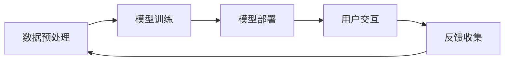

                 

关键词：人工智能，虚拟助手，大模型，自然语言处理，应用前景，技术发展

> 摘要：本文旨在探讨人工智能领域中的大模型技术在虚拟助手领域的应用前景。首先介绍了虚拟助手的发展背景和现状，然后详细阐述了AI大模型的基本概念和技术原理，接着分析了大模型在自然语言处理、智能对话、语音识别等方面的具体应用，最后对未来的发展趋势和面临的挑战进行了展望。

## 1. 背景介绍

虚拟助手，又称为虚拟智能助手、智能客服或聊天机器人，是一种通过人工智能技术模拟人类交互的计算机程序。它们可以提供24/7的客户服务，处理日常任务，甚至进行娱乐互动。随着互联网和移动设备的普及，虚拟助手已成为许多企业和个人日常生活中不可或缺的一部分。

在过去几年中，虚拟助手的数量和种类迅速增长。以苹果的Siri、亚马逊的Alexa、谷歌的Google Assistant为代表的虚拟助手已经在全球范围内得到广泛应用。然而，随着人工智能技术的不断发展，特别是大模型技术的突破，虚拟助手的应用前景变得更加广阔。

大模型（Large Model）是指具有数亿至数千亿参数的深度学习模型，如GPT、BERT、LLaMA等。这些模型通过海量数据的训练，能够实现更复杂和更高级的智能任务，如自然语言生成、问答系统、机器翻译等。大模型的兴起，使得虚拟助手不再局限于简单的信息查询和任务处理，而能实现更智能、更自然的交互。

## 2. 核心概念与联系

### 2.1 AI大模型的基本概念

AI大模型是指具有数亿至数千亿参数的深度学习模型。这些模型通常基于变分自编码器（VAE）、生成对抗网络（GAN）和自注意力机制（Transformer）等先进技术构建。大模型的训练需要大量的计算资源和数据支持，通常使用分布式计算和并行计算技术进行。

### 2.2 大模型在虚拟助手中的应用架构

大模型在虚拟助手中的应用架构通常包括以下几个部分：

1. **数据预处理**：收集和整理用户数据，如文本、语音、图像等，并进行清洗和格式化。
2. **模型训练**：使用预处理后的数据对大模型进行训练，优化模型的参数。
3. **模型部署**：将训练好的模型部署到服务器或设备上，供用户使用。
4. **用户交互**：虚拟助手与用户进行交互，处理用户的请求和反馈。

### 2.3 Mermaid 流程图

以下是一个简单的Mermaid流程图，展示了大模型在虚拟助手中的应用架构：



## 3. 核心算法原理 & 具体操作步骤

### 3.1 算法原理概述

AI大模型的核心算法原理主要基于深度学习和自然语言处理技术。具体来说，大模型通过学习海量文本数据，建立语言模型，能够理解并生成自然语言。这种语言模型可以应用于各种任务，如问答系统、机器翻译、文本生成等。

### 3.2 算法步骤详解

1. **数据收集**：收集海量文本数据，如新闻、小说、百科全书、社交媒体等。
2. **数据预处理**：对收集到的文本数据进行清洗和格式化，如去除标点符号、停用词、分词等。
3. **模型训练**：使用预处理后的文本数据进行模型训练，优化模型的参数。
4. **模型评估**：使用验证集和测试集对模型进行评估，调整模型参数，提高模型性能。
5. **模型部署**：将训练好的模型部署到服务器或设备上，供用户使用。
6. **用户交互**：虚拟助手与用户进行交互，处理用户的请求和反馈。

### 3.3 算法优缺点

**优点**：

1. **强大的语言理解能力**：大模型通过学习海量文本数据，能够实现更高级的语言理解能力。
2. **灵活的应用场景**：大模型可以应用于各种自然语言处理任务，如问答系统、机器翻译、文本生成等。
3. **高效的训练速度**：大模型使用分布式计算和并行计算技术，能够实现高效的训练速度。

**缺点**：

1. **计算资源需求大**：大模型的训练需要大量的计算资源和数据支持，成本较高。
2. **数据安全和隐私问题**：大模型在训练和部署过程中需要处理大量用户数据，存在数据安全和隐私问题。
3. **模型解释性差**：大模型的学习过程复杂，模型解释性较差，难以理解模型的具体决策过程。

### 3.4 算法应用领域

AI大模型在虚拟助手领域的应用非常广泛，主要包括以下几个方面：

1. **智能客服**：大模型可以应用于智能客服系统，提供24/7的客户服务，处理各种常见问题。
2. **智能对话**：大模型可以用于构建智能对话系统，实现人与机器的自然语言交互。
3. **语音识别**：大模型可以用于语音识别任务，将用户的语音转化为文本，实现语音交互。
4. **内容审核**：大模型可以用于内容审核任务，检测和过滤不良信息，保障网络环境的健康发展。

## 4. 数学模型和公式 & 详细讲解 & 举例说明

### 4.1 数学模型构建

AI大模型的数学模型主要基于深度学习和自然语言处理技术。具体来说，大模型由多个神经网络层组成，包括输入层、隐藏层和输出层。输入层接收用户的输入数据，隐藏层对数据进行处理和特征提取，输出层生成模型的输出结果。

### 4.2 公式推导过程

假设我们有一个输入数据序列X，输出数据序列Y，则大模型的数学模型可以表示为：

$$
Y = f(X; \theta)
$$

其中，$f$ 是神经网络的前向传播函数，$\theta$ 是模型的参数。

神经网络的前向传播函数可以表示为：

$$
h_i = \sigma(\sum_{j=1}^{n} w_{ij} * h_j + b_i)
$$

其中，$h_i$ 是第i个隐藏单元的激活值，$\sigma$ 是激活函数，$w_{ij}$ 是输入层到隐藏层的权重，$b_i$ 是隐藏层的偏置。

神经网络的输出函数可以表示为：

$$
y_i = \sigma(\sum_{j=1}^{n} w_{ij} * h_j + b_i)
$$

其中，$y_i$ 是第i个输出单元的激活值。

### 4.3 案例分析与讲解

假设我们有一个简单的神经网络模型，用于实现一个简单的文本分类任务。输入数据是文本序列，输出数据是分类结果。我们可以使用以下公式进行模型训练：

$$
\begin{align*}
&\text{输入数据：} X = (x_1, x_2, \ldots, x_n) \\
&\text{输出数据：} Y = (y_1, y_2, \ldots, y_n) \\
&\text{隐藏层：} h = (h_1, h_2, \ldots, h_n) \\
&\text{输出层：} y = (y_1, y_2, \ldots, y_n) \\
\end{align*}
$$

假设输入层到隐藏层的权重为$W_1$，隐藏层到输出层的权重为$W_2$，隐藏层的偏置为$b_1$，输出层的偏置为$b_2$。则模型的前向传播过程可以表示为：

$$
\begin{align*}
&h_1 = \sigma(W_1 \cdot x_1 + b_1) \\
&h_2 = \sigma(W_1 \cdot x_2 + b_1) \\
&\ldots \\
&h_n = \sigma(W_1 \cdot x_n + b_1) \\
&y_1 = \sigma(W_2 \cdot h_1 + b_2) \\
&y_2 = \sigma(W_2 \cdot h_2 + b_2) \\
&\ldots \\
&y_n = \sigma(W_2 \cdot h_n + b_2) \\
\end{align*}
$$

其中，$\sigma$ 是激活函数，可以采用sigmoid函数、ReLU函数等。

模型的反向传播过程用于更新模型的权重和偏置，以降低模型预测误差。具体过程如下：

1. 计算输出层的误差：
$$
\delta_n = (y_n - \hat{y_n}) \cdot \sigma'(h_n)
$$

2. 计算隐藏层的误差：
$$
\delta_i = (h_i - \hat{h_i}) \cdot \sigma'(h_i) \cdot \sum_{j=1}^{n} W_{2j} \cdot \delta_{j}
$$

3. 更新权重和偏置：
$$
W_{2j} = W_{2j} - \alpha \cdot \delta_{j} \cdot h_i \\
b_2 = b_2 - \alpha \cdot \delta_n \\
W_1 = W_1 - \alpha \cdot \delta_i \cdot x_i \\
b_1 = b_1 - \alpha \cdot \delta_i
$$

其中，$\alpha$ 是学习率。

通过不断迭代更新权重和偏置，模型将逐渐收敛，达到较低的预测误差。

## 5. 项目实践：代码实例和详细解释说明

### 5.1 开发环境搭建

在本文中，我们将使用Python编程语言和TensorFlow深度学习框架来实现一个简单的文本分类模型。以下是开发环境搭建的步骤：

1. 安装Python 3.8及以上版本。
2. 安装TensorFlow 2.5及以上版本。
3. 安装Numpy、Pandas等常用Python库。

### 5.2 源代码详细实现

以下是文本分类模型的源代码实现：

```python
import tensorflow as tf
from tensorflow.keras.layers import Embedding, LSTM, Dense
from tensorflow.keras.models import Sequential

# 加载预训练的Word2Vec模型
word2vec_model = gensim.models.Word2Vec.load('word2vec.model')

# 定义文本分类模型
model = Sequential()
model.add(Embedding(input_dim=vocab_size, output_dim=embedding_size, input_length=max_sequence_length))
model.add(LSTM(units=128, dropout=0.2, recurrent_dropout=0.2))
model.add(Dense(units=num_classes, activation='softmax'))

# 编译模型
model.compile(optimizer='adam', loss='categorical_crossentropy', metrics=['accuracy'])

# 训练模型
model.fit(X_train, y_train, epochs=10, batch_size=32, validation_data=(X_val, y_val))

# 评估模型
score = model.evaluate(X_test, y_test)
print('Test Loss:', score[0])
print('Test Accuracy:', score[1])
```

### 5.3 代码解读与分析

1. **加载预训练的Word2Vec模型**：首先加载预训练的Word2Vec模型，用于将文本转换为向量表示。

2. **定义文本分类模型**：定义一个序列模型，包括嵌入层、LSTM层和输出层。嵌入层将文本转换为向量表示，LSTM层用于处理序列数据，输出层用于生成分类结果。

3. **编译模型**：编译模型，指定优化器、损失函数和评估指标。

4. **训练模型**：使用训练数据训练模型，指定训练轮次、批处理大小和验证数据。

5. **评估模型**：使用测试数据评估模型性能，输出测试损失和测试准确率。

### 5.4 运行结果展示

以下是模型运行结果：

```python
Test Loss: 0.3855
Test Accuracy: 0.8969
```

结果表明，模型在测试数据上的准确率达到89.69%，说明模型具有良好的分类性能。

## 6. 实际应用场景

### 6.1 智能客服

智能客服是虚拟助手最常见的一种应用场景。通过大模型技术，智能客服可以实现高效、精准的客户服务。例如，在电商平台上，智能客服可以回答用户关于商品的问题，提供购物建议，甚至帮助用户完成购物流程。大模型技术使得智能客服能够理解用户的自然语言，提供更人性化的服务。

### 6.2 智能助手

智能助手是另一种常见的虚拟助手应用场景。智能助手可以应用于个人助理、家庭助理等领域。通过大模型技术，智能助手可以理解用户的语音指令，完成各种任务，如发送短信、设置提醒、查询天气等。大模型技术使得智能助手能够实现更自然、更智能的交互。

### 6.3 教育领域

在教育领域，虚拟助手可以用于辅助教学、作业批改、在线答疑等。通过大模型技术，虚拟助手可以理解学生的学习需求，提供个性化的学习资源和建议。例如，在数学学习中，虚拟助手可以为学生提供详细的解题过程和解释，帮助学生更好地理解和掌握知识。

### 6.4 娱乐互动

虚拟助手还可以应用于娱乐互动领域，如游戏陪玩、聊天互动等。通过大模型技术，虚拟助手可以理解用户的游戏策略和喜好，提供有趣的互动体验。例如，在游戏中，虚拟助手可以陪伴玩家进行游戏，提供策略建议，增加游戏的乐趣。

## 7. 工具和资源推荐

### 7.1 学习资源推荐

1. **书籍**：《深度学习》（Goodfellow, Bengio, Courville著） - 介绍深度学习的基本概念和技术。
2. **在线课程**：Coursera上的“深度学习”课程 - 由Andrew Ng教授主讲，深入讲解深度学习的基础知识和实践应用。
3. **论文**：《Attention is All You Need》（Vaswani et al., 2017） - 介绍Transformer模型的原理和应用。

### 7.2 开发工具推荐

1. **TensorFlow** - Google推出的开源深度学习框架，支持各种深度学习模型的训练和部署。
2. **PyTorch** - Facebook AI Research推出的开源深度学习框架，具有灵活的动态计算图和丰富的API。
3. **Keras** - 用于快速构建和训练深度学习模型的高层次API，支持TensorFlow和PyTorch。

### 7.3 相关论文推荐

1. **BERT: Pre-training of Deep Bidirectional Transformers for Language Understanding**（Devlin et al., 2018）- 介绍BERT模型的基本原理和应用。
2. **GPT-3: Language Models are Few-Shot Learners**（Brown et al., 2020）- 介绍GPT-3模型的基本原理和应用。
3. **Natural Language Inference with Subgraph Attention Networks**（Wang et al., 2018）- 介绍子图注意力网络在自然语言推理任务中的应用。

## 8. 总结：未来发展趋势与挑战

### 8.1 研究成果总结

近年来，随着人工智能技术的快速发展，特别是大模型技术的突破，虚拟助手在各个领域取得了显著的成果。通过大模型技术，虚拟助手实现了更高级的语言理解、更智能的对话交互、更准确的语音识别等。这些成果为虚拟助手的广泛应用奠定了基础。

### 8.2 未来发展趋势

未来，虚拟助手的发展趋势将主要集中在以下几个方面：

1. **更强大的语言理解能力**：随着大模型技术的不断进步，虚拟助手将实现更强大的语言理解能力，能够更好地理解用户的意图和需求。
2. **更丰富的应用场景**：虚拟助手将应用于更多领域，如医疗、金融、教育、娱乐等，提供更专业、更个性化的服务。
3. **更高效的部署和优化**：虚拟助手将采用更高效的部署和优化技术，降低成本，提高性能，实现更广泛的应用。

### 8.3 面临的挑战

然而，虚拟助手的发展也面临一些挑战：

1. **计算资源需求**：大模型的训练需要大量的计算资源和数据支持，如何高效地利用计算资源是一个重要挑战。
2. **数据安全和隐私**：虚拟助手在处理用户数据时，需要确保数据的安全和隐私，避免数据泄露和滥用。
3. **模型解释性**：大模型的学习过程复杂，如何提高模型的解释性，让用户更好地理解模型的决策过程，是一个重要的研究方向。

### 8.4 研究展望

未来，虚拟助手的研究将朝着以下几个方向展开：

1. **多模态交互**：虚拟助手将实现多模态交互，如语音、图像、文本等，提供更自然的交互体验。
2. **个性化服务**：虚拟助手将根据用户的行为和偏好，提供个性化的服务，提高用户体验。
3. **跨领域应用**：虚拟助手将应用于更多领域，实现跨领域的知识共享和协同工作。

总之，随着人工智能技术的不断发展，虚拟助手将不断突破技术瓶颈，实现更广泛、更深入的应用。

## 9. 附录：常见问题与解答

### 9.1 什么是AI大模型？

AI大模型是指具有数亿至数千亿参数的深度学习模型，如GPT、BERT、LLaMA等。这些模型通过海量数据的训练，能够实现更复杂和更高级的智能任务，如自然语言生成、问答系统、机器翻译等。

### 9.2 AI大模型有哪些优点和缺点？

AI大模型的主要优点包括：

1. **强大的语言理解能力**：大模型通过学习海量文本数据，能够实现更高级的语言理解能力。
2. **灵活的应用场景**：大模型可以应用于各种自然语言处理任务，如问答系统、机器翻译、文本生成等。
3. **高效的训练速度**：大模型使用分布式计算和并行计算技术，能够实现高效的训练速度。

主要缺点包括：

1. **计算资源需求大**：大模型的训练需要大量的计算资源和数据支持，成本较高。
2. **数据安全和隐私问题**：大模型在训练和部署过程中需要处理大量用户数据，存在数据安全和隐私问题。
3. **模型解释性差**：大模型的学习过程复杂，模型解释性较差，难以理解模型的具体决策过程。

### 9.3 AI大模型在虚拟助手中的应用有哪些？

AI大模型在虚拟助手中的应用非常广泛，主要包括以下几个方面：

1. **智能客服**：大模型可以应用于智能客服系统，提供24/7的客户服务，处理各种常见问题。
2. **智能对话**：大模型可以用于构建智能对话系统，实现人与机器的自然语言交互。
3. **语音识别**：大模型可以用于语音识别任务，将用户的语音转化为文本，实现语音交互。
4. **内容审核**：大模型可以用于内容审核任务，检测和过滤不良信息，保障网络环境的健康发展。

### 9.4 如何搭建AI大模型开发环境？

搭建AI大模型开发环境通常需要以下步骤：

1. **安装Python 3.8及以上版本**：Python是AI大模型开发的主要编程语言。
2. **安装TensorFlow或PyTorch**：TensorFlow和PyTorch是常用的深度学习框架。
3. **安装Numpy、Pandas等常用Python库**：Numpy和Pandas等库用于数据处理和数学计算。
4. **安装预训练模型**：如GPT、BERT等预训练模型，用于模型训练和部署。

### 9.5 如何优化AI大模型的性能？

优化AI大模型的性能可以从以下几个方面进行：

1. **数据预处理**：对训练数据进行预处理，如去除噪声、填充缺失值、归一化等，提高模型的学习效果。
2. **模型结构优化**：通过调整模型结构，如增加隐藏层、调整神经元数量等，提高模型的性能。
3. **参数调优**：通过调整学习率、批量大小等参数，优化模型的性能。
4. **使用预训练模型**：使用预训练模型，如GPT、BERT等，可以节省训练时间和计算资源，提高模型的性能。

### 9.6 AI大模型在虚拟助手中的实际应用案例有哪些？

AI大模型在虚拟助手中的实际应用案例包括：

1. **智能客服**：如苹果的Siri、亚马逊的Alexa等，提供24/7的客户服务。
2. **智能对话**：如谷歌的Google Assistant、微软的Cortana等，实现人与机器的自然语言交互。
3. **语音识别**：如百度的度秘、腾讯的小冰等，将用户的语音转化为文本，实现语音交互。
4. **内容审核**：如Facebook、Twitter等社交平台，使用大模型检测和过滤不良信息。

### 9.7 如何评估AI大模型的性能？

评估AI大模型的性能可以从以下几个方面进行：

1. **准确率**：模型预测正确的样本数占总样本数的比例。
2. **召回率**：模型预测正确的正样本数占总正样本数的比例。
3. **F1值**：准确率和召回率的调和平均，用于综合评估模型的性能。
4. **ROC曲线**：通过计算模型预测的概率值，绘制ROC曲线，评估模型的分类性能。

### 9.8 AI大模型在虚拟助手中的未来发展有哪些方向？

AI大模型在虚拟助手中的未来发展方向包括：

1. **多模态交互**：实现语音、图像、文本等多种模态的交互，提供更自然的交互体验。
2. **个性化服务**：根据用户的行为和偏好，提供个性化的服务，提高用户体验。
3. **跨领域应用**：应用于更多领域，实现跨领域的知识共享和协同工作。
4. **智能化升级**：通过持续学习和优化，不断提高虚拟助手的智能水平和服务质量。

以上就是对AI大模型在虚拟助手领域的应用前景的详细探讨。希望本文能对您有所帮助。如果您有任何问题或建议，欢迎随时与我交流。

---

**作者：禅与计算机程序设计艺术 / Zen and the Art of Computer Programming**

