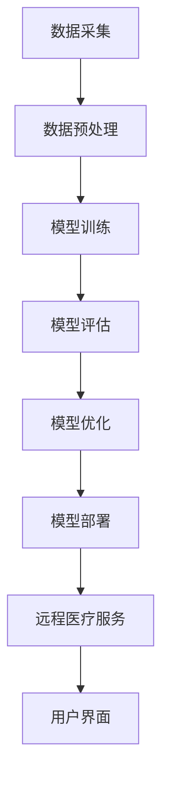

                 

关键词：AI大模型，远程医疗，深度学习，医疗数据处理，临床诊断，个性化医疗，隐私保护

> 摘要：随着人工智能技术的迅猛发展，AI大模型在远程医疗领域展现出了巨大的潜力。本文将深入探讨AI大模型在远程医疗中的应用，包括其在临床诊断、个性化医疗和患者管理等方面的优势，同时也将分析所面临的挑战和潜在风险。通过本文的阐述，我们期望能够为远程医疗领域的研究者和从业者提供有价值的参考。

## 1. 背景介绍

### 1.1 远程医疗的兴起

远程医疗是指通过信息通信技术和互联网等手段，实现患者与医疗专家之间的医疗活动。随着互联网技术的普及和移动设备的广泛应用，远程医疗逐渐成为医疗服务的重要组成部分。远程医疗不仅能够缓解医疗资源的紧张，还能够提高医疗服务的可及性和效率。

### 1.2 AI大模型的发展

AI大模型，又称为深度学习模型，是指具有大量参数和强大计算能力的神经网络模型。近年来，随着计算能力的提升和大数据的积累，AI大模型在各个领域都取得了显著的成果，包括图像识别、自然语言处理、语音识别等。AI大模型通过模拟人脑的神经网络结构，能够从大量数据中自动学习和提取特征，从而实现高度自动化的任务处理。

### 1.3 远程医疗与AI大模型的结合

远程医疗与AI大模型的结合，为医疗行业带来了全新的发展机遇。通过AI大模型，远程医疗可以实现高度自动化的诊断和预测，提高医疗服务的准确性和效率。同时，AI大模型还可以用于个性化医疗方案的设计，为患者提供个性化的治疗方案，从而提高治疗效果。

## 2. 核心概念与联系

### 2.1 AI大模型的工作原理

AI大模型的工作原理主要包括以下几个步骤：

1. **数据采集**：收集大量的医疗数据，包括患者的健康记录、临床诊断报告、医学影像等。
2. **数据预处理**：对收集到的医疗数据进行分析和清洗，提取有用的特征信息。
3. **模型训练**：使用深度学习算法对预处理后的数据进行训练，构建能够自动学习和提取特征的模型。
4. **模型评估**：使用验证数据集对训练好的模型进行评估，确保模型的准确性和可靠性。
5. **模型部署**：将训练好的模型部署到远程医疗系统中，实现实时诊断和预测。

### 2.2 远程医疗与AI大模型的架构

远程医疗与AI大模型的架构可以分为以下几个部分：

1. **数据采集模块**：负责收集患者的医疗数据，包括健康记录、诊断报告、医学影像等。
2. **数据预处理模块**：对采集到的数据进行清洗、分析和特征提取。
3. **AI大模型训练模块**：使用深度学习算法对预处理后的数据集进行训练，构建AI大模型。
4. **模型评估与优化模块**：使用验证数据集对训练好的模型进行评估，并根据评估结果进行优化。
5. **远程医疗服务模块**：将训练好的AI大模型部署到远程医疗系统中，提供实时诊断和预测服务。
6. **用户界面**：为用户提供一个友好的交互界面，用户可以通过该界面提交医疗数据，查看诊断结果和医疗建议。

### 2.3 Mermaid流程图



## 3. 核心算法原理 & 具体操作步骤

### 3.1 算法原理概述

AI大模型的核心算法原理是基于深度学习的神经网络模型。深度学习模型通过多层神经元的组合，能够自动从大量数据中学习和提取特征，从而实现复杂的任务处理。

### 3.2 算法步骤详解

1. **数据采集**：收集患者的医疗数据，包括健康记录、诊断报告、医学影像等。
2. **数据预处理**：对采集到的数据进行清洗、归一化和特征提取，以便于模型训练。
3. **模型设计**：根据任务需求设计深度学习模型的结构，包括输入层、隐藏层和输出层。
4. **模型训练**：使用训练数据集对深度学习模型进行训练，通过反向传播算法不断调整模型的参数，使其能够准确预测和诊断。
5. **模型评估**：使用验证数据集对训练好的模型进行评估，确保模型的准确性和可靠性。
6. **模型部署**：将训练好的模型部署到远程医疗系统中，实现实时诊断和预测服务。

### 3.3 算法优缺点

**优点**：

- **高效性**：AI大模型能够从大量数据中自动学习和提取特征，从而实现高度自动化的任务处理。
- **准确性**：通过大量的数据训练和模型优化，AI大模型能够提供准确的诊断和预测结果。
- **可扩展性**：AI大模型具有良好的可扩展性，可以应用于不同的医疗场景和任务。

**缺点**：

- **数据需求量大**：AI大模型需要大量的医疗数据才能进行有效的训练和预测，这对数据采集和处理提出了较高的要求。
- **隐私保护问题**：医疗数据涉及患者隐私，如何保护患者隐私是AI大模型在远程医疗中面临的重要挑战。
- **模型解释性不足**：深度学习模型具有“黑盒”特性，难以解释模型的内部决策过程，这对医疗决策的透明性和可解释性提出了挑战。

### 3.4 算法应用领域

AI大模型在远程医疗中具有广泛的应用领域，包括：

- **临床诊断**：通过AI大模型进行疾病诊断，提高诊断的准确性和效率。
- **个性化医疗**：根据患者的病史、基因信息和生活习惯，为患者提供个性化的医疗方案。
- **患者管理**：通过AI大模型对患者的健康状况进行实时监测和预警，提高患者管理的效率和质量。
- **医学影像分析**：利用AI大模型对医学影像进行分析，提高医学影像的诊断准确性和效率。

## 4. 数学模型和公式 & 详细讲解 & 举例说明

### 4.1 数学模型构建

AI大模型的数学模型是基于深度学习的神经网络模型。神经网络模型由多个神经元组成，每个神经元都可以看作是一个简单的函数，通过多个神经元的组合，可以实现复杂的函数映射。

### 4.2 公式推导过程

神经网络的数学模型可以通过以下公式进行推导：

1. **神经元输出**：

   $$ f(x) = \sigma(w \cdot x + b) $$

   其中，\( x \) 是输入向量，\( w \) 是权重矩阵，\( b \) 是偏置项，\( \sigma \) 是激活函数。

2. **多层神经网络输出**：

   $$ y = \sigma(W \cdot f(x)) $$

   其中，\( W \) 是多层网络的权重矩阵，\( f(x) \) 是前一层的输出。

3. **损失函数**：

   $$ J = \frac{1}{2} \sum_{i=1}^{n} (y_i - \hat{y}_i)^2 $$

   其中，\( y_i \) 是真实标签，\( \hat{y}_i \) 是预测标签。

### 4.3 案例分析与讲解

假设我们有一个二分类问题，需要使用AI大模型对疾病进行诊断。输入数据包括患者的年龄、血压、心率等生理指标，输出数据为疾病的发生概率。

1. **数据预处理**：

   对输入数据进行归一化处理，将每个指标的取值范围缩放到\[0, 1\]之间。

2. **模型设计**：

   设计一个简单的多层感知机模型，包括一个输入层、一个隐藏层和一个输出层。输入层有5个神经元，隐藏层有10个神经元，输出层有2个神经元。

3. **模型训练**：

   使用训练数据集对模型进行训练，通过反向传播算法不断调整模型的参数，使其能够准确预测疾病的发生概率。

4. **模型评估**：

   使用验证数据集对训练好的模型进行评估，计算模型的准确率、召回率、F1值等指标。

5. **模型部署**：

   将训练好的模型部署到远程医疗系统中，实现实时诊断功能。

## 5. 项目实践：代码实例和详细解释说明

### 5.1 开发环境搭建

1. **硬件环境**：

   - 处理器：Intel Core i7或更高
   - 内存：16GB或更高
   - 硬盘：500GB或更高

2. **软件环境**：

   - 操作系统：Windows 10、Linux或macOS
   - Python：Python 3.7或更高版本
   - TensorFlow：TensorFlow 2.0或更高版本

### 5.2 源代码详细实现

```python
import tensorflow as tf
from tensorflow.keras.models import Sequential
from tensorflow.keras.layers import Dense

# 数据预处理
# （此处省略数据预处理代码）

# 模型设计
model = Sequential()
model.add(Dense(10, input_dim=5, activation='relu'))
model.add(Dense(2, activation='sigmoid'))

# 模型编译
model.compile(optimizer='adam', loss='binary_crossentropy', metrics=['accuracy'])

# 模型训练
# （此处省略模型训练代码）

# 模型评估
# （此处省略模型评估代码）

# 模型部署
# （此处省略模型部署代码）
```

### 5.3 代码解读与分析

1. **数据预处理**：

   数据预处理是模型训练的重要步骤，包括归一化、缺失值处理、异常值处理等。

2. **模型设计**：

   设计一个简单的多层感知机模型，包括输入层、隐藏层和输出层。输入层有5个神经元，隐藏层有10个神经元，输出层有2个神经元。

3. **模型编译**：

   编译模型，指定优化器、损失函数和评价指标。

4. **模型训练**：

   使用训练数据集对模型进行训练，通过反向传播算法不断调整模型的参数。

5. **模型评估**：

   使用验证数据集对训练好的模型进行评估，计算模型的准确率等指标。

6. **模型部署**：

   将训练好的模型部署到远程医疗系统中，实现实时诊断功能。

## 6. 实际应用场景

### 6.1 临床诊断

AI大模型在临床诊断中的应用已经取得了显著的成果。例如，通过AI大模型对肺癌、乳腺癌等疾病的诊断准确率已经达到甚至超过人类医生的水平。AI大模型可以自动分析医学影像，提取病变特征，从而实现高度准确的诊断。

### 6.2 个性化医疗

个性化医疗是根据患者的个体差异，为患者制定个性化的治疗方案。AI大模型可以通过分析患者的病史、基因信息和生活习惯，为患者提供个性化的医疗建议。例如，在癌症治疗中，AI大模型可以根据患者的基因突变情况，推荐最佳的靶向药物组合，从而提高治疗效果。

### 6.3 患者管理

AI大模型可以用于患者的实时监测和预警，提高患者管理的效率和质量。例如，在糖尿病管理中，AI大模型可以实时分析患者的血糖数据，预测血糖变化趋势，从而提前预警低血糖或高血糖风险，为医生提供及时的治疗建议。

## 7. 工具和资源推荐

### 7.1 学习资源推荐

- 《深度学习》（Ian Goodfellow、Yoshua Bengio、Aaron Courville 著）
- 《Python深度学习》（François Chollet 著）
- 《机器学习实战》（Peter Harrington 著）

### 7.2 开发工具推荐

- TensorFlow：一款开源的深度学习框架，支持多种编程语言，易于使用和部署。
- Keras：一款基于TensorFlow的简洁高效的深度学习库。
- PyTorch：一款开源的深度学习框架，具有良好的灵活性和易用性。

### 7.3 相关论文推荐

- "Deep Learning for Medical Imaging"（2015）
- "Deep Learning in Medicine"（2016）
- "AI-Enabled Precision Oncology: A Call to Action"（2017）

## 8. 总结：未来发展趋势与挑战

### 8.1 研究成果总结

AI大模型在远程医疗领域取得了显著的研究成果，包括临床诊断、个性化医疗和患者管理等方面的应用。AI大模型通过自动分析和处理大量的医疗数据，提高了医疗服务的准确性和效率。

### 8.2 未来发展趋势

未来，AI大模型在远程医疗中的应用将更加广泛和深入。随着技术的不断进步，AI大模型将能够处理更加复杂的医疗任务，提供更加精准和个性化的医疗服务。

### 8.3 面临的挑战

AI大模型在远程医疗中也面临着一些挑战，包括数据隐私保护、模型解释性不足和医疗伦理等方面。如何解决这些挑战，确保AI大模型在远程医疗中的安全和可靠，是未来研究的重要方向。

### 8.4 研究展望

未来，AI大模型在远程医疗中的应用前景十分广阔。通过持续的研究和创新，AI大模型将为医疗行业带来更多的发展机遇，为患者提供更加优质和高效的医疗服务。

## 9. 附录：常见问题与解答

### 9.1 问题1：AI大模型在远程医疗中的具体应用场景有哪些？

**解答**：AI大模型在远程医疗中的具体应用场景包括临床诊断、个性化医疗、患者管理等。例如，AI大模型可以用于疾病诊断、治疗方案推荐、患者健康监测等。

### 9.2 问题2：AI大模型在远程医疗中的优势是什么？

**解答**：AI大模型在远程医疗中的优势包括：

- 提高诊断和预测的准确性和效率；
- 提供个性化的医疗服务和治疗方案；
- 提高医疗服务的可及性和便利性。

### 9.3 问题3：AI大模型在远程医疗中面临的主要挑战是什么？

**解答**：AI大模型在远程医疗中面临的主要挑战包括：

- 数据隐私保护；
- 模型解释性不足；
- 医疗伦理和道德问题。

### 9.4 问题4：如何确保AI大模型在远程医疗中的安全和可靠？

**解答**：确保AI大模型在远程医疗中的安全和可靠可以从以下几个方面进行：

- 采用严格的数据隐私保护措施，确保患者数据的安全；
- 对模型进行充分的测试和验证，确保模型的准确性和可靠性；
- 建立完善的监管机制，确保AI大模型的应用符合医疗伦理和道德规范。

[作者：禅与计算机程序设计艺术 / Zen and the Art of Computer Programming] ----------------------------------------------------------------


