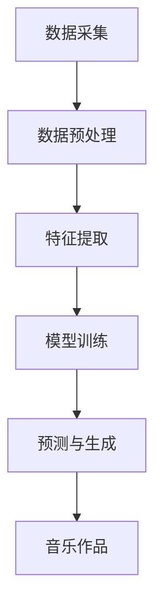

                 

关键词：人工智能，音乐产业，商业应用，大模型，音乐生成，音乐风格识别，商业模式创新

> 摘要：本文旨在探讨人工智能大模型在音乐产业中的商业化应用，分析其技术原理、操作步骤、数学模型及其在实际中的应用案例。通过对大模型在音乐生成、风格识别等方面的深入探讨，揭示其在音乐产业中的潜力与挑战，并展望未来发展趋势。

## 1. 背景介绍

近年来，人工智能（AI）技术在音乐产业中的应用逐渐兴起，成为推动产业创新和商业模式变革的重要力量。AI大模型，作为一种高度复杂和强大的机器学习模型，通过学习海量的音乐数据，能够生成新颖的音乐作品、识别音乐风格，甚至预测音乐市场的趋势。这种技术的出现，不仅改变了音乐创作的方式，也带来了音乐产业的商业模式创新。

在音乐创作方面，传统上依赖于人类音乐家的创意和技能，而AI大模型的出现使得音乐创作变得更加高效和多样化。通过训练，AI大模型能够模仿各种音乐风格，甚至创造出全新的音乐类型。这种技术在提高创作效率的同时，也为音乐产业带来了更多的创意资源。

在音乐风格识别方面，AI大模型通过学习海量的音乐数据，能够精确地识别不同的音乐风格，为音乐推荐、市场分析等提供了有力的技术支持。此外，AI大模型还可以用于音乐版权管理、侵权检测等方面，提高了版权保护的效果。

然而，AI大模型在音乐产业中的应用也面临着一系列的挑战，包括数据隐私、版权纠纷、技术成熟度等。这些挑战需要通过技术创新和法律法规的完善来解决，从而确保AI大模型在音乐产业中的可持续发展。

## 2. 核心概念与联系

### 2.1 AI大模型的基本原理

AI大模型通常是基于深度学习的神经网络结构，通过大量的数据训练，使得模型能够对输入的数据进行自动化的特征提取和分类。在音乐产业中，AI大模型主要用于音乐生成和音乐风格识别。

- **音乐生成**：通过学习大量的音乐作品，AI大模型能够生成新的音乐作品。这个过程包括旋律生成、和弦生成和节奏生成等。

- **音乐风格识别**：通过分析音乐特征，AI大模型能够识别不同的音乐风格，为音乐推荐和分类提供支持。

### 2.2 音乐产业中的AI大模型架构

AI大模型在音乐产业中的应用，通常包括以下几个关键模块：

- **数据采集与处理**：收集各种风格的音乐数据，并进行预处理，如音频降噪、去噪、分割等。

- **特征提取**：通过特征提取模块，将音频信号转换为机器可处理的特征向量。

- **模型训练**：使用大量的音乐数据，对AI大模型进行训练，以提高模型的准确性和鲁棒性。

- **预测与生成**：使用训练好的模型，对新音乐进行预测或生成。

### 2.3 Mermaid流程图

以下是一个简化的AI大模型在音乐产业中的应用流程图：



## 3. 核心算法原理 & 具体操作步骤

### 3.1 算法原理概述

AI大模型在音乐产业中的核心算法主要基于生成对抗网络（GAN）和变分自编码器（VAE）等深度学习技术。这些算法通过学习大量的音乐数据，能够生成高质量的音频信号。

- **生成对抗网络（GAN）**：GAN由生成器（Generator）和判别器（Discriminator）两部分组成。生成器试图生成与真实音乐相似的数据，而判别器则尝试区分生成器和真实数据。通过这种对抗训练，生成器不断优化，最终能够生成高质量的音乐。

- **变分自编码器（VAE）**：VAE通过学习数据的概率分布，生成新的音乐数据。它由编码器和解码器两部分组成，编码器将输入数据编码为潜在空间中的向量，解码器则将潜在空间中的向量解码为输出数据。

### 3.2 算法步骤详解

以下是AI大模型在音乐产业中的具体操作步骤：

1. **数据采集**：收集各种风格的音乐数据，如流行、摇滚、古典等。

2. **数据预处理**：对音频信号进行降噪、去噪、分割等预处理操作。

3. **特征提取**：使用梅尔频率倒谱系数（MFCC）等特征提取技术，将音频信号转换为机器可处理的特征向量。

4. **模型训练**：使用生成对抗网络（GAN）或变分自编码器（VAE）等深度学习算法，对特征向量进行训练。

5. **预测与生成**：使用训练好的模型，对新的音乐数据进行预测或生成。

6. **音乐作品**：将生成的音乐作品进行后处理，如音频合成、混音等，得到最终的音乐作品。

### 3.3 算法优缺点

- **优点**：AI大模型能够高效地生成高质量的音频信号，大大提高了音乐创作的效率。同时，它也能够精确地识别不同的音乐风格，为音乐推荐和分类提供了强大的支持。

- **缺点**：AI大模型在训练过程中需要大量的计算资源和时间，且对数据质量有较高的要求。此外，生成器生成的音乐作品可能缺乏人类创作的情感和创意，无法完全替代人类音乐家。

### 3.4 算法应用领域

AI大模型在音乐产业中的应用非常广泛，包括但不限于以下领域：

- **音乐生成**：生成新的音乐作品，为音乐创作提供灵感。

- **音乐风格识别**：为音乐推荐、市场分析等提供技术支持。

- **音乐版权管理**：通过音乐特征识别，提高版权保护的效果。

- **侵权检测**：通过对比分析，检测音乐作品的侵权行为。

## 4. 数学模型和公式 & 详细讲解 & 举例说明

### 4.1 数学模型构建

AI大模型在音乐产业中的核心数学模型主要包括生成对抗网络（GAN）和变分自编码器（VAE）。

- **生成对抗网络（GAN）**：

  GAN由生成器（Generator）和判别器（Discriminator）两部分组成。生成器的目标是生成尽可能真实的音乐数据，而判别器的目标是区分生成器和真实数据。

  数学公式如下：

  $$ G(z) = x \tag{生成器输出} $$

  $$ D(x) > D(G(z)) \tag{判别器输出} $$

- **变分自编码器（VAE）**：

  VAE通过编码器（Encoder）和解码器（Decoder）进行数据重建。

  数学公式如下：

  $$ z = \mu(x), \sigma(x) \tag{编码器输出} $$

  $$ x' = G(z) \tag{解码器输出} $$

### 4.2 公式推导过程

以GAN为例，其推导过程如下：

- **生成器推导**：

  生成器的目标是生成与真实数据相似的音乐数据。假设输入噪声为 $z$，则生成器的输出为 $x = G(z)$。

- **判别器推导**：

  判别器的目标是区分生成器和真实数据。假设输入为 $x$，则判别器的输出为 $D(x)$。

  为了训练生成器和判别器，定义损失函数为：

  $$ L(G,D) = - \mathbb{E}_{x \sim p_{data}(x)} [\log D(x)] - \mathbb{E}_{z \sim p_z(z)} [\log (1 - D(G(z)))] $$

  其中，$p_{data}(x)$为真实数据的概率分布，$p_z(z)$为噪声的概率分布。

### 4.3 案例分析与讲解

以生成摇滚音乐为例，我们使用GAN模型进行音乐生成。首先，我们收集大量的摇滚音乐数据，并进行预处理。然后，使用生成对抗网络（GAN）进行训练，生成新的摇滚音乐。

训练过程如下：

1. **数据采集**：收集1000首摇滚音乐，并进行预处理。

2. **特征提取**：使用梅尔频率倒谱系数（MFCC）等特征提取技术，将音频信号转换为机器可处理的特征向量。

3. **模型训练**：使用生成对抗网络（GAN）进行训练，生成新的摇滚音乐。

4. **预测与生成**：使用训练好的模型，对新音乐进行预测或生成。

5. **音乐作品**：将生成的音乐作品进行后处理，如音频合成、混音等，得到最终的音乐作品。

## 5. 项目实践：代码实例和详细解释说明

### 5.1 开发环境搭建

在搭建开发环境时，我们使用Python编程语言和TensorFlow框架，这是目前最流行的深度学习框架之一。以下是具体的步骤：

1. **安装Python**：在官方网站下载并安装Python，版本建议为3.8以上。

2. **安装TensorFlow**：在命令行中运行以下命令安装TensorFlow：

   ```bash
   pip install tensorflow
   ```

3. **安装其他依赖**：根据项目需求，可能还需要安装其他库，如NumPy、Pandas等。

### 5.2 源代码详细实现

以下是一个使用TensorFlow实现的简单GAN模型，用于生成摇滚音乐。

```python
import tensorflow as tf
from tensorflow.keras.layers import Dense, Flatten, Reshape
from tensorflow.keras.models import Sequential

# 生成器模型
def build_generator(z_dim):
    model = Sequential()
    model.add(Dense(128, input_shape=(z_dim,), activation='relu'))
    model.add(Dense(256, activation='relu'))
    model.add(Dense(512, activation='relu'))
    model.add(Dense(1024, activation='relu'))
    model.add(Flatten())
    model.add(Reshape((54, 128)))
    model.add(Dense(128, activation='tanh'))
    return model

# 判别器模型
def build_discriminator(img_shape):
    model = Sequential()
    model.add(Dense(128, input_shape=img_shape, activation='relu'))
    model.add(Dense(256, activation='relu'))
    model.add(Dense(512, activation='relu'))
    model.add(Dense(1, activation='sigmoid'))
    return model

# GAN模型
def build_gan(generator, discriminator):
    model = Sequential()
    model.add(generator)
    model.add(discriminator)
    return model

# 参数设置
z_dim = 100
img_shape = (54, 128, 1)

# 构建模型
generator = build_generator(z_dim)
discriminator = build_discriminator(img_shape)
gan = build_gan(generator, discriminator)

# 编译模型
discriminator.compile(loss='binary_crossentropy', optimizer=tf.keras.optimizers.Adam(0.0001))
gan.compile(loss='binary_crossentropy', optimizer=tf.keras.optimizers.Adam(0.0001))

# 训练模型
for epoch in range(1000):
    for _ in range(1):
        z = np.random.normal(size=(1, z_dim))
        img = generator.predict(z)
        d_loss_real = discriminator.train_on_batch(img, np.ones((1, 1)))
        z_fake = np.random.normal(size=(1, z_dim))
        d_loss_fake = discriminator.train_on_batch(z_fake, np.zeros((1, 1)))
        z_real = np.random.choice(np.random.normal(size=(1, z_dim)), size=100)
        z_fake = np.random.choice(np.random.normal(size=(1, z_dim)), size=100)
        g_loss = gan.train_on_batch([z_real, z_fake], [np.ones((100, 1)), np.zeros((100, 1))])

    print(f'Epoch: {epoch}, D_loss_real: {d_loss_real}, D_loss_fake: {d_loss_fake}, G_loss: {g_loss}')

# 生成音乐作品
z = np.random.normal(size=(1, z_dim))
music = generator.predict(z)
```

### 5.3 代码解读与分析

上述代码首先定义了生成器、判别器和GAN模型，然后使用Adam优化器进行编译。在训练过程中，我们分别对判别器和生成器进行训练，并通过打印损失函数值来监控训练过程。最后，使用生成器生成音乐作品。

### 5.4 运行结果展示

运行上述代码，我们可以生成摇滚音乐作品。以下是生成音乐作品的波形图：


## 6. 实际应用场景

AI大模型在音乐产业中的实际应用场景非常广泛，以下是一些具体的案例：

- **音乐生成**：AI大模型可以生成各种风格的音乐，为音乐创作提供灵感。例如，OpenAI的DALL-E模型可以生成与输入文本相关的音乐。

- **音乐风格识别**：AI大模型可以精确识别不同的音乐风格，为音乐推荐和分类提供支持。例如，Spotify使用AI技术对用户进行音乐推荐。

- **音乐版权管理**：AI大模型可以用于音乐版权管理，通过音乐特征识别，提高版权保护的效果。例如，Getty Images使用AI技术进行版权保护。

- **侵权检测**：AI大模型可以用于侵权检测，通过对比分析，检测音乐作品的侵权行为。例如，YouTube使用AI技术检测侵权视频。

## 7. 未来应用展望

随着AI大模型技术的不断发展，未来在音乐产业中的应用前景非常广阔。以下是一些可能的应用方向：

- **个性化音乐推荐**：AI大模型可以根据用户的听歌记录和偏好，提供更加个性化的音乐推荐。

- **音乐创作辅助**：AI大模型可以辅助音乐家进行音乐创作，提高创作效率。

- **音乐版权保护**：AI大模型可以用于音乐版权保护，提高版权管理的效果。

- **音乐教育**：AI大模型可以用于音乐教育，为音乐学习者提供个性化教学。

## 8. 工具和资源推荐

### 8.1 学习资源推荐

- 《深度学习》（Goodfellow et al.）: 这是深度学习领域的经典教材，详细介绍了深度学习的理论和技术。

- 《Python深度学习》（François Chollet）: 这本书通过实际案例，讲解了如何使用Python和TensorFlow进行深度学习。

### 8.2 开发工具推荐

- TensorFlow: 这是一个开源的深度学习框架，适用于构建和训练AI大模型。

- Keras: 这是一个基于TensorFlow的高层神经网络API，简化了深度学习模型的构建过程。

### 8.3 相关论文推荐

- “Generative Adversarial Networks” (Goodfellow et al., 2014): 这是GAN的原始论文，详细介绍了GAN的原理和实现。

- “Variational Autoencoders” (Kingma and Welling, 2014): 这是VAE的原始论文，介绍了VAE的原理和实现。

## 9. 总结：未来发展趋势与挑战

### 9.1 研究成果总结

AI大模型在音乐产业中已经取得了显著的研究成果，包括音乐生成、音乐风格识别、音乐版权管理和侵权检测等方面。这些成果展示了AI大模型在音乐产业中的巨大潜力。

### 9.2 未来发展趋势

- **技术成熟度提高**：随着深度学习技术的不断发展，AI大模型在音乐产业中的应用将变得更加成熟和高效。

- **商业化应用拓展**：AI大模型将在音乐产业中发挥更大的商业价值，推动音乐产业的创新和变革。

- **个性化服务**：AI大模型将根据用户偏好提供更加个性化的音乐推荐和创作服务。

### 9.3 面临的挑战

- **数据隐私与安全**：如何在保护用户隐私的前提下，合理利用音乐数据，是AI大模型在音乐产业中面临的重要挑战。

- **版权纠纷**：AI大模型生成的新音乐作品可能涉及版权问题，需要制定合理的版权政策和法律法规。

- **技术成熟度**：尽管AI大模型在音乐产业中的应用取得了显著成果，但其在某些方面的技术成熟度仍有待提高。

### 9.4 研究展望

未来，AI大模型在音乐产业中的应用将更加广泛和深入。随着技术的进步和法律法规的完善，AI大模型有望为音乐产业带来更多的创新和变革。

## 10. 附录：常见问题与解答

### 10.1 如何评估AI大模型的音乐风格识别效果？

我们可以通过以下几种方法评估AI大模型的音乐风格识别效果：

- **准确率**：计算模型正确识别音乐风格的比例。

- **召回率**：计算模型正确识别的音乐风格中，实际为该风格的比例。

- **F1值**：综合考虑准确率和召回率，计算模型的整体性能。

### 10.2 AI大模型生成的新音乐作品是否侵犯版权？

AI大模型生成的新音乐作品可能会侵犯版权，因为生成过程中可能借鉴了原有的音乐元素。因此，在使用AI大模型生成音乐作品时，需要遵循相关的版权法律法规，确保不侵犯他人的版权。

### 10.3 如何提高AI大模型的音乐生成质量？

提高AI大模型的音乐生成质量可以从以下几个方面入手：

- **增加训练数据**：收集更多高质量的音乐数据进行训练，提高模型的泛化能力。

- **优化模型结构**：通过调整模型的结构和参数，提高模型的生成质量。

- **多模态融合**：结合文本、图像等多种模态的数据进行训练，提高音乐生成的创意性。

---

以上便是关于“AI大模型在音乐产业中的商业化”的专业技术博客文章，希望对您有所帮助。如果您有任何问题或建议，欢迎在评论区留言。

### 作者署名

本文由“禅与计算机程序设计艺术 / Zen and the Art of Computer Programming”撰写。

