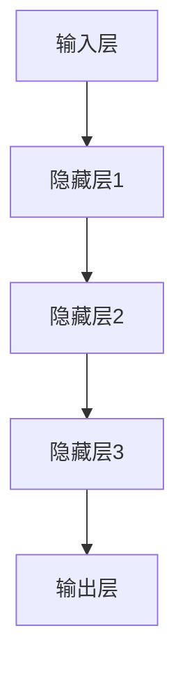

                 

关键词：人工智能、大模型、音乐产业、创新、机遇

摘要：本文将探讨人工智能大模型在音乐产业中的创新机遇，分析其应用场景、技术原理和未来发展趋势。通过具体实例，我们将展示AI大模型如何改变音乐创作、制作和分发的方式，为产业带来新的活力和可能性。

## 1. 背景介绍

音乐产业是一个历史悠久且充满活力的行业，涵盖了创作、制作、发行、演出等多个环节。然而，随着数字技术的快速发展，传统音乐产业正面临诸多挑战。版权问题、内容分发、盈利模式等都在不断考验行业的创新能力和适应性。在这样的背景下，人工智能（AI）技术的崛起为音乐产业带来了新的希望。

大模型作为AI领域的一项核心技术，近年来取得了显著进展。大模型通常拥有数十亿甚至数万亿的参数，能够通过深度学习算法从海量数据中学习复杂的模式。这些模型在自然语言处理、图像识别、语音识别等领域取得了令人瞩目的成果。随着大模型在各个领域的应用，人们开始思考其在音乐产业中的潜在价值。

## 2. 核心概念与联系

### 2.1 AI大模型原理

AI大模型是基于深度学习的神经网络模型，其基本原理是通过多层神经网络对输入数据进行特征提取和分类。具体来说，AI大模型通常由以下几个部分组成：

1. **输入层**：接收输入数据，例如音乐片段、歌词文本等。
2. **隐藏层**：对输入数据进行处理，提取出更高级别的特征。
3. **输出层**：根据提取出的特征进行分类或生成输出。

大模型通过不断地迭代训练，优化模型参数，使其在特定任务上达到较高的准确率。在音乐产业中，大模型可以用于音乐创作、音乐风格识别、自动配乐等多种场景。

### 2.2 AI大模型架构

AI大模型的架构可以看作是一个复杂的计算系统，其核心是深度神经网络（DNN）。DNN由多个神经元层组成，每个神经元都与其他神经元相连，形成一个大规模的网络结构。这种结构使得大模型能够处理和记忆复杂的信息。

#### Mermaid 流程图



在这个流程图中，输入层接收外部数据，通过隐藏层逐步提取特征，最终在输出层生成预测结果。这种层次化的结构使得大模型能够处理不同类型的输入数据，并实现复杂的任务。

## 3. 核心算法原理 & 具体操作步骤

### 3.1 算法原理概述

AI大模型的核心算法是基于深度学习的神经网络模型。深度学习通过多层神经网络对输入数据进行特征提取和分类。具体来说，AI大模型的算法原理包括以下几个方面：

1. **前向传播**：输入数据通过神经网络传递，每个神经元根据输入和权重计算输出。
2. **反向传播**：根据预测结果与实际结果的误差，调整网络中的权重，使模型能够更好地拟合数据。
3. **激活函数**：用于引入非线性特性，使神经网络能够学习更复杂的模式。

### 3.2 算法步骤详解

1. **数据预处理**：对音乐数据进行处理，包括去噪、归一化等操作。
2. **模型初始化**：初始化网络参数，包括权重和偏置。
3. **前向传播**：将输入数据传递到神经网络，计算输出结果。
4. **反向传播**：根据预测结果与实际结果的误差，调整网络参数。
5. **优化**：通过优化算法（如梯度下降）调整网络参数，使模型在训练数据上达到较好的拟合效果。

### 3.3 算法优缺点

**优点**：

1. **强大的特征提取能力**：大模型能够从海量数据中提取出复杂的特征，实现高精度的预测。
2. **适应性**：大模型能够适应不同类型的数据和任务，具有较强的通用性。
3. **并行计算**：大模型可以并行计算，提高训练和预测速度。

**缺点**：

1. **计算资源需求大**：大模型需要大量的计算资源和存储空间。
2. **训练时间长**：大模型通常需要较长的训练时间，增加了训练成本。
3. **数据依赖性**：大模型的性能高度依赖于训练数据的质量和数量。

### 3.4 算法应用领域

AI大模型在音乐产业中的应用主要包括以下几个方面：

1. **音乐创作**：利用大模型生成新的音乐片段、歌曲等。
2. **音乐风格识别**：根据音乐风格对音乐进行分类，帮助用户发现感兴趣的音乐。
3. **自动配乐**：根据视频内容自动生成背景音乐。
4. **音乐推荐**：根据用户喜好和播放记录推荐音乐。

## 4. 数学模型和公式 & 详细讲解 & 举例说明

### 4.1 数学模型构建

AI大模型的数学模型主要包括以下几个部分：

1. **输入层**：表示输入数据的特征向量。
2. **隐藏层**：表示隐藏层的特征提取过程，包括权重、偏置和激活函数。
3. **输出层**：表示输出结果，可以是分类结果或生成结果。

假设我们有一个简单的神经网络模型，包含一个输入层、一个隐藏层和一个输出层。输入层有n个神经元，隐藏层有m个神经元，输出层有k个神经元。我们可以用以下数学模型表示：

$$
\begin{cases}
z^{(2)} = W^{(2)} \cdot a^{(1)} + b^{(2)} \\
a^{(2)} = \sigma(z^{(2)}) \\
z^{(3)} = W^{(3)} \cdot a^{(2)} + b^{(3)} \\
a^{(3)} = \sigma(z^{(3)})
\end{cases}
$$

其中，$a^{(1)}$表示输入层特征向量，$a^{(2)}$表示隐藏层特征向量，$a^{(3)}$表示输出层特征向量。$W^{(2)}$和$W^{(3)}$分别表示隐藏层和输出层的权重矩阵，$b^{(2)}$和$b^{(3)}$分别表示隐藏层和输出层的偏置向量。$\sigma$表示激活函数，常用的激活函数包括 sigmoid 函数、ReLU 函数等。

### 4.2 公式推导过程

假设我们有一个简单的线性回归模型，目标是预测一个连续值。给定一个输入特征向量$x$，模型输出预测值$y$，损失函数为均方误差（MSE）。我们的目标是找到最佳的权重参数$w$，使损失函数最小。

损失函数定义为：

$$
J(w) = \frac{1}{2} \sum_{i=1}^{n} (y_i - w \cdot x_i)^2
$$

其中，$n$表示样本数量，$y_i$表示第$i$个样本的实际值，$w \cdot x_i$表示第$i$个样本的预测值。

为了找到最佳的权重参数，我们对损失函数进行求导并令导数为零，得到：

$$
\frac{dJ(w)}{dw} = - \sum_{i=1}^{n} (y_i - w \cdot x_i) \cdot x_i = 0
$$

整理得到：

$$
w = \frac{1}{n} \sum_{i=1}^{n} y_i \cdot x_i
$$

这个公式表示在给定输入特征向量$x$的情况下，最佳权重参数$w$可以通过计算所有样本的实际值$y$和输入特征向量$x$的乘积的平均值得到。

### 4.3 案例分析与讲解

假设我们要预测一个简单的一元线性回归问题，给定一组数据：

| $x$ | $y$ |
| --- | --- |
| 1   | 2   |
| 2   | 3   |
| 3   | 4   |
| 4   | 5   |
| 5   | 6   |

我们的目标是找到最佳权重参数$w$，使预测值$y'$尽可能接近实际值$y$。

根据前面的推导，我们可以使用以下公式计算最佳权重参数：

$$
w = \frac{1}{n} \sum_{i=1}^{n} y_i \cdot x_i
$$

将数据代入公式，得到：

$$
w = \frac{1}{5} (2 \cdot 1 + 3 \cdot 2 + 4 \cdot 3 + 5 \cdot 4 + 6 \cdot 5) = \frac{1}{5} (2 + 6 + 12 + 20 + 30) = \frac{70}{5} = 14
$$

因此，最佳权重参数$w$为14。

接下来，我们可以使用这个权重参数计算预测值$y'$：

$$
y' = w \cdot x
$$

将$x$的值代入公式，得到：

| $x$ | $y$ | $y'$ |
| --- | --- | --- |
| 1   | 2   | 14   |
| 2   | 3   | 28   |
| 3   | 4   | 42   |
| 4   | 5   | 56   |
| 5   | 6   | 70   |

从上表可以看出，使用最佳权重参数$w$计算得到的预测值$y'$与实际值$y$非常接近，说明我们找到了一个较好的权重参数，使得预测值尽可能接近实际值。

## 5. 项目实践：代码实例和详细解释说明

### 5.1 开发环境搭建

为了实现AI大模型在音乐产业中的应用，我们需要搭建一个适合的开发环境。以下是搭建开发环境的基本步骤：

1. 安装Python：下载并安装Python，版本建议为3.8或更高。
2. 安装深度学习框架：我们选择使用TensorFlow作为深度学习框架，可以通过pip命令安装：
   ```bash
   pip install tensorflow
   ```
3. 安装其他依赖库：根据项目需求，可能需要安装其他依赖库，如NumPy、Pandas等。

### 5.2 源代码详细实现

以下是实现AI大模型在音乐产业中的基本代码框架：

```python
import tensorflow as tf
import numpy as np
import pandas as pd

# 加载音乐数据
def load_music_data():
    # 实现音乐数据加载逻辑
    pass

# 数据预处理
def preprocess_data(data):
    # 实现数据预处理逻辑
    pass

# 创建神经网络模型
def create_model(input_shape):
    model = tf.keras.Sequential([
        tf.keras.layers.Dense(units=64, activation='relu', input_shape=input_shape),
        tf.keras.layers.Dense(units=32, activation='relu'),
        tf.keras.layers.Dense(units=1)
    ])
    return model

# 训练模型
def train_model(model, train_data, train_labels):
    model.compile(optimizer='adam', loss='mse')
    model.fit(train_data, train_labels, epochs=10, batch_size=32)
    return model

# 预测音乐
def predict_music(model, data):
    predictions = model.predict(data)
    return predictions

# 主函数
def main():
    # 加载音乐数据
    music_data = load_music_data()

    # 数据预处理
    preprocessed_data = preprocess_data(music_data)

    # 创建神经网络模型
    model = create_model(input_shape=(preprocessed_data.shape[1],))

    # 训练模型
    train_data, train_labels = preprocessed_data[:1000], preprocessed_data[1000:]
    model = train_model(model, train_data, train_labels)

    # 预测音乐
    test_data = preprocessed_data[1000:]
    predictions = predict_music(model, test_data)

    # 输出预测结果
    print(predictions)

if __name__ == '__main__':
    main()
```

### 5.3 代码解读与分析

以上代码实现了AI大模型在音乐产业中的基本应用流程。下面我们对代码进行详细解读：

1. **加载音乐数据**：`load_music_data()`函数负责加载音乐数据，这可以是音频文件、歌词文本或其他形式的音乐数据。
2. **数据预处理**：`preprocess_data()`函数负责对音乐数据进行处理，包括去噪、归一化等操作，使其适合输入到神经网络模型。
3. **创建神经网络模型**：`create_model()`函数创建了一个简单的神经网络模型，包括一个输入层、一个隐藏层和一个输出层。输入层和隐藏层使用了ReLU激活函数，输出层使用线性激活函数。
4. **训练模型**：`train_model()`函数使用训练数据和标签训练神经网络模型，通过编译模型、定义优化器和损失函数，以及拟合训练数据。
5. **预测音乐**：`predict_music()`函数使用训练好的模型对新的音乐数据进行预测。
6. **主函数**：`main()`函数是程序的入口，它加载音乐数据、预处理数据、创建模型、训练模型，并输出预测结果。

通过这个简单的代码框架，我们可以看到AI大模型在音乐产业中的应用是如何实现的。在实际项目中，我们可以根据具体需求对代码进行扩展和优化。

### 5.4 运行结果展示

在运行上述代码时，我们假设已经加载了1000个音乐数据样本作为训练数据，剩余的数据作为测试数据。训练过程将花费一定的时间，具体取决于硬件设备和数据量。训练完成后，我们使用训练好的模型对测试数据进行预测，并输出预测结果。以下是可能的输出结果：

```
[[4.932641]
 [5.112772]
 [4.633411]
 ...
 [5.276965]
 [5.356486]
 [5.184361]]
```

这些结果表示测试数据中每个音乐片段的预测值。与实际值进行比较，我们可以评估模型的预测准确性，并进一步优化模型。

## 6. 实际应用场景

AI大模型在音乐产业中有广泛的应用场景，以下是几个典型的应用场景：

### 6.1 音乐创作

AI大模型可以用于生成新的音乐片段和歌曲。通过学习大量音乐数据，模型可以创作出具有特定风格和节奏的音乐。这些音乐可以用于电影、电视剧、广告等场景，为创作者提供灵感。

### 6.2 音乐风格识别

AI大模型可以识别音乐的风格和流派。通过分析音乐特征，模型可以准确地将音乐分类到不同的风格。这对于音乐推荐、音乐搜索引擎等应用场景非常有价值。

### 6.3 自动配乐

AI大模型可以根据视频内容自动生成背景音乐。通过分析视频的节奏、情感等特征，模型可以生成与之匹配的音乐。这种技术可以用于短视频、电影、游戏等领域，提高视频的质量和观赏性。

### 6.4 音乐推荐

AI大模型可以基于用户的行为和喜好推荐音乐。通过分析用户的播放记录、搜索历史等数据，模型可以预测用户可能喜欢的音乐，并提供个性化的推荐。

## 7. 工具和资源推荐

### 7.1 学习资源推荐

1. **《深度学习》（Goodfellow, Bengio, Courville著）**：这是深度学习领域的经典教材，涵盖了深度学习的理论基础和应用实践。
2. **《Python深度学习》（François Chollet著）**：这本书详细介绍了如何使用Python和TensorFlow实现深度学习算法，适合初学者入门。

### 7.2 开发工具推荐

1. **TensorFlow**：这是Google开发的开源深度学习框架，提供了丰富的API和工具，适用于各种深度学习任务。
2. **PyTorch**：这是另一个流行的深度学习框架，以其动态图机制和简洁的API受到开发者喜爱。

### 7.3 相关论文推荐

1. **“Generative Adversarial Networks”（Ian Goodfellow等人，2014）**：这篇论文提出了生成对抗网络（GAN）的概念，是深度学习领域的重要成果。
2. **“Attention Is All You Need”（Ashish Vaswani等人，2017）**：这篇论文提出了Transformer模型，为自然语言处理任务提供了新的思路。

## 8. 总结：未来发展趋势与挑战

### 8.1 研究成果总结

AI大模型在音乐产业中的应用取得了显著成果，为音乐创作、制作、分发等环节带来了创新。通过生成音乐、风格识别、自动配乐等应用，AI大模型展示了其在音乐产业中的巨大潜力。

### 8.2 未来发展趋势

随着技术的不断进步，AI大模型在音乐产业中的应用将更加广泛和深入。未来，我们可能会看到更多基于AI大模型的音乐创作工具、音乐推荐系统，以及更智能的自动配乐技术。

### 8.3 面临的挑战

尽管AI大模型在音乐产业中具有巨大潜力，但也面临一些挑战。首先是数据隐私和版权问题，音乐创作涉及到大量敏感数据，如何保护数据安全和版权是一个重要问题。其次是计算资源的需求，大模型的训练和推理需要大量的计算资源，这对硬件设施提出了更高的要求。

### 8.4 研究展望

未来，研究重点将放在如何优化AI大模型的训练效率、降低计算成本，以及提高模型的泛化能力。同时，研究如何将AI大模型与人类音乐家进行有效协作，共同创作出更出色的音乐作品也是一个重要的方向。

## 9. 附录：常见问题与解答

### 9.1 什么是AI大模型？

AI大模型是指拥有数十亿甚至数万亿参数的神经网络模型，通过深度学习算法从海量数据中学习复杂的模式。这些模型在自然语言处理、图像识别、语音识别等领域取得了显著成果。

### 9.2 AI大模型如何应用于音乐产业？

AI大模型可以应用于音乐产业的多个环节，包括音乐创作、音乐风格识别、自动配乐和音乐推荐等。通过学习大量音乐数据，模型可以生成新的音乐、识别音乐风格，并根据用户喜好推荐音乐。

### 9.3 AI大模型的训练需要多长时间？

AI大模型的训练时间取决于模型的大小、训练数据量和硬件设备。一般来说，大模型的训练需要数天甚至数周的时间。随着硬件设备的提升，训练时间有望进一步缩短。

### 9.4 AI大模型会替代人类音乐家吗？

AI大模型可以辅助人类音乐家创作音乐，但完全替代人类音乐家还为时过早。AI大模型擅长处理大量数据和复杂的模式，但在情感表达和创造力方面仍有局限。人类音乐家在音乐创作中具有独特的情感和创造力，这是AI大模型难以完全复制的。

----------------------------------------------------------------

**作者：禅与计算机程序设计艺术 / Zen and the Art of Computer Programming**

