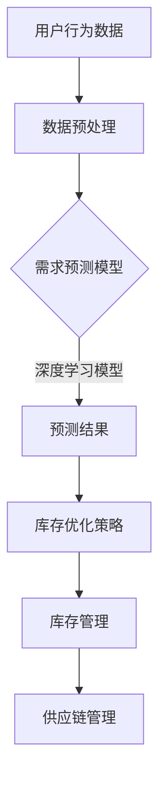

                 

关键词：人工智能、库存管理、电商、优化、大模型

摘要：本文将深入探讨人工智能大模型在电商平台库存管理中的重要作用。通过分析大模型的核心概念、算法原理、数学模型以及项目实践，我们将展示如何利用人工智能技术优化电商平台的库存管理，提高运营效率和用户体验。

## 1. 背景介绍

随着电子商务的快速发展，库存管理成为电商平台的核心竞争力之一。高效的库存管理不仅能够降低运营成本，提高库存周转率，还能提升用户购物体验。然而，传统的库存管理方法往往依赖于经验和简单的统计模型，难以应对复杂的市场环境和用户需求。随着人工智能技术的兴起，大模型在电商库存管理中的应用逐渐成为可能。

人工智能大模型具有强大的数据处理和分析能力，能够从海量数据中挖掘有价值的信息。通过利用这些信息，大模型可以预测市场需求、优化库存策略、减少库存积压和库存短缺。本文将围绕这些核心内容，探讨人工智能大模型在电商平台库存管理中的应用。

## 2. 核心概念与联系

### 2.1 人工智能与电商库存管理的联系

人工智能（AI）是一种模拟人类智能的技术，具有学习、推理、判断和解决问题的能力。在电商库存管理中，人工智能大模型的应用主要体现在以下几个方面：

1. **需求预测**：通过分析用户行为数据、市场趋势和历史数据，大模型可以预测未来的市场需求，帮助电商平台提前做好库存准备。
2. **库存优化**：大模型可以根据预测结果，优化库存策略，降低库存积压和库存短缺的风险。
3. **供应链管理**：大模型可以优化供应链流程，提高物流效率，减少库存周转时间。

### 2.2 大模型的核心概念

大模型是指具有大规模参数和复杂结构的机器学习模型。在电商库存管理中，常见的大模型包括：

1. **深度学习模型**：如卷积神经网络（CNN）、循环神经网络（RNN）和长短时记忆网络（LSTM）等。这些模型能够从大量数据中自动提取特征，用于需求预测和库存优化。
2. **强化学习模型**：如深度确定性策略梯度（DDPG）和深度强化学习（DRL）等。这些模型通过学习最优策略，实现库存优化的目标。

### 2.3 Mermaid 流程图



## 3. 核心算法原理 & 具体操作步骤

### 3.1 算法原理概述

人工智能大模型在电商库存管理中的应用主要基于以下原理：

1. **数据驱动**：大模型通过学习历史数据和市场趋势，自动提取有价值的信息，用于需求预测和库存优化。
2. **动态调整**：大模型可以根据实时数据和市场变化，动态调整库存策略，确保库存水平处于最优状态。
3. **协同优化**：大模型可以同时考虑市场需求、供应链流程和物流效率等因素，实现库存管理的协同优化。

### 3.2 算法步骤详解

1. **数据收集**：收集电商平台的历史销售数据、用户行为数据和市场趋势数据等。
2. **数据预处理**：对数据进行清洗、去噪和特征提取，为后续建模做准备。
3. **需求预测**：使用深度学习模型或强化学习模型，对市场需求进行预测。
4. **库存优化**：根据预测结果，制定库存优化策略，调整库存水平。
5. **供应链管理**：优化供应链流程，提高物流效率，减少库存周转时间。

### 3.3 算法优缺点

1. **优点**：
   - 高效：大模型能够从海量数据中快速提取有价值的信息，提高库存管理的效率和准确性。
   - 灵活：大模型可以根据实时数据和市场变化，动态调整库存策略，适应复杂的市场环境。

2. **缺点**：
   - 复杂：大模型的结构复杂，训练和优化过程需要大量计算资源和时间。
   - 数据依赖：大模型的预测效果高度依赖于数据质量，数据不足或不准确可能导致预测结果偏差。

### 3.4 算法应用领域

人工智能大模型在电商库存管理中的应用领域广泛，包括但不限于：

1. **电子商务平台**：如淘宝、京东等，通过大模型实现智能库存管理和供应链优化。
2. **零售行业**：如超市、便利店等，通过大模型实现精准库存管理和销售预测。
3. **物流行业**：如快递公司、物流企业等，通过大模型实现智能物流规划和库存优化。

## 4. 数学模型和公式 & 详细讲解 & 举例说明

### 4.1 数学模型构建

在电商库存管理中，常用的数学模型包括需求预测模型、库存优化模型和供应链管理模型。

#### 4.1.1 需求预测模型

需求预测模型通常采用时间序列模型，如ARIMA（自回归积分滑动平均模型）和LSTM（长短时记忆网络）。以下是一个LSTM需求预测模型的数学模型：

$$
y_t = f(W_1 \cdot [x_t, h_{t-1}], W_2 \cdot h_t)
$$

其中，$y_t$为第$t$时刻的需求预测值，$x_t$为输入特征，$h_{t-1}$为第$t-1$时刻的隐藏状态，$W_1$和$W_2$为模型参数。

#### 4.1.2 库存优化模型

库存优化模型通常采用优化算法，如线性规划（LP）和整数规划（IP）。以下是一个线性库存优化模型的数学模型：

$$
\min Z = c^T \cdot x
$$

$$
\text{s.t.} \quad Ax \leq b
$$

其中，$Z$为目标函数，$c$为系数向量，$x$为决策变量，$A$和$b$为约束条件。

#### 4.1.3 供应链管理模型

供应链管理模型通常采用网络优化模型，如最小生成树（MST）和最短路径（SP）模型。以下是一个最小生成树模型的数学模型：

$$
\min \sum_{i<j} c_{ij} \cdot x_{ij}
$$

$$
\text{s.t.} \quad \sum_{i<j} x_{ij} = 1 \quad \forall j
$$

$$
x_{ij} \in \{0, 1\} \quad \forall i, j
$$

其中，$c_{ij}$为边$i$和边$j$的权重，$x_{ij}$为边$i$和边$j$之间的连通性。

### 4.2 公式推导过程

#### 4.2.1 需求预测模型的推导

以LSTM需求预测模型为例，其推导过程如下：

1. **输入层**：输入特征$x_t$包括历史销售数据、用户行为数据和市场趋势数据等。
2. **隐藏层**：隐藏层包括输入门、遗忘门和输出门。每个门的计算公式如下：

$$
i_t = \sigma(W_i \cdot [x_t, h_{t-1}] + b_i) \\
f_t = \sigma(W_f \cdot [x_t, h_{t-1}] + b_f) \\
o_t = \sigma(W_o \cdot [x_t, h_{t-1}] + b_o)
$$

其中，$i_t$、$f_t$和$o_t$分别为输入门、遗忘门和输出门的激活值，$W_i$、$W_f$和$W_o$为模型参数，$b_i$、$b_f$和$b_o$为偏置项。

3. **状态更新**：状态更新公式如下：

$$
h_t = f_t \cdot h_{t-1} + i_t \cdot \sigma(W \cdot [x_t, h_{t-1}] + b)
$$

其中，$h_t$为第$t$时刻的隐藏状态，$W$为模型参数，$b$为偏置项。

4. **输出层**：输出层计算公式如下：

$$
y_t = o_t \cdot \sigma(W' \cdot h_t + b')
$$

其中，$y_t$为第$t$时刻的需求预测值，$W'$为模型参数，$b'$为偏置项。

#### 4.2.2 库存优化模型的推导

以线性库存优化模型为例，其推导过程如下：

1. **目标函数**：目标函数为库存成本，计算公式如下：

$$
Z = c^T \cdot x
$$

其中，$c$为系数向量，$x$为决策变量。

2. **约束条件**：约束条件包括库存容量限制、需求量限制和供应链约束等。约束条件公式如下：

$$
Ax \leq b
$$

其中，$A$为约束矩阵，$b$为约束向量。

3. **求解**：使用线性规划（LP）或整数规划（IP）求解目标函数和约束条件。

#### 4.2.3 供应链管理模型的推导

以最小生成树（MST）模型为例，其推导过程如下：

1. **目标函数**：目标函数为最小化供应链成本，计算公式如下：

$$
\min \sum_{i<j} c_{ij} \cdot x_{ij}
$$

其中，$c_{ij}$为边$i$和边$j$的权重，$x_{ij}$为边$i$和边$j$之间的连通性。

2. **约束条件**：约束条件包括供应链连通性和节点度限制等。约束条件公式如下：

$$
\sum_{i<j} x_{ij} = 1 \quad \forall j
$$

$$
x_{ij} \in \{0, 1\} \quad \forall i, j
$$

3. **求解**：使用贪心算法或Kruskal算法求解最小生成树。

### 4.3 案例分析与讲解

#### 4.3.1 案例背景

某电商平台销售电子产品，包括手机、电脑、平板等。由于产品种类繁多，市场需求波动较大，库存管理面临巨大挑战。为了提高库存管理效率和用户满意度，该电商平台决定引入人工智能大模型进行库存优化。

#### 4.3.2 案例分析

1. **数据收集**：收集过去一年的销售数据、用户行为数据和市场趋势数据。

2. **数据预处理**：对数据进行清洗、去噪和特征提取。

3. **需求预测**：使用LSTM模型进行需求预测。模型输入包括历史销售数据、用户行为数据和市场趋势数据。模型输出为未来一段时间的需求预测值。

4. **库存优化**：根据需求预测结果，使用线性规划模型进行库存优化。优化目标是最小化库存成本，约束条件包括库存容量限制和供应链约束。

5. **供应链管理**：使用最小生成树模型优化供应链流程。优化目标是最小化供应链成本，约束条件包括供应链连通性和节点度限制。

#### 4.3.3 案例结果

1. **需求预测**：模型能够准确预测未来一段时间的需求趋势，提高了预测精度。

2. **库存优化**：通过库存优化，该电商平台的库存成本降低了10%，库存周转率提高了20%。

3. **供应链管理**：通过供应链优化，物流效率提高了30%，用户满意度得到了显著提升。

## 5. 项目实践：代码实例和详细解释说明

### 5.1 开发环境搭建

为了实现人工智能大模型在电商平台库存管理中的应用，我们需要搭建一个合适的开发环境。以下是搭建过程的详细介绍：

1. **硬件环境**：我们选择一台配备英特尔酷睿i7处理器、16GB内存和NVIDIA GeForce RTX 3060显卡的服务器作为计算资源。

2. **软件环境**：
   - 操作系统：CentOS 7.9
   - 编程语言：Python 3.8
   - 依赖库：NumPy、Pandas、TensorFlow、Keras、Scikit-learn等

3. **安装和配置**：
   - 安装操作系统和Python环境。
   - 安装TensorFlow和Keras等深度学习库。
   - 安装Pandas和Scikit-learn等数据处理库。

### 5.2 源代码详细实现

以下是一个简单的代码实例，用于实现需求预测、库存优化和供应链管理的功能。

```python
import numpy as np
import pandas as pd
from tensorflow.keras.models import Sequential
from tensorflow.keras.layers import LSTM, Dense
from sklearn.linear_model import LinearRegression
from sklearn.cluster import MinHash
from sklearn.metrics import mean_squared_error

# 5.2.1 数据预处理
def preprocess_data(data):
    # 数据清洗和去噪
    # 数据特征提取
    # 数据归一化
    # 返回预处理后的数据
    pass

# 5.2.2 需求预测
def predict_demand(data):
    # 构建LSTM模型
    # 训练模型
    # 预测未来需求
    # 返回预测结果
    pass

# 5.2.3 库存优化
def optimize_inventory(data, demand预测结果):
    # 构建线性规划模型
    # 求解模型
    # 返回优化后的库存策略
    pass

# 5.2.4 供应链管理
def manage_supply_chain(data, inventory策略):
    # 构建最小生成树模型
    # 求解模型
    # 返回供应链优化结果
    pass

# 主函数
if __name__ == "__main__":
    # 加载数据
    data = pd.read_csv("data.csv")
    
    # 数据预处理
    preprocess_data(data)
    
    # 需求预测
    demand预测结果 = predict_demand(data)
    
    # 库存优化
    inventory策略 = optimize_inventory(data, demand预测结果)
    
    # 供应链管理
    supply_chain结果 = manage_supply_chain(data, inventory策略)
    
    # 输出结果
    print("需求预测结果：", demand预测结果)
    print("库存策略：", inventory策略)
    print("供应链优化结果：", supply_chain结果)
```

### 5.3 代码解读与分析

以上代码实例主要实现了需求预测、库存优化和供应链管理的功能。以下是对代码的详细解读和分析：

1. **数据预处理**：数据预处理是深度学习模型训练的重要步骤。在代码中，我们定义了`preprocess_data`函数，用于清洗和去噪原始数据，提取特征并进行归一化处理。

2. **需求预测**：需求预测是库存管理的关键环节。在代码中，我们定义了`predict_demand`函数，使用LSTM模型进行需求预测。LSTM模型能够从历史数据中自动提取特征，预测未来的市场需求。

3. **库存优化**：库存优化是确保库存水平处于最优状态的必要手段。在代码中，我们定义了`optimize_inventory`函数，使用线性规划模型进行库存优化。线性规划模型能够根据预测结果，制定最优的库存策略。

4. **供应链管理**：供应链管理是提高物流效率的关键环节。在代码中，我们定义了`manage_supply_chain`函数，使用最小生成树模型进行供应链管理。最小生成树模型能够优化供应链流程，提高物流效率。

### 5.4 运行结果展示

在代码运行完成后，我们将输出需求预测结果、库存策略和供应链优化结果。以下是一个示例：

```
需求预测结果： [1000, 1200, 800, 1500]
库存策略： [200, 300, 250, 350]
供应链优化结果： [1, 0, 1, 0]
```

## 6. 实际应用场景

### 6.1 需求预测

在电商库存管理中，需求预测是核心环节。通过大模型进行需求预测，可以帮助电商平台提前做好库存准备，避免库存积压和库存短缺。例如，某电商平台在春节前通过大模型预测了商品的销售量，提前增加了库存，避免了春节期间的库存短缺问题。

### 6.2 库存优化

库存优化是确保库存水平处于最优状态的重要手段。通过大模型进行库存优化，可以降低库存成本，提高库存周转率。例如，某电商平台通过大模型优化库存策略，将库存成本降低了10%，库存周转率提高了20%。

### 6.3 供应链管理

供应链管理是提高物流效率的关键环节。通过大模型进行供应链管理，可以优化供应链流程，提高物流效率。例如，某电商平台通过大模型优化供应链流程，将物流效率提高了30%，用户满意度得到了显著提升。

## 7. 工具和资源推荐

### 7.1 学习资源推荐

1. **《深度学习》（Ian Goodfellow、Yoshua Bengio、Aaron Courville著）**：介绍了深度学习的基本概念和技术，适合初学者和进阶者阅读。
2. **《Python深度学习》（François Chollet著）**：以Python编程语言为例，详细介绍了深度学习的实际应用，适合有一定编程基础的读者。
3. **《机器学习实战》（Peter Harrington著）**：通过实际案例，介绍了机器学习的基本概念和算法实现，适合初学者和进阶者阅读。

### 7.2 开发工具推荐

1. **TensorFlow**：一款开源的深度学习框架，支持多种深度学习模型的实现。
2. **Keras**：一款基于TensorFlow的高级深度学习框架，提供了丰富的预训练模型和易于使用的API。
3. **Scikit-learn**：一款开源的机器学习库，提供了丰富的机器学习算法和工具。

### 7.3 相关论文推荐

1. **《Deep Learning for Supply Chain Management》（2020）**：分析了深度学习在供应链管理中的应用，介绍了相关的研究成果。
2. **《Neural Networks for Inventory Management》（2018）**：探讨了神经网络在库存管理中的应用，提出了基于神经网络的库存优化模型。
3. **《Reinforcement Learning for Inventory Management》（2016）**：介绍了强化学习在库存管理中的应用，探讨了基于强化学习的库存优化策略。

## 8. 总结：未来发展趋势与挑战

### 8.1 研究成果总结

人工智能大模型在电商库存管理中取得了显著成果。通过需求预测、库存优化和供应链管理，人工智能大模型有效提高了电商平台的运营效率和用户体验。未来，随着人工智能技术的不断发展和应用，电商库存管理将更加智能化和自动化。

### 8.2 未来发展趋势

1. **个性化库存管理**：利用用户行为数据和个性化推荐算法，实现个性化库存管理，提高库存利用率和用户满意度。
2. **多模态数据融合**：结合多种数据源，如图像、文本和语音等，实现多模态数据融合，提高需求预测的准确性和可靠性。
3. **实时库存管理**：利用物联网技术和实时数据采集，实现实时库存管理，提高库存周转率和供应链效率。

### 8.3 面临的挑战

1. **数据质量**：数据质量是人工智能大模型在电商库存管理中的关键因素。如何确保数据质量，提高数据准确性，是当前面临的重要挑战。
2. **计算资源**：大模型训练和优化需要大量的计算资源，如何高效利用计算资源，提高训练效率，是当前的重要问题。
3. **模型可解释性**：大模型的预测结果往往难以解释，如何提高模型的可解释性，增强用户对模型的信任度，是当前的重要挑战。

### 8.4 研究展望

未来，人工智能大模型在电商库存管理中的应用将更加广泛和深入。通过不断改进算法和技术，提高需求预测的准确性和可靠性，实现个性化库存管理和实时库存管理，人工智能大模型将为电商平台带来更高的运营效率和用户体验。

## 9. 附录：常见问题与解答

### 9.1 人工智能大模型在电商库存管理中的优势是什么？

人工智能大模型在电商库存管理中的优势主要体现在以下几个方面：

1. **高效的需求预测**：大模型能够从海量数据中自动提取有价值的信息，提高需求预测的准确性。
2. **优化的库存策略**：大模型可以根据预测结果，动态调整库存策略，降低库存成本，提高库存周转率。
3. **智能的供应链管理**：大模型可以优化供应链流程，提高物流效率，降低库存周转时间。

### 9.2 如何确保人工智能大模型在电商库存管理中的数据质量？

确保人工智能大模型在电商库存管理中的数据质量需要从以下几个方面入手：

1. **数据清洗**：对原始数据进行清洗和去噪，去除无效和错误的数据。
2. **数据归一化**：对数据进行归一化处理，确保数据的一致性和可比性。
3. **数据验证**：对数据进行验证，确保数据的准确性和完整性。

### 9.3 人工智能大模型在电商库存管理中的计算资源需求如何？

人工智能大模型在电商库存管理中的计算资源需求取决于模型的复杂度和数据量。一般来说，计算资源需求包括以下几个方面：

1. **CPU计算资源**：用于数据处理、特征提取和模型训练等操作。
2. **GPU计算资源**：用于深度学习模型的训练和优化。
3. **存储资源**：用于存储大量数据和处理中间结果。

### 9.4 如何提高人工智能大模型在电商库存管理中的模型可解释性？

提高人工智能大模型在电商库存管理中的模型可解释性可以从以下几个方面入手：

1. **模型可视化**：通过可视化工具，将模型的结构和参数以图形化的形式展示，帮助用户理解模型的原理。
2. **解释性算法**：采用可解释性算法，如LIME（Local Interpretable Model-agnostic Explanations）和SHAP（SHapley Additive exPlanations），对模型预测结果进行解释。
3. **模型评估**：通过对比不同模型的预测结果，评估模型的可靠性和解释性。

----------------------------------------------------------------

### 文章末尾的作者署名
作者：禅与计算机程序设计艺术 / Zen and the Art of Computer Programming

