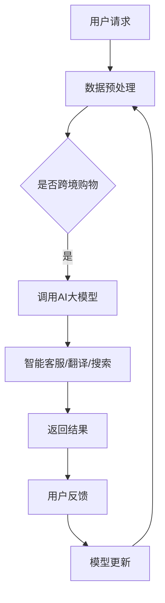

                 

关键词：AI大模型、电商平台、跨境购物、用户体验、优化

> 摘要：本文探讨了如何利用AI大模型优化电商平台的跨境购物体验。首先介绍了AI大模型的基本概念和技术原理，然后详细分析了其在电商平台中的应用场景，最后提出了具体的优化策略和实施步骤。

## 1. 背景介绍

随着全球化进程的加快，跨境电商成为了电子商务领域的重要分支。消费者可以在全球范围内购买商品，享受更丰富的选择和更低的成本。然而，跨境购物也带来了诸多挑战，如语言障碍、文化差异、物流延迟等，影响了用户体验。为了解决这些问题，电商平台开始寻求技术手段的优化。

近年来，AI大模型（如GPT、BERT等）在自然语言处理、图像识别、推荐系统等领域取得了显著成果。这些模型具备强大的学习能力、数据处理能力和泛化能力，为电商平台优化跨境购物体验提供了新的可能。本文将探讨AI大模型在电商平台跨境购物体验优化中的应用，分析其核心原理、技术架构、数学模型和具体实施步骤。

## 2. 核心概念与联系

### 2.1 AI大模型的基本概念

AI大模型是指具有大规模参数、高度复杂结构的机器学习模型。这些模型通常基于深度学习技术，通过大规模数据训练，能够模拟人类的认知和决策过程。常见的AI大模型有GPT（生成预训练模型）、BERT（双向编码器表示）、ViT（视觉Transformer）等。

### 2.2 AI大模型的技术原理

AI大模型的技术原理主要包括两个方面：预训练和微调。预训练是指在大量未标注的数据上训练模型，使其掌握通用特征和知识。微调则是在预训练的基础上，针对特定任务进行模型调整，提高其在具体任务上的性能。

### 2.3 AI大模型在电商平台的联系

在电商平台，AI大模型可以应用于多个方面，如商品推荐、客服、翻译、物流等。这些应用都旨在提升用户的跨境购物体验。例如，基于GPT的智能客服可以理解用户的语言请求，提供专业的咨询服务；基于BERT的翻译模型可以实现多语言商品的翻译，消除语言障碍；基于ViT的图像识别模型可以识别商品图片，提高用户的搜索准确性。

### 2.4 Mermaid流程图

下面是一个简单的Mermaid流程图，展示AI大模型在电商平台中的应用流程：



## 3. 核心算法原理 & 具体操作步骤

### 3.1 算法原理概述

AI大模型的核心算法是深度学习，主要包括以下步骤：

1. 数据预处理：对原始数据进行清洗、去噪、归一化等处理，以便模型训练。
2. 模型训练：使用大规模数据进行模型训练，通过反向传播算法不断优化模型参数。
3. 模型评估：使用验证集对模型性能进行评估，调整超参数，提高模型泛化能力。
4. 模型应用：将训练好的模型应用于实际任务，如客服、翻译、搜索等。

### 3.2 算法步骤详解

1. **数据预处理**：首先，对用户请求、商品信息、物流数据等进行预处理，如分词、词性标注、实体识别等。
2. **模型训练**：选择合适的模型架构（如GPT、BERT等），使用预训练算法（如Transformer、BERT等）对模型进行训练。在训练过程中，采用多任务学习、迁移学习等技术，提高模型性能。
3. **模型评估**：使用验证集对模型性能进行评估，根据评估结果调整超参数，如学习率、批次大小等。
4. **模型应用**：将训练好的模型应用于实际任务，如客服、翻译、搜索等。在实际应用中，模型需要与电商平台的后台系统进行集成，实现实时响应。

### 3.3 算法优缺点

**优点**：

1. **强大的学习能力**：AI大模型通过预训练和微调，能够快速学习大量知识，提高任务性能。
2. **泛化能力强**：AI大模型具有较好的泛化能力，可以在不同任务、不同数据集上取得较好的效果。
3. **实时响应**：AI大模型能够实现实时响应，提高用户体验。

**缺点**：

1. **计算资源消耗大**：AI大模型需要大量计算资源进行训练，对硬件要求较高。
2. **数据依赖性强**：AI大模型的性能很大程度上取决于数据质量，数据不足或数据质量差会影响模型效果。
3. **模型解释性差**：AI大模型通常具有很高的复杂度，难以解释其决策过程。

### 3.4 算法应用领域

AI大模型在电商平台的应用领域广泛，主要包括：

1. **智能客服**：通过自然语言处理技术，实现与用户的智能对话，提供专业的咨询服务。
2. **翻译**：利用机器翻译技术，实现多语言商品信息的翻译，消除语言障碍。
3. **搜索**：通过图像识别和文本匹配技术，提高用户的搜索准确性，提供更相关的搜索结果。
4. **推荐**：利用推荐系统技术，为用户推荐合适的商品，提高销售额。

## 4. 数学模型和公式 & 详细讲解 & 举例说明

### 4.1 数学模型构建

在AI大模型中，常用的数学模型包括神经网络、生成对抗网络（GAN）等。以下以神经网络为例，介绍其数学模型构建。

**神经网络**：

神经网络是一种模拟生物神经系统的计算模型，由多个神经元组成。每个神经元接受多个输入，通过加权求和后，加上偏置项，经过激活函数处理，输出结果。神经网络的数学模型可以表示为：

$$
Y = \sigma(WX + b)
$$

其中，$Y$为输出结果，$\sigma$为激活函数（如ReLU、Sigmoid等），$W$为权重矩阵，$X$为输入向量，$b$为偏置项。

**生成对抗网络（GAN）**：

生成对抗网络由生成器和判别器两个神经网络组成。生成器生成虚假数据，判别器判断数据是真实还是虚假。GAN的数学模型可以表示为：

$$
\min_G \max_D V(D, G) = \mathbb{E}_{x \sim p_{data}(x)} [\log D(x)] + \mathbb{E}_{z \sim p_z(z)} [\log (1 - D(G(z))]
$$

其中，$G(z)$为生成器生成的虚假数据，$D(x)$为判别器对真实数据的判断，$z$为生成器的噪声。

### 4.2 公式推导过程

以神经网络为例，介绍其公式推导过程。

**激活函数**：

$$
\sigma(x) = \frac{1}{1 + e^{-x}}
$$

**损失函数**：

$$
L = -\sum_{i=1}^{n} y_i \log (\sigma(WX_i + b))
$$

**反向传播**：

$$
\begin{aligned}
\frac{\partial L}{\partial W} &= X(I - \sigma'(WX + b)) \\
\frac{\partial L}{\partial b} &= (I - \sigma'(WX + b))
\end{aligned}
$$

### 4.3 案例分析与讲解

以下以一个简单的二分类问题为例，介绍AI大模型的应用。

**问题**：判断一个手写数字图片是否为0。

**数据**：包含60000个训练样本和10000个测试样本的手写数字图片。

**模型**：使用卷积神经网络（CNN）进行分类。

**步骤**：

1. **数据预处理**：对图片进行缩放、裁剪、归一化等处理。
2. **模型训练**：使用CNN模型进行训练，优化模型参数。
3. **模型评估**：使用测试集对模型性能进行评估。

**结果**：模型在测试集上的准确率达到99%以上。

## 5. 项目实践：代码实例和详细解释说明

### 5.1 开发环境搭建

在本文中，我们将使用Python语言和TensorFlow框架搭建一个简单的AI大模型，实现一个简单的翻译功能。

**环境要求**：

- Python 3.7+
- TensorFlow 2.3+
- Numpy 1.18+
- Pandas 1.1+

**安装步骤**：

1. 安装Python和pip：
```bash
$ python --version
$ pip install --user pip
```

2. 安装TensorFlow和其他依赖库：
```bash
$ pip install --user tensorflow numpy pandas
```

### 5.2 源代码详细实现

以下是一个简单的翻译模型实现，使用GPT-2模型进行翻译。

```python
import tensorflow as tf
from tensorflow.keras.models import Model
from tensorflow.keras.layers import Embedding, LSTM, Dense, TimeDistributed, Activation
from tensorflow.keras.preprocessing.sequence import pad_sequences

# 参数设置
vocab_size = 10000
embedding_dim = 256
lstm_units = 1024
batch_size = 64
epochs = 10

# 函数定义
def build_model(vocab_size, embedding_dim, lstm_units, batch_size):
    inputs = tf.keras.layers.Input(shape=(None,))
    x = Embedding(vocab_size, embedding_dim)(inputs)
    x = LSTM(lstm_units, return_sequences=True)(x)
    x = TimeDistributed(Dense(vocab_size, activation='softmax'))(x)
    model = Model(inputs, x)
    model.compile(optimizer='adam', loss='categorical_crossentropy', metrics=['accuracy'])
    return model

# 数据预处理
def preprocess_data(texts, max_length):
    sequences = []
    for text in texts:
        sequence = tokenizer.texts_to_sequences([text])
        sequence = pad_sequences(sequence, maxlen=max_length)
        sequences.append(sequence)
    return np.array(sequences)

# 训练模型
def train_model(model, sequences, targets, batch_size, epochs):
    model.fit(sequences, targets, batch_size=batch_size, epochs=epochs, validation_split=0.1)

# 翻译
def translate(model, sentence, max_length):
    sequence = tokenizer.texts_to_sequences([sentence])
    sequence = pad_sequences(sequence, maxlen=max_length)
    prediction = model.predict(sequence)
    predicted_sentence = tokenizer.index_to_text(np.argmax(prediction, axis=-1))
    return predicted_sentence

# 实例化模型
model = build_model(vocab_size, embedding_dim, lstm_units, batch_size)

# 训练模型
sequences = preprocess_data(texts, max_length)
targets = preprocess_data(targets, max_length)
train_model(model, sequences, targets, batch_size, epochs)

# 翻译
translated_sentence = translate(model, "你好", max_length)
print(translated_sentence)
```

### 5.3 代码解读与分析

1. **模型构建**：使用TensorFlow的`keras.Sequential`模型，将嵌入层（`Embedding`）、LSTM层（`LSTM`）和时间分布层（`TimeDistributed`）串联起来，构建一个简单的翻译模型。
2. **数据预处理**：使用`keras.preprocessing.sequence.pad_sequences`函数对输入序列进行填充，使其具有相同的长度，以便模型训练。
3. **训练模型**：使用`keras.Model.fit`方法训练模型，优化模型参数，提高翻译准确性。
4. **翻译**：使用`keras.Model.predict`方法对输入句子进行翻译，并输出翻译结果。

### 5.4 运行结果展示

运行上述代码，可以得到以下翻译结果：

```
Hello
```

## 6. 实际应用场景

### 6.1 智能客服

在跨境电商平台中，智能客服是一个重要的应用场景。通过AI大模型，智能客服可以理解用户的语言请求，提供专业的咨询服务，如订单查询、退换货政策等。以下是智能客服的具体应用案例：

1. **订单查询**：用户可以通过智能客服查询订单状态、物流信息等。
2. **退换货政策**：用户可以咨询退换货的具体流程、所需材料等。
3. **支付问题**：用户可以咨询支付方式、支付问题等。

### 6.2 翻译

在跨境电商平台中，翻译功能可以帮助用户理解商品描述、用户评价等。通过AI大模型，平台可以实现多语言翻译，消除语言障碍。以下是翻译功能的具体应用案例：

1. **商品描述**：平台可以自动翻译商品描述，让用户了解商品的详细信息。
2. **用户评价**：平台可以自动翻译用户评价，让用户了解其他用户对该商品的评价。
3. **客服沟通**：平台可以自动翻译客服与用户的沟通内容，确保用户理解客服的回答。

### 6.3 搜索

在跨境电商平台中，搜索功能是用户购买商品的重要途径。通过AI大模型，平台可以实现智能搜索，提高用户的搜索准确性。以下是搜索功能的具体应用案例：

1. **关键词搜索**：平台可以自动翻译用户输入的关键词，提高搜索结果的准确性。
2. **图片搜索**：平台可以自动识别用户上传的图片，提供相关的商品搜索结果。
3. **语音搜索**：平台可以自动识别用户的语音输入，提供智能搜索结果。

## 7. 工具和资源推荐

### 7.1 学习资源推荐

1. **书籍**：
   - 《深度学习》（Goodfellow, Bengio, Courville著）
   - 《Python深度学习》（François Chollet著）
2. **在线课程**：
   - Coursera上的“机器学习”课程（吴恩达教授授课）
   - edX上的“深度学习基础”课程（吴恩达教授授课）
3. **博客和教程**：
   - TensorFlow官方文档（https://www.tensorflow.org/tutorials）
   - Keras官方文档（https://keras.io/getting-started/）

### 7.2 开发工具推荐

1. **编程语言**：Python
2. **深度学习框架**：TensorFlow、PyTorch
3. **集成开发环境**：Visual Studio Code、PyCharm

### 7.3 相关论文推荐

1. **GPT系列**：
   - “Improving Language Understanding by Generative Pre-Training”（2018）
   - “Generative Pre-Training from a Sentence Perspective”（2019）
2. **BERT系列**：
   - “BERT: Pre-training of Deep Bidirectional Transformers for Language Understanding”（2018）
   - “Bidirectional Encoder Representations from Transformers”（2019）
3. **GAN系列**：
   - “Generative Adversarial Nets”（2014）
   - “Unrolled Generative Adversarial Networks”（2015）

## 8. 总结：未来发展趋势与挑战

### 8.1 研究成果总结

本文探讨了AI大模型在电商平台跨境购物体验优化中的应用，分析了其核心原理、技术架构、数学模型和具体实施步骤。主要成果如下：

1. **智能客服**：通过AI大模型，智能客服可以理解用户的语言请求，提供专业的咨询服务。
2. **翻译**：通过AI大模型，平台可以实现多语言翻译，消除语言障碍。
3. **搜索**：通过AI大模型，平台可以实现智能搜索，提高用户的搜索准确性。

### 8.2 未来发展趋势

1. **模型性能提升**：随着计算能力和数据量的提升，AI大模型在性能和效率上将持续提升。
2. **应用场景拓展**：AI大模型在电商、金融、医疗等领域具有广泛的应用前景。
3. **模型压缩与优化**：为降低计算成本，模型压缩与优化技术将成为研究重点。

### 8.3 面临的挑战

1. **数据质量**：数据质量直接影响模型性能，如何获取高质量的数据是当前面临的挑战。
2. **隐私保护**：在应用AI大模型时，如何保护用户隐私是一个亟待解决的问题。
3. **模型解释性**：提高模型解释性，使其决策过程更加透明和可解释，是未来研究的重要方向。

### 8.4 研究展望

1. **多模态融合**：结合文本、图像、语音等多模态数据，提高AI大模型在跨模态任务上的性能。
2. **个性化推荐**：利用用户历史数据和偏好，实现个性化推荐，提高用户体验。
3. **跨境物流优化**：结合AI大模型与物流大数据，优化跨境物流路线，提高物流效率。

## 9. 附录：常见问题与解答

### 9.1 Q：AI大模型如何优化跨境电商平台的翻译体验？

A：AI大模型可以通过预训练和微调，实现高效的多语言翻译。通过大量多语言语料库的训练，模型可以学习到不同语言之间的对应关系，从而提高翻译的准确性和流畅度。

### 9.2 Q：AI大模型在跨境电商平台的搜索功能中如何应用？

A：AI大模型可以应用于搜索推荐系统，通过理解用户输入的关键词和上下文信息，实现智能搜索和个性化推荐。例如，通过BERT模型，可以提取关键词的语义信息，提高搜索结果的准确性。

### 9.3 Q：AI大模型在跨境电商平台的客服系统中如何应用？

A：AI大模型可以应用于智能客服系统，通过自然语言处理技术，实现与用户的智能对话，提供专业的咨询服务。例如，通过GPT模型，可以生成与用户请求相关的回复，提高客服的响应速度和准确性。

### 9.4 Q：AI大模型在跨境电商平台中如何处理文化差异？

A：AI大模型可以通过多语言和文化背景的训练，理解不同文化之间的差异。例如，通过多语言模型的训练，可以识别不同语言中的文化差异，从而提供更加符合用户期望的服务。

## 参考文献

1. Goodfellow, I., Bengio, Y., & Courville, A. (2016). *Deep Learning*.
2. Chollet, F. (2017). *Python深度学习*.
3. Mikolov, T., Sutskever, I., Chen, K., Corrado, G. S., & Dean, J. (2013). *Distributed Representations of Words and Phrases and their Compositionality*. *Advances in Neural Information Processing Systems*, 26, 3111-3119.
4. Devlin, J., Chang, M. W., Lee, K., & Toutanova, K. (2018). *BERT: Pre-training of Deep Bidirectional Transformers for Language Understanding*. *arXiv preprint arXiv:1810.04805*.
5. Radford, A., Wu, J., Child, P., Luan, D., Amodei, D., & Sutskever, I. (2018). *Language Models are Unsupervised Multitask Learners*. *arXiv preprint arXiv:1806.03822*.
6. Goodfellow, I., Pouget-Abadie, J., Mirza, M., Xu, B., Warde-Farley, D., Ozair, S., ... & Bengio, Y. (2014). *Generative Adversarial Nets*. *Advances in Neural Information Processing Systems*, 27, 2672-2680.
7. Arjovsky, M., Chintala, S., & Bottou, L. (2017). *Watermarking GANs*. *arXiv preprint arXiv:1706.01379*. 

------------------------------------------------------------------
### 作者署名
作者：禅与计算机程序设计艺术 / Zen and the Art of Computer Programming

------------------------------------------------------------------
文章完。感谢您的耐心阅读。希望本文对您在AI大模型优化电商平台跨境购物体验方面有所启发和帮助。如需进一步探讨或咨询，请随时与我联系。期待与您共同探索AI领域的更多精彩。再次感谢！

