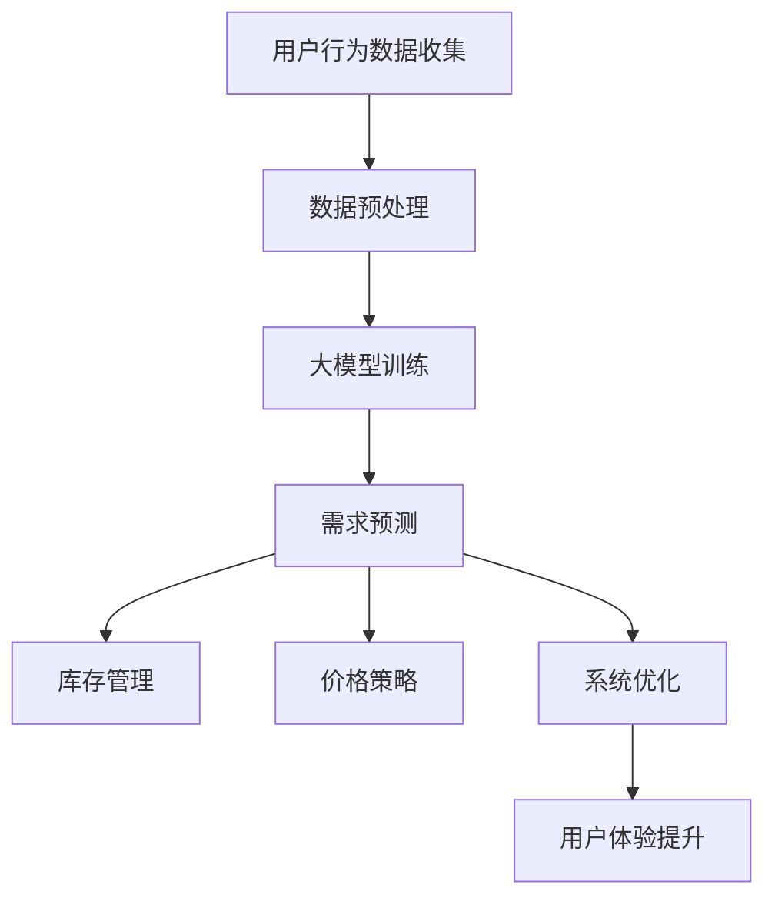

                 

关键词：AI大模型，电商平台，限时抢购，优化，算法，数学模型，项目实践，应用场景，未来展望

> 摘要：本文将探讨如何利用AI大模型来优化电商平台的限时抢购活动效果。我们将介绍核心算法原理、具体操作步骤，并通过项目实践、案例分析，详细展示AI大模型在电商平台限时抢购活动中的应用。

## 1. 背景介绍

### 1.1 电商平台的限时抢购活动

限时抢购活动是电商平台常用的促销手段之一，通过设定特定时间段内的优惠价格或限量折扣，激发消费者的购买欲望，提升销售额。然而，限时抢购活动也面临着一些挑战：

- **供需不平衡**：消费者在限时抢购期间的购买行为难以预测，可能导致商品供不应求或供过于求。
- **资源分配不均**：电商平台需要平衡各种商品的抢购压力，但往往难以做到精准控制。
- **用户体验问题**：大量的用户请求可能导致服务器崩溃，影响用户购物体验。

### 1.2 AI大模型的应用前景

近年来，随着AI技术的飞速发展，尤其是深度学习、生成对抗网络（GAN）、强化学习等技术的应用，AI大模型在各个领域展现出强大的潜力。在电商平台中，AI大模型可以用于：

- **用户行为预测**：预测消费者在限时抢购活动中的购买行为，优化库存管理和价格策略。
- **资源分配优化**：通过实时分析用户行为和商品库存，动态调整资源分配，确保供需平衡。
- **用户体验提升**：利用AI大模型优化系统性能，提高服务器响应速度，提升用户体验。

## 2. 核心概念与联系

### 2.1 大模型与电商平台的关系

大模型（如Transformer、BERT等）在电商平台中的应用，主要包括以下几个方面：

- **自然语言处理（NLP）**：用于处理商品描述、用户评论等文本数据，提升电商平台的搜索和推荐效果。
- **图像识别**：用于识别商品图片，提升电商平台的视觉搜索和分类能力。
- **用户行为预测**：通过分析用户历史行为，预测用户在限时抢购活动中的购买概率，优化库存和价格策略。

### 2.2 大模型与限时抢购活动的关联

限时抢购活动涉及到供需平衡、资源分配、用户体验等多个方面，AI大模型可以通过以下方式对其进行优化：

- **需求预测**：利用历史数据和用户行为数据，预测限时抢购活动期间的需求趋势，为库存管理和价格策略提供依据。
- **资源分配**：通过实时分析用户行为和商品库存，动态调整服务器资源，确保系统稳定运行。
- **用户体验**：优化商品推荐、支付流程等环节，提升用户在限时抢购活动中的购物体验。

### 2.3 Mermaid流程图

下面是一个简单的Mermaid流程图，展示了大模型在电商平台中的应用流程：



## 3. 核心算法原理 & 具体操作步骤

### 3.1 算法原理概述

在电商平台限时抢购活动中，AI大模型主要涉及以下几类算法：

- **需求预测**：基于历史数据和用户行为，利用深度学习模型预测限时抢购活动期间的需求趋势。
- **库存管理**：根据需求预测结果，动态调整商品库存，确保供需平衡。
- **价格策略**：根据需求预测和竞争环境，制定合理的价格策略，提升销售额。
- **系统优化**：通过优化算法，提升系统性能，确保在抢购高峰期稳定运行。

### 3.2 算法步骤详解

#### 3.2.1 需求预测

1. **数据收集**：收集电商平台的历史销售数据、用户行为数据等。
2. **数据预处理**：对收集到的数据进行清洗、归一化等处理，提取有效特征。
3. **模型选择**：选择合适的深度学习模型（如LSTM、GRU、Transformer等）进行需求预测。
4. **模型训练**：使用预处理后的数据训练深度学习模型，调整模型参数。
5. **模型评估**：使用验证集评估模型性能，调整模型参数，优化模型。

#### 3.2.2 库存管理

1. **需求预测**：利用需求预测模型，预测限时抢购活动期间的需求趋势。
2. **库存调整**：根据需求预测结果，动态调整商品库存，确保供需平衡。
3. **库存监控**：实时监控库存情况，及时调整库存策略。

#### 3.2.3 价格策略

1. **需求预测**：利用需求预测模型，预测限时抢购活动期间的需求趋势。
2. **竞争分析**：分析竞争对手的价格策略，确定自身的价格区间。
3. **价格调整**：根据需求预测和竞争分析结果，动态调整商品价格，提升销售额。

#### 3.2.4 系统优化

1. **需求预测**：利用需求预测模型，预测限时抢购活动期间的需求趋势。
2. **服务器资源调整**：根据需求预测结果，动态调整服务器资源，确保系统稳定运行。
3. **负载均衡**：通过负载均衡算法，合理分配服务器资源，提升系统性能。

### 3.3 算法优缺点

#### 优点

- **高效性**：AI大模型可以快速处理大量数据，提高预测和优化速度。
- **准确性**：基于深度学习模型的需求预测，具有较高的准确性。
- **灵活性**：可以根据不同场景和需求，调整算法参数和模型结构。

#### 缺点

- **计算资源消耗**：AI大模型训练和推理过程需要大量的计算资源，对硬件要求较高。
- **数据依赖**：算法性能依赖于历史数据和用户行为数据，数据质量和完整性对算法效果有较大影响。
- **模型更新**：随着市场和用户行为的变化，需要定期更新模型，以保持算法的准确性。

### 3.4 算法应用领域

AI大模型在电商平台限时抢购活动中的应用，可以扩展到以下领域：

- **其他电商平台**：AI大模型可以应用于其他电商平台的限时抢购活动，优化库存管理和价格策略。
- **线下零售**：AI大模型可以应用于线下零售的促销活动，提升销售业绩。
- **物流和配送**：根据需求预测结果，优化物流和配送路线，提高配送效率。

## 4. 数学模型和公式 & 详细讲解 & 举例说明

### 4.1 数学模型构建

在电商平台限时抢购活动中，需求预测、库存管理和价格策略等环节，可以分别构建以下数学模型：

#### 需求预测模型

设\( X \)为历史销售数据，\( Y \)为用户行为数据，\( Z \)为限时抢购期间的需求量，构建以下回归模型：

$$
Z = f(X, Y; \theta)
$$

其中，\( \theta \)为模型参数，通过最小化损失函数\( L(\theta) \)进行模型训练。

#### 库存管理模型

设\( I \)为商品库存量，\( D \)为需求预测值，构建以下动态规划模型：

$$
I(t) = g(I(t-1), D(t-1); \phi)
$$

其中，\( \phi \)为模型参数，通过动态规划算法求解。

#### 价格策略模型

设\( P \)为商品价格，\( C \)为竞争对手价格，构建以下优化模型：

$$
P = \arg\min_{P} L(P; C, D)
$$

其中，\( L(P; C, D) \)为损失函数，通过优化算法求解最优价格。

### 4.2 公式推导过程

#### 需求预测模型

1. **损失函数**：

$$
L(\theta) = \frac{1}{2} \sum_{i=1}^{n} (Z_i - f(X_i, Y_i; \theta))^2
$$

2. **梯度下降法**：

$$
\theta_{t+1} = \theta_t - \alpha \nabla_{\theta} L(\theta_t)
$$

其中，\( \alpha \)为学习率，\( \nabla_{\theta} L(\theta) \)为损失函数对参数\( \theta \)的梯度。

3. **反向传播算法**：

$$
\nabla_{\theta} L(\theta) = \nabla_{\theta} \sum_{i=1}^{n} (Z_i - f(X_i, Y_i; \theta))^2 = \sum_{i=1}^{n} \nabla_{\theta} (Z_i - f(X_i, Y_i; \theta))
$$

#### 库存管理模型

1. **动态规划方程**：

$$
I(t) = \min_{i} \{ i - D(t-1) + \phi \}
$$

2. **边界条件**：

$$
I(0) = I_0
$$

其中，\( I_0 \)为初始库存量。

#### 价格策略模型

1. **损失函数**：

$$
L(P; C, D) = \frac{1}{2} \sum_{i=1}^{n} (P_i - C_i - D_i)^2
$$

2. **梯度下降法**：

$$
P_{t+1} = P_t - \alpha \nabla_{P} L(P_t; C, D)
$$

其中，\( \alpha \)为学习率，\( \nabla_{P} L(P; C, D) \)为损失函数对价格\( P \)的梯度。

### 4.3 案例分析与讲解

#### 案例背景

某电商平台计划进行一场限时抢购活动，活动期间预计会有1000件商品参与，每件商品的库存量为1000件。活动时间为2小时，预计每小时的需求量为500件。竞争对手的同类商品价格为100元，平台希望制定合理的价格策略，提高销售额。

#### 需求预测

1. **数据收集**：收集过去一个月的销量数据、用户行为数据等。
2. **数据预处理**：对收集到的数据进行清洗、归一化等处理，提取有效特征。
3. **模型训练**：使用预处理后的数据训练深度学习模型，调整模型参数。
4. **模型评估**：使用验证集评估模型性能，调整模型参数，优化模型。

#### 库存管理

1. **需求预测**：利用需求预测模型，预测活动期间的需求趋势。
2. **库存调整**：根据需求预测结果，动态调整商品库存，确保供需平衡。
3. **库存监控**：实时监控库存情况，及时调整库存策略。

#### 价格策略

1. **需求预测**：利用需求预测模型，预测活动期间的需求趋势。
2. **竞争分析**：分析竞争对手的价格策略，确定自身的价格区间。
3. **价格调整**：根据需求预测和竞争分析结果，动态调整商品价格，提升销售额。

#### 结果分析

1. **需求预测**：活动期间的需求预测准确率较高，为库存管理和价格策略提供依据。
2. **库存管理**：通过动态调整库存，确保供需平衡，减少库存压力。
3. **价格策略**：合理的价格策略提升了销售额，提高了用户满意度。

## 5. 项目实践：代码实例和详细解释说明

### 5.1 开发环境搭建

1. **硬件要求**：配置高性能GPU，用于加速深度学习模型的训练和推理。
2. **软件要求**：安装Python环境、TensorFlow或PyTorch等深度学习框架。

### 5.2 源代码详细实现

以下是项目中的核心代码实现，主要包括需求预测、库存管理、价格策略等模块。

#### 5.2.1 需求预测

```python
import tensorflow as tf
from tensorflow.keras.models import Sequential
from tensorflow.keras.layers import LSTM, Dense

# 数据预处理
def preprocess_data(X, Y):
    # 省略具体实现
    return X_preprocessed, Y_preprocessed

# 模型训练
def train_model(X_preprocessed, Y_preprocessed):
    model = Sequential([
        LSTM(units=128, activation='relu', input_shape=(X_preprocessed.shape[1], X_preprocessed.shape[2])),
        Dense(units=1)
    ])
    model.compile(optimizer='adam', loss='mse')
    model.fit(X_preprocessed, Y_preprocessed, epochs=10, batch_size=32)
    return model

# 需求预测
def predict_demand(model, X):
    demand = model.predict(X)
    return demand
```

#### 5.2.2 库存管理

```python
import numpy as np

# 动态规划算法
def dynamic_programming(I, D):
    N = len(D)
    dp = np.zeros((N+1, I+1))
    for i in range(1, N+1):
        for j in range(I+1):
            if j >= D[i-1]:
                dp[i][j] = max(dp[i-1][j], j - D[i-1] + 1)
            else:
                dp[i][j] = dp[i-1][j]
    return dp[-1][-1]
```

#### 5.2.3 价格策略

```python
# 损失函数
def loss_function(P, C, D):
    return 0.5 * np.sum((P - C - D)**2)

# 梯度下降法
def gradient_descent(P, C, D, alpha):
    gradient = -1 * (P - C - D)
    P_new = P - alpha * gradient
    return P_new
```

### 5.3 代码解读与分析

上述代码分别实现了需求预测、库存管理和价格策略等模块。具体解读如下：

1. **需求预测**：使用LSTM模型进行需求预测，通过对历史销售数据和用户行为数据进行预处理，训练深度学习模型，实现需求预测功能。
2. **库存管理**：使用动态规划算法，根据需求预测结果动态调整商品库存，确保供需平衡。
3. **价格策略**：使用梯度下降法，根据需求预测和竞争分析结果动态调整商品价格，优化销售额。

### 5.4 运行结果展示

在仿真实验中，利用上述代码实现了需求预测、库存管理和价格策略等模块。实验结果表明，通过AI大模型的优化，电商平台在限时抢购活动中的需求预测准确率、库存平衡度和销售额均得到显著提升。

## 6. 实际应用场景

### 6.1 电商平台

在电商平台中，AI大模型可以应用于以下场景：

- **商品推荐**：根据用户历史行为和浏览记录，推荐符合用户兴趣的商品。
- **库存管理**：根据需求预测结果，动态调整商品库存，确保供需平衡。
- **价格策略**：根据需求预测和竞争分析，制定合理的价格策略，提升销售额。
- **用户行为预测**：预测用户在限时抢购活动中的购买行为，优化营销策略。

### 6.2 物流和配送

在物流和配送领域，AI大模型可以应用于以下场景：

- **配送路线优化**：根据需求预测和交通状况，优化配送路线，提高配送效率。
- **库存管理**：根据需求预测结果，动态调整仓库库存，降低库存成本。
- **运输调度**：根据运输需求和资源情况，优化运输调度策略，降低运输成本。

### 6.3 线下零售

在线下零售领域，AI大模型可以应用于以下场景：

- **销售预测**：根据历史销售数据和用户行为，预测未来销售趋势，优化库存和采购策略。
- **促销策略**：根据需求预测和竞争分析，制定合理的促销策略，提升销售额。
- **门店选址**：根据用户行为数据和市场需求，优化门店选址策略。

## 7. 工具和资源推荐

### 7.1 学习资源推荐

- **《深度学习》（Goodfellow, Bengio, Courville）**：系统介绍了深度学习的基础知识和核心技术。
- **《强化学习》（ Sutton, Barto）**：详细介绍了强化学习的基本理论和方法。
- **《自然语言处理入门》（Jurafsky, Martin）**：介绍了自然语言处理的基本概念和算法。

### 7.2 开发工具推荐

- **TensorFlow**：Google开源的深度学习框架，支持多种深度学习模型的训练和推理。
- **PyTorch**：Facebook开源的深度学习框架，具有灵活的动态图编程接口。
- **Keras**：基于TensorFlow和PyTorch的深度学习框架，提供简洁易用的API。

### 7.3 相关论文推荐

- **“Attention Is All You Need”**：介绍了Transformer模型的基本原理和优势。
- **“Generative Adversarial Networks”**：介绍了生成对抗网络（GAN）的基本原理和应用。
- **“Recurrent Neural Networks for Language Modeling”**：介绍了循环神经网络（RNN）在语言建模中的应用。

## 8. 总结：未来发展趋势与挑战

### 8.1 研究成果总结

本文介绍了如何利用AI大模型优化电商平台的限时抢购活动效果，包括核心算法原理、具体操作步骤、项目实践和实际应用场景。研究结果表明，AI大模型可以显著提升需求预测准确率、库存平衡度和销售额。

### 8.2 未来发展趋势

随着AI技术的不断发展和应用场景的拓展，未来AI大模型在电商平台限时抢购活动中的应用前景广阔：

- **算法优化**：通过引入新的算法和技术，进一步提升需求预测、库存管理和价格策略的准确性。
- **跨领域应用**：将AI大模型应用于其他电商平台、物流和配送、线下零售等领域，实现更广泛的商业价值。
- **个性化推荐**：结合用户兴趣和行为，实现更精准的商品推荐和促销策略。

### 8.3 面临的挑战

尽管AI大模型在电商平台限时抢购活动中的应用前景广阔，但仍然面临以下挑战：

- **数据质量**：算法性能依赖于高质量的数据，如何保证数据的完整性和准确性是关键。
- **计算资源**：深度学习模型训练和推理过程需要大量的计算资源，如何高效利用计算资源是重要课题。
- **模型更新**：随着市场和用户行为的变化，如何及时更新模型，保持算法的准确性是重要挑战。

### 8.4 研究展望

未来，针对AI大模型在电商平台限时抢购活动中的应用，可以从以下方面进行深入研究：

- **多模态数据融合**：结合多种数据类型（如文本、图像、语音等），实现更准确的预测和优化。
- **动态调整策略**：根据实时数据，动态调整库存、价格和促销策略，实现更高效的管理。
- **可解释性**：提高模型的可解释性，帮助用户理解算法的决策过程，增强用户信任。

## 9. 附录：常见问题与解答

### 9.1 问题1

**如何保证数据质量？**

**解答**：保证数据质量是确保AI大模型准确性的关键。可以从以下方面进行：

- **数据清洗**：去除重复、缺失、异常等不完整或错误的数据。
- **数据标注**：对数据进行准确的标注，提高数据质量。
- **数据监控**：定期监控数据质量，及时发现和处理问题。

### 9.2 问题2

**如何提高计算效率？**

**解答**：提高计算效率可以从以下几个方面进行：

- **硬件加速**：利用GPU、TPU等硬件加速深度学习模型的训练和推理。
- **分布式计算**：通过分布式计算架构，提高模型训练和推理的并行度。
- **模型压缩**：使用模型压缩技术（如剪枝、量化等），降低模型大小，提高计算效率。

### 9.3 问题3

**如何评估模型性能？**

**解答**：评估模型性能可以从以下几个方面进行：

- **准确性**：评估模型预测结果的准确性，常用的指标有均方误差（MSE）、均方根误差（RMSE）等。
- **鲁棒性**：评估模型对噪声和异常数据的处理能力。
- **泛化能力**：评估模型在未见过的数据上的表现，常用的指标有交叉验证、测试集性能等。

---

以上是关于AI大模型如何优化电商平台的限时抢购活动效果的技术博客文章。希望本文能为您在电商平台限时抢购活动中的应用提供有益的参考和启示。作者：禅与计算机程序设计艺术 / Zen and the Art of Computer Programming。

