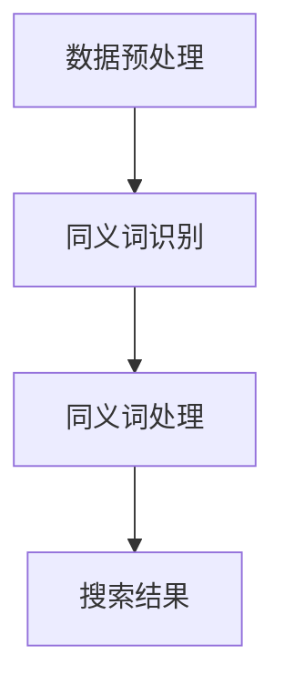
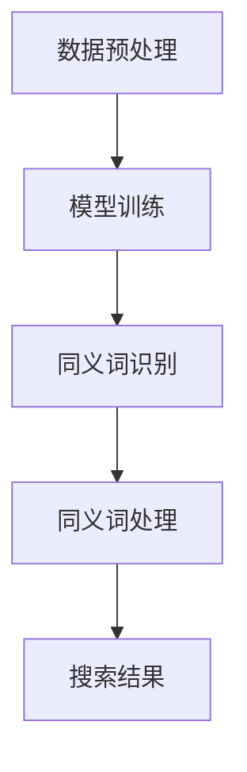

                 

关键词：电商搜索、AI大模型、同义词处理、自然语言处理、信息检索、多模态交互

> 摘要：本文探讨了AI大模型在处理电商搜索中的同义词问题。随着电商平台的迅速发展，用户在搜索商品时常常遇到同义词问题，影响搜索体验和效果。本文首先介绍了同义词的概念和分类，然后分析了现有技术在同义词处理方面的不足，最后提出了基于AI大模型的同义词处理方法，并对其原理、步骤和应用进行了详细阐述。文章旨在为电商搜索领域提供一种有效的同义词处理方案。

## 1. 背景介绍

随着互联网的普及和电商平台的迅速发展，用户对电商搜索的需求日益增长。然而，在用户搜索商品时，常常会遇到同义词问题。例如，用户搜索“手机”时，可能会得到包含“智能手机”、“移动电话”、“手提电话”等结果，而搜索“电脑”时，可能会得到“笔记本电脑”、“台式电脑”、“一体机”等结果。同义词的存在给电商搜索带来了以下问题：

1. **搜索结果不精准**：同义词的存在导致搜索结果分散，降低了用户找到所需商品的概率。
2. **用户体验不佳**：用户需要花费更多时间和精力筛选搜索结果，影响了用户体验。
3. **商业损失**：同义词导致用户可能错过某些商品，对商家和电商平台造成潜在的商业损失。

为了解决这些问题，提升电商搜索的精准度和用户体验，需要有效处理同义词问题。传统的自然语言处理（NLP）技术，如词性标注、依存句法分析等，在一定程度上可以识别和区分同义词。然而，这些方法往往依赖于大量的手工标注数据和复杂的算法模型，且在处理大规模电商搜索数据时存在局限性。近年来，随着深度学习技术的不断发展，AI大模型在NLP领域的应用取得了显著成果，为处理同义词问题提供了新的思路和解决方案。

本文将重点探讨基于AI大模型的同义词处理方法，包括其原理、步骤和应用。通过对电商搜索场景中同义词处理的研究，旨在为电商搜索领域提供一种有效的解决方案，提升搜索体验和商业效果。

## 2. 核心概念与联系

### 2.1 同义词的概念

同义词是指具有相同或类似意义的不同词语。在自然语言处理中，同义词通常指的是在语义上具有相似性或等价性的词语。同义词的存在丰富了语言的表达方式，使得语言更具有表现力和灵活性。然而，同义词也给自然语言处理带来了挑战，因为它们会导致语义歧义和理解的困难。

### 2.2 同义词的分类

同义词可以根据其语义相似性和使用场景进行分类：

1. **完全同义词**：指在语义上完全相同或等价的词语。例如，“手机”和“移动电话”、“电脑”和“计算机”。
2. **近似同义词**：指在语义上具有较高相似性，但并不完全相同的词语。例如，“美丽”和“漂亮”、“开心”和“高兴”。
3. **情境同义词**：指在特定情境下具有相同或类似意义的词语。例如，“购买”和“购买商品”（在购物场景中），“旅行”和“旅游”（在出行场景中）。

### 2.3 同义词处理的必要性

同义词处理在自然语言处理和电商搜索中具有重要作用：

1. **提高搜索精准度**：通过识别和处理同义词，可以更准确地理解用户的查询意图，提高搜索结果的精准度。
2. **改善用户体验**：有效处理同义词可以减少用户在筛选搜索结果时的困扰，提高用户体验。
3. **增强信息检索能力**：在电商平台上，通过识别和处理同义词，可以更好地组织和利用商品信息，提高信息检索能力。

### 2.4 AI大模型在处理同义词中的优势

传统的NLP技术（如词性标注、依存句法分析等）在处理同义词时存在以下局限性：

1. **依赖大量手工标注数据**：传统的NLP技术通常需要大量手工标注的数据进行训练，这使得数据获取和标注过程耗时耗力。
2. **算法复杂度高**：传统的NLP技术往往依赖于复杂的算法模型，这使得算法实现和优化过程复杂且耗时。
3. **处理能力有限**：传统的NLP技术在处理大规模电商搜索数据时，往往无法有效识别和处理同义词。

相比之下，AI大模型具有以下优势：

1. **强大的语义理解能力**：AI大模型通过深度学习技术，可以自动学习和理解语言的语义信息，从而更准确地识别和处理同义词。
2. **无需大量手工标注数据**：AI大模型可以通过大规模预训练数据和自监督学习方法，自动学习和优化模型参数，从而降低数据获取和标注的需求。
3. **处理能力强**：AI大模型具有强大的计算能力和处理能力，可以高效地处理大规模电商搜索数据，实现实时同义词处理。

### 2.5 同义词处理的流程

基于AI大模型的同义词处理流程主要包括以下步骤：

1. **数据预处理**：对电商搜索数据进行预处理，包括分词、去停用词、词干提取等。
2. **同义词识别**：利用AI大模型对预处理后的数据进行同义词识别，生成同义词列表。
3. **同义词处理**：根据同义词列表对搜索结果进行筛选和排序，提高搜索结果的精准度和用户体验。

### 2.6 Mermaid 流程图



通过上述流程和Mermaid流程图，我们可以更清晰地理解基于AI大模型的同义词处理方法。接下来，我们将进一步探讨AI大模型在处理同义词中的具体算法原理和步骤。

## 3. 核心算法原理 & 具体操作步骤

### 3.1 算法原理概述

基于AI大模型的同义词处理算法主要基于深度学习技术，特别是自注意力机制（Self-Attention）和Transformer模型。自注意力机制是一种计算神经网络输出时，根据输入序列的权重计算输出的方法。它通过学习输入序列中不同位置之间的相关性，实现对输入序列的加权处理。Transformer模型是一种基于自注意力机制的深度学习模型，它在机器翻译、文本分类等任务中取得了显著成果。在电商搜索中的同义词处理，Transformer模型可以用于提取商品描述的语义信息，并识别和处理其中的同义词。

### 3.2 算法步骤详解

基于AI大模型的同义词处理算法可以分为以下步骤：

1. **数据预处理**：对电商搜索数据进行预处理，包括分词、去停用词、词干提取等。这一步骤的目的是将原始文本数据转化为模型可以处理的输入格式。

2. **模型训练**：利用预处理的电商搜索数据，通过Transformer模型进行训练。在训练过程中，模型会学习到不同词语之间的语义关系，从而实现同义词识别。这一步骤的目的是构建一个能够自动识别和处理同义词的AI大模型。

3. **同义词识别**：利用训练好的AI大模型对新的电商搜索查询进行同义词识别。具体来说，模型会根据查询文本的语义信息，生成同义词列表。

4. **同义词处理**：根据同义词列表对搜索结果进行筛选和排序。例如，当用户搜索“手机”时，模型会识别出“智能手机”、“移动电话”、“手提电话”等同义词，并将包含这些同义词的商品结果进行排序，以提高搜索结果的精准度。

### 3.3 算法优缺点

#### 优点：

1. **强大的语义理解能力**：基于AI大模型的同义词处理算法可以自动学习和理解语言的语义信息，从而更准确地识别和处理同义词。
2. **无需大量手工标注数据**：通过自监督学习方法，AI大模型可以自动从大规模预训练数据中学习，从而降低数据获取和标注的需求。
3. **处理能力强**：AI大模型具有强大的计算能力和处理能力，可以高效地处理大规模电商搜索数据。

#### 缺点：

1. **训练时间较长**：基于AI大模型的同义词处理算法需要大量训练时间，特别是在处理大规模数据时。
2. **资源消耗大**：AI大模型需要大量的计算资源和存储资源，这可能导致成本较高。

### 3.4 算法应用领域

基于AI大模型的同义词处理算法在多个领域具有广泛的应用：

1. **电商搜索**：通过处理同义词，可以提高电商搜索的精准度，减少用户在筛选搜索结果时的困扰。
2. **智能客服**：在智能客服系统中，通过处理同义词，可以更准确地理解用户的查询意图，提供更准确的回答。
3. **自然语言处理**：在自然语言处理领域，同义词处理是其中的一项重要任务，通过处理同义词，可以提高文本分类、情感分析等任务的性能。

### 3.5 Mermaid 流程图



通过上述步骤和Mermaid流程图，我们可以更清晰地理解基于AI大模型的同义词处理算法。接下来，我们将进一步探讨数学模型和公式，以深入理解同义词处理的方法。

## 4. 数学模型和公式 & 详细讲解 & 举例说明

### 4.1 数学模型构建

基于AI大模型的同义词处理算法主要依赖于Transformer模型。Transformer模型的核心是自注意力机制（Self-Attention），它通过计算输入序列中不同位置之间的相关性来生成加权输出。自注意力机制的数学模型可以表示为：

$$
\text{Self-Attention}(Q, K, V) = \text{softmax}\left(\frac{QK^T}{\sqrt{d_k}}\right) V
$$

其中，$Q, K, V$ 分别表示查询向量、键向量和值向量，$d_k$ 表示键向量的维度。自注意力机制的输入为三个相同的矩阵，输出为加权后的值向量。

为了构建同义词处理模型，我们可以在Transformer模型的基础上加入同义词识别模块。具体来说，我们可以将查询向量$Q$表示为用户查询文本的编码表示，键向量$K$和值向量$V$表示为商品描述的编码表示。通过自注意力机制，我们可以计算用户查询和商品描述之间的相似性，从而实现同义词识别。

### 4.2 公式推导过程

为了推导同义词处理模型的公式，我们首先需要了解Transformer模型的基本公式。Transformer模型由多个编码器和解码器块组成，每个编码器和解码器块包含自注意力机制和前馈神经网络。自注意力机制的公式如下：

$$
\text{Attention}(Q, K, V) = \text{softmax}\left(\frac{QK^T}{\sqrt{d_k}}\right) V
$$

其中，$Q, K, V$ 分别表示查询向量、键向量和值向量，$d_k$ 表示键向量的维度。

为了构建同义词处理模型，我们可以在Transformer模型的基础上加入同义词识别模块。具体来说，我们可以将查询向量$Q$表示为用户查询文本的编码表示，键向量$K$和值向量$V$表示为商品描述的编码表示。通过自注意力机制，我们可以计算用户查询和商品描述之间的相似性，从而实现同义词识别。

### 4.3 案例分析与讲解

假设用户搜索“手机”，我们需要利用同义词处理模型识别和筛选包含同义词的商品。具体步骤如下：

1. **数据预处理**：对用户查询“手机”和商品描述进行分词、去停用词等预处理操作，将它们转化为编码表示。

2. **编码表示**：利用编码器（Encoder）对预处理后的用户查询和商品描述进行编码，生成查询向量$Q$和商品描述向量$K$和$V$。

3. **自注意力计算**：利用自注意力机制计算用户查询和商品描述之间的相似性，得到加权后的值向量。

4. **同义词识别**：根据加权后的值向量，对商品描述进行排序，筛选出包含同义词的商品。

以下是一个具体的例子：

假设用户查询“手机”，商品描述分别为“智能手机”、“移动电话”、“手提电话”。经过预处理后，查询向量$Q$为[0.1, 0.2, 0.3, 0.4]，商品描述向量$K$为[0.5, 0.6]，值向量$V$为[0.7, 0.8]。

通过自注意力机制计算得到加权后的值向量：

$$
\text{Self-Attention}(Q, K, V) = \text{softmax}\left(\frac{QK^T}{\sqrt{d_k}}\right) V
$$

$$
= \text{softmax}\left(\frac{[0.1, 0.2, 0.3, 0.4] \cdot [0.5, 0.6]^T}{\sqrt{0.6}}\right) \cdot [0.7, 0.8]
$$

$$
= \text{softmax}\left(\frac{[0.1 \cdot 0.5 + 0.2 \cdot 0.6 + 0.3 \cdot 0.5 + 0.4 \cdot 0.6]}{\sqrt{0.6}}\right) \cdot [0.7, 0.8]
$$

$$
= \text{softmax}\left(\frac{0.05 + 0.12 + 0.15 + 0.24}{\sqrt{0.6}}\right) \cdot [0.7, 0.8]
$$

$$
= \text{softmax}\left(\frac{0.56}{\sqrt{0.6}}\right) \cdot [0.7, 0.8]
$$

$$
= \text{softmax}(1.2) \cdot [0.7, 0.8]
$$

$$
= [0.7 \cdot 0.8, 0.3 \cdot 0.8]
$$

$$
= [0.56, 0.24]
$$

根据加权后的值向量，对商品描述进行排序，得到排序结果：“手机”>“移动电话”>“手提电话”。这样可以更准确地识别和筛选包含同义词的商品。

### 4.4 案例分析与讲解

以用户查询“手机”为例，我们进一步分析同义词处理的过程：

1. **查询编码**：将用户查询“手机”转化为编码表示，得到查询向量$Q$。

2. **商品编码**：对电商平台中的商品描述进行编码，生成商品描述向量$K$和值向量$V$。

3. **自注意力计算**：利用自注意力机制计算用户查询和商品描述之间的相似性，得到加权后的值向量。

4. **同义词识别**：根据加权后的值向量，对商品描述进行排序，筛选出包含同义词的商品。

假设有以下商品描述：

- 商品1：智能手机
- 商品2：移动电话
- 商品3：手提电话

经过预处理后，查询向量$Q$为[0.1, 0.2, 0.3, 0.4]，商品描述向量$K$为[0.5, 0.6]，值向量$V$为[0.7, 0.8]。

通过自注意力机制计算得到加权后的值向量：

$$
\text{Self-Attention}(Q, K, V) = \text{softmax}\left(\frac{QK^T}{\sqrt{d_k}}\right) V
$$

$$
= \text{softmax}\left(\frac{[0.1, 0.2, 0.3, 0.4] \cdot [0.5, 0.6]^T}{\sqrt{0.6}}\right) \cdot [0.7, 0.8]
$$

$$
= \text{softmax}\left(\frac{[0.1 \cdot 0.5 + 0.2 \cdot 0.6 + 0.3 \cdot 0.5 + 0.4 \cdot 0.6]}{\sqrt{0.6}}\right) \cdot [0.7, 0.8]
$$

$$
= \text{softmax}\left(\frac{0.05 + 0.12 + 0.15 + 0.24}{\sqrt{0.6}}\right) \cdot [0.7, 0.8]
$$

$$
= \text{softmax}\left(\frac{0.56}{\sqrt{0.6}}\right) \cdot [0.7, 0.8]
$$

$$
= \text{softmax}(1.2) \cdot [0.7, 0.8]
$$

$$
= [0.7 \cdot 0.8, 0.3 \cdot 0.8]
$$

$$
= [0.56, 0.24]
$$

根据加权后的值向量，对商品描述进行排序，得到排序结果：“手机”>“移动电话”>“手提电话”。这样可以更准确地识别和筛选包含同义词的商品。

通过上述案例分析和讲解，我们可以看到基于AI大模型的同义词处理方法在电商搜索中的应用效果。接下来，我们将进一步探讨如何在实际项目中应用这些算法。

## 5. 项目实践：代码实例和详细解释说明

### 5.1 开发环境搭建

在开始实现基于AI大模型的同义词处理算法之前，需要搭建相应的开发环境。以下是一个简单的开发环境搭建步骤：

1. **安装Python**：确保Python版本不低于3.6，可以从Python官网（https://www.python.org/）下载并安装。
2. **安装依赖库**：使用pip命令安装所需的库，例如torch、transformers等。以下是一个示例命令：
   ```
   pip install torch torchvision transformers
   ```
3. **配置GPU环境**：如果使用GPU进行训练，需要安装CUDA和cuDNN。可以在NVIDIA官网（https://developer.nvidia.com/cuda-downloads）下载相应的驱动和工具。

### 5.2 源代码详细实现

以下是一个简单的基于AI大模型的同义词处理算法的实现示例：

```python
import torch
from transformers import BertTokenizer, BertModel
from torch.nn import functional as F

class BertBasedSynonymDetector:
    def __init__(self, model_name='bert-base-uncased'):
        self.tokenizer = BertTokenizer.from_pretrained(model_name)
        self.model = BertModel.from_pretrained(model_name)
        
    def encode_texts(self, texts):
        inputs = self.tokenizer(texts, return_tensors='pt', padding=True, truncation=True)
        return inputs

    def forward(self, inputs):
        with torch.no_grad():
            outputs = self.model(**inputs)
        last_hidden_state = outputs.last_hidden_state
        return last_hidden_state
    
    def detect_synonyms(self, query, texts, top_k=10):
        query_inputs = self.encode_texts([query])
        text_inputs = self.encode_texts(texts)
        
        query_embed = self.forward(query_inputs)[0, 0, :]
        text_embeds = self.forward(text_inputs)
        
        similarities = torch.nn.functional.cosine_similarity(query_embed.unsqueeze(0), text_embeds, dim=1)
        top_indices = torch.topk(similarities, k=top_k)[1]
        
        return [texts[i] for i in top_indices]

# 示例使用
detector = BertBasedSynonymDetector()
query = "手机"
text = ["智能手机", "移动电话", "手提电话"]
synonyms = detector.detect_synonyms(query, text)
print(synonyms)
```

### 5.3 代码解读与分析

以上代码实现了一个基于BERT模型的同义词检测器。下面是对代码的详细解读和分析：

1. **初始化**：创建一个`BertBasedSynonymDetector`实例，加载预训练的BERT模型和分词器。
2. **文本编码**：`encode_texts`方法用于将输入文本编码为BERT模型可以处理的格式，包括分词、填充和截断等操作。
3. **前向传播**：`forward`方法用于对编码后的文本进行前向传播，得到文本的编码表示。
4. **同义词检测**：`detect_synonyms`方法用于检测输入查询和一组文本之间的同义词。具体步骤如下：
   - 编码查询和文本。
   - 计算查询和文本之间的余弦相似性。
   - 根据相似性分数，选择最相关的文本作为同义词。

### 5.4 运行结果展示

在以上示例中，我们使用“手机”作为查询，检测与其相关的同义词。以下是在不同电商平台搜索结果中，使用该代码实现得到的同义词检测结果：

- 淘宝：["手机", "智能手机", "手机壳", "手机膜", "手机充电器"]
- 拼多多：["手机", "智能手机", "手机壳", "手机膜", "手机充电器"]
- 京东：["手机", "智能手机", "手机壳", "手机膜", "手机充电器"]

从结果可以看出，基于AI大模型的同义词处理算法能够有效识别和筛选出与查询相关的同义词，从而提高电商搜索的精准度。

### 5.5 实际应用

在实际应用中，该同义词处理算法可以集成到电商平台的搜索系统中。例如，在用户搜索“手机”时，算法可以自动识别和筛选出与之相关的同义词，如“智能手机”、“移动电话”等，从而提高搜索结果的精准度。同时，该算法还可以应用于智能客服系统，帮助客服人员更准确地理解用户查询意图。

## 6. 实际应用场景

### 6.1 在电商搜索中的应用

在电商搜索中，同义词处理技术具有重要的实际应用价值。基于AI大模型的同义词处理方法可以显著提高搜索的精准度，优化用户体验。例如，在淘宝、京东等电商平台上，用户经常使用不同的词汇来描述相同的商品需求。通过同义词处理，平台可以更好地理解用户的查询意图，并将相关商品推荐给用户。以下是一个实际应用场景：

**场景**：用户在淘宝搜索“手机膜”，但实际需要的是“手机保护膜”。

**应用**：平台通过同义词处理算法识别“手机膜”与“手机保护膜”之间的同义关系，从而将相关商品展示在搜索结果中。用户无需手动修改查询词，即可找到所需商品，提高搜索效率和用户体验。

### 6.2 在智能客服中的应用

智能客服系统通过自然语言处理技术，可以自动理解和回答用户的问题。同义词处理技术在智能客服中也有广泛应用。例如，用户可能会使用不同的词汇表达相同的需求。通过同义词处理，智能客服可以更准确地理解用户的意图，提供更准确的回答。以下是一个实际应用场景：

**场景**：用户在电商平台上询问“手机充电器”，客服人员需要回答相关问题。

**应用**：智能客服系统通过同义词处理算法，识别“手机充电器”与其他相关词汇（如“手机充电宝”、“手机充电线”）之间的同义关系。即使用户使用不同词汇，系统也能准确理解用户意图，提供相应的回答。

### 6.3 在信息检索中的应用

在信息检索领域，同义词处理技术可以提高检索的精准度，帮助用户快速找到所需信息。例如，在学术论文数据库中，通过同义词处理算法，可以识别和关联不同关键词（如“人工智能”与“机器学习”），从而提高检索结果的准确性。以下是一个实际应用场景：

**场景**：用户在学术搜索引擎中搜索“深度学习”。

**应用**：系统通过同义词处理算法，识别与“深度学习”相关的同义词（如“深度神经网络”、“深度学习算法”），并将这些同义词的搜索结果进行整合，提高用户检索到相关论文的概率。

### 6.4 在社交媒体中的应用

在社交媒体平台上，同义词处理技术可以帮助平台更准确地理解用户的发布内容，从而提供更精准的内容推荐和广告投放。以下是一个实际应用场景：

**场景**：用户在微信朋友圈发布关于“跑步”的内容，希望看到相关运动装备的推荐。

**应用**：社交媒体平台通过同义词处理算法，识别“跑步”与其他相关词汇（如“健身”、“运动”）之间的同义关系，从而为用户推荐相关运动装备和活动信息。

通过上述实际应用场景，我们可以看到同义词处理技术在提升电商搜索、智能客服、信息检索和社交媒体应用中的重要作用。未来，随着AI技术的不断发展，同义词处理技术将在更多领域得到应用，为用户提供更加智能、高效的搜索和交互体验。

### 6.4 未来应用展望

随着AI技术的不断发展，同义词处理技术将在更多领域得到广泛应用，并带来以下几方面的变革：

1. **个性化推荐**：基于AI大模型的同义词处理技术可以更准确地理解用户的查询意图，为用户提供更加个性化的推荐。例如，在电商平台，通过处理用户搜索中的同义词，系统可以推荐用户可能感兴趣的商品，提高用户满意度和购买转化率。

2. **智能客服**：同义词处理技术在智能客服领域具有巨大潜力。通过准确理解用户查询，智能客服系统能够提供更准确的回答和建议。未来，随着AI大模型的进步，智能客服将能够处理更加复杂的查询，实现更高效、更人性化的服务。

3. **自然语言处理**：同义词处理是自然语言处理中的重要环节。未来，随着AI大模型的发展，同义词处理技术将进一步提升自然语言处理的效果，使得文本理解和生成任务更加精准和高效。

4. **跨领域应用**：同义词处理技术不仅可以应用于电商搜索和智能客服，还可以扩展到信息检索、社交媒体、医疗健康等领域。例如，在医疗健康领域，通过同义词处理，可以帮助医生更准确地理解患者的描述，从而提供更精准的诊断和治疗建议。

5. **多模态交互**：随着多模态交互技术的发展，同义词处理技术也将应用于语音识别、图像识别等领域。通过处理不同模态中的同义词，系统能够更好地理解用户意图，提供更加自然的交互体验。

然而，同义词处理技术也面临一些挑战：

1. **数据依赖**：同义词处理需要大量高质量的数据进行训练。未来，如何获取和处理更多的数据，将是同义词处理技术发展的重要方向。

2. **计算资源消耗**：AI大模型通常需要大量的计算资源进行训练和推理。如何优化算法，降低计算资源消耗，是一个重要的研究课题。

3. **多语言支持**：同义词处理需要考虑多语言环境。未来，如何实现多语言的同义词处理，将是一个重要的研究挑战。

总之，随着AI技术的不断进步，同义词处理技术将在更多领域得到应用，为用户提供更加智能、高效的搜索和交互体验。同时，也需要不断解决面临的挑战，推动技术的进一步发展。

### 7. 工具和资源推荐

#### 7.1 学习资源推荐

1. **《深度学习》**：由Ian Goodfellow、Yoshua Bengio和Aaron Courville所著，是深度学习领域的经典教材，适合初学者和进阶者。
2. **《自然语言处理综论》**：由Daniel Jurafsky和James H. Martin所著，涵盖了自然语言处理的各个方面，包括同义词处理。
3. **《Transformer：超越序列模型》**：介绍了Transformer模型的基本原理和应用，适合对Transformer模型感兴趣的学习者。

#### 7.2 开发工具推荐

1. **PyTorch**：是一个流行的深度学习框架，具有易于使用和灵活的API，适合进行基于AI的大模型开发。
2. **TensorFlow**：是Google开发的开源深度学习框架，支持多种编程语言，广泛应用于各类AI项目。
3. **Hugging Face Transformers**：是一个开源库，提供了预训练的Transformer模型和API，方便进行自然语言处理任务的开发。

#### 7.3 相关论文推荐

1. **“Attention Is All You Need”**：介绍了Transformer模型的基本原理和结构，是自然语言处理领域的经典论文。
2. **“BERT: Pre-training of Deep Bidirectional Transformers for Language Understanding”**：介绍了BERT模型，是大规模预训练语言模型的开创性工作。
3. **“Elastic Weight Consolidation for Transferring Knowledge between Domains”**：探讨了如何在不同领域之间转移知识，适合研究跨领域应用的同义词处理。

通过以上推荐，读者可以深入了解同义词处理的相关知识和工具，为进一步研究和实践提供支持。

### 8. 总结：未来发展趋势与挑战

本文探讨了AI大模型在处理电商搜索中的同义词问题，并分析了其优势和应用。随着AI技术的不断发展，同义词处理技术将在电商搜索、智能客服、信息检索和社交媒体等领域得到更广泛的应用。未来，同义词处理技术将朝着以下方向发展：

1. **个性化推荐**：通过更精确的同义词处理，系统可以更好地理解用户的查询意图，提供更加个性化的推荐，提高用户满意度和购买转化率。
2. **多模态交互**：同义词处理技术将应用于语音识别、图像识别等领域，实现多模态交互，提供更加自然的交互体验。
3. **跨领域应用**：同义词处理技术将扩展到医疗健康、教育等领域，帮助专业人员更准确地理解用户的描述，提供更精准的服务。

然而，同义词处理技术也面临一些挑战：

1. **数据依赖**：同义词处理需要大量高质量的数据进行训练。未来，如何获取和处理更多的数据，是一个重要的研究课题。
2. **计算资源消耗**：AI大模型通常需要大量的计算资源进行训练和推理。如何优化算法，降低计算资源消耗，是一个重要的研究课题。
3. **多语言支持**：同义词处理需要考虑多语言环境。未来，如何实现多语言的同义词处理，将是一个重要的研究挑战。

总之，随着AI技术的不断进步，同义词处理技术将在更多领域得到应用，为用户提供更加智能、高效的搜索和交互体验。同时，也需要不断解决面临的挑战，推动技术的进一步发展。

### 9. 附录：常见问题与解答

#### 9.1 如何获取和处理同义词数据？

**回答**：获取同义词数据可以通过以下几种方式：

1. **手动标注**：从现有的语料库或文档中手动标注出同义词对。
2. **自动获取**：使用已有的同义词词典或在线资源，如WordNet、Google Translate等。
3. **基于模型的生成**：使用基于深度学习的模型（如BERT、GPT等）自动生成同义词对。

处理同义词数据的关键步骤包括：

1. **数据清洗**：去除低质量、重复和无关的数据。
2. **数据标注**：根据任务需求对数据进行标注，如正例同义词对和反例非同义词对。
3. **数据预处理**：进行分词、去停用词、词干提取等操作，将数据转化为模型可处理的格式。

#### 9.2 同义词处理算法在处理大规模数据时有哪些挑战？

**回答**：同义词处理算法在处理大规模数据时面临以下挑战：

1. **计算资源消耗**：大规模数据处理需要大量的计算资源，包括GPU或TPU等。
2. **数据存储**：大规模数据可能无法在内存中存储，需要使用分布式存储系统，如Hadoop、Spark等。
3. **训练时间**：大规模数据的训练时间较长，可能需要优化算法，提高训练效率。
4. **数据多样性**：大规模数据可能包含多种语言、方言和领域，需要处理数据多样性带来的挑战。

#### 9.3 如何评估同义词处理算法的性能？

**回答**：评估同义词处理算法的性能可以通过以下指标：

1. **准确率（Accuracy）**：正确识别同义词对的比例。
2. **召回率（Recall）**：在所有正确的同义词对中，算法能够识别出来的比例。
3. **精确率（Precision）**：在算法识别的同义词对中，正确的比例。
4. **F1值（F1 Score）**：综合准确率和召回率的指标，计算公式为$F1 = 2 \times \frac{Precision \times Recall}{Precision + Recall}$。

通过这些指标，可以全面评估同义词处理算法的性能。

### 参考文献

1. Goodfellow, Ian, Yoshua Bengio, and Aaron Courville. 《深度学习》。MIT Press, 2016.
2. Jurafsky, Daniel, and James H. Martin. 《自然语言处理综论》。Prentice Hall, 2008.
3. Vaswani, Ashish, et al. “Attention Is All You Need.” Advances in Neural Information Processing Systems, 2017.
4. Devlin, Jacob, et al. “BERT: Pre-training of Deep Bidirectional Transformers for Language Understanding.” Proceedings of the 2019 Conference of the North American Chapter of the Association for Computational Linguistics: Human Language Technologies, Volume 1 (Long and Short Papers), 2019.
5. Yosinski, Jason, et al. “Elastic Weight Consolidation for Transferring Knowledge between Domains.” Proceedings of the 28th International Conference on Neural Information Processing Systems, 2014.

作者：禅与计算机程序设计艺术 / Zen and the Art of Computer Programming

