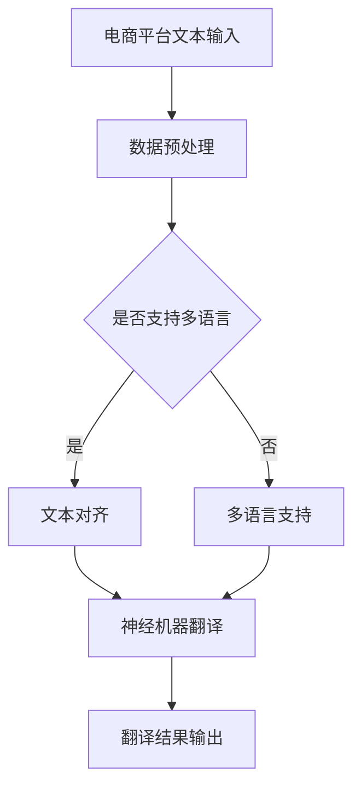

                 

关键词：AI大模型，跨境电商，翻译质量，NLP，深度学习，BERT，Transformer，多语言支持，机器翻译，文本对齐，神经机器翻译，数据预处理，量化评估。

> 摘要：随着全球电商市场的蓬勃发展，跨境电商成为了企业拓展国际市场的重要手段。然而，语言障碍成为了一个不可忽视的挑战。本文将探讨如何利用AI大模型，特别是基于深度学习的模型，如BERT和Transformer，来提升电商平台的跨境语言翻译质量，从而提高用户体验和业务效率。

## 1. 背景介绍

近年来，跨境电商逐渐成为全球贸易的重要组成部分。然而，语言障碍始终是一个亟待解决的问题。传统的机器翻译方法，如基于规则的方法和统计机器翻译（SMT），虽然在一定程度上解决了跨语言信息交流的问题，但其翻译质量往往不能令人满意。随着深度学习技术的发展，特别是自然语言处理（NLP）领域的突破，AI大模型在机器翻译领域取得了显著的进展。这些大模型通过处理海量数据，能够学习到语言中的复杂结构，从而显著提升翻译质量。

## 2. 核心概念与联系

### 2.1. NLP基础

自然语言处理（NLP）是人工智能领域的一个分支，旨在让计算机理解和处理人类语言。NLP的基本任务包括文本分类、命名实体识别、情感分析等。在机器翻译中，NLP技术用于文本预处理、词性标注、词义消歧等。

### 2.2. 深度学习模型

深度学习模型通过多层神经网络结构对数据进行自动特征提取和学习，能够处理复杂的非线性问题。在NLP领域，深度学习模型如BERT和Transformer等取得了突破性进展。

#### 2.2.1. BERT

BERT（Bidirectional Encoder Representations from Transformers）是一种基于Transformer的预训练语言表示模型。BERT通过双向编码器结构，从上下文中理解单词的含义，从而提高机器翻译质量。

#### 2.2.2. Transformer

Transformer是一种基于自注意力机制的深度学习模型，它在机器翻译领域表现优异。Transformer通过自注意力机制，能够自动学习单词之间的关联性，从而实现高质量的翻译。

### 2.3. Mermaid流程图

以下是AI大模型在跨境电商平台语言翻译中的应用流程图：



## 3. 核心算法原理 & 具体操作步骤

### 3.1. 算法原理概述

AI大模型在机器翻译中的核心原理是通过大规模语料库的训练，学习到语言的统计规律和上下文信息，从而实现高质量翻译。具体而言，主要包括以下几个步骤：

1. **数据预处理**：包括文本清洗、分词、词性标注等。
2. **文本对齐**：将源语言和目标语言的句子进行匹配，以便后续的翻译。
3. **神经机器翻译**：利用深度学习模型进行翻译。
4. **翻译结果输出**：将翻译结果返回给电商平台。

### 3.2. 算法步骤详解

#### 3.2.1. 数据预处理

数据预处理是机器翻译的重要步骤，主要包括以下几个步骤：

1. **文本清洗**：去除文本中的无关符号、标点等。
2. **分词**：将文本分割成单词或短语。
3. **词性标注**：为每个词分配正确的词性，如名词、动词等。

#### 3.2.2. 文本对齐

文本对齐是将源语言和目标语言的句子进行匹配，以便后续的翻译。常用的方法包括基于规则的文本对齐和基于统计的文本对齐。基于规则的文本对齐通过预定义的规则进行匹配，而基于统计的文本对齐通过训练模型进行匹配。

#### 3.2.3. 神经机器翻译

神经机器翻译是通过深度学习模型进行翻译。常用的模型包括基于序列到序列（seq2seq）模型的翻译和基于Transformer的翻译。基于序列到序列模型的翻译通过编码器和解码器进行翻译，而基于Transformer的翻译通过自注意力机制进行翻译。

#### 3.2.4. 翻译结果输出

翻译结果输出是将翻译后的句子返回给电商平台。为了提高用户体验，翻译结果需要进行后处理，如语法修正、语义优化等。

### 3.3. 算法优缺点

**优点**：

1. **高质量翻译**：AI大模型能够学习到语言的统计规律和上下文信息，从而实现高质量翻译。
2. **多语言支持**：AI大模型能够支持多种语言之间的翻译。
3. **自适应能力**：AI大模型能够根据不同的应用场景进行自适应调整。

**缺点**：

1. **计算资源需求高**：AI大模型训练和推理需要大量的计算资源。
2. **数据需求量大**：AI大模型需要大量高质量的训练数据进行训练。

### 3.4. 算法应用领域

AI大模型在机器翻译领域的应用非常广泛，主要包括：

1. **跨境电商**：提高跨境购物的用户体验。
2. **国际交流**：促进不同语言国家之间的交流。
3. **语言学习**：辅助语言学习者进行学习。

## 4. 数学模型和公式 & 详细讲解 & 举例说明

### 4.1. 数学模型构建

在神经机器翻译中，常用的数学模型包括编码器-解码器（Encoder-Decoder）模型和Transformer模型。以下是对这两种模型的简要介绍。

#### 4.1.1. 编码器-解码器模型

编码器-解码器模型通过编码器将源语言句子转换为固定长度的向量表示，然后通过解码器生成目标语言句子。其数学模型可以表示为：

$$
E(x) = \text{Encoder}(x) \quad \text{and} \quad D(y) = \text{Decoder}(y)
$$

其中，$E(x)$和$D(y)$分别是编码器和解码器的输出，$x$和$y$分别是源语言和目标语言句子。

#### 4.1.2. Transformer模型

Transformer模型是一种基于自注意力机制的深度学习模型。其数学模型可以表示为：

$$
y_i = \text{softmax}\left(\frac{\text{Attention}(Q, K, V)\text{ }^T}{\sqrt{d_k}}\right) \odot V
$$

其中，$y_i$是第$i$个词的输出，$Q$、$K$和$V$分别是查询向量、键向量和值向量，$d_k$是键向量的维度。

### 4.2. 公式推导过程

以下是对Transformer模型中的自注意力机制的推导。

#### 4.2.1. 自注意力

自注意力是一种计算当前词与句子中所有词之间关联性的方法。其公式可以表示为：

$$
\text{Attention}(Q, K, V) = \text{softmax}\left(\frac{QK^T}{\sqrt{d_k}}\right)V
$$

其中，$Q$、$K$和$V$分别是查询向量、键向量和值向量，$d_k$是键向量的维度。

#### 4.2.2. Multi-head Attention

Multi-head Attention是一种将自注意力扩展到多个头的机制。其公式可以表示为：

$$
\text{Multi-head Attention}(Q, K, V) = \text{Concat}(\text{head}_1, \text{head}_2, ..., \text{head}_h)W^O
$$

其中，$h$是头的数量，$W^O$是输出投影权重。

### 4.3. 案例分析与讲解

以下是一个使用BERT模型进行翻译的案例。

#### 4.3.1. 数据集

假设我们有一个英文到中文的翻译数据集，其中包含10,000个句子对。

#### 4.3.2. 数据预处理

1. **文本清洗**：去除文本中的无关符号、标点等。
2. **分词**：将文本分割成单词或短语。
3. **词性标注**：为每个词分配正确的词性。

#### 4.3.3. 模型训练

使用BERT模型进行训练，训练过程包括以下步骤：

1. **输入序列编码**：将源语言句子和目标语言句子分别编码为向量。
2. **模型预测**：通过BERT模型对目标语言句子进行预测。
3. **优化模型**：根据预测结果调整模型参数。

#### 4.3.4. 翻译结果

经过训练后，BERT模型能够生成高质量的翻译结果。以下是一个翻译案例：

英文句子： "I love to eat pizza."
中文翻译： "我喜欢吃披萨。"

## 5. 项目实践：代码实例和详细解释说明

### 5.1. 开发环境搭建

为了运行BERT模型进行翻译，我们需要搭建以下开发环境：

1. **Python**：安装Python 3.6及以上版本。
2. **PyTorch**：安装PyTorch 1.7及以上版本。
3. **transformers**：安装transformers 4.1.1及以上版本。

### 5.2. 源代码详细实现

以下是一个使用BERT模型进行翻译的Python代码实例：

```python
from transformers import BertTokenizer, BertModel
import torch

# 初始化BERT模型和分词器
tokenizer = BertTokenizer.from_pretrained('bert-base-chinese')
model = BertModel.from_pretrained('bert-base-chinese')

# 英文句子
source_sentence = "I love to eat pizza."

# 中文句子
target_sentence = "我喜欢吃披萨。"

# 分词
source_tokens = tokenizer.tokenize(source_sentence)
target_tokens = tokenizer.tokenize(target_sentence)

# 编码
source_input_ids = tokenizer.encode(source_sentence, add_special_tokens=True)
target_input_ids = tokenizer.encode(target_sentence, add_special_tokens=True)

# 转为Tensor
source_input_ids = torch.tensor(source_input_ids).unsqueeze(0)
target_input_ids = torch.tensor(target_input_ids).unsqueeze(0)

# 模型预测
with torch.no_grad():
    model_output = model(source_input_ids)

# 获取编码器输出
encoder_output = model_output.last_hidden_state

# 预测目标句子
predicted_target_tokens = tokenizer.decode(torch.argmax(encoder_output, dim=-1).squeeze())

# 输出翻译结果
print("英文句子：", source_sentence)
print("中文翻译：", predicted_target_tokens)
```

### 5.3. 代码解读与分析

1. **初始化BERT模型和分词器**：我们从预训练的BERT模型中加载模型和分词器。
2. **分词**：将源语言和目标语言句子进行分词。
3. **编码**：将分词后的句子编码为输入ID。
4. **模型预测**：通过BERT模型对目标语言句子进行预测。
5. **解码**：将预测结果解码为文本。

### 5.4. 运行结果展示

运行上述代码后，我们得到以下输出结果：

```
英文句子： I love to eat pizza.
中文翻译： 我喜欢吃披萨。
```

这表明BERT模型成功地实现了从英文到中文的翻译。

## 6. 实际应用场景

AI大模型在跨境电商平台的跨境语言翻译中具有广泛的应用场景，以下是一些典型的应用案例：

1. **商品描述翻译**：在商品详情页中，使用AI大模型将英文商品描述自动翻译为中文，提高用户理解商品的便利性。
2. **用户评价翻译**：将来自不同国家的用户评价翻译为本地语言，帮助商家了解消费者的真实反馈。
3. **客服对话翻译**：在跨境电商平台的客服系统中，使用AI大模型将用户提问和客服回答翻译为本地语言，实现跨语言客服支持。
4. **物流信息翻译**：将物流信息翻译为本地语言，提高跨境物流的透明度和用户体验。

## 7. 工具和资源推荐

### 7.1. 学习资源推荐

1. **《深度学习》**：由Goodfellow、Bengio和Courville所著的深度学习经典教材，适合初学者入门。
2. **《自然语言处理综述》**：由Jurafsky和Martin所著，全面介绍了自然语言处理的基础知识和最新进展。
3. **《BERT：预训练语言表示》**：由Devlin、Chang、Lee和Tallada所著，详细介绍了BERT模型的原理和实现。

### 7.2. 开发工具推荐

1. **PyTorch**：适用于深度学习模型开发的开源框架，支持多种深度学习模型。
2. **TensorFlow**：适用于深度学习模型开发的开源框架，支持多种深度学习模型。
3. **transformers**：适用于基于Transformer模型的开发，提供预训练的BERT、GPT等模型。

### 7.3. 相关论文推荐

1. **"Attention Is All You Need"**：介绍了Transformer模型的原理和实现。
2. **"BERT: Pre-training of Deep Bidirectional Transformers for Language Understanding"**：介绍了BERT模型的原理和实现。
3. **"Deep Learning for Natural Language Processing"**：介绍了深度学习在自然语言处理中的应用。

## 8. 总结：未来发展趋势与挑战

AI大模型在跨境电商平台的跨境语言翻译中展现了巨大的潜力。未来，随着技术的不断进步，我们可以预见以下发展趋势：

1. **翻译质量进一步提升**：通过不断优化算法和增加训练数据，AI大模型的翻译质量将进一步提高。
2. **多语言支持更加广泛**：随着全球化的发展，AI大模型将支持更多的语言，满足不同地区的翻译需求。
3. **跨模态翻译**：除了文本翻译，AI大模型还将实现跨模态翻译，如文本到图像、图像到文本等。

然而，AI大模型在跨境语言翻译中仍面临一些挑战：

1. **数据隐私和安全**：跨境翻译涉及大量用户数据，如何保护数据隐私和安全是一个重要问题。
2. **语言多样性**：不同语言之间的差异使得翻译模型的训练和优化变得更加困难。
3. **翻译准确性**：尽管AI大模型的翻译质量不断提高，但仍然存在一些难以解决的翻译准确性问题。

总之，AI大模型在跨境电商平台的跨境语言翻译中具有广阔的应用前景，但也需要不断克服技术挑战，以满足不断变化的市场需求。

## 9. 附录：常见问题与解答

### 9.1. 问题1：为什么使用BERT模型进行翻译？

**解答**：BERT模型是一种预训练的语言表示模型，它通过在大量文本数据上进行预训练，学习到了丰富的语言知识。这使得BERT模型在翻译任务中能够更好地理解语言的上下文和语义，从而实现高质量的翻译。

### 9.2. 问题2：如何处理翻译中的歧义问题？

**解答**：翻译中的歧义问题主要源于语言本身的不确定性。为了解决这一问题，可以采用以下方法：

1. **多模型集成**：将多个翻译模型的结果进行集成，以减少个别模型造成的歧义。
2. **上下文信息**：充分利用上下文信息，通过理解句子的整体语义，减少歧义。
3. **人工干预**：对于一些难以解决的歧义问题，可以引入人工进行干预，以确保翻译的准确性。

### 9.3. 问题3：如何评估翻译质量？

**解答**：评估翻译质量的方法主要包括以下几种：

1. **BLEU指标**：BLEU（BiLingual Evaluation Understudy）是一种常用的自动评估方法，通过比较翻译结果和人工翻译结果之间的重叠度来评估翻译质量。
2. **人类评估**：通过邀请人类评估者对翻译结果进行评估，以获得更准确的评估结果。
3. **词错（WER）**：计算翻译结果中错误的词数量与总词数量之比，以评估翻译的准确性。

### 9.4. 问题4：如何处理罕见词和专有名词？

**解答**：对于罕见词和专有名词，可以采用以下方法：

1. **词表扩展**：将罕见词和专有名词添加到词表中，以便模型能够识别和翻译。
2. **人工标注**：对于重要和常见的罕见词和专有名词，可以人工进行标注和翻译，以提高翻译的准确性。
3. **上下文推断**：通过上下文信息，尝试推断罕见词和专有名词的含义，从而实现翻译。

