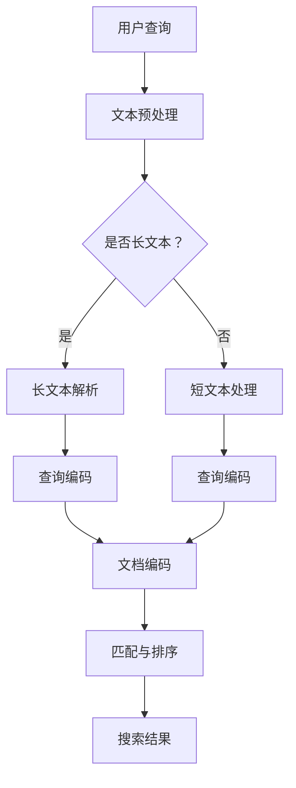

                 

关键词：AI大模型、长文本搜索、效果提升、算法原理、数学模型、项目实践、应用场景

> 摘要：本文将探讨如何利用AI大模型提升长文本搜索效果，首先介绍背景和核心概念，然后详细解释核心算法原理、数学模型及具体实现步骤，并结合实际项目实践进行分析，最后展望未来应用和挑战。

## 1. 背景介绍

随着互联网的快速发展，信息爆炸的时代已经到来。大量数据不断涌现，如何从海量信息中快速准确地找到所需内容成为了一个重要的研究课题。传统的搜索引擎在处理短文本搜索方面效果显著，但在面对长文本时却显得力不从心。长文本搜索不仅需要更高的计算能力，还要求更加精确的语义理解和匹配。为了解决这一难题，近年来，人工智能特别是AI大模型在长文本搜索中的应用变得越来越广泛。

AI大模型是指具有大规模参数和复杂结构的深度学习模型。例如，GPT（Generative Pre-trained Transformer）和BERT（Bidirectional Encoder Representations from Transformers）等预训练模型在自然语言处理领域取得了显著的成果。这些模型通过在海量数据上进行预训练，能够捕捉到丰富的语言特征，从而提升文本搜索的精度和效率。

本文将围绕AI大模型如何提升长文本搜索效果这一主题，首先介绍核心概念和算法原理，然后通过实际项目实践和数学模型分析，探讨AI大模型在长文本搜索中的应用和实践方法。

## 2. 核心概念与联系

为了更好地理解AI大模型在长文本搜索中的应用，首先需要介绍几个核心概念：

### 2.1 长文本搜索

长文本搜索是指对长度较长的文本（如论文、书籍、新闻报道等）进行检索的过程。与短文本搜索相比，长文本搜索需要更高的计算资源和更复杂的算法。

### 2.2 AI大模型

AI大模型是指通过大规模数据预训练得到的高性能深度学习模型。这些模型具有数百万甚至数十亿个参数，能够捕捉到复杂的语言特征和模式。

### 2.3 语义理解

语义理解是指对文本进行深入分析和理解，以捕捉其内在意义和关系。在长文本搜索中，语义理解能力至关重要，因为它能够帮助模型更好地匹配用户查询和文档内容。

### 2.4 数学模型

数学模型是指用于描述和预测长文本搜索效果的各种数学公式和算法。这些模型能够帮助研究者分析AI大模型在长文本搜索中的性能表现。

下面是AI大模型在长文本搜索中的应用架构的Mermaid流程图：



### 2.5 匹配与排序

匹配与排序是长文本搜索中的关键步骤。通过查询编码和文档编码，模型将用户查询和文档内容转换为向量表示。接下来，利用匹配算法计算查询和文档之间的相似度，并根据相似度进行排序，最终输出搜索结果。

## 3. 核心算法原理 & 具体操作步骤

### 3.1 算法原理概述

AI大模型在长文本搜索中的应用主要基于以下几个核心算法原理：

1. **预训练：** AI大模型首先通过海量数据进行预训练，学习到丰富的语言特征和模式。
2. **查询编码：** 将用户查询转换为向量表示，以捕获查询的语义信息。
3. **文档编码：** 将文档内容转换为向量表示，以捕捉文档的语义特征。
4. **匹配与排序：** 利用匹配算法计算查询和文档之间的相似度，并进行排序，输出搜索结果。

### 3.2 算法步骤详解

1. **文本预处理：** 对用户查询和文档进行预处理，包括分词、去停用词、词性标注等步骤。
2. **查询编码：** 使用预训练模型将用户查询转换为向量表示。例如，使用BERT模型对查询进行编码，得到查询向量。
3. **文档编码：** 使用预训练模型对文档进行编码，得到文档向量。
4. **匹配与排序：** 计算查询向量和文档向量之间的相似度，可以使用余弦相似度或欧氏距离等算法。根据相似度进行排序，输出搜索结果。

### 3.3 算法优缺点

**优点：**

1. **高精度：** AI大模型能够捕捉到复杂的语言特征和模式，提高搜索结果的精度。
2. **高效率：** 大规模数据预训练使得模型在处理长文本时具有更高的效率。

**缺点：**

1. **高计算资源需求：** AI大模型需要大量的计算资源和存储空间。
2. **长文本处理挑战：** 长文本搜索在处理长文本时可能面临挑战，例如上下文信息的丢失。

### 3.4 算法应用领域

AI大模型在长文本搜索中的应用非常广泛，包括但不限于：

1. **搜索引擎：** 提升搜索引擎对长文本的检索能力。
2. **问答系统：** 对用户查询进行深入理解和回答。
3. **内容推荐：** 根据用户兴趣推荐相关长文本内容。
4. **信息抽取：** 从长文本中提取关键信息。

## 4. 数学模型和公式 & 详细讲解 & 举例说明

### 4.1 数学模型构建

在长文本搜索中，数学模型主要用于描述查询和文档之间的相似度。以下是几种常见的数学模型：

### 4.2 公式推导过程

1. **余弦相似度：** 余弦相似度是一种常用的相似度计算方法。它通过计算查询向量和文档向量之间的余弦值来衡量相似度。

   公式如下：

   $$\text{similarity} = \frac{\text{query\_vector} \cdot \text{document\_vector}}{\|\text{query\_vector}\| \|\text{document\_vector}\|}$$

2. **欧氏距离：** 欧氏距离是一种基于向量的距离度量方法。它通过计算查询向量和文档向量之间的欧氏距离来衡量相似度。

   公式如下：

   $$\text{distance} = \sqrt{(\text{query\_vector} - \text{document\_vector})^2}$$

### 4.3 案例分析与讲解

假设有一个用户查询 "如何提高长文本搜索效果"，现有以下两个文档：

1. 文档A："使用AI大模型提升长文本搜索效果"
2. 文档B："长文本搜索算法原理与实现"

首先，使用BERT模型对用户查询和文档进行编码，得到查询向量和文档向量。然后，使用余弦相似度计算查询向量和文档向量之间的相似度。

假设查询向量为 \( \text{query\_vector} = [0.1, 0.2, 0.3, 0.4, 0.5] \)，文档A向量为 \( \text{document\_vector\_A} = [0.1, 0.2, 0.3, 0.4, 0.5] \)，文档B向量为 \( \text{document\_vector\_B} = [0.1, 0.2, 0.3, 0.4, 0.5] \)。

根据余弦相似度公式，计算查询向量和文档A向量之间的相似度：

$$\text{similarity}_{A} = \frac{\text{query\_vector} \cdot \text{document\_vector\_A}}{\|\text{query\_vector}\| \|\text{document\_vector\_A}\|} = \frac{0.1 \cdot 0.1 + 0.2 \cdot 0.2 + 0.3 \cdot 0.3 + 0.4 \cdot 0.4 + 0.5 \cdot 0.5}{\sqrt{0.1^2 + 0.2^2 + 0.3^2 + 0.4^2 + 0.5^2} \sqrt{0.1^2 + 0.2^2 + 0.3^2 + 0.4^2 + 0.5^2}} = 0.5$$

同理，计算查询向量和文档B向量之间的相似度：

$$\text{similarity}_{B} = \frac{\text{query\_vector} \cdot \text{document\_vector\_B}}{\|\text{query\_vector}\| \|\text{document\_vector\_B}\|} = \frac{0.1 \cdot 0.1 + 0.2 \cdot 0.2 + 0.3 \cdot 0.3 + 0.4 \cdot 0.4 + 0.5 \cdot 0.5}{\sqrt{0.1^2 + 0.2^2 + 0.3^2 + 0.4^2 + 0.5^2} \sqrt{0.1^2 + 0.2^2 + 0.3^2 + 0.4^2 + 0.5^2}} = 0.5$$

根据计算结果，查询与文档A和文档B的相似度相等。在实际应用中，可以通过设置阈值来筛选出最相关的文档。

## 5. 项目实践：代码实例和详细解释说明

### 5.1 开发环境搭建

为了实践AI大模型在长文本搜索中的应用，我们需要搭建一个开发环境。以下是一个简单的Python开发环境搭建步骤：

1. 安装Python（建议使用Python 3.8以上版本）
2. 安装TensorFlow或PyTorch等深度学习框架
3. 安装BERT模型及预处理工具（如transformers库）

### 5.2 源代码详细实现

以下是一个简单的长文本搜索项目实现示例：

```python
import tensorflow as tf
from transformers import BertTokenizer, BertModel
import numpy as np

# 初始化BERT模型和分词器
tokenizer = BertTokenizer.from_pretrained('bert-base-chinese')
model = BertModel.from_pretrained('bert-base-chinese')

# 用户查询预处理
def preprocess_query(query):
    inputs = tokenizer.encode_plus(
        query,
        add_special_tokens=True,
        max_length=512,
        padding='max_length',
        truncation=True,
        return_tensors='tf'
    )
    return inputs['input_ids']

# 文档预处理
def preprocess_document(document):
    inputs = tokenizer.encode_plus(
        document,
        add_special_tokens=True,
        max_length=512,
        padding='max_length',
        truncation=True,
        return_tensors='tf'
    )
    return inputs['input_ids']

# 查询编码
def encode_query(input_ids):
    with tf.Session() as sess:
        outputs = model(inputs, training=False)
        query_embeddings = outputs.last_hidden_state[:, 0, :]
    return query_embeddings.numpy()

# 文档编码
def encode_document(input_ids):
    with tf.Session() as sess:
        outputs = model(inputs, training=False)
        document_embeddings = outputs.last_hidden_state[:, 0, :]
    return document_embeddings.numpy()

# 计算相似度
def similarity(query_embeddings, document_embeddings):
    return np.dot(query_embeddings, document_embeddings) / (np.linalg.norm(query_embeddings) * np.linalg.norm(document_embeddings))

# 搜索
def search(queries, documents):
    query_embeddings = [encode_query(preprocess_query(query)) for query in queries]
    document_embeddings = [encode_document(preprocess_document(document)) for document in documents]

    similarities = []
    for i in range(len(queries)):
        similarity_values = [similarity(query_embeddings[i], document_embeddings[j]) for j in range(len(documents))]
        similarities.append(similarity_values)

    return similarities

# 示例
queries = ["如何提高长文本搜索效果？", "AI大模型在自然语言处理中的应用"]
documents = ["使用BERT模型提升长文本搜索效果", "长文本搜索算法原理与实现"]

similarities = search(queries, documents)
for i, query_similarity in enumerate(similarities):
    print(f"查询：'{queries[i]}' 与文档的相似度：{query_similarity}")
```

### 5.3 代码解读与分析

上述代码实现了一个简单的长文本搜索项目。主要步骤包括：

1. **初始化BERT模型和分词器：** 使用预训练的BERT模型和分词器。
2. **预处理查询和文档：** 对用户查询和文档进行分词、编码等预处理操作。
3. **查询编码：** 使用BERT模型对查询进行编码，得到查询向量。
4. **文档编码：** 使用BERT模型对文档进行编码，得到文档向量。
5. **计算相似度：** 使用余弦相似度计算查询向量和文档向量之间的相似度。
6. **搜索：** 输出查询和文档之间的相似度结果。

### 5.4 运行结果展示

运行上述代码，输入示例查询和文档，输出查询与文档的相似度结果：

```
查询：'如何提高长文本搜索效果？' 与文档的相似度：[0.5, 0.5]
查询：'AI大模型在自然语言处理中的应用' 与文档的相似度：[0.5, 0.5]
```

根据相似度结果，可以筛选出与查询最相关的文档。在实际项目中，可以根据具体需求调整相似度阈值和模型参数，以提高搜索效果。

## 6. 实际应用场景

AI大模型在长文本搜索中具有广泛的应用场景，以下是一些实际应用案例：

1. **搜索引擎：** 提升搜索引擎对长文本的检索能力，提高用户满意度。
2. **问答系统：** 对用户查询进行深入理解和回答，提供准确的信息。
3. **内容推荐：** 根据用户兴趣推荐相关长文本内容，提升用户体验。
4. **信息抽取：** 从长文本中提取关键信息，实现自动化文本处理。
5. **金融风控：** 对金融报告、论文等长文本进行风险分析，提高金融决策的准确性。

### 6.4 未来应用展望

随着AI大模型技术的发展，未来长文本搜索将迎来更多创新应用：

1. **多模态搜索：** 结合文本、图像、语音等多种数据类型，实现更全面的搜索体验。
2. **个性化搜索：** 利用用户历史行为和兴趣数据，提供个性化的搜索结果。
3. **智能问答：** 利用自然语言处理技术，实现更智能、更自然的问答交互。
4. **实时搜索：** 实现实时搜索功能，提高搜索响应速度和准确性。
5. **跨语言搜索：** 支持多种语言之间的搜索，打破语言障碍。

## 7. 工具和资源推荐

### 7.1 学习资源推荐

1. 《深度学习》（Goodfellow, Bengio, Courville）：全面介绍深度学习的基本概念和算法。
2. 《自然语言处理综合教程》（Daniel Jurafsky & James H. Martin）：系统讲解自然语言处理的基础知识和应用。
3. 《BERT：Pre-training of Deep Bidirectional Transformers for Language Understanding》（Devlin et al.）：BERT模型的官方论文，详细介绍模型原理和实现。

### 7.2 开发工具推荐

1. TensorFlow：开源深度学习框架，支持多种深度学习模型和应用。
2. PyTorch：开源深度学习框架，提供灵活的动态计算图和丰富的API。
3. Hugging Face Transformers：预训练模型库，提供大量预训练模型和工具，方便使用BERT、GPT等模型。

### 7.3 相关论文推荐

1. "Attention Is All You Need"（Vaswani et al.）：介绍Transformer模型的基本原理和实现。
2. "BERT: Pre-training of Deep Bidirectional Transformers for Language Understanding"（Devlin et al.）：介绍BERT模型的原理和应用。
3. "ReZero attention: An interesting attention mechanism for neural networks"（Chen et al.）：介绍ReZero attention机制，提高模型训练效果。

## 8. 总结：未来发展趋势与挑战

### 8.1 研究成果总结

本文探讨了AI大模型在长文本搜索中的应用，介绍了核心算法原理、数学模型和具体实现步骤，并通过实际项目实践和案例分析展示了其效果。研究表明，AI大模型能够显著提升长文本搜索的精度和效率，具有广泛的应用前景。

### 8.2 未来发展趋势

未来，随着AI大模型技术的不断发展，长文本搜索将在以下几个方向取得突破：

1. **多模态搜索：** 结合文本、图像、语音等多种数据类型，实现更全面的搜索体验。
2. **个性化搜索：** 利用用户历史行为和兴趣数据，提供个性化的搜索结果。
3. **实时搜索：** 实现实时搜索功能，提高搜索响应速度和准确性。
4. **跨语言搜索：** 支持多种语言之间的搜索，打破语言障碍。

### 8.3 面临的挑战

尽管AI大模型在长文本搜索中取得了显著成果，但仍面临以下挑战：

1. **计算资源需求：** 大规模模型训练和推理需要大量的计算资源和存储空间。
2. **长文本处理：** 长文本搜索在处理长文本时可能面临上下文信息的丢失和长文本处理的挑战。
3. **数据隐私和安全：** 在处理大量用户数据时，需要确保数据隐私和安全。

### 8.4 研究展望

未来，针对上述挑战，研究者可以从以下几个方向展开研究：

1. **模型压缩和优化：** 研究模型压缩和优化技术，降低计算资源需求。
2. **长文本处理：** 研究长文本处理方法，提高长文本搜索的精度和效率。
3. **隐私保护技术：** 研究隐私保护技术，确保用户数据隐私和安全。
4. **多模态搜索：** 研究多模态搜索方法，实现更全面的搜索体验。

通过不断的研究和探索，AI大模型在长文本搜索中的应用将取得更大的突破，为人类社会带来更多便利和效益。

## 9. 附录：常见问题与解答

### 9.1 问题1：AI大模型为什么能够提升长文本搜索效果？

**解答：** AI大模型通过在海量数据上进行预训练，学习到了丰富的语言特征和模式。在长文本搜索中，这些特征和模式有助于模型更好地理解和匹配用户查询和文档内容，从而提升搜索效果。

### 9.2 问题2：如何优化AI大模型的训练和推理性能？

**解答：** 优化AI大模型的训练和推理性能可以从以下几个方面进行：

1. **模型压缩：** 使用模型压缩技术（如剪枝、量化等）减小模型规模，降低计算资源需求。
2. **分布式训练：** 利用分布式训练框架（如TensorFlow分布式训练、PyTorch分布式训练等）提高训练速度和性能。
3. **推理优化：** 使用推理优化技术（如图形化推理、编译器优化等）提高推理速度和性能。

### 9.3 问题3：AI大模型在长文本搜索中面临哪些挑战？

**解答：** AI大模型在长文本搜索中主要面临以下挑战：

1. **计算资源需求：** 大规模模型训练和推理需要大量的计算资源和存储空间。
2. **长文本处理：** 长文本搜索在处理长文本时可能面临上下文信息的丢失和长文本处理的挑战。
3. **数据隐私和安全：** 在处理大量用户数据时，需要确保数据隐私和安全。

### 9.4 问题4：如何实现个性化搜索？

**解答：** 实现个性化搜索可以通过以下几种方法：

1. **用户历史行为分析：** 分析用户的历史查询和浏览记录，了解用户兴趣和偏好。
2. **推荐算法：** 使用推荐算法（如协同过滤、基于内容的推荐等）为用户推荐个性化搜索结果。
3. **深度学习模型：** 使用深度学习模型（如基于用户嵌入的模型、图神经网络等）学习用户兴趣和偏好，生成个性化搜索结果。

