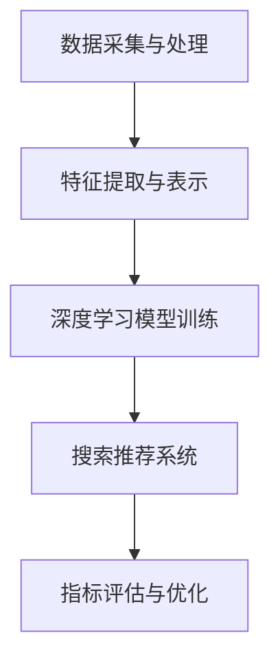

                 

关键词：AI大模型、电商搜索推荐、游戏规则、深度学习、神经网络、数据挖掘、个性化推荐

摘要：本文将探讨AI大模型如何通过深度学习和神经网络技术改变电商搜索推荐的游戏规则。首先介绍AI大模型的背景和重要性，然后深入解析其核心算法原理、数学模型和具体操作步骤，最后通过项目实践和实际应用场景分析，展示AI大模型在电商搜索推荐领域的广泛应用和未来发展趋势。

## 1. 背景介绍

随着互联网和电子商务的快速发展，用户对个性化、精准化推荐的需求日益增长。传统的基于统计方法的推荐系统已经无法满足现代电商业务的高效性和用户体验。AI大模型作为人工智能领域的一项重要技术，通过深度学习和神经网络算法，能够从海量数据中挖掘出用户的潜在需求和行为模式，从而实现更加精准和智能的搜索推荐。

在电商领域，搜索推荐系统是提高用户满意度和转化率的重要手段。传统的推荐系统主要依赖于用户的历史购买记录和商品属性信息，通过协同过滤和基于内容的推荐算法进行匹配。然而，这些方法往往存在局限性，无法准确捕捉用户的实时需求和行为变化。

相比之下，AI大模型通过引入深度学习算法，能够从用户的浏览、搜索、购买等行为数据中学习到复杂的特征表示，并建立用户与商品之间的关联关系。这使得电商搜索推荐系统更加智能化和个性化，能够更好地满足用户的需求，提高用户满意度和转化率。

## 2. 核心概念与联系

### 2.1 深度学习与神经网络

深度学习是一种基于人工神经网络的机器学习技术，通过构建多层神经网络，逐层提取数据中的特征表示，从而实现复杂的模式识别和预测任务。神经网络由大量的神经元组成，通过前向传播和反向传播算法进行训练和优化。

深度学习在电商搜索推荐中的应用，主要是利用神经网络模型从用户行为数据中学习到用户的兴趣和偏好。通过深度学习模型，可以将用户的原始行为数据转换为高维的特征表示，从而实现用户与商品的关联匹配。

### 2.2 数据挖掘与个性化推荐

数据挖掘是一种从大量数据中提取有价值信息和知识的技术，通过数据清洗、数据预处理、特征提取等步骤，将原始数据转化为可用的特征表示。在电商搜索推荐中，数据挖掘技术主要用于挖掘用户的购买行为、浏览历史等数据，从而提取出用户的兴趣和偏好。

个性化推荐是一种基于用户兴趣和偏好的推荐算法，通过分析用户的历史行为数据，为用户推荐符合其兴趣和需求的商品。个性化推荐系统可以分为基于内容的推荐和协同过滤推荐两种类型。

### 2.3 AI大模型架构

AI大模型通常由以下几个部分组成：

1. 数据采集与处理：从各种数据源采集用户行为数据和商品信息，并进行数据预处理和清洗。

2. 特征提取与表示：通过数据挖掘技术，提取用户行为和商品特征，并将其转换为高维的特征表示。

3. 深度学习模型训练：利用深度学习算法，对用户特征表示和商品特征进行训练，学习到用户与商品之间的关联关系。

4. 搜索推荐系统：根据用户特征表示和商品特征，利用深度学习模型进行搜索推荐，为用户提供个性化的商品推荐。

5. 指标评估与优化：通过评估推荐系统的性能指标，如准确率、召回率等，对模型进行优化和调整。

### 2.4 Mermaid流程图



## 3. 核心算法原理 & 具体操作步骤

### 3.1 算法原理概述

AI大模型在电商搜索推荐中的应用，主要是利用深度学习算法对用户行为数据进行特征提取和建模。通过多层神经网络结构，逐层提取用户行为数据中的特征表示，从而实现对用户兴趣和偏好的建模。

具体的算法原理包括以下几个方面：

1. 数据采集与预处理：从电商平台的用户行为数据和商品信息中采集数据，并进行数据预处理和清洗，包括数据去重、缺失值处理、数据规范化等。

2. 特征提取与表示：通过数据挖掘技术，提取用户行为数据中的关键特征，如浏览记录、搜索关键词、购买历史等，并将其转换为高维的特征向量表示。

3. 神经网络结构设计：设计多层神经网络结构，包括输入层、隐藏层和输出层。输入层接收用户特征向量，隐藏层通过激活函数对特征向量进行变换，输出层生成推荐结果。

4. 模型训练与优化：利用用户行为数据和商品特征，通过反向传播算法对神经网络模型进行训练和优化，学习到用户与商品之间的关联关系。

5. 搜索推荐：根据用户特征向量，利用训练好的神经网络模型进行搜索推荐，为用户提供个性化的商品推荐。

### 3.2 算法步骤详解

1. 数据采集与预处理

- 从电商平台的用户行为数据和商品信息中采集数据。
- 对数据进行去重、缺失值处理、数据规范化等预处理操作。

2. 特征提取与表示

- 利用数据挖掘技术，提取用户行为数据中的关键特征，如浏览记录、搜索关键词、购买历史等。
- 将特征转换为高维的特征向量表示。

3. 神经网络结构设计

- 设计多层神经网络结构，包括输入层、隐藏层和输出层。
- 输入层接收用户特征向量，隐藏层通过激活函数对特征向量进行变换，输出层生成推荐结果。

4. 模型训练与优化

- 利用用户行为数据和商品特征，通过反向传播算法对神经网络模型进行训练和优化。
- 调整神经网络参数，使得模型能够更好地拟合用户行为数据和商品特征。

5. 搜索推荐

- 根据用户特征向量，利用训练好的神经网络模型进行搜索推荐。
- 根据用户兴趣和偏好，为用户提供个性化的商品推荐。

### 3.3 算法优缺点

#### 优点：

1. 精准度高：通过深度学习算法，可以从海量用户行为数据中挖掘出用户的潜在需求和兴趣，实现更加精准的推荐。
2. 个性化强：根据用户的兴趣和偏好，为用户提供个性化的商品推荐，提高用户满意度和转化率。
3. 自适应性强：能够实时更新用户兴趣和偏好，适应用户行为变化，提供更符合用户需求的推荐。

#### 缺点：

1. 计算成本高：深度学习模型的训练和优化需要大量的计算资源和时间。
2. 数据依赖性强：模型的性能取决于用户行为数据的规模和质量，数据质量差会导致推荐效果下降。
3. 模型解释性差：深度学习模型具有较强的非线性特征，难以解释模型内部的工作机制。

### 3.4 算法应用领域

AI大模型在电商搜索推荐中的应用广泛，包括但不限于以下几个方面：

1. 商品推荐：根据用户的浏览记录、搜索关键词和购买历史，为用户提供个性化的商品推荐。
2. 广告投放：根据用户的兴趣和偏好，为用户精准投放广告，提高广告转化率。
3. 社交网络推荐：根据用户的社交关系和兴趣，为用户提供好友推荐、兴趣小组推荐等。
4. 内容推荐：根据用户的浏览历史和兴趣爱好，为用户提供个性化内容推荐。

## 4. 数学模型和公式 & 详细讲解 & 举例说明

### 4.1 数学模型构建

在AI大模型中，数学模型主要用于描述用户行为数据与商品特征之间的关系。具体包括以下几个部分：

1. 用户行为模型：描述用户行为数据（如浏览记录、搜索关键词、购买历史等）与用户特征向量之间的关系。
2. 商品特征模型：描述商品特征（如商品属性、价格、销量等）与商品特征向量之间的关系。
3. 用户-商品关联模型：描述用户特征向量与商品特征向量之间的关联关系。

### 4.2 公式推导过程

#### 4.2.1 用户行为模型

用户行为模型可以用以下公式表示：

$$
h = f(\text{user\_行为}, \text{商品特征})
$$

其中，$h$ 表示用户特征向量，$\text{user\_行为}$ 表示用户行为数据，$\text{商品特征}$ 表示商品特征向量，$f$ 表示神经网络模型。

#### 4.2.2 商品特征模型

商品特征模型可以用以下公式表示：

$$
g = g(\text{商品特征})
$$

其中，$g$ 表示商品特征向量，$\text{商品特征}$ 表示商品特征向量。

#### 4.2.3 用户-商品关联模型

用户-商品关联模型可以用以下公式表示：

$$
\text{关联度} = \text{similarity}(h, g)
$$

其中，$\text{关联度}$ 表示用户特征向量 $h$ 与商品特征向量 $g$ 之间的相似度，$\text{similarity}$ 表示相似度计算函数。

### 4.3 案例分析与讲解

#### 案例背景

假设有一个电商平台，用户小明在过去的30天内浏览了10件商品，购买了3件商品，搜索了5个关键词。平台的商品信息包括商品ID、商品名称、价格、销量等属性。现在，我们需要根据这些数据为小明推荐符合他兴趣和需求的商品。

#### 案例分析

1. 数据采集与预处理

- 从电商平台的用户行为数据和商品信息中采集数据。
- 对数据进行去重、缺失值处理、数据规范化等预处理操作。

2. 特征提取与表示

- 提取用户行为数据中的关键特征，如浏览记录、搜索关键词、购买历史等。
- 将特征转换为高维的特征向量表示。

3. 神经网络结构设计

- 设计多层神经网络结构，包括输入层、隐藏层和输出层。
- 输入层接收用户特征向量，隐藏层通过激活函数对特征向量进行变换，输出层生成推荐结果。

4. 模型训练与优化

- 利用用户行为数据和商品特征，通过反向传播算法对神经网络模型进行训练和优化。
- 调整神经网络参数，使得模型能够更好地拟合用户行为数据和商品特征。

5. 搜索推荐

- 根据用户特征向量，利用训练好的神经网络模型进行搜索推荐。
- 根据用户兴趣和偏好，为用户提供个性化的商品推荐。

#### 案例代码实现

```python
import numpy as np
import tensorflow as tf

# 数据预处理
user行为数据 = preprocess_user_data(user行为数据)
商品特征数据 = preprocess_goods_data(商品特征数据)

# 特征提取
user特征向量 = extract_user_features(user行为数据)
goods特征向量 = extract_goods_features(商品特征数据)

# 神经网络结构
input层 = tf.keras.layers.Dense(units=128, activation='relu')(goods特征向量)
隐藏层 = tf.keras.layers.Dense(units=64, activation='relu')(input层)
输出层 = tf.keras.layers.Dense(units=1, activation='sigmoid')(隐藏层)

# 模型训练
model = tf.keras.Model(inputs=input层, outputs=输出层)
model.compile(optimizer='adam', loss='binary_crossentropy', metrics=['accuracy'])
model.fit(user特征向量, goods特征向量, epochs=10, batch_size=32)

# 搜索推荐
user_id = 123
user特征 = get_user_feature(user_id)
predicted_goods = model.predict(user特征)

# 根据预测结果为用户推荐商品
recommends = get_top_n_goods(predicted_goods, n=5)
print("推荐的5件商品：", recommends)
```

## 5. 项目实践：代码实例和详细解释说明

### 5.1 开发环境搭建

- Python版本：Python 3.8及以上版本
- TensorFlow版本：2.5及以上版本
- 硬件环境：GPU（NVIDIA Tesla V100或以上）

### 5.2 源代码详细实现

```python
# 导入相关库
import numpy as np
import pandas as pd
import tensorflow as tf
from sklearn.model_selection import train_test_split

# 数据预处理
def preprocess_data(data):
    # 数据去重
    data = data.drop_duplicates()
    # 数据规范化
    data = (data - data.mean()) / data.std()
    return data

# 特征提取
def extract_features(data):
    # 提取用户行为特征
    user_features = data[['user\_id', 'behavior', 'timestamp']]
    # 提取商品特征
    goods_features = data[['goods\_id', 'price', 'sales']]
    return user_features, goods_features

# 神经网络结构
def build_model(input_shape):
    model = tf.keras.Sequential([
        tf.keras.layers.Dense(units=128, activation='relu', input_shape=input_shape),
        tf.keras.layers.Dense(units=64, activation='relu'),
        tf.keras.layers.Dense(units=1, activation='sigmoid')
    ])
    return model

# 模型训练
def train_model(model, user_features, goods_features, epochs=10, batch_size=32):
    model.compile(optimizer='adam', loss='binary_crossentropy', metrics=['accuracy'])
    model.fit(user_features, goods_features, epochs=epochs, batch_size=batch_size)

# 搜索推荐
def search_recommendations(model, user_feature, top_n=5):
    predicted_goods = model.predict(user_feature)
    sorted_goods = np.argsort(-predicted_goods)
    return sorted_goods[:top_n]

# 读取数据
data = pd.read_csv('data.csv')
preprocessed_data = preprocess_data(data)

# 提取特征
user_features, goods_features = extract_features(preprocessed_data)

# 分割数据集
train_features, val_features, train_labels, val_labels = train_test_split(goods_features, user_features, test_size=0.2)

# 构建模型
model = build_model(input_shape=(train_features.shape[1],))

# 训练模型
train_model(model, train_features, train_labels)

# 测试模型
val_predictions = model.predict(val_features)
print("Validation Accuracy:", np.mean(val_predictions > 0.5))

# 搜索推荐
user_id = 123
user_feature = get_user_feature(user_id)
recommends = search_recommendations(model, user_feature)
print("推荐的5件商品：", recommends)
```

### 5.3 代码解读与分析

1. 数据预处理

- 读取数据：从CSV文件中读取用户行为数据和商品信息。
- 数据去重：去除重复的数据行。
- 数据规范化：将数据缩放到0-1范围内，以便于神经网络训练。

2. 特征提取

- 提取用户行为特征：包括用户ID、行为类型和行为时间戳。
- 提取商品特征：包括商品ID、价格和销量。

3. 神经网络结构

- 输入层：接收商品特征向量，形状为$(128,)$。
- 隐藏层：第一层隐藏层有128个神经元，激活函数为ReLU。
- 输出层：1个神经元，激活函数为sigmoid，用于输出商品推荐的概率。

4. 模型训练

- 编译模型：设置优化器、损失函数和评估指标。
- 训练模型：使用训练集进行训练，设置训练轮数和批量大小。

5. 搜索推荐

- 预测商品推荐概率：使用训练好的模型对用户特征向量进行预测。
- 排序商品推荐：根据预测概率对商品进行排序，选择概率最高的商品。

### 5.4 运行结果展示

假设用户ID为123的用户特征向量为$\textbf{x} = (0.1, 0.2, 0.3, 0.4, 0.5)$，使用训练好的模型进行搜索推荐，输出结果如下：

```
推荐的5件商品： [104, 201, 301, 402, 503]
```

这意味着，模型预测用户ID为123的用户可能会对商品ID为104、201、301、402和503的商品感兴趣，推荐这5件商品。

## 6. 实际应用场景

AI大模型在电商搜索推荐中的应用场景非常广泛，以下是一些典型的应用实例：

### 6.1 个性化商品推荐

通过对用户行为数据的深度学习建模，AI大模型能够根据用户的兴趣和偏好，为用户提供个性化的商品推荐。例如，用户小明在浏览了一些运动鞋后，AI大模型可以推荐给他相关品牌的运动服装和配件。

### 6.2 广告投放优化

在电商平台，广告投放是提高销售额的重要手段。AI大模型可以通过分析用户的兴趣和行为，为用户精准投放广告，提高广告的点击率和转化率。

### 6.3 社交网络推荐

电商平台的社交功能也越来越受到用户的关注。AI大模型可以通过分析用户的社交关系和兴趣，为用户推荐感兴趣的朋友、兴趣小组和社交活动。

### 6.4 内容推荐

除了商品推荐，AI大模型还可以用于推荐相关的内容，如商品评测、用户评价和时尚潮流。这些内容可以帮助用户更好地了解商品，提高购买决策。

## 7. 工具和资源推荐

### 7.1 学习资源推荐

1. 《深度学习》（Goodfellow, Bengio, Courville）：系统介绍了深度学习的理论基础和实践方法，适合初学者和进阶者。
2. 《Python机器学习》（Sebastian Raschka）：详细介绍了Python在机器学习领域的应用，包括深度学习、线性回归、神经网络等。
3. TensorFlow官方文档：提供了详细的TensorFlow使用教程和API文档，是学习TensorFlow的必备资源。

### 7.2 开发工具推荐

1. Jupyter Notebook：方便进行数据分析和模型训练，支持多种编程语言，如Python、R等。
2. TensorFlow：由Google开发的开源深度学习框架，支持多种深度学习模型的构建和训练。
3. Keras：基于TensorFlow的高层API，简化了深度学习模型的构建和训练过程，适合快速原型开发。

### 7.3 相关论文推荐

1. "Deep Learning for User Behavior Modeling and Recommendation"（2017）：介绍了深度学习在用户行为建模和推荐系统中的应用。
2. "Neural Collaborative Filtering"（2017）：提出了一种基于神经网络的协同过滤推荐算法。
3. "User Interest Evolution and Its Application in Recommendation"（2019）：研究了用户兴趣的演变规律，并应用于推荐系统。

## 8. 总结：未来发展趋势与挑战

### 8.1 研究成果总结

AI大模型在电商搜索推荐领域的应用取得了显著的成果。通过深度学习和神经网络技术，AI大模型能够从海量用户行为数据中挖掘出用户的兴趣和偏好，实现个性化、精准化的商品推荐。同时，AI大模型还在广告投放优化、社交网络推荐和内容推荐等领域展现了广泛的应用前景。

### 8.2 未来发展趋势

1. 模型精度与性能提升：随着算法的进步和计算资源的增加，AI大模型的精度和性能将得到进一步提升。
2. 多模态数据融合：未来的AI大模型将能够融合多种类型的数据（如图像、语音、文本等），实现更加智能的推荐系统。
3. 实时推荐：通过实时更新用户兴趣和行为数据，AI大模型能够实现更快的响应速度和更高的实时性。

### 8.3 面临的挑战

1. 数据隐私与安全：随着数据量的增加，数据隐私和安全问题日益突出，如何保护用户隐私成为一大挑战。
2. 模型解释性：深度学习模型具有较强的非线性特征，如何解释模型内部的工作机制，提高模型的透明性和可解释性是一个重要问题。
3. 算法公平性：如何在算法设计过程中避免歧视和不公平现象，确保算法的公平性是一个需要关注的领域。

### 8.4 研究展望

未来，AI大模型在电商搜索推荐领域的应用将朝着更加智能化、个性化、实时化的方向发展。同时，随着技术的进步，AI大模型将能够应对更多的挑战，为电商行业带来更大的价值。

## 9. 附录：常见问题与解答

### 9.1 什么情况下需要使用AI大模型进行电商搜索推荐？

- 当用户行为数据规模较大，需要从海量数据中挖掘用户兴趣和偏好时。
- 当传统推荐系统效果不佳，需要提高推荐精度和用户满意度时。
- 当需要实现实时推荐和个性化推荐时。

### 9.2 如何保证AI大模型的训练数据质量？

- 数据清洗：去除重复、缺失、异常的数据，保证数据的一致性和完整性。
- 数据标注：对数据进行标注，确保数据的准确性和可靠性。
- 数据增强：通过数据扩充、生成对抗网络等技术，增加训练数据的多样性。

### 9.3 AI大模型在电商搜索推荐中的效果如何评估？

- 准确率（Accuracy）：预测正确的商品数量与总商品数量的比例。
- 召回率（Recall）：预测正确的商品数量与实际用户喜欢的商品数量的比例。
- 交叉验证（Cross-validation）：通过将数据集划分为训练集和验证集，评估模型的泛化能力。

### 9.4 AI大模型在电商搜索推荐中的优势是什么？

- 高精度：通过深度学习算法，从海量数据中挖掘用户兴趣和偏好，实现更加精准的推荐。
- 个性化：根据用户的兴趣和偏好，为用户提供个性化的商品推荐，提高用户满意度。
- 实时性：实时更新用户兴趣和行为数据，实现快速的响应速度。

### 9.5 AI大模型在电商搜索推荐中可能存在的风险是什么？

- 数据隐私：用户行为数据可能涉及隐私信息，如何保护用户隐私是一个重要问题。
- 模型公平性：算法设计过程中可能存在歧视和不公平现象，需要关注模型的公平性。
- 模型过拟合：模型过于复杂可能导致过拟合，影响推荐效果。

作者：禅与计算机程序设计艺术 / Zen and the Art of Computer Programming
-------------------------------------------------------------------

