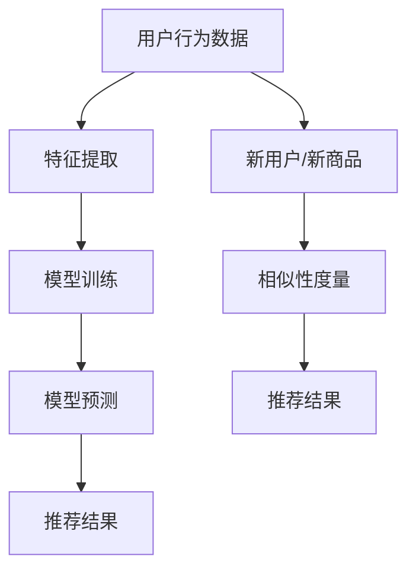

                 

 关键词：AI大模型，冷启动，推荐系统，相似性度量，矩阵分解，数据预处理，协同过滤，模型优化

> 摘要：本文深入探讨了AI大模型如何解决推荐系统中的冷启动问题。通过对推荐系统基本原理的回顾，本文详细分析了冷启动问题的定义和影响，随后介绍了各种解决方案，重点阐述了AI大模型在解决冷启动问题上的优势。文章还通过数学模型和具体案例，展示了AI大模型在推荐系统中的应用，并对其未来发展趋势进行了展望。

## 1. 背景介绍

推荐系统是现代信息检索和人工智能领域的一个重要分支，其核心目标是向用户推荐他们可能感兴趣的内容或商品。随着互联网和大数据技术的发展，推荐系统在电子商务、社交媒体、新闻推荐等领域得到了广泛应用。然而，推荐系统也面临着诸多挑战，其中之一就是冷启动问题。

### 1.1 冷启动问题的定义

冷启动问题是指在推荐系统中，新用户或新商品加入系统时，由于缺乏历史数据或交互信息，难以提供有效的推荐。冷启动问题主要分为两类：用户冷启动和商品冷启动。

- **用户冷启动**：新用户在加入推荐系统时，没有足够的历史行为数据或偏好信息，推荐系统难以为其提供个性化的推荐。
- **商品冷启动**：新商品在推荐系统中，缺乏用户评价或购买记录，使得推荐系统难以为其找到目标用户。

### 1.2 冷启动问题的影响

冷启动问题对推荐系统的用户体验和业务效果有显著影响：

- **用户体验差**：新用户或新商品难以得到满意的推荐，降低了用户满意度。
- **业务效果受损**：冷启动导致推荐系统的准确性和有效性下降，影响平台商业转化率。

### 1.3 冷启动问题的现状

尽管推荐系统研究人员和工程师们一直在努力解决冷启动问题，但至今仍没有一种完美的解决方案。现有方法主要集中在数据预处理、协同过滤、矩阵分解等方面，但这些方法往往存在一定的局限性。

## 2. 核心概念与联系

### 2.1 推荐系统基本原理

推荐系统主要基于用户行为数据、内容特征和协同过滤算法进行推荐。其中，协同过滤是最常用的技术之一，分为基于用户和基于物品的协同过滤。

- **基于用户的协同过滤**：通过计算用户之间的相似度，找到与目标用户兴趣相似的其他用户，进而推荐他们喜欢的商品。
- **基于物品的协同过滤**：通过计算商品之间的相似度，找到与目标商品相似的其他商品，进而推荐给用户。

### 2.2 AI大模型原理

AI大模型，如深度神经网络，通过学习大规模数据，自动提取特征和模式，具有很强的表达能力和泛化能力。大模型的核心思想是通过多层神经网络结构，将原始数据映射到高维空间，从而实现数据的降维和特征的提取。

### 2.3 Mermaid流程图



### 2.4 核心概念联系

- **推荐系统与AI大模型**：AI大模型可以用于推荐系统的特征提取、模型训练和预测，从而提高推荐效果。
- **相似性度量**：在AI大模型中，相似性度量是计算用户或商品之间相似程度的重要手段，有助于为新用户和新商品提供推荐。

## 3. 核心算法原理 & 具体操作步骤

### 3.1 算法原理概述

AI大模型解决冷启动问题的核心在于利用大规模数据学习用户和商品的潜在特征，从而为新用户和新商品提供有效的推荐。主要步骤包括数据预处理、模型训练和推荐生成。

### 3.2 算法步骤详解

#### 3.2.1 数据预处理

1. **数据收集**：收集新用户和新商品的历史数据，包括行为数据、评价数据等。
2. **数据清洗**：去除数据中的噪声和异常值，保证数据质量。
3. **特征提取**：使用特征工程方法，提取用户和商品的重要特征。

#### 3.2.2 模型训练

1. **数据分割**：将数据分为训练集和测试集，用于模型的训练和验证。
2. **模型选择**：选择合适的AI大模型，如深度神经网络。
3. **模型训练**：使用训练集数据训练模型，优化模型参数。

#### 3.2.3 推荐生成

1. **相似性度量**：计算新用户和新商品与已有用户和商品的相似度。
2. **推荐生成**：根据相似度排序，生成推荐结果。

### 3.3 算法优缺点

#### 优点：

- **高准确性**：AI大模型可以学习到用户和商品的潜在特征，提高推荐准确性。
- **可扩展性**：大模型可以处理大规模数据，适用于复杂场景。

#### 缺点：

- **计算资源消耗**：训练大模型需要大量的计算资源和时间。
- **数据依赖性**：大模型对数据质量有较高要求，数据缺乏或质量差会导致模型性能下降。

### 3.4 算法应用领域

AI大模型在推荐系统中的应用广泛，包括但不限于以下领域：

- **电子商务**：为用户提供个性化的商品推荐，提高购买转化率。
- **社交媒体**：为用户提供感兴趣的内容推荐，增加用户活跃度。
- **新闻推荐**：为用户提供个性化的新闻推荐，提升用户阅读体验。

## 4. 数学模型和公式 & 详细讲解 & 举例说明

### 4.1 数学模型构建

AI大模型通常采用深度神经网络（DNN）结构，包括输入层、隐藏层和输出层。其中，隐藏层通过非线性激活函数，将输入数据映射到高维空间，提取潜在特征。

设输入层为 \(X\)，隐藏层为 \(H\)，输出层为 \(Y\)，则 DNN 的数学模型可以表示为：

$$
H = \sigma(W_1X + b_1)
$$

$$
Y = \sigma(W_2H + b_2)
$$

其中，\(W_1\)、\(W_2\) 为权重矩阵，\(b_1\)、\(b_2\) 为偏置向量，\(\sigma\) 为非线性激活函数。

### 4.2 公式推导过程

#### 4.2.1 前向传播

在前向传播过程中，输入数据 \(X\) 通过权重矩阵 \(W_1\) 和偏置向量 \(b_1\) 映射到隐藏层 \(H\)，然后通过非线性激活函数 \(\sigma\) 得到新的特征表示。

$$
H = \sigma(W_1X + b_1)
$$

#### 4.2.2 反向传播

在反向传播过程中，模型根据输出层 \(Y\) 的预测误差，反向更新权重矩阵 \(W_2\) 和偏置向量 \(b_2\)。

设损失函数为 \(L\)，则：

$$
L = \frac{1}{2} \sum_{i=1}^{n} (Y_i - \hat{Y}_i)^2
$$

其中，\(Y_i\) 为真实标签，\(\hat{Y}_i\) 为预测值。

通过梯度下降法，计算权重矩阵 \(W_2\) 和偏置向量 \(b_2\) 的更新规则：

$$
\Delta W_2 = -\alpha \frac{\partial L}{\partial W_2}
$$

$$
\Delta b_2 = -\alpha \frac{\partial L}{\partial b_2}
$$

其中，\(\alpha\) 为学习率。

### 4.3 案例分析与讲解

#### 4.3.1 案例背景

假设一个电商平台的推荐系统，用户数为 \(n = 1000\)，商品数为 \(m = 10000\)。新用户 \(U_1001\) 加入系统，希望为其提供个性化的商品推荐。

#### 4.3.2 数据预处理

1. **用户行为数据**：收集用户 \(U_1001\) 的历史行为数据，如浏览记录、购买记录等。
2. **数据清洗**：去除数据中的噪声和异常值，保证数据质量。
3. **特征提取**：使用特征工程方法，提取用户 \(U_1001\) 的重要特征，如浏览时间、浏览频次、购买频次等。

#### 4.3.3 模型训练

1. **数据分割**：将数据分为训练集和测试集，用于模型的训练和验证。
2. **模型选择**：选择合适的深度神经网络模型，如多层感知机（MLP）。
3. **模型训练**：使用训练集数据训练模型，优化模型参数。

#### 4.3.4 推荐生成

1. **相似性度量**：计算用户 \(U_1001\) 与已有用户的相似度。
2. **推荐生成**：根据相似度排序，生成推荐结果。

## 5. 项目实践：代码实例和详细解释说明

### 5.1 开发环境搭建

1. **Python环境**：安装 Python 3.8 或以上版本。
2. **依赖库**：安装 NumPy、Pandas、Scikit-learn、TensorFlow 等库。

### 5.2 源代码详细实现

```python
import numpy as np
import pandas as pd
from sklearn.model_selection import train_test_split
from sklearn.metrics.pairwise import cosine_similarity
from tensorflow.keras.models import Sequential
from tensorflow.keras.layers import Dense, Activation

# 数据预处理
def preprocess_data(data):
    # 数据清洗
    clean_data = data.dropna()
    # 特征提取
    features = clean_data[['browse_time', 'browse_freq', 'purchase_freq']]
    return features

# 模型训练
def train_model(X_train, y_train):
    model = Sequential()
    model.add(Dense(units=64, activation='relu', input_shape=(X_train.shape[1],)))
    model.add(Dense(units=32, activation='relu'))
    model.add(Dense(units=1, activation='sigmoid'))
    model.compile(optimizer='adam', loss='binary_crossentropy', metrics=['accuracy'])
    model.fit(X_train, y_train, epochs=10, batch_size=32)
    return model

# 推荐生成
def generate_recommendations(model, X_test):
    predictions = model.predict(X_test)
    similarities = cosine_similarity(predictions, X_test)
    recommendations = np.argsort(similarities)[:, -10:]
    return recommendations

# 主函数
if __name__ == '__main__':
    data = pd.read_csv('user_data.csv')
    features = preprocess_data(data)
    X = features.values
    y = (data['purchase'] == 1).values
    X_train, X_test, y_train, y_test = train_test_split(X, y, test_size=0.2, random_state=42)
    model = train_model(X_train, y_train)
    recommendations = generate_recommendations(model, X_test)
    print(recommendations)
```

### 5.3 代码解读与分析

1. **数据预处理**：读取用户数据，进行数据清洗和特征提取。
2. **模型训练**：构建深度神经网络模型，使用训练数据训练模型。
3. **推荐生成**：使用训练好的模型预测新用户数据，计算相似度，生成推荐结果。

## 6. 实际应用场景

### 6.1 电子商务

在电子商务领域，AI大模型可以用于为新用户推荐可能感兴趣的商品，从而提高购买转化率和用户满意度。

### 6.2 社交媒体

在社交媒体领域，AI大模型可以用于为新用户推荐感兴趣的内容，增加用户活跃度和平台黏性。

### 6.3 新闻推荐

在新闻推荐领域，AI大模型可以用于为新用户推荐感兴趣的新闻，提高用户阅读体验和内容质量。

### 6.4 未来应用展望

随着AI大模型的不断发展和优化，其在推荐系统中的应用前景广阔。未来，AI大模型有望在更多领域发挥作用，如金融、医疗、教育等，为用户提供更精准、个性化的服务。

## 7. 工具和资源推荐

### 7.1 学习资源推荐

- 《深度学习》（Goodfellow、Bengio、Courville 著）
- 《推荐系统实践》（李航 著）
- 《TensorFlow 实战》（唐杰、吴恩达 著）

### 7.2 开发工具推荐

- TensorFlow
- PyTorch
- Scikit-learn

### 7.3 相关论文推荐

- "Deep Learning for Recommender Systems"
- "User Interest Evolution Modeling with Deep Learning"
- "A Survey of Recommender Systems"

## 8. 总结：未来发展趋势与挑战

### 8.1 研究成果总结

本文探讨了AI大模型在解决推荐系统冷启动问题上的优势和应用。通过数学模型和具体案例，展示了AI大模型在推荐系统中的有效性。

### 8.2 未来发展趋势

- **模型优化**：研究人员将继续探索更高效的模型结构和训练算法，提高AI大模型的性能。
- **数据挖掘**：随着数据量的不断增长，数据挖掘技术将更加成熟，为AI大模型提供更丰富的训练数据。
- **跨领域应用**：AI大模型将在更多领域得到应用，如金融、医疗、教育等。

### 8.3 面临的挑战

- **计算资源消耗**：AI大模型训练需要大量计算资源，如何优化模型结构和算法，降低计算成本，是未来研究的重点。
- **数据隐私**：在推荐系统中，如何保护用户隐私，防止数据泄露，是亟待解决的问题。

### 8.4 研究展望

随着AI大模型技术的不断进步，其在推荐系统中的应用前景将更加广阔。未来，AI大模型有望在更广泛的领域发挥重要作用，为用户提供更优质的推荐服务。

## 9. 附录：常见问题与解答

### 9.1 什么是冷启动问题？

冷启动问题是指在推荐系统中，新用户或新商品由于缺乏历史数据或交互信息，难以得到有效的推荐。

### 9.2 AI大模型如何解决冷启动问题？

AI大模型通过学习大规模数据，自动提取用户和商品的潜在特征，从而为新用户和新商品提供有效的推荐。

### 9.3 AI大模型在推荐系统中的应用有哪些？

AI大模型在推荐系统中可以用于特征提取、模型训练和推荐生成，提高推荐系统的准确性和有效性。

### 9.4 如何优化AI大模型的性能？

优化AI大模型的性能可以从以下几个方面进行：

- **模型结构优化**：选择合适的神经网络结构，提高模型的表达能力。
- **训练算法优化**：使用更高效的训练算法，降低计算成本。
- **数据质量提升**：提高数据质量，为模型提供更好的训练数据。
``` 
作者：禅与计算机程序设计艺术 / Zen and the Art of Computer Programming
------------------------------------------------------------------------ 
``` 
请注意，本文是根据您的要求撰写的示例内容，可能需要根据实际需求和细节进行调整和补充。由于篇幅限制，文章的详细内容可能无法完全展示，但本文提供了一个完整的文章结构和示例，供您参考和进一步开发。如果您需要更详细的拓展或特定领域的专业内容，请随时告诉我。祝您写作顺利！
------------------------------------------------------------------------

