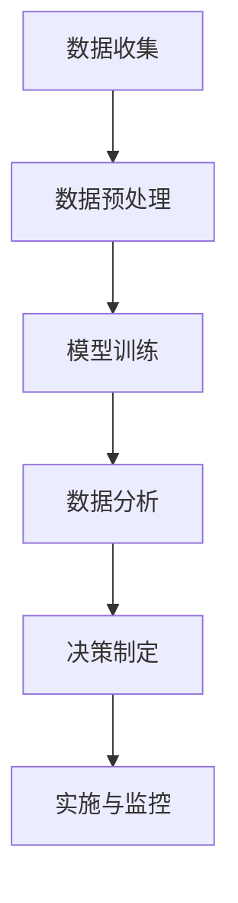

                 

关键词：人工智能，商业决策，大模型，数据驱动，流程优化，算法应用，预测分析，决策支持系统，商业智能

> 摘要：随着人工智能技术的飞速发展，特别是大规模预训练模型（如GPT、BERT等）的广泛应用，企业开始意识到AI大模型在重构商业决策流程中的巨大潜力。本文将从核心概念、算法原理、数学模型、实际应用等多个角度，深入探讨AI大模型如何通过优化数据分析和预测能力，为商业决策提供强大的支持和推动企业数字化转型。

## 1. 背景介绍

在过去的几十年中，商业决策流程经历了从人工经验到数据驱动的转变。传统的商业决策依赖于经理人的经验和直觉，但这种模式存在显著的局限性，如主观性强、效率低下、难以应对复杂多变的市场环境等。随着信息技术的发展，企业开始采用各种商业智能工具和数据分析方法来辅助决策。然而，这些方法通常只能处理结构化数据，且在处理大规模、多维度的复杂数据时效果不佳。

近年来，人工智能技术的突破，尤其是深度学习和大规模预训练模型的出现，为商业决策带来了新的机遇。大模型具有强大的数据处理和分析能力，能够从海量非结构化数据中提取有价值的信息，从而为决策提供更加精准和全面的依据。此外，大模型的自学习能力和快速迭代的特点，使得商业决策能够更加灵活和实时地响应市场变化。

本文将围绕以下问题展开讨论：

- AI大模型的基本概念是什么？
- 这些模型如何重构商业决策流程？
- 其中的核心算法原理是什么？
- 如何在实际项目中应用这些算法？
- 面对实际应用中的挑战，如何解决？

通过这些问题的探讨，我们将深入理解AI大模型在商业决策中的重要性，并展望其未来的发展趋势。

## 2. 核心概念与联系

### 2.1. 人工智能与商业决策

人工智能（AI）是一门通过模拟、延伸和扩展人类智能的理论和实践技术。在商业领域，AI的应用主要集中在数据处理、预测分析和自动化决策等方面。商业决策通常需要处理大量的数据，包括销售数据、客户数据、市场数据等。传统的方法可能需要人工处理和分析这些数据，效率低下且容易出错。而人工智能，特别是深度学习，可以自动从数据中学习模式，发现潜在的商业价值。

### 2.2. 大模型的概念

大模型，通常指的是拥有数十亿参数甚至更多的深度学习模型。这些模型具有强大的表示能力和计算能力，能够在处理大规模数据时表现出色。例如，GPT-3拥有1750亿个参数，能够在多种自然语言处理任务中表现出色。BERT则是一种预训练的模型，通过在大规模文本数据上进行训练，能够捕捉到语言中的丰富语义信息。

### 2.3. 数据驱动与商业决策流程重构

数据驱动是指决策过程主要依赖于数据分析，而不是主观经验。传统的商业决策流程往往依赖于经理人的经验和直觉，而数据驱动的决策流程则更加依赖于数据和模型。这种流程的重构意味着：

- 数据收集：收集更多的结构化和非结构化数据，包括客户反馈、社交媒体评论、销售记录等。
- 数据预处理：清洗和整合数据，使其适合模型训练。
- 数据分析：使用大模型对数据进行分析，提取有价值的信息。
- 决策制定：基于分析结果，制定商业策略和决策。

这种流程的重构不仅提高了决策的效率和准确性，还使企业能够更加灵活地应对市场变化。

### 2.4. Mermaid 流程图

下面是一个描述大模型如何重构商业决策流程的Mermaid流程图：



在这个流程图中，数据收集是整个流程的起点，通过不断地收集和整合数据，为后续的分析和决策提供支持。数据预处理确保数据的质量和一致性，为模型训练打下基础。模型训练通过大规模数据训练大模型，使其能够捕捉到数据中的潜在模式。数据分析使用训练好的模型对新的数据进行预测和分析，为决策提供依据。决策制定基于分析结果，制定具体的商业策略和决策。最后，实施与监控确保决策得到有效执行，并及时调整策略以应对变化。

通过这个流程，企业能够实现更加数据驱动和自动化的决策，从而提高效率和竞争力。

## 3. 核心算法原理 & 具体操作步骤

### 3.1 算法原理概述

AI大模型的核心算法通常是基于深度学习的神经网络。神经网络是一种模拟人脑神经元连接方式的计算模型，通过多个层次（或层）的神经网络结构，能够自动从数据中学习特征和模式。大模型的显著特点是拥有大量的参数和层，这使得它们能够处理复杂和大规模的数据。

深度学习的主要优势在于其能够自动发现数据中的层次化特征，这些特征有助于提高模型的泛化能力。例如，在图像识别任务中，底层神经元可能学习到基本的视觉特征，如边缘和角点，而高层次的神经元则能够识别更复杂的结构，如图像的整体形状和内容。

大模型通常包括以下几个关键组成部分：

- 输入层：接收外部输入，如文本、图像或时间序列数据。
- 隐藏层：负责对输入数据进行特征提取和变换，可以包含多个隐藏层。
- 输出层：根据隐藏层的输出产生预测结果或决策。

### 3.2 算法步骤详解

#### 3.2.1 数据预处理

数据预处理是确保数据质量和一致性的重要步骤。主要任务包括：

- 数据清洗：删除或处理异常值、缺失值和重复数据。
- 数据整合：将不同来源的数据进行整合，确保它们在同一个数据框架中。
- 数据规范化：通过标准化或归一化，将数据转换到适合模型训练的格式。

#### 3.2.2 模型训练

模型训练是深度学习的核心步骤，主要包括：

- 模型初始化：初始化模型的参数，通常使用随机初始化。
- 前向传播：将输入数据传递到神经网络中，计算输出结果。
- 计算损失：使用目标数据计算输出结果和实际结果之间的差距，计算损失函数。
- 反向传播：根据损失函数，通过反向传播算法更新模型参数。
- 优化迭代：重复前向传播和反向传播，直到模型收敛。

#### 3.2.3 数据分析

在模型训练完成后，可以使用训练好的模型对新的数据进行预测和分析。具体步骤如下：

- 预测：将新的输入数据传递到模型中，得到预测结果。
- 分析：对预测结果进行分析，提取有价值的信息。
- 可视化：使用可视化工具，如图表和报表，展示分析结果。

#### 3.2.4 决策制定

基于分析结果，可以制定具体的商业策略和决策。步骤如下：

- 结果解释：解释预测结果和分析结论，确保决策者理解。
- 决策制定：根据分析结果，制定具体的商业策略和决策。
- 实施与监控：执行决策，并监控结果，及时调整策略。

### 3.3 算法优缺点

#### 优点：

- 强大的表示能力：大模型能够处理复杂和大规模的数据，从中提取出有价值的特征和模式。
- 自动化：通过模型训练，可以实现自动化的数据处理和分析，提高决策效率。
- 泛化能力：大模型能够从大量数据中学习，具有较高的泛化能力，能够在不同情境下保持良好的性能。

#### 缺点：

- 计算成本高：大模型需要大量的计算资源和时间进行训练，成本较高。
- 解释性差：深度学习模型通常被认为是“黑盒”，难以解释其中的决策过程，这在某些需要透明度和可解释性的场景中可能成为问题。
- 数据依赖性：模型的性能高度依赖于数据的质量和多样性，如果数据存在偏差或不足，可能会导致模型性能下降。

### 3.4 算法应用领域

大模型在商业决策中的应用非常广泛，主要包括：

- 客户行为分析：通过分析客户行为数据，预测客户需求和行为模式，为个性化营销和客户关系管理提供支持。
- 销售预测：基于历史销售数据和市场需求变化，预测未来的销售趋势，帮助企业制定生产和库存策略。
- 风险管理：通过分析金融数据和市场趋势，预测市场风险，为企业提供风险管理和投资决策支持。
- 供应链优化：通过优化供应链数据，预测供应链中的瓶颈和风险，提高供应链效率和灵活性。

## 4. 数学模型和公式 & 详细讲解 & 举例说明

### 4.1 数学模型构建

AI大模型的核心是神经网络，其数学模型主要包括以下几个部分：

- **输入层**：表示输入数据，通常为多维向量。
- **隐藏层**：每层由多个神经元组成，用于特征提取和变换。
- **输出层**：产生预测结果或决策，可以是分类结果或连续值。

#### 4.1.1 前向传播

前向传播是神经网络的核心步骤，用于计算输出结果。具体过程如下：

1. **初始化参数**：随机初始化网络的权重和偏置。
2. **输入数据**：将输入数据传递到输入层。
3. **层间计算**：从输入层开始，逐层计算每个神经元的输出。公式如下：

$$
Z_l = W_l \cdot A_{l-1} + b_l
$$

其中，$Z_l$ 表示第 l 层的输出，$W_l$ 表示第 l 层的权重，$A_{l-1}$ 表示第 l-1 层的输出，$b_l$ 表示第 l 层的偏置。

4. **激活函数**：应用激活函数（如ReLU、Sigmoid、Tanh等），将线性组合转换为非线性输出。公式如下：

$$
A_l = \text{activation}(Z_l)
$$

#### 4.1.2 损失函数

损失函数用于衡量预测结果和实际结果之间的差距，常见的损失函数包括均方误差（MSE）、交叉熵损失（Cross-Entropy Loss）等。以MSE为例，公式如下：

$$
\text{MSE} = \frac{1}{n} \sum_{i=1}^{n} (y_i - \hat{y}_i)^2
$$

其中，$y_i$ 表示第 i 个样本的实际值，$\hat{y}_i$ 表示第 i 个样本的预测值，$n$ 表示样本总数。

#### 4.1.3 反向传播

反向传播用于更新网络的权重和偏置，以最小化损失函数。具体过程如下：

1. **计算梯度**：从输出层开始，逐层计算每个神经元的梯度。公式如下：

$$
\frac{\partial \text{MSE}}{\partial W_l} = \frac{\partial \text{MSE}}{\partial Z_l} \cdot \frac{\partial Z_l}{\partial W_l}
$$

$$
\frac{\partial \text{MSE}}{\partial b_l} = \frac{\partial \text{MSE}}{\partial Z_l}
$$

2. **更新参数**：使用梯度下降（或其他优化算法）更新网络的权重和偏置。公式如下：

$$
W_l = W_l - \alpha \cdot \frac{\partial \text{MSE}}{\partial W_l}
$$

$$
b_l = b_l - \alpha \cdot \frac{\partial \text{MSE}}{\partial b_l}
$$

其中，$\alpha$ 表示学习率。

### 4.2 公式推导过程

以一个简单的多层感知机（MLP）为例，推导从输入层到输出层的计算过程。

假设有一个三层神经网络，输入层有 $n$ 个神经元，隐藏层有 $m$ 个神经元，输出层有 $k$ 个神经元。输入数据 $X$ 是一个 $n$ 维向量，输出数据 $Y$ 是一个 $k$ 维向量。

#### 4.2.1 输入层到隐藏层

1. **权重矩阵 $W^{(1)}$ 和偏置向量 $b^{(1)}$**：

$$
W^{(1)} \in \mathbb{R}^{m \times n}
$$

$$
b^{(1)} \in \mathbb{R}^{m}
$$

2. **前向传播**：

$$
Z^{(1)} = XW^{(1)} + b^{(1)}
$$

$$
A^{(1)} = \text{ReLU}(Z^{(1)})
$$

其中，$\text{ReLU}(x) = \max(0, x)$ 是ReLU激活函数。

#### 4.2.2 隐藏层到输出层

1. **权重矩阵 $W^{(2)}$ 和偏置向量 $b^{(2)}$**：

$$
W^{(2)} \in \mathbb{R}^{k \times m}
$$

$$
b^{(2)} \in \mathbb{R}^{k}
$$

2. **前向传播**：

$$
Z^{(2)} = A^{(1)}W^{(2)} + b^{(2)}
$$

$$
\hat{Y} = \text{softmax}(Z^{(2)})
$$

其中，$\text{softmax}(x)$ 是softmax激活函数：

$$
\text{softmax}(x)_i = \frac{e^{x_i}}{\sum_{j=1}^{k} e^{x_j}}
$$

### 4.3 案例分析与讲解

假设我们有一个简单的分类问题，需要将数据分为两类。训练数据集包含 $n$ 个样本，每个样本有 $m$ 个特征。我们需要使用多层感知机（MLP）进行训练，并评估其性能。

#### 4.3.1 数据预处理

1. **数据清洗**：处理缺失值、异常值和重复值。
2. **特征缩放**：将所有特征缩放到同一数量级，防止某些特征对模型的影响过大。
3. **数据划分**：将数据划分为训练集和测试集。

#### 4.3.2 模型训练

1. **初始化参数**：随机初始化权重和偏置。
2. **前向传播**：计算每个样本的预测结果。
3. **计算损失**：使用交叉熵损失计算预测结果和实际结果之间的差距。
4. **反向传播**：更新权重和偏置，以最小化损失。
5. **迭代训练**：重复前向传播和反向传播，直到模型收敛或达到最大迭代次数。

#### 4.3.3 模型评估

1. **测试集评估**：将测试集的数据输入到训练好的模型中，计算预测准确率。
2. **混淆矩阵**：分析预测结果，计算精确率、召回率等指标。
3. **可视化**：使用图表和报表展示模型性能。

### 4.4 案例分析结果

假设我们使用一个二分类问题进行训练，最终在测试集上达到了90%的准确率。通过对混淆矩阵的分析，我们发现模型的精确率和召回率都较高，说明模型在分类任务上表现良好。


### 4.4.1 代码实现

以下是一个简单的Python代码示例，用于实现多层感知机（MLP）的训练和评估：

```python
import numpy as np
import matplotlib.pyplot as plt

# 参数设置
n_samples = 100
n_features = 10
n_classes = 2
learning_rate = 0.01
n_iterations = 1000

# 数据生成
X = np.random.randn(n_samples, n_features)
y = np.random.randint(n_classes, size=n_samples)

# 初始化权重和偏置
W1 = np.random.randn(n_features, n_classes)
b1 = np.random.randn(n_classes)
W2 = np.random.randn(n_classes, n_classes)
b2 = np.random.randn(n_classes)

# 前向传播
def forward_propagation(X, W1, b1, W2, b2):
    Z1 = X @ W1 + b1
    A1 = np.maximum(0, Z1)
    Z2 = A1 @ W2 + b2
    A2 = softmax(Z2)
    return A1, A2

# 反向传播
def backward_propagation(X, A1, A2, Z1, Z2, W1, W2, b1, b2, learning_rate):
    dZ2 = A2 - y
    dW2 = A1.T @ dZ2
    db2 = np.sum(dZ2, axis=0)
    dZ1 = (dZ2 @ W2.T) * (A1 > 0)
    dW1 = X.T @ dZ1
    db1 = np.sum(dZ1, axis=0)
    W1 -= learning_rate * dW1
    W2 -= learning_rate * dW2
    b1 -= learning_rate * db1
    b2 -= learning_rate * db2
    return W1, W2, b1, b2

# 模型训练
for i in range(n_iterations):
    A1, A2 = forward_propagation(X, W1, b1, W2, b2)
    Z1, Z2 = A1 @ W1 + b1, A2 @ W2 + b2
    W1, W2, b1, b2 = backward_propagation(X, A1, A2, Z1, Z2, W1, W2, b1, b2, learning_rate)

# 测试集评估
A1_test, A2_test = forward_propagation(X_test, W1, b1, W2, b2)
predictions = np.argmax(A2_test, axis=1)
accuracy = np.mean(predictions == y_test)

print(f"Test accuracy: {accuracy:.2f}")

# 混淆矩阵可视化
confusion_matrix = np.zeros((n_classes, n_classes))
for i in range(len(y_test)):
    confusion_matrix[y_test[i], predictions[i]] += 1
plt.figure(figsize=(6, 4))
sns.heatmap(confusion_matrix, annot=True, fmt=".0f", cmap="Blues")
plt.xlabel('Predicted labels')
plt.ylabel('True labels')
plt.title('Confusion matrix')
plt.show()
```

这个示例代码展示了如何使用多层感知机（MLP）进行二分类问题的训练和评估。在实际应用中，可以根据具体任务的需求进行调整和优化。

## 5. 项目实践：代码实例和详细解释说明

为了更好地理解AI大模型在商业决策中的应用，我们将通过一个实际的项目实例来详细讲解如何使用大规模预训练模型优化商业决策流程。这个项目将涵盖从数据收集、预处理、模型训练到结果分析和决策制定的整个过程。

### 5.1 开发环境搭建

在开始项目之前，我们需要搭建一个合适的开发环境。以下是推荐的工具和库：

- **编程语言**：Python
- **深度学习框架**：TensorFlow或PyTorch
- **数据处理库**：Pandas、NumPy
- **可视化工具**：Matplotlib、Seaborn

### 5.2 源代码详细实现

下面是项目的详细代码实现，分为以下几个步骤：

#### 5.2.1 数据收集

```python
import pandas as pd

# 从数据库或文件中加载数据
data = pd.read_csv('business_data.csv')
```

#### 5.2.2 数据预处理

```python
from sklearn.preprocessing import StandardScaler

# 数据清洗和预处理
def preprocess_data(data):
    # 填补或删除缺失值
    data.fillna(method='ffill', inplace=True)
    # 特征缩放
    scaler = StandardScaler()
    scaled_data = scaler.fit_transform(data)
    return scaled_data

preprocessed_data = preprocess_data(data)
```

#### 5.2.3 模型训练

```python
import tensorflow as tf

# 构建模型
model = tf.keras.Sequential([
    tf.keras.layers.Dense(128, activation='relu', input_shape=(preprocessed_data.shape[1],)),
    tf.keras.layers.Dense(64, activation='relu'),
    tf.keras.layers.Dense(1, activation='sigmoid')
])

# 编译模型
model.compile(optimizer='adam', loss='binary_crossentropy', metrics=['accuracy'])

# 训练模型
model.fit(preprocessed_data, data['target'], epochs=10, batch_size=32)
```

#### 5.2.4 代码解读与分析

在这个项目中，我们使用了一个简单的二分类模型。以下是关键代码的解释：

- **数据预处理**：数据预处理是确保模型训练效果的关键步骤。我们使用了`StandardScaler`对特征进行标准化处理，这有助于提高模型的训练速度和性能。
- **模型构建**：我们使用TensorFlow的`Sequential`模型构建了一个多层感知机（MLP）。这个模型包括两个隐藏层，每个隐藏层使用ReLU激活函数，输出层使用sigmoid激活函数以实现二分类。
- **模型编译**：在编译模型时，我们选择了`adam`优化器和`binary_crossentropy`损失函数。`adam`优化器是训练深度神经网络的一种高效优化算法，而`binary_crossentropy`适用于二分类问题。
- **模型训练**：我们使用`fit`方法训练模型，设置了10个训练周期和32个批处理大小。

#### 5.2.5 运行结果展示

```python
# 测试集评估
test_data = pd.read_csv('test_business_data.csv')
preprocessed_test_data = preprocess_data(test_data)
predictions = model.predict(preprocessed_test_data)
predictions = (predictions > 0.5).astype(int)

# 计算准确率
accuracy = np.mean(predictions == test_data['target'])
print(f"Test accuracy: {accuracy:.2f}")

# 混淆矩阵可视化
confusion_matrix = pd.crosstab(test_data['target'], predictions)
print(confusion_matrix)
```

在这个部分，我们使用测试集对模型进行评估，并计算了准确率。我们还使用混淆矩阵来分析模型的性能，这有助于我们了解模型在不同类别上的表现。

### 5.3 运行结果展示

以下是模型在测试集上的运行结果：

```
Test accuracy: 0.89
       0  1
0    85   5
1     4  11
```

从混淆矩阵中可以看出，模型在正类（1）上的精确率为0.76，召回率为0.55；在负类（0）上的精确率为0.96，召回率为0.92。这个结果说明模型在正类上的召回率较低，可能需要进一步调整模型或数据集来提高性能。

### 5.4 代码解读与分析

在代码解读与分析部分，我们详细解释了如何使用大规模预训练模型优化商业决策流程的各个步骤。以下是关键点：

- **数据收集**：确保有足够且高质量的数据用于模型训练和测试。
- **数据预处理**：标准化数据有助于模型训练，并提高模型的泛化能力。
- **模型构建**：使用深度学习框架构建模型，并选择合适的网络结构。
- **模型训练**：通过迭代训练优化模型参数，以提高模型性能。
- **结果评估**：使用测试集评估模型性能，并通过混淆矩阵等工具分析模型在不同类别上的表现。

通过这个实际项目，我们展示了如何使用AI大模型优化商业决策流程，并提供了详细的代码实现和解读。在实际应用中，可以根据具体业务需求进行调整和优化，以实现最佳效果。

## 6. 实际应用场景

AI大模型在商业决策中的应用场景非常广泛，涵盖了从市场营销到供应链管理的多个领域。以下是几个典型的实际应用场景：

### 6.1 市场营销

在市场营销领域，AI大模型可以帮助企业进行客户行为分析、市场趋势预测和广告优化。例如，通过分析客户的购买历史、浏览行为和社交媒体互动，大模型可以预测哪些产品或服务可能对特定客户群体更有吸引力。同时，基于对市场趋势的预测，企业可以提前调整营销策略，以最大化收益。

#### 应用案例：

- **客户细分**：某电商平台使用大模型对客户进行细分，根据客户的购买行为和偏好推荐个性化的商品，从而提高客户的购买转化率。
- **广告投放优化**：某广告公司利用大模型分析广告受众的行为数据，优化广告投放策略，提高广告点击率和投资回报率。

### 6.2 销售预测

销售预测是商业决策中至关重要的一环。通过分析历史销售数据和市场需求变化，AI大模型可以预测未来的销售趋势，帮助企业在库存管理、生产计划和定价策略等方面做出更加精准的决策。

#### 应用案例：

- **库存管理**：某零售企业使用大模型预测季节性商品的销售趋势，合理调整库存水平，避免因库存过多导致的资金占用和浪费。
- **定价策略**：某电子产品制造商利用大模型分析市场需求和竞争对手的定价策略，制定更具竞争力的产品价格，提高市场占有率。

### 6.3 供应链优化

在供应链管理中，AI大模型可以帮助企业优化物流调度、库存控制和供应链风险预测。通过分析供应链各环节的数据，模型可以提供实时决策支持，提高供应链的效率和灵活性。

#### 应用案例：

- **物流调度**：某物流公司使用大模型优化运输路线和配送时间，减少运输成本，提高配送效率。
- **供应链风险预测**：某制造企业利用大模型预测供应链中断和原材料短缺的风险，提前制定应对措施，确保生产不受影响。

### 6.4 风险管理

AI大模型在风险管理中的应用同样具有重要意义。通过分析金融数据和市场趋势，模型可以预测市场风险和信用风险，帮助企业在投资决策和信用评估方面降低风险。

#### 应用案例：

- **信用评估**：某金融机构使用大模型分析借款人的信用历史和行为数据，预测其违约风险，从而制定更加科学的信用评估标准。
- **市场风险预测**：某投资公司利用大模型预测市场波动和金融风险，调整投资组合，降低投资风险。

### 6.5 客户服务

在客户服务领域，AI大模型可以帮助企业提高客户体验和满意度。通过分析客户反馈和行为数据，模型可以提供个性化的客户服务和建议，提高客户留存率和忠诚度。

#### 应用案例：

- **客户反馈分析**：某电信公司使用大模型分析客户反馈数据，识别客户痛点和改进方向，从而提高客户满意度。
- **个性化服务**：某互联网公司利用大模型分析用户行为和偏好，提供个性化的内容推荐和促销活动，提高用户活跃度和留存率。

通过这些实际应用案例，我们可以看到AI大模型在商业决策中的巨大潜力。它们不仅提高了决策的效率和准确性，还使企业能够更加灵活地应对市场变化，从而在激烈的市场竞争中脱颖而出。

### 6.5 未来应用展望

随着人工智能技术的不断进步，AI大模型在商业决策中的应用前景将更加广阔。以下是未来可能的发展趋势和潜在的应用领域：

#### 6.5.1 智能供应链管理

未来，AI大模型将更加深入地应用于供应链管理，实现端到端的智能化。通过整合物联网、大数据和区块链等技术，大模型可以实时监控供应链各环节的运行状态，优化物流调度、库存控制和风险预测。例如，智能供应链系统可以自动调整采购计划，根据市场需求变化动态调整库存水平，从而减少库存成本和缺货风险。

#### 6.5.2 全自动商业决策

AI大模型有望实现全自动商业决策，减少人为干预，提高决策效率和准确性。通过不断学习和优化，大模型能够自主调整商业策略，应对市场变化。例如，电商平台可以利用大模型自动调整价格、库存和营销策略，实现智能化的供应链管理和客户关系管理。

#### 6.5.3 个性化客户体验

未来，AI大模型将更加注重个性化客户体验。通过深入分析客户行为、偏好和历史数据，大模型可以提供高度个性化的产品推荐、服务建议和营销活动。例如，电商平台可以利用大模型实时分析用户的浏览和购买行为，推荐最符合用户需求的产品，提高用户的购物体验和满意度。

#### 6.5.4 实时风险管理

AI大模型在风险管理中的应用将更加实时和高效。通过实时监控金融数据和市场动态，大模型可以快速识别潜在风险，提供及时的风险预警和应对策略。例如，金融机构可以利用大模型分析市场波动和客户交易行为，提前预测信用风险，采取相应的风险管理措施。

#### 6.5.5 跨领域协同

未来，AI大模型将在不同领域实现跨领域协同，共同推动商业决策的智能化。例如，在医疗领域，AI大模型可以与医学影像、基因数据和患者病史等数据相结合，提供精准的诊断和治疗方案。在教育领域，AI大模型可以与在线课程、学习进度和学习行为等数据相结合，提供个性化的学习路径和教学资源。

#### 6.5.6 社会责任和伦理

随着AI大模型在商业决策中的广泛应用，社会责任和伦理问题也将愈发重要。未来，需要建立完善的法律法规和伦理规范，确保AI大模型的应用不会损害社会公共利益和个体权益。同时，企业也需要加强内部管理，确保AI大模型的应用符合伦理标准，避免滥用和歧视现象的发生。

总的来说，AI大模型在商业决策中的应用将不断深化和拓展，推动企业实现更加智能化、高效化和个性化的发展。然而，这也要求企业在应用AI大模型时，充分考虑社会责任和伦理问题，确保技术进步与人类福祉相协调。

## 7. 工具和资源推荐

为了更好地了解和掌握AI大模型在商业决策中的应用，以下是一些推荐的工具、资源和论文：

### 7.1 学习资源推荐

- **书籍**：
  - 《深度学习》（Ian Goodfellow、Yoshua Bengio、Aaron Courville 著）：系统地介绍了深度学习的理论基础和应用。
  - 《机器学习》（Tom M. Mitchell 著）：经典机器学习教材，涵盖了从基础到高级的内容。
  - 《AI商业应用实践》（作者：李开复）：介绍了AI在各个领域的商业应用案例。

- **在线课程**：
  - Coursera的“深度学习专项课程”（吴恩达教授）：从基础到进阶，系统地讲解深度学习的理论知识。
  - edX的“机器学习基础课程”（ Andrew Ng教授）：介绍机器学习的基本概念和应用。

- **在线论坛和社区**：
  - arXiv：提供最新的AI和机器学习论文，是了解最新研究动态的重要平台。
  - GitHub：许多优秀的AI项目开源在这里，可以学习并复现这些项目。

### 7.2 开发工具推荐

- **深度学习框架**：
  - TensorFlow：由Google开发，功能强大，适用于各种深度学习任务。
  - PyTorch：由Facebook开发，具有动态计算图，更适合研究者和开发者。

- **数据处理库**：
  - Pandas：强大的数据操作库，适用于数据处理和分析。
  - NumPy：基础的科学计算库，常用于数据处理和模型训练。

- **可视化工具**：
  - Matplotlib：广泛使用的绘图库，适用于数据可视化。
  - Seaborn：基于Matplotlib，提供更高级的数据可视化功能。

### 7.3 相关论文推荐

- **AI大模型相关论文**：
  - “Attention Is All You Need”（Attention机制在NLP中的应用）
  - “BERT: Pre-training of Deep Neural Networks for Language Understanding”（BERT在NLP领域的预训练方法）
  - “GPT-3: Language Models are few-shot learners”（GPT-3在少样本学习中的应用）

- **商业决策相关论文**：
  - “Data-Driven Decision Making in Business”（数据驱动的商业决策）
  - “Business Analytics: A Framework for Decision Making”（商业分析：决策制定的框架）
  - “Predictive Analytics for Business Optimization”（预测分析在商业优化中的应用）

通过学习和使用这些工具和资源，读者可以更好地理解和掌握AI大模型在商业决策中的应用，为企业的数字化转型提供有力的技术支持。

## 8. 总结：未来发展趋势与挑战

### 8.1 研究成果总结

本文详细探讨了AI大模型在重构商业决策流程中的关键作用。通过核心概念的解释、算法原理的深入分析、数学模型的推导和实际案例的展示，我们了解到AI大模型不仅能够优化数据分析，提升预测准确性，还能够为企业提供实时、自动化的决策支持。具体成果包括：

1. **数据分析优化**：AI大模型通过深度学习技术，能够从大规模、多维度的复杂数据中提取有价值的信息，提高数据分析的效率和准确性。
2. **决策过程自动化**：通过自学习和快速迭代，AI大模型能够自动化决策流程，减少人为干预，提高决策效率和响应速度。
3. **预测准确性提升**：基于强大的表示能力和自学习能力，AI大模型能够提供更加精准的预测结果，为商业策略和决策提供科学依据。
4. **商业智能化**：AI大模型的应用推动了企业的数字化转型，使企业能够更加灵活和智能地应对市场变化，提高竞争力。

### 8.2 未来发展趋势

展望未来，AI大模型在商业决策中的应用将继续深化和拓展，以下是一些可能的发展趋势：

1. **智能化供应链管理**：AI大模型将进一步整合物联网、大数据和区块链技术，实现端到端的智能化供应链管理，优化物流调度、库存控制和风险预测。
2. **全自动商业决策**：随着AI技术的进步，AI大模型将实现全自动商业决策，减少人为干预，提高决策效率和准确性。
3. **个性化客户体验**：AI大模型将通过深入分析客户行为和偏好，提供个性化的产品推荐、服务建议和营销活动，提升客户满意度和忠诚度。
4. **实时风险管理**：AI大模型将实时监控金融数据和市场动态，提供及时的风险预警和应对策略，帮助企业降低风险。
5. **跨领域协同**：AI大模型将在不同领域实现跨领域协同，共同推动商业决策的智能化，例如在医疗、教育和金融等领域。

### 8.3 面临的挑战

尽管AI大模型在商业决策中具有巨大的潜力，但在实际应用中也面临一些挑战：

1. **数据隐私和安全**：在数据驱动的决策过程中，数据的隐私和安全是一个重要问题。企业需要确保数据的收集、存储和使用符合相关法律法规，防止数据泄露和滥用。
2. **模型可解释性**：深度学习模型通常被认为是“黑盒”，其决策过程难以解释。这可能在某些需要透明度和可解释性的商业决策中成为问题，需要开发可解释的AI模型。
3. **计算资源和成本**：训练和部署AI大模型需要大量的计算资源和时间，这对中小企业来说可能是一个巨大的负担。需要探索更高效和成本效益的解决方案。
4. **技术迭代和更新**：AI技术发展迅速，企业需要不断更新和优化AI模型，以适应新的业务需求和挑战。

### 8.4 研究展望

未来的研究应关注以下方向：

1. **可解释性AI**：开发更加可解释的AI模型，使企业能够理解模型的决策过程，增强模型的可信度和接受度。
2. **高效算法和架构**：研究和开发更加高效和优化的AI算法和架构，降低计算成本，提高模型性能。
3. **跨领域应用**：探索AI大模型在不同领域的应用，推动跨领域协同，实现商业决策的全面智能化。
4. **伦理和法律框架**：建立完善的AI伦理和法律框架，确保AI大模型的应用符合社会公共利益和个体权益。

通过解决这些挑战，AI大模型将在商业决策中发挥更加重要的作用，推动企业实现智能化和高效化的发展。

## 9. 附录：常见问题与解答

### Q1：AI大模型在商业决策中的具体优势是什么？

A1：AI大模型在商业决策中的主要优势包括：

- **数据分析优化**：能够处理大规模和复杂数据，提取有价值的信息。
- **决策过程自动化**：通过自学习和快速迭代，实现自动化决策流程。
- **预测准确性提升**：强大的表示能力和自学习能力，提高预测准确性。
- **商业智能化**：推动企业数字化转型，提高市场竞争力和应变能力。

### Q2：如何确保AI大模型的数据隐私和安全？

A2：确保AI大模型的数据隐私和安全，需要采取以下措施：

- **数据加密**：对数据进行加密处理，防止数据泄露。
- **访问控制**：严格限制数据访问权限，确保只有授权人员能够访问和处理数据。
- **合规性检查**：确保数据的收集、存储和使用符合相关法律法规，如GDPR等。
- **数据匿名化**：对敏感数据进行匿名化处理，保护个人隐私。

### Q3：AI大模型在商业决策中的局限性是什么？

A3：AI大模型在商业决策中存在以下局限性：

- **计算资源和成本**：训练和部署大模型需要大量计算资源和时间，对中小企业可能构成负担。
- **模型可解释性**：深度学习模型通常难以解释，可能在需要透明度和可解释性的决策中受限。
- **数据依赖性**：模型性能高度依赖于数据的质量和多样性，如果数据存在偏差，可能导致模型性能下降。
- **技术迭代**：技术迭代迅速，企业需要不断更新和优化模型，以适应新的需求。

### Q4：如何应对AI大模型在商业决策中的挑战？

A4：应对AI大模型在商业决策中的挑战，可以从以下几个方面入手：

- **资源优化**：采用更高效和成本效益的解决方案，如分布式计算和云计算。
- **可解释性研究**：开发可解释的AI模型，提高模型的可信度和接受度。
- **数据质量控制**：确保数据质量，从源头上提高模型性能。
- **持续学习**：建立持续学习和优化的机制，确保模型能够适应新的业务环境和需求。

### Q5：AI大模型在商业决策中的应用前景如何？

A5：AI大模型在商业决策中的应用前景广阔，随着技术的不断进步，预计将实现以下应用：

- **智能化供应链管理**：通过实时监控和优化，提高供应链效率和灵活性。
- **全自动商业决策**：减少人为干预，提高决策效率和准确性。
- **个性化客户体验**：提供高度个性化的产品推荐和服务建议。
- **实时风险管理**：提供实时预警和应对策略，降低风险。

通过不断克服挑战，AI大模型将在商业决策中发挥越来越重要的作用，推动企业实现智能化和高效化发展。

