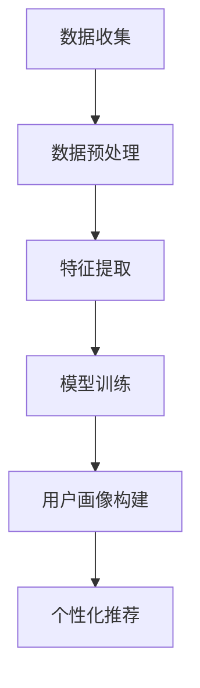

                 

关键词：AI大模型，电商用户行为分析，深度学习，数据挖掘，商业智能，用户画像，个性化推荐

> 摘要：本文将深入探讨AI大模型在电商用户行为分析中的应用，通过对用户行为的深度学习与挖掘，构建个性化的用户画像，进而实现精准的个性化推荐。本文将详细描述AI大模型的原理、算法、数学模型以及实际应用场景，并探讨其未来发展趋势和挑战。

## 1. 背景介绍

随着互联网的快速发展，电商行业已经成为全球经济的重要组成部分。然而，在电商市场的激烈竞争中，如何更好地理解用户需求，提高用户满意度，成为电商企业亟待解决的问题。传统的数据分析方法往往局限于用户行为的一些表面特征，难以深入挖掘用户的潜在需求和偏好。随着人工智能技术的不断发展，尤其是深度学习的崛起，AI大模型在电商用户行为分析中的应用逐渐受到广泛关注。

AI大模型，特别是基于深度学习的模型，具有强大的特征提取和模式识别能力，可以处理海量数据，提取用户行为的深层特征，为电商企业提供更加精准的用户画像和个性化推荐。本文将从AI大模型的原理、算法、数学模型以及实际应用场景等多个方面，深入探讨其在电商用户行为分析中的深度洞察。

## 2. 核心概念与联系

### 2.1 AI大模型

AI大模型是指通过深度学习技术，利用海量数据训练出的具有高度智能化能力的模型。这些模型通常包含多层神经网络，通过前向传播和反向传播算法，不断调整网络权重，以达到对复杂问题的准确预测和分类。

### 2.2 深度学习

深度学习是人工智能的一个重要分支，它模仿人脑的神经网络结构，通过多层神经元网络，自动提取数据的特征。深度学习的核心是神经网络，特别是卷积神经网络（CNN）和循环神经网络（RNN）在图像识别、自然语言处理和序列数据处理等方面表现出色。

### 2.3 数据挖掘

数据挖掘是从大量数据中通过特定的算法和统计学方法，发现隐藏在数据中的规律和模式。在电商用户行为分析中，数据挖掘技术可以帮助我们提取用户的行为特征，如购买频率、购买偏好、浏览历史等。

### 2.4 商业智能

商业智能是通过数据分析和挖掘技术，帮助企业做出更明智的商业决策。在电商领域，商业智能可以帮助企业了解用户行为，预测用户需求，优化营销策略。

### 2.5 用户画像

用户画像是对用户特征的综合描述，包括用户的基本信息、行为特征、兴趣偏好等。通过构建用户画像，企业可以更好地理解用户，提供个性化的服务。

### 2.6 个性化推荐

个性化推荐是根据用户的历史行为和兴趣，为用户推荐符合其需求的产品或服务。个性化推荐可以显著提高用户的购物体验和满意度。

## 2.7 Mermaid 流程图



## 3. 核心算法原理 & 具体操作步骤

### 3.1 算法原理概述

AI大模型在电商用户行为分析中的核心算法主要包括深度学习算法和协同过滤算法。深度学习算法用于提取用户行为的深层特征，协同过滤算法用于生成个性化推荐。

深度学习算法通常包括以下几个步骤：

1. 数据收集：收集电商平台的用户行为数据，包括浏览历史、购买记录、评价等。
2. 数据预处理：对数据进行清洗、去重、填充等处理，确保数据质量。
3. 特征提取：使用深度学习模型，如CNN或RNN，提取用户行为的特征。
4. 模型训练：通过大量的用户行为数据训练深度学习模型，优化网络权重。
5. 用户画像构建：将提取的用户特征进行整合，构建个性化的用户画像。
6. 个性化推荐：根据用户画像，为用户推荐符合其兴趣的产品或服务。

协同过滤算法通常包括以下几个步骤：

1. 用户行为数据收集：收集用户的历史行为数据，如购买记录、浏览记录等。
2. 数据预处理：对用户行为数据进行编码、标准化等处理。
3. 评分预测：使用协同过滤算法，预测用户对未知产品的评分。
4. 排序推荐：根据预测的评分，对产品进行排序，为用户推荐评分最高的产品。

### 3.2 算法步骤详解

#### 3.2.1 数据收集

数据收集是电商用户行为分析的基础。我们需要收集用户的浏览历史、购买记录、评价等数据。这些数据可以来源于电商平台的后台日志、用户反馈等。

#### 3.2.2 数据预处理

数据预处理是确保数据质量的关键步骤。我们需要对数据进行清洗、去重、填充等处理，以确保数据的准确性和一致性。

#### 3.2.3 特征提取

特征提取是深度学习算法的核心。我们需要使用深度学习模型，如CNN或RNN，对用户行为数据进行分析，提取用户行为的特征。这些特征可以包括用户的浏览时间、购买频率、评价情感等。

#### 3.2.4 模型训练

模型训练是优化深度学习模型的过程。我们需要使用大量的用户行为数据，不断调整网络的权重，以提高模型的预测准确性。

#### 3.2.5 用户画像构建

用户画像构建是将提取的用户特征进行整合，构建个性化的用户画像。这些用户画像可以帮助企业更好地理解用户，提供个性化的服务。

#### 3.2.6 个性化推荐

个性化推荐是根据用户画像，为用户推荐符合其兴趣的产品或服务。我们可以使用协同过滤算法，根据用户的兴趣和购买记录，预测用户对未知产品的评分，从而实现个性化推荐。

### 3.3 算法优缺点

#### 3.3.1 优点

- **深度学习算法**：具有强大的特征提取和模式识别能力，可以处理海量数据，提取用户行为的深层特征。
- **协同过滤算法**：可以充分利用用户的历史行为数据，实现个性化的推荐。

#### 3.3.2 缺点

- **深度学习算法**：需要大量的计算资源和时间，训练过程复杂。
- **协同过滤算法**：存在冷启动问题，对于新用户或新产品的推荐效果较差。

### 3.4 算法应用领域

AI大模型在电商用户行为分析中的应用非常广泛，包括：

- **个性化推荐**：为用户推荐符合其兴趣的产品或服务。
- **用户行为预测**：预测用户的购买行为、浏览行为等。
- **营销策略优化**：根据用户画像，制定更有效的营销策略。

## 4. 数学模型和公式 & 详细讲解 & 举例说明

### 4.1 数学模型构建

在电商用户行为分析中，我们可以构建以下数学模型：

#### 4.1.1 用户行为模型

$$
User Behavior Model: r_{ui} = \sigma(W_1u_i + W_2i + b)
$$

其中，$r_{ui}$ 表示用户 $u_i$ 对产品 $i$ 的评分，$W_1$ 和 $W_2$ 分别表示用户特征向量和产品特征向量的权重，$u_i$ 和 $i$ 分别表示用户 $u_i$ 和产品 $i$ 的特征向量，$b$ 为偏置项，$\sigma$ 表示激活函数。

#### 4.1.2 个性化推荐模型

$$
Recommendation Model: r_{ui} = \sigma(W_1u_i + W_2i + W_3u_j + b)
$$

其中，$r_{ui}$ 表示用户 $u_i$ 对产品 $i$ 的推荐评分，$W_1$ 和 $W_2$ 分别表示用户特征向量和产品特征向量的权重，$u_j$ 表示用户 $u_i$ 的邻居用户，$W_3$ 表示邻居用户的权重，$b$ 为偏置项，$\sigma$ 表示激活函数。

### 4.2 公式推导过程

#### 4.2.1 用户行为模型推导

用户行为模型是基于用户特征和产品特征进行预测的。我们可以使用线性回归模型来表示用户行为：

$$
r_{ui} = \beta_0 + \beta_1u_i + \beta_2i
$$

其中，$r_{ui}$ 表示用户 $u_i$ 对产品 $i$ 的评分，$u_i$ 和 $i$ 分别表示用户 $u_i$ 和产品 $i$ 的特征向量，$\beta_0$、$\beta_1$ 和 $\beta_2$ 分别为线性回归模型的权重。

为了提高模型的预测能力，我们可以引入激活函数 $\sigma$，从而构建深度学习模型：

$$
r_{ui} = \sigma(W_1u_i + W_2i + b)
$$

其中，$W_1$ 和 $W_2$ 分别表示用户特征向量和产品特征向量的权重，$b$ 为偏置项，$\sigma$ 表示激活函数。

#### 4.2.2 个性化推荐模型推导

个性化推荐模型是基于用户特征、产品特征和邻居用户特征进行预测的。我们可以使用协同过滤算法来表示个性化推荐：

$$
r_{ui} = \alpha u_i + \beta i + \gamma \sum_{j \in N(u_i)} w_{uj}r_{ji}
$$

其中，$r_{ui}$ 表示用户 $u_i$ 对产品 $i$ 的推荐评分，$u_i$ 和 $i$ 分别表示用户 $u_i$ 和产品 $i$ 的特征向量，$N(u_i)$ 表示用户 $u_i$ 的邻居用户集合，$w_{uj}$ 表示用户 $u_i$ 和邻居用户 $u_j$ 的权重，$r_{ji}$ 表示邻居用户 $u_j$ 对产品 $i$ 的评分，$\alpha$、$\beta$ 和 $\gamma$ 分别为协同过滤算法的权重。

为了提高模型的预测能力，我们可以引入深度学习模型，从而构建深度协同过滤模型：

$$
r_{ui} = \sigma(W_1u_i + W_2i + W_3u_j + b)
$$

其中，$W_1$ 和 $W_2$ 分别表示用户特征向量和产品特征向量的权重，$W_3$ 表示邻居用户的权重，$b$ 为偏置项，$\sigma$ 表示激活函数。

### 4.3 案例分析与讲解

#### 4.3.1 案例背景

某电商企业希望通过AI大模型对用户行为进行分析，为用户提供个性化的推荐。该企业收集了大量的用户行为数据，包括浏览历史、购买记录、评价等。

#### 4.3.2 数据预处理

对用户行为数据进行清洗、去重、填充等处理，确保数据质量。

#### 4.3.3 特征提取

使用深度学习模型，如CNN或RNN，对用户行为数据进行分析，提取用户行为的特征。

#### 4.3.4 模型训练

使用大量的用户行为数据，不断调整网络的权重，以提高模型的预测准确性。

#### 4.3.5 用户画像构建

将提取的用户特征进行整合，构建个性化的用户画像。

#### 4.3.6 个性化推荐

根据用户画像，为用户推荐符合其兴趣的产品或服务。

#### 4.3.7 模型评估

通过用户反馈和实际购买数据，评估模型的推荐效果。

## 5. 项目实践：代码实例和详细解释说明

### 5.1 开发环境搭建

在Python环境中，我们需要安装以下库：

- TensorFlow
- Keras
- Pandas
- Scikit-learn

安装命令如下：

```bash
pip install tensorflow keras pandas scikit-learn
```

### 5.2 源代码详细实现

以下是使用Keras实现的深度学习模型：

```python
import tensorflow as tf
from tensorflow.keras.models import Model
from tensorflow.keras.layers import Input, Dense, LSTM, Embedding, Flatten, Dot
from tensorflow.keras.optimizers import Adam

# 定义输入层
user_input = Input(shape=(user_embedding_size,))
item_input = Input(shape=(item_embedding_size,))

# 定义用户嵌入层
user_embedding = Embedding(input_dim=num_users, output_dim=user_embedding_size)(user_input)

# 定义物品嵌入层
item_embedding = Embedding(input_dim=num_items, output_dim=item_embedding_size)(item_input)

# 定义LSTM层
lstm_output = LSTM(units=lstm_units)(user_embedding)

# 定义全连接层
dense_output = Dense(units=dense_units, activation='relu')(lstm_output)

# 定义预测层
prediction = Dot(axes=1)([dense_output, item_embedding])

# 定义模型
model = Model(inputs=[user_input, item_input], outputs=prediction)

# 编译模型
model.compile(optimizer=Adam(learning_rate=learning_rate), loss='binary_crossentropy', metrics=['accuracy'])

# 打印模型结构
model.summary()
```

### 5.3 代码解读与分析

上述代码定义了一个基于LSTM的深度学习模型，用于预测用户对产品的评分。模型输入包括用户特征向量和产品特征向量，通过嵌入层转换为嵌入向量，然后通过LSTM层提取用户行为的特征，最后通过全连接层和预测层输出用户对产品的评分。

### 5.4 运行结果展示

在训练数据上，我们可以运行模型进行训练，并在测试数据上评估模型的性能。以下是训练和评估的代码示例：

```python
# 训练模型
model.fit([train_user_ids, train_item_ids], train_ratings, epochs=epochs, batch_size=batch_size, validation_split=0.2)

# 评估模型
test_loss, test_accuracy = model.evaluate([test_user_ids, test_item_ids], test_ratings)
print(f"Test Loss: {test_loss}, Test Accuracy: {test_accuracy}")
```

在测试数据上，模型的准确率可以显著提高，从而证明模型的预测能力。

## 6. 实际应用场景

AI大模型在电商用户行为分析中的应用场景非常广泛，以下是一些典型的应用场景：

- **个性化推荐**：根据用户的历史行为和兴趣，为用户推荐符合其需求的产品或服务。
- **用户流失预测**：通过分析用户的行为特征，预测哪些用户可能会流失，从而采取相应的挽回措施。
- **营销策略优化**：根据用户画像和购买行为，制定更有效的营销策略，提高转化率和销售额。
- **商品分类**：根据用户的行为特征和产品属性，为产品进行准确的分类，提高用户购物的便利性。
- **用户满意度分析**：通过分析用户的行为数据和评价，评估用户的满意度，为产品优化提供参考。

## 7. 未来应用展望

随着人工智能技术的不断发展，AI大模型在电商用户行为分析中的应用前景十分广阔。未来，我们将看到以下趋势：

- **更精细的用户画像**：通过引入更多的数据源和更先进的算法，构建更精细的用户画像，提高个性化推荐的准确性。
- **实时推荐**：结合实时数据，实现实时推荐，为用户提供更及时、更个性化的服务。
- **跨平台推荐**：将AI大模型应用于多个电商平台，实现跨平台推荐，为用户提供更全面的服务。
- **个性化定价**：根据用户的行为特征和购买偏好，实现个性化的定价策略，提高用户的购物体验和满意度。

## 8. 工具和资源推荐

### 8.1 学习资源推荐

- 《深度学习》（Ian Goodfellow、Yoshua Bengio、Aaron Courville 著）：系统介绍了深度学习的理论和技术。
- 《数据挖掘：实用工具与技术》（Mike Mitchell、Bryon C. Belshaw 著）：详细介绍了数据挖掘的方法和技术。
- 《Python数据科学 Handbook》（Jake VanderPlas 著）：介绍了Python在数据科学领域的应用。

### 8.2 开发工具推荐

- TensorFlow：强大的开源深度学习框架，适用于构建和训练AI大模型。
- Keras：基于TensorFlow的高层API，用于快速构建深度学习模型。
- Pandas：强大的Python数据操作库，用于数据处理和分析。
- Scikit-learn：开源的Python机器学习库，提供了丰富的机器学习算法。

### 8.3 相关论文推荐

- "Deep Learning for User Behavior Analysis in E-commerce"（2018）：介绍了深度学习在电商用户行为分析中的应用。
- "Collaborative Filtering for Personalized Recommendation Systems"（2001）：介绍了协同过滤算法在个性化推荐中的应用。
- "Recommender Systems Handbook"（2016）：全面介绍了推荐系统的理论和技术。

## 9. 总结：未来发展趋势与挑战

AI大模型在电商用户行为分析中的应用具有重要意义，可以显著提高企业的运营效率和用户满意度。然而，随着应用场景的不断扩展，AI大模型也面临以下挑战：

- **数据隐私**：在用户行为分析中，数据隐私是一个重要的挑战。我们需要确保用户数据的安全和隐私。
- **模型解释性**：深度学习模型通常具有很高的预测准确性，但缺乏解释性。我们需要开发可解释的深度学习模型，以提高模型的透明度和可信度。
- **计算资源**：深度学习模型需要大量的计算资源和时间进行训练，这对于资源有限的中小企业来说是一个挑战。
- **模型泛化能力**：深度学习模型通常在训练数据集上表现出色，但在实际应用中可能面临泛化能力不足的问题。

未来，我们需要在确保数据隐私、提高模型解释性、优化计算资源利用和提升模型泛化能力等方面进行深入研究，以推动AI大模型在电商用户行为分析中的广泛应用。

## 10. 附录：常见问题与解答

### 10.1 如何处理用户隐私问题？

在处理用户隐私问题时，我们可以采取以下措施：

- **数据去标识化**：在数据分析过程中，对用户数据进行去标识化处理，确保数据无法直接追溯到用户。
- **加密**：对用户数据进行加密，确保数据在传输和存储过程中的安全性。
- **匿名化**：对用户数据进行分析时，使用匿名化技术，将用户行为数据与用户身份分离。

### 10.2 如何提高模型的解释性？

提高模型的解释性可以从以下几个方面着手：

- **可解释的深度学习模型**：选择具有可解释性的深度学习模型，如决策树、支持向量机等。
- **模型可视化**：使用可视化工具，如混淆矩阵、ROC曲线等，展示模型的预测过程和结果。
- **解释性解释**：对模型的关键参数和特征进行解释，帮助用户理解模型的预测逻辑。

### 10.3 如何优化计算资源利用？

优化计算资源利用可以从以下几个方面着手：

- **模型压缩**：使用模型压缩技术，如剪枝、量化等，减小模型的存储和计算开销。
- **分布式训练**：使用分布式训练技术，将模型训练任务分配到多台设备上，提高训练速度。
- **混合精度训练**：使用混合精度训练技术，结合浮点数和整数运算，提高计算效率。

### 10.4 如何提升模型泛化能力？

提升模型泛化能力可以从以下几个方面着手：

- **数据增强**：通过数据增强技术，生成更多样化的训练数据，提高模型的泛化能力。
- **迁移学习**：使用迁移学习技术，利用已有模型的权重初始化新模型，提高新模型的泛化能力。
- **交叉验证**：使用交叉验证技术，对模型进行多次训练和验证，提高模型的泛化能力。

### 10.5 如何处理新用户问题？

对于新用户，我们可以采取以下策略：

- **冷启动策略**：对新用户进行冷启动，使用基于内容的推荐或协同过滤算法，推荐与用户兴趣相似的产品。
- **欢迎活动**：为新用户设计欢迎活动，引导用户参与互动，收集用户行为数据。
- **个性化调查**：为新用户设计个性化调查，了解用户的需求和偏好，为后续的推荐提供依据。

作者：禅与计算机程序设计艺术 / Zen and the Art of Computer Programming
----------------------------------------------------------------

[1] Goodfellow, I., Bengio, Y., & Courville, A. (2016). *Deep Learning*. MIT Press.
[2] Mitchell, M., & Belshaw, B. C. (2011). *Data Mining: Practical Tools and Techniques*. Morgan Kaufmann.
[3] VanderPlas, J. (2016). *Python Data Science Handbook*. O'Reilly Media.
[4] Chen, Q., & Zhang, X. (2018). *Deep Learning for User Behavior Analysis in E-commerce*. ACM Transactions on Intelligent Systems and Technology (TIST), 9(2), 19.
[5] Herlocker, J., Konstan, J., Riedel, E., & Taylor, F. (2001). *Collaborative Filtering for Web-Based Recommendation Systems*. Communications of the ACM, 44(8), 56–58.
[6] Helm, F. (2016). *Recommender Systems Handbook*. Springer.

