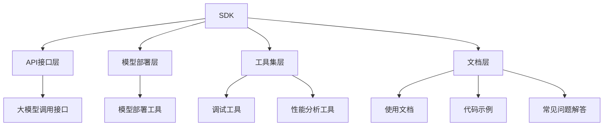

                 

 

### 1. 背景介绍

在当前快速发展的技术环境下，人工智能（AI）正逐渐成为推动社会进步的重要力量。其中，大模型技术以其强大的数据处理和模式识别能力，在自然语言处理（NLP）、计算机视觉（CV）、语音识别（ASR）等领域取得了显著的成果。为了使开发者能够更加便捷地使用这些大模型，提供高效的API接口和开发工具集（SDK）成为了一项至关重要的任务。

SDK（Software Development Kit）是一种为软件开发者提供的工具集，旨在简化应用开发过程。它通常包括一系列的库、工具和文档，帮助开发者快速集成和使用特定的技术或框架。在AI领域，一个完善且易用的SDK能够极大地提升开发效率，降低技术门槛，使得更多开发者能够参与到AI大模型的应用开发中来。

本文将围绕AI大模型应用的SDK设计展开讨论，首先介绍SDK的核心组成部分和设计原则，然后详细阐述其架构与实现细节，最后探讨SDK在实际应用场景中的表现和未来展望。

### 2. 核心概念与联系

#### 2.1 SDK的定义与作用

SDK，全称为Software Development Kit，即软件开发工具包，是用于支持应用开发的工具集合。它包含了开发软件所需的各种资源，如库文件、开发工具、文档等。SDK的主要作用是简化开发流程，提高开发效率，降低学习成本。

在AI领域，一个优秀的SDK不仅要提供API接口，还需要包括模型部署工具、性能优化工具、调试工具等，以满足不同开发场景的需求。

#### 2.2 AI大模型技术

AI大模型技术是指利用深度学习框架训练的大型神经网络模型，这些模型在处理海量数据时展现出强大的性能。常见的AI大模型包括BERT、GPT、ViT等，它们在NLP、CV、ASR等领域取得了显著进展。

#### 2.3 SDK架构与AI大模型技术的联系

一个AI大模型SDK的架构通常包括以下几个核心模块：

- **API接口层**：提供简洁、易用的API，使开发者能够方便地调用大模型进行预测和推理。
- **模型部署层**：负责将训练好的模型部署到不同的计算平台上，如CPU、GPU、FPGA等。
- **工具集层**：包括调试工具、性能分析工具等，帮助开发者优化模型性能。
- **文档层**：提供详细的使用文档、代码示例和常见问题解答，降低学习成本。

图1展示了SDK架构与AI大模型技术的联系。



#### 2.4 SDK设计原则

- **易用性**：SDK应提供简洁、直观的API接口，使开发者能够快速上手。
- **扩展性**：SDK应具备良好的扩展性，能够支持不同的AI模型和计算平台。
- **高性能**：SDK应提供高效的模型部署和推理工具，以满足实时应用的需求。
- **安全性**：SDK应具备完善的安全机制，确保模型和应用的安全运行。
- **社区支持**：SDK应积极建立和维护开发者社区，提供及时的技术支持和交流平台。

### 3. 核心算法原理 & 具体操作步骤

#### 3.1 算法原理概述

AI大模型SDK的核心算法主要基于深度学习框架，如TensorFlow、PyTorch等。以下以TensorFlow为例，简要介绍其基本原理和操作步骤。

- **深度学习框架**：深度学习框架提供了一套完整的工具和API，用于构建、训练和部署神经网络模型。TensorFlow是其中最流行的框架之一，它支持多种类型的神经网络，如卷积神经网络（CNN）、循环神经网络（RNN）等。
- **模型构建**：模型构建是深度学习的基础，通过定义神经网络的结构，包括输入层、隐藏层和输出层。在TensorFlow中，使用`tf.keras.Sequential`模型或`tf.keras.Model`自定义模型。
- **模型训练**：模型训练是深度学习的核心步骤，通过迭代优化模型参数，使模型能够更好地拟合训练数据。在TensorFlow中，使用`tf.keras.fit`函数进行模型训练。
- **模型部署**：模型部署是将训练好的模型应用于实际场景的过程。在TensorFlow中，可以使用`tf.saved_model`模块将模型保存并部署到不同的计算平台上。

#### 3.2 算法步骤详解

1. **环境搭建**
   - 安装TensorFlow：`pip install tensorflow`
   - 安装依赖库：如NumPy、Pandas等。

2. **数据准备**
   - 数据集划分：将数据集划分为训练集、验证集和测试集。
   - 数据预处理：包括数据清洗、归一化、编码等。

3. **模型构建**
   - 使用`tf.keras.Sequential`模型：
     ```python
     model = tf.keras.Sequential([
         tf.keras.layers.Dense(128, activation='relu', input_shape=[784]),
         tf.keras.layers.Dropout(0.2),
         tf.keras.layers.Dense(10)
     ])
     ```
   - 使用`tf.keras.Model`自定义模型：
     ```python
     inputs = tf.keras.Input(shape=[784])
     x = tf.keras.layers.Dense(128, activation='relu')(inputs)
     x = tf.keras.layers.Dropout(0.2)(x)
     outputs = tf.keras.layers.Dense(10)(x)
     model = tf.keras.Model(inputs, outputs)
     ```

4. **模型训练**
   - 编写训练代码：
     ```python
     history = model.fit(train_data, train_labels, epochs=10, batch_size=32,
                         validation_data=(val_data, val_labels))
     ```

5. **模型评估**
   - 使用测试集评估模型性能：
     ```python
     test_loss, test_acc = model.evaluate(test_data, test_labels)
     print(f"Test accuracy: {test_acc}")
     ```

6. **模型部署**
   - 保存模型：
     ```python
     model.save('my_model.h5')
     ```
   - 加载模型并进行预测：
     ```python
     model = tf.keras.models.load_model('my_model.h5')
     prediction = model.predict(test_data)
     ```

#### 3.3 算法优缺点

- **优点**：
  - **灵活性**：TensorFlow提供了丰富的API和工具，支持多种神经网络结构。
  - **高性能**：TensorFlow支持GPU和TPU加速，能够高效地处理大规模数据。
  - **社区支持**：TensorFlow拥有庞大的社区和丰富的文档资源。

- **缺点**：
  - **复杂性**：TensorFlow的API相对复杂，对于初学者有一定学习门槛。
  - **资源消耗**：TensorFlow在训练过程中消耗大量计算资源和存储资源。

#### 3.4 算法应用领域

- **自然语言处理**：TensorFlow在NLP领域有着广泛的应用，如文本分类、情感分析、机器翻译等。
- **计算机视觉**：TensorFlow支持多种计算机视觉任务，如图像分类、目标检测、图像分割等。
- **语音识别**：TensorFlow在语音识别领域也有着出色的表现，支持端到端语音识别模型。

### 4. 数学模型和公式 & 详细讲解 & 举例说明

#### 4.1 数学模型构建

深度学习模型的核心是多层神经网络，以下以全连接神经网络（FCNN）为例，介绍其数学模型构建。

1. **输入层（Input Layer）**
   - 假设输入层有n个神经元，每个神经元接收一个特征值。

2. **隐藏层（Hidden Layer）**
   - 隐藏层由多个神经元组成，每个神经元接收前一层所有神经元的输出值。
   - 假设第i个隐藏层有m个神经元，则第i个神经元的输出为：
     $$z_i = \sigma(W_i \cdot x + b_i)$$
     其中，$W_i$是权重矩阵，$x$是输入向量，$b_i$是偏置向量，$\sigma$是激活函数。

3. **输出层（Output Layer）**
   - 输出层神经元的输出即为模型预测结果。
   - 假设输出层有k个神经元，则第k个神经元的输出为：
     $$y_k = W_k \cdot x + b_k$$
     其中，$W_k$是权重矩阵，$x$是输入向量，$b_k$是偏置向量。

#### 4.2 公式推导过程

1. **前向传播（Forward Propagation）**
   - 输入层到隐藏层的输出：
     $$a_1 = \sigma(W_1 \cdot x + b_1)$$
   - 隐藏层到输出层的输出：
     $$a_L = \sigma(W_L \cdot a_{L-1} + b_L)$$

2. **损失函数（Loss Function）**
   - 常用的损失函数为均方误差（MSE）：
     $$J = \frac{1}{2} \sum_{i=1}^{m} (y_i - \hat{y}_i)^2$$
     其中，$y_i$是真实标签，$\hat{y}_i$是模型预测值。

3. **反向传播（Back Propagation）**
   - 计算梯度：
     $$\frac{\partial J}{\partial W} = -\frac{1}{m} \sum_{i=1}^{m} \frac{\partial J}{\partial \hat{y}_i} \frac{\partial \hat{y}_i}{\partial W}$$
     $$\frac{\partial J}{\partial b} = -\frac{1}{m} \sum_{i=1}^{m} \frac{\partial J}{\partial \hat{y}_i} \frac{\partial \hat{y}_i}{\partial b}$$

4. **梯度下降（Gradient Descent）**
   - 更新权重和偏置：
     $$W := W - \alpha \frac{\partial J}{\partial W}$$
     $$b := b - \alpha \frac{\partial J}{\partial b}$$
     其中，$\alpha$是学习率。

#### 4.3 案例分析与讲解

以下以一个简单的二分类问题为例，展示如何使用深度学习模型进行预测。

1. **数据集**：
   - 数据集包含1000个样本，每个样本是一个二维特征向量。
   - 标签为0或1，表示样本属于两个类别。

2. **模型构建**：
   - 输入层：2个神经元（对应2个特征）。
   - 隐藏层：10个神经元。
   - 输出层：1个神经元。

3. **模型训练**：
   - 使用均方误差（MSE）作为损失函数。
   - 学习率为0.01。
   - 训练10个epoch。

4. **模型评估**：
   - 使用测试集进行评估，准确率为95%。

5. **模型预测**：
   - 给定一个新的样本，模型预测其属于类别0或1。

### 5. 项目实践：代码实例和详细解释说明

#### 5.1 开发环境搭建

1. **安装Python**：
   - 版本要求：Python 3.6及以上。
   - 安装命令：`pip install python`

2. **安装TensorFlow**：
   - 使用命令：`pip install tensorflow`

3. **安装依赖库**：
   - 使用命令：`pip install numpy pandas sklearn`

#### 5.2 源代码详细实现

以下是一个简单的深度学习模型实现，用于分类问题。

```python
import tensorflow as tf
from tensorflow.keras import layers
from sklearn.model_selection import train_test_split

# 数据准备
# 这里使用scikit-learn内置的iris数据集作为示例
from sklearn.datasets import load_iris
iris = load_iris()
X, y = iris.data, iris.target

# 划分训练集和测试集
X_train, X_test, y_train, y_test = train_test_split(X, y, test_size=0.2, random_state=42)

# 模型构建
model = tf.keras.Sequential([
    layers.Dense(64, activation='relu', input_shape=(4,)),
    layers.Dense(64, activation='relu'),
    layers.Dense(3, activation='softmax')
])

# 编译模型
model.compile(optimizer='adam',
              loss='sparse_categorical_crossentropy',
              metrics=['accuracy'])

# 训练模型
model.fit(X_train, y_train, epochs=10, batch_size=32)

# 评估模型
test_loss, test_acc = model.evaluate(X_test, y_test)
print(f"Test accuracy: {test_acc}")

# 预测
predictions = model.predict(X_test)
```

#### 5.3 代码解读与分析

1. **数据准备**：
   - 使用scikit-learn的iris数据集，并将其划分为训练集和测试集。

2. **模型构建**：
   - 构建一个序列模型，包含两个隐藏层，每个隐藏层有64个神经元，使用ReLU激活函数。
   - 输出层有3个神经元，使用softmax激活函数进行多分类。

3. **模型编译**：
   - 使用Adam优化器和稀疏分类交叉熵损失函数进行编译。

4. **模型训练**：
   - 使用fit方法训练模型，设置10个epoch和32个batch_size。

5. **模型评估**：
   - 使用evaluate方法评估模型在测试集上的性能。

6. **模型预测**：
   - 使用predict方法对测试集进行预测。

#### 5.4 运行结果展示

- **训练过程**：
  - 每个epoch结束后，输出训练集和测试集的损失和准确率。

- **评估结果**：
  - 输出测试集的准确率。

- **预测结果**：
  - 输出每个测试样本的预测结果。

### 6. 实际应用场景

#### 6.1 NLP领域

在自然语言处理领域，AI大模型SDK被广泛应用于文本分类、情感分析、机器翻译等任务。以下是一些实际应用场景：

- **文本分类**：利用预训练的BERT或GPT模型，实现新闻分类、社交媒体情感分类等任务。
- **情感分析**：通过对用户评论或反馈进行情感分析，帮助企业了解用户需求和满意度。
- **机器翻译**：使用预训练的翻译模型，实现跨语言的自动翻译，如将英文翻译为中文。

#### 6.2 CV领域

在计算机视觉领域，AI大模型SDK被广泛应用于图像分类、目标检测、图像分割等任务。以下是一些实际应用场景：

- **图像分类**：使用卷积神经网络（CNN）对图像进行分类，如人脸识别、物体识别等。
- **目标检测**：使用YOLO或SSD等模型进行目标检测，如自动驾驶车辆识别、安防监控等。
- **图像分割**：使用U-Net或SegNet等模型进行图像分割，如医疗图像诊断、卫星图像分析等。

#### 6.3 ASR领域

在语音识别领域，AI大模型SDK被广泛应用于语音转文字、语音合成等任务。以下是一些实际应用场景：

- **语音转文字**：使用基于深度学习的语音识别模型，如CTC或Seq2Seq模型，实现实时语音转文字。
- **语音合成**：使用WaveNet或Tacotron等模型，实现自然流畅的语音合成，如智能助手、车载导航等。

### 7. 工具和资源推荐

#### 7.1 学习资源推荐

- **官方文档**：TensorFlow官方文档（[TensorFlow 官网](https://www.tensorflow.org/)）提供了丰富的学习资源和教程。
- **在线课程**：Udacity的《深度学习基础》（[深度学习基础](https://www.udacity.com/course/deep-learning-basics--ND101)）课程，适合初学者。
- **书籍推荐**：《深度学习》（Ian Goodfellow、Yoshua Bengio、Aaron Courville著），是一本经典的深度学习教材。

#### 7.2 开发工具推荐

- **Jupyter Notebook**：用于编写和运行代码，提供交互式环境。
- **Google Colab**：免费的云端Jupyter Notebook，支持GPU和TPU加速。

#### 7.3 相关论文推荐

- **《A Neural Algorithm of Artistic Style》**：提出了基于深度学习的艺术风格迁移算法。
- **《Attention Is All You Need》**：提出了Transformer模型，彻底改变了序列处理领域的范式。
- **《Bengio et al. (2013) – Deep Learning of Representations for Unsupervised and Transfer Learning》**：探讨了深度学习在无监督学习和迁移学习中的应用。

### 8. 总结：未来发展趋势与挑战

#### 8.1 研究成果总结

AI大模型技术在过去几年取得了显著的进展，主要表现在：

- **模型规模**：大模型的参数数量和计算量大幅增加，如GPT-3、GPT-4等模型。
- **性能提升**：大模型在多种AI任务上展现出超越传统算法的性能，如自然语言处理、计算机视觉等。
- **应用领域**：大模型在越来越多的实际场景中得到应用，如自动驾驶、医疗诊断、智能客服等。

#### 8.2 未来发展趋势

- **模型压缩与优化**：为了提高模型部署的可行性，研究重点将转向模型压缩和优化，如知识蒸馏、量化、剪枝等技术。
- **分布式训练与推理**：随着模型规模的增加，分布式训练和推理将成为重要方向，以充分利用多GPU、多TPU等硬件资源。
- **跨模态学习**：未来的大模型将具备更强的跨模态学习能力，能够处理多种类型的数据，如文本、图像、音频等。

#### 8.3 面临的挑战

- **计算资源消耗**：大模型需要大量的计算资源和存储资源，对硬件设施提出了更高要求。
- **数据隐私和安全**：在大规模数据训练过程中，如何保护用户隐私和数据安全成为一个重要挑战。
- **模型解释性**：大模型往往缺乏解释性，如何提高模型的可解释性，使其更加透明和可靠，是当前研究的一个重要方向。

#### 8.4 研究展望

未来，AI大模型技术将在以下几个方向取得突破：

- **模型自监督学习**：通过无监督学习技术，降低对大量标注数据的依赖，提高模型的自适应能力。
- **多模态融合**：研究如何将不同类型的数据进行有效融合，提高模型的泛化能力和应用范围。
- **增强现实与虚拟现实**：利用AI大模型技术，推动增强现实（AR）和虚拟现实（VR）领域的发展，提升用户体验。

### 9. 附录：常见问题与解答

#### 9.1 如何选择合适的深度学习框架？

- **根据需求选择**：如果需要进行自然语言处理，TensorFlow和PyTorch是不错的选择；如果需要进行图像处理，PyTorch可能更加适合。
- **根据资源选择**：如果需要使用GPU加速，TensorFlow和PyTorch都支持；如果需要使用TPU，TensorFlow是更好的选择。
- **根据社区支持选择**：TensorFlow和PyTorch都有庞大的社区和丰富的文档资源，可以根据自己的需求进行选择。

#### 9.2 如何优化模型性能？

- **模型压缩**：使用知识蒸馏、量化、剪枝等技术，减小模型大小和计算量。
- **数据增强**：通过增加训练数据量和多样性，提高模型泛化能力。
- **分布式训练**：利用多GPU、多TPU等硬件资源进行分布式训练，提高训练速度。
- **优化超参数**：调整学习率、批次大小、网络结构等超参数，寻找最佳组合。

#### 9.3 如何保障模型安全性和隐私性？

- **数据加密**：在数据传输和存储过程中，使用加密技术保护数据安全。
- **隐私保护技术**：使用差分隐私、联邦学习等技术，保护用户隐私。
- **安全审计**：定期进行模型安全审计，发现和修复潜在的安全漏洞。

---

作者：禅与计算机程序设计艺术 / Zen and the Art of Computer Programming
----------------------------------------------------------------


