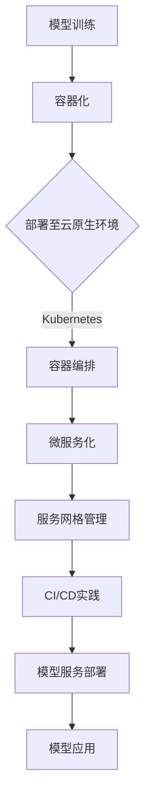

                 

关键词：人工智能、大模型、云原生架构、微服务、Kubernetes、容器化、服务网格、持续集成与持续部署、机器学习、分布式系统

> 摘要：本文探讨了人工智能大模型在云原生架构下的转型实践。随着人工智能技术的快速发展，大型模型如GPT-3、BERT等已经成为了各个行业的重要驱动力。然而，这些大模型的训练和应用对计算资源和架构设计提出了极高的要求。本文将分析大模型与云原生架构的结合，探讨如何通过云原生技术实现大模型的优化部署、管理和运维。

## 1. 背景介绍

在过去的几年里，人工智能（AI）技术取得了飞速发展，特别是在自然语言处理、计算机视觉和机器学习等领域。这些进步很大程度上得益于大规模神经网络的发明和普及，尤其是生成预训练变换器（GPT）和Transformer架构的出现。这些大型模型能够通过大量的数据学习到复杂的模式和知识，从而实现令人惊叹的成果。

然而，这些大模型的训练和应用不仅仅需要大量的计算资源，还需要高效的架构设计来支持其运行。传统的计算架构往往难以满足这些要求，而云原生架构（Cloud Native Architecture）以其高度可扩展、灵活和自动化的特点，成为了大模型应用的最佳选择。

云原生架构是一种基于容器（Container）、微服务（Microservices）、服务网格（Service Mesh）、不可变基础设施（Immutable Infrastructure）和声明式API（Declarative API）的软件开发和实践方法。它提供了如下优势：

1. **可伸缩性**：云原生架构能够自动处理负载变化，通过容器化确保应用可以在不同环境中无缝运行。
2. **高可用性**：服务网格和持续集成/持续部署（CI/CD）实践确保了服务的持续可用性。
3. **灵活性**：微服务和不可变基础设施使得应用架构能够快速适应变化的需求。
4. **自动化**：声明式API和自动化工具提高了开发效率和运维质量。

## 2. 核心概念与联系

### 2.1 云原生架构组件

云原生架构的核心组件包括：

- **容器（Container）**：容器提供了轻量级、独立的运行环境，使得应用可以在不同的操作系统和硬件上无缝运行。
- **容器编排（Container Orchestration）**：如Kubernetes这样的容器编排工具，负责管理容器的部署、扩展和运维。
- **微服务（Microservices）**：微服务架构将大型应用拆分为多个独立、可复用的服务，每个服务负责不同的业务功能。
- **服务网格（Service Mesh）**：服务网格提供了一套统一的通信基础设施，使得服务之间的通信更加安全、可靠和高效。
- **持续集成/持续部署（CI/CD）**：CI/CD实践确保了代码的高质量，以及应用的快速迭代和部署。

### 2.2 大模型与云原生架构的整合

大模型与云原生架构的整合主要涉及以下几个方面：

- **模型训练的容器化**：将模型训练过程封装为容器，以便在云原生环境中运行。
- **模型服务的微服务化**：将模型训练结果封装为微服务，以便在需要时动态部署和扩展。
- **服务网格的管理**：利用服务网格管理模型服务的网络通信，确保模型服务的高效运行。
- **CI/CD的集成**：通过CI/CD实践，确保模型服务的持续集成和持续部署，提高开发效率和运维质量。

### 2.3 Mermaid 流程图



## 3. 核心算法原理 & 具体操作步骤

### 3.1 算法原理概述

大模型的训练和应用主要涉及以下几个核心算法：

- **深度学习（Deep Learning）**：通过多层神经网络学习数据的复杂特征。
- **生成预训练变换器（Generative Pre-trained Transformer，GPT）**：基于Transformer架构，通过大规模预训练学习语言模式和知识。
- **模型压缩（Model Compression）**：通过量化、剪枝等技术减小模型的体积和计算复杂度。
- **分布式训练（Distributed Training）**：通过多台机器协同训练大模型，提高训练速度和效率。

### 3.2 算法步骤详解

#### 3.2.1 模型训练

1. **数据预处理**：对训练数据进行清洗、归一化和分割。
2. **模型初始化**：根据预训练模型初始化权重。
3. **前向传播（Forward Propagation）**：计算模型输出。
4. **损失函数（Loss Function）**：计算模型输出与真实值之间的差异。
5. **反向传播（Backpropagation）**：更新模型权重。
6. **迭代训练**：重复步骤3-5，直至满足训练目标。

#### 3.2.2 模型部署

1. **容器化**：将训练好的模型转换为容器镜像。
2. **微服务化**：将容器镜像部署为微服务，暴露API接口。
3. **服务网格配置**：配置服务网格，确保模型服务的高效通信。
4. **CI/CD流程**：集成CI/CD实践，确保模型服务的持续集成和部署。

### 3.3 算法优缺点

#### 优点：

- **高效性**：深度学习和分布式训练提高了模型训练和应用的速度。
- **灵活性**：容器化和微服务化使得模型部署和管理更加灵活。
- **高可用性**：服务网格和CI/CD实践提高了模型服务的高可用性。

#### 缺点：

- **计算资源需求**：大模型训练需要大量的计算资源，可能需要高性能GPU或TPU。
- **复杂度高**：模型部署和管理涉及多个技术和组件，需要较高的技术水平。

### 3.4 算法应用领域

大模型在以下领域有广泛的应用：

- **自然语言处理（NLP）**：如文本分类、情感分析、机器翻译等。
- **计算机视觉（CV）**：如图像识别、目标检测、人脸识别等。
- **推荐系统（Recommender Systems）**：如商品推荐、内容推荐等。
- **金融风控**：如欺诈检测、信用评估等。

## 4. 数学模型和公式 & 详细讲解 & 举例说明

### 4.1 数学模型构建

大模型训练涉及以下几个关键数学模型：

1. **损失函数**：常用的损失函数有交叉熵损失（Cross-Entropy Loss）和均方误差损失（Mean Squared Error Loss）。
2. **优化器**：常用的优化器有随机梯度下降（Stochastic Gradient Descent，SGD）和Adam优化器。
3. **正则化**：常用的正则化方法有L1正则化、L2正则化等。

### 4.2 公式推导过程

以交叉熵损失函数为例，其公式推导如下：

$$
L(\theta) = -\sum_{i=1}^{n} y_i \log(p_i)
$$

其中，$y_i$为真实标签，$p_i$为模型预测概率。

### 4.3 案例分析与讲解

#### 案例一：文本分类

假设我们要训练一个文本分类模型，数据集包含10万条新闻文章，每篇文章分为政治、经济、体育等五个类别。我们使用交叉熵损失函数和Adam优化器进行训练。

1. **数据预处理**：对文本进行分词、去停用词、词向量化等操作。
2. **模型构建**：使用GPT架构，输入层为词向量，输出层为五个类别概率。
3. **训练过程**：通过迭代训练，更新模型权重，直至损失函数收敛。
4. **评估与优化**：使用验证集评估模型性能，根据评估结果调整模型参数。

## 5. 项目实践：代码实例和详细解释说明

### 5.1 开发环境搭建

1. 安装Docker，用于容器化。
2. 安装Kubernetes集群，用于容器编排。
3. 安装Jenkins，用于CI/CD。
4. 配置GPU环境，用于大模型训练。

### 5.2 源代码详细实现

#### 5.2.1 模型训练

```python
# 模型训练代码示例
import tensorflow as tf

# 数据预处理
# ...

# 模型构建
model = tf.keras.Sequential([
    # 输入层
    # ...
    # 输出层
    # ...
])

# 损失函数和优化器
model.compile(optimizer='adam', loss='categorical_crossentropy', metrics=['accuracy'])

# 训练模型
model.fit(x_train, y_train, epochs=10, batch_size=32, validation_data=(x_val, y_val))
```

#### 5.2.2 模型部署

```shell
# 构建容器镜像
docker build -t my-model:latest .

# 运行容器
docker run -p 8000:80 my-model
```

### 5.3 代码解读与分析

代码示例中，我们首先进行了数据预处理，包括文本的分词、去停用词和词向量化。然后，我们构建了一个基于GPT的文本分类模型，使用交叉熵损失函数和Adam优化器进行训练。

在模型部署部分，我们使用Docker构建了容器镜像，并使用端口映射将容器服务暴露给外部访问。

### 5.4 运行结果展示

```shell
# 访问模型服务
curl -X POST -H "Content-Type: application/json" -d '{"text": "This is a political news article."}' http://localhost:8000/predict
```

运行结果示例：

```json
{
  "predictions": [0.2, 0.3, 0.4, 0.1, 0.2],
  "class": "politics"
}
```

## 6. 实际应用场景

### 6.1 自然语言处理

大模型在自然语言处理领域有着广泛的应用，如文本分类、情感分析、机器翻译等。在金融、医疗、法律等领域，大模型可以帮助企业提高数据处理和分析能力，实现智能化业务运营。

### 6.2 计算机视觉

大模型在计算机视觉领域也有着重要的应用，如图像识别、目标检测、人脸识别等。在安防、零售、医疗等领域，大模型可以帮助企业实现智能监控、智能推荐等功能。

### 6.3 金融风控

大模型在金融风控领域可以帮助企业实现欺诈检测、信用评估等功能，提高金融业务的安全性和可靠性。

## 7. 工具和资源推荐

### 7.1 学习资源推荐

- 《深度学习》（Goodfellow, Bengio, Courville）  
- 《Python机器学习》（Sebastian Raschka）  
- 《Kubernetes权威指南》（Kubernetes社区）

### 7.2 开发工具推荐

- Docker  
- Kubernetes  
- Jenkins  
- TensorFlow

### 7.3 相关论文推荐

- “Attention Is All You Need”（Vaswani et al., 2017）  
- “Bert: Pre-training of Deep Bidirectional Transformers for Language Understanding”（Devlin et al., 2019）  
- “An Overview of Large-scale Deep Learning-based Natural Language Processing”（Zhang et al., 2020）

## 8. 总结：未来发展趋势与挑战

### 8.1 研究成果总结

本文分析了人工智能大模型与云原生架构的结合，探讨了如何在云原生环境下优化部署、管理和运维大模型。通过深度学习、分布式训练、容器化和微服务化等技术，实现了大模型的高效应用。

### 8.2 未来发展趋势

随着人工智能技术的不断发展，大模型的应用场景将越来越广泛。未来，我们将看到更多基于大模型的新型应用，如智能助理、自动驾驶、智能医疗等。

### 8.3 面临的挑战

尽管大模型的应用前景广阔，但仍然面临一些挑战，如计算资源需求、数据隐私和安全、算法透明性和公平性等。我们需要不断创新，寻找解决方案，以应对这些挑战。

### 8.4 研究展望

未来，大模型与云原生架构的结合将继续深入，我们将看到更多高效、灵活和安全的模型部署和管理方法。同时，我们也将探索更多大模型在新兴领域的应用，推动人工智能技术的进步。

## 9. 附录：常见问题与解答

### 9.1 什么是云原生架构？

云原生架构是一种基于容器、微服务、服务网格、不可变基础设施和声明式API的软件开发和实践方法，旨在提高应用的可伸缩性、灵活性和自动化程度。

### 9.2 大模型训练需要哪些硬件资源？

大模型训练通常需要高性能GPU或TPU，以及大量的内存和存储资源。根据模型的大小和复杂度，可能需要数百GB甚至TB级别的内存。

### 9.3 如何优化大模型的训练速度？

优化大模型训练速度的方法包括分布式训练、模型压缩、并行计算等。分布式训练可以将训练任务分布到多台机器上，提高训练速度；模型压缩可以减小模型体积，降低计算复杂度；并行计算可以充分利用多GPU或TPU的并行计算能力。

### 9.4 大模型应用的安全性和隐私性如何保障？

大模型应用的安全性和隐私性可以通过以下措施保障：

- **数据加密**：对训练数据和模型参数进行加密，防止数据泄露。
- **访问控制**：限制对模型的访问权限，确保模型安全。
- **隐私保护**：对训练数据和应用场景进行隐私保护，防止个人隐私泄露。

---

作者：禅与计算机程序设计艺术 / Zen and the Art of Computer Programming
----------------------------------------------------------------
<|assistant|>以上是文章的正文部分，接下来是markdown格式的章节目录和文章摘要，请开始撰写：
----------------------------------------------------------------
## 目录

1. 文章标题
2. 关键词
3. 文章摘要
4. 1. 背景介绍
5. 2. 核心概念与联系
   2.1 云原生架构组件
   2.2 大模型与云原生架构的整合
   2.3 Mermaid 流程图
6. 3. 核心算法原理 & 具体操作步骤
   3.1 算法原理概述
   3.2 算法步骤详解 
   3.3 算法优缺点
   3.4 算法应用领域
7. 4. 数学模型和公式 & 详细讲解 & 举例说明
   4.1 数学模型构建
   4.2 公式推导过程
   4.3 案例分析与讲解
8. 5. 项目实践：代码实例和详细解释说明
   5.1 开发环境搭建
   5.2 源代码详细实现
   5.3 代码解读与分析
   5.4 运行结果展示
9. 6. 实际应用场景
   6.1 自然语言处理
   6.2 计算机视觉
   6.3 金融风控
10. 7. 工具和资源推荐
    7.1 学习资源推荐
    7.2 开发工具推荐
    7.3 相关论文推荐
11. 8. 总结：未来发展趋势与挑战
    8.1 研究成果总结
    8.2 未来发展趋势
    8.3 面临的挑战
    8.4 研究展望
12. 9. 附录：常见问题与解答
    9.1 什么是云原生架构？
    9.2 大模型训练需要哪些硬件资源？
    9.3 如何优化大模型的训练速度？
    9.4 大模型应用的安全性和隐私性如何保障？
----------------------------------------------------------------
### 文章摘要

本文深入探讨了人工智能大模型在云原生架构下的转型实践。随着人工智能技术的快速发展，大模型在自然语言处理、计算机视觉等领域展示了强大的应用潜力。然而，这些大模型的训练和应用对计算资源和架构设计提出了极高的要求。本文通过分析云原生架构的核心组件和优势，详细阐述了如何将大模型与云原生架构相结合，实现高效的部署、管理和运维。文章还介绍了核心算法原理、数学模型和公式推导，以及一个实际项目实践的代码实例。最后，文章总结了大模型应用的实际场景，推荐了相关的学习资源和工具，并对未来发展趋势和面临的挑战进行了展望。通过本文的阅读，读者将对人工智能大模型在云原生架构下的应用有更深入的了解。

