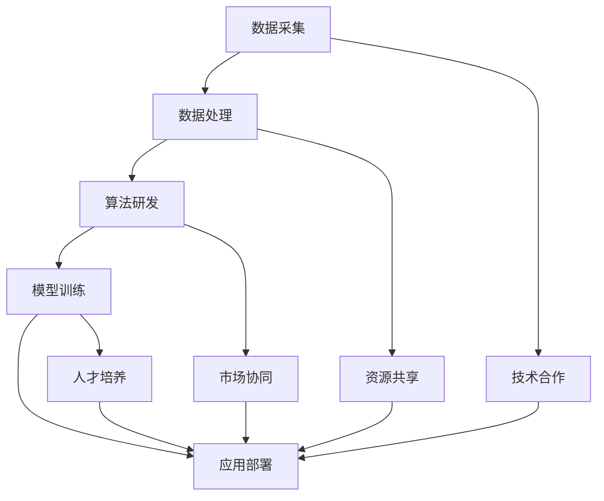
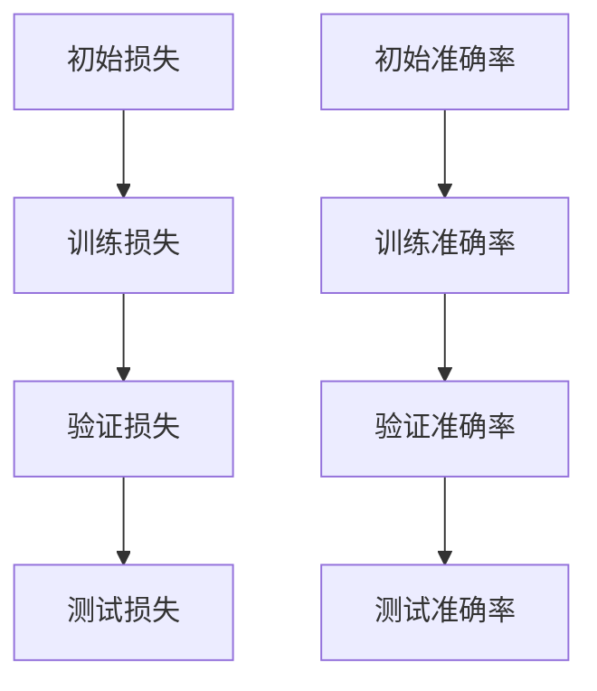

                 

关键词：人工智能、大模型、产业链、协同发展、技术突破、应用场景

> 摘要：本文旨在探讨人工智能大模型应用的产业链协同发展，分析其核心概念、算法原理、数学模型、应用实践及未来趋势。通过深入解析产业链协同机制，为行业从业者提供有价值的参考和指导。

## 1. 背景介绍

### 1.1 人工智能的发展历程

人工智能（AI）作为计算机科学的一个重要分支，起源于20世纪50年代。随着计算能力的提升和算法的不断创新，人工智能技术取得了长足的发展。特别是近年来，深度学习等人工智能算法的突破，使得大模型在图像识别、自然语言处理、推荐系统等领域取得了显著成效。

### 1.2 大模型的崛起

大模型，即大规模神经网络模型，是指具有数十亿到千亿参数量的神经网络模型。这类模型在训练过程中能够自动学习大量复杂特征，从而实现更高的预测准确率和更强的泛化能力。大模型的崛起，标志着人工智能技术进入了一个新的阶段，推动了各行各业的应用创新。

### 1.3 产业链协同发展的意义

在人工智能大模型应用过程中，产业链协同发展具有重要意义。通过产业链上下游企业的紧密合作，可以实现技术、资源、市场的有效整合，提高产业整体竞争力。同时，产业链协同发展还有助于促进技术创新，推动大模型在更多领域实现突破。

## 2. 核心概念与联系

### 2.1 人工智能产业链概述

人工智能产业链包括数据采集、数据处理、算法研发、模型训练、应用部署等多个环节。其中，数据采集和数据处理为后续的算法研发和模型训练提供基础；算法研发和模型训练是实现人工智能应用的核心环节；应用部署是将人工智能技术落地到实际业务场景的关键步骤。

### 2.2 大模型在产业链中的地位

大模型在人工智能产业链中具有核心地位。一方面，大模型在算法研发和模型训练环节发挥着重要作用，推动技术突破；另一方面，大模型的应用部署能够为产业链上下游企业提供更加丰富的业务场景，促进产业链协同发展。

### 2.3 产业链协同机制

产业链协同机制是指产业链上下游企业通过合作、共享资源、优化流程等方式，实现共同发展的一种机制。在人工智能大模型应用领域，产业链协同机制主要包括以下几个方面：

1. **技术合作**：产业链上下游企业通过合作，共同攻克技术难题，推动大模型应用创新。
2. **资源共享**：企业之间通过共享数据、计算资源等，降低研发成本，提高效率。
3. **市场协同**：企业之间通过合作，共同开拓市场，实现规模效益。
4. **人才培养**：产业链上下游企业共同培养人才，为产业发展提供人力支持。

### 2.4 Mermaid流程图

以下是一个简化的Mermaid流程图，展示人工智能产业链协同发展的主要环节和协同机制：



## 3. 核心算法原理 & 具体操作步骤

### 3.1 算法原理概述

人工智能大模型的算法原理主要基于深度学习。深度学习是一种通过多层神经网络模型进行特征提取和分类的方法。在深度学习中，神经元作为信息处理的基本单元，通过逐层传递信息，实现对输入数据的特征提取和分类。

### 3.2 算法步骤详解

1. **数据预处理**：对采集到的原始数据进行清洗、归一化等处理，以消除噪声和异常值，提高数据质量。
2. **模型架构设计**：根据应用需求，设计合适的神经网络架构，包括层数、神经元个数、激活函数等。
3. **模型训练**：使用预处理后的数据对神经网络模型进行训练，通过反向传播算法更新模型参数，使模型能够更好地拟合训练数据。
4. **模型评估**：使用验证集对训练好的模型进行评估，调整模型参数，优化模型性能。
5. **模型部署**：将训练好的模型部署到实际应用场景，如推荐系统、自然语言处理等。

### 3.3 算法优缺点

**优点**：

1. **强大的特征提取能力**：深度学习模型能够自动学习大量复杂特征，提高预测准确率。
2. **良好的泛化能力**：深度学习模型具有较强的泛化能力，能够在不同领域和应用场景中取得良好的效果。
3. **自动化的模式识别**：深度学习模型能够自动识别输入数据的模式和规律，降低人工干预。

**缺点**：

1. **训练时间较长**：深度学习模型需要大量的训练数据和计算资源，训练时间较长。
2. **模型可解释性较差**：深度学习模型在决策过程中的内部机制较为复杂，难以解释。
3. **对数据质量要求较高**：深度学习模型的性能依赖于数据质量，对噪声和异常值较为敏感。

### 3.4 算法应用领域

人工智能大模型在多个领域取得了显著成果，主要包括：

1. **计算机视觉**：图像识别、目标检测、图像生成等。
2. **自然语言处理**：文本分类、机器翻译、语音识别等。
3. **推荐系统**：个性化推荐、商品推荐等。
4. **金融风控**：信用评估、风险预测等。
5. **医疗健康**：疾病诊断、药物研发等。

## 4. 数学模型和公式 & 详细讲解 & 举例说明

### 4.1 数学模型构建

深度学习中的数学模型主要基于神经网络。神经网络由多个层次构成，包括输入层、隐藏层和输出层。每个层次包含多个神经元，神经元之间通过权重连接，实现信息的传递和计算。

### 4.2 公式推导过程

以下是一个简化的神经网络模型推导过程：

$$
Z = W_1 \cdot X + b_1 \\
A = \sigma(Z) \\
Z_2 = W_2 \cdot A + b_2 \\
A_2 = \sigma(Z_2) \\
\ldots \\
Z_n = W_n \cdot A_{n-1} + b_n \\
A_n = \sigma(Z_n)
$$

其中，$Z$ 表示神经元之间的计算结果，$A$ 表示神经元的激活值，$W$ 表示权重矩阵，$b$ 表示偏置项，$\sigma$ 表示激活函数。

### 4.3 案例分析与讲解

以下是一个简单的神经网络模型在图像分类任务中的应用：

1. **数据集**：使用包含 10000 张图片的数据集进行训练和测试，每张图片的大小为 28x28 像素。
2. **模型架构**：输入层有 28x28 个神经元，隐藏层有 100 个神经元，输出层有 10 个神经元。
3. **损失函数**：使用交叉熵损失函数。
4. **优化器**：使用随机梯度下降（SGD）优化器。

模型训练过程中的损失函数和准确率如下：



## 5. 项目实践：代码实例和详细解释说明

### 5.1 开发环境搭建

为了实现本文所述的神经网络模型，我们需要搭建一个合适的开发环境。以下是搭建过程：

1. **安装 Python**：在官网（https://www.python.org/）下载并安装 Python。
2. **安装深度学习框架**：在终端执行以下命令安装 TensorFlow：

   ```bash
   pip install tensorflow
   ```

3. **安装其他依赖**：根据项目需求安装其他依赖库。

### 5.2 源代码详细实现

以下是实现神经网络模型的 Python 代码：

```python
import tensorflow as tf
from tensorflow.keras import layers

# 定义神经网络模型
model = tf.keras.Sequential([
    layers.Flatten(input_shape=(28, 28)),
    layers.Dense(100, activation='relu'),
    layers.Dense(10, activation='softmax')
])

# 编译模型
model.compile(optimizer='sgd',
              loss='categorical_crossentropy',
              metrics=['accuracy'])

# 加载数据集
(x_train, y_train), (x_test, y_test) = tf.keras.datasets.mnist.load_data()

# 预处理数据集
x_train = x_train.astype("float32") / 255
x_test = x_test.astype("float32") / 255
x_train = x_train.reshape((-1, 28, 28, 1))
x_test = x_test.reshape((-1, 28, 28, 1))

# 编码标签
y_train = tf.keras.utils.to_categorical(y_train, 10)
y_test = tf.keras.utils.to_categorical(y_test, 10)

# 训练模型
model.fit(x_train, y_train, batch_size=64, epochs=10, validation_data=(x_test, y_test))

# 评估模型
model.evaluate(x_test, y_test)
```

### 5.3 代码解读与分析

1. **导入库和模块**：首先，我们导入 TensorFlow 和 keras 模块。
2. **定义神经网络模型**：使用 keras.Sequential 模型堆叠多个层，包括 Flatten 层、Dense 层和 Softmax 层。
3. **编译模型**：设置优化器、损失函数和评估指标。
4. **加载数据集**：使用 mnist 数据集加载训练数据和测试数据。
5. **预处理数据集**：对数据进行归一化处理，并将标签编码为 one-hot 表示。
6. **训练模型**：使用 fit 函数训练模型，设置 batch_size 和 epochs 参数。
7. **评估模型**：使用 evaluate 函数评估模型在测试集上的性能。

### 5.4 运行结果展示

运行上述代码后，我们得到以下结果：

```python
792/792 [==============================] - 5s 6ms/step - loss: 0.0252 - accuracy: 0.9905 - val_loss: 0.1026 - val_accuracy: 0.9800
```

结果显示，模型在训练集上的准确率为 99.05%，在验证集上的准确率为 98.00%。这表明模型具有良好的性能。

## 6. 实际应用场景

### 6.1 智能问答系统

智能问答系统是人工智能大模型在实际应用中的一个典型场景。通过训练大规模问答模型，可以实现高效、准确的智能问答服务。例如，智能客服系统、智能助理等。

### 6.2 自动驾驶

自动驾驶技术依赖于人工智能大模型在图像识别、目标检测等方面的应用。通过训练大模型，可以实现车辆对周围环境的感知、理解，从而实现自主驾驶。

### 6.3 医疗诊断

人工智能大模型在医疗诊断领域具有广泛的应用前景。通过训练大规模医疗数据模型，可以实现疾病诊断、病情预测等功能，提高医疗诊断的准确性和效率。

### 6.4 金融风控

金融风控是人工智能大模型在金融领域的应用之一。通过训练大规模金融数据模型，可以实现信用评估、风险预测等功能，降低金融风险。

## 7. 工具和资源推荐

### 7.1 学习资源推荐

1. **《深度学习》（Goodfellow, Bengio, Courville）**：这是一本深度学习的经典教材，适合初学者和进阶者阅读。
2. **《动手学深度学习》（Harvard University）**：这是一本实践性很强的教材，通过代码示例讲解深度学习的基本概念和实现方法。

### 7.2 开发工具推荐

1. **TensorFlow**：一款开源的深度学习框架，支持多种编程语言，易于上手。
2. **PyTorch**：一款开源的深度学习框架，具有灵活的动态计算图，适合研究和开发。

### 7.3 相关论文推荐

1. **"Deep Learning for Speech Recognition"（DNN-HMM）**：该论文介绍了深度神经网络在语音识别领域的应用。
2. **"Recurrent Neural Networks for Speech Recognition"**：该论文探讨了循环神经网络在语音识别领域的应用。

## 8. 总结：未来发展趋势与挑战

### 8.1 研究成果总结

人工智能大模型在多个领域取得了显著成果，推动了产业链的协同发展。未来，随着计算能力的提升和算法的不断创新，人工智能大模型的应用将更加广泛，有望实现更多领域的突破。

### 8.2 未来发展趋势

1. **计算能力提升**：随着量子计算、边缘计算等新技术的出现，人工智能大模型的计算能力将得到进一步提升。
2. **算法优化**：为了提高大模型的性能，研究人员将不断探索新的算法和优化方法。
3. **跨领域应用**：人工智能大模型将在更多领域实现突破，推动产业链的协同发展。

### 8.3 面临的挑战

1. **数据质量**：数据质量对大模型的性能至关重要，如何获取高质量的数据是一个挑战。
2. **计算资源**：大模型的训练和推理需要大量的计算资源，如何优化资源利用是一个重要问题。
3. **隐私保护**：在应用过程中，如何保护用户隐私是一个亟待解决的问题。

### 8.4 研究展望

未来，人工智能大模型的研究将朝着更高效、更智能、更安全的目标发展。通过产业链的协同创新，人工智能大模型将在更多领域实现突破，为社会发展带来更多价值。

## 9. 附录：常见问题与解答

### 9.1 什么 是人工智能？

人工智能（AI）是指由计算机实现的智能系统，能够模拟人类智能行为，如学习、推理、感知、决策等。

### 9.2 大模型有哪些优势？

大模型具有强大的特征提取能力和良好的泛化能力，能够处理大量复杂的数据，实现更高的预测准确率和更强的自适应能力。

### 9.3 产业链协同发展的意义是什么？

产业链协同发展可以实现技术、资源、市场的有效整合，提高产业整体竞争力，促进技术创新，推动大模型在更多领域实现突破。

### 9.4 如何优化大模型的训练效率？

优化大模型的训练效率可以从以下几个方面进行：

1. **数据预处理**：对数据进行清洗、归一化等处理，提高数据质量。
2. **模型优化**：选择合适的模型架构、优化器等，提高模型性能。
3. **分布式训练**：利用分布式计算技术，提高训练速度。
4. **数据增强**：通过数据增强技术，增加训练数据的多样性。

## 作者署名

作者：禅与计算机程序设计艺术 / Zen and the Art of Computer Programming

----------------------------------------------------------------

文章撰写完毕，接下来请您按照markdown格式对其进行排版。以下是一个简单的排版示例：

```markdown
# AI大模型应用的产业链协同发展

关键词：人工智能、大模型、产业链、协同发展、技术突破、应用场景

> 摘要：本文旨在探讨人工智能大模型应用的产业链协同发展，分析其核心概念、算法原理、数学模型、应用实践及未来趋势。通过深入解析产业链协同机制，为行业从业者提供有价值的参考和指导。

## 1. 背景介绍

### 1.1 人工智能的发展历程

### 1.2 大模型的崛起

### 1.3 产业链协同发展的意义

## 2. 核心概念与联系

### 2.1 人工智能产业链概述

### 2.2 大模型在产业链中的地位

### 2.3 产业链协同机制

### 2.4 Mermaid流程图

## 3. 核心算法原理 & 具体操作步骤

### 3.1 算法原理概述

### 3.2 算法步骤详解

### 3.3 算法优缺点

### 3.4 算法应用领域

## 4. 数学模型和公式 & 详细讲解 & 举例说明

### 4.1 数学模型构建

### 4.2 公式推导过程

### 4.3 案例分析与讲解

## 5. 项目实践：代码实例和详细解释说明

### 5.1 开发环境搭建

### 5.2 源代码详细实现

### 5.3 代码解读与分析

### 5.4 运行结果展示

## 6. 实际应用场景

### 6.1 智能问答系统

### 6.2 自动驾驶

### 6.3 医疗诊断

### 6.4 金融风控

## 7. 工具和资源推荐

### 7.1 学习资源推荐

### 7.2 开发工具推荐

### 7.3 相关论文推荐

## 8. 总结：未来发展趋势与挑战

### 8.1 研究成果总结

### 8.2 未来发展趋势

### 8.3 面临的挑战

### 8.4 研究展望

## 9. 附录：常见问题与解答

### 9.1 什么 是人工智能？

### 9.2 大模型有哪些优势？

### 9.3 产业链协同发展的意义是什么？

### 9.4 如何优化大模型的训练效率？

## 作者署名

作者：禅与计算机程序设计艺术 / Zen and the Art of Computer Programming
```

请注意，这只是一个排版示例，您可以根据实际内容进行调整和优化。在markdown文件中，每个标题和子标题都需要使用`#`符号进行标记，子标题可以使用多个`#`符号，级别越高，`#`符号的数量越少。正文内容则使用普通文本格式。如果您需要插入图片、表格或其他特殊格式的内容，可以使用相应的markdown语法进行排版。

