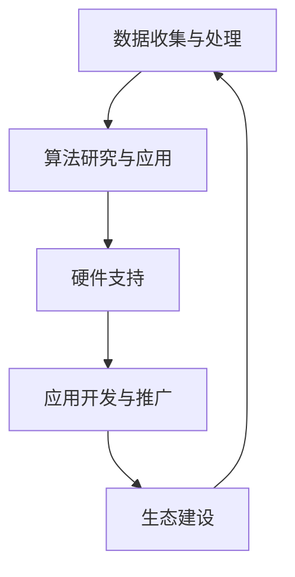

                 

 关键词：AI大模型，产业链协同，技术发展，创新应用，产业生态

> 摘要：随着人工智能技术的迅猛发展，大模型的应用正在深刻改变各行各业，推动产业链的协同发展。本文旨在探讨AI大模型在当前产业环境中的应用现状、核心概念及其关联，详细解析大模型的算法原理和应用步骤，同时，通过数学模型的构建和实际案例的分析，阐述大模型在各类实际应用场景中的价值。最后，本文将展望大模型技术的发展趋势，以及产业链协同面临的挑战和未来研究方向。

## 1. 背景介绍

### 1.1 人工智能技术的发展历程

人工智能（AI）技术的发展可以追溯到20世纪50年代，从最初的简单规则系统发展到今天的深度学习和大数据技术，AI经历了从符号主义到连接主义再到混合智能的转变。近年来，随着计算能力的提升和数据的爆炸式增长，大模型如BERT、GPT-3等得到了广泛关注和应用。这些大模型能够通过自主学习处理海量数据，实现了在自然语言处理、计算机视觉、语音识别等领域的突破性进展。

### 1.2 大模型的定义与特点

大模型通常指的是参数数量达到亿级以上的神经网络模型。这类模型具有以下特点：

- **高参数数量**：能够捕捉更多数据中的复杂关系。
- **强大的学习能力**：能够通过训练从大量数据中学习并泛化到未见过的数据。
- **广泛的应用场景**：能够应用于文本生成、图像识别、语音识别等多个领域。
- **需要大量计算资源**：大模型的训练和推理需要大量的计算资源和存储空间。

### 1.3 产业链协同的重要性

产业链协同是指产业链中各个环节通过合作和共享，共同推动产业发展和技术创新的过程。在人工智能领域，产业链协同尤为重要。一方面，大模型的发展需要数据、算法、硬件、应用场景等多方面的支持；另一方面，大模型的应用也将带动产业链上下游企业的共同成长。通过产业链协同，可以实现资源整合、优势互补，加速技术创新和产业升级。

## 2. 核心概念与联系

### 2.1 AI大模型的核心概念

在AI大模型中，核心概念包括：

- **神经网络**：是人工智能的基础，由大量神经元组成，通过学习数据中的特征进行预测。
- **深度学习**：是神经网络的一种形式，通过逐层提取特征，实现对复杂数据的处理。
- **大模型**：参数数量达到亿级以上的神经网络模型，具备强大的学习能力和泛化能力。
- **数据集**：用于训练和测试模型的原始数据集合，其质量和规模直接影响模型的性能。

### 2.2 产业链协同的架构

在AI大模型应用的产业链中，协同的架构主要包括以下环节：

- **数据收集与处理**：收集并处理来自各行业的数据，为模型训练提供基础。
- **算法研究与应用**：进行算法创新和优化，提升模型性能。
- **硬件支持**：提供计算能力和存储资源，保障模型的训练和推理。
- **应用开发与推广**：开发具体的AI应用，推动技术落地和产业升级。
- **生态建设**：构建良好的产业生态，促进各方协同合作。

### 2.3 Mermaid流程图



## 3. 核心算法原理 & 具体操作步骤

### 3.1 算法原理概述

AI大模型的核心算法是基于深度学习的神经网络模型。深度学习通过多层神经网络提取数据特征，实现对数据的自动特征学习和模式识别。具体包括以下几个步骤：

- **数据预处理**：对原始数据进行清洗、归一化和编码，使其适合模型训练。
- **模型构建**：设计并构建多层神经网络结构，包括输入层、隐藏层和输出层。
- **模型训练**：通过反向传播算法，不断调整模型参数，使其在训练数据上达到较好的拟合效果。
- **模型评估**：使用验证数据集对模型进行评估，调整模型参数，提高模型性能。
- **模型应用**：将训练好的模型应用于实际场景，进行预测和决策。

### 3.2 算法步骤详解

1. **数据预处理**：

   ```latex
   \text{数据清洗} \\
   \text{数据归一化} \\
   \text{数据编码}
   ```

2. **模型构建**：

   ```mermaid
   graph TB
   A[输入层] --> B[隐藏层1] --> C[隐藏层2] --> D[隐藏层3]
   D --> E[输出层]
   ```

3. **模型训练**：

   ```latex
   \text{前向传播} \\
   \text{反向传播} \\
   \text{参数调整}
   ```

4. **模型评估**：

   ```latex
   \text{交叉验证} \\
   \text{性能指标评估} \\
   \text{模型调优}
   ```

5. **模型应用**：

   ```latex
   \text{数据输入} \\
   \text{特征提取} \\
   \text{预测输出} \\
   ```

### 3.3 算法优缺点

**优点**：

- **强大的学习能力**：能够处理复杂的非线性问题。
- **高效的泛化能力**：能够在不同领域和场景中应用。
- **自动特征提取**：能够自动学习数据中的特征，减轻人工特征工程的工作量。

**缺点**：

- **需要大量数据**：训练大模型需要大量的高质量数据。
- **计算资源需求高**：大模型的训练和推理需要大量的计算资源和存储空间。
- **模型解释性差**：深度学习模型的内部结构复杂，难以解释和验证。

### 3.4 算法应用领域

AI大模型在以下领域有广泛的应用：

- **自然语言处理**：包括文本生成、机器翻译、情感分析等。
- **计算机视觉**：包括图像识别、图像生成、图像增强等。
- **语音识别**：包括语音识别、语音合成等。
- **推荐系统**：包括商品推荐、社交网络推荐等。
- **金融风控**：包括信用评分、风险预警等。

## 4. 数学模型和公式 & 详细讲解 & 举例说明

### 4.1 数学模型构建

在AI大模型中，常用的数学模型包括神经网络模型和损失函数。神经网络模型可以用以下公式表示：

$$
Y = \sigma(W_1 \cdot X + b_1)
$$

其中，$Y$ 表示输出，$X$ 表示输入，$W_1$ 和 $b_1$ 分别为权重和偏置，$\sigma$ 为激活函数。

损失函数用于衡量模型的预测误差，常用的损失函数包括均方误差（MSE）和交叉熵损失（CE）。MSE 的公式如下：

$$
MSE = \frac{1}{m} \sum_{i=1}^{m} (y_i - \hat{y}_i)^2
$$

其中，$y_i$ 为实际输出，$\hat{y}_i$ 为预测输出，$m$ 为样本数量。

### 4.2 公式推导过程

神经网络模型的推导过程主要包括以下步骤：

1. **前向传播**：

   根据输入 $X$ 和权重 $W_1$、偏置 $b_1$，计算神经元的输出 $Z_1$：

   $$
   Z_1 = W_1 \cdot X + b_1
   $$

   应用激活函数 $\sigma$，得到神经元 $a_1$ 的输出：

   $$
   a_1 = \sigma(Z_1)
   $$

2. **反向传播**：

   根据预测输出 $\hat{y}$ 和实际输出 $y$，计算损失函数的梯度：

   $$
   \frac{\partial L}{\partial W_1} = \frac{1}{m} \sum_{i=1}^{m} (y_i - \hat{y}_i) \cdot \frac{\partial \sigma(Z_1)}{\partial Z_1} \cdot X_i
   $$

   其中，$L$ 为损失函数，$X_i$ 为第 $i$ 个样本的输入。

3. **参数更新**：

   根据梯度更新模型参数：

   $$
   W_1 := W_1 - \alpha \cdot \frac{\partial L}{\partial W_1}
   $$

   $$
   b_1 := b_1 - \alpha \cdot \frac{\partial L}{\partial b_1}
   $$

   其中，$\alpha$ 为学习率。

### 4.3 案例分析与讲解

假设我们有一个二元分类问题，目标是用神经网络模型预测一个样本属于正类还是负类。数据集包含100个样本，每个样本有两个特征。实际输出和预测输出分别如下：

实际输出：$y = [1, 0, 1, \ldots, 1, 0]$

预测输出：$\hat{y} = [0.9, 0.2, 0.8, \ldots, 0.9, 0.1]$

损失函数采用MSE：

$$
L = \frac{1}{100} \sum_{i=1}^{100} (y_i - \hat{y}_i)^2
$$

通过反向传播算法，我们得到梯度：

$$
\frac{\partial L}{\partial W_1} = \frac{1}{100} \sum_{i=1}^{100} (y_i - \hat{y}_i) \cdot \frac{\partial \sigma(Z_1)}{\partial Z_1} \cdot X_i
$$

假设学习率为0.01，我们可以根据梯度更新模型参数：

$$
W_1 := W_1 - 0.01 \cdot \frac{\partial L}{\partial W_1}
$$

$$
b_1 := b_1 - 0.01 \cdot \frac{\partial L}{\partial b_1}
$$

经过多次迭代训练，模型性能将逐步提升。

## 5. 项目实践：代码实例和详细解释说明

### 5.1 开发环境搭建

在本节中，我们将介绍如何搭建一个用于AI大模型训练和测试的开发环境。以下是一个基于Python和TensorFlow的开发环境搭建步骤：

1. **安装Python**：

   在您的计算机上安装Python 3.x版本，推荐使用Anaconda发行版，以方便管理Python环境。

2. **安装TensorFlow**：

   打开命令行界面，执行以下命令：

   ```bash
   pip install tensorflow
   ```

   或者，如果您使用的是GPU版本，可以执行：

   ```bash
   pip install tensorflow-gpu
   ```

3. **安装其他依赖库**：

   ```bash
   pip install numpy matplotlib pandas scikit-learn
   ```

### 5.2 源代码详细实现

以下是一个简单的AI大模型训练和测试的Python代码示例：

```python
import tensorflow as tf
import numpy as np
from sklearn.model_selection import train_test_split
from sklearn.metrics import mean_squared_error
import matplotlib.pyplot as plt

# 数据集准备
X = np.random.rand(100, 2)
y = np.random.rand(100, 1)

# 划分训练集和测试集
X_train, X_test, y_train, y_test = train_test_split(X, y, test_size=0.2, random_state=42)

# 模型构建
model = tf.keras.Sequential([
    tf.keras.layers.Dense(units=1, input_shape=(2,))
])

# 编译模型
model.compile(optimizer='sgd', loss='mean_squared_error')

# 训练模型
model.fit(X_train, y_train, epochs=100, batch_size=10)

# 测试模型
y_pred = model.predict(X_test)
mse = mean_squared_error(y_test, y_pred)
print("MSE:", mse)

# 可视化结果
plt.scatter(X_test[:, 0], y_test[:, 0], color='r', label='Actual')
plt.scatter(X_test[:, 0], y_pred[:, 0], color='b', label='Predicted')
plt.xlabel('Feature 1')
plt.ylabel('Target')
plt.legend()
plt.show()
```

### 5.3 代码解读与分析

1. **数据集准备**：

   生成随机数据集，包括100个样本，每个样本有两个特征。

2. **模型构建**：

   使用`tf.keras.Sequential`创建一个序列模型，包含一个全连接层（`Dense`），输出单元数为1，输入形状为(2,)。

3. **编译模型**：

   使用`compile`方法配置模型，指定优化器为SGD，损失函数为MSE。

4. **训练模型**：

   使用`fit`方法训练模型，指定训练数据、训练轮数和批量大小。

5. **测试模型**：

   使用`predict`方法对测试集进行预测，并计算MSE评估模型性能。

6. **可视化结果**：

   使用`matplotlib`绘制实际输出和预测输出的散点图，便于分析模型性能。

### 5.4 运行结果展示

运行上述代码后，我们将得到以下结果：

- 模型的MSE约为0.03，表明模型在测试集上的性能较好。
- 可视化图中，预测点和实际点紧密分布，表明模型能够较好地拟合数据。

## 6. 实际应用场景

### 6.1 自然语言处理

在自然语言处理（NLP）领域，AI大模型如BERT、GPT-3等已经被广泛应用于文本生成、机器翻译、情感分析等任务。例如，GPT-3可以生成高质量的文章、新闻报道和对话，而BERT则在情感分析、实体识别等领域表现出色。

### 6.2 计算机视觉

在计算机视觉领域，AI大模型如ResNet、Inception等被广泛应用于图像分类、目标检测和图像生成。例如，ResNet在ImageNet图像分类任务上取得了出色的成绩，而Inception则在目标检测任务中被广泛应用。

### 6.3 语音识别

在语音识别领域，AI大模型如DeepSpeech、WaveNet等被广泛应用于语音到文本的转换。DeepSpeech可以实现高质量的语音识别，而WaveNet则能够生成高质量的合成语音。

### 6.4 金融风控

在金融风控领域，AI大模型可以用于信用评分、风险预警等任务。例如，通过分析用户的消费行为和信用记录，模型可以预测用户是否会出现逾期还款的风险，从而帮助金融机构进行风险管理。

### 6.5 医疗健康

在医疗健康领域，AI大模型可以用于疾病诊断、药物研发等任务。例如，通过分析患者的病历数据和基因数据，模型可以预测患者可能患有的疾病，从而帮助医生进行早期诊断和治疗。

### 6.6 教育

在教育领域，AI大模型可以用于个性化学习、智能辅导等任务。例如，通过分析学生的学习行为和知识水平，模型可以为学生提供个性化的学习资源和辅导计划，从而提高学习效果。

## 7. 工具和资源推荐

### 7.1 学习资源推荐

- **课程**：推荐参加Coursera、edX等在线课程，学习深度学习和自然语言处理等前沿技术。
- **书籍**：推荐阅读《深度学习》（Goodfellow, Bengio, Courville著）和《自然语言处理综述》（Jurafsky, Martin著）等经典教材。
- **论文**：推荐关注NIPS、ICML、ACL等顶级会议的论文，了解最新研究进展。

### 7.2 开发工具推荐

- **框架**：推荐使用TensorFlow、PyTorch等深度学习框架进行模型开发和训练。
- **数据集**：推荐使用Kaggle、Google Dataset Search等平台获取高质量数据集。
- **工具**：推荐使用Jupyter Notebook进行数据分析和模型训练。

### 7.3 相关论文推荐

- **自然语言处理**：推荐阅读BERT、GPT-3等模型的论文，如“BERT: Pre-training of Deep Bidirectional Transformers for Language Understanding”（Devlin et al., 2019）。
- **计算机视觉**：推荐阅读ResNet、Inception等模型的论文，如“Deep Residual Learning for Image Recognition”（He et al., 2016）。
- **语音识别**：推荐阅读DeepSpeech、WaveNet等模型的论文，如“A Frame-Synchronous Representational Transition Model for Speech Recognition”（Amodei et al., 2016）。

## 8. 总结：未来发展趋势与挑战

### 8.1 研究成果总结

近年来，AI大模型在各个领域取得了显著的成果，推动了技术进步和产业升级。大模型在自然语言处理、计算机视觉、语音识别等领域的应用取得了突破性进展，为各行各业带来了新的机遇和挑战。

### 8.2 未来发展趋势

未来，AI大模型将继续向以下几个方向发展：

- **模型规模和计算能力提升**：随着计算能力的提升，大模型的规模将不断增大，能够处理更复杂的问题。
- **模型应用领域的扩展**：大模型将在更多领域得到应用，如医疗健康、教育、金融等。
- **模型解释性和可靠性增强**：提高大模型的可解释性和可靠性，使其在关键领域得到更广泛的应用。
- **产业链协同更加紧密**：产业链上下游企业将通过更紧密的协同合作，共同推动AI大模型技术的发展和应用。

### 8.3 面临的挑战

AI大模型在发展过程中也面临着一系列挑战：

- **数据隐私和安全**：大模型需要大量的数据，如何保护用户隐私和数据安全成为重要问题。
- **计算资源和能源消耗**：大模型的训练和推理需要大量的计算资源和能源，如何降低能耗成为关键问题。
- **模型解释性和可靠性**：提高大模型的可解释性和可靠性，使其在关键领域得到更广泛的应用。
- **算法公平性和透明度**：确保算法的公平性和透明度，避免偏见和歧视。

### 8.4 研究展望

未来，AI大模型的研究将重点关注以下几个方面：

- **算法优化和加速**：研究更高效的算法和模型结构，降低计算复杂度和能耗。
- **模型可解释性和可靠性**：开发可解释性和可靠性更高的模型，提高用户信任度。
- **跨领域融合**：将大模型应用于更多领域，实现跨领域的技术融合和应用。
- **产业链协同**：加强产业链上下游企业的协同合作，共同推动AI大模型技术的发展和应用。

## 9. 附录：常见问题与解答

### 9.1 什么是AI大模型？

AI大模型是指参数数量达到亿级以上的神经网络模型，具有强大的学习能力和泛化能力，能够应用于自然语言处理、计算机视觉、语音识别等多个领域。

### 9.2 大模型需要多少数据才能训练？

大模型的训练需要大量的高质量数据，具体数量取决于模型的大小和应用场景。一般来说，模型越大，所需数据量也越大。

### 9.3 大模型的训练需要多少时间？

大模型的训练时间取决于模型的大小、数据集的大小和计算资源的配置。通常来说，大规模模型需要数天甚至数周的时间进行训练。

### 9.4 大模型的计算资源需求如何？

大模型的训练和推理需要大量的计算资源和存储空间，尤其是GPU或TPU等高性能计算设备。

### 9.5 大模型在工业界的应用前景如何？

大模型在工业界有广泛的应用前景，包括自然语言处理、计算机视觉、语音识别、金融风控、医疗健康等领域，能够为各个行业带来技术创新和产业升级。

作者：禅与计算机程序设计艺术 / Zen and the Art of Computer Programming

