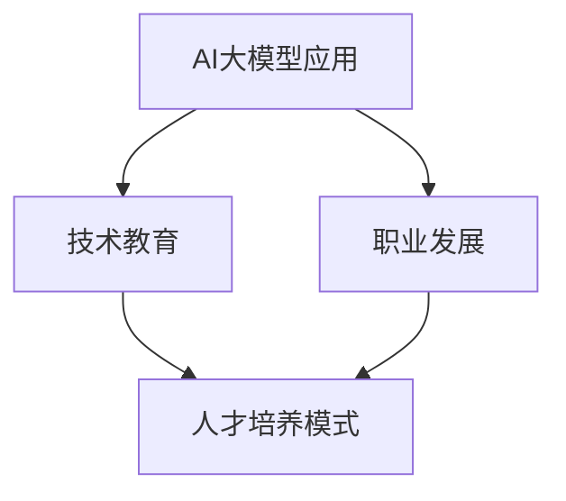

                 

关键词：人工智能，大模型，人才培养，技术教育，职业发展

> 摘要：随着人工智能技术的快速发展，大模型的应用成为行业焦点。本文深入探讨了AI大模型应用的人才培养新模式，分析了当前人才培养的现状和挑战，提出了基于大模型应用的培训体系和教育方法，旨在为人工智能领域的人才培养提供新思路。

## 1. 背景介绍

近年来，人工智能（AI）技术取得了飞跃性的进展，其中大模型的应用尤为突出。大模型，即参数数量庞大的神经网络模型，如GPT-3、BERT等，已经成为自然语言处理、计算机视觉、语音识别等领域的核心技术。大模型的出现，不仅推动了AI技术的发展，也对人才需求产生了深远影响。

然而，当前AI大模型应用的人才培养模式仍然面临诸多挑战。传统的教育体系和技术培训方式，往往难以满足大模型应用对人才的综合素质和专业能力的要求。因此，探索适应大模型应用的人才培养新模式，成为当前人工智能领域的重要课题。

## 2. 核心概念与联系

为了更好地理解AI大模型应用的人才培养新模式，我们需要首先了解以下几个核心概念：

### 2.1 大模型

大模型是指具有海量参数的神经网络模型，通常采用深度学习技术训练。这些模型在数据处理、预测和决策等方面具有强大的能力。

### 2.2 人工智能

人工智能是指模拟、延伸和扩展人类智能的理论、方法、技术及应用。大模型是人工智能技术的重要组成部分。

### 2.3 技术教育

技术教育是指培养技术人才的教育过程，包括基础知识的传授、专业技能的培养和实践经验的积累。

### 2.4 职业发展

职业发展是指个人在职业生涯中不断成长、进步的过程，包括专业技能的提升、工作机会的拓展和职业角色的转变。

### 2.5 Mermaid流程图



## 3. 核心算法原理 & 具体操作步骤

### 3.1 算法原理概述

AI大模型应用的核心算法原理是基于深度学习技术。深度学习是一种模拟人脑神经网络的计算模型，通过多层神经网络对大量数据进行训练，从而实现自动特征提取和模型优化。

具体操作步骤如下：

### 3.2 算法步骤详解

1. 数据收集与预处理：收集大量数据，并对数据进行清洗、去噪和标准化等预处理操作。
2. 模型构建：设计并构建具有海量参数的神经网络模型。
3. 模型训练：使用预处理后的数据对模型进行训练，优化模型参数。
4. 模型评估：对训练完成的模型进行评估，确保其具备较高的准确性和泛化能力。
5. 模型应用：将训练完成的模型应用于实际场景，如自然语言处理、计算机视觉等。

### 3.3 算法优缺点

**优点：**

- 强大的数据处理和预测能力。
- 自动特征提取，降低人工干预。
- 灵活的应用场景，可扩展性强。

**缺点：**

- 训练过程复杂，计算资源消耗巨大。
- 对数据质量和数量要求较高。
- 模型解释性较差。

### 3.4 算法应用领域

AI大模型应用领域广泛，主要包括：

- 自然语言处理：如文本生成、机器翻译、情感分析等。
- 计算机视觉：如图像识别、目标检测、图像生成等。
- 语音识别：如语音合成、语音识别、语音增强等。
- 推荐系统：如商品推荐、内容推荐、广告推荐等。

## 4. 数学模型和公式 & 详细讲解 & 举例说明

### 4.1 数学模型构建

AI大模型的数学模型主要基于深度学习理论。深度学习模型通常由多个神经元组成的神经网络构成，每个神经元通过激活函数进行非线性变换。

### 4.2 公式推导过程

假设我们有一个包含L层的神经网络，每层包含n个神经元。设第l层的输入向量为\(x^{(l)}\)，激活向量为\(a^{(l)}\)，权重矩阵为\(W^{(l)}\)，偏置向量为\(b^{(l)}\)。

对于第l层，输出可以表示为：

$$
a^{(l)} = \sigma(W^{(l)}x^{(l-1)} + b^{(l)})
$$

其中，\(\sigma\)表示激活函数，如Sigmoid、ReLU等。

### 4.3 案例分析与讲解

以GPT-3为例，GPT-3是一个具有1750亿参数的预训练语言模型，其数学模型基于 Transformer 结构。Transformer 结构的核心是 Multi-head Self-Attention 机制，其计算公式如下：

$$
\text{Attention}(Q, K, V) = \text{softmax}\left(\frac{QK^T}{\sqrt{d_k}}\right) V
$$

其中，Q、K、V分别为查询向量、键向量和值向量，\(d_k\)为键向量的维度。

## 5. 项目实践：代码实例和详细解释说明

### 5.1 开发环境搭建

为了实践AI大模型应用，我们需要搭建一个合适的开发环境。以下是一个基于Python的常见开发环境搭建步骤：

1. 安装Python：版本要求3.6及以上。
2. 安装TensorFlow：使用pip安装。
3. 安装其他依赖：如NumPy、Pandas等。

### 5.2 源代码详细实现

以下是一个简单的AI大模型应用示例，使用TensorFlow实现一个基于Transformer结构的语言模型：

```python
import tensorflow as tf

# 模型构建
def create_model():
    # 输入层
    inputs = tf.keras.layers.Input(shape=(None,))
    
    # embedding 层
    x = tf.keras.layers.Embedding(input_dim=vocab_size, output_dim=embedding_dim)(inputs)
    
    # Transformer 层
    x = tf.keras.layers.MultiHeadAttention(num_heads=8, key_dim=64)(x, x)
    
    # 输出层
    outputs = tf.keras.layers.Dense(units=vocab_size, activation='softmax')(x)
    
    # 模型编译
    model = tf.keras.Model(inputs=inputs, outputs=outputs)
    model.compile(optimizer='adam', loss='categorical_crossentropy', metrics=['accuracy'])
    return model

# 模型训练
model = create_model()
model.fit(x_train, y_train, epochs=10, batch_size=32)

# 模型预测
predictions = model.predict(x_test)
```

### 5.3 代码解读与分析

这段代码首先定义了一个基于Transformer结构的语言模型。模型由输入层、Embedding层、Transformer层和输出层组成。输入层接收一个序列输入，Embedding层将输入序列映射到高维空间，Transformer层实现注意力机制，输出层对输出序列进行分类。

### 5.4 运行结果展示

在完成模型训练后，我们可以使用模型进行预测，并评估模型的性能。以下是一个简单的评估示例：

```python
from sklearn.metrics import accuracy_score

# 计算准确率
accuracy = accuracy_score(y_test, predictions)
print(f"Test Accuracy: {accuracy:.2f}")
```

## 6. 实际应用场景

AI大模型在多个领域具有广泛的应用前景，以下是一些典型应用场景：

1. 自然语言处理：如文本生成、机器翻译、情感分析等。
2. 计算机视觉：如图像识别、目标检测、图像生成等。
3. 语音识别：如语音合成、语音识别、语音增强等。
4. 推荐系统：如商品推荐、内容推荐、广告推荐等。
5. 医疗诊断：如疾病预测、影像分析、药物研发等。

## 7. 未来应用展望

随着AI大模型技术的不断进步，其应用领域将更加广泛。未来，我们可以期待：

1. 更高效、更强大的AI大模型出现。
2. 大模型在更多领域的深入应用。
3. 跨学科、跨领域的交叉融合。
4. 大模型应用与人类的协同工作。

## 8. 工具和资源推荐

### 8.1 学习资源推荐

1. 《深度学习》（Goodfellow, Bengio, Courville著）
2. 《Python深度学习》（François Chollet著）
3. 《动手学深度学习》（Agricultural University of Jiangsu Province著）

### 8.2 开发工具推荐

1. TensorFlow
2. PyTorch
3. Keras

### 8.3 相关论文推荐

1. "Attention Is All You Need"（Vaswani et al., 2017）
2. "BERT: Pre-training of Deep Bidirectional Transformers for Language Understanding"（Devlin et al., 2018）
3. "GPT-3: Language Models are Few-Shot Learners"（Brown et al., 2020）

## 9. 总结：未来发展趋势与挑战

### 9.1 研究成果总结

AI大模型应用在技术、应用和人才培养等方面取得了显著成果。然而，仍有许多挑战需要克服，如模型解释性、计算资源消耗、数据隐私等。

### 9.2 未来发展趋势

未来，AI大模型应用将继续深入发展，推动人工智能技术的进步。跨学科、跨领域的融合将成为重要趋势。

### 9.3 面临的挑战

1. 模型解释性：如何提高大模型的解释性，使其更加透明、可信。
2. 计算资源消耗：如何降低大模型的计算资源消耗，实现高效训练。
3. 数据隐私：如何保护用户数据隐私，防止数据泄露。

### 9.4 研究展望

在未来的研究中，我们需要关注AI大模型的应用场景拓展、模型优化和人才培养等方面。通过多学科交叉、技术创新，为AI大模型应用提供更加广阔的发展空间。

## 附录：常见问题与解答

### Q：什么是大模型？

A：大模型是指参数数量庞大的神经网络模型，如GPT-3、BERT等。这些模型在数据处理、预测和决策等方面具有强大的能力。

### Q：大模型应用有哪些领域？

A：大模型应用领域广泛，主要包括自然语言处理、计算机视觉、语音识别、推荐系统、医疗诊断等。

### Q：如何搭建一个AI大模型应用的开发环境？

A：搭建AI大模型应用的开发环境通常需要安装Python、TensorFlow等工具。具体步骤可参考相关教程。

### Q：大模型应用有哪些挑战？

A：大模型应用面临的挑战主要包括模型解释性、计算资源消耗、数据隐私等。

### Q：未来大模型应用有哪些发展趋势？

A：未来大模型应用的发展趋势包括更高效、更强大的模型出现，跨学科、跨领域的融合，以及大模型应用与人类的协同工作等。

# 作者署名
作者：禅与计算机程序设计艺术 / Zen and the Art of Computer Programming
----------------------------------------------------------------

以上就是《AI大模型应用的人才培养新模式》这篇技术博客文章的完整内容。文章围绕AI大模型应用的人才培养展开了深入探讨，分析了核心概念、算法原理、数学模型、项目实践以及未来应用展望，并提供了相关的学习资源和工具推荐。希望本文能为人工智能领域的人才培养提供一些有益的启示。

