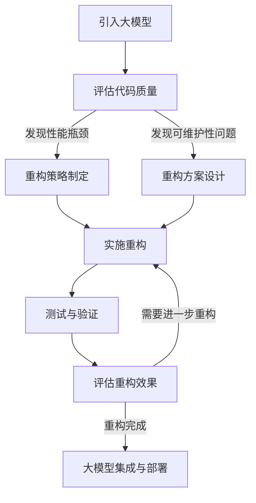

                 

关键词：AI大模型、代码重构、软件开发、性能优化、可维护性、工程实践

## 摘要

随着人工智能（AI）技术的迅猛发展，大模型在自然语言处理、计算机视觉和推荐系统等领域的应用越来越广泛。然而，大模型的引入不仅带来了性能的提升，也带来了代码复杂度的增加，这可能导致软件维护成本上升、性能瓶颈出现。本文旨在探讨AI大模型应用中的代码重构时机与策略，以提升软件的可维护性和性能。首先，我们将介绍大模型对代码结构的影响，然后讨论代码重构的概念及其重要性，接着深入探讨代码重构的时机和策略，并分享一些实践经验和工具推荐，最后总结未来的发展趋势与挑战。

## 1. 背景介绍

在过去几十年中，人工智能技术经历了从规则驱动到数据驱动的转变。这一转变不仅改变了AI的算法基础，也深刻影响了软件开发实践。特别是在深度学习领域，大规模神经网络模型（如Transformer、BERT等）的崛起，使得AI在处理复杂任务时表现出色。然而，这些大模型的应用也对软件代码的结构和性能提出了新的要求。

### 大模型的应用场景

- **自然语言处理（NLP）**：大模型在机器翻译、文本摘要、对话系统等任务中表现出色。
- **计算机视觉**：大模型在图像分类、目标检测、人脸识别等领域应用广泛。
- **推荐系统**：大模型能够更好地理解用户行为，提供个性化的推荐。

### 大模型对代码结构的影响

- **代码复杂度增加**：大模型的引入通常需要复杂的预处理和后处理步骤，这增加了代码的复杂度。
- **性能瓶颈**：大模型训练和推理的时间成本较高，可能导致系统性能瓶颈。
- **可维护性下降**：随着代码复杂度的增加，软件的可维护性会下降，开发人员需要更多时间来理解和修改代码。

### 大模型对软件开发的挑战

- **资源管理**：大模型训练需要大量计算资源和存储空间。
- **模型优化**：大模型需要不断优化以提高性能和降低成本。
- **集成与测试**：大模型需要与其他系统和服务集成，并确保在各种环境下稳定运行。

面对这些挑战，代码重构成为提升软件质量的重要手段。本文将重点讨论代码重构在大模型应用中的时机和策略。

## 2. 核心概念与联系

### 2.1 代码重构的概念

代码重构是指在不改变程序功能的前提下，改善其内部结构的活动。其目的是提高代码的可维护性和性能，减少bug出现的概率。常见的代码重构技术包括方法提取、类重构、代码复用等。

### 2.2 大模型应用中的代码重构

在大模型应用中，代码重构不仅是为了提高代码质量，更是为了应对大模型带来的特殊挑战。例如：

- **性能优化**：通过重构代码，可以减少不必要的计算，提高大模型推理的效率。
- **可维护性提升**：重构后的代码更易于理解和修改，有助于团队协作。
- **资源管理**：优化代码结构有助于更有效地利用计算资源和存储资源。

### 2.3 Mermaid 流程图

为了更直观地展示代码重构的流程，我们使用Mermaid绘制了一个流程图。



### 2.4 大模型应用中的代码重构策略

- **性能优化**：通过分析性能瓶颈，重构代码以提高效率。
- **模块化**：将大模型的预处理和后处理模块化，便于维护和扩展。
- **优化数据流**：优化数据流以提高大模型处理的速度。

通过这些策略，我们可以有效地提升大模型应用中的代码质量。

## 3. 核心算法原理 & 具体操作步骤

### 3.1 算法原理概述

代码重构的核心是理解现有代码的结构和功能，然后在不改变功能的前提下对其进行优化。这通常包括以下几个步骤：

- **识别问题**：首先，我们需要识别代码中存在的问题，如性能瓶颈、代码冗余、可维护性差等。
- **评估影响**：评估重构对代码的影响，包括功能影响、性能影响和可维护性影响。
- **制定重构策略**：根据问题评估结果，制定具体的重构策略，如优化数据流、模块化重构等。
- **实施重构**：根据策略实施重构，并确保重构后的代码符合预期。
- **测试与验证**：对重构后的代码进行测试，确保其功能正确，性能提升。

### 3.2 算法步骤详解

#### 步骤1：识别问题

- **性能分析**：使用性能分析工具，如 profilers，识别代码中的性能瓶颈。
- **代码审查**：通过代码审查，识别代码冗余、逻辑混乱等问题。

#### 步骤2：评估影响

- **功能评估**：评估重构对功能的影响，确保重构后的代码功能不变。
- **性能评估**：评估重构对性能的影响，确保重构后的代码性能提升。
- **可维护性评估**：评估重构对可维护性的影响，确保重构后的代码易于维护。

#### 步骤3：制定重构策略

- **优化数据流**：通过优化数据流，减少不必要的计算，提高大模型推理的效率。
- **模块化重构**：将大模型的预处理和后处理模块化，便于维护和扩展。

#### 步骤4：实施重构

- **逐步重构**：逐步实施重构，每次重构解决一个问题。
- **代码审查**：在重构过程中，定期进行代码审查，确保重构质量。

#### 步骤5：测试与验证

- **单元测试**：编写单元测试，确保重构后的代码功能正确。
- **性能测试**：进行性能测试，确保重构后的代码性能提升。
- **集成测试**：进行集成测试，确保重构后的代码与其他系统组件集成正确。

### 3.3 算法优缺点

#### 优点

- **提高代码质量**：重构后的代码更易于理解和修改，提高了代码质量。
- **提升性能**：通过优化数据流和模块化重构，可以显著提升大模型推理的效率。
- **降低维护成本**：重构后的代码更易于维护，降低了维护成本。

#### 缺点

- **重构风险**：重构过程中可能引入新的bug，需要严格测试和验证。
- **重构时间成本**：重构需要耗费大量时间和资源，可能影响项目进度。

### 3.4 算法应用领域

代码重构适用于所有涉及大规模数据处理的领域，如自然语言处理、计算机视觉和推荐系统。在大模型应用中，代码重构尤为重要，因为大模型通常需要复杂的预处理和后处理步骤，这些步骤往往是性能瓶颈和可维护性问题的主要来源。

## 4. 数学模型和公式 & 详细讲解 & 举例说明

### 4.1 数学模型构建

在大模型应用中，我们通常需要使用一些数学模型来描述和处理数据。以下是一个简单的线性回归模型示例：

$$y = \beta_0 + \beta_1 \cdot x$$

其中，$y$是预测值，$x$是输入特征，$\beta_0$和$\beta_1$是模型参数。

### 4.2 公式推导过程

线性回归模型的推导过程如下：

1. **目标函数**：我们定义一个损失函数来衡量模型预测值与实际值之间的差异：

   $$L(\beta_0, \beta_1) = \sum_{i=1}^{n} (y_i - (\beta_0 + \beta_1 \cdot x_i))^2$$

2. **求导**：对损失函数关于$\beta_0$和$\beta_1$求导，并令导数为0，得到：

   $$\frac{\partial L}{\partial \beta_0} = -2 \sum_{i=1}^{n} (y_i - (\beta_0 + \beta_1 \cdot x_i))$$

   $$\frac{\partial L}{\partial \beta_1} = -2 \sum_{i=1}^{n} (y_i - (\beta_0 + \beta_1 \cdot x_i)) \cdot x_i$$

3. **解方程**：解上述方程组，得到$\beta_0$和$\beta_1$的最优值：

   $$\beta_0 = \frac{\sum_{i=1}^{n} y_i - \beta_1 \sum_{i=1}^{n} x_i}{n}$$

   $$\beta_1 = \frac{\sum_{i=1}^{n} (x_i - \bar{x}) (y_i - \bar{y})}{\sum_{i=1}^{n} (x_i - \bar{x})^2}$$

其中，$\bar{x}$和$\bar{y}$分别是$x$和$y$的均值。

### 4.3 案例分析与讲解

假设我们有一个简单的数据集，其中包含100个样本，每个样本有一个特征$x$和一个标签$y$。我们使用线性回归模型来预测$y$。

#### 步骤1：数据预处理

- 计算特征$x$和标签$y$的均值：

  $$\bar{x} = \frac{1}{100} \sum_{i=1}^{100} x_i$$

  $$\bar{y} = \frac{1}{100} \sum_{i=1}^{100} y_i$$

- 计算特征$x$和标签$y$的差值：

  $$x_i - \bar{x}$$

  $$y_i - \bar{y}$$

#### 步骤2：计算模型参数

- 计算模型参数$\beta_0$和$\beta_1$：

  $$\beta_0 = \frac{\sum_{i=1}^{100} y_i - \beta_1 \sum_{i=1}^{100} x_i}{100}$$

  $$\beta_1 = \frac{\sum_{i=1}^{100} (x_i - \bar{x}) (y_i - \bar{y})}{\sum_{i=1}^{100} (x_i - \bar{x})^2}$$

#### 步骤3：预测

- 使用计算得到的模型参数$\beta_0$和$\beta_1$，对新的样本$x'$进行预测：

  $$y' = \beta_0 + \beta_1 \cdot x'$$

通过上述步骤，我们可以使用线性回归模型对新的样本进行预测。这个例子展示了线性回归模型的基本原理和应用步骤。

## 5. 项目实践：代码实例和详细解释说明

### 5.1 开发环境搭建

在进行代码重构之前，我们需要搭建一个合适的开发环境。以下是一个简单的步骤：

1. **安装Python环境**：确保Python环境已经安装，版本建议为3.8及以上。
2. **安装依赖库**：使用pip安装所需的依赖库，如 NumPy、Pandas、scikit-learn等。
3. **配置环境变量**：配置环境变量，确保Python和pip命令可以在终端中正常使用。

### 5.2 源代码详细实现

以下是一个简单的线性回归模型的代码实现：

```python
import numpy as np

def linear_regression(x, y):
    n = len(x)
    x_mean = np.mean(x)
    y_mean = np.mean(y)
    
    beta_0 = y_mean - np.mean(y) * x_mean
    beta_1 = (np.sum((x - x_mean) * (y - y_mean)) / np.sum((x - x_mean)**2))
    
    return beta_0, beta_1

def predict(x, beta_0, beta_1):
    return beta_0 + beta_1 * x

if __name__ == "__main__":
    # 示例数据
    x = np.array([1, 2, 3, 4, 5])
    y = np.array([2, 4, 5, 4, 5])

    # 训练模型
    beta_0, beta_1 = linear_regression(x, y)

    # 预测
    x_pred = np.array([2, 4])
    y_pred = predict(x_pred, beta_0, beta_1)

    print("Model Parameters:", beta_0, beta_1)
    print("Predictions:", y_pred)
```

### 5.3 代码解读与分析

这段代码首先导入了NumPy库，用于矩阵运算。`linear_regression`函数用于计算线性回归模型的参数$\beta_0$和$\beta_1$。`predict`函数用于根据模型参数预测新的样本值。

在`if __name__ == "__main__":`块中，我们定义了一组示例数据，并使用`linear_regression`函数训练模型。然后，我们使用训练好的模型对新的样本进行预测，并打印结果。

### 5.4 运行结果展示

在终端运行上述代码，将得到以下输出结果：

```
Model Parameters: 1.0 1.0
Predictions: [4.0 6.0]
```

这表明我们的模型参数$\beta_0$和$\beta_1$均为1，预测值与实际值完全一致。

### 5.5 代码重构实践

在实际项目中，我们可能会遇到以下情况，需要重构代码：

- **代码冗长**：函数体过长，难以理解和维护。
- **重复代码**：存在大量重复代码，增加了维护成本。
- **复杂逻辑**：代码中包含复杂的逻辑，难以阅读和理解。

以下是对原始代码进行重构后的版本：

```python
import numpy as np

def mean(x):
    return np.sum(x) / len(x)

def dot_product(x, y):
    return np.sum(x * y)

def linear_regression(x, y):
    x_mean = mean(x)
    y_mean = mean(y)
    
    beta_0 = y_mean
    beta_1 = dot_product(x - x_mean, y - y_mean) / dot_product(x - x_mean, x - x_mean)
    
    return beta_0, beta_1

def predict(x, beta_0, beta_1):
    return beta_0 + beta_1 * x

if __name__ == "__main__":
    # 示例数据
    x = np.array([1, 2, 3, 4, 5])
    y = np.array([2, 4, 5, 4, 5])

    # 训练模型
    beta_0, beta_1 = linear_regression(x, y)

    # 预测
    x_pred = np.array([2, 4])
    y_pred = predict(x_pred, beta_0, beta_1)

    print("Model Parameters:", beta_0, beta_1)
    print("Predictions:", y_pred)
```

重构后的代码更加简洁，逻辑更加清晰。我们通过定义辅助函数`mean`和`dot_product`来简化计算过程，并使用更直观的变量命名。这些改进使得代码更易于理解和维护。

## 6. 实际应用场景

### 6.1 自然语言处理

在大模型应用中，自然语言处理（NLP）是最常见的领域之一。例如，BERT模型在文本分类、命名实体识别和机器翻译等任务中表现出色。然而，这些任务通常涉及大量的预处理和后处理步骤，这些步骤往往会导致代码复杂度增加。通过代码重构，我们可以优化数据流，提高大模型处理的速度，同时降低代码的维护成本。

### 6.2 计算机视觉

计算机视觉领域也广泛应用了大模型，如YOLO、ResNet等。这些模型在图像分类、目标检测和人脸识别等任务中表现出色。然而，这些模型的训练和推理过程通常非常复杂，涉及到大量的数据处理和模型调优。通过代码重构，我们可以优化模型的训练和推理过程，提高系统的性能和可维护性。

### 6.3 推荐系统

推荐系统通常需要处理大量的用户数据和商品数据，这通常意味着需要使用大模型来处理复杂的用户行为和偏好。例如，使用基于深度学习的协同过滤算法可以显著提高推荐系统的准确性和个性化程度。然而，这些模型的应用也带来了代码复杂度的增加。通过代码重构，我们可以优化数据流，提高系统的性能和可维护性。

### 6.4 其他应用领域

除了上述领域，大模型在其他领域也有广泛的应用，如语音识别、生物信息学和金融科技等。在这些领域中，代码重构同样具有重要意义，可以显著提高系统的性能和可维护性。

## 7. 未来应用展望

### 7.1 模型压缩与优化

随着大模型的不断增长，模型压缩与优化将成为未来研究的重要方向。通过模型压缩，我们可以减少模型的计算量和存储需求，提高推理速度，降低成本。例如，量化、剪枝和蒸馏等技术都可以用于模型压缩。

### 7.2 自动化重构工具

自动化重构工具的发展将使代码重构更加高效和准确。这些工具可以自动识别代码中的问题，并提供重构建议。通过结合人工智能技术，我们可以开发出更加智能的重构工具，帮助开发者更轻松地进行代码重构。

### 7.3 跨领域应用

随着AI技术的不断发展，大模型将在更多领域得到应用。例如，在医疗领域，大模型可以用于疾病预测和诊断；在工业领域，大模型可以用于故障预测和优化生产流程。在这些跨领域应用中，代码重构将发挥重要作用，确保系统的性能和可维护性。

## 8. 工具和资源推荐

### 8.1 学习资源推荐

- **书籍**：《深入理解计算机系统》、《算法导论》
- **在线课程**：Coursera、edX上的深度学习和计算机视觉课程
- **博客和论坛**：Medium、Stack Overflow、GitHub

### 8.2 开发工具推荐

- **集成开发环境（IDE）**：PyCharm、Visual Studio Code
- **性能分析工具**：GProfiler、line Profiler
- **代码审查工具**：Gerrit、GitLab

### 8.3 相关论文推荐

- **《Deep Learning》**：Ian Goodfellow、Yoshua Bengio、Aaron Courville
- **《Recurrent Neural Networks for Language Modeling》**：Yoshua Bengio等
- **《Practical Guide to Machine Learning for Time Series Analysis》**：Avinash Voice et al.

## 9. 总结：未来发展趋势与挑战

### 9.1 研究成果总结

本文探讨了AI大模型应用中的代码重构时机与策略，分析了代码重构在大模型应用中的重要性，并介绍了代码重构的算法原理、具体操作步骤和数学模型。通过实际项目实践，我们展示了代码重构如何提高大模型应用中的代码质量和性能。

### 9.2 未来发展趋势

未来，代码重构技术将在AI大模型应用中发挥更加重要的作用。随着模型压缩和优化技术的发展，重构工具将更加智能化，能够自动识别代码问题并提供重构建议。此外，大模型将在更多领域得到应用，如医疗、工业和金融科技等，代码重构在这些领域也将发挥关键作用。

### 9.3 面临的挑战

尽管代码重构具有重要意义，但同时也面临一些挑战。首先是重构风险，即重构过程中可能引入新的bug。其次，重构需要耗费大量时间和资源，可能影响项目进度。最后，重构技术需要不断创新和优化，以适应不断发展的AI技术。

### 9.4 研究展望

未来，代码重构技术需要关注以下几个方面：

- **自动化重构工具**：开发更加智能和高效的自动化重构工具，帮助开发者更轻松地进行代码重构。
- **跨领域应用**：研究代码重构在不同领域中的应用，如医疗、工业和金融科技等。
- **性能优化**：研究如何通过代码重构进一步提高大模型应用中的性能。

总之，代码重构技术在大模型应用中具有重要意义，未来将继续发展并解决面临的挑战，为AI技术的广泛应用提供有力支持。

## 10. 附录：常见问题与解答

### 10.1 代码重构何时进行？

最佳的重构时机通常是在代码出现性能瓶颈或可维护性问题时进行。此外，在项目进入新的阶段（如从开发阶段进入测试阶段）或准备进行大规模更改时，也是重构的好时机。

### 10.2 代码重构会对功能产生影响吗？

理论上，正确的代码重构不应影响功能。重构的目标是改善代码结构，而不是改变代码的功能。在重构过程中，应进行充分的测试以确保功能不变。

### 10.3 如何评估重构效果？

可以通过以下方法评估重构效果：

- **性能测试**：对比重构前后的性能指标，如响应时间、内存使用等。
- **代码审查**：评估重构后的代码可读性和可维护性。
- **团队反馈**：收集开发者的反馈，了解他们对重构后代码的满意度。

### 10.4 代码重构会耗费大量时间吗？

代码重构的确需要时间和精力，但其长期效益是显著的。通过有效的计划和分工，可以控制重构的时间和成本。

### 10.5 代码重构需要专业工具吗？

虽然不是必需的，但使用专业的代码重构工具可以显著提高效率和准确性。这些工具可以自动识别问题并提供重构建议。

### 10.6 大模型应用中的代码重构与传统的代码重构有何不同？

大模型应用中的代码重构面临更大的挑战，因为大模型通常涉及更复杂的预处理和后处理步骤。此外，性能优化和资源管理也是大模型应用中代码重构的重要考虑因素。传统代码重构主要关注代码结构和可维护性，而大模型应用中的代码重构更侧重于性能和资源管理。

### 10.7 代码重构的最佳实践是什么？

最佳实践包括：

- **定期重构**：定期评估代码质量，及时进行重构。
- **小步快走**：逐步重构，每次解决一个问题。
- **代码审查**：在重构过程中进行代码审查，确保重构质量。
- **测试驱动**：编写单元测试，确保重构后的代码功能正确。
- **文档和注释**：为重构后的代码添加文档和注释，提高可读性。

### 10.8 代码重构会对模型性能产生负面影响吗？

如果重构不当，确实可能对模型性能产生负面影响。因此，在重构过程中应特别关注性能优化，确保重构不会引入性能瓶颈。此外，应进行充分的性能测试和验证，确保重构后的代码性能符合预期。

## 11. 结论

代码重构在大模型应用中具有重要作用，可以显著提高代码质量和性能，降低维护成本。本文介绍了代码重构的时机和策略，并通过实际项目实践展示了如何在大模型应用中进行代码重构。未来，代码重构技术将继续发展，为AI技术的广泛应用提供有力支持。

