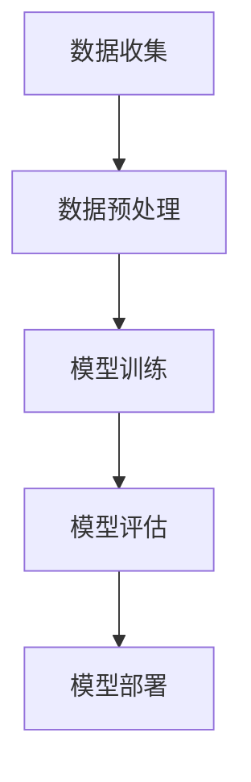

                 

在当今快速发展的技术环境中，人工智能（AI）尤其是大型模型的应用正变得日益重要。从自然语言处理到计算机视觉，再到复杂的预测模型，这些大型AI模型的性能和效率在很大程度上依赖于背后的架构设计。本文将探讨AI大模型应用的分布式架构设计模式，通过详细的解析和实例展示，帮助读者深入理解并应用这些设计模式。

## 关键词

- 分布式架构
- 大模型
- AI应用
- 设计模式
- 性能优化

## 摘要

本文旨在介绍AI大模型应用中的分布式架构设计模式，包括其核心概念、算法原理、数学模型、实际应用以及未来的发展趋势。通过深入解析这些设计模式，读者将能够更好地理解如何优化大型AI模型的性能，从而在复杂的应用场景中取得更好的效果。

### 1. 背景介绍

随着数据量和计算需求的不断增长，传统的单机架构已无法满足AI大模型的应用需求。分布式架构因其可扩展性强、容错性好、性能优异等优点，逐渐成为AI应用的主流选择。分布式架构不仅能够处理大规模的数据集，还能提高模型的训练和推理效率，降低成本。

本节将介绍分布式架构的核心概念，如节点、集群、任务调度等，并解释为什么分布式架构在AI大模型应用中具有重要意义。

### 1.1 核心概念

#### 节点

节点是分布式架构中的基本单元，可以是物理服务器或虚拟机。每个节点上运行着独立的计算任务，这些任务通过通信网络相互协作。

#### 集群

集群是由多个节点组成的集合，它们共同工作以完成复杂的任务。集群可以通过冗余设计提高系统的可用性和容错性。

#### 任务调度

任务调度是指如何将计算任务分配给集群中的节点。高效的调度算法能够优化资源的利用，提高系统的性能。

### 1.2 分布式架构的重要性

- **可扩展性**：分布式架构能够轻松地扩展到数千个节点，满足不断增长的数据处理需求。
- **性能优化**：通过并行计算和负载均衡，分布式架构能够显著提高AI模型的训练和推理速度。
- **容错性**：分布式架构中的节点可以独立运行，即使某个节点出现故障，也不会影响整个系统的运行。

### 2. 核心概念与联系

#### 2.1 分布式AI模型训练流程

为了更好地理解分布式架构在AI大模型中的应用，我们首先需要了解其核心流程，包括数据收集、预处理、模型训练、评估和部署。

#### 2.2 Mermaid流程图

以下是一个简化的Mermaid流程图，展示了分布式AI模型训练的基本步骤：



#### 2.3 各环节的分布式设计模式

- **数据收集**：分布式架构可以支持大规模数据的实时收集，通过数据管道和流处理技术实现高效的数据摄取。
- **数据预处理**：分布式数据预处理能够并行处理大量数据，提高数据清洗和转换的效率。
- **模型训练**：分布式模型训练是通过将模型拆分成多个子模型，并在不同节点上并行训练，然后进行聚合来实现的。
- **模型评估**：分布式评估可以通过在多个节点上运行测试数据，并汇总结果来提高评估的准确性和效率。
- **模型部署**：分布式部署可以通过容器化技术（如Docker）和自动化管理工具（如Kubernetes）实现，确保模型的高可用性和弹性。

### 3. 核心算法原理 & 具体操作步骤

#### 3.1 算法原理概述

分布式AI大模型的训练主要依赖于以下几种算法原理：

- **并行计算**：通过将模型分解成多个部分，并在不同节点上并行计算，加速模型的训练过程。
- **模型并行**：通过将模型拆分成多个子模型，并在不同节点上独立训练，然后进行聚合。
- **数据并行**：通过将数据集分割成多个子集，并在不同节点上独立训练，然后进行聚合。

#### 3.2 算法步骤详解

1. **模型划分**：根据训练任务的规模和节点数量，将模型拆分成多个子模型。
2. **数据划分**：将数据集分割成多个子集，确保每个子集中的数据尽可能均衡。
3. **并行训练**：在每个节点上独立训练子模型，同时处理子集中的数据。
4. **模型聚合**：将各个节点上训练好的子模型进行合并，形成完整的模型。
5. **模型优化**：通过迭代训练和模型聚合，优化模型参数，提高模型性能。
6. **模型评估**：使用测试数据集对训练好的模型进行评估，确保模型达到预期的性能。

#### 3.3 算法优缺点

**优点**：

- **加速训练**：通过并行计算和模型并行，分布式架构能够显著提高模型训练的速度。
- **容错性强**：分布式架构中的节点可以独立运行，即使某个节点出现故障，也不会影响整个系统的运行。
- **可扩展性**：分布式架构能够轻松扩展到更多的节点，满足大规模数据处理需求。

**缺点**：

- **复杂性**：分布式架构的设计和实现相对复杂，需要深入理解分布式系统的原理和算法。
- **通信开销**：分布式训练过程中，节点之间需要频繁通信，可能导致通信开销较大。

#### 3.4 算法应用领域

分布式AI大模型在以下领域具有广泛的应用：

- **自然语言处理**：如机器翻译、文本分类、情感分析等。
- **计算机视觉**：如图像分类、目标检测、人脸识别等。
- **预测分析**：如股票市场预测、风险评估、资源调度等。

### 4. 数学模型和公式 & 详细讲解 & 举例说明

#### 4.1 数学模型构建

分布式AI大模型训练中的数学模型主要涉及以下方面：

- **模型参数**：模型的权重和偏置。
- **损失函数**：用于评估模型预测结果与实际结果之间的差距。
- **优化算法**：如梯度下降、随机梯度下降、Adam等。

#### 4.2 公式推导过程

以下是一个简化的梯度下降算法的公式推导过程：

$$
\text{损失函数} = \frac{1}{2} \sum_{i=1}^{n} (\hat{y}_i - y_i)^2
$$

$$
\text{梯度} = \frac{\partial \text{损失函数}}{\partial \text{模型参数}}
$$

$$
\text{更新模型参数} = \text{模型参数} - \alpha \cdot \text{梯度}
$$

其中，$\hat{y}_i$是模型预测结果，$y_i$是实际结果，$\alpha$是学习率。

#### 4.3 案例分析与讲解

以下是一个分布式AI模型训练的案例：

假设我们有一个大型神经网络，需要在一个包含10个节点的集群上进行训练。数据集被分割成10个子集，每个节点负责训练一个子模型。

1. **模型划分**：将神经网络拆分成10个独立的子网络。
2. **数据划分**：将数据集分割成10个子集，每个子集包含相同数量的样本。
3. **并行训练**：每个节点独立训练子网络，处理子集中的数据。
4. **模型聚合**：将各个节点上训练好的子网络进行合并，形成完整的神经网络。
5. **模型优化**：通过迭代训练和模型聚合，优化神经网络参数。
6. **模型评估**：使用测试数据集对训练好的神经网络进行评估。

### 5. 项目实践：代码实例和详细解释说明

#### 5.1 开发环境搭建

搭建一个分布式AI大模型训练的项目需要以下环境：

- 操作系统：Linux
- 编程语言：Python
- 依赖库：TensorFlow、Distributed TensorFlow、Kubernetes

#### 5.2 源代码详细实现

以下是一个简单的分布式AI模型训练的代码示例：

```python
import tensorflow as tf
from tensorflow.keras import layers

# 构建模型
model = tf.keras.Sequential([
    layers.Dense(128, activation='relu', input_shape=(784,)),
    layers.Dense(10, activation='softmax')
])

# 定义分布式策略
strategy = tf.distribute.MirroredStrategy()

# 重构模型
with strategy.scope():
    model = tf.keras.Sequential([
        layers.Dense(128, activation='relu', input_shape=(784,)),
        layers.Dense(10, activation='softmax')
    ])

# 编译模型
model.compile(loss='categorical_crossentropy',
              optimizer=tf.keras.optimizers.Adam(),
              metrics=['accuracy'])

# 加载数据集
(x_train, y_train), (x_test, y_test) = tf.keras.datasets.mnist.load_data()
x_train = x_train.astype('float32') / 255
x_test = x_test.astype('float32') / 255
y_train = tf.keras.utils.to_categorical(y_train, 10)
y_test = tf.keras.utils.to_categorical(y_test, 10)

# 训练模型
model.fit(x_train, y_train, epochs=10, batch_size=128)

# 评估模型
model.evaluate(x_test, y_test)
```

#### 5.3 代码解读与分析

1. **模型构建**：使用TensorFlow的Sequential模型构建一个简单的神经网络，包括128个神经元和10个输出神经元。
2. **分布式策略**：使用MirroredStrategy实现模型参数的复制和同步。
3. **重构模型**：在策略作用域内重新构建模型，确保模型参数在所有节点上保持一致。
4. **编译模型**：设置损失函数、优化器和评估指标，编译模型。
5. **加载数据集**：加载数据集，并进行预处理。
6. **训练模型**：使用fit函数训练模型，指定训练轮次、批量大小等参数。
7. **评估模型**：使用evaluate函数评估模型在测试数据集上的性能。

### 6. 实际应用场景

分布式AI大模型在以下实际应用场景中具有显著优势：

- **大规模数据处理**：如电子商务平台的海量用户行为数据分析和预测。
- **图像处理**：如自动驾驶车辆的图像识别和实时处理。
- **金融分析**：如股票市场趋势分析和风险预测。
- **医疗健康**：如疾病预测和诊断系统的开发。

### 6.4 未来应用展望

随着AI技术的不断进步，分布式架构在AI大模型应用中的重要性将愈发凸显。未来的发展趋势包括：

- **更高效的分布式算法**：研究新的分布式算法，提高模型训练和推理的效率。
- **更灵活的架构设计**：探索新的架构设计模式，满足多样化的应用需求。
- **更广泛的应用领域**：将分布式AI大模型应用于更多领域，解决实际问题。

### 7. 工具和资源推荐

#### 7.1 学习资源推荐

- 《深度学习》（Goodfellow, Bengio, Courville著）
- 《分布式系统原理与范型》（Miguel da Silva Gomes著）
- 《TensorFlow分布式训练指南》

#### 7.2 开发工具推荐

- TensorFlow
- Kubernetes
- Docker

#### 7.3 相关论文推荐

- "Distributed Deep Learning: A Theoretical Perspective"
- "Parallelizing Stochastic Gradient Descent"
- "Model Parallelism for Deep Learning on Multichip Multiprocessors"

### 8. 总结：未来发展趋势与挑战

#### 8.1 研究成果总结

分布式AI大模型应用在性能优化、可扩展性和容错性方面取得了显著成果。通过并行计算和模型并行，分布式架构能够显著提高模型训练和推理的速度。

#### 8.2 未来发展趋势

未来的发展趋势将包括更高效的分布式算法、更灵活的架构设计和更广泛的应用领域。随着AI技术的不断进步，分布式AI大模型将在更多领域中发挥重要作用。

#### 8.3 面临的挑战

分布式AI大模型应用面临的主要挑战包括架构复杂性、通信开销和资源管理。如何高效地管理和调度分布式资源，优化通信开销，降低架构复杂性，是未来研究的重要方向。

#### 8.4 研究展望

分布式AI大模型应用的研究将朝着更高效、更灵活和更广泛的方向发展。未来的研究将关注如何优化分布式算法、提升架构设计、扩展应用领域，并解决实际应用中的挑战。

### 9. 附录：常见问题与解答

#### Q: 分布式架构如何提高模型性能？

A: 分布式架构通过并行计算和负载均衡，能够在多个节点上同时处理数据，从而加速模型训练和推理过程，提高整体性能。

#### Q: 分布式架构有哪些优缺点？

A: 分布式架构的优点包括可扩展性强、容错性好、性能优化等；缺点包括复杂性较高、通信开销较大等。

#### Q: 分布式模型训练有哪些算法？

A: 分布式模型训练常用的算法包括并行计算、模型并行、数据并行等。

---

作者：禅与计算机程序设计艺术 / Zen and the Art of Computer Programming

