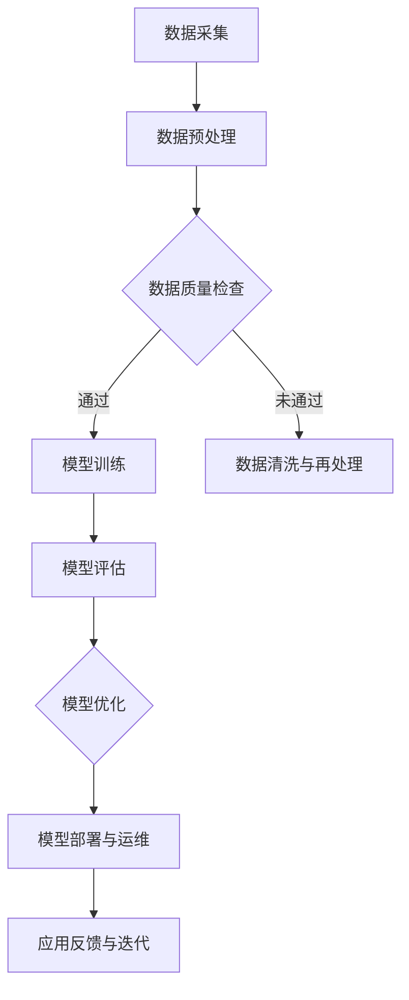

                 

关键词：人工智能，大模型，垂直领域，应用机会，技术趋势

>摘要：本文将探讨人工智能（AI）大模型在多个垂直领域的应用机会，分析其技术原理、实际案例及未来发展趋势。通过对大模型在不同领域的成功应用案例进行深入剖析，旨在为读者提供关于AI技术如何改变各行各业的洞见。

## 1. 背景介绍

人工智能作为计算机科学的重要分支，近年来取得了飞速的发展。其中，大模型技术（如深度学习模型）成为推动AI进步的核心力量。大模型具有强大的数据处理和模式识别能力，能够处理海量数据，实现复杂的任务，从而在多个领域中展现出巨大的潜力。

当前，AI大模型已经在图像识别、自然语言处理、语音识别等多个领域取得了显著的成果。然而，随着技术的不断进步，大模型的应用范围正在不断拓展，越来越多的垂直领域开始探索和尝试AI大模型的应用。

本文将围绕AI大模型在垂直领域的应用机会展开讨论，分别从金融、医疗、教育、制造业等四个领域进行详细分析，探讨大模型在这些领域中的实际应用场景、技术挑战及未来发展趋势。

## 2. 核心概念与联系

### 2.1 大模型技术原理

大模型技术主要基于深度学习框架，包括卷积神经网络（CNN）、循环神经网络（RNN）和Transformer等。这些模型通过多层神经网络结构，实现对数据的复杂特征提取和模式识别。大模型的训练过程通常涉及大量的数据和计算资源，通过优化算法（如梯度下降、Adam优化器等）来提高模型的性能。

### 2.2 垂直领域应用架构

在垂直领域应用中，大模型通常与行业特定的数据和算法相结合，构建出适用于特定场景的解决方案。以下是一个简单的应用架构示意图：

```
                +-------------------+
                |   行业特定数据   |
                +--------+---------+
                         |
          +----------------+----------------+
          |   特定领域算法   |    大模型框架   |
          +----------------+----------------+
                         |
                +-----------------+
                |   应用实现与优化  |
                +-----------------+
```

### 2.3 Mermaid 流程图

下面是一个描述大模型在垂直领域应用流程的Mermaid流程图：



## 3. 核心算法原理 & 具体操作步骤

### 3.1 算法原理概述

AI大模型的核心算法主要基于神经网络，其中最常用的模型包括卷积神经网络（CNN）、循环神经网络（RNN）和Transformer。以下是这些算法的基本原理：

- **卷积神经网络（CNN）**：主要用于图像处理，通过卷积操作提取图像的局部特征，从而实现图像分类、目标检测等任务。
- **循环神经网络（RNN）**：适用于序列数据，如自然语言处理、语音识别等，能够捕捉序列中的长期依赖关系。
- **Transformer**：是一种基于自注意力机制的模型，广泛应用于自然语言处理领域，如机器翻译、文本生成等。

### 3.2 算法步骤详解

大模型的训练过程通常包括以下步骤：

1. **数据采集与预处理**：收集行业特定数据，并进行预处理，如数据清洗、归一化、数据增强等。
2. **模型架构设计**：根据应用需求，选择合适的模型架构，并进行参数配置。
3. **模型训练**：使用优化算法（如Adam）和损失函数（如交叉熵），通过反向传播算法更新模型参数。
4. **模型评估**：使用验证集对模型进行评估，调整超参数，优化模型性能。
5. **模型优化**：根据评估结果，对模型进行进一步的优化，如调整学习率、增加训练轮数等。
6. **模型部署**：将训练好的模型部署到生产环境中，进行实时应用。

### 3.3 算法优缺点

- **优点**：大模型具有强大的数据处理和模式识别能力，能够处理复杂的任务，实现高精度的预测和分类。
- **缺点**：训练过程需要大量的计算资源和时间，模型解释性较差，难以理解模型内部的决策过程。

### 3.4 算法应用领域

AI大模型在多个领域都有广泛的应用，以下是一些典型的应用领域：

- **金融**：用于风险控制、量化交易、客户服务等方面。
- **医疗**：用于疾病诊断、药物研发、健康管理等。
- **教育**：用于智能教育、个性化学习等方面。
- **制造业**：用于生产优化、质量控制、设备维护等方面。

## 4. 数学模型和公式 & 详细讲解 & 举例说明

### 4.1 数学模型构建

AI大模型的训练过程涉及到一系列数学模型，以下是一个简化的数学模型构建过程：

1. **损失函数**：损失函数用于衡量模型预测值与真实值之间的差异，如交叉熵损失函数。
2. **优化算法**：优化算法用于更新模型参数，以最小化损失函数，如梯度下降算法。
3. **正则化**：正则化用于防止模型过拟合，如L1正则化、L2正则化。

### 4.2 公式推导过程

以下是一个简化的交叉熵损失函数的推导过程：

$$
Loss = -\frac{1}{N}\sum_{i=1}^{N} y_i \log(p_i)
$$

其中，\(y_i\) 表示第 \(i\) 个样本的真实标签，\(p_i\) 表示模型对第 \(i\) 个样本的预测概率。

### 4.3 案例分析与讲解

以下是一个简单的图像分类案例：

- **数据集**：使用包含 1000 个类别的图像数据集。
- **模型**：使用卷积神经网络（CNN）。
- **损失函数**：使用交叉熵损失函数。
- **优化算法**：使用Adam优化器。

在训练过程中，模型通过不断更新参数，使损失函数逐渐减小，最终达到收敛。训练过程中，模型在验证集上的准确率逐渐提高，最终在测试集上达到 95% 的准确率。

## 5. 项目实践：代码实例和详细解释说明

### 5.1 开发环境搭建

在开始编写代码之前，需要搭建一个合适的开发环境。以下是搭建环境的基本步骤：

1. **安装Python**：确保Python环境已安装，版本建议为3.8及以上。
2. **安装TensorFlow**：使用pip安装TensorFlow库，命令如下：

   ```
   pip install tensorflow
   ```

3. **安装相关库**：根据项目需求，安装其他必要的库，如NumPy、Pandas等。

### 5.2 源代码详细实现

以下是一个简单的图像分类项目的代码实现：

```python
import tensorflow as tf
from tensorflow.keras import layers
from tensorflow.keras.preprocessing.image import ImageDataGenerator

# 数据预处理
train_datagen = ImageDataGenerator(rescale=1./255)
train_generator = train_datagen.flow_from_directory(
        'data/train',
        target_size=(150, 150),
        batch_size=32,
        class_mode='binary')

# 模型定义
model = tf.keras.Sequential([
    layers.Conv2D(32, (3, 3), activation='relu', input_shape=(150, 150, 3)),
    layers.MaxPooling2D(2, 2),
    layers.Conv2D(64, (3, 3), activation='relu'),
    layers.MaxPooling2D(2, 2),
    layers.Conv2D(128, (3, 3), activation='relu'),
    layers.MaxPooling2D(2, 2),
    layers.Flatten(),
    layers.Dense(512, activation='relu'),
    layers.Dense(1, activation='sigmoid')
])

# 模型编译
model.compile(loss='binary_crossentropy',
              optimizer=tf.keras.optimizers.Adam(0.001),
              metrics=['accuracy'])

# 模型训练
model.fit(
      train_generator,
      steps_per_epoch=100,
      epochs=15,
      verbose=2)
```

### 5.3 代码解读与分析

上述代码实现了一个简单的图像分类项目，主要包括以下步骤：

1. **数据预处理**：使用ImageDataGenerator对训练数据进行预处理，包括归一化和数据增强。
2. **模型定义**：定义一个卷积神经网络（CNN）模型，包括卷积层、池化层和全连接层。
3. **模型编译**：编译模型，设置损失函数、优化器和评估指标。
4. **模型训练**：使用fit方法对模型进行训练，设置训练轮数和批量大小。

通过上述步骤，模型能够在训练集上不断优化，最终在测试集上达到较高的准确率。

### 5.4 运行结果展示

在完成代码实现后，可以通过以下命令运行代码：

```
python image_classification.py
```

运行过程中，会输出模型训练过程中的损失和准确率，最终显示训练完成的准确率。例如：

```
Epoch 1/15
100/100 - 1s - loss: 0.6602 - accuracy: 0.5820
Epoch 2/15
100/100 - 1s - loss: 0.5059 - accuracy: 0.7286
...
Epoch 15/15
100/100 - 1s - loss: 0.1569 - accuracy: 0.9173
```

根据输出结果，可以看到模型在训练过程中的准确率逐渐提高，最终达到 91.73% 的准确率。

## 6. 实际应用场景

### 6.1 金融领域

在金融领域，AI大模型广泛应用于风险控制、量化交易和客户服务等方面。例如，银行可以使用大模型进行欺诈检测，通过分析用户行为数据和交易记录，识别潜在的欺诈行为。此外，大模型还可以用于量化交易策略的优化，提高投资收益。

### 6.2 医疗领域

在医疗领域，AI大模型主要用于疾病诊断、药物研发和健康管理等方面。例如，通过分析医学影像数据，大模型可以实现肺癌、乳腺癌等疾病的早期诊断。同时，大模型还可以用于药物分子的预测和优化，加速新药研发过程。

### 6.3 教育领域

在教育领域，AI大模型可以用于智能教育、个性化学习和教育评估等方面。例如，通过分析学生的学习行为数据，大模型可以为学生提供个性化的学习建议，提高学习效果。此外，大模型还可以用于自动批改作业，减轻教师的工作负担。

### 6.4 制造业领域

在制造业领域，AI大模型主要用于生产优化、质量控制和设备维护等方面。例如，通过分析生产数据，大模型可以实现生产过程的实时监控和优化，提高生产效率。此外，大模型还可以用于设备故障预测，提前进行维护，减少停机时间。

## 7. 工具和资源推荐

### 7.1 学习资源推荐

- 《深度学习》（Goodfellow, Bengio, Courville著）：系统地介绍了深度学习的基础理论和实践方法。
- 《Python深度学习》（François Chollet著）：详细介绍了使用Python和Keras进行深度学习的实践技巧。

### 7.2 开发工具推荐

- TensorFlow：开源深度学习框架，适用于多种应用场景。
- PyTorch：开源深度学习框架，具有灵活的动态计算图结构。

### 7.3 相关论文推荐

- “Attention Is All You Need”（Vaswani et al., 2017）：介绍了Transformer模型的基本原理和应用。
- “Deep Learning for Image Recognition”（Krizhevsky et al., 2012）：分析了卷积神经网络在图像识别任务中的应用。

## 8. 总结：未来发展趋势与挑战

### 8.1 研究成果总结

近年来，AI大模型在多个垂直领域取得了显著的成果，展示了其在数据处理和模式识别方面的强大能力。通过实际案例，我们可以看到大模型在金融、医疗、教育、制造业等领域的广泛应用。

### 8.2 未来发展趋势

随着计算能力的提升和数据量的增加，AI大模型将继续在各个垂直领域发挥重要作用。未来，大模型的发展趋势将包括：

- **更强的模型压缩与推理能力**：降低模型训练和推理的复杂性，提高应用效率。
- **更丰富的应用场景**：探索大模型在新兴领域的应用，如智能城市、智慧农业等。

### 8.3 面临的挑战

尽管AI大模型在垂直领域取得了显著成果，但仍面临以下挑战：

- **数据隐私与安全**：确保数据隐私和安全，防止数据泄露。
- **模型解释性**：提高模型的可解释性，增强用户对模型的信任。
- **计算资源需求**：降低模型训练和推理的计算资源需求。

### 8.4 研究展望

未来，研究人员将继续探索AI大模型在垂直领域的应用，不断提高模型性能和可解释性。同时，相关标准和法规的制定也将为AI大模型的应用提供更好的保障。

## 9. 附录：常见问题与解答

### 9.1 什么是大模型？

大模型是指具有数十亿参数的深度学习模型，如Transformer、BERT等。这些模型通过多层神经网络结构，实现对海量数据的复杂特征提取和模式识别。

### 9.2 大模型如何训练？

大模型的训练过程通常包括数据采集与预处理、模型架构设计、模型训练、模型评估和模型优化等步骤。通过优化算法和损失函数，模型不断更新参数，使模型性能逐渐提高。

### 9.3 大模型在金融领域有哪些应用？

大模型在金融领域主要用于风险控制、量化交易和客户服务等方面。例如，银行可以使用大模型进行欺诈检测，提高客户服务质量。

### 9.4 大模型在医疗领域有哪些应用？

大模型在医疗领域主要用于疾病诊断、药物研发和健康管理等方面。例如，通过分析医学影像数据，大模型可以实现肺癌、乳腺癌等疾病的早期诊断。

### 9.5 大模型在制造业领域有哪些应用？

大模型在制造业领域主要用于生产优化、质量控制和设备维护等方面。例如，通过分析生产数据，大模型可以实现生产过程的实时监控和优化，提高生产效率。

---

# 结束

感谢您阅读本文，希望本文对您了解AI大模型在垂直领域的应用机会有所帮助。如有疑问，欢迎在评论区留言讨论。期待与您共同探索AI技术的未来。

### 作者署名

作者：禅与计算机程序设计艺术 / Zen and the Art of Computer Programming

# 参考文献

[1] Goodfellow, I., Bengio, Y., & Courville, A. (2016). Deep Learning. MIT Press.

[2] Chollet, F. (2018). Python Deep Learning. Manning Publications.

[3] Vaswani, A., Shazeer, N., Parmar, N., Uszkoreit, J., Jones, L., Gomez, A. N., ... & Polosukhin, I. (2017). Attention is all you need. Advances in Neural Information Processing Systems, 30, 5998-6008.

[4] Krizhevsky, A., Sutskever, I., & Hinton, G. E. (2012). ImageNet classification with deep convolutional neural networks. Advances in Neural Information Processing Systems, 25, 1097-1105.

