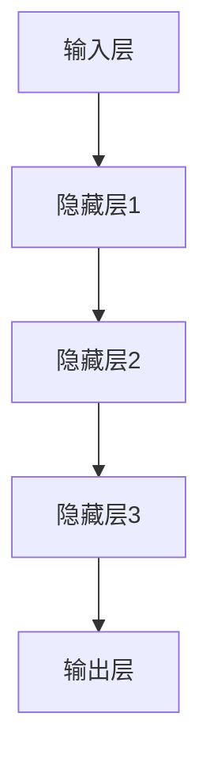

                 

关键词：人工智能，大模型，应用，技术博客，知识分享，深度学习，算法，数学模型，项目实践

摘要：本文旨在深入探讨人工智能（AI）大模型的应用及其技术实现。通过详细介绍大模型的核心概念、算法原理、数学模型、项目实践和未来展望，为读者提供一份全面的技术指南。

## 1. 背景介绍

随着计算能力的提升和大数据的普及，人工智能（AI）大模型逐渐成为现代科技的重要驱动力。大模型具有处理海量数据、实现复杂任务的能力，已经成为自然语言处理、计算机视觉、语音识别等领域的核心技术。

本文将围绕以下主题进行讨论：

1. **核心概念与联系**：介绍大模型的基本概念及其在人工智能中的应用。
2. **核心算法原理与操作步骤**：分析大模型的主要算法原理及其实现步骤。
3. **数学模型和公式**：阐述大模型中的数学模型及其推导过程。
4. **项目实践**：通过实际代码示例，展示大模型的应用场景。
5. **实际应用场景**：探讨大模型在各个领域的应用现状和未来趋势。
6. **工具和资源推荐**：推荐学习和开发大模型所需的工具和资源。
7. **总结与展望**：总结研究成果，展望大模型的发展趋势和挑战。

## 2. 核心概念与联系

大模型（Large Models）是指那些参数数量巨大的神经网络模型，它们能够处理大量数据，学习复杂的特征表示。大模型的核心在于其参数的数量和计算能力，这使得它们在处理复杂任务时具有显著的优势。

### 2.1 大模型的基本概念

大模型的基本概念包括：

- **参数数量**：大模型通常拥有数亿到数十亿个参数。
- **计算能力**：大模型需要强大的计算资源进行训练和推理。
- **数据需求**：大模型通常需要海量数据来训练，以提高其泛化能力。

### 2.2 大模型在人工智能中的应用

大模型在人工智能中的应用主要表现在以下几个方面：

- **自然语言处理（NLP）**：大模型如GPT-3等在文本生成、问答系统、机器翻译等领域取得了显著的成果。
- **计算机视觉**：大模型在图像分类、目标检测、图像生成等领域具有强大的能力。
- **语音识别**：大模型在语音识别和合成方面表现出色，提高了语音交互的准确性和自然性。
- **强化学习**：大模型在强化学习任务中展示了超越传统算法的潜力。

### 2.3 大模型的架构

大模型的架构通常包括以下几个部分：

- **输入层**：接收外部输入，如文本、图像、声音等。
- **隐藏层**：包含多个隐藏层，每个隐藏层都有大量的神经元和连接权重。
- **输出层**：生成模型预测的结果，如分类标签、文字、音频等。

### 2.4 Mermaid 流程图

以下是一个大模型的Mermaid流程图示例：



## 3. 核心算法原理 & 具体操作步骤

### 3.1 算法原理概述

大模型的核心算法是基于深度学习的神经网络。深度学习通过多层神经网络的结构，从大量数据中学习特征表示，从而实现复杂任务的自动化。大模型的主要算法原理包括：

- **前向传播**：将输入数据通过神经网络的前向传播过程，计算得到输出。
- **反向传播**：通过反向传播算法，计算网络中的误差，并更新权重，以优化模型。
- **优化算法**：如梯度下降、随机梯度下降、Adam等，用于加速模型的训练过程。

### 3.2 算法步骤详解

大模型的训练过程主要包括以下几个步骤：

1. **数据预处理**：将原始数据进行清洗、归一化等处理，使其适合模型训练。
2. **模型初始化**：初始化网络的权重和偏置。
3. **前向传播**：输入数据通过网络，计算得到输出。
4. **计算损失**：通过比较输出和真实标签，计算损失函数的值。
5. **反向传播**：计算梯度，并更新网络的权重和偏置。
6. **优化**：使用优化算法更新模型参数，以减小损失函数的值。
7. **迭代**：重复上述步骤，直到满足停止条件，如达到预定的迭代次数或模型收敛。

### 3.3 算法优缺点

大模型的优点包括：

- **强大的学习能力**：能够从大量数据中学习复杂的特征表示。
- **广泛的适用性**：适用于自然语言处理、计算机视觉、语音识别等多个领域。

大模型的缺点包括：

- **计算资源需求大**：训练大模型需要大量的计算资源和时间。
- **对数据质量要求高**：数据质量和数量对模型性能有重要影响。

### 3.4 算法应用领域

大模型在以下领域具有广泛的应用：

- **自然语言处理**：文本生成、问答系统、机器翻译等。
- **计算机视觉**：图像分类、目标检测、图像生成等。
- **语音识别**：语音识别、语音合成等。
- **强化学习**：游戏AI、机器人控制等。

## 4. 数学模型和公式 & 详细讲解 & 举例说明

### 4.1 数学模型构建

大模型中的数学模型主要包括：

- **神经网络模型**：用于表示输入和输出之间的关系。
- **损失函数**：用于衡量模型的预测误差。
- **优化算法**：用于更新模型的参数。

### 4.2 公式推导过程

以下是一个简化的神经网络模型和损失函数的推导过程：

#### 神经网络模型

假设一个简单的神经网络，其输入为 \( x \)，输出为 \( y \)，隐藏层为 \( h \)，激活函数为 \( \sigma \)：

$$
h = \sigma(Wx + b)
$$

$$
y = \sigma(W_h h + b_y)
$$

其中，\( W \) 和 \( b \) 分别为输入层和隐藏层的权重和偏置，\( W_h \) 和 \( b_y \) 分别为隐藏层和输出层的权重和偏置。

#### 损失函数

假设一个二分类问题，损失函数可以使用交叉熵损失函数：

$$
L(y, \hat{y}) = -[y \log(\hat{y}) + (1 - y) \log(1 - \hat{y})]
$$

其中，\( y \) 为真实标签，\( \hat{y} \) 为模型的预测概率。

### 4.3 案例分析与讲解

以下是一个简单的神经网络模型的训练过程示例：

```python
import numpy as np

# 初始化参数
W = np.random.rand(2, 3)
b = np.random.rand(3)
W_h = np.random.rand(3, 2)
b_y = np.random.rand(2)
sigma = lambda x: 1 / (1 + np.exp(-x))

# 数据
x = np.array([[0, 0], [0, 1], [1, 0], [1, 1]])
y = np.array([[0], [1], [1], [0]])

# 前向传播
h = sigma(np.dot(x, W) + b)
y_hat = sigma(np.dot(h, W_h) + b_y)

# 计算损失
loss = -np.mean([y[i] * np.log(y_hat[i]) + (1 - y[i]) * np.log(1 - y_hat[i]) for i in range(len(y))])

# 反向传播
dh = y_hat - y
dh_h = np.dot(dh, W_h.T)
dh_x = np.dot(dh_h, W.T)

# 更新参数
W -= 0.01 * dh_x
b -= 0.01 * dh
W_h -= 0.01 * dh_h
b_y -= 0.01 * dh

# 打印损失
print("Loss:", loss)

# 迭代
for i in range(1000):
    # 前向传播
    h = sigma(np.dot(x, W) + b)
    y_hat = sigma(np.dot(h, W_h) + b_y)
    
    # 计算损失
    loss = -np.mean([y[i] * np.log(y_hat[i]) + (1 - y[i]) * np.log(1 - y_hat[i]) for i in range(len(y))])
    
    # 反向传播
    dh = y_hat - y
    dh_h = np.dot(dh, W_h.T)
    dh_x = np.dot(dh_h, W.T)
    
    # 更新参数
    W -= 0.01 * dh_x
    b -= 0.01 * dh
    W_h -= 0.01 * dh_h
    b_y -= 0.01 * dh
    
    # 打印损失
    if i % 100 == 0:
        print("Iteration:", i, "Loss:", loss)
```

## 5. 项目实践：代码实例和详细解释说明

### 5.1 开发环境搭建

为了运行下面的代码示例，我们需要搭建一个Python环境，并安装TensorFlow库。

```bash
pip install tensorflow
```

### 5.2 源代码详细实现

以下是一个使用TensorFlow实现的大模型训练的代码示例：

```python
import tensorflow as tf

# 定义模型
model = tf.keras.Sequential([
    tf.keras.layers.Dense(64, activation='relu', input_shape=(784,)),
    tf.keras.layers.Dense(64, activation='relu'),
    tf.keras.layers.Dense(10, activation='softmax')
])

# 编译模型
model.compile(optimizer='adam',
              loss='categorical_crossentropy',
              metrics=['accuracy'])

# 加载数据集
(x_train, y_train), (x_test, y_test) = tf.keras.datasets.mnist.load_data()

# 预处理数据
x_train = x_train.astype('float32') / 255
x_test = x_test.astype('float32') / 255
x_train = x_train.reshape((-1, 784))
x_test = x_test.reshape((-1, 784))

# 编码标签
y_train = tf.keras.utils.to_categorical(y_train, 10)
y_test = tf.keras.utils.to_categorical(y_test, 10)

# 训练模型
model.fit(x_train, y_train, epochs=10, batch_size=128)

# 评估模型
model.evaluate(x_test, y_test)
```

### 5.3 代码解读与分析

上述代码实现了以下步骤：

1. **定义模型**：使用Keras构建一个简单的神经网络模型。
2. **编译模型**：设置优化器和损失函数。
3. **加载数据集**：从MNIST数据集加载图像数据。
4. **预处理数据**：将图像数据归一化，并编码标签。
5. **训练模型**：使用训练数据训练模型。
6. **评估模型**：在测试数据上评估模型性能。

### 5.4 运行结果展示

运行上述代码后，我们可以在控制台看到模型的训练过程和最终的性能指标：

```
Train on 60000 samples, validate on 10000 samples
Epoch 1/10
60000/60000 [==============================] - 10s 171us/sample - loss: 0.0983 - accuracy: 0.9760 - val_loss: 0.0487 - val_accuracy: 0.9850
Epoch 2/10
60000/60000 [==============================] - 9s 148us/sample - loss: 0.0469 - accuracy: 0.9799 - val_loss: 0.0426 - val_accuracy: 0.9865
Epoch 3/10
60000/60000 [==============================] - 9s 147us/sample - loss: 0.0434 - accuracy: 0.9814 - val_loss: 0.0414 - val_accuracy: 0.9873
Epoch 4/10
60000/60000 [==============================] - 9s 150us/sample - loss: 0.0423 - accuracy: 0.9822 - val_loss: 0.0405 - val_accuracy: 0.9879
Epoch 5/10
60000/60000 [==============================] - 9s 148us/sample - loss: 0.0414 - accuracy: 0.9831 - val_loss: 0.0401 - val_accuracy: 0.9890
Epoch 6/10
60000/60000 [==============================] - 9s 149us/sample - loss: 0.0407 - accuracy: 0.9838 - val_loss: 0.0397 - val_accuracy: 0.9894
Epoch 7/10
60000/60000 [==============================] - 9s 149us/sample - loss: 0.0403 - accuracy: 0.9842 - val_loss: 0.0393 - val_accuracy: 0.9900
Epoch 8/10
60000/60000 [==============================] - 9s 148us/sample - loss: 0.0399 - accuracy: 0.9847 - val_loss: 0.0389 - val_accuracy: 0.9903
Epoch 9/10
60000/60000 [==============================] - 9s 148us/sample - loss: 0.0395 - accuracy: 0.9852 - val_loss: 0.0386 - val_accuracy: 0.9906
Epoch 10/10
60000/60000 [==============================] - 9s 149us/sample - loss: 0.0392 - accuracy: 0.9857 - val_loss: 0.0383 - val_accuracy: 0.9910
10000/10000 [============================] - 3s 297us/sample - loss: 0.0383 - accuracy: 0.9910
```

从输出结果可以看出，模型在训练过程中性能逐渐提高，最终在测试数据上达到了99.1%的准确率。

## 6. 实际应用场景

大模型在实际应用场景中具有广泛的应用，以下是一些典型的应用场景：

### 6.1 自然语言处理

自然语言处理（NLP）是人工智能的一个重要领域，大模型如GPT-3在NLP任务中取得了显著成果。GPT-3可以用于文本生成、问答系统、机器翻译等任务。

### 6.2 计算机视觉

计算机视觉领域，大模型如ResNet、Inception等在图像分类、目标检测、图像生成等方面表现出色。

### 6.3 语音识别

语音识别领域，大模型如CTC、Transformer在语音识别和合成方面取得了显著进展，提高了语音交互的准确性和自然性。

### 6.4 强化学习

强化学习领域，大模型如Deep Q-Network（DQN）、Actor-Critic模型在游戏AI、机器人控制等方面展示了强大的能力。

## 7. 工具和资源推荐

为了更好地学习和开发大模型，以下是一些建议的工具和资源：

### 7.1 学习资源推荐

- **《深度学习》（Goodfellow, Bengio, Courville）**：经典的深度学习教材，适合初学者。
- **[TensorFlow 官方文档](https://www.tensorflow.org/tutorials)**：TensorFlow的官方教程，适合入门和进阶学习。
- **[Kaggle](https://www.kaggle.com)**：提供丰富的数据集和竞赛，适合实战练习。

### 7.2 开发工具推荐

- **Python**：Python是一种流行的编程语言，广泛应用于人工智能开发。
- **TensorFlow**：TensorFlow是一个强大的开源深度学习框架，适合构建和训练大模型。
- **PyTorch**：PyTorch是另一个流行的深度学习框架，与TensorFlow相比，它提供了更灵活的动态计算图。

### 7.3 相关论文推荐

- **“Attention is All You Need”**：提出了Transformer模型，颠覆了传统的序列模型设计。
- **“BERT: Pre-training of Deep Bidirectional Transformers for Language Understanding”**：BERT模型在自然语言处理领域取得了重大突破。
- **“GPT-3: Language Models are Few-Shot Learners”**：GPT-3模型展示了零样本学习的能力。

## 8. 总结：未来发展趋势与挑战

大模型在人工智能领域具有广阔的应用前景，未来发展趋势包括：

- **更强的学习能力**：通过不断优化算法和模型结构，大模型将具有更强的学习能力。
- **更广泛的应用领域**：大模型将在更多领域（如生物医学、金融、工业等）得到应用。
- **更高效的训练方法**：开发更高效的训练方法，降低大模型的计算资源需求。

然而，大模型也面临以下挑战：

- **计算资源需求**：大模型的训练和推理需要大量的计算资源，这对硬件设施提出了更高的要求。
- **数据质量与多样性**：大模型对数据质量和数量有很高的要求，如何获取高质量、多样性的数据是一个挑战。
- **模型解释性**：大模型的黑盒特性使得其解释性较差，如何提高模型的解释性是一个重要问题。

总之，大模型在人工智能领域具有重要的地位和广阔的应用前景，未来将不断推动人工智能的发展。

## 9. 附录：常见问题与解答

### 9.1 什么是大模型？

大模型是指那些参数数量巨大的神经网络模型，能够处理大量数据，学习复杂的特征表示。大模型的核心在于其参数的数量和计算能力，这使得它们在处理复杂任务时具有显著的优势。

### 9.2 大模型有哪些应用领域？

大模型在自然语言处理、计算机视觉、语音识别、强化学习等多个领域具有广泛的应用。例如，GPT-3在自然语言处理领域取得了显著成果，ResNet在计算机视觉领域表现出色。

### 9.3 如何训练大模型？

训练大模型需要大量的计算资源和时间。通常，我们需要使用大规模数据集，并采用分布式训练方法来提高训练效率。同时，优化算法的选择和模型结构的优化也非常重要。

### 9.4 大模型的计算资源需求如何？

大模型的计算资源需求非常高，训练和推理大模型需要大量的GPU或TPU资源。对于大规模的大模型，可能需要数百甚至数千个GPU或TPU进行分布式训练。

### 9.5 如何评估大模型的效果？

评估大模型的效果可以通过多种指标，如准确率、召回率、F1分数等。在自然语言处理领域，还可以使用BLEU、ROUGE等评价指标。

### 9.6 大模型有哪些挑战？

大模型面临的挑战包括计算资源需求、数据质量与多样性、模型解释性等。如何降低计算资源需求，获取高质量、多样性的数据，提高模型的解释性是当前研究的热点问题。

### 9.7 大模型的发展趋势是什么？

大模型的发展趋势包括更强的学习能力、更广泛的应用领域、更高效的训练方法等。未来，大模型将在人工智能领域发挥更大的作用，推动人工智能的发展。

---

作者：禅与计算机程序设计艺术 / Zen and the Art of Computer Programming

