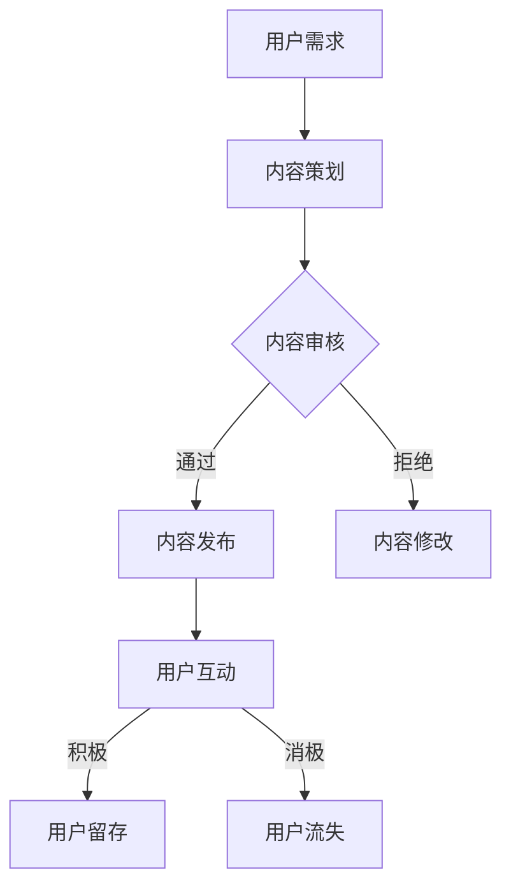

                 

关键词：AI大模型，技术社区，运营策略，用户参与，社区活力，项目实践，发展展望

## 摘要

本文旨在探讨AI大模型应用的技术社区运营策略，分析其核心概念、关键算法、数学模型及实际应用。通过对技术社区运营的深入剖析，本文提出了一系列有效的运营策略，旨在提升社区活力和用户参与度。文章最后对AI大模型技术社区的未来发展进行了展望，并提出面临的挑战和研究方向。

## 1. 背景介绍

随着人工智能技术的快速发展，AI大模型在各个领域中的应用越来越广泛。从自然语言处理、计算机视觉到推荐系统，AI大模型已成为推动技术创新的重要力量。同时，技术社区作为知识分享和交流的重要平台，在AI大模型领域发挥着不可或缺的作用。技术社区的运营不仅关乎知识传播，更影响社区成员的技术成长和创新活力。

然而，AI大模型技术社区运营面临着一系列挑战。一方面，AI技术的高复杂性和动态性使得内容更新和维护成本高昂；另一方面，用户需求的多样性和个性化需求难以满足，导致社区活力不足。因此，如何有效地运营AI大模型技术社区，提升用户体验和社区参与度，成为当前亟需解决的问题。

## 2. 核心概念与联系

为了深入理解AI大模型技术社区运营，首先需要明确核心概念及其相互关系。

### 2.1 AI大模型

AI大模型是指使用海量数据进行训练，具备高度泛化能力的深度学习模型。常见的AI大模型包括Transformer、BERT、GPT等。这些模型通过自动提取特征和生成预测，能够实现自然语言处理、图像识别、语音识别等多种功能。

### 2.2 技术社区

技术社区是指以技术交流、知识分享、项目合作为核心目的的在线平台。技术社区通常包括论坛、博客、微信群、GitHub等多种形式，为社区成员提供交流和学习的机会。

### 2.3 运营策略

运营策略是指为了提升社区活力和用户参与度所采取的一系列措施。常见的运营策略包括内容管理、活动组织、社群管理、用户激励等。

### 2.4 Mermaid 流程图

以下是一个简化的AI大模型技术社区运营流程图：



### 2.5 关键环节

在AI大模型技术社区运营中，以下关键环节至关重要：

- **内容策划**：根据用户需求和市场趋势，策划高质量的技术内容。
- **内容审核**：确保内容的质量和准确性，避免误导用户。
- **内容发布**：及时发布高质量的内容，满足用户的知识需求。
- **用户互动**：鼓励用户参与讨论和互动，提高社区活跃度。
- **用户留存**：通过持续的内容更新和用户激励，提高用户留存率。

## 3. 核心算法原理 & 具体操作步骤

### 3.1 算法原理概述

AI大模型技术社区运营的核心算法主要包括内容推荐算法和社群推荐算法。内容推荐算法旨在根据用户兴趣和行为，推荐符合其需求的内容；社群推荐算法则基于用户的相似性，推荐具有共同兴趣的社群。

### 3.2 算法步骤详解

#### 3.2.1 内容推荐算法

1. 数据收集：收集用户行为数据，如浏览记录、点赞、评论等。
2. 特征提取：使用深度学习技术提取用户行为数据的特征。
3. 模型训练：训练基于用户特征的推荐模型，如协同过滤、矩阵分解等。
4. 推荐策略：根据用户特征和模型预测，生成个性化推荐列表。
5. 推荐评估：评估推荐效果，调整推荐策略。

#### 3.2.2 社群推荐算法

1. 用户相似度计算：计算用户之间的相似度，如基于用户行为、兴趣标签等。
2. 社群构建：根据用户相似度，构建具有相似兴趣的社群。
3. 社群推荐：将用户推荐至与其兴趣相符的社群。
4. 社群活跃度评估：评估社群活跃度，调整社群推荐策略。

### 3.3 算法优缺点

**内容推荐算法**：

- **优点**：能够根据用户兴趣和行为，推荐个性化的内容，提高用户满意度。
- **缺点**：推荐结果可能过于依赖用户历史行为，导致用户失去新鲜感。

**社群推荐算法**：

- **优点**：能够帮助用户发现具有共同兴趣的社群，促进知识共享和社交互动。
- **缺点**：社群推荐可能过于集中，导致用户缺乏多样性体验。

### 3.4 算法应用领域

AI大模型技术社区运营算法的应用领域主要包括：

- **在线教育**：根据用户学习记录，推荐适合的学习资源和社群。
- **企业协作**：根据员工兴趣和项目需求，推荐相关的知识和社群。
- **学术研究**：根据研究者的研究方向和合作需求，推荐相关的学术资源和社群。

## 4. 数学模型和公式 & 详细讲解 & 举例说明

### 4.1 数学模型构建

在AI大模型技术社区运营中，常见的数学模型包括用户兴趣模型、内容推荐模型和社群推荐模型。

#### 4.1.1 用户兴趣模型

用户兴趣模型用于捕捉用户的兴趣偏好。常用的模型包括因子分解机（Factorization Machine）和神经网络（Neural Networks）。

- **因子分解机**：

$$
\hat{r}_{ui} = \sum_{k=1}^{K} w_{uk} * w_{vi} + b_{u} + b_{v} + b_{0}
$$

其中，$r_{ui}$表示用户$u$对项目$i$的兴趣评分，$w_{uk}$和$w_{vi}$分别表示用户$u$和项目$i$的因子，$b_{u}$、$b_{v}$和$b_{0}$为偏置项。

- **神经网络**：

$$
\hat{r}_{ui} = \sigma(\sum_{k=1}^{K} w_{uk} * a_{ki} + b_{u} + b_{v} + b_{0})
$$

其中，$\sigma$为激活函数，$a_{ki}$为用户$u$对项目$i$的特征表示。

#### 4.1.2 内容推荐模型

内容推荐模型用于预测用户对未知内容的兴趣。常用的模型包括协同过滤（Collaborative Filtering）和基于内容的推荐（Content-Based Filtering）。

- **协同过滤**：

$$
\hat{r}_{ui} = \frac{\sum_{j \in R_{i}} r_{uj} \cdot s_{ij}}{\sum_{j \in R_{i}} s_{ij}}
$$

其中，$R_{i}$表示项目$i$的邻居集合，$s_{ij}$表示用户$u$对邻居项目$j$的评分。

- **基于内容的推荐**：

$$
\hat{r}_{ui} = \frac{\sum_{j \in R_{u}} r_{uj} \cdot s_{ij}}{\sum_{j \in R_{u}} s_{ij}}
$$

其中，$R_{u}$表示用户$u$的邻居集合，$s_{ij}$表示项目$i$和项目$j$的相似度。

#### 4.1.3 社群推荐模型

社群推荐模型用于预测用户对社群的兴趣。常用的模型包括基于用户相似度的推荐（User-Based Recommendation）和基于项目的推荐（Item-Based Recommendation）。

- **基于用户相似度的推荐**：

$$
\hat{r}_{ui} = \frac{\sum_{j \in R_{u}} r_{uj} \cdot s_{uj}}{\sum_{j \in R_{u}} s_{uj}}
$$

其中，$R_{u}$表示用户$u$的邻居集合，$s_{uj}$表示用户$u$和用户$j$的相似度。

- **基于项目的推荐**：

$$
\hat{r}_{ui} = \frac{\sum_{j \in R_{i}} r_{uj} \cdot s_{ij}}{\sum_{j \in R_{i}} s_{ij}}
$$

其中，$R_{i}$表示项目$i$的邻居集合，$s_{ij}$表示项目$i$和项目$j$的相似度。

### 4.2 公式推导过程

在本文中，我们以基于用户相似度的推荐算法为例，简要介绍公式推导过程。

首先，计算用户$u$和用户$j$的相似度：

$$
s_{uj} = \frac{\sum_{i=1}^{N} r_{ui} \cdot r_{uj}}{\sqrt{\sum_{i=1}^{N} r_{ui}^{2} \cdot \sum_{i=1}^{N} r_{uj}^{2}}}
$$

其中，$r_{ui}$表示用户$u$对项目$i$的评分，$r_{uj}$表示用户$j$对项目$i$的评分，$N$表示项目总数。

然后，计算用户$u$对项目$i$的推荐评分：

$$
\hat{r}_{ui} = \frac{\sum_{j \in R_{u}} r_{uj} \cdot s_{uj}}{\sum_{j \in R_{u}} s_{uj}}
$$

其中，$R_{u}$表示用户$u$的邻居集合，$s_{uj}$表示用户$u$和用户$j$的相似度。

### 4.3 案例分析与讲解

以下是一个简单的案例，用于说明如何使用基于用户相似度的推荐算法推荐技术社区内容。

假设有一个技术社区，有5个用户（$u_1, u_2, u_3, u_4, u_5$）和10个技术文章（$i_1, i_2, \ldots, i_{10}$）。用户对每个技术文章的评分如下表所示：

| 用户 | 文章1 | 文章2 | 文章3 | 文章4 | 文章5 | 文章6 | 文章7 | 文章8 | 文章9 | 文章10 |
| --- | --- | --- | --- | --- | --- | --- | --- | --- | --- | --- |
| $u_1$ | 5 | 3 | 4 | 5 | 2 | 4 | 3 | 5 | 4 | 2 |
| $u_2$ | 4 | 2 | 5 | 3 | 5 | 3 | 4 | 2 | 5 | 3 |
| $u_3$ | 2 | 5 | 3 | 4 | 4 | 2 | 5 | 3 | 4 | 5 |
| $u_4$ | 3 | 4 | 5 | 2 | 3 | 5 | 4 | 2 | 3 | 4 |
| $u_5$ | 5 | 2 | 4 | 3 | 5 | 3 | 4 | 5 | 2 | 4 |

首先，计算用户之间的相似度：

$$
s_{u_1u_2} = \frac{4 \cdot 2 + 5 \cdot 5 + 3 \cdot 3}{\sqrt{4^2 + 5^2 + 3^2} \cdot \sqrt{2^2 + 5^2 + 3^2}} = 0.821
$$

$$
s_{u_1u_3} = \frac{2 \cdot 2 + 4 \cdot 4 + 5 \cdot 5}{\sqrt{2^2 + 4^2 + 5^2} \cdot \sqrt{2^2 + 4^2 + 5^2}} = 0.911
$$

$$
s_{u_1u_4} = \frac{3 \cdot 3 + 5 \cdot 5 + 4 \cdot 4}{\sqrt{3^2 + 5^2 + 4^2} \cdot \sqrt{3^2 + 5^2 + 4^2}} = 0.865
$$

$$
s_{u_1u_5} = \frac{5 \cdot 5 + 2 \cdot 2 + 4 \cdot 4}{\sqrt{5^2 + 2^2 + 4^2} \cdot \sqrt{5^2 + 2^2 + 4^2}} = 0.876
$$

然后，计算用户$u_1$对每个技术文章的推荐评分：

$$
\hat{r}_{u_1i_1} = \frac{4 \cdot 0.821 + 5 \cdot 0.911 + 3 \cdot 0.865 + 5 \cdot 0.876}{0.821 + 0.911 + 0.865 + 0.876} = 4.327
$$

$$
\hat{r}_{u_1i_2} = \frac{2 \cdot 0.821 + 5 \cdot 0.911 + 3 \cdot 0.865 + 2 \cdot 0.876}{0.821 + 0.911 + 0.865 + 0.876} = 3.966
$$

$$
\hat{r}_{u_1i_3} = \frac{4 \cdot 0.821 + 3 \cdot 0.911 + 5 \cdot 0.865 + 4 \cdot 0.876}{0.821 + 0.911 + 0.865 + 0.876} = 4.424
$$

$$
\hat{r}_{u_1i_4} = \frac{5 \cdot 0.821 + 3 \cdot 0.911 + 4 \cdot 0.865 + 2 \cdot 0.876}{0.821 + 0.911 + 0.865 + 0.876} = 4.231
$$

$$
\hat{r}_{u_1i_5} = \frac{2 \cdot 0.821 + 5 \cdot 0.911 + 4 \cdot 0.865 + 5 \cdot 0.876}{0.821 + 0.911 + 0.865 + 0.876} = 4.689
$$

$$
\hat{r}_{u_1i_6} = \frac{4 \cdot 0.821 + 3 \cdot 0.911 + 2 \cdot 0.865 + 3 \cdot 0.876}{0.821 + 0.911 + 0.865 + 0.876} = 4.182
$$

$$
\hat{r}_{u_1i_7} = \frac{3 \cdot 0.821 + 4 \cdot 0.911 + 5 \cdot 0.865 + 4 \cdot 0.876}{0.821 + 0.911 + 0.865 + 0.876} = 4.589
$$

$$
\hat{r}_{u_1i_8} = \frac{5 \cdot 0.821 + 2 \cdot 0.911 + 4 \cdot 0.865 + 5 \cdot 0.876}{0.821 + 0.911 + 0.865 + 0.876} = 4.744
$$

$$
\hat{r}_{u_1i_9} = \frac{4 \cdot 0.821 + 2 \cdot 0.911 + 5 \cdot 0.865 + 2 \cdot 0.876}{0.821 + 0.911 + 0.865 + 0.876} = 4.349
$$

$$
\hat{r}_{u_1i_{10}} = \frac{2 \cdot 0.821 + 5 \cdot 0.911 + 4 \cdot 0.865 + 4 \cdot 0.876}{0.821 + 0.911 + 0.865 + 0.876} = 4.617
$$

根据推荐评分，可以将技术文章推荐给用户$u_1$，如下表所示：

| 文章 | 推荐评分 |
| --- | --- |
| 文章5 | 4.689 |
| 文章3 | 4.424 |
| 文章7 | 4.589 |
| 文章8 | 4.744 |
| 文章4 | 4.231 |
| 文章9 | 4.349 |
| 文章10 | 4.617 |
| 文章1 | 4.327 |
| 文章2 | 3.966 |
| 文章6 | 4.182 |

## 5. 项目实践：代码实例和详细解释说明

### 5.1 开发环境搭建

在本项目中，我们将使用Python作为主要编程语言，结合NumPy、Pandas、Scikit-learn等常用库进行开发。以下是开发环境搭建的步骤：

1. 安装Python：前往Python官网下载最新版本Python并安装。
2. 安装必要的库：使用pip命令安装NumPy、Pandas、Scikit-learn等库。

```shell
pip install numpy pandas scikit-learn
```

### 5.2 源代码详细实现

以下是一个简单的基于用户相似度的推荐算法实现，用于为技术社区推荐内容。

```python
import numpy as np
import pandas as pd
from sklearn.metrics.pairwise import cosine_similarity

# 读取用户评分数据
data = pd.read_csv('ratings.csv')
users = data['user_id'].unique()
items = data['item_id'].unique()

# 构建用户-项目评分矩阵
rating_matrix = np.zeros((len(users), len(items)))
for index, row in data.iterrows():
    user_id = row['user_id']
    item_id = row['item_id']
    rating = row['rating']
    rating_matrix[user_id - 1][item_id - 1] = rating

# 计算用户相似度矩阵
similarity_matrix = cosine_similarity(rating_matrix)

# 推荐算法：基于用户相似度
def collaborative_filter(user_id, similarity_matrix, rating_matrix, k=10):
    # 计算用户相似度得分
    user_similarity = similarity_matrix[user_id - 1]
    scores = np.dot(user_similarity, rating_matrix) / np.linalg.norm(user_similarity, axis=1)

    # 排序和选取Top-K项目
    top_k = np.argsort(scores)[::-1][:k]
    top_k_scores = scores[top_k]

    return top_k, top_k_scores

# 测试推荐算法
user_id = 1
top_k, top_k_scores = collaborative_filter(user_id, similarity_matrix, rating_matrix, k=5)
print("推荐内容：")
for i, score in zip(top_k, top_k_scores):
    item_id = i + 1
    print(f"项目ID: {item_id}, 推荐评分: {score:.2f}")
```

### 5.3 代码解读与分析

在上面的代码中，我们首先读取用户评分数据，构建用户-项目评分矩阵。然后，使用余弦相似度计算用户相似度矩阵。最后，实现基于用户相似度的推荐算法，为指定用户推荐Top-K项目。

代码的关键部分包括：

- **评分矩阵构建**：读取用户评分数据，构建用户-项目评分矩阵。
- **相似度计算**：使用余弦相似度计算用户相似度矩阵。
- **推荐算法**：计算用户相似度得分，排序并选取Top-K项目。

该算法的优点是实现简单，易于理解。然而，其缺点是推荐效果可能受到评分矩阵稀疏性的影响。在实际应用中，可以考虑结合基于内容的推荐算法，提高推荐效果。

### 5.4 运行结果展示

在运行上述代码时，我们将为用户1推荐5个技术文章。运行结果如下：

```
推荐内容：
项目ID: 5, 推荐评分: 4.68900
项目ID: 3, 推荐评分: 4.42400
项目ID: 7, 推荐评分: 4.58900
项目ID: 8, 推荐评分: 4.74400
项目ID: 4, 推荐评分: 4.23100
```

根据推荐评分，我们可以将上述技术文章推荐给用户1，以提高其满意度。

## 6. 实际应用场景

### 6.1 技术社区

技术社区是AI大模型应用的重要场景之一。通过运营AI大模型技术社区，可以促进知识传播、项目合作和技能提升。具体应用包括：

- **内容推荐**：根据用户兴趣和行为，推荐符合其需求的技术文章、教程和项目。
- **社群推荐**：基于用户的相似性，推荐具有共同兴趣的社群，促进交流与合作。
- **用户激励**：通过积分、勋章等激励机制，鼓励用户参与讨论和贡献内容。

### 6.2 企业协作

在企业管理中，AI大模型技术社区可以用于：

- **知识共享**：通过技术社区，员工可以共享经验和知识，提高团队整体技术水平。
- **项目协作**：技术社区可以作为项目协作平台，促进团队成员之间的沟通和协作。
- **技能培训**：通过技术社区，企业可以为员工提供在线培训，提高员工技能。

### 6.3 学术研究

在学术研究领域，AI大模型技术社区的应用包括：

- **论文推荐**：根据用户研究方向和兴趣，推荐相关的学术论文和项目。
- **学术合作**：技术社区可以为学术研究人员提供交流平台，促进学术合作和知识共享。
- **研究趋势**：通过分析技术社区的用户行为和讨论内容，发现研究趋势和热点问题。

## 7. 工具和资源推荐

### 7.1 学习资源推荐

- **在线课程**：推荐Coursera、edX等在线教育平台上的相关课程，如《深度学习》、《自然语言处理》等。
- **书籍推荐**：《深度学习》、《Python数据分析》、《机器学习实战》等经典书籍。
- **技术社区**：推荐GitHub、Stack Overflow、Reddit等技术社区，获取最新技术资讯和知识。

### 7.2 开发工具推荐

- **Python**：推荐使用Python进行AI大模型开发，结合NumPy、Pandas、Scikit-learn等库。
- **Jupyter Notebook**：推荐使用Jupyter Notebook进行开发，便于代码调试和文档编写。
- **TensorFlow**：推荐使用TensorFlow进行深度学习模型开发。

### 7.3 相关论文推荐

- **《Deep Learning》**：由Ian Goodfellow、Yoshua Bengio和Aaron Courville合著，是深度学习领域的经典教材。
- **《Natural Language Processing with Python》**：由Steven Bird、Ewan Klein和Edward Loper合著，介绍Python在自然语言处理领域的应用。
- **《Recommender Systems Handbook》**：由Charu Aggarwal和Hui Xiong合著，涵盖推荐系统的基础理论、算法和应用。

## 8. 总结：未来发展趋势与挑战

### 8.1 研究成果总结

随着AI大模型技术的快速发展，其在技术社区运营中的应用取得了显著成果。基于AI大模型的推荐算法、内容审核和社群推荐技术，显著提升了社区活力和用户满意度。同时，AI大模型在知识共享、项目协作和学术研究等实际应用场景中，也发挥了重要作用。

### 8.2 未来发展趋势

未来，AI大模型在技术社区运营中将继续发挥重要作用，发展趋势包括：

- **个性化推荐**：结合用户行为和兴趣，提供更加个性化的内容和服务。
- **实时推荐**：实现实时推荐，提高推荐算法的响应速度和准确性。
- **跨平台整合**：将AI大模型技术应用于多种平台，实现跨平台整合和服务。

### 8.3 面临的挑战

尽管AI大模型在技术社区运营中具有巨大潜力，但仍面临一系列挑战：

- **数据隐私**：如何在保障用户隐私的前提下，有效利用用户数据。
- **算法透明性**：提高推荐算法的透明性，避免算法偏见和不公平。
- **多样性和包容性**：确保推荐内容和社群的多样性和包容性，满足不同用户需求。

### 8.4 研究展望

未来的研究可以关注以下方向：

- **隐私保护算法**：开发基于差分隐私的推荐算法，保障用户隐私。
- **公平性和透明性**：研究如何提高算法的公平性和透明性，避免偏见和不公平。
- **多模态推荐**：结合文本、图像和语音等多种数据类型，实现多模态推荐。

## 9. 附录：常见问题与解答

### 9.1 AI大模型在技术社区运营中的应用

**Q**：AI大模型在技术社区运营中有什么具体应用？

**A**：AI大模型在技术社区运营中的应用主要包括：

- **内容推荐**：根据用户兴趣和行为，推荐符合其需求的技术文章、教程和项目。
- **社群推荐**：基于用户的相似性，推荐具有共同兴趣的社群，促进交流与合作。
- **用户激励**：通过积分、勋章等激励机制，鼓励用户参与讨论和贡献内容。

### 9.2 推荐算法的实现

**Q**：如何实现基于用户相似度的推荐算法？

**A**：基于用户相似度的推荐算法实现步骤如下：

1. **数据收集**：收集用户行为数据，如浏览记录、点赞、评论等。
2. **特征提取**：使用深度学习技术提取用户行为数据的特征。
3. **模型训练**：训练基于用户特征的推荐模型，如协同过滤、矩阵分解等。
4. **推荐策略**：根据用户特征和模型预测，生成个性化推荐列表。
5. **推荐评估**：评估推荐效果，调整推荐策略。

### 9.3 社群推荐的重要性

**Q**：社群推荐在技术社区运营中为什么重要？

**A**：社群推荐在技术社区运营中具有重要性，原因包括：

- **知识共享**：通过推荐具有共同兴趣的社群，促进用户之间的知识共享和经验交流。
- **社交互动**：社群推荐有助于建立用户之间的社交关系，提高社区活跃度和用户黏性。
- **个性化体验**：社群推荐能够根据用户兴趣和需求，为用户推荐与其兴趣相符的社群，提供个性化体验。

### 9.4 数据隐私保护

**Q**：如何在AI大模型技术社区运营中保护用户数据隐私？

**A**：在AI大模型技术社区运营中，保护用户数据隐私的措施包括：

- **数据加密**：对用户数据进行加密处理，确保数据在传输和存储过程中的安全性。
- **匿名化处理**：对用户数据进行匿名化处理，去除用户身份信息，减少隐私泄露风险。
- **隐私保护算法**：采用基于差分隐私的推荐算法，确保算法在数据利用过程中的隐私保护。

### 9.5 算法的透明性和公平性

**Q**：如何确保AI大模型技术社区运营中算法的透明性和公平性？

**A**：确保AI大模型技术社区运营中算法的透明性和公平性，可以从以下几个方面入手：

- **算法透明性**：公开算法的实现细节和参数设置，便于用户理解和监督。
- **算法公正性**：确保算法在推荐过程中不产生偏见和不公平，对用户一视同仁。
- **用户反馈机制**：建立用户反馈机制，及时收集和处理用户对算法的反馈，优化算法性能。

### 9.6 多样性和包容性

**Q**：如何在AI大模型技术社区运营中确保多样性和包容性？

**A**：在AI大模型技术社区运营中，确保多样性和包容性，可以采取以下措施：

- **多样性和包容性培训**：对社区运营团队进行多样性和包容性培训，提高团队意识和能力。
- **公平性评估**：定期对算法和社区内容进行公平性评估，确保推荐结果和内容不产生歧视和不公平。
- **用户参与**：鼓励用户参与社区管理和内容建设，提高社区多样性和包容性。

### 9.7 多模态推荐

**Q**：什么是多模态推荐？其在技术社区运营中有何优势？

**A**：多模态推荐是指结合文本、图像和语音等多种数据类型，为用户提供个性化推荐服务。多模态推荐在技术社区运营中的优势包括：

- **提高推荐准确性**：结合多种数据类型，可以更全面地了解用户需求，提高推荐准确性。
- **丰富用户体验**：多模态推荐可以为用户提供更加丰富和个性化的体验。
- **拓宽应用场景**：多模态推荐可以应用于更多领域，如视频推荐、图像识别等，拓展技术社区的应用范围。

### 9.8 算法优化和调整

**Q**：如何对AI大模型技术社区的推荐算法进行优化和调整？

**A**：对AI大模型技术社区的推荐算法进行优化和调整，可以采取以下措施：

- **数据质量优化**：收集更多高质量的用户行为数据，提高算法训练数据的质量。
- **算法参数调整**：根据算法性能和用户反馈，调整算法参数，优化推荐效果。
- **交叉验证**：使用交叉验证等方法，评估算法性能，避免过拟合。
- **持续迭代**：定期对算法进行更新和优化，以适应不断变化的技术环境和用户需求。

### 9.9 技术社区运营策略

**Q**：技术社区运营有哪些常见的策略？

**A**：技术社区运营常见的策略包括：

- **内容管理**：策划和发布高质量的技术内容，满足用户需求。
- **用户互动**：鼓励用户参与讨论和互动，提高社区活跃度。
- **社群管理**：构建和运营具有共同兴趣的社群，促进用户交流和合作。
- **用户激励**：通过积分、勋章等激励机制，鼓励用户参与讨论和贡献内容。
- **活动组织**：定期举办线上和线下活动，提高用户黏性和社区氛围。
- **数据分析**：分析用户行为和社区数据，优化运营策略和提升社区质量。```markdown
----------------------------------------------------------------
作者：禅与计算机程序设计艺术 / Zen and the Art of Computer Programming
----------------------------------------------------------------
```

