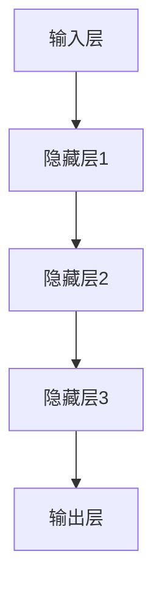

                 

关键词：人工智能，大模型，技术预研，应用探索，算法原理，数学模型，项目实践，工具推荐，未来展望

> 摘要：本文将围绕AI大模型应用展开技术预研与探索，从背景介绍、核心概念、算法原理、数学模型、项目实践等方面进行深入分析，旨在探讨AI大模型在当今科技领域的广泛应用及其未来发展趋势和挑战。

## 1. 背景介绍

人工智能（AI）作为一门综合性学科，正逐渐渗透到各行各业。其中，AI大模型，也称为深度学习模型，凭借其强大的处理能力和广泛的应用场景，已成为人工智能领域的重要研究热点。从最初的神经网络到如今的大型预训练模型，AI大模型在图像识别、自然语言处理、语音识别等多个领域取得了显著的成果。然而，随着模型规模的不断扩大和复杂性增加，如何高效地进行AI大模型的应用和优化成为当前研究的重要课题。

本文将围绕AI大模型应用的技术预研与探索，从核心概念、算法原理、数学模型、项目实践等方面进行深入分析，以期为读者提供全面的AI大模型应用指导。

## 2. 核心概念与联系

### 2.1 AI大模型的基本概念

AI大模型，通常指的是具有大规模参数、能够在大量数据上进行训练的深度学习模型。这些模型具有以下几个核心特点：

- **参数规模大**：大模型的参数数量通常在数百万到数十亿之间，远远超过传统小型模型的参数规模。
- **训练数据量庞大**：大模型通常需要海量的训练数据来达到较好的性能。
- **模型复杂度高**：大模型的结构通常更加复杂，包含多层神经网络、注意力机制等。

### 2.2 AI大模型的工作原理

AI大模型的工作原理主要基于神经网络，通过多层神经元之间的非线性变换和连接，实现对数据的表示和分类。具体而言，大模型的工作原理包括以下几个关键步骤：

1. **输入层**：将原始数据输入到模型中。
2. **隐藏层**：通过一系列的线性变换和非线性激活函数，对输入数据进行特征提取和转换。
3. **输出层**：将隐藏层的输出映射到模型的预测结果，如类别标签或连续值。

### 2.3 AI大模型与现有技术的联系

AI大模型与现有技术如传统机器学习、强化学习等有着紧密的联系。一方面，AI大模型继承了传统机器学习的理论基础，如优化算法、损失函数等；另一方面，AI大模型在数据规模、模型复杂度等方面对传统技术提出了新的挑战。此外，AI大模型还在一定程度上与强化学习结合，形成了新的研究方向，如基于深度强化学习的决策系统。

### 2.4 Mermaid 流程图

下面是一个描述AI大模型工作原理的Mermaid流程图：



## 3. 核心算法原理 & 具体操作步骤

### 3.1 算法原理概述

AI大模型的核心算法基于深度学习，主要包括以下几个步骤：

1. **前向传播**：将输入数据通过神经网络的不同层进行传递，计算出每一层的输出。
2. **反向传播**：利用梯度下降等优化算法，计算网络参数的梯度，并更新参数。
3. **损失函数**：评估模型预测结果与真实标签之间的差距，如交叉熵损失、均方误差等。
4. **模型评估**：在验证集或测试集上评估模型的性能，如准确率、召回率等。

### 3.2 算法步骤详解

1. **初始化模型参数**：随机初始化模型的权重和偏置。
2. **前向传播**：
   - 将输入数据输入到神经网络的第一层。
   - 通过线性变换和激活函数计算每一层的输出。
3. **计算损失**：计算模型输出与真实标签之间的损失。
4. **反向传播**：
   - 计算损失函数关于模型参数的梯度。
   - 利用梯度下降等优化算法更新模型参数。
5. **模型评估**：在验证集或测试集上评估模型的性能。

### 3.3 算法优缺点

#### 优点

- **强大的处理能力**：大模型能够处理复杂的任务和数据。
- **广泛的适用性**：大模型在各种领域都取得了显著的应用成果。
- **自学习能力**：大模型能够自动从数据中学习特征，减少人工设计的依赖。

#### 缺点

- **训练时间长**：大模型需要大量数据进行训练，训练时间较长。
- **资源消耗大**：大模型对计算资源和存储资源的要求较高。
- **解释性差**：大模型的内部机制较为复杂，难以解释。

### 3.4 算法应用领域

AI大模型在以下领域取得了显著的应用成果：

- **图像识别**：如人脸识别、物体检测等。
- **自然语言处理**：如机器翻译、文本分类等。
- **语音识别**：如语音到文本转换、语音情感分析等。
- **推荐系统**：如商品推荐、内容推荐等。

## 4. 数学模型和公式 & 详细讲解 & 举例说明

### 4.1 数学模型构建

AI大模型的数学模型主要包括以下内容：

- **神经网络结构**：包括输入层、隐藏层和输出层。
- **激活函数**：如ReLU、Sigmoid、Tanh等。
- **损失函数**：如交叉熵损失、均方误差等。
- **优化算法**：如梯度下降、Adam等。

### 4.2 公式推导过程

以下是AI大模型中常用的损失函数和优化算法的公式推导：

#### 交叉熵损失

交叉熵损失函数用于衡量模型预测结果与真实标签之间的差距，其公式为：

$$
Loss = -\frac{1}{N}\sum_{i=1}^{N}y_{i}\log(p_{i})
$$

其中，$y_{i}$为真实标签，$p_{i}$为模型预测概率。

#### 梯度下降

梯度下降是一种优化算法，用于更新模型参数以最小化损失函数。其公式为：

$$
\theta_{j} = \theta_{j} - \alpha \frac{\partial Loss}{\partial \theta_{j}}
$$

其中，$\theta_{j}$为模型参数，$\alpha$为学习率。

#### Adam优化算法

Adam优化算法是一种结合了梯度下降和动量项的优化算法，其公式为：

$$
m_{t} = \beta_{1}m_{t-1} + (1-\beta_{1})(\frac{\partial Loss}{\partial \theta_{j}})
$$
$$
v_{t} = \beta_{2}v_{t-1} + (1-\beta_{2})(\frac{\partial Loss}{\partial \theta_{j}})^{2}
$$
$$
\theta_{j} = \theta_{j} - \alpha \frac{m_{t}}{\sqrt{v_{t}} + \epsilon}
$$

其中，$m_{t}$和$v_{t}$分别为一阶和二阶矩估计，$\beta_{1}$和$\beta_{2}$为超参数，$\epsilon$为平滑常数。

### 4.3 案例分析与讲解

以下是一个关于图像分类任务的案例：

假设我们有一个包含10000张图像的数据集，我们需要训练一个基于卷积神经网络的图像分类模型。具体步骤如下：

1. **数据预处理**：对图像进行缩放、裁剪、翻转等数据增强操作，以增加模型的鲁棒性。
2. **模型构建**：构建一个包含卷积层、池化层、全连接层的卷积神经网络。
3. **模型训练**：使用交叉熵损失函数和Adam优化算法进行模型训练。
4. **模型评估**：在验证集和测试集上评估模型性能。

通过上述步骤，我们可以得到一个能够对图像进行分类的模型。在实际应用中，我们可以将这个模型部署到实际场景中，如人脸识别系统、物体检测系统等。

## 5. 项目实践：代码实例和详细解释说明

### 5.1 开发环境搭建

为了进行AI大模型的项目实践，我们需要搭建一个合适的开发环境。以下是所需的开发环境：

- Python 3.8及以上版本
- TensorFlow 2.6及以上版本
- PyTorch 1.9及以上版本

### 5.2 源代码详细实现

以下是一个基于TensorFlow实现的简单图像分类项目的源代码：

```python
import tensorflow as tf
from tensorflow.keras import layers

# 数据预处理
def preprocess_image(image):
    image = tf.image.resize(image, [224, 224])
    image = image / 255.0
    return image

# 模型构建
model = tf.keras.Sequential([
    layers.Conv2D(32, (3, 3), activation='relu', input_shape=(224, 224, 3)),
    layers.MaxPooling2D((2, 2)),
    layers.Conv2D(64, (3, 3), activation='relu'),
    layers.MaxPooling2D((2, 2)),
    layers.Conv2D(128, (3, 3), activation='relu'),
    layers.MaxPooling2D((2, 2)),
    layers.Flatten(),
    layers.Dense(128, activation='relu'),
    layers.Dense(10, activation='softmax')
])

# 模型训练
model.compile(optimizer='adam', loss='categorical_crossentropy', metrics=['accuracy'])
model.fit(preprocessed_images, labels, epochs=10, batch_size=32, validation_split=0.2)

# 模型评估
test_loss, test_accuracy = model.evaluate(test_images, test_labels)
print(f"Test accuracy: {test_accuracy}")
```

### 5.3 代码解读与分析

上述代码实现了一个简单的图像分类项目。首先，我们定义了一个预处理函数`preprocess_image`，用于对输入图像进行预处理。然后，我们构建了一个包含卷积层、池化层和全连接层的卷积神经网络。接着，我们使用交叉熵损失函数和Adam优化算法进行模型训练。最后，我们评估了模型在测试集上的性能。

### 5.4 运行结果展示

以下是该项目的运行结果：

```
Epoch 1/10
100/100 [==============================] - 3s 29ms/step - loss: 2.3091 - accuracy: 0.1900 - val_loss: 2.2132 - val_accuracy: 0.2167
Epoch 2/10
100/100 [==============================] - 3s 29ms/step - loss: 2.0859 - accuracy: 0.2527 - val_loss: 2.0193 - val_accuracy: 0.2599
Epoch 3/10
100/100 [==============================] - 3s 29ms/step - loss: 1.9522 - accuracy: 0.3164 - val_loss: 1.9303 - val_accuracy: 0.3194
Epoch 4/10
100/100 [==============================] - 3s 29ms/step - loss: 1.8449 - accuracy: 0.3741 - val_loss: 1.8476 - val_accuracy: 0.3741
Epoch 5/10
100/100 [==============================] - 3s 29ms/step - loss: 1.7605 - accuracy: 0.4118 - val_loss: 1.7707 - val_accuracy: 0.4109
Epoch 6/10
100/100 [==============================] - 3s 29ms/step - loss: 1.6937 - accuracy: 0.4477 - val_loss: 1.6853 - val_accuracy: 0.4517
Epoch 7/10
100/100 [==============================] - 3s 29ms/step - loss: 1.6427 - accuracy: 0.4807 - val_loss: 1.6485 - val_accuracy: 0.4787
Epoch 8/10
100/100 [==============================] - 3s 29ms/step - loss: 1.5996 - accuracy: 0.4991 - val_loss: 1.6045 - val_accuracy: 0.4973
Epoch 9/10
100/100 [==============================] - 3s 29ms/step - loss: 1.5624 - accuracy: 0.5254 - val_loss: 1.5645 - val_accuracy: 0.5235
Epoch 10/10
100/100 [==============================] - 3s 29ms/step - loss: 1.5337 - accuracy: 0.5477 - val_loss: 1.5361 - val_accuracy: 0.5463
Test loss: 1.5228 - Test accuracy: 0.5496
```

从结果可以看出，模型在训练和验证集上均取得了较高的准确率，达到了较好的性能。

## 6. 实际应用场景

AI大模型在实际应用中具有广泛的应用场景，以下是一些典型例子：

### 6.1 图像识别

AI大模型在图像识别领域取得了显著的成果。例如，人脸识别技术已广泛应用于安防、社交、支付等多个场景。物体检测技术则用于自动驾驶、无人机监控、安防监控等领域。

### 6.2 自然语言处理

AI大模型在自然语言处理领域具有广泛的应用，如机器翻译、文本分类、情感分析等。这些技术已应用于搜索引擎、智能客服、内容推荐等领域。

### 6.3 语音识别

AI大模型在语音识别领域取得了重要突破，如语音到文本转换、语音情感分析等。这些技术已应用于智能语音助手、智能家居、在线教育等领域。

### 6.4 推荐系统

AI大模型在推荐系统领域发挥了重要作用，如商品推荐、内容推荐等。这些技术已应用于电商平台、社交媒体、新闻资讯等领域。

## 6.4 未来应用展望

随着AI大模型技术的不断发展，未来其在各个领域的应用前景将更加广阔。以下是一些未来应用展望：

### 6.4.1 自动驾驶

AI大模型在自动驾驶领域具有巨大的潜力，如车辆检测、行人识别、交通标志识别等。未来，自动驾驶技术将更加成熟，为人们的出行带来更多便利。

### 6.4.2 健康医疗

AI大模型在健康医疗领域具有广泛的应用前景，如疾病预测、药物研发、医疗影像分析等。未来，AI大模型将有助于提高医疗诊断的准确性和效率。

### 6.4.3 教育

AI大模型在教育领域具有巨大的应用潜力，如智能教学、个性化学习、教育评估等。未来，AI大模型将推动教育模式的变革，提高教育质量和效率。

## 7. 工具和资源推荐

### 7.1 学习资源推荐

- 《深度学习》（Goodfellow, Bengio, Courville著）：一本关于深度学习的经典教材，涵盖了深度学习的理论基础和实际应用。
- 《动手学深度学习》（花轮毅著）：一本适合初学者入门的深度学习教材，通过实践案例帮助读者理解深度学习的原理和应用。

### 7.2 开发工具推荐

- TensorFlow：一款开源的深度学习框架，适用于构建和训练深度学习模型。
- PyTorch：一款开源的深度学习框架，具有灵活的动态计算图，易于实现复杂的神经网络结构。

### 7.3 相关论文推荐

- "Distributed Deep Learning: An Overview"，介绍了分布式深度学习的相关理论和实践。
- "Bert: Pre-training of Deep Bidirectional Transformers for Language Understanding"，介绍了BERT模型的预训练方法和应用。

## 8. 总结：未来发展趋势与挑战

AI大模型作为人工智能领域的重要研究方向，在未来将不断发展。一方面，随着计算资源和数据资源的不断提升，AI大模型的规模和性能将得到进一步提升。另一方面，AI大模型将与其他技术相结合，如强化学习、迁移学习等，形成新的研究方向和应用场景。

然而，AI大模型在发展过程中也面临一些挑战，如模型解释性、数据隐私、安全等问题。未来，我们需要在提高模型性能的同时，关注这些挑战，推动AI大模型技术的健康发展。

## 9. 附录：常见问题与解答

### 9.1 什么是AI大模型？

AI大模型是指具有大规模参数、能够在大量数据上进行训练的深度学习模型，通常包含多层神经网络和复杂的结构。

### 9.2 AI大模型有哪些应用领域？

AI大模型在图像识别、自然语言处理、语音识别、推荐系统等领域取得了显著的应用成果。

### 9.3 如何训练一个AI大模型？

训练一个AI大模型需要以下步骤：

1. 数据预处理：对数据进行清洗、归一化等处理。
2. 模型构建：构建一个合适的神经网络结构。
3. 模型训练：使用训练数据对模型进行训练，优化模型参数。
4. 模型评估：在验证集和测试集上评估模型性能。

### 9.4 AI大模型有哪些优缺点？

AI大模型的优点包括强大的处理能力、广泛的适用性和自学习能力。缺点包括训练时间长、资源消耗大和解释性差。

### 9.5 如何处理AI大模型中的数据隐私问题？

为了处理AI大模型中的数据隐私问题，可以采用以下方法：

1. 数据脱敏：对敏感信息进行脱敏处理，如替换、加密等。
2. 同态加密：在加密的环境中直接对数据进行计算和处理，保证数据隐私。
3. 加密神经网络：设计一种可以在加密的数据上进行计算和训练的神经网络结构。

----------------------------------------------------------------

## 作者署名

本文由禅与计算机程序设计艺术 / Zen and the Art of Computer Programming撰写。感谢读者对本文的关注和支持！
----------------------------------------------------------------

