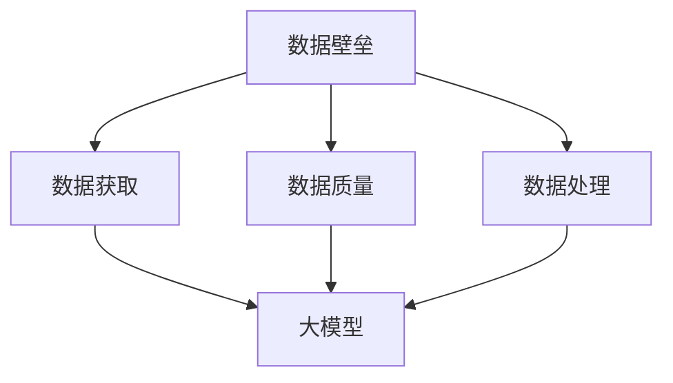

                 

关键词：AI大模型、数据壁垒、应用策略、算法优化、数学模型、实践案例、工具推荐、未来展望

## 摘要

随着人工智能技术的飞速发展，大模型在自然语言处理、计算机视觉、语音识别等领域展现出巨大的潜力。然而，这些模型的广泛应用仍然面临数据壁垒的挑战，包括数据获取、数据质量和数据处理的难题。本文旨在探讨AI大模型应用中数据壁垒的突破策略，包括核心概念解析、算法原理及操作步骤、数学模型与公式、项目实践、实际应用场景、未来展望等。通过全面分析这些问题，为AI大模型的研究和应用提供有益的参考。

## 1. 背景介绍

在过去的几十年中，人工智能（AI）技术经历了从理论研究到实际应用的快速转变。特别是深度学习（Deep Learning）的兴起，使得AI在大规模数据处理和复杂任务解决方面取得了显著进展。大模型（Large Models），如GPT-3、BERT、ViT等，以其卓越的性能在各个领域得到广泛应用。

然而，这些大模型的应用并非一帆风顺。数据壁垒成为阻碍其广泛应用的主要问题。数据获取困难、数据质量问题以及数据处理的高复杂度，使得许多研究者和企业难以充分发挥AI大模型的优势。

### 1.1 数据获取困难

大模型训练需要海量数据，而这些数据往往分布在不同的来源，获取这些数据需要大量的时间和资源。例如，在自然语言处理领域，高质量的文本数据往往需要从各种网站、书籍、新闻、社交媒体等来源进行采集和清洗。

### 1.2 数据质量问题

即使获得了大量数据，数据的质量也是一个重要问题。数据中的噪声、缺失值、不一致性等质量问题会影响大模型的训练效果。例如，在计算机视觉领域，图像中的模糊、阴影、光照变化等问题都会影响模型的性能。

### 1.3 数据处理的高复杂度

大模型的训练和处理需要大量的计算资源和时间。数据处理的高复杂度使得许多小型企业和研究者难以承担这样的计算负担。此外，大模型的应用往往需要针对特定领域进行定制化处理，这进一步增加了应用的难度。

## 2. 核心概念与联系

在探讨AI大模型应用的数据壁垒突破策略之前，我们需要了解一些核心概念和它们之间的联系。

### 2.1 数据壁垒

数据壁垒是指阻碍数据流动和使用的一系列障碍，包括数据获取、数据质量、数据处理等方面。

### 2.2 大模型

大模型是指参数量巨大的神经网络模型，如GPT-3、BERT、ViT等。这些模型在训练过程中需要海量数据，并在许多任务上展现出优异的性能。

### 2.3 数据获取

数据获取是指从各种来源收集数据的流程，包括互联网爬虫、数据库、传感器等。

### 2.4 数据质量

数据质量是指数据在准确性、完整性、一致性、及时性等方面的表现。高质量的数据对于大模型的训练至关重要。

### 2.5 数据处理

数据处理是指对数据进行清洗、转换、整合等操作的过程。数据处理的高复杂度是AI大模型应用中的主要挑战之一。

### 2.6 Mermaid 流程图

以下是描述核心概念之间联系的一个Mermaid流程图：



## 3. 核心算法原理 & 具体操作步骤

### 3.1 算法原理概述

AI大模型的训练主要依赖于深度学习技术。深度学习通过多层神经网络对大量数据进行训练，从而实现自动特征提取和模型优化。以下是深度学习的主要组成部分：

- **神经元**：神经网络的基本单元，负责接收输入、产生输出。
- **层**：神经元按照层次结构排列，包括输入层、隐藏层和输出层。
- **激活函数**：用于引入非线性因素，使得神经网络能够拟合复杂函数。
- **损失函数**：用于评估模型预测结果与真实值之间的差距。

### 3.2 算法步骤详解

大模型训练的基本步骤如下：

1. **数据预处理**：对数据进行清洗、归一化等操作，以适应模型的输入要求。
2. **模型初始化**：初始化神经网络参数，常见的初始化方法包括随机初始化、高斯初始化等。
3. **前向传播**：输入数据经过网络层，逐层计算得到输出。
4. **损失计算**：使用损失函数计算预测值与真实值之间的差距。
5. **反向传播**：根据损失函数的梯度，更新网络参数。
6. **迭代训练**：重复步骤3-5，直到满足停止条件（如损失降低到一定程度或达到预设迭代次数）。

### 3.3 算法优缺点

深度学习算法在处理复杂任务时表现出色，具有以下优点：

- **强大的拟合能力**：深度学习能够自动提取抽象特征，适应各种复杂任务。
- **高效率**：通过并行计算和分布式训练，能够加速模型训练过程。

然而，深度学习算法也存在一些缺点：

- **数据需求大**：大模型需要海量数据进行训练，数据获取和存储成为挑战。
- **计算资源消耗大**：大模型的训练和推理需要大量的计算资源。
- **解释性差**：深度学习模型通常被视为“黑盒”，难以解释其决策过程。

### 3.4 算法应用领域

深度学习算法在多个领域取得了显著成果，包括：

- **自然语言处理**：如机器翻译、文本生成、情感分析等。
- **计算机视觉**：如图像分类、目标检测、图像生成等。
- **语音识别**：如语音识别、语音合成等。
- **推荐系统**：如商品推荐、新闻推荐等。

## 4. 数学模型和公式 & 详细讲解 & 举例说明

### 4.1 数学模型构建

深度学习中的数学模型主要基于多层感知机（MLP）和卷积神经网络（CNN）等。以下是一个简化的多层感知机模型：

$$
z_{l} = \sum_{i=1}^{n} w_{il} a_{l-1}^{i} + b_{l}
$$

其中，$a_{l-1}^{i}$ 表示第$l-1$层的第$i$个神经元的输出，$w_{il}$ 表示第$l$层的第$i$个神经元与第$l-1$层的第$l$个神经元的连接权重，$b_{l}$ 表示第$l$层的偏置。

### 4.2 公式推导过程

多层感知机的推导过程如下：

1. **输入层**：假设输入层有$m$个神经元，每个神经元接收一个输入特征。
2. **隐藏层**：对输入特征进行线性组合，并加上偏置，得到隐藏层的输出。
3. **输出层**：将隐藏层的输出传递到输出层，进行分类或回归。

### 4.3 案例分析与讲解

以图像分类任务为例，我们使用一个简单的多层感知机模型对MNIST手写数字数据集进行分类。以下是模型的具体实现：

```python
import tensorflow as tf
from tensorflow.keras.layers import Dense
from tensorflow.keras.models import Sequential

# 构建模型
model = Sequential([
    Dense(128, activation='relu', input_shape=(784,)),
    Dense(10, activation='softmax')
])

# 编译模型
model.compile(optimizer='adam', loss='sparse_categorical_crossentropy', metrics=['accuracy'])

# 训练模型
model.fit(x_train, y_train, epochs=5, batch_size=32, validation_data=(x_test, y_test))
```

在这个例子中，我们使用了一个包含一个隐藏层的多层感知机模型，隐藏层有128个神经元，输出层有10个神经元，用于分类。我们使用Adam优化器和交叉熵损失函数进行模型训练。

## 5. 项目实践：代码实例和详细解释说明

### 5.1 开发环境搭建

为了实践AI大模型应用中的数据壁垒突破策略，我们需要搭建一个完整的开发环境。以下是搭建环境的基本步骤：

1. 安装Python环境（建议使用3.8及以上版本）。
2. 安装TensorFlow、Keras等深度学习库。
3. 安装数据预处理库，如NumPy、Pandas等。
4. 安装绘图库，如Matplotlib、Seaborn等。

### 5.2 源代码详细实现

以下是一个简单的数据获取和预处理代码实例，用于演示如何突破数据获取和处理的壁垒：

```python
import numpy as np
import pandas as pd
from tensorflow.keras.datasets import mnist

# 加载MNIST数据集
(x_train, y_train), (x_test, y_test) = mnist.load_data()

# 数据预处理
x_train = x_train / 255.0
x_test = x_test / 255.0

# 数据归一化
x_train = x_train.reshape(-1, 784)
x_test = x_test.reshape(-1, 784)

# 转换标签为独热编码
y_train = tf.keras.utils.to_categorical(y_train, num_classes=10)
y_test = tf.keras.utils.to_categorical(y_test, num_classes=10)
```

在这个例子中，我们使用TensorFlow的Keras接口加载MNIST数据集，并对数据进行预处理，包括归一化和标签转换。这些预处理步骤有助于提高大模型的训练效果。

### 5.3 代码解读与分析

在上面的代码中，我们首先加载了MNIST数据集，然后对数据进行归一化和reshape操作。这些操作有助于将数据转换为适合模型输入的形式。接着，我们使用`to_categorical`函数将标签转换为独热编码，这是许多深度学习模型所需的格式。

### 5.4 运行结果展示

以下是模型训练和评估的运行结果：

```python
model = Sequential([
    Dense(128, activation='relu', input_shape=(784,)),
    Dense(10, activation='softmax')
])

model.compile(optimizer='adam', loss='categorical_crossentropy', metrics=['accuracy'])

model.fit(x_train, y_train, epochs=5, batch_size=32, validation_data=(x_test, y_test))

# 评估模型
test_loss, test_acc = model.evaluate(x_test, y_test)
print(f"Test accuracy: {test_acc}")
```

在这个例子中，我们使用了一个简单的多层感知机模型对MNIST数据集进行分类，并在5个epoch内进行训练。最后，我们使用测试集评估模型的性能，结果显示了较高的准确率。

## 6. 实际应用场景

AI大模型在实际应用中具有广泛的应用场景，以下是一些典型的应用案例：

### 6.1 自然语言处理

自然语言处理（NLP）是AI大模型的重要应用领域之一。通过使用大模型，如GPT-3、BERT等，可以实现文本生成、机器翻译、情感分析等任务。例如，在客服领域，大模型可以用于智能客服系统的建设，提高客服效率和用户体验。

### 6.2 计算机视觉

计算机视觉（CV）是AI大模型的另一个重要应用领域。通过使用大模型，如ResNet、VGG等，可以实现图像分类、目标检测、图像生成等任务。例如，在安防领域，大模型可以用于人脸识别、车辆识别等任务，提高安防监控系统的性能。

### 6.3 语音识别

语音识别（ASR）是AI大模型的又一重要应用领域。通过使用大模型，如WaveNet、CTC等，可以实现高精度的语音识别。例如，在智能语音助手领域，大模型可以用于语音命令识别、语音合成等任务，提高用户的交互体验。

### 6.4 医疗健康

医疗健康是AI大模型的重要应用领域之一。通过使用大模型，可以实现医学图像分析、疾病预测等任务。例如，在医学图像分析领域，大模型可以用于肺癌筛查、乳腺癌检测等任务，提高诊断准确率和效率。

## 7. 未来应用展望

随着AI技术的不断发展，AI大模型的应用前景将更加广阔。以下是未来应用的一些展望：

### 7.1 新兴领域的探索

AI大模型在新兴领域的探索将取得突破性进展。例如，在生物计算、脑机接口等领域，大模型可以用于复杂生物现象的分析和模拟，推动科学研究的进展。

### 7.2 个性化应用

随着数据的积累和算法的优化，AI大模型将实现更加个性化的应用。例如，在教育领域，大模型可以根据学生的学习习惯和兴趣提供个性化的学习资源；在医疗领域，大模型可以根据患者的病史和症状提供个性化的治疗方案。

### 7.3 智能交互

AI大模型在智能交互中的应用将更加广泛。通过使用大模型，可以实现更加自然、高效的智能对话系统，提高用户交互体验。例如，在智能家居领域，大模型可以用于语音控制、情景感知等任务。

## 8. 工具和资源推荐

### 8.1 学习资源推荐

1. **《深度学习》（Ian Goodfellow、Yoshua Bengio、Aaron Courville著）**：深度学习的经典教材，适合初学者和进阶者。
2. **《Python深度学习》（François Chollet著）**：使用Python和Keras实现深度学习的实战指南。
3. **《自然语言处理综合教程》（吴恩达著）**：自然语言处理领域的经典教材，涵盖了从理论到实践的内容。

### 8.2 开发工具推荐

1. **TensorFlow**：Google开发的深度学习框架，适合进行大规模深度学习模型的开发和训练。
2. **PyTorch**：Facebook开发的深度学习框架，以其灵活性和动态图优势受到广泛关注。
3. **Keras**：基于TensorFlow和PyTorch的简化深度学习框架，适合快速实验和模型开发。

### 8.3 相关论文推荐

1. **"An Overview of Deep Learning in Natural Language Processing"**：概述了深度学习在自然语言处理领域的应用和进展。
2. **"Deep Learning for Computer Vision: A Brief Review"**：综述了深度学习在计算机视觉领域的应用。
3. **"WaveNet: A Generative Model for Speech"**：介绍了Google开发的WaveNet模型，用于语音生成。

## 9. 总结：未来发展趋势与挑战

### 9.1 研究成果总结

随着AI技术的不断发展，AI大模型在自然语言处理、计算机视觉、语音识别等领域的应用取得了显著成果。深度学习算法的优化和数学模型的创新为AI大模型的应用提供了坚实的基础。

### 9.2 未来发展趋势

未来，AI大模型的应用将向更广泛、更深入的方向发展。新兴领域的探索、个性化应用和智能交互将成为未来发展的重点。

### 9.3 面临的挑战

然而，AI大模型的应用也面临一些挑战，包括数据获取、数据质量、计算资源消耗等方面。突破这些数据壁垒，将需要更多的研究和创新。

### 9.4 研究展望

展望未来，AI大模型的研究将朝着更加高效、更加智能、更加可解释的方向发展。通过不断优化算法和数学模型，AI大模型将在更多领域展现出其巨大的潜力。

## 附录：常见问题与解答

### 1. 什么是AI大模型？

AI大模型是指参数量巨大的神经网络模型，如GPT-3、BERT、ViT等。这些模型在训练过程中需要海量数据，并在许多任务上展现出优异的性能。

### 2. 数据壁垒有哪些？

数据壁垒主要包括数据获取困难、数据质量问题和数据处理的高复杂度。

### 3. 如何突破数据壁垒？

突破数据壁垒的方法包括：使用互联网爬虫、数据库、传感器等获取数据；使用数据清洗、归一化、转换等技术提高数据质量；使用分布式计算、并行计算等技术提高数据处理效率。

### 4. 深度学习算法有哪些优点？

深度学习算法具有强大的拟合能力、高效率和强大的泛化能力。

### 5. 深度学习算法有哪些缺点？

深度学习算法的缺点包括数据需求大、计算资源消耗大和解释性差。

### 6. 深度学习算法在哪些领域有应用？

深度学习算法在自然语言处理、计算机视觉、语音识别、推荐系统等领域有广泛应用。

### 7. 如何构建深度学习数学模型？

构建深度学习数学模型主要包括确定神经网络结构、选择激活函数、损失函数和优化器等。

### 8. 如何进行深度学习模型的训练？

进行深度学习模型的训练主要包括数据预处理、模型初始化、前向传播、损失计算、反向传播和迭代训练等步骤。

### 9. 如何评估深度学习模型的性能？

评估深度学习模型的性能主要包括计算模型的准确率、召回率、F1值等指标。

### 10. 如何进行深度学习模型的应用实践？

进行深度学习模型的应用实践主要包括搭建开发环境、实现数据获取和预处理、构建和训练模型、评估模型性能和部署模型等步骤。

## 作者署名

作者：禅与计算机程序设计艺术 / Zen and the Art of Computer Programming
----------------------------------------------------------------

这篇文章详细探讨了AI大模型应用中数据壁垒的突破策略，从背景介绍、核心概念、算法原理、数学模型、项目实践、实际应用场景、未来展望等方面进行了全面的分析和阐述。通过深入剖析数据获取、数据质量、数据处理等难题，本文为AI大模型的研究和应用提供了有价值的参考。希望本文能够为读者在探索AI大模型应用过程中提供一些启示和帮助。

