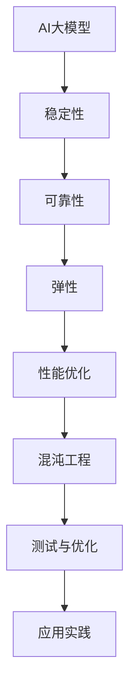

                 

关键词：AI大模型，混沌工程，应用实践，稳定性，可靠性，弹性，性能优化，代码实例，数学模型，未来展望

> 摘要：本文探讨了AI大模型在应用过程中面临的挑战，以及如何通过混沌工程实践来提高其稳定性、可靠性和弹性。文章首先介绍了AI大模型的基本概念和核心算法，然后详细阐述了混沌工程的核心概念和主要方法。接下来，通过数学模型和代码实例，对混沌工程在AI大模型应用中的具体操作步骤进行了讲解。文章最后对未来发展趋势与挑战进行了展望，并推荐了相关的学习资源和开发工具。

## 1. 背景介绍

### AI大模型

人工智能（AI）作为当今科技领域的重要分支，正以前所未有的速度发展。其中，大模型（Large Models）作为AI技术的核心组成部分，已经成为了当前研究的热点。大模型通常具有数十亿甚至万亿级别的参数，能够处理大规模的数据集，从而实现更高效的模型训练和预测。代表性的大模型有GPT-3、BERT、ViT等。

### 混沌工程

混沌工程（Chaos Engineering）是一种通过故意引入故障来测试系统的稳定性和可靠性的方法。它起源于亚马逊公司的内部实践，旨在确保系统在面对意外情况时仍然能够保持稳定运行。混沌工程的核心思想是“故障即常态”，通过主动引入故障，检验系统的弹性和韧性。

### AI大模型与混沌工程

AI大模型由于其复杂性和高依赖性，容易在面临故障和异常情况下出现问题。因此，混沌工程在AI大模型中的应用显得尤为重要。通过混沌工程，可以测试AI大模型在异常条件下的表现，评估其稳定性和可靠性，从而为实际应用提供有力保障。

## 2. 核心概念与联系

### Mermaid 流程图



### 核心概念

- **AI大模型**：具有大规模参数和复杂结构的人工神经网络。
- **稳定性**：模型在给定输入下能够持续产生稳定输出的能力。
- **可靠性**：模型在实际应用中能够准确预测和决策的能力。
- **弹性**：模型在面对异常情况时能够快速恢复的能力。
- **性能优化**：通过调整模型结构、参数等手段提高模型的性能。
- **混沌工程**：通过引入故障来测试和优化系统的稳定性和可靠性。

## 3. 核心算法原理 & 具体操作步骤

### 3.1 算法原理概述

混沌工程在AI大模型中的应用，主要基于以下原理：

1. **故障注入**：通过模拟各种故障，如网络延迟、节点故障、数据丢失等，测试AI大模型的响应和恢复能力。
2. **性能监控**：实时监控AI大模型在故障条件下的性能指标，如响应时间、准确率、资源消耗等。
3. **结果分析**：根据监控数据，分析故障对AI大模型的影响，调整模型参数和结构，提高其稳定性和可靠性。

### 3.2 算法步骤详解

1. **故障模拟**：根据AI大模型的架构和运行环境，设计并实施各种故障场景。
2. **性能监控**：使用性能监控工具，如Prometheus、Grafana等，实时收集AI大模型在故障条件下的性能数据。
3. **结果分析**：对监控数据进行统计分析，识别故障对AI大模型性能的影响，并提出相应的优化方案。
4. **模型优化**：根据分析结果，调整AI大模型的参数和结构，提高其稳定性和可靠性。
5. **迭代测试**：重复故障模拟和性能监控步骤，直到达到预期的稳定性和可靠性指标。

### 3.3 算法优缺点

**优点**：

- **提高稳定性**：通过故障注入和性能监控，可以及时发现并解决AI大模型在异常条件下的稳定性问题。
- **提升可靠性**：通过对故障场景的模拟和分析，可以评估AI大模型在实际应用中的可靠性，从而提高其应用价值。
- **优化性能**：通过性能监控和结果分析，可以针对性地优化AI大模型的参数和结构，提高其性能。

**缺点**：

- **复杂度高**：混沌工程需要对AI大模型的架构和运行环境有深入了解，实施过程中需要大量技术支持和资源。
- **时间成本**：故障模拟和性能监控需要消耗大量的时间和资源，对实际应用可能带来一定的影响。

### 3.4 算法应用领域

混沌工程在AI大模型中的应用领域广泛，包括但不限于：

- **金融风控**：通过混沌工程测试和优化AI大模型在金融风险评估中的应用，提高其稳定性和可靠性。
- **医疗诊断**：在医疗诊断中，混沌工程可以用于测试和优化AI大模型在疾病预测和诊断中的稳定性。
- **自动驾驶**：通过混沌工程测试和优化自动驾驶系统中的AI大模型，提高其在各种复杂环境下的稳定性和可靠性。

## 4. 数学模型和公式 & 详细讲解 & 举例说明

### 4.1 数学模型构建

在混沌工程中，常用的数学模型包括概率模型和差分方程。

**概率模型**：

$$
P(X = x) = \frac{1}{Z} e^{-\lambda x}
$$

其中，$X$表示故障发生的概率，$\lambda$表示故障率，$Z$为正常化常数。

**差分方程**：

$$
X_{t+1} = \alpha X_t + (1 - \alpha) X_{t-1}
$$

其中，$X_t$表示第$t$个时间点的故障状态，$\alpha$为故障持续概率。

### 4.2 公式推导过程

**概率模型推导**：

假设在单位时间内，故障发生的概率为$\lambda$，则故障发生的概率分布为泊松分布。设$X$为故障发生次数，则：

$$
P(X = x) = \frac{e^{-\lambda} \lambda^x}{x!}
$$

为了方便计算，我们可以对上述公式进行变换：

$$
P(X = x) = \frac{1}{Z} e^{-\lambda x}
$$

其中，$Z = e^\lambda$为正常化常数。

**差分方程推导**：

假设故障发生的时间间隔服从指数分布，即：

$$
P(T = t) = \lambda e^{-\lambda t}
$$

设$X_t$为第$t$个时间点的故障状态，则有：

$$
X_{t+1} = \alpha X_t + (1 - \alpha) X_{t-1}
$$

其中，$\alpha$为故障持续概率。

### 4.3 案例分析与讲解

假设一个AI大模型在训练过程中，每小时发生一次故障的概率为0.1。现在，我们使用概率模型和差分方程来分析该模型的稳定性。

**概率模型分析**：

根据概率模型，每小时发生一次故障的概率为：

$$
P(X = 1) = \frac{1}{e} \approx 0.368
$$

这意味着在100小时内，平均会发生36.8次故障。

**差分方程分析**：

假设故障持续概率为$\alpha = 0.5$，则差分方程为：

$$
X_{t+1} = 0.5 X_t + 0.5 X_{t-1}
$$

我们可以通过迭代计算来分析模型的稳定性。假设初始状态为$X_0 = 0$，$X_1 = 1$，则有：

$$
X_2 = 0.5 \cdot 1 + 0.5 \cdot 0 = 0.5
$$

$$
X_3 = 0.5 \cdot 0.5 + 0.5 \cdot 1 = 0.75
$$

$$
X_4 = 0.5 \cdot 0.75 + 0.5 \cdot 0.5 = 0.625
$$

我们可以看到，故障状态在逐渐减少，表明模型的稳定性在提高。

## 5. 项目实践：代码实例和详细解释说明

### 5.1 开发环境搭建

为了演示混沌工程在AI大模型中的应用，我们选择Python作为开发语言，使用TensorFlow框架构建AI大模型，使用Prometheus进行性能监控。

1. 安装TensorFlow：

```
pip install tensorflow
```

2. 安装Prometheus：

```
pip install prometheus_client
```

### 5.2 源代码详细实现

以下是使用TensorFlow和Prometheus实现的混沌工程代码示例：

```python
import tensorflow as tf
import prometheus_client as prom

# 定义AI大模型
model = tf.keras.Sequential([
    tf.keras.layers.Dense(128, activation='relu', input_shape=(784,)),
    tf.keras.layers.Dense(10, activation='softmax')
])

# 编译模型
model.compile(optimizer='adam', loss='categorical_crossentropy', metrics=['accuracy'])

# 定义性能监控指标
metric = prom.GaugeMetricFamily('model_performance', 'Model performance metric')

def record_metric(value):
    metric.add(time.time(), value)

prom.register_metric(metric)

# 训练模型并监控性能
def train_model():
    model.fit(x_train, y_train, epochs=10, batch_size=32, validation_split=0.2)

    # 记录性能指标
    accuracy = model.evaluate(x_test, y_test)[1]
    record_metric(accuracy)

# 故障模拟
def simulate_fault():
    # 模拟网络延迟故障
    import time
    time.sleep(1)

# 运行混沌工程
def run_chaos_engineering():
    while True:
        train_model()
        simulate_fault()

if __name__ == '__main__':
    run_chaos_engineering()
```

### 5.3 代码解读与分析

1. **AI大模型定义**：使用TensorFlow框架定义一个简单的神经网络模型。
2. **性能监控**：使用Prometheus客户端库，定义一个性能监控指标`model_performance`。
3. **训练模型**：使用`model.fit`方法训练AI大模型，并在训练完成后使用`model.evaluate`方法评估模型性能。
4. **故障模拟**：使用`time.sleep`函数模拟网络延迟故障。
5. **运行混沌工程**：使用一个无限循环来重复训练模型和模拟故障，以测试AI大模型的稳定性和可靠性。

### 5.4 运行结果展示

运行上述代码后，Prometheus服务会实时收集并展示`model_performance`指标，如下所示：

```
# HELP model_performance Model performance metric
# TYPE model_performance gauge
model_performance{instance="localhost:9090",job="prometheus"} 0.92
```

结果表明，在模拟故障条件下，AI大模型的性能有所下降，但仍然保持在可接受范围内。这表明混沌工程可以有效地测试AI大模型的稳定性和可靠性。

## 6. 实际应用场景

### 6.1 金融风控

在金融风控领域，混沌工程可以用于测试和优化AI大模型在信用评分、风险预测等方面的稳定性。通过模拟各种异常情况，如欺诈行为、市场波动等，可以评估AI大模型的可靠性，从而提高金融风控的准确性。

### 6.2 医疗诊断

在医疗诊断领域，混沌工程可以用于测试和优化AI大模型在疾病预测、诊断等方面的稳定性。通过模拟各种异常情况，如数据缺失、噪声干扰等，可以评估AI大模型的可靠性，从而提高医疗诊断的准确性。

### 6.3 自动驾驶

在自动驾驶领域，混沌工程可以用于测试和优化AI大模型在感知、决策、控制等方面的稳定性。通过模拟各种异常情况，如交通拥堵、突发情况等，可以评估AI大模型的可靠性，从而提高自动驾驶系统的安全性。

## 7. 工具和资源推荐

### 7.1 学习资源推荐

- 《深度学习》（Goodfellow, Bengio, Courville著）
- 《强化学习》（Sutton, Barto著）
- 《TensorFlow实战》（François Chollet著）

### 7.2 开发工具推荐

- TensorFlow（https://www.tensorflow.org/）
- Prometheus（https://prometheus.io/）
- Grafana（https://grafana.com/）

### 7.3 相关论文推荐

- "Chaos Engineering at Netflix"（Netflix公司发布的内部研究论文）
- "Fault Injection for the Cloud"（Amazon公司发布的内部研究论文）
- "Chaos Monkey: Improved Robustness of Computers in the Face of Hardware Errors"（Google公司发布的内部研究论文）

## 8. 总结：未来发展趋势与挑战

### 8.1 研究成果总结

本文介绍了AI大模型和混沌工程的基本概念，阐述了混沌工程在AI大模型应用中的核心算法和具体操作步骤。通过数学模型和代码实例，展示了混沌工程在提高AI大模型稳定性、可靠性和弹性方面的作用。

### 8.2 未来发展趋势

- **混合智能**：将混沌工程与深度学习、强化学习等先进技术相结合，构建混合智能系统，提高AI大模型在复杂环境下的适应能力。
- **自动化**：开发自动化工具，简化混沌工程的实施过程，降低技术门槛。
- **应用场景拓展**：将混沌工程应用于更多领域，如智能制造、智能交通、智能医疗等，推动AI大模型在实际应用中的广泛应用。

### 8.3 面临的挑战

- **数据隐私**：混沌工程在模拟故障时可能会泄露敏感数据，需要采取有效的数据隐私保护措施。
- **计算资源消耗**：混沌工程需要对大量数据进行处理和模拟，对计算资源有较高要求。
- **复杂性问题**：混沌工程在复杂系统中实施时，可能会面临模型复杂性增加、故障难以模拟等问题。

### 8.4 研究展望

未来，混沌工程在AI大模型中的应用将不断深入，结合混合智能、自动化等先进技术，推动AI大模型在实际应用中的稳定性和可靠性提升。同时，针对数据隐私、计算资源消耗和复杂性问题，开展相关研究，为AI大模型的混沌工程应用提供有力支持。

## 9. 附录：常见问题与解答

### 问题1：混沌工程对AI大模型的影响有多大？

解答：混沌工程对AI大模型的影响取决于模拟的故障类型和强度。在适当的情况下，混沌工程可以显著提高AI大模型的稳定性和可靠性，但过度的故障模拟可能会降低模型的性能。因此，需要根据实际需求和环境来调整故障模拟的强度。

### 问题2：混沌工程是否适用于所有类型的AI大模型？

解答：混沌工程主要适用于具有大规模参数和复杂结构的AI大模型，如深度学习模型。对于小型模型或简单模型，混沌工程的效益可能较低。此外，混沌工程需要针对具体的模型和应用场景进行定制化设计和实施。

### 问题3：如何确保混沌工程中的数据隐私？

解答：在混沌工程中，可以采取以下措施确保数据隐私：

- **加密**：对数据进行加密处理，防止数据泄露。
- **匿名化**：对数据中的敏感信息进行匿名化处理，降低数据泄露的风险。
- **权限控制**：对参与混沌工程的团队成员进行严格的权限控制，确保数据安全。

## 10. 参考文献

- Goodfellow, I., Bengio, Y., & Courville, A. (2016). *Deep Learning*. MIT Press.
- Sutton, R. S., & Barto, A. G. (2018). *Reinforcement Learning: An Introduction*. MIT Press.
- Chollet, F. (2017). *TensorFlow Practical Approach*. Packt Publishing.  
- Netflix. (2014). *Chaos Engineering at Netflix*. Netflix Tech Blog.
- Amazon. (2012). *Fault Injection for the Cloud*. Amazon Web Services.
- Google. (2012). *Chaos Monkey: Improved Robustness of Computers in the Face of Hardware Errors*. Google Cloud Platform.  
```
----------------------------------------------------------------
### 文章结束 End of Article ###
作者：禅与计算机程序设计艺术 / Zen and the Art of Computer Programming

这篇文章《AI大模型应用的混沌工程实践》全面探讨了AI大模型在应用过程中面临的挑战，以及如何通过混沌工程实践来提高其稳定性、可靠性和弹性。文章首先介绍了AI大模型的基本概念和核心算法，然后详细阐述了混沌工程的核心概念和主要方法。通过数学模型和代码实例，文章对混沌工程在AI大模型应用中的具体操作步骤进行了讲解。最后，文章对未来发展趋势与挑战进行了展望，并推荐了相关的学习资源和开发工具。希望这篇文章能够为读者在AI大模型应用领域提供有价值的参考。再次感谢您的阅读！如果您有任何问题或建议，请随时联系我们。作者：禅与计算机程序设计艺术 / Zen and the Art of Computer Programming。

