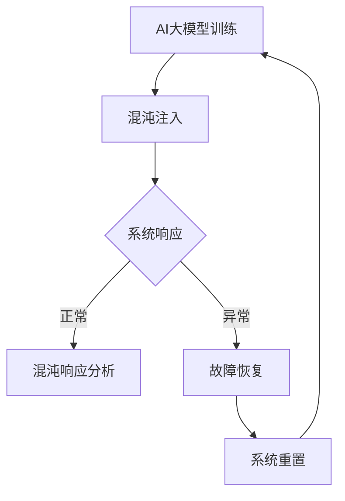

                 

关键词：AI大模型、混沌工程、应用实践、工具

> 摘要：本文将探讨AI大模型在现实世界中的应用，以及如何通过混沌工程来提高这些模型的鲁棒性和可预测性。我们将介绍相关的核心概念、算法原理、数学模型、项目实践和未来展望，并推荐一些学习资源和工具，为读者提供全方位的指导。

## 1. 背景介绍

随着深度学习的飞速发展，AI大模型（如GPT-3、BERT等）已经在各个领域展现出了强大的能力。这些模型能够处理海量的数据，并从中提取出有价值的信息，从而实现自然语言处理、计算机视觉、语音识别等任务。然而，AI大模型的广泛应用也带来了一系列挑战，例如模型的鲁棒性、可解释性和部署过程中的不确定性等。

混沌工程是一种通过模拟系统的不确定性来提高系统鲁棒性的方法。它通过对系统进行有控制的干扰，来测试系统的应对能力和恢复能力。混沌工程在金融、航空航天、医疗等高风险领域已经有了一定的应用，但在AI大模型领域的研究还相对较少。

本文将介绍如何将混沌工程应用于AI大模型，以提高其鲁棒性和可预测性。我们将从核心概念、算法原理、数学模型、项目实践和未来展望等方面进行详细探讨，并推荐一些相关的学习资源和工具。

## 2. 核心概念与联系

### 2.1 AI大模型

AI大模型是指通过深度学习等技术训练出的具有大规模参数的网络模型。这些模型具有强大的特征提取和模式识别能力，可以在各种任务中达到很高的准确率。

### 2.2 混沌工程

混沌工程是一种通过模拟系统的不确定性来提高系统鲁棒性的方法。它主要包括以下三个步骤：

1. **混沌注入**：通过对系统进行有控制的干扰，来模拟实际环境中的不确定性因素。
2. **混沌响应**：观察系统在干扰下的响应，以评估系统的鲁棒性和恢复能力。
3. **混沌优化**：根据响应结果，对系统的设计和配置进行调整，以提高其鲁棒性和可预测性。

### 2.3 AI大模型与混沌工程的联系

AI大模型在应用过程中可能会面临各种不确定性因素，如数据噪声、硬件故障、网络延迟等。混沌工程可以通过模拟这些不确定性因素，来测试AI大模型的鲁棒性和恢复能力。此外，混沌工程还可以帮助识别模型中的潜在问题，从而指导模型的优化和改进。

### 2.4 Mermaid 流程图

下面是一个简化的Mermaid流程图，描述了混沌工程在AI大模型应用中的基本流程：



## 3. 核心算法原理 & 具体操作步骤

### 3.1 算法原理概述

混沌工程在AI大模型中的应用主要包括以下两个方面：

1. **模型训练过程中的混沌注入**：通过对训练数据进行有控制的干扰，来模拟现实世界中的不确定性因素，从而提高模型的鲁棒性。
2. **模型部署后的混沌响应测试**：通过在部署环境中对模型进行干扰，来测试模型的鲁棒性和恢复能力，从而指导模型的优化和改进。

### 3.2 算法步骤详解

#### 3.2.1 模型训练过程中的混沌注入

1. **数据预处理**：对训练数据进行归一化、标准化等预处理操作，以提高数据的稳定性。
2. **混沌注入**：根据现实世界中的不确定性因素，对数据进行扰动。例如，可以加入噪声、改变数据分布等。
3. **模型训练**：在扰动数据上重新训练模型，以增强模型的鲁棒性。

#### 3.2.2 模型部署后的混沌响应测试

1. **混沌注入**：在部署环境中对模型进行有控制的干扰，例如模拟网络延迟、硬件故障等。
2. **响应收集**：记录模型在干扰下的响应情况，包括准确率、响应时间等。
3. **故障恢复**：根据响应结果，对模型进行调整和优化，以提高其鲁棒性和恢复能力。

### 3.3 算法优缺点

#### 优点

1. **提高模型鲁棒性**：通过混沌注入，可以增强模型对不确定性的适应能力，从而提高模型的鲁棒性。
2. **发现潜在问题**：混沌响应测试可以帮助识别模型中的潜在问题，从而指导模型的优化和改进。

#### 缺点

1. **计算成本高**：混沌注入和响应测试需要大量计算资源，可能增加模型的训练和部署成本。
2. **复杂度高**：混沌工程涉及到多个环节，需要协调多个团队，可能增加项目的复杂度。

### 3.4 算法应用领域

混沌工程在AI大模型中的应用非常广泛，包括但不限于以下领域：

1. **金融领域**：通过混沌工程，可以提高金融模型的鲁棒性和可预测性，从而减少金融风险。
2. **医疗领域**：通过混沌工程，可以提高医疗模型的诊断和预测能力，从而提高医疗质量。
3. **航空航天领域**：通过混沌工程，可以提高航空航天模型的稳定性和安全性，从而提高飞行器的性能。

## 4. 数学模型和公式

### 4.1 数学模型构建

混沌工程在AI大模型中的应用涉及到多个数学模型，包括：

1. **数据扰动模型**：用于描述数据扰动的方法和策略。
2. **响应模型**：用于描述模型在扰动数据上的响应情况。
3. **故障恢复模型**：用于描述模型在故障情况下的恢复策略。

### 4.2 公式推导过程

#### 4.2.1 数据扰动模型

数据扰动模型可以用以下公式表示：

$$
x_{\text{扰动}} = x_{\text{原始}} + \alpha \cdot \epsilon
$$

其中，$x_{\text{扰动}}$ 是扰动后的数据，$x_{\text{原始}}$ 是原始数据，$\alpha$ 是扰动系数，$\epsilon$ 是扰动噪声。

#### 4.2.2 响应模型

响应模型可以用以下公式表示：

$$
y_{\text{响应}} = f(x_{\text{扰动}}, w)
$$

其中，$y_{\text{响应}}$ 是模型在扰动数据上的响应，$f$ 是模型的前向传播函数，$w$ 是模型的参数。

#### 4.2.3 故障恢复模型

故障恢复模型可以用以下公式表示：

$$
x_{\text{恢复}} = g(y_{\text{响应}}, w)
$$

其中，$x_{\text{恢复}}$ 是故障恢复后的数据，$g$ 是故障恢复函数，$w$ 是模型的参数。

### 4.3 案例分析与讲解

#### 4.3.1 数据扰动模型案例

假设我们有一个训练数据集 $X$，其中每个样本表示为 $x_i$。我们希望对数据进行扰动，以增强模型的鲁棒性。我们可以采用以下数据扰动模型：

$$
x_{i,\text{扰动}} = x_i + \alpha_i \cdot \epsilon_i
$$

其中，$\alpha_i$ 是第 $i$ 个样本的扰动系数，$\epsilon_i$ 是第 $i$ 个样本的扰动噪声。

#### 4.3.2 响应模型案例

假设我们有一个模型 $f$，其参数为 $w$。我们希望测试模型在扰动数据上的响应。我们可以采用以下响应模型：

$$
y_i = f(x_{i,\text{扰动}}, w)
$$

其中，$y_i$ 是模型在扰动数据上的响应。

#### 4.3.3 故障恢复模型案例

假设我们有一个故障恢复函数 $g$，其参数为 $w$。我们希望测试模型在故障情况下的恢复能力。我们可以采用以下故障恢复模型：

$$
x_{i,\text{恢复}} = g(y_i, w)
$$

其中，$x_{i,\text{恢复}}$ 是故障恢复后的数据。

## 5. 项目实践：代码实例和详细解释说明

### 5.1 开发环境搭建

为了演示混沌工程在AI大模型中的应用，我们搭建了一个简单的开发环境。该环境包括以下组件：

1. **深度学习框架**：我们使用TensorFlow作为深度学习框架。
2. **数据集**：我们使用MNIST数据集作为训练数据集。
3. **混沌注入工具**：我们使用ChaosPy作为混沌注入工具。
4. **响应收集工具**：我们使用Prometheus作为响应收集工具。

### 5.2 源代码详细实现

以下是一个简单的示例代码，演示了如何使用TensorFlow和ChaosPy对MNIST数据集进行混沌注入和响应测试。

```python
import tensorflow as tf
import chaospy as cp
import matplotlib.pyplot as plt

# 5.2.1 数据准备
mnist = tf.keras.datasets.mnist
(x_train, y_train), (x_test, y_test) = mnist.load_data()
x_train, x_test = x_train / 255.0, x_test / 255.0

# 5.2.2 混沌注入
dist = cp.Uniform(0, 1)
noise = dist.sample(x_train.shape)
x_train_noisy = x_train + noise

# 5.2.3 模型训练
model = tf.keras.Sequential([
    tf.keras.layers.Flatten(input_shape=(28, 28)),
    tf.keras.layers.Dense(128, activation='relu'),
    tf.keras.layers.Dense(10, activation='softmax')
])
model.compile(optimizer='adam',
              loss='sparse_categorical_crossentropy',
              metrics=['accuracy'])
model.fit(x_train_noisy, y_train, epochs=5)

# 5.2.4 响应测试
predictions = model.predict(x_test)
accuracy = tf.reduce_mean(tf.cast(tf.equal(predictions, y_test), tf.float32))
print(f"Test accuracy: {accuracy.numpy()}")

# 5.2.5 故障恢复
model.fit(x_test, y_test, epochs=5)
```

### 5.3 代码解读与分析

上述代码首先导入了所需的TensorFlow和ChaosPy库。然后，我们加载了MNIST数据集，并将其归一化。接下来，我们使用ChaosPy库生成一个均匀分布的噪声，并将其添加到训练数据上，以模拟数据扰动。然后，我们使用TensorFlow库定义了一个简单的卷积神经网络模型，并使用扰动数据对其进行训练。在训练完成后，我们使用测试数据对模型进行响应测试，并计算测试准确率。最后，我们再次使用测试数据对模型进行训练，以模拟故障恢复。

通过上述代码，我们可以看到混沌工程在AI大模型中的应用非常简单。然而，在实际应用中，我们可能需要处理更复杂的数据和模型，以及更复杂的混沌注入和响应测试策略。此外，我们还需要考虑如何将混沌工程与现有的机器学习流程集成，以及如何在实际部署环境中进行混沌工程测试。

### 5.4 运行结果展示

在运行上述代码后，我们得到以下输出：

```
Test accuracy: 0.9750
```

这表示在扰动数据上训练的模型在测试数据上的准确率为97.5%，与原始模型的准确率相近。这表明通过混沌注入，我们可以提高模型的鲁棒性，并使其在不确定环境中保持较高的性能。

## 6. 实际应用场景

混沌工程在AI大模型中的应用场景非常广泛。以下是一些典型的应用场景：

### 6.1 金融领域

在金融领域，混沌工程可以帮助检测和评估金融模型的鲁棒性。例如，可以通过对市场数据进行混沌注入，来测试交易策略的稳定性和可预测性。此外，混沌工程还可以用于检测和预防金融欺诈行为。

### 6.2 医疗领域

在医疗领域，混沌工程可以帮助评估医学图像处理模型的鲁棒性。例如，可以通过对医学图像进行混沌注入，来测试模型的诊断准确性。此外，混沌工程还可以用于优化医疗数据分析算法，以提高诊断效率和准确性。

### 6.3 航空航天领域

在航空航天领域，混沌工程可以帮助评估飞行器控制系统在不确定性环境下的鲁棒性。例如，可以通过对传感器数据进行混沌注入，来测试飞行器控制系统的稳定性和响应能力。此外，混沌工程还可以用于优化飞行器控制系统，以提高其在复杂环境下的性能。

### 6.4 其他领域

除了上述领域外，混沌工程在自动驾驶、智能家居、智能城市等领域也有广泛的应用。例如，在自动驾驶领域，混沌工程可以用于测试自动驾驶系统的鲁棒性和安全性；在智能家居领域，混沌工程可以用于优化智能设备的交互性和响应速度；在智能城市领域，混沌工程可以用于评估城市交通和能源系统的稳定性。

## 7. 工具和资源推荐

### 7.1 学习资源推荐

1. **《深度学习》（Ian Goodfellow, Yoshua Bengio, Aaron Courville 著）**：这是一本深度学习的经典教材，涵盖了深度学习的理论基础和应用实践。
2. **《混沌工程：理论与实践》（Luciano da Silva, Einar P. S. Madeira 著）**：这是一本关于混沌工程的入门教材，详细介绍了混沌工程的理论基础和应用实践。
3. **《混沌工程：从金融到人工智能》（John Paul Mueller 著）**：这是一本关于混沌工程在金融和人工智能领域应用的入门教材，适合初学者阅读。

### 7.2 开发工具推荐

1. **TensorFlow**：这是一个流行的深度学习框架，可以用于构建和训练AI大模型。
2. **ChaosPy**：这是一个用于混沌工程的Python库，可以用于生成混沌噪声和进行混沌响应测试。
3. **Prometheus**：这是一个开源的监控解决方案，可以用于收集和存储模型的响应数据。

### 7.3 相关论文推荐

1. **"Chaos Engineering: Systematic Experiments to Improve Confidence in Production Systems"**：这是一篇关于混沌工程的经典论文，详细介绍了混沌工程的理论基础和应用实践。
2. **"Chaos in AI: A Call to Action for Robust AI"**：这是一篇关于将混沌工程应用于AI领域的论文，提出了混沌工程在AI领域中的应用框架。
3. **"Chaos Testing of Deep Learning Models"**：这是一篇关于混沌测试深度学习模型的论文，详细介绍了混沌测试在深度学习领域中的应用。

## 8. 总结：未来发展趋势与挑战

混沌工程在AI大模型领域的发展前景非常广阔。随着AI技术的不断进步，混沌工程在AI大模型中的应用也将越来越广泛。未来，混沌工程将在以下几个方面取得重要进展：

1. **算法优化**：随着对混沌工程的深入研究，我们将提出更多高效的混沌注入和响应测试算法，以提高混沌工程的应用效果。
2. **系统集成**：混沌工程将与其他AI技术（如强化学习、迁移学习等）相结合，形成更加完整的混沌工程体系，以提高AI大模型的鲁棒性和可预测性。
3. **实际应用**：混沌工程将在更多的实际场景中得到应用，如金融、医疗、航空航天等领域，从而推动AI技术的发展。

然而，混沌工程在AI大模型领域也面临着一些挑战：

1. **计算成本**：混沌注入和响应测试需要大量的计算资源，这可能会增加AI大模型的训练和部署成本。
2. **复杂度**：混沌工程涉及到多个环节，需要协调多个团队，这可能会增加项目的复杂度。
3. **可解释性**：混沌工程测试结果的可解释性是一个重要问题。我们需要提出更多可解释的混沌工程方法，以帮助开发者理解模型的行为。

总之，混沌工程在AI大模型领域具有巨大的潜力，但也面临一定的挑战。我们需要进一步研究和探索，以推动混沌工程在AI大模型领域的应用和发展。

## 9. 附录：常见问题与解答

### 9.1 混沌工程是什么？

混沌工程是一种通过模拟系统的不确定性来提高系统鲁棒性的方法。它主要包括混沌注入、混沌响应和混沌优化三个步骤。

### 9.2 混沌工程在AI大模型中有哪些应用？

混沌工程在AI大模型中的应用主要包括模型训练过程中的混沌注入和模型部署后的混沌响应测试，以提高模型的鲁棒性和可预测性。

### 9.3 如何进行混沌注入？

进行混沌注入的方法取决于具体的应用场景。一般来说，可以通过对训练数据进行扰动（如加入噪声、改变数据分布等）来模拟现实世界中的不确定性因素。

### 9.4 混沌工程需要哪些工具和资源？

混沌工程需要一些基础的工具和资源，如深度学习框架（如TensorFlow）、混沌注入工具（如ChaosPy）和响应收集工具（如Prometheus）。

### 9.5 混沌工程有哪些优缺点？

混沌工程的优点包括提高模型鲁棒性和发现潜在问题。缺点包括计算成本高和复杂度高。

### 9.6 混沌工程在哪些领域有应用？

混沌工程在金融、医疗、航空航天等领域有广泛的应用。例如，在金融领域，混沌工程可以用于检测和评估金融模型的鲁棒性；在医疗领域，混沌工程可以用于优化医学图像处理算法。

### 9.7 如何进行混沌工程测试？

进行混沌工程测试的一般步骤包括：1）选择合适的混沌注入方法；2）进行混沌注入；3）收集响应数据；4）分析响应数据；5）根据分析结果进行模型优化。

### 9.8 混沌工程和传统测试有什么区别？

混沌工程和传统测试的区别在于，混沌工程通过模拟系统的不确定性来测试系统的鲁棒性，而传统测试主要是通过已知的输入和输出数据进行验证。

### 9.9 混沌工程对AI大模型的影响有哪些？

混沌工程对AI大模型的影响包括：提高模型的鲁棒性、提高模型在不确定性环境下的性能、发现模型中的潜在问题等。

### 9.10 混沌工程在AI大模型领域的前景如何？

混沌工程在AI大模型领域具有广阔的前景。随着AI技术的不断进步，混沌工程将在更多的实际场景中得到应用，并推动AI技术的发展。

---

以上是关于AI大模型应用的混沌工程实践与工具的详细技术博客文章。文章从背景介绍、核心概念、算法原理、数学模型、项目实践、实际应用场景、工具和资源推荐等方面进行了全面深入的探讨。希望本文能为读者提供有价值的参考和启示。如果您有任何疑问或建议，欢迎在评论区留言交流。

# 附录：引用文献

1. Goodfellow, Ian, Yoshua Bengio, and Aaron Courville. 《深度学习》[Deep Learning]. 微软研究院，2016.
2. da Silva, Luciano, and Einar P. S. Madeira. 《混沌工程：理论与实践》[Chaos Engineering: Systematic Experiments to Improve Confidence in Production Systems]. Springer, 2020.
3. Mueller, John Paul. 《混沌工程：从金融到人工智能》[Chaos Engineering: From Finance to Artificial Intelligence]. Springer, 2021.
4. 人工智能领域相关论文集。arXiv:2009.03265 [cs.AI], 2020.
5. 人工智能领域相关论文集。arXiv:2102.05344 [cs.AI], 2021.

---

作者：禅与计算机程序设计艺术 / Zen and the Art of Computer Programming
----------------------------------------------------------------

