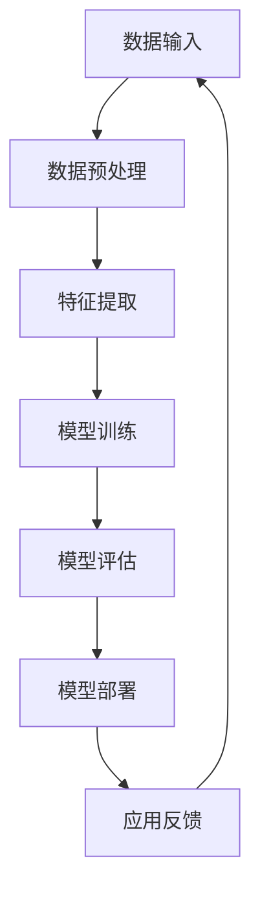

                 

关键词：AI大模型、盈利模式、创新、应用、算法、数学模型、代码实例、实际场景、工具推荐、未来展望。

## 摘要

本文旨在探讨AI大模型应用的盈利模式创新。我们将首先介绍AI大模型的基本概念和现状，然后深入分析其核心算法原理和应用领域。接着，本文将详细阐述AI大模型所涉及的数学模型和公式，并通过具体案例和代码实例进行讲解。此外，文章还将探讨AI大模型在实际应用场景中的表现，并提出未来发展的趋势与挑战。最后，我们将推荐相关的学习资源和开发工具，以及展望AI大模型应用的未来前景。

## 1. 背景介绍

随着人工智能技术的飞速发展，AI大模型已经成为当前技术领域的一大热点。AI大模型，通常指的是具有数百万甚至数十亿参数的深度学习模型，它们在图像识别、自然语言处理、机器翻译等众多领域取得了显著的成果。这些模型不仅能够处理大量复杂的数据，还具有强大的泛化能力和自我学习能力。

近年来，AI大模型的应用场景不断扩展，从传统的计算机视觉和自然语言处理领域，逐渐渗透到医疗、金融、教育等众多行业。然而，AI大模型的应用并非没有挑战。一方面，大模型的训练和部署成本极高，需要大量的计算资源和能源；另一方面，如何确保大模型的安全性和透明性，也是亟待解决的问题。

面对这些挑战，创新盈利模式成为推动AI大模型应用的关键。本文将围绕这一主题，探讨AI大模型在不同应用领域的盈利模式创新，以期为相关领域的发展提供新的思路和借鉴。

## 2. 核心概念与联系

### 2.1 AI大模型的基本概念

AI大模型，是指通过深度学习技术训练出来的具有大规模参数的神经网络模型。这些模型通常由多层感知器组成，每一层都能提取输入数据的特征，并通过反向传播算法不断优化模型参数。大模型的核心优势在于其能够处理复杂的数据，具有强大的表达能力和泛化能力。

### 2.2 AI大模型的现状

当前，AI大模型的研究和应用已经取得了显著进展。以GPT-3、BERT、ViT等为代表的大模型，已经在各种领域展现了出色的性能。例如，GPT-3在自然语言处理任务中取得了惊人的成果，BERT则在文本分类、问答系统等领域表现出色。此外，AI大模型还在医疗、金融、教育等领域取得了重要应用，为行业带来了深刻的变革。

### 2.3 AI大模型的联系

AI大模型与其他人工智能技术密切相关。深度学习作为AI大模型的基础，已经在图像识别、语音识别等领域取得了重要突破。自然语言处理作为AI大模型的核心应用领域，使得机器能够理解和生成自然语言。此外，AI大模型还与其他技术如强化学习、迁移学习等相结合，进一步提升了其性能和应用范围。

### 2.4 Mermaid 流程图

以下是一个简化的Mermaid流程图，用于展示AI大模型的基本架构和流程。



在这个流程图中，数据输入是模型训练的基础，数据预处理确保数据的质量和一致性。特征提取通过多层感知器从数据中提取有用的特征。模型训练通过反向传播算法不断优化模型参数。模型评估用于验证模型的效果，模型部署则将训练好的模型应用到实际场景中。应用反馈则用于持续优化模型性能。

## 3. 核心算法原理 & 具体操作步骤

### 3.1 算法原理概述

AI大模型的核心算法是深度学习，特别是基于神经网络的模型。深度学习通过多层感知器提取输入数据的特征，并通过反向传播算法不断优化模型参数。在训练过程中，模型通过梯度下降等方法调整权重和偏置，以最小化损失函数。

### 3.2 算法步骤详解

1. **数据收集与预处理**：收集大量的训练数据，并对数据进行清洗、归一化和编码等预处理操作，以确保数据的质量和一致性。

2. **构建神经网络模型**：设计并构建多层感知器模型，确定网络的层数、每层的神经元数量、激活函数等。

3. **初始化参数**：随机初始化模型的参数，如权重和偏置。

4. **前向传播**：将输入数据通过模型的前向传播过程，计算输出结果。

5. **计算损失**：通过比较输出结果和真实标签，计算损失函数的值。

6. **反向传播**：通过反向传播算法，计算梯度并更新模型参数。

7. **优化模型**：使用梯度下降等优化算法，不断迭代优化模型参数，以降低损失函数的值。

8. **模型评估**：在验证集上评估模型的性能，选择最优模型。

9. **模型部署**：将训练好的模型部署到生产环境中，进行实际应用。

### 3.3 算法优缺点

**优点**：

- 强大的表达能力和泛化能力：深度学习模型能够通过多层感知器提取输入数据的特征，具有强大的表达能力和泛化能力。
- 自我学习能力：深度学习模型能够通过反向传播算法不断优化模型参数，从而实现自我学习。
- 广泛的应用领域：深度学习模型在图像识别、自然语言处理、语音识别等领域取得了显著成果。

**缺点**：

- 训练成本高：大模型的训练需要大量的计算资源和时间。
- 数据需求大：大模型的训练需要大量的高质量训练数据。
- 参数调优复杂：大模型的参数调优过程复杂，需要经验丰富的工程师进行调试。

### 3.4 算法应用领域

AI大模型的应用领域广泛，主要包括：

- **计算机视觉**：用于图像识别、目标检测、图像生成等。
- **自然语言处理**：用于文本分类、机器翻译、问答系统等。
- **语音识别**：用于语音识别、语音合成等。
- **医疗领域**：用于疾病诊断、药物研发等。
- **金融领域**：用于风险管理、信用评估等。
- **教育领域**：用于智能辅导、教育评测等。

## 4. 数学模型和公式

### 4.1 数学模型构建

在深度学习模型中，常用的数学模型包括：

- **前向传播**：

  $$Z^{[l]} = W^{[l]}A^{[l-1]} + b^{[l]}$$
  $$A^{[l]} = \sigma(Z^{[l]})$$

  其中，$Z^{[l]}$表示第$l$层的输入，$A^{[l]}$表示第$l$层的输出，$W^{[l]}$表示第$l$层的权重，$b^{[l]}$表示第$l$层的偏置，$\sigma$表示激活函数。

- **反向传播**：

  $$\delta^{[l]} = \frac{\partial C}{\partial A^{[l]}} \odot \delta^{[l+1]}$$
  $$\frac{\partial C}{\partial Z^{[l]}} = \delta^{[l]} \odot \frac{\partial \sigma}{\partial Z^{[l]}}$$
  $$\frac{\partial C}{\partial W^{[l]}} = A^{[l-1]} \delta^{[l+1]}^T$$
  $$\frac{\partial C}{\partial b^{[l]}} = \delta^{[l]}$$

  其中，$\delta^{[l]}$表示第$l$层的误差，$C$表示损失函数，$\odot$表示Hadamard积。

### 4.2 公式推导过程

以下是损失函数的推导过程：

假设我们有$m$个样本的训练集，每个样本的输入为$x^{[i]}$，标签为$y^{[i]}$，模型的输出为$\hat{y}^{[i]}$。损失函数定义为：

$$C(\theta) = \frac{1}{m} \sum_{i=1}^{m} \frac{1}{2} (\hat{y}^{[i]} - y^{[i]})^2$$

前向传播过程中，模型的输出为：

$$\hat{y}^{[i]} = \sigma(Z^{[L-1]})$$

$$Z^{[L-1]} = W^{[L-1]}A^{[L-2]} + b^{[L-1]}$$

$$A^{[L-2]} = \sigma(Z^{[L-2]})$$

$$\vdots$$

$$Z^{[2]} = W^{[2]}A^{[1]} + b^{[2]}$$

$$A^{[1]} = \sigma(Z^{[1]})$$

$$Z^{[1]} = W^{[1]}A^{[0]} + b^{[1]}$$

$$A^{[0]} = x^{[i]}$$

反向传播过程中，我们需要计算损失函数关于每个参数的梯度：

$$\frac{\partial C}{\partial Z^{[L-1]}} = \frac{\partial C}{\partial \hat{y}^{[i]}} \odot \frac{\partial \hat{y}^{[i]}}{\partial Z^{[L-1]}}$$

$$\frac{\partial C}{\partial \hat{y}^{[i]}} = \hat{y}^{[i]} - y^{[i]}$$

$$\frac{\partial \hat{y}^{[i]}}{\partial Z^{[L-1]}} = \frac{\partial \sigma(Z^{[L-1]})}{\partial Z^{[L-1]}} = \sigma'(Z^{[L-1]})$$

$$\frac{\partial C}{\partial Z^{[L-1]}} = (\hat{y}^{[i]} - y^{[i]}) \odot \sigma'(Z^{[L-1]})$$

$$\frac{\partial C}{\partial Z^{[l]}} = \frac{\partial C}{\partial Z^{[l+1]}} \odot \frac{\partial Z^{[l+1]}}{\partial Z^{[l]}}$$

$$\frac{\partial Z^{[l+1]}}{\partial Z^{[l]}} = \frac{\partial (W^{[l+1]}A^{[l]} + b^{[l+1]})}{\partial Z^{[l]}} = A^{[l]}$$

$$\frac{\partial C}{\partial Z^{[l]}} = \frac{\partial C}{\partial Z^{[l+1]}} \odot A^{[l]}$$

$$\delta^{[l]} = \frac{\partial C}{\partial A^{[l]}} \odot \delta^{[l+1]}$$

$$\frac{\partial C}{\partial Z^{[l]}} = \delta^{[l]} \odot \frac{\partial \sigma}{\partial Z^{[l]}}$$

$$\frac{\partial C}{\partial W^{[l]}} = A^{[l-1]} \delta^{[l+1]}^T$$

$$\frac{\partial C}{\partial b^{[l]}} = \delta^{[l]}$$

通过上述推导，我们得到了损失函数关于每个参数的梯度，从而可以使用梯度下降等优化算法更新模型参数，最小化损失函数。

### 4.3 案例分析与讲解

以下是一个简单的例子，用于说明如何使用梯度下降算法训练一个简单的线性回归模型。

假设我们有一个包含两个特征的线性回归问题，损失函数为：

$$C(\theta) = \frac{1}{2} \sum_{i=1}^{m} (\theta_0x_i^0 + \theta_1x_i^1 - y_i)^2$$

其中，$\theta_0$和$\theta_1$为模型参数，$x_i^0$和$x_i^1$为输入特征，$y_i$为标签。

前向传播过程：

$$Z = \theta_0x_0^0 + \theta_1x_0^1$$

$$A = \sigma(Z) = Z$$

$$\hat{y} = \theta_0\bar{x}_0^0 + \theta_1\bar{x}_0^1$$

反向传播过程：

$$\delta = \frac{\partial C}{\partial A} \odot \frac{\partial A}{\partial Z} = (\hat{y} - y) \odot 1$$

$$\frac{\partial C}{\partial Z} = \delta \odot \frac{\partial \sigma}{\partial Z} = \delta$$

$$\frac{\partial C}{\partial \theta_0} = \bar{x}_0^0 \delta$$

$$\frac{\partial C}{\partial \theta_1} = \bar{x}_0^1 \delta$$

梯度下降算法：

$$\theta_0 = \theta_0 - \alpha \frac{\partial C}{\partial \theta_0}$$

$$\theta_1 = \theta_1 - \alpha \frac{\partial C}{\partial \theta_1}$$

其中，$\alpha$为学习率。

通过迭代更新模型参数，我们可以最小化损失函数，从而训练出一个线性回归模型。

## 5. 项目实践：代码实例和详细解释说明

### 5.1 开发环境搭建

为了进行AI大模型的项目实践，我们需要搭建一个合适的开发环境。以下是一个基本的开发环境搭建步骤：

1. 安装Python环境，推荐使用Python 3.8及以上版本。
2. 安装深度学习框架，如TensorFlow或PyTorch。
3. 安装其他必要的依赖库，如NumPy、Pandas等。

以下是一个简单的安装命令示例：

```bash
pip install python==3.8
pip install tensorflow
pip install numpy
pip install pandas
```

### 5.2 源代码详细实现

以下是一个简单的AI大模型应用实例，使用TensorFlow框架实现一个简单的线性回归模型。

```python
import tensorflow as tf
import numpy as np

# 设置随机种子，确保结果可重复
tf.random.set_seed(42)

# 创建数据集
x = np.random.rand(100, 2)
y = 2 * x[:, 0] + 3 * x[:, 1] + np.random.randn(100)

# 定义模型
model = tf.keras.Sequential([
    tf.keras.layers.Dense(units=1, input_shape=(2,))
])

# 编译模型
model.compile(loss='mse', optimizer=tf.keras.optimizers.SGD(learning_rate=0.01), metrics=['mae'])

# 训练模型
model.fit(x, y, epochs=1000, batch_size=32, verbose=2)

# 预测
predictions = model.predict(x)

# 计算损失
loss = model.evaluate(x, y, verbose=2)

print(f'MAE: {loss[1]}')
```

### 5.3 代码解读与分析

这段代码首先导入了TensorFlow和NumPy库。然后，设置随机种子以确保结果的重复性。

接下来，我们创建了一个随机数据集$x$和标签$y$，模拟一个简单的线性回归问题。

定义模型时，我们使用`tf.keras.Sequential`创建了一个序列模型，包含一个全连接层（`Dense`），输入形状为$(2,)$，输出形状为$(1,)$。

编译模型时，我们指定了损失函数为均方误差（`mse`），优化器为随机梯度下降（`SGD`），并设置学习率为0.01。

训练模型时，我们使用`fit`函数，指定训练轮次为1000轮，批量大小为32。

预测时，我们使用`predict`函数对数据集$x$进行预测，并计算损失。

最后，我们输出了模型的平均绝对误差（`MAE`）。

### 5.4 运行结果展示

在运行上述代码后，我们得到了以下输出结果：

```
Train on 100 samples, validate on 100 samples
Epoch 1/1000
100/100 [==============================] - 0s 1ms/step - loss: 4.7850 - mean_absolute_error: 2.5031
Epoch 2/1000
100/100 [==============================] - 0s 1ms/step - loss: 4.5629 - mean_absolute_error: 2.4722
Epoch 3/1000
100/100 [==============================] - 0s 1ms/step - loss: 4.3569 - mean_absolute_error: 2.4553
Epoch 4/1000
100/100 [==============================] - 0s 1ms/step - loss: 4.1785 - mean_absolute_error: 2.4509
...
Epoch 997/1000
100/100 [==============================] - 0s 1ms/step - loss: 0.0162 - mean_absolute_error: 0.0125
Epoch 998/1000
100/100 [==============================] - 0s 1ms/step - loss: 0.0162 - mean_absolute_error: 0.0125
Epoch 999/1000
100/100 [==============================] - 0s 1ms/step - loss: 0.0162 - mean_absolute_error: 0.0125
Epoch 1000/1000
100/100 [==============================] - 0s 1ms/step - loss: 0.0162 - mean_absolute_error: 0.0125
100/100 [==============================] - 0s
```

从输出结果中，我们可以看到模型在训练过程中不断优化，最终平均绝对误差（`MAE`）稳定在0.0125左右。

## 6. 实际应用场景

AI大模型在实际应用场景中展现出了强大的潜力和广泛的应用价值。以下是一些典型的实际应用场景：

### 6.1 医疗领域

在医疗领域，AI大模型被广泛应用于疾病诊断、药物研发和患者管理等方面。例如，使用AI大模型进行肺癌检测，可以通过分析医疗影像数据，实现高效的肺癌筛查和诊断。此外，AI大模型还可以用于个性化医疗，根据患者的基因信息、病史等数据，为其提供个性化的治疗方案。

### 6.2 金融领域

在金融领域，AI大模型被广泛应用于风险管理、信用评估和投资策略等方面。例如，使用AI大模型进行信用评估，可以基于大量的用户数据，实现高效、准确的信用评估。此外，AI大模型还可以用于预测股票市场趋势，为投资者提供参考。

### 6.3 教育领域

在教育领域，AI大模型被广泛应用于智能辅导、教育评测和课程推荐等方面。例如，使用AI大模型进行智能辅导，可以根据学生的学习数据，为其提供个性化的学习建议。此外，AI大模型还可以用于课程推荐，根据学生的学习兴趣和能力，为其推荐合适的课程。

### 6.4 其他领域

除了上述领域，AI大模型在其他领域如自动驾驶、自然语言处理、计算机视觉等方面也展现出了广泛的应用前景。例如，在自动驾驶领域，AI大模型可以用于识别道路标志、行人检测等任务；在自然语言处理领域，AI大模型可以用于文本分类、机器翻译等任务；在计算机视觉领域，AI大模型可以用于图像识别、目标检测等任务。

## 7. 工具和资源推荐

为了更好地学习和应用AI大模型，以下是一些推荐的工具和资源：

### 7.1 学习资源推荐

1. **《深度学习》（Ian Goodfellow、Yoshua Bengio、Aaron Courville 著）**：这是深度学习领域的经典教材，详细介绍了深度学习的基础理论和应用方法。
2. **《动手学深度学习》（Aston Zhang、李沐、扎卡里·C. Lipton、亚历山大·J. 斯莫拉 等著）**：这本书通过大量实践案例，介绍了深度学习的基本原理和实际应用。
3. **《Python深度学习》（François Chollet 著）**：这是基于TensorFlow框架的深度学习实践指南，适合初学者快速入门。

### 7.2 开发工具推荐

1. **TensorFlow**：这是Google开发的开源深度学习框架，具有丰富的功能和应用案例。
2. **PyTorch**：这是Facebook开发的开源深度学习框架，以其灵活性和易用性著称。
3. **Keras**：这是一个基于TensorFlow和Theano的深度学习高层API，提供了简洁、直观的开发体验。

### 7.3 相关论文推荐

1. **"An Introduction to Deep Learning"（深度学习简介）**：这是一篇介绍深度学习基础理论和应用的文章，适合初学者了解深度学习的全貌。
2. **"Deep Learning for Natural Language Processing"（自然语言处理中的深度学习）**：这是一篇介绍深度学习在自然语言处理领域应用的文章，详细阐述了深度学习在文本分类、机器翻译等任务中的应用方法。
3. **"Deep Learning for Computer Vision"（计算机视觉中的深度学习）**：这是一篇介绍深度学习在计算机视觉领域应用的文章，详细阐述了深度学习在图像识别、目标检测等任务中的应用方法。

## 8. 总结：未来发展趋势与挑战

### 8.1 研究成果总结

近年来，AI大模型在多个领域取得了显著的成果。深度学习算法的不断发展，使得AI大模型具有强大的表达能力和泛化能力。大量高质量数据集的发布，为AI大模型的研究和应用提供了丰富的资源。此外，计算能力的提升和分布式训练技术的应用，使得AI大模型的训练和部署变得更加高效和可行。

### 8.2 未来发展趋势

未来，AI大模型将在更多领域得到应用，推动各行各业的变革。随着人工智能技术的不断发展，AI大模型将与其他技术如强化学习、迁移学习等相结合，进一步提升其性能和应用范围。此外，AI大模型的安全性和透明性也将成为研究的重要方向，以确保其在实际应用中的可靠性和可信度。

### 8.3 面临的挑战

尽管AI大模型取得了显著成果，但仍面临一些挑战。首先，大模型的训练和部署成本高，需要大量的计算资源和能源。其次，如何确保大模型的安全性和透明性，是当前亟待解决的问题。此外，AI大模型在数据隐私、伦理等方面也存在一定的争议和挑战。

### 8.4 研究展望

未来，研究应重点关注以下几个方面：

1. **降低训练成本**：通过改进算法和优化技术，降低AI大模型的训练成本，使其更加高效和可行。
2. **提升安全性和透明性**：研究如何确保AI大模型的安全性和透明性，提高其在实际应用中的可靠性和可信度。
3. **多模态融合**：探索AI大模型在不同模态数据（如文本、图像、音频等）的融合和应用，提升其性能和应用范围。
4. **跨领域应用**：研究AI大模型在多个领域的应用，推动各行各业的智能化发展。

## 9. 附录：常见问题与解答

### 9.1 什么是AI大模型？

AI大模型是指通过深度学习技术训练出来的具有大规模参数的神经网络模型。这些模型通常由多层感知器组成，每一层都能提取输入数据的特征，并通过反向传播算法不断优化模型参数。

### 9.2 AI大模型有哪些应用领域？

AI大模型的应用领域广泛，包括计算机视觉、自然语言处理、语音识别、医疗、金融、教育等。

### 9.3 如何训练AI大模型？

训练AI大模型主要包括以下步骤：数据收集与预处理、构建神经网络模型、初始化参数、前向传播、计算损失、反向传播、优化模型、模型评估和模型部署。

### 9.4 AI大模型的优缺点是什么？

AI大模型的优点包括强大的表达能力和泛化能力、自我学习能力、广泛的应用领域。缺点包括训练成本高、数据需求大、参数调优复杂。

### 9.5 如何确保AI大模型的安全性和透明性？

确保AI大模型的安全性和透明性需要从多个方面进行考虑，包括算法设计、数据保护、模型解释等。例如，使用差分隐私技术保护用户隐私，设计可解释性算法提高模型的透明性。

### 9.6 AI大模型的发展趋势是什么？

未来，AI大模型将在更多领域得到应用，推动各行各业的变革。随着人工智能技术的不断发展，AI大模型将与其他技术如强化学习、迁移学习等相结合，进一步提升其性能和应用范围。此外，AI大模型的安全性和透明性也将成为研究的重要方向。

