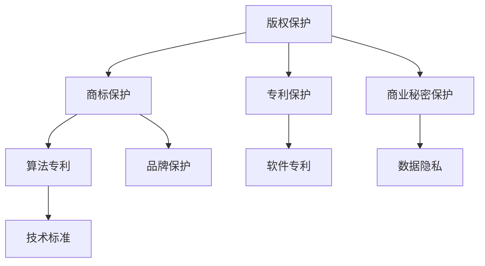

                 

关键词：知识产权、AI大模型、版权保护、法律合规、隐私保护、数据安全

> 摘要：随着人工智能技术的快速发展，尤其是大模型应用的普及，知识产权保护成为了一个关键议题。本文将探讨AI大模型应用中的知识产权保护策略，包括版权、商标、专利和商业秘密等方面，分析现有的法律框架，并提出一些建议和展望。

## 1. 背景介绍

### 1.1 AI大模型的发展

人工智能（AI）技术正在经历前所未有的快速发展，从最初的简单算法逐步演进到如今的大模型时代。大模型，如GPT-3、BERT等，具有处理海量数据、生成文本、图像甚至语音的强大能力，已经在多个领域展现出了巨大的应用潜力。

### 1.2 知识产权保护的重要性

随着AI大模型的应用日益广泛，知识产权保护的重要性日益凸显。这不仅涉及到技术开发者的权益，也关系到整个社会的利益。不当的知识产权保护可能导致创新受阻、商业竞争不公等问题。

## 2. 核心概念与联系

### 2.1 知识产权的基本概念

知识产权包括版权、商标、专利和商业秘密等。版权通常涉及作品（如软件代码、文档、图像等）的复制权、发行权、改编权等；商标则是指用于区分商品或服务来源的标识；专利则是授予发明者对其发明在一定时间内独占使用的权利；商业秘密则是指未公开的商业信息，如客户名单、配方等。

### 2.2 AI大模型与知识产权的关系

AI大模型通常涉及多个知识产权方面的保护，如代码版权、算法专利、商标等。了解这些知识产权的基本概念和它们在大模型中的应用，对于实施有效的知识产权保护策略至关重要。

### 2.3 Mermaid流程图



## 3. 核心算法原理 & 具体操作步骤

### 3.1 算法原理概述

AI大模型的核心算法通常基于深度学习，包括但不限于神经网络、卷积神经网络（CNN）、递归神经网络（RNN）等。这些算法通过大规模数据训练，能够实现对复杂数据的处理和生成。

### 3.2 算法步骤详解

AI大模型的开发通常包括以下几个步骤：

1. 数据收集与预处理
2. 模型设计
3. 训练与验证
4. 部署与应用
5. 持续优化

### 3.3 算法优缺点

AI大模型的优点包括强大的数据处理能力、高准确度等，但其缺点包括对计算资源的高需求、数据隐私和安全问题等。

### 3.4 算法应用领域

AI大模型在自然语言处理、计算机视觉、语音识别等多个领域有着广泛的应用，具有巨大的市场潜力。

## 4. 数学模型和公式 & 详细讲解 & 举例说明

### 4.1 数学模型构建

AI大模型的数学模型通常基于概率统计和优化理论。例如，神经网络中的激活函数、权重优化等。

### 4.2 公式推导过程

以神经网络中的反向传播算法为例，其基本公式为：

$$
\Delta W = -\alpha \cdot \frac{\partial J}{\partial W}
$$

其中，$\Delta W$ 是权重的更新，$\alpha$ 是学习率，$J$ 是损失函数，$\frac{\partial J}{\partial W}$ 是损失函数对权重的偏导数。

### 4.3 案例分析与讲解

以GPT-3为例，其训练过程涉及海量数据的预处理、模型的初始化、训练和验证等步骤。

## 5. 项目实践：代码实例和详细解释说明

### 5.1 开发环境搭建

搭建AI大模型开发环境通常需要安装Python、TensorFlow等工具。

### 5.2 源代码详细实现

以下是使用TensorFlow实现一个简单的神经网络模型的基本代码：

```python
import tensorflow as tf

# 定义模型
model = tf.keras.Sequential([
    tf.keras.layers.Dense(128, activation='relu', input_shape=(784,)),
    tf.keras.layers.Dense(10, activation='softmax')
])

# 编译模型
model.compile(optimizer='adam',
              loss='categorical_crossentropy',
              metrics=['accuracy'])

# 训练模型
model.fit(x_train, y_train, epochs=5)
```

### 5.3 代码解读与分析

上述代码定义了一个简单的神经网络模型，包括一个输入层、一个隐藏层和一个输出层。隐藏层使用ReLU激活函数，输出层使用softmax激活函数。模型使用adam优化器和categorical_crossentropy损失函数进行编译和训练。

### 5.4 运行结果展示

训练完成后，可以通过模型评估函数评估模型的性能。

## 6. 实际应用场景

AI大模型在自然语言处理、计算机视觉、语音识别等多个领域有着广泛的应用。

## 7. 工具和资源推荐

### 7.1 学习资源推荐

- 《深度学习》（Ian Goodfellow等著）
- 《Python机器学习》（Sebastian Raschka著）

### 7.2 开发工具推荐

- TensorFlow
- PyTorch

### 7.3 相关论文推荐

- “Attention Is All You Need”（Vaswani等，2017）
- “BERT: Pre-training of Deep Bidirectional Transformers for Language Understanding”（Devlin等，2018）

## 8. 总结：未来发展趋势与挑战

### 8.1 研究成果总结

AI大模型在多个领域取得了显著的成果，但知识产权保护仍面临诸多挑战。

### 8.2 未来发展趋势

随着AI技术的不断发展，知识产权保护将变得更加重要，涉及的法律和法规也将不断完善。

### 8.3 面临的挑战

- 数据隐私和安全问题
- 算法透明度和可解释性问题
- 国际合作与法律协调问题

### 8.4 研究展望

未来的研究将重点关注如何在保障知识产权的同时，促进AI技术的创新和广泛应用。

## 9. 附录：常见问题与解答

### 9.1 什么情况下需要申请专利？

当你的AI大模型涉及到新颖的算法或技术，且具有实际应用价值时，可以考虑申请专利。

### 9.2 如何保护数据隐私？

可以通过数据脱敏、加密等技术手段保护数据隐私。

作者：禅与计算机程序设计艺术 / Zen and the Art of Computer Programming
----------------------------------------------------------------
在撰写文章的过程中，请务必仔细检查每一个细节，确保内容完整、准确，并且符合“约束条件 CONSTRAINTS”中的所有要求。对于文章的各个部分，都要仔细构思，确保逻辑清晰，信息准确，结构紧凑。在撰写时，注意使用专业的技术语言，同时保持文章的易懂性和实用性。对于代码示例和数学公式，确保它们是正确的，并且在文中解释清楚。最后，不要忘记在文章末尾加上作者署名。撰写完成后，再次仔细校对，确保没有遗漏或错误。祝您撰写顺利！<|im_end|>

