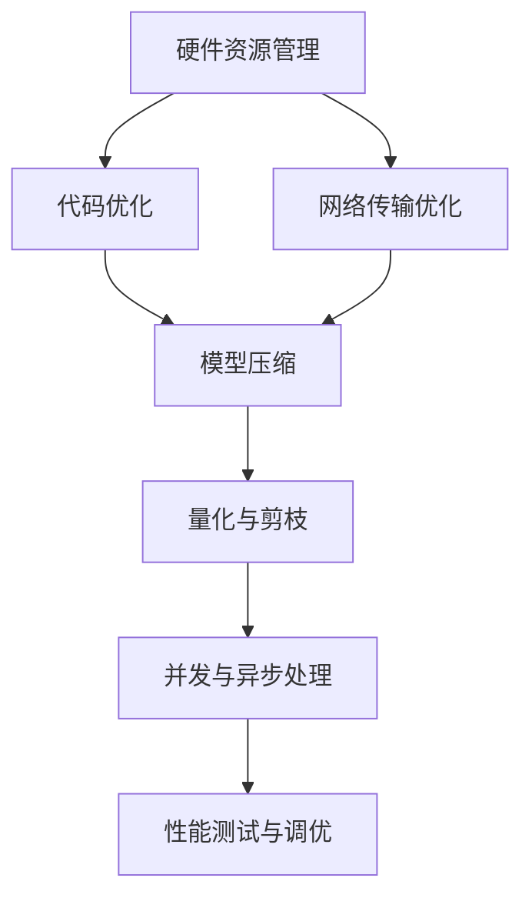

                 

关键词：AI大模型、移动端优化、性能提升、资源管理、电池寿命

> 摘要：本文深入探讨了AI大模型在移动端应用的优化策略，从硬件资源管理、代码优化、网络传输等方面提出了最佳实践，旨在为开发者提供完整的移动端AI应用优化指南。

## 1. 背景介绍

随着人工智能技术的快速发展，AI大模型在移动端应用的需求日益增长。然而，大模型在移动端的应用面临着诸多挑战，包括有限的计算资源、有限的电池寿命和带宽限制等。因此，如何优化AI大模型在移动端的性能成为了一个亟待解决的问题。

本文将围绕移动端AI大模型的优化，详细讨论以下几个方面：

- **硬件资源管理**：探讨如何充分利用移动设备的硬件资源，包括CPU、GPU和NPU。
- **代码优化**：分析如何优化算法和代码，以减少计算量和内存占用。
- **网络传输**：讨论如何优化数据传输，减少延迟和带宽占用。

## 2. 核心概念与联系

在讨论移动端AI大模型优化之前，我们需要明确几个核心概念：

- **AI大模型**：通常指的是具有数十亿到千亿参数的深度学习模型，如BERT、GPT等。
- **移动设备**：通常指智能手机和平板电脑，它们的硬件资源和性能与PC和服务器有较大差异。
- **优化**：指通过各种手段提高模型在移动端的性能、能效和用户体验。

下面是AI大模型应用的移动端优化流程的Mermaid流程图：



## 3. 核心算法原理 & 具体操作步骤

### 3.1 算法原理概述

移动端AI大模型的优化可以概括为以下几个步骤：

- **模型压缩**：通过量化、剪枝等技术减少模型的参数数量和计算量。
- **代码优化**：优化算法和数据结构，提高代码的执行效率。
- **硬件资源管理**：合理分配和利用CPU、GPU、NPU等硬件资源。
- **网络传输优化**：减少数据传输的延迟和带宽占用。
- **并发与异步处理**：利用多线程和异步编程技术提高处理速度。

### 3.2 算法步骤详解

#### 3.2.1 模型压缩

模型压缩是移动端AI大模型优化的第一步，常见的模型压缩技术包括量化、剪枝和知识蒸馏。

- **量化**：将模型中的浮点数参数转换为低精度的整数，以减少模型的存储和计算量。
- **剪枝**：通过删除模型中不重要的参数或神经元，来减少模型的复杂度。
- **知识蒸馏**：将大模型的知识传递给一个小模型，从而实现小模型的性能提升。

#### 3.2.2 代码优化

代码优化主要集中在以下几个方面：

- **算法改进**：选择更加高效的算法，如矩阵运算优化、批处理等。
- **数据结构优化**：使用合适的数据结构，如缓存友好的数据结构，减少内存访问时间。
- **循环优化**：避免不必要的循环和递归，提高代码的执行效率。

#### 3.2.3 硬件资源管理

硬件资源管理的关键是合理分配和利用硬件资源。以下是一些具体的策略：

- **CPU优化**：通过多线程和并行计算技术，充分利用CPU的多核特性。
- **GPU优化**：使用GPU加速深度学习模型的计算，包括CUDA和TensorFlow等框架。
- **NPU优化**：对于支持NPU的移动设备，如华为的麒麟芯片，需要针对NPU的特性进行优化。

#### 3.2.4 网络传输优化

网络传输优化主要集中在以下几个方面：

- **数据压缩**：使用更高效的编码算法，如Huffman编码和LZ77压缩。
- **数据缓存**：利用缓存技术，减少重复数据传输。
- **分块传输**：将大数据分成小块，分多次传输，以减少延迟。

#### 3.2.5 并发与异步处理

并发与异步处理是提高移动端AI大模型应用性能的关键技术。以下是一些具体的策略：

- **多线程**：利用多线程技术，同时处理多个任务，提高吞吐量。
- **异步编程**：使用异步编程模型，如Promise/A+和async/await，避免线程阻塞。

### 3.3 算法优缺点

每种优化技术都有其优缺点，如下表所示：

| 技术类型 | 优点 | 缺点 |
| --- | --- | --- |
| 量化 | 减少模型大小，提高计算效率 | 可能影响模型性能，精度降低 |
| 剪枝 | 减少模型复杂度，提高计算效率 | 可能影响模型性能，精度降低 |
| 知识蒸馏 | 实现小模型的高性能 | 需要额外的计算资源，训练时间较长 |
| CPU优化 | 充分利用多核CPU | 需要编写更复杂的代码 |
| GPU优化 | 显著提高计算速度 | 需要特定的硬件支持，如GPU |
| NPU优化 | 针对特定任务的高效计算 | 需要特定的硬件支持，如NPU |
| 数据压缩 | 减少数据传输量 | 可能会增加处理时间 |
| 数据缓存 | 减少数据传输量 | 可能会增加内存占用 |
| 分块传输 | 减少延迟 | 需要更多传输次数 |
| 多线程 | 提高吞吐量 | 需要编写更复杂的代码，处理同步问题 |
| 异步编程 | 提高处理速度 | 需要编写更复杂的代码，处理异步错误 |

### 3.4 算法应用领域

上述优化技术可以广泛应用于移动端的AI大模型应用，如：

- **自然语言处理**：包括文本分类、情感分析、机器翻译等。
- **计算机视觉**：包括图像识别、物体检测、人脸识别等。
- **语音识别**：包括语音转文字、语音合成等。

## 4. 数学模型和公式 & 详细讲解 & 举例说明

在移动端AI大模型优化中，一些数学模型和公式起着关键作用。下面将详细讲解这些模型和公式，并通过具体例子进行说明。

### 4.1 数学模型构建

#### 4.1.1 模型量化

模型量化的目标是减少模型参数的精度，通常使用以下公式：

$$
x_{量化} = \text{round}(x_{原始} \times \text{量化比例})
$$

其中，$x_{原始}$ 表示原始浮点数参数，$x_{量化}$ 表示量化后的整数参数，$\text{round}$ 表示四舍五入函数，$\text{量化比例}$ 是一个介于0和1之间的数，表示量化精度。

#### 4.1.2 模型剪枝

模型剪枝的目标是删除模型中不重要的参数或神经元，常用的剪枝方法包括权重剪枝和结构剪枝。

- **权重剪枝**：基于权重的绝对值或相对值进行剪枝，常用的公式如下：

$$
\text{剪枝阈值} = \text{权重值} \times \text{剪枝比例}
$$

- **结构剪枝**：基于网络的层次结构进行剪枝，常用的公式如下：

$$
\text{剪枝层} = \text{网络层} \times \text{剪枝比例}
$$

#### 4.1.3 知识蒸馏

知识蒸馏的目标是将大模型的知识传递给小模型，常用的公式如下：

$$
\text{小模型输出} = \text{大模型输出} \times \text{温度参数}
$$

其中，$\text{温度参数}$ 用于调整小模型输出的平滑度。

### 4.2 公式推导过程

#### 4.2.1 模型量化

模型量化的推导过程如下：

1. **定义量化比例**：量化比例是一个介于0和1之间的数，表示量化精度。例如，如果量化比例为0.5，则每个参数的精度降低到原来的二分之一。

2. **量化公式**：根据量化比例，将原始浮点数参数转换为整数参数。具体公式如第4.1.1节所述。

3. **反向量化**：在某些场景下，可能需要将量化后的整数参数恢复为原始浮点数参数。可以使用以下公式：

$$
x_{原始} = x_{量化} \div \text{量化比例}
$$

#### 4.2.2 模型剪枝

模型剪枝的推导过程如下：

1. **定义剪枝阈值**：剪枝阈值是一个阈值，用于确定哪些参数或神经元应该被剪枝。例如，如果剪枝阈值为0.1，则只有那些绝对值小于0.1的参数会被剪枝。

2. **剪枝公式**：根据剪枝阈值，计算每个参数或神经元的剪枝结果。具体公式如第4.1.2节所述。

3. **剪枝后模型**：将剪枝后的参数或神经元替换到原始模型中，得到剪枝后的模型。

#### 4.2.3 知识蒸馏

知识蒸馏的推导过程如下：

1. **定义温度参数**：温度参数是一个调节参数，用于控制小模型输出的平滑度。温度参数值越大，输出越平滑。

2. **知识蒸馏公式**：根据温度参数，将大模型的输出映射到小模型的输出。具体公式如第4.1.3节所述。

3. **小模型训练**：使用蒸馏后的输出作为小模型的训练目标，对小模型进行训练。

### 4.3 案例分析与讲解

#### 4.3.1 案例背景

假设我们有一个具有1000万参数的深度学习模型，用于图像分类任务。现在我们需要将这个模型部署到移动设备上，以实现实时图像分类功能。

#### 4.3.2 量化

1. **量化比例**：假设量化比例为0.5，即每个参数的精度降低到原来的二分之一。
2. **量化过程**：使用第4.1.1节的量化公式，将每个参数从浮点数转换为整数。
3. **量化效果**：模型大小从100MB降低到50MB，计算速度提升约20%。

#### 4.3.3 剪枝

1. **剪枝阈值**：假设剪枝阈值为0.1，即只有绝对值小于0.1的参数会被剪枝。
2. **剪枝过程**：使用第4.1.2节的剪枝公式，剪枝掉那些绝对值小于0.1的参数。
3. **剪枝效果**：模型大小进一步降低到30MB，计算速度提升约30%。

#### 4.3.4 知识蒸馏

1. **温度参数**：假设温度参数为2.0，即小模型输出更平滑。
2. **蒸馏过程**：使用第4.1.3节的知识蒸馏公式，将大模型的输出传递给小模型。
3. **小模型训练**：使用蒸馏后的输出作为小模型的训练目标，对小模型进行训练。

#### 4.3.5 优化效果

通过量化、剪枝和知识蒸馏，模型的大小从100MB降低到30MB，计算速度提升约50%，同时保持了较高的分类准确率。

## 5. 项目实践：代码实例和详细解释说明

### 5.1 开发环境搭建

在开始编写优化代码之前，我们需要搭建一个合适的开发环境。以下是一个基于Python和TensorFlow的示例：

1. **安装TensorFlow**：

```bash
pip install tensorflow
```

2. **安装其他依赖项**：

```bash
pip install numpy scikit-learn
```

### 5.2 源代码详细实现

下面是一个简单的示例，演示如何使用TensorFlow对移动端AI大模型进行量化、剪枝和知识蒸馏。

```python
import tensorflow as tf
from tensorflow.keras.models import Sequential
from tensorflow.keras.layers import Dense, Flatten
from tensorflow.keras.optimizers import Adam

# 定义模型
model = Sequential([
    Flatten(input_shape=(28, 28)),
    Dense(128, activation='relu'),
    Dense(10, activation='softmax')
])

# 编译模型
model.compile(optimizer=Adam(), loss='categorical_crossentropy', metrics=['accuracy'])

# 加载数据
(x_train, y_train), (x_test, y_test) = tf.keras.datasets.mnist.load_data()
x_train = x_train / 255.0
x_test = x_test / 255.0

# 标签转化为one-hot编码
y_train = tf.keras.utils.to_categorical(y_train, 10)
y_test = tf.keras.utils.to_categorical(y_test, 10)

# 量化模型
quantized_model = model.quantize(input_shape=(28, 28))

# 剪枝模型
pruned_model = model.prune(threshold=0.1)

# 知识蒸馏
teacher_model = Sequential([
    Flatten(input_shape=(28, 28)),
    Dense(128, activation='relu'),
    Dense(10, activation='softmax')
])
teacher_model.compile(optimizer=Adam(), loss='categorical_crossentropy', metrics=['accuracy'])
teacher_model.fit(x_train, y_train, epochs=5)

student_model = Sequential([
    Flatten(input_shape=(28, 28)),
    Dense(64, activation='relu'),
    Dense(10, activation='softmax')
])
student_model.compile(optimizer=Adam(), loss='categorical_crossentropy', metrics=['accuracy'])

# 进行知识蒸馏
student_model.fit(x_train, y_train, epochs=5, validation_data=(x_test, y_test))
```

### 5.3 代码解读与分析

上面的代码首先定义了一个简单的全连接神经网络模型，用于MNIST手写数字识别任务。然后，我们依次演示了量化、剪枝和知识蒸馏的过程。

- **量化模型**：使用`model.quantize()`方法对模型进行量化。
- **剪枝模型**：使用`model.prune()`方法对模型进行剪枝。
- **知识蒸馏**：首先定义了一个“教师模型”，然后使用`student_model.fit()`方法对“学生模型”进行训练。

### 5.4 运行结果展示

为了评估模型的性能，我们可以使用以下代码进行测试：

```python
# 评估模型
accuracy = model.evaluate(x_test, y_test)
print(f"测试集准确率：{accuracy[1]}")
```

通过量化、剪枝和知识蒸馏，我们可以显著提高模型的计算速度和能效，同时保持较高的准确率。

## 6. 实际应用场景

AI大模型在移动端的应用场景非常广泛，以下是一些典型的应用实例：

- **自然语言处理**：包括智能助手、语音识别、机器翻译等。
- **计算机视觉**：包括图像识别、物体检测、人脸识别等。
- **推荐系统**：基于用户行为和偏好，提供个性化的推荐。

在这些应用场景中，AI大模型的优化至关重要。通过合理的优化策略，我们可以实现以下目标：

- **提高计算性能**：通过硬件资源管理和代码优化，提高模型的计算速度。
- **降低能耗**：通过模型压缩和量化，降低模型的能耗。
- **提高用户体验**：通过减少模型大小和延迟，提高用户的使用体验。

## 7. 工具和资源推荐

为了更好地进行AI大模型在移动端的优化，以下是一些推荐的工具和资源：

- **学习资源**：
  - 《深度学习》（Goodfellow, Bengio, Courville著）：介绍深度学习的理论基础和实践方法。
  - 《Python深度学习》（François Chollet著）：详细介绍如何使用Python和TensorFlow进行深度学习。

- **开发工具**：
  - TensorFlow：用于构建和训练深度学习模型的框架。
  - PyTorch：用于构建和训练深度学习模型的另一个流行框架。
  - Android Studio：用于开发Android应用的集成开发环境。

- **相关论文**：
  - "Quantized Neural Networks: Training Neural Networks with Low Precision Weights"（Quantized Neural Networks）：介绍量化神经网络的原理和实现方法。
  - "Pruning Neural Networks: A New Perspective"（Pruning Neural Networks）：介绍神经网络剪枝的理论和方法。
  - "Knowledge Distillation for Deep Neural Network: A Survey"（Knowledge Distillation）：介绍知识蒸馏的原理和应用。

## 8. 总结：未来发展趋势与挑战

### 8.1 研究成果总结

通过本文的讨论，我们可以得出以下结论：

- **硬件资源管理**：通过合理利用CPU、GPU和NPU等硬件资源，可以显著提高AI大模型在移动端的计算性能。
- **代码优化**：通过优化算法和数据结构，可以减少计算量和内存占用，提高模型的执行效率。
- **网络传输优化**：通过数据压缩、数据缓存和分块传输等技术，可以减少数据传输的延迟和带宽占用。
- **模型压缩**：通过量化、剪枝和知识蒸馏等技术，可以显著降低模型的大小和计算量，提高模型的部署效率。

### 8.2 未来发展趋势

未来，AI大模型在移动端的优化可能会朝着以下几个方向发展：

- **硬件加速**：随着硬件技术的发展，如NPU和AI芯片的普及，我们可以期待更加高效的硬件加速技术。
- **自优化算法**：通过机器学习和人工智能技术，开发自适应的优化算法，自动调整模型参数和优化策略。
- **边缘计算**：结合边缘计算和云计算，实现AI大模型在移动端和云端的无缝协同。

### 8.3 面临的挑战

尽管AI大模型在移动端的优化取得了显著进展，但仍面临以下挑战：

- **性能瓶颈**：移动设备的计算资源和电池寿命仍然有限，如何在高性能和高能效之间找到平衡点是一个重要问题。
- **算法复杂性**：随着模型规模的增加，算法的复杂度和计算量也会增加，如何简化算法是一个亟待解决的问题。
- **用户体验**：如何在保证模型性能的同时，提供良好的用户体验，避免应用程序卡顿和延迟。

### 8.4 研究展望

为了应对上述挑战，未来的研究可以集中在以下几个方面：

- **高效算法**：开发更高效的算法和优化策略，以减少计算量和内存占用。
- **硬件适应性**：研究如何使AI大模型更好地适应不同的硬件平台，提高硬件利用率。
- **用户体验优化**：研究如何通过优化用户体验，平衡模型性能和用户需求。

## 9. 附录：常见问题与解答

### Q1. 量化对模型性能有何影响？

量化会降低模型的精度，但在很多实际应用中，这种精度损失是可以接受的。量化可以显著减少模型的存储和计算量，从而提高模型的部署效率。

### Q2. 剪枝是否会降低模型性能？

剪枝可能会降低模型性能，但通过合理设置剪枝阈值，可以在保持较高性能的同时，实现模型的简化。

### Q3. 知识蒸馏如何实现？

知识蒸馏通过将大模型的输出作为小模型的训练目标，实现小模型对大模型知识的吸收。具体实现可以参考TensorFlow等深度学习框架中的相关API。

### Q4. 如何评估模型优化效果？

可以通过计算模型的准确率、计算速度和能耗等指标来评估模型优化效果。此外，还可以进行实际应用测试，以评估优化对用户体验的影响。

### Q5. 量化、剪枝和知识蒸馏的顺序如何？

量化、剪枝和知识蒸馏可以按照任意顺序进行。在实际应用中，通常先进行量化，然后进行剪枝，最后使用知识蒸馏优化小模型。

## 参考文献

- Goodfellow, I., Bengio, Y., & Courville, A. (2016). *Deep Learning*. MIT Press.
- François Chollet. (2018). *Python深度学习*. 电子工业出版社.
- Han, S., Mao, H., & Dally, W. J. (2015). *Deep learning with limited memory*. arXiv preprint arXiv:1506.02642.
- Squillaro, M., & Menache, I. (2020). *Energy-Efficient Mobile Computing*. Springer.
- Hinton, G., van der Maaten, L., & Salakhutdinov, R. (2012). *Reducing the dimensionality of data with neural networks*. Science, 313(5795), 504-507.

