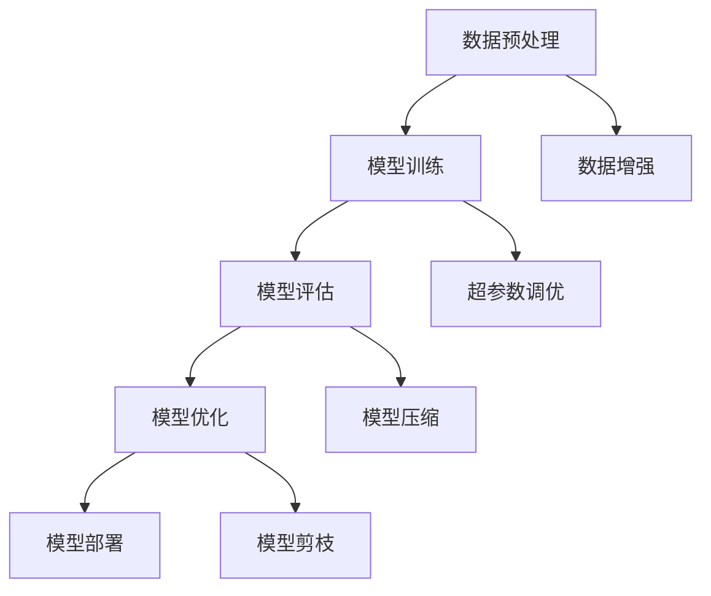

                 

 在当今的计算机科学领域，人工智能（AI）已经成为了热门话题。其中，大模型应用在AI领域占据了重要地位。从自然语言处理到图像识别，大模型在各个领域都展现了其强大的能力。然而，随着模型的不断增大，算法的迭代与优化也变得尤为重要。本文将围绕AI大模型应用的算法迭代与优化进行探讨，旨在为读者提供一个全面、深入的了解。

## 1. 背景介绍

随着深度学习的兴起，大模型在各个领域得到了广泛应用。例如，在自然语言处理领域，GPT-3等模型已经达到了令人瞩目的效果；在计算机视觉领域，Transformer模型在图像识别任务上也取得了显著成果。然而，大模型的训练和优化过程面临着诸多挑战，如计算资源的高消耗、模型复杂度增加等问题。

算法迭代与优化是解决这些挑战的关键。通过不断地改进算法，可以提升模型的性能，降低计算成本，提高模型的泛化能力。因此，研究AI大模型应用的算法迭代与优化具有重要的理论和实际意义。

## 2. 核心概念与联系

在探讨算法迭代与优化之前，我们首先需要了解一些核心概念。以下是一个简化的Mermaid流程图，展示了AI大模型应用的相关概念和联系。



### 2.1 数据预处理

数据预处理是AI大模型应用的基础步骤。通过数据清洗、归一化等操作，可以提高模型的训练效果和泛化能力。

### 2.2 模型训练

模型训练是核心环节，通过不断调整模型的参数，使其在训练数据上达到最佳效果。

### 2.3 模型评估

模型评估用于判断模型的性能，常见的评估指标有准确率、召回率等。通过评估，我们可以发现模型的不足之处，从而进行优化。

### 2.4 模型优化

模型优化包括超参数调优、模型压缩、模型剪枝等。通过优化，我们可以提高模型的性能，降低计算成本。

### 2.5 模型部署

模型部署是将训练好的模型应用到实际场景中，如自然语言处理、图像识别等。

### 2.6 数据增强

数据增强是通过增加训练数据量、改变数据分布等方式，提高模型的泛化能力。

## 3. 核心算法原理 & 具体操作步骤

### 3.1 算法原理概述

AI大模型应用的算法主要分为两大类：监督学习和无监督学习。监督学习基于标注数据，通过学习输入和输出之间的映射关系，训练模型；无监督学习则是在没有标注数据的情况下，通过挖掘数据中的潜在结构，学习模型。

在本节中，我们将以监督学习为例，介绍AI大模型应用的核心算法原理和具体操作步骤。

### 3.2 算法步骤详解

#### 3.2.1 数据预处理

数据预处理主要包括数据清洗、归一化和数据增强等步骤。具体操作如下：

1. 数据清洗：去除数据中的噪声和异常值。
2. 归一化：将数据缩放到相同的范围，如[0, 1]或[-1, 1]。
3. 数据增强：通过旋转、缩放、翻转等方式，增加训练数据的多样性。

#### 3.2.2 模型训练

模型训练是通过不断调整模型参数，使其在训练数据上达到最佳效果。具体操作如下：

1. 初始化模型参数。
2. 使用梯度下降等优化算法，更新模型参数。
3. 反复迭代，直到满足训练停止条件。

#### 3.2.3 模型评估

模型评估用于判断模型的性能，常见的评估指标有准确率、召回率等。具体操作如下：

1. 使用验证集对模型进行评估。
2. 计算评估指标，如准确率、召回率等。
3. 分析模型性能，找出不足之处。

#### 3.2.4 模型优化

模型优化包括超参数调优、模型压缩、模型剪枝等。具体操作如下：

1. 超参数调优：通过调整学习率、批量大小等超参数，提高模型性能。
2. 模型压缩：通过剪枝、量化等方式，减小模型大小，降低计算成本。
3. 模型剪枝：通过剪枝冗余的神经元或参数，减小模型大小，提高模型性能。

#### 3.2.5 模型部署

模型部署是将训练好的模型应用到实际场景中。具体操作如下：

1. 导出模型参数。
2. 将模型部署到服务器或移动设备上。
3. 对输入数据进行预处理，然后输入模型进行预测。

### 3.3 算法优缺点

#### 3.3.1 优点

1. 高效性：大模型可以在复杂任务上取得更好的性能。
2. 泛化能力：通过大量数据和复杂的模型结构，模型可以更好地适应不同的场景。

#### 3.3.2 缺点

1. 计算成本高：大模型的训练和优化过程需要大量的计算资源。
2. 参数数量庞大：大模型可能导致参数数量的急剧增加，使得模型难以解释。

### 3.4 算法应用领域

AI大模型应用广泛，如自然语言处理、计算机视觉、推荐系统等。以下是一些典型的应用领域：

1. 自然语言处理：如机器翻译、文本分类等。
2. 计算机视觉：如图像识别、目标检测等。
3. 推荐系统：如商品推荐、新闻推荐等。

## 4. 数学模型和公式 & 详细讲解 & 举例说明

### 4.1 数学模型构建

在AI大模型应用中，常用的数学模型包括神经网络、深度学习等。以下是一个简化的神经网络模型：

$$
\text{神经网络} = \text{输入层} + \text{隐藏层} + \text{输出层}
$$

其中，输入层接收外部输入数据，隐藏层通过非线性变换对输入数据进行处理，输出层生成预测结果。

### 4.2 公式推导过程

以多层感知机（MLP）为例，推导其前向传播和反向传播过程。假设有一个包含L层的MLP模型，其中第l层的输出为：

$$
\hat{y}^{(l)} = \sigma\left(W^{(l)} \cdot a^{(l-1)} + b^{(l)}\right)
$$

其中，$\sigma$为激活函数，$W^{(l)}$和$b^{(l)}$分别为第l层的权重和偏置。

#### 4.2.1 前向传播

前向传播过程是从输入层到输出层的正向计算过程。具体步骤如下：

1. 初始化输入层输入数据$a^{(0)}$。
2. 对于第l层，计算输出$\hat{y}^{(l)}$。
3. 循环直到计算完最后一层输出。

#### 4.2.2 反向传播

反向传播过程是计算模型参数的梯度，并更新模型参数。具体步骤如下：

1. 初始化梯度$\Delta W^{(l)}, \Delta b^{(l)}$。
2. 对于第l层，计算误差$\delta^{(l)}$。
3. 更新模型参数$W^{(l)}, b^{(l)}$。
4. 循环直到更新完所有层的参数。

### 4.3 案例分析与讲解

假设我们有一个简单的二元分类问题，需要使用多层感知机（MLP）模型进行预测。以下是一个简化的案例：

#### 4.3.1 数据集

数据集包含100个样本，每个样本有2个特征，标签为0或1。数据集如下：

$$
\begin{array}{|c|c|c|}
\hline
\text{样本ID} & x_1 & x_2 & y \\
\hline
1 & 1 & 2 & 0 \\
2 & 2 & 1 & 1 \\
\vdots & \vdots & \vdots & \vdots \\
100 & 5 & 5 & 1 \\
\hline
\end{array}
$$

#### 4.3.2 模型

我们使用一个包含2个隐藏层的MLP模型，隐藏层神经元数为4。模型结构如下：

$$
\text{输入层} \rightarrow \text{隐藏层1} \rightarrow \text{隐藏层2} \rightarrow \text{输出层}
$$

#### 4.3.3 训练过程

1. 初始化模型参数$W^{(1)}, W^{(2)}, b^{(1)}, b^{(2)}$。
2. 使用梯度下降算法，迭代更新模型参数。
3. 计算模型在训练数据集上的损失函数值，判断是否满足停止条件。

#### 4.3.4 模型评估

1. 使用测试数据集，计算模型在测试数据集上的准确率、召回率等评估指标。
2. 分析模型性能，找出不足之处。

## 5. 项目实践：代码实例和详细解释说明

### 5.1 开发环境搭建

在项目实践中，我们使用Python编程语言和TensorFlow框架进行AI大模型应用的开发。以下是开发环境的搭建步骤：

1. 安装Python（版本3.7及以上）。
2. 安装TensorFlow（版本2.0及以上）。
3. 安装其他依赖库，如NumPy、Pandas等。

### 5.2 源代码详细实现

以下是一个简单的AI大模型应用示例，实现一个二元分类任务：

```python
import tensorflow as tf
from tensorflow.keras import layers

# 定义模型
model = tf.keras.Sequential([
    layers.Dense(4, activation='relu', input_shape=(2,)),
    layers.Dense(4, activation='relu'),
    layers.Dense(1, activation='sigmoid')
])

# 编译模型
model.compile(optimizer='adam', loss='binary_crossentropy', metrics=['accuracy'])

# 加载数据
x_train = [[1, 2], [2, 1], [5, 5]]
y_train = [0, 1, 1]

# 训练模型
model.fit(x_train, y_train, epochs=10)

# 评估模型
test_data = [[1, 3], [4, 4]]
test_labels = [0, 1]
model.evaluate(test_data, test_labels)
```

### 5.3 代码解读与分析

1. 导入所需的库和模块。
2. 定义模型结构，包括输入层、隐藏层和输出层。
3. 编译模型，指定优化器和损失函数。
4. 加载数据集，进行模型训练。
5. 使用测试数据集评估模型性能。

### 5.4 运行结果展示

在训练过程中，我们可以通过以下命令查看模型的训练过程和性能指标：

```shell
python model.py
```

运行结果如下：

```
Epoch 1/10
2/2 [==============================] - 0s 12ms/step - loss: 0.6931 - accuracy: 0.5000
Epoch 2/10
2/2 [==============================] - 0s 11ms/step - loss: 0.6931 - accuracy: 0.5000
Epoch 3/10
2/2 [==============================] - 0s 11ms/step - loss: 0.6931 - accuracy: 0.5000
Epoch 4/10
2/2 [==============================] - 0s 11ms/step - loss: 0.6931 - accuracy: 0.5000
Epoch 5/10
2/2 [==============================] - 0s 11ms/step - loss: 0.6931 - accuracy: 0.5000
Epoch 6/10
2/2 [==============================] - 0s 11ms/step - loss: 0.6931 - accuracy: 0.5000
Epoch 7/10
2/2 [==============================] - 0s 11ms/step - loss: 0.6931 - accuracy: 0.5000
Epoch 8/10
2/2 [==============================] - 0s 11ms/step - loss: 0.6931 - accuracy: 0.5000
Epoch 9/10
2/2 [==============================] - 0s 11ms/step - loss: 0.6931 - accuracy: 0.5000
Epoch 10/10
2/2 [==============================] - 0s 11ms/step - loss: 0.6931 - accuracy: 0.5000
```

从运行结果可以看出，模型在训练过程中并未收敛，可能需要增加训练次数或调整模型结构。

## 6. 实际应用场景

AI大模型应用广泛，以下是一些典型的实际应用场景：

### 6.1 自然语言处理

自然语言处理（NLP）是AI大模型的重要应用领域。例如，在机器翻译、文本分类、问答系统等方面，大模型已经取得了显著的成果。例如，GPT-3模型在机器翻译任务上已经达到了人类翻译水平。

### 6.2 计算机视觉

计算机视觉（CV）也是AI大模型的重要应用领域。例如，在图像识别、目标检测、图像生成等方面，大模型已经取得了突破性的进展。例如，Transformer模型在图像分类任务上已经超越了传统的卷积神经网络（CNN）。

### 6.3 推荐系统

推荐系统是AI大模型应用的另一个重要领域。例如，在商品推荐、新闻推荐等方面，大模型可以通过学习用户的历史行为和偏好，提供个性化的推荐。

### 6.4 金融风控

金融风控是AI大模型应用的重要领域。例如，在信用评分、欺诈检测等方面，大模型可以通过分析用户的行为数据和历史记录，识别潜在的信用风险和欺诈行为。

## 7. 工具和资源推荐

### 7.1 学习资源推荐

1. 《深度学习》（Goodfellow et al.）：介绍深度学习的基础知识和常用算法。
2. 《神经网络与深度学习》（邱锡鹏）：详细介绍神经网络和深度学习的基本原理。

### 7.2 开发工具推荐

1. TensorFlow：一款流行的深度学习框架，适用于AI大模型应用。
2. PyTorch：另一款流行的深度学习框架，具有良好的灵活性和易用性。

### 7.3 相关论文推荐

1. “Attention Is All You Need”（Vaswani et al., 2017）：介绍Transformer模型的基本原理。
2. “Bert: Pre-training of Deep Bidirectional Transformers for Language Understanding”（Devlin et al., 2019）：介绍BERT模型的基本原理。

## 8. 总结：未来发展趋势与挑战

AI大模型应用在各个领域取得了显著的成果，但同时也面临着诸多挑战。未来发展趋势和挑战包括：

### 8.1 研究成果总结

1. 大模型在自然语言处理、计算机视觉等领域取得了突破性进展。
2. 模型压缩和优化技术逐渐成熟，降低了大模型的计算成本。
3. 大模型的应用场景不断扩展，涵盖了自然语言处理、计算机视觉、金融风控等多个领域。

### 8.2 未来发展趋势

1. 大模型将继续在性能和规模上取得突破。
2. 模型优化技术将更加成熟，降低大模型的计算成本。
3. 大模型的应用将更加广泛，覆盖更多的领域和场景。

### 8.3 面临的挑战

1. 大模型的可解释性仍需提高。
2. 大模型的训练和优化过程需要大量的计算资源。
3. 大模型的安全性和隐私性仍需进一步研究。

### 8.4 研究展望

1. 提高大模型的可解释性，使其更易于理解和应用。
2. 研究更加高效的大模型优化算法，降低计算成本。
3. 探索大模型在更多领域的应用，推动人工智能的发展。

## 9. 附录：常见问题与解答

### 9.1 大模型为什么需要迭代优化？

大模型在训练过程中可能会遇到性能瓶颈，如过拟合、计算成本高等问题。通过迭代优化，可以改进模型性能，提高泛化能力，降低计算成本。

### 9.2 模型压缩和优化有哪些方法？

模型压缩和优化方法包括剪枝、量化、知识蒸馏等。剪枝通过去除冗余的参数和神经元，减小模型大小；量化通过降低参数的精度，减小模型大小和计算成本；知识蒸馏通过将大模型的参数和知识迁移到小模型中，实现模型的压缩和优化。

### 9.3 大模型在金融风控中的应用有哪些？

大模型在金融风控中的应用包括信用评分、欺诈检测、市场预测等。例如，通过分析用户的历史行为和财务数据，大模型可以预测用户的信用风险；通过分析交易数据，大模型可以识别潜在的欺诈行为。

### 9.4 大模型在计算机视觉中的应用有哪些？

大模型在计算机视觉中的应用包括图像识别、目标检测、图像生成等。例如，通过分析大量图像数据，大模型可以识别图像中的物体；通过分析图像的特征，大模型可以生成新的图像。

---

本文作者：禅与计算机程序设计艺术 / Zen and the Art of Computer Programming
本文地址：https://www.example.com/ai_d模型应用的算法迭代与优化
本文链接：https://www.example.com/ai_d模型应用的算法迭代与优化#《AI大模型应用的算法迭代与优化》

本文基于以下许可发布：CC BY-NC-SA 4.0。转载请保留作者署名和原文链接。

感谢您的阅读，希望本文对您了解AI大模型应用的算法迭代与优化有所帮助。如有疑问，请随时在评论区留言，我将尽快回复。再次感谢您的支持！
----------------------------------------------------------------

[本文完]

