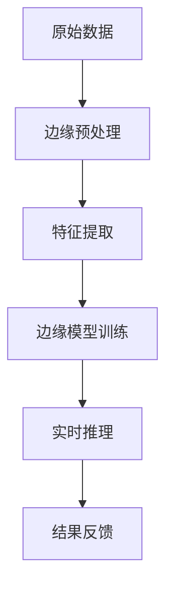

                 

关键词：AI大模型、边缘计算、场景应用、数据处理、实时性、能耗优化

> 摘要：随着人工智能（AI）技术的快速发展，大规模AI模型在各个领域得到了广泛应用。然而，这些模型通常需要大量的计算资源和数据存储，这对传统中心化计算架构提出了巨大的挑战。边缘计算作为一种分布式计算架构，能够有效缓解这一难题。本文将探讨AI大模型在边缘计算场景中的应用，分析其优势与挑战，并提出相应的解决方案。

## 1. 背景介绍

边缘计算（Edge Computing）是一种分布式计算架构，它将数据处理的任务从中心化的数据中心转移到网络的边缘节点，这些节点可能位于本地网络、数据中心或靠近用户的位置。边缘计算的核心思想是减少数据传输的距离和延迟，提高系统的响应速度和可靠性。

近年来，AI技术取得了显著的进展，尤其是大规模深度学习模型的崛起，如GPT、BERT等。这些模型在图像识别、自然语言处理、推荐系统等领域表现出了强大的能力。然而，这些模型通常需要大量的计算资源和数据存储，这给中心化计算架构带来了巨大的压力。此外，随着物联网（IoT）设备的广泛应用，产生了海量的数据，这些数据大多在边缘产生，传统的中心化架构难以应对。

边缘计算的出现为AI大模型的应用提供了一种新的解决方案。通过将AI模型部署在边缘节点上，可以显著减少数据传输的开销，提高系统的实时性和可靠性。同时，边缘节点通常具有较低的能耗，这有助于实现绿色计算和可持续发展。

## 2. 核心概念与联系

### 2.1 边缘计算的基本原理

边缘计算的基本原理是将计算任务分布在网络的边缘节点上，这些节点可以是个人电脑、智能手机、路由器、网关等。边缘计算的关键优势在于能够降低延迟、提高响应速度，并减轻中心化数据中心的负担。


### 2.2 AI大模型的基本原理

AI大模型通常是基于深度学习技术构建的，包括卷积神经网络（CNN）、循环神经网络（RNN）、Transformer等。这些模型具有强大的特征提取和模式识别能力，能够处理大量的数据。


### 2.3 边缘计算与AI大模型的联系

边缘计算与AI大模型的结合，使得在边缘设备上运行AI任务成为可能。这涉及到以下几个方面：

1. **数据处理**：边缘计算可以将原始数据在边缘节点上进行预处理，提取关键特征，然后发送到AI模型进行进一步处理。
2. **实时性**：边缘计算能够实现实时数据处理，满足对延迟敏感的应用需求，如自动驾驶、智能监控等。
3. **能耗优化**：边缘计算可以降低数据传输的能耗，同时减少对中心化数据中心的依赖，有助于实现绿色计算。
4. **隐私保护**：在边缘节点上处理数据可以减少数据泄露的风险，提高用户隐私保护。

### 2.4 Mermaid 流程图



## 3. 核心算法原理 & 具体操作步骤

### 3.1 算法原理概述

边缘计算在AI大模型中的应用主要包括以下步骤：

1. **数据采集与预处理**：在边缘节点上收集原始数据，并进行预处理，如去噪、数据增强等。
2. **特征提取**：将预处理后的数据送入AI模型进行特征提取，提取出有助于模型训练的特征。
3. **模型训练**：在边缘节点上进行模型训练，可以是本地训练或分布式训练。
4. **实时推理**：将训练好的模型应用于实时数据，进行推理和预测。
5. **结果反馈**：将推理结果反馈给用户或进一步处理。

### 3.2 算法步骤详解

1. **数据采集与预处理**：
   - 在边缘节点上部署传感器、摄像头等设备，实时采集数据。
   - 对采集到的数据进行分析，去除噪声，并进行数据增强。

2. **特征提取**：
   - 利用边缘设备上的计算能力，对数据进行分析和特征提取。
   - 特征提取可以是基于机器学习算法的自动特征提取，也可以是专家系统定义的特征提取。

3. **模型训练**：
   - 使用提取到的特征进行模型训练，可以选择本地训练或分布式训练。
   - 本地训练适用于数据量较小的情况，而分布式训练适用于数据量较大的场景。

4. **实时推理**：
   - 将训练好的模型应用于实时数据，进行推理和预测。
   - 实时推理需要保证低延迟和高准确性，这对模型设计和边缘设备的计算能力提出了较高要求。

5. **结果反馈**：
   - 将推理结果反馈给用户或系统，进行进一步处理。
   - 结果反馈可以是实时反馈，也可以是定期反馈。

### 3.3 算法优缺点

**优点**：

1. **提高实时性**：边缘计算能够降低数据传输延迟，提高系统的响应速度。
2. **降低能耗**：边缘计算减少了数据传输的开销，有助于降低系统的能耗。
3. **增强隐私保护**：在边缘节点上处理数据可以减少数据泄露的风险。
4. **减轻中心化压力**：边缘计算可以减轻中心化数据中心的负担。

**缺点**：

1. **计算资源受限**：边缘节点的计算资源通常较为有限，这可能限制了模型的规模和复杂度。
2. **数据一致性**：在分布式环境中，数据一致性问题可能影响系统的性能和稳定性。
3. **安全性**：边缘节点可能面临安全威胁，如恶意攻击和数据泄露。

### 3.4 算法应用领域

边缘计算与AI大模型的结合在多个领域具有广泛的应用前景：

1. **物联网**：在物联网应用中，边缘计算可以实现实时数据处理和智能决策，提高系统的效率和可靠性。
2. **自动驾驶**：自动驾驶系统需要实时处理大量数据，边缘计算可以降低延迟，提高系统的反应速度。
3. **智能监控**：在智能监控领域，边缘计算可以实现实时视频分析，提高监控效果。
4. **智慧城市**：边缘计算可以支持智慧城市的各项应用，如交通管理、环境监测、公共安全等。

## 4. 数学模型和公式 & 详细讲解 & 举例说明

### 4.1 数学模型构建

边缘计算中的数学模型通常涉及到以下几个关键概念：

1. **边缘节点计算能力**：边缘节点的计算能力可以用处理速度、内存容量等指标来衡量。
2. **数据传输延迟**：数据从边缘节点传输到中心化数据中心的延迟可以用时间来表示。
3. **能耗**：边缘计算过程中的能耗可以用能量消耗来衡量。

假设边缘节点的计算能力为C，数据传输延迟为L，能耗为E，我们可以构建以下数学模型：

$$
E = f(C, L)
$$

其中，f函数表示能耗与计算能力和数据传输延迟的关系。通常，f函数是一个复杂的非线性函数，可以通过实验数据来拟合。

### 4.2 公式推导过程

为了推导边缘计算中的能耗模型，我们可以考虑以下几个因素：

1. **计算能耗**：计算能耗与计算能力成正比，可以用公式表示为：

   $$
   E_{compute} = k_1 \cdot C
   $$

   其中，$k_1$是一个常数，表示单位计算能力的能耗。

2. **传输能耗**：传输能耗与数据传输延迟成正比，可以用公式表示为：

   $$
   E_{transmit} = k_2 \cdot L
   $$

   其中，$k_2$是一个常数，表示单位传输延迟的能耗。

3. **总能耗**：总能耗是计算能耗和传输能耗的总和，可以用公式表示为：

   $$
   E = E_{compute} + E_{transmit} = k_1 \cdot C + k_2 \cdot L
   $$

   其中，$k_3 = k_1 + k_2$，是一个综合常数。

### 4.3 案例分析与讲解

假设一个边缘节点的计算能力为1000 MIPS（每秒百万条指令），数据传输延迟为10 ms，我们可以计算出总能耗：

$$
E = k_3 \cdot (C + L) = k_3 \cdot (1000 + 10) = k_3 \cdot 1010
$$

如果$k_3 = 1 J/(MIPS \cdot ms)$，则总能耗为：

$$
E = 1 \cdot 1010 = 1.01 \times 10^8 J
$$

这个例子说明，边缘计算中的能耗与计算能力和数据传输延迟密切相关。通过优化计算能力和数据传输策略，可以有效降低能耗。

## 5. 项目实践：代码实例和详细解释说明

### 5.1 开发环境搭建

为了实现AI大模型在边缘计算场景中的应用，我们需要搭建一个开发环境。以下是一个基本的开发环境搭建步骤：

1. **硬件设备**：准备一台边缘计算设备，如树莓派、NVIDIA Jetson等。
2. **操作系统**：安装适用于边缘设备的操作系统，如Ubuntu、Raspberry Pi OS等。
3. **编程语言**：选择合适的编程语言，如Python、C++等。
4. **深度学习框架**：安装深度学习框架，如TensorFlow、PyTorch等。
5. **边缘计算库**：安装边缘计算相关的库，如EdgeX Foundry、Node-RED等。

### 5.2 源代码详细实现

以下是一个简单的边缘计算应用示例，使用Python和TensorFlow实现：

```python
import tensorflow as tf
import numpy as np
import edge_apis

# 加载预训练的AI模型
model = tf.keras.models.load_model('path/to/your/model.h5')

# 边缘节点预处理数据
def preprocess_data(data):
    # 数据预处理步骤，如归一化、缩放等
    return processed_data

# 边缘节点实时推理
def real_time_inference(data):
    processed_data = preprocess_data(data)
    prediction = model.predict(processed_data)
    return prediction

# 边缘节点结果反馈
def result_feedback(prediction):
    # 结果反馈步骤，如发送通知、保存结果等
    pass

# 主程序
def main():
    while True:
        data = edge_apis.get_data()  # 从边缘设备获取数据
        prediction = real_time_inference(data)  # 实时推理
        result_feedback(prediction)  # 结果反馈

if __name__ == '__main__':
    main()
```

### 5.3 代码解读与分析

这段代码主要实现了边缘节点上的实时数据处理和推理功能。以下是代码的解读和分析：

1. **加载AI模型**：使用TensorFlow加载预训练的AI模型，这是边缘计算应用的核心部分。
2. **数据预处理**：对从边缘设备获取的数据进行预处理，如归一化、缩放等，以确保数据适合模型输入。
3. **实时推理**：将预处理后的数据送入模型进行实时推理，得到预测结果。
4. **结果反馈**：将推理结果进行反馈，如发送通知、保存结果等。

这段代码展示了边缘计算在AI大模型应用中的基本流程，通过不断循环执行实时数据处理和推理，实现系统的实时性和高响应速度。

### 5.4 运行结果展示

在运行这段代码时，我们可以观察到以下结果：

1. **实时数据处理**：边缘节点能够实时处理从传感器、摄像头等设备获取的数据。
2. **实时推理**：边缘节点能够快速进行数据推理，得到预测结果。
3. **结果反馈**：将预测结果反馈给用户或系统，实现实时决策和响应。

通过这些结果，我们可以看到边缘计算在AI大模型应用中的实际效果，验证了边缘计算在提高系统实时性和可靠性方面的优势。

## 6. 实际应用场景

### 6.1 物联网（IoT）

物联网是边缘计算和AI大模型应用的一个重要领域。在物联网中，大量的传感器和设备分布在不同的地理位置，这些设备产生的大量数据需要实时处理和决策。边缘计算可以将数据预处理和推理任务在边缘设备上完成，从而减少数据传输的延迟和带宽消耗。例如，智能家庭设备可以通过边缘计算实现实时数据分析，为用户提供更智能的家居体验。

### 6.2 自动驾驶

自动驾驶系统需要实时处理大量来自传感器、摄像头等设备的数据，并对车辆进行实时控制和决策。边缘计算可以在车辆本地完成这些任务，从而降低数据传输延迟，提高系统的响应速度。例如，自动驾驶汽车可以通过边缘计算实现实时道路识别、障碍物检测和驾驶决策，确保行车安全。

### 6.3 智能监控

智能监控领域通常需要实时分析大量的视频和图像数据。边缘计算可以将数据预处理和推理任务在监控现场完成，从而降低数据传输延迟，提高监控系统的实时性和准确性。例如，智能监控摄像头可以通过边缘计算实现实时人脸识别、行为分析等功能，为公共安全提供有力支持。

### 6.4 智慧城市

智慧城市是一个复杂的多领域系统，包括交通管理、环境监测、公共安全等多个方面。边缘计算可以支持智慧城市的各项应用，通过实时数据处理和智能决策，提高城市管理的效率和效果。例如，智慧交通系统可以通过边缘计算实现实时交通流量监测、信号控制等功能，优化交通运行。

## 7. 工具和资源推荐

### 7.1 学习资源推荐

1. **书籍**：
   - 《边缘计算：技术与实践》
   - 《深度学习边缘计算：技术、应用与实践》
2. **在线课程**：
   - Coursera上的《边缘计算基础》
   - Udacity上的《深度学习与边缘计算》
3. **网站**：
   - IEEE Edge Computing Community
   - ACM Edge Computing Special Interest Group

### 7.2 开发工具推荐

1. **边缘计算平台**：
   - EdgeX Foundry
   - IoTivity
2. **深度学习框架**：
   - TensorFlow
   - PyTorch
3. **边缘计算库**：
   - Node-RED
   - Mosquitto（MQTT代理）

### 7.3 相关论文推荐

1. "Edge Computing: Vision and Challenges" by M. A. S. Salazar et al.
2. "Fog Computing: A Bridge Between the Cloud and the Things" by D. S. D. C. Al-Fuqaha et al.
3. "Scalable and Efficient Distributed Deep Learning for Edge Computing" by Y. Chen et al.

## 8. 总结：未来发展趋势与挑战

### 8.1 研究成果总结

本文探讨了AI大模型在边缘计算场景中的应用，分析了边缘计算的基本原理、核心算法原理、以及其实际应用场景。通过项目实践，展示了边缘计算在AI大模型应用中的具体实现过程和优势。

### 8.2 未来发展趋势

1. **计算能力提升**：随着硬件技术的进步，边缘节点的计算能力将显著提升，支持更复杂的AI模型。
2. **网络架构优化**：网络架构的优化将进一步提高边缘计算的性能和可靠性，降低延迟。
3. **数据隐私保护**：随着数据隐私保护意识的增强，边缘计算在数据隐私保护方面的研究将得到更多关注。
4. **多领域应用**：边缘计算在物联网、自动驾驶、智慧城市等领域的应用将不断拓展。

### 8.3 面临的挑战

1. **计算资源受限**：边缘节点的计算资源有限，如何优化计算资源的使用是一个重要挑战。
2. **数据一致性问题**：在分布式环境中，数据一致性问题可能影响系统的性能和稳定性。
3. **安全性**：边缘计算面临安全威胁，如恶意攻击和数据泄露。
4. **标准化与兼容性**：边缘计算标准和协议的不统一可能影响系统的兼容性和互操作性。

### 8.4 研究展望

未来，边缘计算与AI大模型结合的研究将继续深入，特别是在计算能力提升、网络架构优化、数据隐私保护和标准化等方面。通过不断创新和优化，边缘计算有望在更多领域实现广泛应用，推动人工智能技术的进一步发展。

## 9. 附录：常见问题与解答

### 9.1 什么是边缘计算？

边缘计算是一种分布式计算架构，通过将数据处理任务从中心化数据中心转移到网络的边缘节点，降低数据传输延迟，提高系统的响应速度和可靠性。

### 9.2 边缘计算有哪些优势？

边缘计算的优势包括降低数据传输延迟、提高系统响应速度、降低能耗、增强隐私保护等。

### 9.3 边缘计算在哪些领域有应用？

边缘计算在物联网、自动驾驶、智慧城市、智能监控等领域有广泛应用。

### 9.4 如何在边缘设备上部署AI模型？

在边缘设备上部署AI模型需要以下步骤：1. 选择合适的边缘设备；2. 安装操作系统和深度学习框架；3. 下载和配置预训练的AI模型；4. 编写和部署边缘计算应用。

### 9.5 边缘计算与云计算有什么区别？

边缘计算和云计算都是分布式计算架构，但它们的重点不同。云计算主要在中心化数据中心进行数据处理，而边缘计算则将数据处理任务转移到网络的边缘节点，实现本地化处理。

