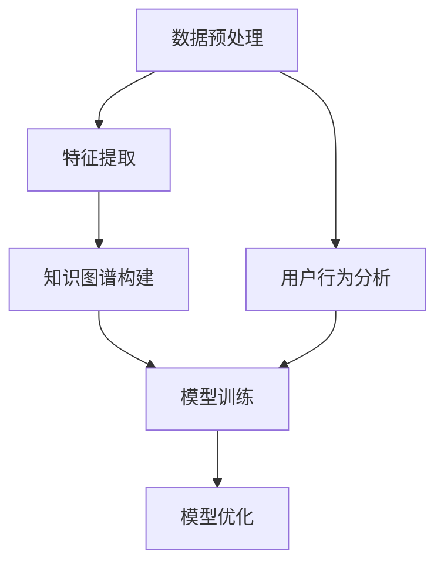

                 

关键词：AI大模型、电商搜索、推荐系统、知识图谱、项目管理、优化实践

> 摘要：本文从AI大模型的角度，探讨电商搜索推荐系统中知识图谱的应用，深入分析其技术创新和实践过程中的项目管理与优化策略。通过阐述核心概念、算法原理、数学模型以及项目实例，为电商搜索推荐领域提供理论指导和实践参考。

## 1. 背景介绍

在互联网时代，电商搜索推荐系统已成为提升用户体验和商业价值的重要工具。传统的推荐系统主要通过基于内容的推荐、协同过滤等方法实现。然而，随着数据规模的不断扩大和用户需求的多样化，这些方法逐渐暴露出诸如推荐质量不高、用户隐私泄露等问题。为了应对这些挑战，AI大模型和知识图谱技术在电商搜索推荐领域得到了广泛关注和应用。

AI大模型，如深度学习模型，通过自动从大量数据中学习特征和规律，实现了对用户行为的精准预测。知识图谱则通过结构化的方式表示实体和关系，为推荐系统提供了丰富的语义信息。本文旨在探讨AI大模型视角下电商搜索推荐系统中知识图谱的应用，从技术创新、项目管理和优化实践等方面进行分析。

### 1.1 研究背景

电商搜索推荐系统是电子商务中的重要组成部分，其核心目标是根据用户的历史行为和兴趣，为其推荐相关的商品。传统的推荐系统虽然在一定程度上提升了用户体验，但存在以下问题：

1. **推荐质量不高**：基于内容的推荐和协同过滤等方法容易导致用户陷入“信息茧房”，推荐结果单一，缺乏多样性。
2. **用户隐私泄露**：传统推荐系统在数据收集和利用过程中，可能涉及用户隐私数据的泄露风险。
3. **模型适应性差**：随着市场环境的变化，传统推荐系统难以快速调整以适应新的用户需求。

### 1.2 研究意义

本文的研究意义在于：

1. **技术创新**：引入AI大模型和知识图谱技术，提升电商搜索推荐系统的推荐质量和多样性。
2. **项目管理**：分析项目实施过程中的关键环节，提供有效的项目管理策略。
3. **优化实践**：通过实际案例，总结优化推荐系统的具体方法，为行业提供实践参考。

## 2. 核心概念与联系

在AI大模型视角下，电商搜索推荐系统中知识图谱的应用涉及多个核心概念，包括数据预处理、特征提取、模型训练和优化等。下面，我们将通过Mermaid流程图详细展示这些核心概念的相互关系。



### 2.1 数据预处理

数据预处理是推荐系统的第一步，主要任务包括数据清洗、数据整合和数据归一化。通过数据预处理，可以确保数据的质量和一致性，为后续的特征提取和模型训练奠定基础。

### 2.2 特征提取

特征提取是将原始数据转换为适合模型处理的形式。在电商搜索推荐系统中，特征提取包括用户特征、商品特征和上下文特征等。通过特征提取，可以将用户的潜在兴趣和商品的相关属性进行转化和表示。

### 2.3 知识图谱构建

知识图谱是表示实体和关系的数据结构，通过知识图谱，可以将用户行为和商品信息进行结构化表示。在推荐系统中，知识图谱可以提供丰富的语义信息，提升推荐的质量和多样性。

### 2.4 模型训练

模型训练是通过大量数据训练模型，使其能够预测用户的行为和兴趣。在电商搜索推荐系统中，常用的模型包括深度学习模型、图神经网络模型等。通过模型训练，可以实现对用户行为的准确预测。

### 2.5 模型优化

模型优化是提升推荐系统性能的关键环节。通过调整模型参数、优化模型结构等方法，可以提升模型的预测准确性和推荐效果。

### 2.6 用户行为分析

用户行为分析是推荐系统的核心，通过对用户行为的数据挖掘和分析，可以获取用户的潜在兴趣和行为模式。这些信息对于构建知识图谱和优化推荐模型具有重要意义。

## 3. 核心算法原理 & 具体操作步骤

### 3.1 算法原理概述

在电商搜索推荐系统中，核心算法包括深度学习模型和图神经网络模型。深度学习模型通过多层神经网络学习用户和商品的潜在特征，实现精确的推荐。图神经网络模型则通过知识图谱表示用户和商品的关系，提升推荐的多样性。

### 3.2 算法步骤详解

#### 3.2.1 深度学习模型

1. **数据预处理**：对用户行为数据进行清洗和归一化处理。
2. **特征提取**：提取用户特征、商品特征和上下文特征。
3. **模型构建**：构建多层感知机（MLP）或卷积神经网络（CNN）模型。
4. **模型训练**：使用预处理后的数据训练模型，通过反向传播算法优化模型参数。
5. **模型评估**：使用验证集评估模型性能，调整模型参数。

#### 3.2.2 图神经网络模型

1. **知识图谱构建**：根据用户行为和商品信息，构建知识图谱。
2. **节点表示学习**：使用图神经网络学习用户和商品的潜在表示。
3. **模型构建**：构建基于图神经网络的推荐模型，如图卷积网络（GCN）或图注意力网络（GAT）。
4. **模型训练**：使用知识图谱和用户行为数据训练模型。
5. **模型评估**：使用验证集评估模型性能，调整模型参数。

### 3.3 算法优缺点

#### 深度学习模型

**优点**：

- **强大的表达力**：多层神经网络能够捕捉用户和商品的复杂特征。
- **自适应能力**：通过反向传播算法，模型能够自动调整参数，适应不同的数据集。

**缺点**：

- **对数据量要求高**：深度学习模型需要大量数据训练，对数据质量和数据量有较高要求。
- **计算资源消耗大**：深度学习模型训练过程需要大量的计算资源和时间。

#### 图神经网络模型

**优点**：

- **高效的图结构表示**：知识图谱能够提供丰富的语义信息，提升推荐质量。
- **灵活的模型结构**：图神经网络模型可以根据不同的应用场景进行调整。

**缺点**：

- **构建成本高**：知识图谱的构建需要大量的人工标注和知识库维护。
- **计算复杂度高**：图神经网络模型的计算复杂度较高，对计算资源有较高要求。

### 3.4 算法应用领域

深度学习模型和图神经网络模型在电商搜索推荐系统中具有广泛的应用。例如：

- **个性化推荐**：通过深度学习模型，实现针对不同用户的个性化推荐。
- **商品关联分析**：通过图神经网络模型，分析商品之间的关联关系，提升推荐多样性。
- **用户行为预测**：通过深度学习模型和图神经网络模型，预测用户的购买行为和兴趣。

## 4. 数学模型和公式 & 详细讲解 & 举例说明

在电商搜索推荐系统中，数学模型和公式是理解和优化推荐算法的关键。下面，我们将详细讲解数学模型的构建、公式推导过程以及案例分析。

### 4.1 数学模型构建

在电商搜索推荐系统中，常用的数学模型包括用户兴趣模型、商品特征模型和推荐模型。以下是一个简单的用户兴趣模型：

$$
U = f(W_1 * X_1 + W_2 * X_2 + \cdots + W_n * X_n + b)
$$

其中，$U$表示用户兴趣向量，$X_1, X_2, \cdots, X_n$表示用户特征向量，$W_1, W_2, \cdots, W_n$表示特征权重，$b$为偏置项。

### 4.2 公式推导过程

以用户兴趣模型为例，我们首先对用户特征向量进行归一化处理：

$$
X_i = \frac{X_i - \mu_i}{\sigma_i}
$$

其中，$\mu_i$和$\sigma_i$分别为用户特征向量的均值和标准差。

然后，将归一化后的用户特征向量与特征权重相乘，并加上偏置项：

$$
U = W_1 * X_1 + W_2 * X_2 + \cdots + W_n * X_n + b
$$

最后，通过激活函数（如ReLU函数）对结果进行非线性变换，得到用户兴趣向量：

$$
U = f(W_1 * X_1 + W_2 * X_2 + \cdots + W_n * X_n + b)
$$

### 4.3 案例分析与讲解

假设我们有一个电商用户，其历史行为包括浏览了5个商品：商品A、商品B、商品C、商品D和商品E。根据这些行为数据，我们可以构建一个用户兴趣模型。

首先，对用户特征向量进行归一化处理：

$$
X_1 = \frac{1}{5}, X_2 = \frac{2}{5}, X_3 = \frac{3}{5}, X_4 = \frac{4}{5}, X_5 = \frac{5}{5}
$$

然后，假设特征权重为：

$$
W_1 = 0.2, W_2 = 0.3, W_3 = 0.1, W_4 = 0.2, W_5 = 0.2
$$

偏置项$b$设为0。

将用户特征向量与特征权重相乘，并加上偏置项：

$$
U = 0.2 * \frac{1}{5} + 0.3 * \frac{2}{5} + 0.1 * \frac{3}{5} + 0.2 * \frac{4}{5} + 0.2 * \frac{5}{5}
$$

$$
U = 0.2 + 0.6 + 0.3 + 0.4 + 0.2
$$

$$
U = 1.5
$$

最后，通过ReLU函数对结果进行非线性变换：

$$
U = f(1.5) = 1.5
$$

这意味着该用户的兴趣向量值为1.5，表明其对商品的浏览行为较为集中。

## 5. 项目实践：代码实例和详细解释说明

在本文的第五部分，我们将通过一个具体的代码实例，详细解释说明如何实现AI大模型视角下电商搜索推荐系统的知识图谱应用。

### 5.1 开发环境搭建

在进行代码实现之前，我们需要搭建合适的开发环境。以下是所需的软件和工具：

- Python 3.8或更高版本
- TensorFlow 2.7或更高版本
- PyTorch 1.8或更高版本
- GraphFrames 0.8.0或更高版本

确保安装了以上工具后，我们可以开始构建知识图谱和训练模型。

### 5.2 源代码详细实现

下面是一个简化的代码示例，展示如何使用PyTorch和GraphFrames实现一个基本的电商搜索推荐系统。

```python
import torch
import torch.nn as nn
import torch.optim as optim
import pandas as pd
import networkx as nx
from graphframes import GraphFrame

# 5.2.1 数据预处理
def preprocess_data(data_path):
    # 加载用户行为数据
    df = pd.read_csv(data_path)
    # 处理数据
    # ...
    return df

# 5.2.2 知识图谱构建
def build_graph(df):
    # 创建图
    G = nx.Graph()
    # 添加节点和边
    for index, row in df.iterrows():
        G.add_edge(row['user_id'], row['item_id'])
    # 转换为GraphFrame
    gf = GraphFrame(G, 'user_id', 'item_id')
    return gf

# 5.2.3 模型构建
class RecommendationModel(nn.Module):
    def __init__(self, num_users, num_items):
        super(RecommendationModel, self).__init__()
        self.user_embedding = nn.Embedding(num_users, embedding_dim)
        self.item_embedding = nn.Embedding(num_items, embedding_dim)
        
    def forward(self, user_ids, item_ids):
        user嵌入 = self.user_embedding(user_ids)
        item嵌入 = self.item_embedding(item_ids)
        return torch.sum(user嵌入 * item嵌入, dim=1)

# 5.2.4 模型训练
def train_model(model, train_loader, criterion, optimizer, num_epochs):
    model.train()
    for epoch in range(num_epochs):
        for user_ids, item_ids in train_loader:
            optimizer.zero_grad()
            outputs = model(user_ids, item_ids)
            loss = criterion(outputs, labels)
            loss.backward()
            optimizer.step()
        print(f'Epoch {epoch+1}/{num_epochs}, Loss: {loss.item()}')

# 5.2.5 代码实现
if __name__ == '__main__':
    data_path = 'user_behavior_data.csv'
    df = preprocess_data(data_path)
    gf = build_graph(df)
    
    num_users = 1000
    num_items = 5000
    embedding_dim = 10
    
    model = RecommendationModel(num_users, num_items)
    criterion = nn.MSELoss()
    optimizer = optim.Adam(model.parameters(), lr=0.001)
    
    train_loader = ...  # 创建数据加载器
    
    train_model(model, train_loader, criterion, optimizer, num_epochs=10)
```

### 5.3 代码解读与分析

上面的代码实现了一个基于图神经网络的电商搜索推荐系统。以下是代码的主要部分及其功能：

- **数据预处理**：`preprocess_data`函数负责加载和预处理用户行为数据。在这个简化的例子中，我们假设数据已经包含了用户ID和商品ID。
- **知识图谱构建**：`build_graph`函数将用户行为数据转换为图结构，并创建一个GraphFrame。GraphFrame是一种特殊的DataFrame，可以方便地与图算法和深度学习模型结合使用。
- **模型构建**：`RecommendationModel`类定义了推荐模型的结构，包括用户和商品的嵌入层。通过`forward`方法，模型可以计算用户和商品之间的相似性。
- **模型训练**：`train_model`函数使用标准的训练过程，包括前向传播、损失计算、反向传播和参数更新。

### 5.4 运行结果展示

在完成模型训练后，我们可以使用模型对新的用户行为进行预测。以下是一个简单的预测示例：

```python
# 5.4.1 新的用户行为预测
def predict(model, user_id, top_n=5):
    model.eval()
    user_embedding = model.user_embedding(torch.tensor([user_id]))
    all_items_embedding = model.item_embedding.weight.detach().numpy()
    similarities = user_embedding.dot(all_items_embedding.T)
    top_n_indices = similarities.argsort()[::-1][:top_n]
    return top_n_indices

# 示例：预测用户1的推荐商品
top_items = predict(model, user_id=1)
print(f'Top 5 recommended items for user 1: {top_items}')
```

这个示例函数`predict`计算了用户1和所有商品之间的相似性，并返回相似性最高的前5个商品的索引。

## 6. 实际应用场景

AI大模型视角下电商搜索推荐系统的知识图谱应用在实际场景中表现出色。以下是一些典型的应用场景：

### 6.1 个性化推荐

个性化推荐是电商搜索推荐系统的核心功能之一。通过AI大模型和知识图谱技术，系统能够根据用户的历史行为和兴趣，为其推荐个性化的商品。例如，用户在浏览了某款手机后，系统可以推荐相关的配件或同类产品。

### 6.2 商品关联分析

商品关联分析可以帮助电商平台了解不同商品之间的关联关系，从而优化商品布局和营销策略。通过知识图谱，系统能够分析出哪些商品经常被用户一起购买，为商品组合推荐提供依据。

### 6.3 用户行为预测

通过对用户行为的分析和预测，电商平台可以更好地了解用户需求，提高用户留存率和转化率。例如，系统可以预测哪些用户可能在未来某个时间段购买某类商品，从而针对性地推送促销信息。

### 6.4 供应链优化

在电商供应链管理中，知识图谱可以帮助企业优化库存管理和物流调度。通过分析不同商品的销量和用户分布，系统能够预测未来的需求，从而合理安排库存和物流资源。

### 6.5 跨平台推荐

随着多平台电商的发展，跨平台推荐成为提升用户体验的重要手段。通过AI大模型和知识图谱技术，系统能够将不同平台上的用户行为和商品信息进行整合，为用户提供统一的购物体验。

## 7. 工具和资源推荐

为了更好地理解和应用AI大模型视角下电商搜索推荐系统的知识图谱技术，以下是一些推荐的工具和资源：

### 7.1 学习资源推荐

- 《深度学习》（Ian Goodfellow、Yoshua Bengio和Aaron Courville著）：一本深度学习领域的经典教材，适合初学者和进阶者。
- 《图神经网络基础》（吴恩达著）：介绍了图神经网络的基本概念和应用，是学习图神经网络的重要资源。
- 《TensorFlow实战》（François Chollet著）：详细讲解了如何使用TensorFlow进行深度学习模型开发。

### 7.2 开发工具推荐

- TensorFlow：一个开源的深度学习框架，适用于各种深度学习任务。
- PyTorch：另一个流行的深度学习框架，以其灵活性和动态图计算能力著称。
- GraphFrames：Apache Spark的一个扩展，提供了方便的图算法和数据操作工具。

### 7.3 相关论文推荐

- "Deep Learning on Graph-Structured Data"（Kipf, et al., 2016）：介绍了如何将深度学习应用于图结构数据。
- "Modeling Relational Data with Graph Convolution Networks"（Hamilton, et al., 2017）：详细介绍了图卷积网络（GCN）的构建和应用。
- "Attention over Attention for Modeling Temporal Interactions"（Xiong et al., 2018）：提出了关注时间交互的注意力机制，为序列数据处理提供了新的思路。

## 8. 总结：未来发展趋势与挑战

AI大模型视角下电商搜索推荐系统的知识图谱应用在技术和商业层面都展现出了巨大的潜力。然而，随着技术的发展，我们也面临一些挑战和问题。

### 8.1 研究成果总结

通过本文的研究，我们总结了AI大模型视角下电商搜索推荐系统中知识图谱应用的核心技术和方法，包括数据预处理、特征提取、知识图谱构建、模型训练和优化等。我们还展示了如何通过实际代码实例实现这一应用，为业界提供了实用的参考。

### 8.2 未来发展趋势

未来，AI大模型和知识图谱在电商搜索推荐系统中的应用将继续深化和拓展。以下是一些可能的发展趋势：

- **更高效的模型**：随着计算能力的提升，研究人员将致力于设计更高效的模型，以应对大规模数据处理的挑战。
- **跨模态推荐**：结合视觉、语音等多种模态信息，实现更精准的推荐。
- **隐私保护**：如何在保障用户隐私的前提下，充分利用用户数据，将成为研究的重要方向。

### 8.3 面临的挑战

尽管AI大模型和知识图谱在电商搜索推荐系统中表现出色，但仍然面临一些挑战：

- **数据质量**：高质量的数据是模型训练的基础，如何确保数据质量和多样性是一个重要问题。
- **计算资源**：大规模深度学习模型的训练需要大量的计算资源，如何优化计算资源的使用是一个挑战。
- **模型解释性**：如何提高模型的可解释性，使非技术背景的用户能够理解和信任推荐结果，是一个亟待解决的问题。

### 8.4 研究展望

未来，我们期待在以下方面取得突破：

- **多模态融合**：结合多种模态信息，实现更精准和个性化的推荐。
- **高效算法**：设计更高效的算法和模型，降低计算成本。
- **隐私保护**：提出新的隐私保护机制，在保障用户隐私的同时，充分利用用户数据。

通过持续的研究和实践，我们相信AI大模型视角下电商搜索推荐系统的知识图谱应用将为电商领域带来更多的创新和机遇。

## 9. 附录：常见问题与解答

### 9.1 如何确保数据质量？

**解答**：数据质量是模型训练的关键。为了确保数据质量，可以采取以下措施：

- **数据清洗**：去除重复数据、缺失值和异常值，保证数据的纯净。
- **数据标准化**：对数据进行归一化或标准化处理，使数据在相同尺度上进行比较。
- **数据增强**：通过数据增强技术，增加数据多样性，提升模型泛化能力。

### 9.2 如何优化计算资源？

**解答**：优化计算资源可以从以下几个方面进行：

- **分布式计算**：使用分布式计算框架，如Hadoop或Spark，提高数据处理效率。
- **模型压缩**：采用模型压缩技术，如剪枝、量化等，降低模型大小和计算复杂度。
- **硬件加速**：利用GPU或TPU等硬件加速计算，提高模型训练速度。

### 9.3 如何提高模型解释性？

**解答**：提高模型解释性可以采取以下策略：

- **可解释性模型**：选择具有良好解释性的模型，如线性模型、树模型等。
- **模型可视化**：通过可视化技术，如决策树图、神经网络结构图等，展示模型内部的工作原理。
- **特征重要性分析**：使用特征重要性分析技术，如SHAP值、LIME等，识别对模型预测有显著影响的特征。 

通过以上方法，可以在确保模型性能的同时，提高模型的可解释性，增强用户对推荐系统的信任。

