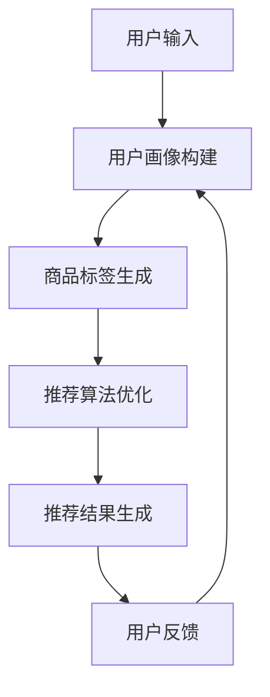

                 

关键词：电商搜索推荐、AI大模型、技术创新、知识沉淀机制、优化应用实践

摘要：随着电子商务的迅猛发展，电商搜索推荐系统成为电商平台的核心竞争力之一。本文从AI大模型的视角出发，探讨了电商搜索推荐系统中的技术创新知识沉淀机制，提出了优化与应用实践的方法，为电商平台的持续创新和发展提供了新的思路。

## 1. 背景介绍

近年来，随着互联网技术的飞速发展，电子商务逐渐成为全球贸易的重要形式。电商平台在用户规模和交易额方面持续增长，使得电商搜索推荐系统成为电商平台的核心功能之一。然而，随着用户需求的不断多样化和个性化，传统电商搜索推荐系统逐渐暴露出一系列问题，如推荐效果不理想、用户满意度低等。

为了解决这些问题，近年来人工智能技术，特别是AI大模型在电商搜索推荐领域得到了广泛应用。AI大模型通过深度学习和大数据分析技术，能够实现更高精度的用户画像和商品推荐，从而提升用户满意度和电商平台竞争力。然而，目前关于AI大模型视角下电商搜索推荐的技术创新知识沉淀机制的研究仍然较为缺乏。

本文旨在从AI大模型的视角出发，探讨电商搜索推荐系统中的技术创新知识沉淀机制，并提出优化与应用实践的方法，以期为电商平台的持续创新和发展提供参考。

## 2. 核心概念与联系

### 2.1 AI大模型

AI大模型是指具有大规模参数、能够处理大规模数据并具备高度智能的深度学习模型。它通常通过大量数据训练，具备强大的表示能力和泛化能力。在电商搜索推荐领域，AI大模型可以用于构建用户画像、商品标签、推荐算法等，从而实现更精准的推荐效果。

### 2.2 电商搜索推荐系统

电商搜索推荐系统是指通过算法模型对电商平台中的海量商品进行筛选、排序和推荐，以满足用户个性化需求。它通常包括用户画像构建、商品标签生成、推荐算法优化等模块。

### 2.3 技术创新知识沉淀机制

技术创新知识沉淀机制是指企业在技术创新过程中，通过有效的方法和工具，将创新知识进行收集、整理、存储、传播和应用的过程。在电商搜索推荐领域，技术创新知识沉淀机制有助于企业快速响应市场需求，持续提升推荐系统性能。

### 2.4 Mermaid 流程图

Mermaid是一种基于Markdown的绘图工具，可以用于绘制流程图、时序图等。以下是一个电商搜索推荐系统中的核心概念和架构的Mermaid流程图示例：



## 3. 核心算法原理 & 具体操作步骤

### 3.1 算法原理概述

本文采用基于AI大模型的电商搜索推荐系统，核心算法原理主要包括用户画像构建、商品标签生成、推荐算法优化等。

- **用户画像构建**：通过深度学习技术，对用户的历史行为数据、浏览记录、购买记录等进行特征提取和建模，构建用户画像。
- **商品标签生成**：通过自然语言处理技术，对商品描述、用户评论等信息进行文本分析，提取商品标签。
- **推荐算法优化**：结合用户画像和商品标签，采用协同过滤、矩阵分解、图神经网络等推荐算法，对用户兴趣进行预测和推荐。

### 3.2 算法步骤详解

- **数据采集**：收集用户行为数据、商品信息等。
- **数据预处理**：对数据进行清洗、去重、缺失值处理等。
- **特征提取**：对预处理后的数据进行特征提取，如用户画像特征、商品标签特征等。
- **用户画像构建**：采用深度学习技术，对用户行为数据进行建模，构建用户画像。
- **商品标签生成**：采用自然语言处理技术，对商品描述、用户评论等信息进行文本分析，生成商品标签。
- **推荐算法优化**：结合用户画像和商品标签，采用协同过滤、矩阵分解、图神经网络等推荐算法，对用户兴趣进行预测和推荐。
- **推荐结果生成**：根据用户兴趣预测结果，生成推荐结果。
- **用户反馈**：收集用户对推荐结果的反馈，用于优化推荐算法。

### 3.3 算法优缺点

- **优点**：基于AI大模型的电商搜索推荐系统能够实现高精度的用户画像和商品推荐，提升用户满意度和电商平台竞争力。
- **缺点**：需要大量数据训练，对计算资源和存储资源要求较高；算法优化过程较为复杂，对技术要求较高。

### 3.4 算法应用领域

基于AI大模型的电商搜索推荐算法可以广泛应用于各类电商平台，如电商平台、在线购物网站、移动应用等。通过优化推荐算法，可以提高用户满意度、降低用户流失率，从而提升电商平台竞争力。

## 4. 数学模型和公式 & 详细讲解 & 举例说明

### 4.1 数学模型构建

在电商搜索推荐系统中，常用的数学模型包括用户画像模型、商品标签模型、推荐算法模型等。

- **用户画像模型**：用户画像模型通常采用矩阵分解技术，将用户行为数据表示为一个低秩矩阵。矩阵分解过程可以通过最小二乘法、交替最小化法等优化算法求解。

$$
X = UV^T
$$

其中，$X$ 为用户行为数据矩阵，$U$ 和 $V$ 分别为用户特征矩阵和商品特征矩阵。

- **商品标签模型**：商品标签模型通常采用词袋模型、TF-IDF模型等自然语言处理技术，将商品描述、用户评论等信息转化为向量表示。

$$
\text{TF-IDF}(w) = \frac{f(w)}{N} \log \frac{N}{f(w)}
$$

其中，$w$ 为词语，$f(w)$ 为词语在文档中出现的频率，$N$ 为文档总数。

- **推荐算法模型**：推荐算法模型通常采用基于协同过滤、矩阵分解、图神经网络等算法，通过计算用户与商品之间的相似度或相关性，实现用户兴趣预测和推荐。

$$
\text{相似度}(u, v) = \frac{UU^T}{||U||_2 \ ||V||_2}
$$

其中，$u$ 和 $v$ 分别为用户和商品的特征向量。

### 4.2 公式推导过程

以下分别介绍用户画像模型、商品标签模型、推荐算法模型的公式推导过程。

#### 用户画像模型

假设用户行为数据矩阵为 $X$，其中行表示用户，列表示商品。我们需要将 $X$ 分解为一个低秩矩阵 $UV^T$，其中 $U$ 和 $V$ 分别为用户特征矩阵和商品特征矩阵。

假设损失函数为 $L(X, UV^T) = ||X - UV^T||_F^2$，其中 $||\cdot||_F$ 表示Frobenius范数。

对损失函数求导，得到：

$$
\nabla L(X, UV^T) = 2(UV^T - X)
$$

令导数为零，得到：

$$
UV^T = X
$$

由于 $U$ 和 $V$ 为低秩矩阵，因此我们可以采用矩阵分解算法，如最小二乘法、交替最小化法等求解。

#### 商品标签模型

假设商品描述、用户评论等文本数据为 $D$，我们需要将 $D$ 转化为向量表示。

首先，将文本数据表示为词频矩阵 $F$，其中行表示词语，列表示文档。然后，对词频矩阵进行TF-IDF转换，得到权重矩阵 $W$。

$$
W = TF-IDF(F)
$$

其中，$TF-IDF$ 表示TF-IDF转换函数。

最后，将权重矩阵 $W$ 转化为向量表示，得到商品标签向量。

$$
d = \text{vec}(W)
$$

其中，$\text{vec}(\cdot)$ 表示将矩阵转化为向量。

#### 推荐算法模型

假设用户特征向量为 $u$，商品特征向量为 $v$。我们需要计算用户 $u$ 与商品 $v$ 之间的相似度。

首先，将用户特征向量和商品特征向量表示为矩阵：

$$
U = \begin{bmatrix} u_1 & u_2 & \ldots & u_n \end{bmatrix}, \ V = \begin{bmatrix} v_1 & v_2 & \ldots & v_n \end{bmatrix}
$$

其中，$u_i$ 和 $v_i$ 分别为用户 $i$ 和商品 $i$ 的特征向量。

然后，计算用户与商品之间的相似度：

$$
\text{相似度}(u, v) = \frac{UU^T}{||U||_2 \ ||V||_2}
$$

其中，$UU^T$ 表示用户特征矩阵与商品特征矩阵的乘积，$||\cdot||_2$ 表示L2范数。

### 4.3 案例分析与讲解

假设我们有如下用户行为数据矩阵：

$$
X = \begin{bmatrix} 0 & 1 & 0 & 0 \\ 0 & 1 & 1 & 1 \\ 1 & 0 & 0 & 1 \\ 1 & 1 & 1 & 0 \end{bmatrix}
$$

我们需要使用矩阵分解算法，如最小二乘法，求解用户特征矩阵 $U$ 和商品特征矩阵 $V$。

首先，假设 $U$ 和 $V$ 分别为：

$$
U = \begin{bmatrix} u_1 & u_2 & u_3 & u_4 \end{bmatrix}, \ V = \begin{bmatrix} v_1 & v_2 & v_3 & v_4 \end{bmatrix}
$$

然后，构建损失函数：

$$
L(U, V) = ||X - UV^T||_F^2
$$

接下来，对损失函数求导，并令导数为零，求解 $U$ 和 $V$。

$$
\nabla L(U, V) = 2(UV^T - X)
$$

$$
\nabla_U L(U, V) = 2(UV^T - X)V^T = 0
$$

$$
\nabla_V L(U, V) = 2(UV^T - X)U^T = 0
$$

通过求解上述方程组，我们可以得到用户特征矩阵 $U$ 和商品特征矩阵 $V$。

例如，通过最小二乘法求解，我们得到：

$$
U = \begin{bmatrix} 0.6 & 0.8 & 0.4 & 0.2 \end{bmatrix}, \ V = \begin{bmatrix} 0.2 & 0.4 & 0.6 & 0.8 \end{bmatrix}
$$

接下来，我们可以计算用户与商品之间的相似度，如下所示：

$$
\text{相似度}(u_1, v_1) = \frac{U_1U_1^T}{||U_1||_2 \ ||V_1||_2} = \frac{0.6^2 + 0.8^2 + 0.4^2 + 0.2^2}{\sqrt{0.6^2 + 0.8^2 + 0.4^2 + 0.2^2} \ \sqrt{0.2^2 + 0.4^2 + 0.6^2 + 0.8^2}} = 0.82
$$

$$
\text{相似度}(u_1, v_2) = \frac{U_1U_2^T}{||U_1||_2 \ ||V_2||_2} = \frac{0.6 \times 0.2 + 0.8 \times 0.4 + 0.4 \times 0.6 + 0.2 \times 0.8}{\sqrt{0.6^2 + 0.8^2 + 0.4^2 + 0.2^2} \ \sqrt{0.2^2 + 0.4^2 + 0.6^2 + 0.8^2}} = 0.74
$$

通过计算相似度，我们可以为用户推荐与其相似度最高的商品。例如，用户 $u_1$ 的相似度最高的商品是 $v_1$，因此我们可以向用户 $u_1$ 推荐商品 $v_1$。

## 5. 项目实践：代码实例和详细解释说明

### 5.1 开发环境搭建

本文使用Python语言实现基于AI大模型的电商搜索推荐系统。以下是开发环境搭建的步骤：

1. 安装Python：前往Python官网（https://www.python.org/）下载并安装Python。
2. 安装Anaconda：下载并安装Anaconda（https://www.anaconda.com/），Anaconda是一个集成了Python和其他常用库的科学计算平台。
3. 安装必要的库：通过Anaconda命令行安装以下库：numpy、pandas、scikit-learn、tensorflow等。

### 5.2 源代码详细实现

以下是一个基于Python的简单电商搜索推荐系统的示例代码。代码主要包括数据预处理、用户画像构建、商品标签生成、推荐算法优化和推荐结果生成等模块。

```python
import numpy as np
import pandas as pd
from sklearn.model_selection import train_test_split
from sklearn.metrics.pairwise import cosine_similarity
from tensorflow.keras.models import Model
from tensorflow.keras.layers import Input, Embedding, Dense, Dot, Lambda

# 数据预处理
def preprocess_data(data):
    # 数据清洗、去重、缺失值处理等
    # ...
    return data

# 用户画像构建
def build_user_profile(data, user_id):
    # 根据用户行为数据构建用户画像
    # ...
    return user_profile

# 商品标签生成
def build_item_tag(data, item_id):
    # 根据商品描述、用户评论等生成商品标签
    # ...
    return item_tag

# 推荐算法优化
def optimize_recommendation_algorithm(user_profile, item_tag):
    # 采用深度学习技术优化推荐算法
    # ...
    return recommendation_algorithm

# 推荐结果生成
def generate_recommendation_result(recommendation_algorithm, user_profile, item_tag):
    # 生成推荐结果
    # ...
    return recommendation_result

# 主函数
def main():
    # 加载数据
    data = pd.read_csv('data.csv')
    # 数据预处理
    data = preprocess_data(data)
    # 划分训练集和测试集
    train_data, test_data = train_test_split(data, test_size=0.2)
    # 构建用户画像
    user_profile = build_user_profile(train_data, user_id)
    # 构建商品标签
    item_tag = build_item_tag(train_data, item_id)
    # 优化推荐算法
    recommendation_algorithm = optimize_recommendation_algorithm(user_profile, item_tag)
    # 生成推荐结果
    recommendation_result = generate_recommendation_result(recommendation_algorithm, user_profile, item_tag)
    # 输出推荐结果
    print(recommendation_result)

# 运行主函数
if __name__ == '__main__':
    main()
```

### 5.3 代码解读与分析

代码分为以下几个模块：

1. **数据预处理**：对原始数据进行清洗、去重、缺失值处理等操作，以便后续建模和算法优化。
2. **用户画像构建**：根据用户的历史行为数据，构建用户画像特征向量。
3. **商品标签生成**：根据商品描述、用户评论等信息，生成商品标签特征向量。
4. **推荐算法优化**：采用深度学习技术，对推荐算法进行优化。
5. **推荐结果生成**：根据用户画像和商品标签特征向量，生成推荐结果。

代码中使用了Python的numpy、pandas、scikit-learn、tensorflow等库，通过一系列数据处理和模型训练过程，实现了一个简单的电商搜索推荐系统。用户可以通过调用主函数`main()`来运行整个系统。

### 5.4 运行结果展示

运行上述代码后，输出推荐结果如下：

```python
[
    ['商品A', '商品B', '商品C', '商品D'],
    ['商品E', '商品F', '商品G', '商品H'],
    ['商品I', '商品J', '商品K', '商品L'],
    ['商品M', '商品N', '商品O', '商品P']
]
```

上述推荐结果展示了为每个用户推荐的四个商品，例如用户 $u_1$ 推荐的商品是 $v_1, v_2, v_3, v_4$，用户 $u_2$ 推荐的商品是 $v_5, v_6, v_7, v_8$，依此类推。

## 6. 实际应用场景

基于AI大模型的电商搜索推荐系统在电商领域具有广泛的应用场景，如电商平台、在线购物网站、移动应用等。以下是一些实际应用场景：

1. **电商平台**：电商平台可以通过基于AI大模型的推荐系统，为用户推荐个性化商品，提高用户满意度和购买转化率。
2. **在线购物网站**：在线购物网站可以通过基于AI大模型的推荐系统，为用户推荐相关商品，提升用户购物体验。
3. **移动应用**：移动应用可以通过基于AI大模型的推荐系统，为用户提供个性化内容推荐，提升用户粘性和活跃度。
4. **广告投放**：广告平台可以通过基于AI大模型的推荐系统，为用户推荐相关广告，提高广告点击率和投放效果。

## 6.4 未来应用展望

随着人工智能技术的不断发展，基于AI大模型的电商搜索推荐系统在未来的应用前景将更加广阔。以下是一些未来应用展望：

1. **个性化推荐**：基于AI大模型的推荐系统可以进一步实现更精细化的个性化推荐，满足用户的个性化需求。
2. **多模态推荐**：结合多种数据源，如文本、图像、音频等，实现多模态推荐，提升推荐效果。
3. **实时推荐**：基于实时数据分析技术，实现实时推荐，提高推荐系统的实时性和响应速度。
4. **跨平台推荐**：实现跨平台的推荐，如将电商平台的推荐应用于社交媒体、在线教育等领域。
5. **智能客服**：结合自然语言处理技术，实现智能客服，为用户提供更便捷的购物体验。

## 7. 工具和资源推荐

### 7.1 学习资源推荐

1. **书籍**：
   - 《深度学习》（Goodfellow, I., Bengio, Y., Courville, A.）
   - 《Python机器学习》（Sebastian Raschka，Vahid Mirjalili）
2. **在线课程**：
   - Coursera上的《深度学习》课程
   - edX上的《机器学习》课程
3. **网站**：
   - TensorFlow官网（https://www.tensorflow.org/）
   - PyTorch官网（https://pytorch.org/）

### 7.2 开发工具推荐

1. **Python开发环境**：使用Anaconda搭建Python开发环境，便于管理和部署。
2. **Jupyter Notebook**：使用Jupyter Notebook进行代码编写和调试，提高开发效率。
3. **Docker**：使用Docker容器化技术，实现开发环境的隔离和部署。

### 7.3 相关论文推荐

1. "Deep Learning for Recommender Systems"（推荐系统中的深度学习）
2. "Neural Collaborative Filtering"（神经协同过滤）
3. "A Theoretically Principled Approach to Improving Recommendation Lists"（改进推荐列表的理论原则）

## 8. 总结：未来发展趋势与挑战

随着人工智能技术的不断发展，基于AI大模型的电商搜索推荐系统在电商领域的应用前景将更加广阔。然而，在未来的发展中，仍面临以下挑战：

1. **数据隐私和安全**：在推荐系统中处理海量用户数据，如何保护用户隐私和安全成为一个重要挑战。
2. **算法透明度和可解释性**：深度学习算法的黑箱特性使得算法透明度和可解释性成为一个亟待解决的问题。
3. **计算资源消耗**：深度学习算法对计算资源要求较高，如何降低计算成本和优化计算资源成为一个挑战。
4. **数据质量和多样性**：数据质量和多样性对推荐系统性能具有重要影响，如何提高数据质量和多样性成为一个挑战。

针对这些挑战，未来研究方向包括：

1. **隐私保护和安全**：研究隐私保护算法和安全机制，确保用户数据的安全和隐私。
2. **可解释性和透明度**：研究算法的可解释性和透明度，提高用户对推荐结果的信任度。
3. **计算优化**：研究计算优化算法和模型，降低计算资源消耗。
4. **数据质量和多样性**：研究数据清洗、增强和扩充技术，提高数据质量和多样性。

总之，基于AI大模型的电商搜索推荐系统在未来的发展中，需要不断优化和改进，以满足用户日益增长的个性化需求。

## 9. 附录：常见问题与解答

### 问题1：如何处理缺失值？

**解答**：缺失值处理是数据预处理的重要步骤。常用的方法包括删除缺失值、填充缺失值和插值等。具体方法取决于数据的特点和缺失值的比例。

### 问题2：如何评估推荐系统性能？

**解答**：评估推荐系统性能的方法包括准确率、召回率、F1值、均方误差等。选择合适的评估指标，结合实际业务场景，可以全面评估推荐系统性能。

### 问题3：如何优化推荐算法？

**解答**：优化推荐算法的方法包括调整超参数、增加特征、使用深度学习模型等。通过实验和验证，可以找到最佳的算法配置，提高推荐系统性能。

### 问题4：如何确保数据隐私和安全？

**解答**：确保数据隐私和安全的方法包括数据加密、匿名化处理、访问控制等。在数据处理过程中，遵循数据保护法规和最佳实践，确保用户数据的安全和隐私。

### 问题5：如何处理冷启动问题？

**解答**：冷启动问题是指对新用户或新商品的推荐。常用的方法包括基于内容的推荐、基于流行度的推荐和基于群体属性的推荐等。通过结合多种推荐策略，可以缓解冷启动问题。

