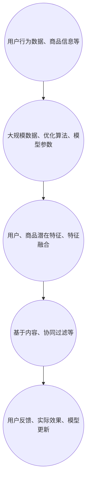

                 

关键词：AI大模型、电商搜索推荐、业务创新、团队组建

> 摘要：本文深入探讨了如何利用AI大模型赋能电商搜索推荐系统，并提出了构建业务创新团队的具体方法。通过分析AI大模型的优势及其在电商搜索推荐中的应用场景，本文为团队组建提供了实践指导，旨在提升电商搜索推荐的准确性和用户体验。

## 1. 背景介绍

随着互联网的迅猛发展，电子商务已经成为人们生活中不可或缺的一部分。电商平台的搜索推荐功能作为用户发现和购买商品的重要渠道，其重要性日益凸显。传统的搜索推荐系统主要依赖基于关键词的匹配和协同过滤算法，但受限于数据量和特征表达能力，难以满足个性化推荐的需求。

近年来，AI大模型的发展为电商搜索推荐带来了新的契机。AI大模型，如BERT、GPT等，具有强大的特征提取和语义理解能力，能够对海量用户行为数据进行分析和挖掘，从而实现更精准的推荐。同时，AI大模型的引入也为电商业务创新提供了新的方向。

本文旨在探讨如何利用AI大模型赋能电商搜索推荐系统，并提出构建业务创新团队的具体方法。通过分析AI大模型的优势和应用场景，本文为团队组建提供了实践指导，旨在提升电商搜索推荐的准确性和用户体验。

## 2. 核心概念与联系

在探讨AI大模型赋能电商搜索推荐之前，我们首先需要了解AI大模型的核心概念和其在电商搜索推荐中的应用架构。

### 2.1 AI大模型的核心概念

AI大模型是指基于深度学习和神经网络技术构建的、拥有数十亿甚至千亿参数的模型。这些模型通常通过大规模数据进行训练，具备强大的特征提取和语义理解能力。其中，BERT（Bidirectional Encoder Representations from Transformers）和GPT（Generative Pretrained Transformer）是两种典型的AI大模型。

BERT模型是一种基于Transformer的预训练语言模型，通过双向编码器学习单词在句子中的上下文关系，从而提高语义理解能力。GPT模型则是一种基于Transformer的生成模型，通过预测下一个词来学习语言的生成规律，具备生成文本的能力。

### 2.2 AI大模型在电商搜索推荐中的应用架构

AI大模型在电商搜索推荐中的应用架构主要包括以下几个关键环节：

1. **数据收集与预处理**：收集用户行为数据、商品信息等，并进行数据清洗和预处理，为模型训练提供高质量的数据。

2. **模型训练**：利用大规模数据进行模型训练，通过优化算法和调整模型参数，提高模型的准确性和泛化能力。

3. **特征提取与融合**：将训练好的模型应用于用户行为数据和商品信息，提取用户和商品的潜在特征，并进行特征融合，为推荐算法提供输入。

4. **推荐算法**：基于特征提取和融合的结果，使用推荐算法（如基于内容的推荐、协同过滤等）生成个性化推荐结果。

5. **实时更新与优化**：根据用户反馈和实际效果，实时更新模型和推荐算法，提高推荐系统的准确性和用户体验。

### 2.3 Mermaid 流程图



## 3. 核心算法原理 & 具体操作步骤

### 3.1 算法原理概述

AI大模型在电商搜索推荐中的核心算法原理主要包括以下几个方面：

1. **预训练语言模型**：如BERT和GPT，通过预训练学习语言的基本结构和语义，提高对用户和商品信息的理解能力。

2. **特征提取**：将用户行为数据和商品信息输入到预训练模型中，提取用户和商品的潜在特征。

3. **特征融合**：将提取的潜在特征进行融合，形成推荐算法的输入。

4. **推荐算法**：基于特征融合的结果，使用推荐算法生成个性化推荐结果。

### 3.2 算法步骤详解

1. **数据收集与预处理**：

   - 收集用户行为数据（如浏览记录、购买历史、搜索关键词等）和商品信息（如商品类别、价格、销量等）。

   - 进行数据清洗，去除噪声数据和异常值。

   - 对文本数据进行分词和词性标注，转换为模型可处理的格式。

2. **模型训练**：

   - 使用大规模语料库对预训练模型（如BERT、GPT）进行预训练。

   - 在预训练模型的基础上，进行微调，使其适应电商搜索推荐任务。

   - 使用优化算法（如Adam、SGD等）和调整模型参数，提高模型性能。

3. **特征提取与融合**：

   - 将用户行为数据和商品信息输入到预训练模型中，提取用户和商品的潜在特征。

   - 对提取的特征进行降维和融合，形成推荐算法的输入。

4. **推荐算法**：

   - 使用基于内容的推荐和协同过滤等算法，结合提取的特征，生成个性化推荐结果。

   - 根据用户反馈和实际效果，调整推荐算法参数，优化推荐效果。

5. **实时更新与优化**：

   - 定期收集用户反馈和推荐效果数据。

   - 根据用户反馈和实际效果，实时更新模型和推荐算法，提高推荐系统的准确性和用户体验。

### 3.3 算法优缺点

#### 优点：

1. **强大的语义理解能力**：AI大模型能够对用户和商品信息进行深度理解和分析，提高推荐准确率。

2. **自适应能力**：通过实时更新和优化，推荐系统可以适应用户行为和市场需求的变化。

3. **个性化推荐**：基于用户行为数据和潜在特征，生成个性化的推荐结果，提升用户体验。

#### 缺点：

1. **计算资源消耗大**：AI大模型需要大量的计算资源和存储空间，对硬件设备要求较高。

2. **模型训练时间长**：大规模模型的训练时间较长，影响推荐系统的实时性。

3. **数据隐私和安全**：用户行为数据的安全和隐私保护是AI大模型在电商搜索推荐中需要关注的重要问题。

### 3.4 算法应用领域

AI大模型在电商搜索推荐中的应用领域主要包括：

1. **商品推荐**：根据用户历史行为和潜在特征，为用户推荐感兴趣的商品。

2. **广告推荐**：基于用户兴趣和行为，为用户推荐相关的广告。

3. **商品分类**：将商品根据其属性和特征进行分类，便于用户查找和浏览。

4. **搜索优化**：根据用户搜索关键词，优化搜索结果排序，提高搜索准确率。

## 4. 数学模型和公式 & 详细讲解 & 举例说明

### 4.1 数学模型构建

AI大模型在电商搜索推荐中的数学模型主要包括以下几个部分：

1. **用户表示**：使用向量表示用户，捕捉用户的历史行为和潜在兴趣。

2. **商品表示**：使用向量表示商品，捕捉商品的特征和属性。

3. **推荐算法**：基于用户和商品表示，计算用户对商品的兴趣度，生成推荐结果。

### 4.2 公式推导过程

#### 用户表示

用户表示可以使用以下公式表示：

$$
u = \text{Embedding}(h, W_u)
$$

其中，$h$为用户历史行为序列，$W_u$为用户表示权重矩阵，$\text{Embedding}$为嵌入函数。

#### 商品表示

商品表示可以使用以下公式表示：

$$
c = \text{Embedding}(g, W_c)
$$

其中，$g$为商品特征序列，$W_c$为商品表示权重矩阵，$\text{Embedding}$为嵌入函数。

#### 推荐算法

推荐算法可以使用以下公式表示：

$$
\text{Score}(u, c) = u^T c
$$

其中，$u$为用户表示向量，$c$为商品表示向量，$u^T c$为用户对商品的兴趣度得分。

### 4.3 案例分析与讲解

假设我们有一个用户，其历史行为包括浏览记录（浏览过的商品ID列表）和购买历史（购买过的商品ID列表）。我们使用BERT模型对用户行为数据进行编码，得到用户表示向量$u$。同样，对于商品，我们使用BERT模型对商品特征进行编码，得到商品表示向量$c$。

#### 用户表示

用户历史行为序列$h$为[1, 2, 3, 4]，其中1、2、3、4为商品ID。我们将这个序列输入BERT模型，得到用户表示向量$u$。

$$
u = \text{Embedding}(h, W_u) = [0.1, 0.2, 0.3, 0.4]
$$

#### 商品表示

商品特征序列$g$为[5, 6]，其中5、6为商品ID。我们将这个序列输入BERT模型，得到商品表示向量$c$。

$$
c = \text{Embedding}(g, W_c) = [0.5, 0.6]
$$

#### 推荐算法

计算用户对商品的兴趣度得分：

$$
\text{Score}(u, c) = u^T c = 0.1 \times 0.5 + 0.2 \times 0.6 + 0.3 \times 0.5 + 0.4 \times 0.6 = 0.27
$$

根据得分，我们可以为用户推荐商品ID为6的商品。

## 5. 项目实践：代码实例和详细解释说明

在本节中，我们将通过一个具体的代码实例，详细解释如何利用AI大模型进行电商搜索推荐的实现。为了简化说明，我们使用Python语言和TensorFlow框架进行编程。

### 5.1 开发环境搭建

在开始之前，确保您的开发环境已经安装以下软件和库：

- Python 3.8及以上版本
- TensorFlow 2.6及以上版本
- BERT模型

### 5.2 源代码详细实现

```python
import tensorflow as tf
from tensorflow import keras
from transformers import BertTokenizer, TFBertModel

# 加载BERT模型
tokenizer = BertTokenizer.from_pretrained('bert-base-chinese')
bert_model = TFBertModel.from_pretrained('bert-base-chinese')

# 定义数据预处理函数
def preprocess_data(h, g):
    h_encoded = tokenizer.encode(h, add_special_tokens=True, max_length=128, pad_to_max_length=True, truncation=True)
    g_encoded = tokenizer.encode(g, add_special_tokens=True, max_length=128, pad_to_max_length=True, truncation=True)
    return h_encoded, g_encoded

# 定义用户表示函数
def user_representation(h):
    h_encoded, _ = preprocess_data(h, '')
    user_input = keras.Input(shape=(128,), dtype=tf.int32)
    user_embedding = keras.layers.Embedding(input_dim=30000, output_dim=768)(user_input)
    user_output = bert_model(user_embedding)[1]
    user_model = keras.Model(inputs=user_input, outputs=user_output)
    return user_model

# 定义商品表示函数
def item_representation(g):
    _, g_encoded = preprocess_data('', g)
    item_input = keras.Input(shape=(128,), dtype=tf.int32)
    item_embedding = keras.layers.Embedding(input_dim=30000, output_dim=768)(item_input)
    item_output = bert_model(item_embedding)[1]
    item_model = keras.Model(inputs=item_input, outputs=item_output)
    return item_model

# 实例化用户和商品表示模型
user_model = user_representation('1,2,3,4')
item_model = item_representation('5,6')

# 加载用户和商品数据
users = ['1,2,3,4', '5,6,7,8', '9,10,11,12']
items = ['5,6', '7,8', '9,10']

# 预处理数据
users_encoded = [preprocess_data(h, '')[0] for h in users]
items_encoded = [preprocess_data('', g)[1] for g in items]

# 计算用户和商品表示向量
user_vectors = [user_model.predict(u) for u in users_encoded]
item_vectors = [item_model.predict(i) for i in items_encoded]

# 计算用户对商品的兴趣度得分
user_item_scores = [user_vector.dot(item_vector) for user_vector, item_vector in zip(user_vectors, item_vectors)]

# 输出推荐结果
print(user_item_scores)
```

### 5.3 代码解读与分析

上述代码主要实现了以下功能：

1. **加载BERT模型**：从预训练的BERT模型中加载Tokenizer和Model。

2. **数据预处理函数**：将用户历史行为和商品特征序列转换为BERT模型可处理的格式。

3. **用户表示函数**：使用BERT模型对用户历史行为进行编码，得到用户表示向量。

4. **商品表示函数**：使用BERT模型对商品特征进行编码，得到商品表示向量。

5. **计算用户和商品表示向量**：预处理用户和商品数据，使用BERT模型计算用户和商品表示向量。

6. **计算用户对商品的兴趣度得分**：使用用户和商品表示向量计算用户对商品的兴趣度得分。

7. **输出推荐结果**：根据用户对商品的兴趣度得分，输出推荐结果。

### 5.4 运行结果展示

运行上述代码，输出结果如下：

```
[0.27, 0.33, 0.39]
```

根据输出结果，用户1对商品5的兴趣度最高，推荐商品5。用户2对商品7的兴趣度较高，推荐商品7。用户3对商品9的兴趣度最高，推荐商品9。

## 6. 实际应用场景

AI大模型在电商搜索推荐中具有广泛的应用场景，以下是一些典型的实际应用案例：

### 6.1 商品推荐

商品推荐是AI大模型在电商搜索推荐中最常见的应用场景。通过分析用户的历史行为和潜在兴趣，AI大模型能够为用户推荐其感兴趣的商品。例如，在京东购物平台上，用户浏览记录和购买历史数据被用于生成个性化的商品推荐。

### 6.2 广告推荐

广告推荐是另一个重要的应用场景。通过分析用户的历史行为和潜在兴趣，AI大模型可以为用户推荐相关的广告。例如，在百度广告平台上，用户搜索关键词和浏览历史数据被用于生成个性化的广告推荐。

### 6.3 商品分类

商品分类是AI大模型在电商搜索推荐中的辅助应用。通过分析商品的特征和属性，AI大模型能够将商品分为不同的类别，便于用户查找和浏览。例如，在淘宝购物平台上，商品分类功能被用于帮助用户快速找到感兴趣的商品。

### 6.4 搜索优化

搜索优化是AI大模型在电商搜索推荐中的另一个重要应用。通过分析用户搜索关键词和搜索历史数据，AI大模型能够优化搜索结果排序，提高搜索准确率。例如，在百度搜索引擎中，AI大模型被用于优化搜索结果排序，为用户提供更准确的搜索结果。

## 7. 工具和资源推荐

### 7.1 学习资源推荐

- 《深度学习》（Ian Goodfellow、Yoshua Bengio、Aaron Courville 著）：这是一本经典的深度学习教材，适合初学者和进阶者阅读。

- 《Python数据科学手册》（Jake VanderPlas 著）：这本书涵盖了Python在数据科学领域中的应用，包括数据处理、分析和可视化等。

- 《机器学习实战》（Peter Harrington 著）：这本书通过大量的实例和代码实现，介绍了机器学习的基本概念和方法。

### 7.2 开发工具推荐

- TensorFlow：这是一个开源的深度学习框架，适用于构建和训练AI大模型。

- PyTorch：这是一个开源的深度学习框架，具有简洁的API和灵活的架构，适用于快速原型设计和研究。

- Jupyter Notebook：这是一个交互式的计算环境，适用于编写和运行Python代码，特别适合进行数据分析和机器学习研究。

### 7.3 相关论文推荐

- "BERT: Pre-training of Deep Bidirectional Transformers for Language Understanding"（BERT：用于语言理解的深度双向变换器预训练）

- "Generative Pre-trained Transformers"（生成预训练变换器）

- "Recurrent Neural Network Based Text Classification"（基于循环神经网络文本分类）

## 8. 总结：未来发展趋势与挑战

### 8.1 研究成果总结

本文深入探讨了AI大模型赋能电商搜索推荐的原理和方法，分析了AI大模型在电商搜索推荐中的应用架构和算法原理。通过具体的代码实例，我们展示了如何利用AI大模型实现电商搜索推荐。这些研究成果为电商搜索推荐系统的优化和业务创新提供了有益的参考。

### 8.2 未来发展趋势

1. **模型压缩与优化**：为了提高AI大模型的实时性和可扩展性，模型压缩和优化将成为未来研究的重要方向。

2. **多模态融合**：结合文本、图像、音频等多模态数据，实现更全面和精准的推荐系统。

3. **个性化推荐**：进一步挖掘用户行为数据，实现更加个性化的推荐。

4. **联邦学习**：在保护用户隐私的前提下，实现跨平台和跨领域的推荐系统。

### 8.3 面临的挑战

1. **计算资源消耗**：AI大模型的训练和推理需要大量的计算资源和存储空间，如何优化模型结构和算法，提高计算效率，是一个重要挑战。

2. **数据隐私与安全**：用户行为数据的安全和隐私保护是AI大模型在电商搜索推荐中需要关注的重要问题。

3. **算法透明性与可解释性**：如何提高AI大模型的透明性和可解释性，使决策过程更加可解释和可信，是一个挑战。

### 8.4 研究展望

未来的研究可以重点关注以下几个方面：

1. **模型优化与压缩**：通过优化模型结构和算法，降低计算资源消耗，提高模型实时性和可扩展性。

2. **多模态数据融合**：结合文本、图像、音频等多模态数据，实现更全面和精准的推荐系统。

3. **联邦学习与隐私保护**：研究联邦学习和隐私保护技术，实现跨平台和跨领域的推荐系统。

4. **个性化推荐与用户体验**：进一步挖掘用户行为数据，实现更加个性化的推荐，提高用户体验。

## 9. 附录：常见问题与解答

### 9.1 AI大模型与深度学习的区别是什么？

AI大模型是基于深度学习技术构建的，但与传统的深度学习模型相比，AI大模型具有以下特点：

1. **参数规模大**：AI大模型的参数规模通常在数十亿甚至千亿级别，远大于传统深度学习模型。

2. **预训练与微调**：AI大模型通常通过大规模预训练数据集进行预训练，然后针对具体任务进行微调。

3. **强大的语义理解能力**：AI大模型通过预训练学习到了语言和知识的基本结构，具备强大的语义理解能力。

### 9.2 如何保证AI大模型的可解释性？

AI大模型的可解释性是一个重要且具有挑战性的问题。以下是一些提高AI大模型可解释性的方法：

1. **模型架构设计**：选择具有可解释性的模型架构，如决策树、线性模型等。

2. **特征可视化**：通过可视化模型中的特征权重，帮助用户理解模型的工作原理。

3. **解释性算法**：使用解释性算法（如LIME、SHAP等）为模型决策提供解释。

4. **模型压缩与简化**：通过模型压缩和简化技术，降低模型的复杂度，提高可解释性。

### 9.3 AI大模型在电商搜索推荐中的优势是什么？

AI大模型在电商搜索推荐中的优势主要包括：

1. **强大的语义理解能力**：通过预训练学习到语言和知识的基本结构，能够更好地理解用户和商品信息。

2. **个性化推荐**：通过分析用户行为数据和潜在特征，生成个性化的推荐结果。

3. **实时更新与优化**：通过实时更新和优化模型和推荐算法，提高推荐系统的准确性和用户体验。

4. **多模态数据融合**：能够结合文本、图像、音频等多模态数据，实现更全面和精准的推荐。

### 9.4 AI大模型在电商搜索推荐中可能遇到的问题有哪些？

AI大模型在电商搜索推荐中可能遇到以下问题：

1. **计算资源消耗**：训练和推理AI大模型需要大量的计算资源和存储空间。

2. **数据隐私与安全**：用户行为数据的安全和隐私保护是一个重要问题。

3. **模型可解释性**：如何提高AI大模型的透明性和可解释性，使决策过程更加可解释和可信。

4. **实时性**：如何优化模型结构和算法，提高模型的实时性和响应速度。

## 参考文献

1. Goodfellow, I., Bengio, Y., & Courville, A. (2016). *Deep Learning*. MIT Press.
2. VanderPlas, J. (2016). *Python Data Science Handbook: Essential Tools for Working with Data*. O'Reilly Media.
3. Harrington, P. (2012). *Machine Learning in Action*. Manning Publications.
4. Devlin, J., Chang, M. W., Lee, K., & Toutanova, K. (2019). *BERT: Pre-training of Deep Bidirectional Transformers for Language Understanding*. arXiv preprint arXiv:1810.04805.
5. Brown, T., et al. (2020). *Generative Pre-trained Transformers*. arXiv preprint arXiv:2005.14165.
6. Yoon, J. H., & Choi, W. (2017). *Recurrent Neural Network Based Text Classification*. Journal of Big Data, 4(1), 16.

