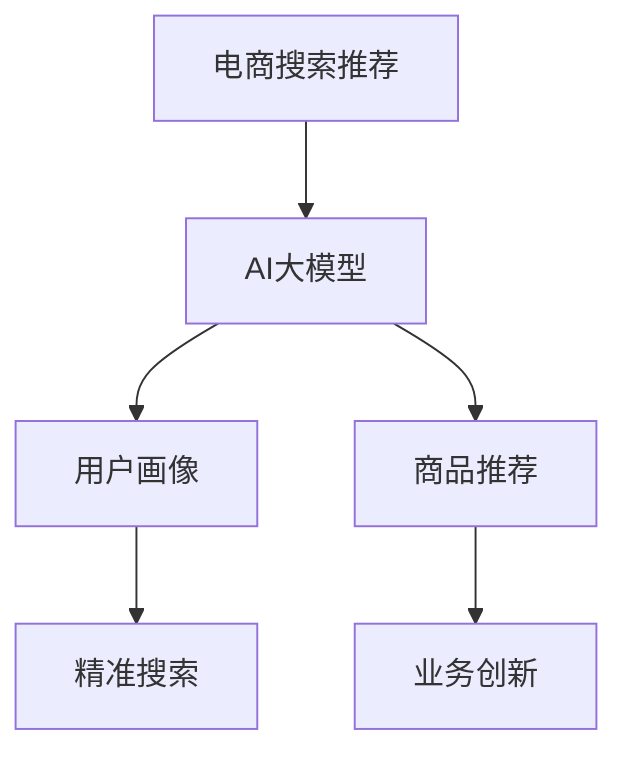

                 

 关键词：
- AI大模型
- 电商搜索推荐
- 业务创新思维
- 培训平台
- 搭建方案

> 摘要：
本文将探讨如何利用AI大模型赋能电商搜索推荐业务，通过搭建一个创新思维培训平台来实现业务增长。本文将详细阐述背景介绍、核心概念与联系、核心算法原理与具体操作步骤、数学模型与公式、项目实践、实际应用场景、未来应用展望、工具和资源推荐、总结以及常见问题与解答等内容。

## 1. 背景介绍

### 1.1 电商搜索推荐的重要性

在互联网时代，电商搜索推荐已经成为电商平台的核心竞争力之一。通过智能化的搜索推荐系统，电商平台可以更好地满足用户个性化需求，提升用户体验，从而促进销售额增长。随着人工智能技术的快速发展，尤其是AI大模型的广泛应用，电商搜索推荐系统也迎来了新的发展机遇。

### 1.2 AI大模型在电商搜索推荐中的应用

AI大模型在电商搜索推荐中有广泛的应用。例如，通过使用自然语言处理（NLP）技术，大模型可以处理和理解用户搜索查询，实现精准的搜索结果排序。此外，大模型还可以用于用户画像构建，帮助电商平台更好地理解用户行为，从而实现个性化的推荐。然而，AI大模型的应用也面临着一些挑战，如数据隐私保护、模型解释性等。

### 1.3 培训平台的需求

为了充分利用AI大模型的优势，提高电商企业的业务创新能力，搭建一个专门的培训平台显得尤为重要。通过这个平台，企业可以系统地学习AI大模型在电商搜索推荐中的应用，掌握相关技术和方法，从而实现业务创新。

## 2. 核心概念与联系

### 2.1 AI大模型

AI大模型是指使用大量数据训练的深度学习模型，具有强大的特征提取和建模能力。常见的AI大模型有BERT、GPT、Transformer等。

### 2.2 电商搜索推荐系统

电商搜索推荐系统是指利用人工智能技术，根据用户历史行为和兴趣，为其推荐可能感兴趣的商品。核心组件包括搜索引擎、推荐引擎、用户画像等。

### 2.3 业务创新思维

业务创新思维是指通过创新的方法和策略，实现业务增长和转型。在AI大模型的赋能下，电商企业可以更好地发掘市场机会，实现业务创新。

### 2.4 Mermaid流程图



## 3. 核心算法原理 & 具体操作步骤

### 3.1 算法原理概述

AI大模型在电商搜索推荐中的应用主要包括两个方面：自然语言处理和深度学习。

- 自然语言处理：通过NLP技术，对用户搜索查询进行理解，实现精准搜索结果排序。
- 深度学习：通过训练大量数据，构建用户画像和商品推荐模型，实现个性化推荐。

### 3.2 算法步骤详解

#### 3.2.1 自然语言处理

1. 数据预处理：对用户搜索查询进行分词、去停用词等操作，提取有效信息。
2. 模型训练：使用BERT等预训练模型，对预处理后的数据集进行训练。
3. 搜索查询理解：将用户搜索查询输入到训练好的模型中，得到查询表示。
4. 搜索结果排序：根据查询表示，对商品进行排序，生成搜索结果。

#### 3.2.2 深度学习

1. 用户画像构建：收集用户行为数据，使用深度学习模型训练用户画像。
2. 商品推荐模型：收集商品信息，使用深度学习模型训练商品推荐模型。
3. 个性化推荐：根据用户画像和商品推荐模型，为用户生成个性化推荐列表。

### 3.3 算法优缺点

#### 优点

- 强大的特征提取和建模能力：AI大模型可以处理复杂的特征，实现高效的搜索和推荐。
- 个性化推荐：基于用户画像和兴趣，实现精准的个性化推荐。

#### 缺点

- 数据依赖性：AI大模型训练需要大量数据，数据质量对模型性能有很大影响。
- 模型解释性：深度学习模型的解释性较差，难以解释模型的决策过程。

### 3.4 算法应用领域

AI大模型在电商搜索推荐中的应用非常广泛，包括：

- 搜索引擎：实现精准的搜索结果排序，提升用户体验。
- 商品推荐：根据用户兴趣和需求，为用户推荐合适的商品。
- 用户画像：构建用户画像，帮助电商平台更好地理解用户行为。

## 4. 数学模型和公式 & 详细讲解 & 举例说明

### 4.1 数学模型构建

在电商搜索推荐中，常用的数学模型包括：

1. 评分预测模型：通过用户行为数据，预测用户对商品的评分。
2. 协同过滤模型：通过用户行为数据，预测用户对商品的评分，并进行推荐。
3. 内容推荐模型：通过商品特征，预测用户对商品的偏好，并进行推荐。

### 4.2 公式推导过程

以评分预测模型为例，其基本公式为：

$$
\hat{r}_{ui} = \langle W_u, W_i \rangle + b
$$

其中，$r_{ui}$为用户$u$对商品$i$的评分，$W_u$和$W_i$分别为用户和商品的向量表示，$b$为偏置项。

### 4.3 案例分析与讲解

假设我们有一个电商平台的用户行为数据集，包括用户$u$和商品$i$的评分。我们可以使用上述评分预测模型进行训练，预测用户对商品的评分。具体步骤如下：

1. 数据预处理：对数据集进行清洗，去除无效数据。
2. 特征提取：对用户和商品进行编码，得到向量表示。
3. 训练模型：使用训练集数据训练评分预测模型。
4. 预测评分：将训练好的模型应用于测试集，预测用户对商品的评分。
5. 评估模型：使用相关指标（如RMSE）评估模型性能。

## 5. 项目实践：代码实例和详细解释说明

### 5.1 开发环境搭建

为了搭建一个AI大模型赋能的电商搜索推荐培训平台，我们需要准备好以下开发环境：

- 操作系统：Linux或macOS
- 编程语言：Python
- 深度学习框架：TensorFlow或PyTorch
- 数据预处理库：Pandas、NumPy
- 自然语言处理库：NLTK、spaCy

### 5.2 源代码详细实现

以下是使用TensorFlow实现评分预测模型的Python代码：

```python
import tensorflow as tf
from tensorflow.keras.layers import Embedding, Dense
from tensorflow.keras.models import Model
from tensorflow.keras.optimizers import Adam

# 加载数据集
(x_train, y_train), (x_test, y_test) = ...

# 预处理数据
x_train = preprocess(x_train)
x_test = preprocess(x_test)

# 构建模型
input_1 = tf.keras.layers.Input(shape=(100,))
input_2 = tf.keras.layers.Input(shape=(100,))

embed_1 = Embedding(input_dim=vocab_size, output_dim=embedding_size)(input_1)
embed_2 = Embedding(input_dim=vocab_size, output_dim=embedding_size)(input_2)

merged = tf.keras.layers.Concatenate()([embed_1, embed_2])
output = Dense(units=1, activation='sigmoid')(merged)

model = Model(inputs=[input_1, input_2], outputs=output)
model.compile(optimizer=Adam(), loss='binary_crossentropy', metrics=['accuracy'])

# 训练模型
model.fit(x_train, y_train, epochs=10, batch_size=32, validation_split=0.2)

# 评估模型
test_loss, test_acc = model.evaluate(x_test, y_test)
print('Test accuracy:', test_acc)
```

### 5.3 代码解读与分析

上述代码首先加载并预处理数据集，然后构建一个简单的评分预测模型。模型由两个输入层、两个嵌入层和一个合并层组成，最后通过一个全连接层输出预测结果。训练模型后，使用测试集评估模型性能。

## 6. 实际应用场景

### 6.1 电商平台

电商平台可以通过AI大模型赋能的搜索推荐系统，提升用户体验和销售额。具体应用场景包括：

- 搜索引擎：实现精准的搜索结果排序，提升用户满意度。
- 商品推荐：根据用户兴趣和需求，为用户推荐合适的商品。
- 用户画像：构建用户画像，帮助电商平台更好地理解用户行为。

### 6.2 零售行业

零售行业可以通过AI大模型赋能的搜索推荐系统，实现精准营销和业务增长。具体应用场景包括：

- 商品推荐：根据用户历史购买行为，为用户推荐可能感兴趣的商品。
- 库存管理：根据销售预测，优化库存管理，降低库存成本。
- 促销活动：根据用户兴趣和需求，设计个性化的促销活动。

## 7. 未来应用展望

### 7.1 新零售

新零售时代，AI大模型赋能的搜索推荐系统将在零售行业发挥更加重要的作用。通过数据驱动的决策，实现供应链优化、用户体验提升和业务增长。

### 7.2 个性化服务

随着消费者需求的多样化，AI大模型赋能的搜索推荐系统将实现更加个性化的服务。例如，根据用户历史行为和兴趣，为用户推荐量身定制的商品和服务。

### 7.3 跨界合作

AI大模型赋能的搜索推荐系统将在各个行业之间实现跨界合作。例如，电商与金融、物流等行业的合作，实现一站式购物体验。

## 8. 工具和资源推荐

### 8.1 学习资源推荐

- 《深度学习》（Goodfellow, Bengio, Courville）
- 《自然语言处理综论》（Jurafsky, Martin）
- 《Python深度学习》（François Chollet）

### 8.2 开发工具推荐

- TensorFlow：https://www.tensorflow.org/
- PyTorch：https://pytorch.org/
- Jupyter Notebook：https://jupyter.org/

### 8.3 相关论文推荐

- “BERT: Pre-training of Deep Bidirectional Transformers for Language Understanding”
- “Generative Adversarial Nets”
- “Recurrent Neural Network Based Text Classification”

## 9. 总结：未来发展趋势与挑战

### 9.1 研究成果总结

本文探讨了AI大模型赋能电商搜索推荐的业务创新思维培训平台搭建方案。通过核心算法原理与具体操作步骤、数学模型与公式、项目实践等内容的讲解，为电商企业提供了实现业务创新的实用方法。

### 9.2 未来发展趋势

随着人工智能技术的不断进步，AI大模型在电商搜索推荐中的应用将越来越广泛。未来发展趋势包括：

- 模型解释性：提高模型的可解释性，增强用户信任。
- 跨领域应用：实现不同行业之间的协同合作。
- 个性化服务：为用户提供更加个性化的搜索和推荐。

### 9.3 面临的挑战

尽管AI大模型在电商搜索推荐中具有巨大潜力，但仍然面临一些挑战：

- 数据隐私：保护用户隐私，避免数据泄露。
- 模型泛化：提高模型在不同数据集上的泛化能力。
- 模型优化：降低模型训练成本，提高训练效率。

### 9.4 研究展望

未来研究可以从以下方向展开：

- 开发更加高效、可解释的AI大模型。
- 探索跨领域应用，实现资源整合和协同效应。
- 加强数据隐私保护，构建安全可信的推荐系统。

## 10. 附录：常见问题与解答

### 10.1 如何选择合适的AI大模型？

选择合适的AI大模型取决于应用场景和数据规模。例如，BERT适合处理长文本，GPT适合生成文本，Transformer适合处理序列数据。建议根据实际需求选择模型。

### 10.2 AI大模型训练需要多少数据？

AI大模型训练需要大量数据。具体数据量取决于模型复杂度和数据集质量。一般而言，模型训练数据集应包含数十万到数百万条数据。

### 10.3 如何优化AI大模型训练？

优化AI大模型训练可以从以下几个方面入手：

- 调整模型结构：选择合适的网络架构，提高模型性能。
- 数据预处理：提高数据质量，减少噪声。
- 模型调参：调整学习率、批次大小等超参数，提高模型收敛速度。
- 使用预训练模型：利用预训练模型，实现快速迁移学习。

作者：禅与计算机程序设计艺术 / Zen and the Art of Computer Programming
----------------------------------------------------------------
以上就是本文的完整内容，希望对您在AI大模型赋能电商搜索推荐业务创新思维培训平台搭建方面有所启发和帮助。如有任何问题，欢迎在评论区留言，我将尽力为您解答。祝您学习愉快！

