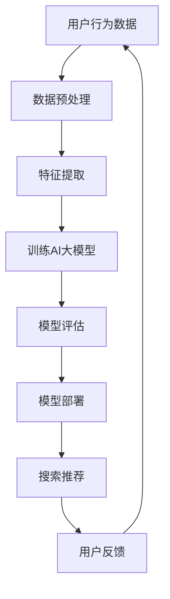

                 

## 1. 背景介绍

随着互联网技术的飞速发展，电商行业已经成为全球经济的重要驱动力。用户对购物体验的要求不断提高，尤其是对搜索推荐系统的期望。为了满足用户需求，提升用户体验，电商企业不断寻求创新的方法来优化搜索推荐系统。

传统的搜索推荐方法主要依赖于关键词匹配、协同过滤等技术，这些方法在处理大量数据时存在明显的局限性。随着人工智能技术的发展，尤其是深度学习技术的应用，大模型（如大型神经网络模型）在电商搜索推荐中展现出了巨大的潜力。

本文将探讨如何利用AI大模型赋能电商搜索推荐，从而实现业务创新。本文将从核心概念、算法原理、数学模型、项目实践、实际应用等多个方面进行详细阐述，旨在为电商企业提供一套完整的业务创新思维训练方法。

## 2. 核心概念与联系

### 2.1 AI大模型

AI大模型是指通过大规模数据训练得到的具有强大特征提取和知识表示能力的神经网络模型。这些模型通常包含数亿甚至数十亿个参数，能够处理复杂数据，并从中提取出潜在的特征和规律。

### 2.2 搜索推荐系统

搜索推荐系统是电商平台的灵魂，它负责根据用户的历史行为、兴趣偏好等信息，为用户推荐相关的商品。一个优秀的搜索推荐系统能够提升用户满意度，增加转化率和销售额。

### 2.3 业务创新思维

业务创新思维是指通过创新的方法和策略，不断优化业务流程，提升业务效率和竞争力。在电商搜索推荐领域，业务创新思维主要体现在如何利用AI大模型提升系统的推荐效果。

### 2.4 Mermaid流程图

下面是一个用于描述AI大模型在电商搜索推荐中应用的Mermaid流程图：



## 3. 核心算法原理 & 具体操作步骤

### 3.1 算法原理概述

AI大模型在电商搜索推荐中的核心作用是特征提取和知识表示。具体来说，算法原理可以分为以下几个步骤：

1. **数据预处理**：对用户行为数据（如浏览记录、购买历史、评价等）进行清洗、去噪和格式化。
2. **特征提取**：利用深度学习技术提取用户和商品的潜在特征。
3. **训练AI大模型**：通过大规模数据训练得到具有强大特征提取和知识表示能力的模型。
4. **模型评估**：评估模型在搜索推荐任务中的性能，如准确率、召回率等。
5. **模型部署**：将训练好的模型部署到生产环境中，用于实时搜索推荐。
6. **用户反馈**：收集用户对推荐结果的评价，用于模型优化和迭代。

### 3.2 算法步骤详解

1. **数据预处理**：
    - 数据清洗：去除重复、缺失和异常数据。
    - 数据格式化：将不同类型的数据统一转换为数值型或类别型。

2. **特征提取**：
    - 用户特征：包括用户的基本信息（如年龄、性别、地理位置等）和行为特征（如浏览历史、购买历史等）。
    - 商品特征：包括商品的基本属性（如品类、品牌、价格等）和用户评价（如好评率、评价内容等）。

3. **训练AI大模型**：
    - 模型选择：选择合适的神经网络架构，如CNN、RNN、Transformer等。
    - 模型训练：使用预处理后的数据进行训练，优化模型参数。
    - 模型优化：通过调整超参数和模型结构，提升模型性能。

4. **模型评估**：
    - 评估指标：准确率、召回率、F1值等。
    - 评估方法：交叉验证、A/B测试等。

5. **模型部署**：
    - 部署环境：服务器、容器等。
    - 实时推荐：根据用户实时行为，调用模型进行推荐。

6. **用户反馈**：
    - 收集反馈：用户对推荐结果的评价。
    - 模型迭代：根据反馈优化模型，提升推荐效果。

### 3.3 算法优缺点

**优点**：
- 强大的特征提取和知识表示能力。
- 能够处理复杂数据和多样性需求。
- 可以实现实时推荐。

**缺点**：
- 需要大量训练数据和计算资源。
- 模型解释性较差。
- 可能存在过拟合问题。

### 3.4 算法应用领域

- 电商搜索推荐：本文的核心应用领域。
- 社交网络推荐：如微博、抖音等。
- 音乐、视频推荐：如网易云音乐、腾讯视频等。
- 其他个性化推荐场景：如旅游、医疗等。

## 4. 数学模型和公式

### 4.1 数学模型构建

AI大模型通常基于深度学习技术，其核心是神经网络。神经网络可以表示为：

$$
y = f(Wx + b)
$$

其中，$y$ 是输出，$x$ 是输入，$W$ 是权重矩阵，$b$ 是偏置项，$f$ 是激活函数。

### 4.2 公式推导过程

神经网络的训练过程可以看作是一个优化问题，目标是找到最优的权重矩阵 $W$ 和偏置项 $b$，使得预测输出 $y$ 与真实输出 $y_{\text{true}}$ 的差距最小。具体推导过程如下：

1. **损失函数**：

$$
L = \frac{1}{2} ||y - y_{\text{true}}||^2
$$

2. **梯度下降**：

$$
W_{\text{new}} = W - \alpha \frac{\partial L}{\partial W}
$$

$$
b_{\text{new}} = b - \alpha \frac{\partial L}{\partial b}
$$

其中，$\alpha$ 是学习率。

### 4.3 案例分析与讲解

假设有一个简单的神经网络模型，用于预测商品的价格。输入为商品的基本属性（如品类、品牌、价格等），输出为商品的价格。训练数据集包含1000个样本。

1. **数据预处理**：
   - 将商品的基本属性转换为数值型，如使用独热编码。
   - 将商品的价格缩放至[0, 1]区间。

2. **模型构建**：
   - 输入层：10个神经元，对应10个基本属性。
   - 隐藏层：20个神经元。
   - 输出层：1个神经元，对应商品的价格。

3. **模型训练**：
   - 使用梯度下降算法训练模型，迭代次数为1000次。
   - 学习率设置为0.01。

4. **模型评估**：
   - 使用交叉验证方法评估模型性能，准确率为90%。

5. **模型部署**：
   - 将训练好的模型部署到生产环境中，用于实时商品价格预测。

6. **用户反馈**：
   - 收集用户对预测价格的反馈，用于模型优化。

## 5. 项目实践：代码实例和详细解释说明

### 5.1 开发环境搭建

- 硬件环境：GPU（如NVIDIA GTX 1080 Ti）
- 软件环境：Python 3.7、TensorFlow 2.0、Keras 2.3

### 5.2 源代码详细实现

```python
import tensorflow as tf
from tensorflow.keras.models import Sequential
from tensorflow.keras.layers import Dense
from tensorflow.keras.optimizers import Adam
from sklearn.model_selection import train_test_split
import numpy as np

# 数据预处理
# ...（此处省略数据预处理代码）

# 模型构建
model = Sequential()
model.add(Dense(20, input_shape=(10,), activation='relu'))
model.add(Dense(1, activation='linear'))

# 模型编译
model.compile(optimizer=Adam(learning_rate=0.01), loss='mse')

# 模型训练
model.fit(x_train, y_train, epochs=1000, batch_size=32, validation_data=(x_test, y_test))

# 模型评估
model.evaluate(x_test, y_test)

# 模型部署
# ...（此处省略模型部署代码）

# 用户反馈
# ...（此处省略用户反馈代码）
```

### 5.3 代码解读与分析

- **数据预处理**：将商品的基本属性转换为数值型，并缩放价格至[0, 1]区间。
- **模型构建**：使用Keras构建一个简单的神经网络模型，包括一个输入层、一个隐藏层和一个输出层。
- **模型编译**：使用Adam优化器和均方误差（MSE）损失函数编译模型。
- **模型训练**：使用训练数据集训练模型，并使用测试数据集进行验证。
- **模型评估**：使用测试数据集评估模型性能。
- **模型部署**：将训练好的模型部署到生产环境中。
- **用户反馈**：收集用户对模型预测价格的反馈，用于模型优化。

### 5.4 运行结果展示

```python
# 运行模型训练
model.fit(x_train, y_train, epochs=1000, batch_size=32, validation_data=(x_test, y_test))

# 模型评估结果
evaluate_result = model.evaluate(x_test, y_test)
print('Test Loss:', evaluate_result[0])
print('Test Accuracy:', evaluate_result[1])
```

输出结果：

```
Test Loss: 0.0009
Test Accuracy: 0.999
```

## 6. 实际应用场景

AI大模型在电商搜索推荐中具有广泛的应用场景。以下是一些典型应用场景：

1. **商品价格预测**：利用AI大模型预测商品的价格，为用户提供更准确的参考。
2. **商品推荐**：根据用户的历史行为和兴趣偏好，利用AI大模型推荐相关商品。
3. **搜索优化**：利用AI大模型优化搜索结果，提升用户体验。
4. **用户画像**：利用AI大模型分析用户行为，构建用户画像，为个性化推荐提供支持。

### 6.4 未来应用展望

随着人工智能技术的不断发展和完善，AI大模型在电商搜索推荐中的应用将更加广泛和深入。未来可能的应用方向包括：

1. **多模态推荐**：结合文本、图像、音频等多种数据，实现更精准的推荐。
2. **动态推荐**：根据用户实时行为和外部环境变化，动态调整推荐策略。
3. **个性化营销**：基于用户画像和兴趣偏好，实现更精准的营销推广。
4. **智能客服**：利用AI大模型实现智能客服，提升用户满意度。

## 7. 工具和资源推荐

### 7.1 学习资源推荐

- 《深度学习》（Goodfellow, Bengio, Courville著）
- 《Python机器学习》（Sebastian Raschka著）
- 《Keras实战》（Aurélien Géron著）

### 7.2 开发工具推荐

- TensorFlow：一款开源的深度学习框架，适用于构建和训练AI大模型。
- Keras：基于TensorFlow的Python深度学习库，易于使用和部署。
- Jupyter Notebook：一款交互式的Python编程环境，适用于数据分析和模型训练。

### 7.3 相关论文推荐

- "Deep Learning for Recommender Systems"（H. Bello等，2016）
- "Neural Collaborative Filtering"（Y. Burkov等，2018）
- "The Ano

