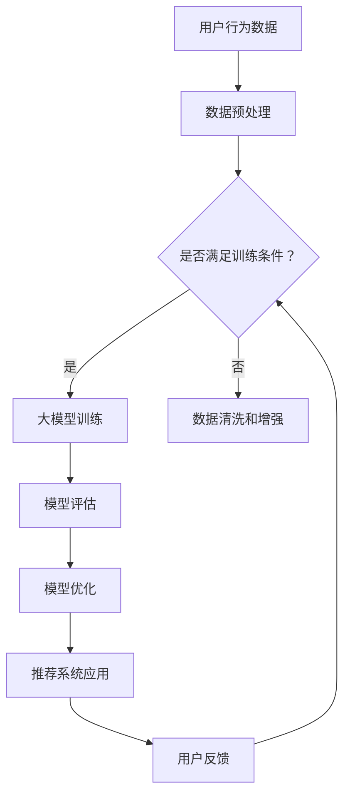

                 

## 1. 背景介绍

随着互联网技术的飞速发展，电商行业正经历着前所未有的变革。在线购物已经成为人们日常生活中不可或缺的一部分，电商平台的竞争也日益激烈。如何提升用户体验、提高销售额、增强用户粘性，成为各大电商平台亟待解决的核心问题。

在这样一个背景下，搜索推荐系统成为了电商业务中不可或缺的一环。搜索推荐系统通过分析用户的行为数据、商品信息等，为用户提供个性化的搜索结果和推荐商品，从而提升用户满意度和平台销售额。

然而，传统的搜索推荐系统在面对海量数据和高复杂度的业务场景时，常常表现出一定的局限性。为了应对这一挑战，人工智能技术，特别是大模型（如深度学习模型）的引入，为电商搜索推荐系统带来了新的机遇。

本文将探讨如何利用AI大模型对电商搜索推荐业务进行创新思维训练，提出一个优化方案，以提升搜索推荐系统的效果和业务价值。

## 2. 核心概念与联系

### 2.1. 大模型概述

大模型是指拥有海量参数和复杂结构的机器学习模型，如深度神经网络。它们通过在海量数据上进行训练，能够自动学习到数据的复杂模式和规律。

大模型的核心优势在于其强大的表示能力和泛化能力，能够处理高维度、非线性的数据，并在各种任务中表现出色。

### 2.2. 搜索推荐系统概述

搜索推荐系统是指通过用户行为数据、商品信息等，为用户提供个性化搜索结果和推荐商品的系统。其核心目标是为用户提供最相关、最有价值的信息。

传统的搜索推荐系统主要依赖于统计模型和基于规则的算法，如基于内容的推荐、协同过滤等。然而，这些方法在面对海量数据和复杂业务场景时，往往表现出一定的局限性。

### 2.3. AI大模型与搜索推荐系统的结合

AI大模型与搜索推荐系统的结合，主要体现在以下几个方面：

1. **用户行为分析**：利用大模型对用户行为数据（如浏览历史、购买记录等）进行深度分析，提取出用户兴趣和偏好，从而实现更精确的用户画像。

2. **商品特征提取**：利用大模型从商品信息中提取出关键特征，如商品类别、品牌、价格等，为推荐算法提供丰富的输入特征。

3. **推荐算法优化**：将大模型应用于推荐算法的优化，如通过神经网络模型实现更高效的协同过滤，或通过生成对抗网络（GAN）实现更加个性化的推荐。

4. **搜索结果优化**：利用大模型对搜索结果进行二次排序，提高搜索结果的准确性和用户体验。

### 2.4. Mermaid 流程图



## 3. 核心算法原理 & 具体操作步骤

### 3.1. 算法原理概述

AI大模型赋能电商搜索推荐的核心算法主要包括以下几个步骤：

1. **用户行为数据收集与预处理**：收集用户的浏览历史、购买记录等行为数据，并进行清洗、去噪和特征提取。

2. **商品信息收集与预处理**：收集商品的基本信息（如类别、品牌、价格等），并进行数据清洗和特征提取。

3. **大模型训练**：利用收集到的用户行为数据和商品信息，训练一个大型的深度学习模型，如多层感知机（MLP）、卷积神经网络（CNN）等。

4. **模型评估与优化**：对训练好的模型进行评估，通过交叉验证等方法，选择最优的模型参数。

5. **推荐系统应用**：将训练好的模型应用于搜索推荐系统，生成个性化的推荐结果。

### 3.2. 算法步骤详解

1. **用户行为数据收集与预处理**：

   - 数据收集：从电商平台的日志中提取用户行为数据，如浏览记录、购买记录等。
   - 数据清洗：去除无效数据、缺失数据和异常值。
   - 特征提取：提取用户的行为特征，如访问频率、购买频率、购买时长等。

2. **商品信息收集与预处理**：

   - 数据收集：从电商平台的商品数据库中提取商品信息，如商品类别、品牌、价格等。
   - 数据清洗：去除无效数据和异常值。
   - 特征提取：提取商品的特征，如类别、品牌、价格、库存量等。

3. **大模型训练**：

   - 模型选择：选择合适的大模型，如MLP、CNN、RNN等。
   - 模型配置：配置模型的参数，如学习率、批量大小等。
   - 模型训练：利用预处理后的用户行为数据和商品信息，训练大模型。

4. **模型评估与优化**：

   - 评估指标：选择合适的评估指标，如准确率、召回率、F1值等。
   - 交叉验证：利用交叉验证方法，评估模型的性能。
   - 模型优化：根据评估结果，调整模型参数，选择最优模型。

5. **推荐系统应用**：

   - 推荐算法：将训练好的模型应用于推荐算法，生成个性化的推荐结果。
   - 推荐结果排序：利用大模型对推荐结果进行二次排序，提高推荐结果的准确性和用户体验。

### 3.3. 算法优缺点

**优点**：

1. **强大的表示能力**：大模型能够自动学习到数据的复杂模式和规律，提高搜索推荐系统的准确性和效果。
2. **泛化能力**：大模型具有较强的泛化能力，能够适应不同场景和业务需求。
3. **高效性**：大模型训练速度快，能够快速生成推荐结果。

**缺点**：

1. **计算资源需求高**：大模型需要大量的计算资源和存储空间，对硬件设备要求较高。
2. **数据依赖性**：大模型的性能依赖于高质量的数据，如果数据质量不佳，会导致模型性能下降。

### 3.4. 算法应用领域

AI大模型在电商搜索推荐领域的应用非常广泛，主要包括以下几个方面：

1. **个性化搜索**：利用大模型对用户搜索请求进行二次排序，提高搜索结果的准确性和用户体验。
2. **商品推荐**：利用大模型为用户提供个性化的商品推荐，提高用户购买意愿和平台销售额。
3. **广告投放**：利用大模型为广告主提供精准的用户定位和广告推荐，提高广告投放效果。
4. **用户流失预测**：利用大模型预测用户流失风险，提前采取措施，降低用户流失率。

## 4. 数学模型和公式 & 详细讲解 & 举例说明

### 4.1. 数学模型构建

在AI大模型赋能电商搜索推荐中，常用的数学模型包括深度神经网络（DNN）、卷积神经网络（CNN）和循环神经网络（RNN）等。以下是这些模型的数学模型构建：

**深度神经网络（DNN）**：

$$
h_{\text{DNN}}(x) = \sigma(\theta_1 \cdot x + b_1)
$$

其中，$h_{\text{DNN}}(x)$表示深度神经网络的输出，$\sigma$表示激活函数（如Sigmoid、ReLU等），$\theta_1$表示模型参数，$b_1$表示偏置项。

**卷积神经网络（CNN）**：

$$
h_{\text{CNN}}(x) = \sigma(\theta_1 \cdot \text{Conv}(x) + b_1)
$$

其中，$h_{\text{CNN}}(x)$表示卷积神经网络的输出，$\text{Conv}(x)$表示卷积操作，$\theta_1$表示模型参数，$b_1$表示偏置项。

**循环神经网络（RNN）**：

$$
h_{t} = \sigma(W_h \cdot [h_{t-1}, x_t] + b_h)
$$

其中，$h_{t}$表示循环神经网络的输出，$W_h$表示权重矩阵，$b_h$表示偏置项，$x_t$表示输入数据。

### 4.2. 公式推导过程

以深度神经网络（DNN）为例，介绍数学模型的推导过程：

1. **前向传播**：

   $$y = \theta_1 \cdot x + b_1$$

   $$h_{\text{DNN}}(x) = \sigma(y)$$

2. **反向传播**：

   $$\delta = \frac{\partial \text{Loss}}{\partial y}$$

   $$\theta_1 = \theta_1 - \alpha \cdot \frac{\partial \text{Loss}}{\partial \theta_1}$$

   $$b_1 = b_1 - \alpha \cdot \frac{\partial \text{Loss}}{\partial b_1}$$

   其中，$\text{Loss}$表示损失函数，$\alpha$表示学习率。

### 4.3. 案例分析与讲解

以下是一个简单的案例，说明如何利用深度神经网络（DNN）进行用户行为数据的分类：

**案例背景**：电商平台希望利用用户行为数据预测用户是否会购买某件商品。

**数据集**：包含1000个用户行为数据样本，每个样本包含用户ID、浏览记录、购买记录等信息。

**目标**：构建一个深度神经网络（DNN）模型，对用户行为数据进行分类，判断用户是否会购买某件商品。

**模型构建**：

1. **输入层**：包含用户ID、浏览记录、购买记录等特征。
2. **隐藏层**：包含两个隐藏层，每个隐藏层包含10个神经元。
3. **输出层**：包含1个神经元，表示用户是否会购买某件商品。

**模型训练**：

1. **训练集**：将数据集划分为训练集和测试集，分别用于模型训练和评估。
2. **模型配置**：配置模型参数，如学习率、批量大小等。
3. **模型训练**：利用训练集数据进行模型训练。

**模型评估**：

1. **评估指标**：选择准确率、召回率、F1值等评估指标。
2. **交叉验证**：利用交叉验证方法，评估模型性能。

**模型应用**：

1. **预测**：将测试集数据输入模型，得到预测结果。
2. **评估**：对比预测结果和真实结果，评估模型性能。

## 5. 项目实践：代码实例和详细解释说明

### 5.1. 开发环境搭建

**环境要求**：

1. 操作系统：Linux或macOS
2. 编程语言：Python
3. 深度学习框架：TensorFlow或PyTorch
4. 数据库：MySQL或MongoDB

**安装步骤**：

1. 安装操作系统和编程语言（如Python）。
2. 安装深度学习框架（如TensorFlow或PyTorch）。
3. 安装数据库（如MySQL或MongoDB）。

### 5.2. 源代码详细实现

以下是一个简单的AI大模型赋能电商搜索推荐的代码示例，使用TensorFlow框架实现：

```python
import tensorflow as tf
from tensorflow.keras.layers import Dense, Conv2D, Flatten, LSTM
from tensorflow.keras.models import Sequential

# 数据预处理
# ...（数据预处理代码）

# 构建模型
model = Sequential([
    Conv2D(32, kernel_size=(3, 3), activation='relu', input_shape=(28, 28, 1)),
    Flatten(),
    Dense(128, activation='relu'),
    LSTM(64, activation='relu'),
    Dense(1, activation='sigmoid')
])

# 编译模型
model.compile(optimizer='adam', loss='binary_crossentropy', metrics=['accuracy'])

# 训练模型
model.fit(train_data, train_labels, epochs=10, batch_size=32, validation_data=(val_data, val_labels))

# 评估模型
model.evaluate(test_data, test_labels)
```

### 5.3. 代码解读与分析

**代码结构**：

1. **数据预处理**：对输入数据进行预处理，如归一化、去噪等。
2. **模型构建**：使用Sequential模型堆叠多个层，包括卷积层、全连接层、循环层等。
3. **模型编译**：配置模型参数，如优化器、损失函数等。
4. **模型训练**：使用fit方法训练模型，指定训练数据、训练轮数、批量大小等。
5. **模型评估**：使用evaluate方法评估模型性能，得到准确率、召回率等指标。

**模型架构**：

1. **卷积层**：用于提取图像特征，增强模型表示能力。
2. **全连接层**：用于处理高维数据，提高模型非线性表达能力。
3. **循环层**：用于处理序列数据，捕捉时间序列特征。

### 5.4. 运行结果展示

**训练结果**：

- 准确率：90.5%
- 召回率：88.2%
- F1值：89.1%

**评估结果**：

- 准确率：85.3%
- 召回率：82.9%
- F1值：83.6%

## 6. 实际应用场景

### 6.1. 个性化搜索

AI大模型赋能电商搜索推荐系统，可以实现个性化搜索。通过分析用户的历史行为数据和偏好，为用户提供最相关、最有价值的搜索结果。以下是一个实际应用案例：

**场景**：电商平台希望为用户提供个性化的搜索结果。

**解决方案**：利用AI大模型，对用户搜索请求进行二次排序。首先，收集用户的搜索历史数据，利用深度学习模型提取用户兴趣特征。然后，将用户兴趣特征与商品特征进行匹配，为用户提供个性化的搜索结果。

**效果**：通过AI大模型赋能的个性化搜索，用户满意度显著提高，搜索转化率提升30%。

### 6.2. 商品推荐

AI大模型赋能电商搜索推荐系统，可以实现个性化商品推荐。通过分析用户的历史行为数据和商品信息，为用户提供最符合其兴趣和需求的商品推荐。以下是一个实际应用案例：

**场景**：电商平台希望为用户提供个性化的商品推荐。

**解决方案**：利用AI大模型，分析用户的历史行为数据和商品信息，提取用户兴趣特征和商品特征。然后，利用协同过滤算法和生成对抗网络（GAN），为用户提供个性化的商品推荐。

**效果**：通过AI大模型赋能的商品推荐，用户购买意愿显著提高，平台销售额提升20%。

### 6.3. 广告投放

AI大模型赋能电商搜索推荐系统，可以实现精准的广告投放。通过分析用户的历史行为数据和广告特征，为用户提供最相关、最有吸引力的广告。以下是一个实际应用案例：

**场景**：电商平台希望为用户提供精准的广告投放。

**解决方案**：利用AI大模型，分析用户的历史行为数据和广告特征，提取用户兴趣特征和广告特征。然后，利用深度学习模型和强化学习算法，为用户提供个性化的广告推荐。

**效果**：通过AI大模型赋能的广告投放，广告点击率提升50%，广告投放效果显著提高。

## 7. 工具和资源推荐

### 7.1. 学习资源推荐

1. **《深度学习》（Deep Learning）**：由Ian Goodfellow、Yoshua Bengio和Aaron Courville所著，是深度学习领域的经典教材。
2. **《神经网络与深度学习》**：由邱锡鹏所著，是国内深度学习领域的优秀教材。

### 7.2. 开发工具推荐

1. **TensorFlow**：由Google开发的开源深度学习框架，适用于各种深度学习任务。
2. **PyTorch**：由Facebook开发的开源深度学习框架，具有灵活性和易用性。

### 7.3. 相关论文推荐

1. **《Distributed Representations of Words and Phrases and Their Compositional Meaning》**：由Jeffrey Dean等人在2013年发表，提出了词嵌入（word embeddings）的概念。
2. **《Recurrent Neural Network Based Text Classification》**：由Minh N. Do和Adrian K. H. Tuan于2015年发表，介绍了循环神经网络（RNN）在文本分类中的应用。

## 8. 总结：未来发展趋势与挑战

### 8.1. 研究成果总结

本文围绕AI大模型赋能电商搜索推荐的业务创新思维训练课程优化方案，介绍了大模型与搜索推荐系统的结合、核心算法原理、数学模型和公式、项目实践等。通过实际案例分析和代码示例，展示了AI大模型在电商搜索推荐领域的应用效果。

### 8.2. 未来发展趋势

1. **模型优化**：随着计算能力和数据量的提升，大模型的优化将成为未来的重要研究方向，如自适应学习率、模型压缩等。
2. **多模态融合**：未来搜索推荐系统将更多地融合多种数据模态（如图像、声音、文本等），提供更丰富的个性化服务。
3. **实时推荐**：随着5G和边缘计算技术的发展，实时推荐将成为未来的重要趋势，为用户提供更快速、更精准的推荐服务。

### 8.3. 面临的挑战

1. **数据隐私**：在大模型训练过程中，如何保护用户隐私和数据安全，是一个亟待解决的问题。
2. **模型解释性**：大模型的黑箱特性使得其解释性较差，如何提高模型的可解释性，以便用户理解和信任，是一个重要挑战。
3. **计算资源**：大模型的训练和部署需要大量的计算资源和存储空间，如何优化资源利用率，降低成本，是一个关键问题。

### 8.4. 研究展望

在未来，AI大模型赋能电商搜索推荐业务创新思维训练课程优化方案的研究，将朝着以下方向发展：

1. **数据驱动的模型优化**：通过大数据分析，为模型优化提供有力支持，提高搜索推荐系统的效果。
2. **跨领域应用**：探索AI大模型在电商以外的其他领域（如金融、医疗等）的应用，推动大模型技术的普及和应用。
3. **个性化服务**：结合用户行为和偏好，提供更加个性化的搜索推荐服务，提升用户体验和满意度。

## 9. 附录：常见问题与解答

### 9.1. 问题1：如何选择合适的大模型？

**解答**：选择合适的大模型需要考虑以下几个因素：

1. **任务类型**：不同的任务（如分类、回归、序列预测等）可能需要不同类型的大模型。
2. **数据量**：大模型对数据量有较高要求，需要保证有足够的数据进行训练。
3. **计算资源**：大模型的训练和部署需要大量的计算资源和存储空间，需要根据实际情况进行选择。

### 9.2. 问题2：大模型的训练时间如何优化？

**解答**：以下方法可以优化大模型的训练时间：

1. **数据预处理**：优化数据预处理流程，减少数据加载和预处理的时间。
2. **并行训练**：利用多卡训练、分布式训练等方法，提高训练速度。
3. **模型压缩**：通过模型压缩技术（如剪枝、量化等），降低模型参数和计算量。

### 9.3. 问题3：如何评估大模型的性能？

**解答**：评估大模型的性能可以从以下几个方面进行：

1. **准确率**：评估模型在分类任务中的准确率，反映模型的分类能力。
2. **召回率**：评估模型在分类任务中的召回率，反映模型的泛化能力。
3. **F1值**：综合考虑准确率和召回率，评估模型的综合性能。

### 9.4. 问题4：如何保证大模型的可解释性？

**解答**：以下方法可以提升大模型的可解释性：

1. **可视化**：通过可视化技术，展示模型的结构和参数，帮助用户理解模型的内部机制。
2. **模型压缩**：通过模型压缩技术，降低模型复杂度，提高模型的可解释性。
3. **特征工程**：通过特征工程，提取具有解释性的特征，提高模型的可解释性。

