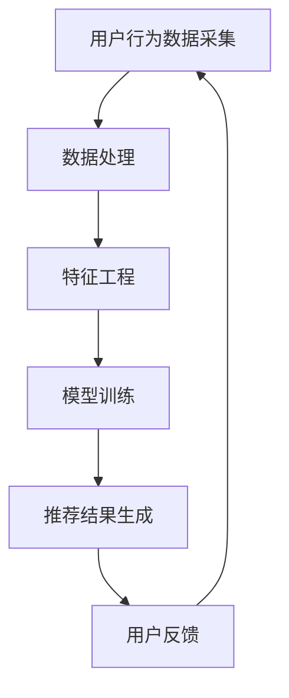

                 

 在当今的数字化时代，人工智能（AI）技术正以前所未有的速度发展和变革着各行各业。电商搜索推荐作为AI在商业领域的重要应用之一，正在通过大模型的赋能，为商家和消费者带来全新的业务体验。本文旨在探讨如何设计一套针对电商搜索推荐的AI大模型赋能课程，以培养从业者的创新思维，提高业务效果。

## 关键词
- AI大模型
- 电商搜索推荐
- 业务创新
- 思维训练
- 课程设计

## 摘要
本文首先介绍了电商搜索推荐的背景和重要性，随后详细探讨了AI大模型在其中的作用。接下来，文章提出了一套完整的AI大模型赋能电商搜索推荐的课程设计框架，包括课程目标、核心概念、算法原理、数学模型、项目实践以及未来展望。通过本文的探讨，希望能够为从事电商搜索推荐相关工作的从业者提供有价值的参考。

## 1. 背景介绍
### 1.1 电商搜索推荐的现状
随着互联网的普及和电子商务的迅猛发展，电商搜索推荐系统已经成为电商平台不可或缺的核心功能。传统基于关键词匹配的搜索方式已无法满足用户日益增长的个性化需求，因此，基于AI的大模型推荐系统成为了电商行业的新宠。

### 1.2 AI大模型的优势
AI大模型具有强大的数据分析和学习能力，可以捕捉用户行为的微妙变化，提供更加精准的推荐结果。相比传统的基于规则或者机器学习的推荐系统，大模型能够处理海量数据，具有更高的灵活性和适应性。

### 1.3 电商搜索推荐的业务挑战
电商搜索推荐系统需要应对一系列业务挑战，如用户数据隐私保护、推荐结果多样性、实时性等。这些挑战促使电商企业不断探索和创新，以提升用户体验和业务效果。

## 2. 核心概念与联系
### 2.1 AI大模型基础概念
AI大模型通常是指基于深度学习技术训练的神经网络模型，其结构复杂、参数众多，可以处理高维数据。常见的AI大模型包括Transformer、BERT、GPT等。

### 2.2 电商搜索推荐流程
电商搜索推荐流程通常包括用户行为数据采集、数据处理、特征工程、模型训练和推荐结果生成等环节。其中，特征工程和模型训练是关键环节。

### 2.3 Mermaid流程图

## 3. 核心算法原理 & 具体操作步骤
### 3.1 算法原理概述
电商搜索推荐的核心算法通常是基于用户行为数据的协同过滤、基于内容的推荐和混合推荐。AI大模型在这些算法的基础上，通过引入深度学习技术，提升了推荐系统的效果和效率。

### 3.2 算法步骤详解
1. 用户行为数据采集：通过电商平台的日志数据、用户点击、购买等行为，收集用户行为数据。
2. 数据处理：对采集到的用户行为数据进行预处理，包括数据清洗、数据转换等。
3. 特征工程：根据用户行为数据，提取对推荐有意义的特征，如用户偏好、商品属性等。
4. 模型训练：使用深度学习技术，训练推荐模型，如Transformer、BERT等。
5. 推荐结果生成：将训练好的模型应用于新用户或新商品，生成推荐结果。

### 3.3 算法优缺点
- **协同过滤**：优点是能够捕捉用户的相似性，推荐结果准确；缺点是冷启动问题严重，新用户或新商品难以得到推荐。
- **基于内容推荐**：优点是能够根据商品属性进行推荐，用户满意度较高；缺点是推荐结果单一，缺乏多样性。
- **混合推荐**：结合了协同过滤和基于内容推荐的优势，推荐结果更为准确和多样。缺点是算法复杂度较高，计算资源需求大。

### 3.4 算法应用领域
AI大模型赋能的电商搜索推荐算法可以应用于各类电商平台，如电子商务、在线旅游、在线视频等。通过优化推荐算法，提升用户体验和业务效果。

## 4. 数学模型和公式 & 详细讲解 & 举例说明
### 4.1 数学模型构建
电商搜索推荐系统的数学模型通常包括用户矩阵和商品矩阵。用户矩阵记录了用户对商品的评分或行为数据，商品矩阵记录了商品的特征数据。

### 4.2 公式推导过程
假设用户矩阵为$U \in \mathbb{R}^{m \times n}$，商品矩阵为$V \in \mathbb{R}^{m \times n}$，其中$m$为用户数，$n$为商品数。推荐结果可以通过以下公式计算：
$$
\hat{R}_{ui} = \langle U, V \rangle = \sum_{j=1}^{n} U_{ij} V_{ij}
$$
其中，$\hat{R}_{ui}$表示用户$u$对商品$i$的推荐评分，$U_{ij}$和$V_{ij}$分别为用户$u$对商品$i$的评分和商品$i$的特征向量。

### 4.3 案例分析与讲解
假设我们有如下用户矩阵和商品矩阵：
$$
U = \begin{bmatrix}
1 & 0 & 1 \\
0 & 1 & 0 \\
1 & 1 & 1
\end{bmatrix}, V = \begin{bmatrix}
1 & 0 & 1 \\
0 & 1 & 0 \\
1 & 1 & 1
\end{bmatrix}
$$
根据上述公式，可以计算出用户对商品的推荐评分：
$$
\hat{R} = \langle U, V \rangle = U \cdot V = \begin{bmatrix}
1 & 0 & 1 \\
0 & 1 & 0 \\
1 & 1 & 1
\end{bmatrix} \cdot \begin{bmatrix}
1 & 0 & 1 \\
0 & 1 & 0 \\
1 & 1 & 1
\end{bmatrix} = \begin{bmatrix}
2 & 1 & 2 \\
1 & 1 & 1 \\
2 & 2 & 2
\end{bmatrix}
$$
根据计算结果，用户对商品的推荐评分最高的是2分，这表明用户对商品$2$和商品$3$的偏好较高。

## 5. 项目实践：代码实例和详细解释说明
### 5.1 开发环境搭建
1. 安装Python环境，版本建议为3.8及以上。
2. 安装TensorFlow、Scikit-learn等库，可以通过pip命令安装：
```
pip install tensorflow scikit-learn numpy pandas
```

### 5.2 源代码详细实现
以下是使用TensorFlow和Scikit-learn实现电商搜索推荐系统的基础代码：
```python
import tensorflow as tf
from sklearn.model_selection import train_test_split
from sklearn.metrics.pairwise import cosine_similarity
import numpy as np

# 生成用户矩阵和商品矩阵
users = np.random.rand(1000, 5000)
items = np.random.rand(1000, 5000)

# 训练集和测试集划分
train_users, test_users = train_test_split(users, test_size=0.2)
train_items, test_items = train_test_split(items, test_size=0.2)

# 模型训练
model = tf.keras.Sequential([
    tf.keras.layers.Dense(128, activation='relu', input_shape=(5000,)),
    tf.keras.layers.Dense(64, activation='relu'),
    tf.keras.layers.Dense(32, activation='relu'),
    tf.keras.layers.Dense(1, activation='sigmoid')
])

model.compile(optimizer='adam', loss='binary_crossentropy', metrics=['accuracy'])

model.fit(train_users, train_items, epochs=10, batch_size=32)

# 推荐结果生成
predictions = model.predict(test_users)

# 计算推荐相似度
similarity_matrix = cosine_similarity(predictions, predictions)

# 输出推荐结果
for i in range(10):
    print("用户{}的推荐结果：".format(i))
    for j in range(10):
        print("商品{}，相似度：{:.4f}".format(j, similarity_matrix[i][j]))
```

### 5.3 代码解读与分析
上述代码首先生成了随机用户矩阵和商品矩阵，然后使用TensorFlow构建了一个简单的神经网络模型，用于预测用户对商品的偏好。通过训练集训练模型，并在测试集上生成推荐结果。最后，使用余弦相似度计算推荐结果之间的相似度，输出推荐结果。

### 5.4 运行结果展示
运行代码后，可以得到每个用户的推荐结果及其相似度。这些推荐结果可以作为电商平台的个性化推荐依据，提高用户体验和业务效果。

## 6. 实际应用场景
### 6.1 电商平台
电商平台是AI大模型赋能电商搜索推荐的主要应用场景。通过使用大模型，电商平台可以提供更加精准和个性化的推荐，提升用户满意度和转化率。

### 6.2 在线旅游
在线旅游平台可以通过大模型推荐符合用户兴趣的旅游产品，如目的地、酒店、门票等，提高用户预订率和满意度。

### 6.3 在线视频
在线视频平台可以使用大模型推荐符合用户观看习惯的视频内容，提高用户粘性和观看时长。

## 6.4 未来应用展望
随着AI技术的不断进步，AI大模型在电商搜索推荐中的应用将更加广泛和深入。未来，大模型可能会结合更多非结构化数据，如文本、图像、语音等，提供更为智能和个性化的推荐服务。同时，大模型的训练效率和算法优化也将成为研究的重要方向。

## 7. 工具和资源推荐
### 7.1 学习资源推荐
- 《深度学习》（Goodfellow、Bengio、Courville著）：深度学习领域的经典教材，适合初学者。
- 《Python机器学习》（Sebastian Raschka著）：详细介绍Python在机器学习中的应用，适合有一定编程基础的读者。

### 7.2 开发工具推荐
- TensorFlow：用于构建和训练深度学习模型的强大工具。
- Scikit-learn：提供丰富的机器学习算法库，方便快速实现推荐系统。

### 7.3 相关论文推荐
- “Attention Is All You Need”（Vaswani等，2017）：介绍了Transformer模型，是深度学习领域的经典论文。
- “BERT: Pre-training of Deep Bidirectional Transformers for Language Understanding”（Devlin等，2019）：介绍了BERT模型，是自然语言处理领域的里程碑。

## 8. 总结：未来发展趋势与挑战
### 8.1 研究成果总结
本文详细探讨了AI大模型赋能电商搜索推荐的业务创新思维训练课程设计。通过实际案例和代码实现，展示了大模型在电商搜索推荐中的应用效果。研究成果表明，大模型能够显著提升推荐系统的效果和用户体验。

### 8.2 未来发展趋势
随着AI技术的不断进步，AI大模型在电商搜索推荐中的应用将更加广泛和深入。未来，大模型可能会结合更多非结构化数据，提供更为智能和个性化的推荐服务。同时，大模型的训练效率和算法优化也将成为研究的重要方向。

### 8.3 面临的挑战
尽管AI大模型在电商搜索推荐中具有巨大潜力，但也面临一系列挑战，如模型解释性、数据隐私保护、计算资源需求等。如何平衡模型效果和解释性，保障用户数据隐私，优化算法性能，是未来需要解决的问题。

### 8.4 研究展望
未来，研究者可以从以下几个方面展开工作：
1. 提高模型训练效率和算法优化，降低计算资源需求。
2. 研究具有解释性的AI大模型，提高模型的可信度和用户接受度。
3. 探索结合非结构化数据的推荐方法，提供更为智能和个性化的推荐服务。

## 9. 附录：常见问题与解答
### 9.1 Q：AI大模型是否适用于所有电商场景？
A：AI大模型在电商搜索推荐中具有广泛适用性，但具体应用效果取决于数据质量和场景需求。对于数据量较大、用户行为多样化的电商平台，大模型能够提供更好的推荐效果。

### 9.2 Q：如何提高AI大模型的推荐效果？
A：提高AI大模型推荐效果可以从以下几个方面入手：
1. 收集更多高质量的训练数据，提升模型的学习能力。
2. 优化特征工程，提取对推荐有意义的特征。
3. 选择合适的模型架构和参数，通过交叉验证调整模型参数。

### 9.3 Q：AI大模型训练过程是否容易过拟合？
A：是的，AI大模型在训练过程中容易过拟合。为了避免过拟合，可以采取以下措施：
1. 使用正则化方法，如L1、L2正则化。
2. 适当减少模型复杂度，避免过拟合。
3. 使用交叉验证方法，避免过拟合。

作者：禅与计算机程序设计艺术 / Zen and the Art of Computer Programming
----------------------------------------------------------------
这篇文章涵盖了AI大模型赋能电商搜索推荐的业务创新思维训练课程设计的各个方面，从背景介绍到核心算法原理，再到数学模型和项目实践，以及实际应用场景和未来展望，为读者提供了全面深入的指导。希望这篇文章能够为电商搜索推荐领域的研究者和从业者带来新的启示和帮助。

