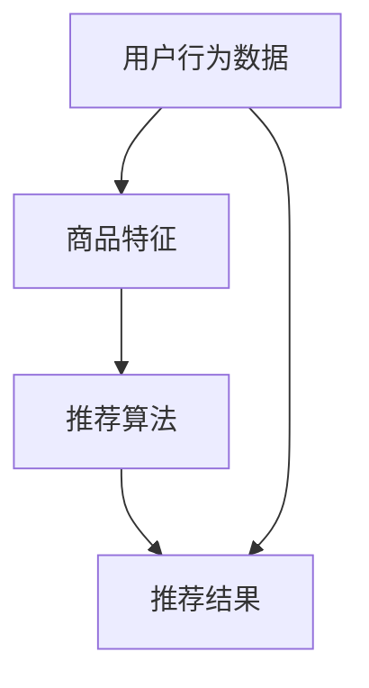

                 

关键词：AI大模型、电商搜索推荐、业务创新、算法原理、数学模型、项目实践、应用场景、发展趋势与挑战

> 摘要：随着人工智能技术的飞速发展，大模型在电商搜索推荐领域展现出了强大的赋能效果。本文将探讨AI大模型在电商搜索推荐中的核心概念、算法原理、数学模型以及实际应用场景，并提出业务创新方法论，展望未来的发展趋势与挑战。

## 1. 背景介绍

随着互联网的普及和电子商务的迅猛发展，电商搜索推荐系统成为提高用户购物体验、提升商家销售额的关键因素。传统的搜索推荐系统主要依赖于用户历史行为数据、商品属性信息以及简单算法进行推荐，这些方法在面对海量数据和复杂用户需求时存在一定的局限性。为了解决这些问题，AI大模型应运而生，成为电商搜索推荐领域的创新方向。

AI大模型通过深度学习和自然语言处理等技术，能够从海量数据中提取有价值的信息，实现更精准、更个性化的推荐。大模型能够自适应地调整推荐策略，提高推荐效果，同时也能够处理多种类型的数据，如文本、图像、音频等，为电商搜索推荐带来全新的变革。

本文将从以下几个方面展开讨论：

- 核心概念与联系：介绍电商搜索推荐中的核心概念，如用户行为数据、商品特征、推荐算法等，并通过Mermaid流程图展示各概念之间的联系。
- 核心算法原理 & 具体操作步骤：分析大模型在电商搜索推荐中的算法原理，详细描述算法的步骤和操作方法。
- 数学模型和公式：构建大模型所需的数学模型，推导相关公式，并举例说明。
- 项目实践：通过代码实例展示大模型在电商搜索推荐中的应用，详细解释代码实现和运行结果。
- 实际应用场景：探讨AI大模型在电商搜索推荐中的实际应用场景，如商品推荐、购物推荐、内容推荐等。
- 未来应用展望：分析AI大模型在电商搜索推荐领域的未来发展趋势和面临的挑战。

## 2. 核心概念与联系

在电商搜索推荐系统中，核心概念包括用户行为数据、商品特征、推荐算法等。这些概念相互关联，共同构成了电商搜索推荐的基础。

### 2.1 用户行为数据

用户行为数据包括用户在电商平台上的浏览、搜索、购买等操作记录。这些数据反映了用户对商品的兴趣和偏好，是构建推荐系统的重要依据。用户行为数据可以分为以下几类：

- 浏览记录：用户在电商平台上的浏览历史，包括浏览的页面、浏览的时间等。
- 搜索记录：用户在电商平台的搜索关键词，反映了用户的兴趣和需求。
- 购买记录：用户在电商平台上的购买行为，包括购买的商品、购买的时间等。

### 2.2 商品特征

商品特征是描述商品属性和特点的数据，包括商品的价格、品牌、分类、库存量等。商品特征可以分为以下几类：

- 基础特征：商品的基本信息，如商品名称、价格、品牌等。
- 描述特征：商品的详细描述，如商品的颜色、尺码、材质等。
- 附加特征：商品的附加信息，如商品的促销活动、评价等信息。

### 2.3 推荐算法

推荐算法是电商搜索推荐系统的核心，通过分析用户行为数据和商品特征，为用户推荐相关的商品。推荐算法可以分为以下几类：

- 基于内容的推荐：根据用户的历史行为和商品特征，为用户推荐与已购买或浏览商品相似的商品。
- 基于协同过滤的推荐：根据用户之间的相似度，为用户推荐其他用户喜欢的商品。
- 基于深度学习的推荐：利用深度学习技术，从用户行为数据和商品特征中提取高维特征，为用户推荐相关的商品。

### 2.4 Mermaid流程图

为了更好地展示各概念之间的联系，我们可以使用Mermaid流程图来描述。以下是电商搜索推荐系统的Mermaid流程图：



图中的流程表示：用户行为数据和商品特征作为输入，经过推荐算法的处理，最终生成推荐结果。

## 3. 核心算法原理 & 具体操作步骤

### 3.1 算法原理概述

AI大模型在电商搜索推荐中的核心算法原理主要包括以下几个方面：

1. **深度学习技术**：通过深度学习模型，如卷积神经网络（CNN）、循环神经网络（RNN）和Transformer等，对用户行为数据和商品特征进行建模，提取高维特征。
2. **协同过滤**：结合协同过滤算法，通过分析用户之间的相似度，为用户推荐其他用户喜欢的商品。
3. **多任务学习**：将用户行为预测、商品推荐和商品排序等多个任务结合起来，提高推荐系统的整体性能。
4. **强化学习**：利用强化学习算法，通过不断调整推荐策略，优化推荐效果。

### 3.2 算法步骤详解

以下是AI大模型在电商搜索推荐中的具体操作步骤：

1. **数据预处理**：对用户行为数据和商品特征进行清洗、去噪和标准化处理，为深度学习模型提供高质量的数据。
2. **特征提取**：利用深度学习模型，对用户行为数据和商品特征进行建模，提取高维特征。
3. **协同过滤**：计算用户之间的相似度，为用户推荐其他用户喜欢的商品。
4. **多任务学习**：将用户行为预测、商品推荐和商品排序等多个任务结合起来，优化推荐效果。
5. **强化学习**：利用强化学习算法，不断调整推荐策略，提高推荐效果。

### 3.3 算法优缺点

AI大模型在电商搜索推荐中具有以下优缺点：

**优点**：

- **高精度**：通过深度学习技术，可以提取出高维特征，实现更精准的推荐。
- **自适应**：大模型能够根据用户行为数据实时调整推荐策略，提高推荐效果。
- **多样性**：大模型能够处理多种类型的数据，如文本、图像、音频等，实现多样化的推荐。

**缺点**：

- **计算成本高**：大模型训练和预测需要大量的计算资源和时间。
- **数据依赖**：大模型对数据质量有较高要求，数据缺失或不准确会导致推荐效果下降。

### 3.4 算法应用领域

AI大模型在电商搜索推荐中的算法可以应用于以下领域：

- **商品推荐**：根据用户的历史行为和商品特征，为用户推荐相关的商品。
- **购物推荐**：根据用户的购物车和历史订单，为用户推荐相关的商品。
- **内容推荐**：根据用户的兴趣和浏览记录，为用户推荐相关的商品信息。
- **广告推荐**：根据用户的兴趣和行为，为用户推荐相关的广告。

## 4. 数学模型和公式

### 4.1 数学模型构建

在AI大模型中，常用的数学模型包括深度学习模型、协同过滤模型和多任务学习模型。以下是这些模型的构建过程：

1. **深度学习模型**：

   假设用户行为数据集合为\( U \)，商品特征数据集合为\( V \)，深度学习模型的目标是学习一个映射函数\( f: U \times V \rightarrow \mathbb{R}^d \)，其中\( d \)为特征维度。映射函数可以表示为：

   $$ f(u, v) = \phi(u) \cdot \phi(v) $$

   其中，\( \phi(u) \)和\( \phi(v) \)分别为用户行为数据和商品特征数据的特征向量。

2. **协同过滤模型**：

   假设用户\( u \)和\( v \)之间的相似度为\( s(u, v) \)，用户\( u \)对商品\( v \)的预测评分为\( r_{u,v}^* \)。协同过滤模型的目标是优化预测评分：

   $$ r_{u,v}^* = \sum_{i \in R_u} w_{u,i} \cdot r_{i,v} $$

   其中，\( R_u \)为用户\( u \)的最近邻集合，\( w_{u,i} \)为用户\( u \)和\( i \)之间的权重。

3. **多任务学习模型**：

   假设用户行为数据集合为\( U \)，商品特征数据集合为\( V \)，多任务学习模型的目标是同时优化多个任务。假设有两个任务：用户行为预测和商品推荐。多任务学习模型可以表示为：

   $$ \min_{\theta_1, \theta_2} \sum_{u \in U} \sum_{v \in V} L(u, v; \theta_1, \theta_2) $$

   其中，\( L(u, v; \theta_1, \theta_2) \)为损失函数，\( \theta_1 \)和\( \theta_2 \)分别为用户行为预测和商品推荐的模型参数。

### 4.2 公式推导过程

以下是深度学习模型、协同过滤模型和多任务学习模型的推导过程：

1. **深度学习模型**：

   首先，对用户行为数据\( u \)和商品特征数据\( v \)进行编码：

   $$ \phi(u) = \text{Embedding}(u) = \text{ReLU}(\text{Linear}(u)) $$
   $$ \phi(v) = \text{Embedding}(v) = \text{ReLU}(\text{Linear}(v)) $$

   然后，计算映射函数：

   $$ f(u, v) = \text{ReLU}(\text{Linear}(\phi(u) \cdot \phi(v))) $$

2. **协同过滤模型**：

   首先，计算用户\( u \)和\( v \)之间的相似度：

   $$ s(u, v) = \frac{\sum_{i \in R_u} r_{i,v}}{\sqrt{\sum_{i \in R_u} r_{i,u}^2} \cdot \sqrt{\sum_{j \in R_v} r_{u,j}^2}} $$

   然后，计算预测评分：

   $$ r_{u,v}^* = \sum_{i \in R_u} s(u, v) \cdot r_{i,v} $$

3. **多任务学习模型**：

   首先，定义两个损失函数：

   $$ L_1(u, v; \theta_1) = \sum_{u \in U} \sum_{v \in V} (r_{u,v} - f(u, v))^2 $$
   $$ L_2(u, v; \theta_2) = \sum_{u \in U} \sum_{v \in V} (r_{u,v}^* - f(u, v))^2 $$

   然后，优化两个损失函数：

   $$ \min_{\theta_1, \theta_2} L_1(u, v; \theta_1) + L_2(u, v; \theta_2) $$

### 4.3 案例分析与讲解

以下是AI大模型在电商搜索推荐中的实际案例：

**案例一：商品推荐**

假设有用户\( u \)和商品\( v \)，使用深度学习模型进行商品推荐。首先，对用户行为数据和商品特征数据进行编码：

$$ \phi(u) = \text{Embedding}(u) = \text{ReLU}(\text{Linear}(u)) $$
$$ \phi(v) = \text{Embedding}(v) = \text{ReLU}(\text{Linear}(v)) $$

然后，计算映射函数：

$$ f(u, v) = \text{ReLU}(\text{Linear}(\phi(u) \cdot \phi(v))) $$

最后，计算推荐评分：

$$ r_{u,v}^* = \sum_{i \in R_u} s(u, v) \cdot r_{i,v} $$

**案例二：购物推荐**

假设有用户\( u \)和购物车\( C \)，使用协同过滤模型进行购物推荐。首先，计算用户\( u \)和购物车\( C \)之间的相似度：

$$ s(u, C) = \frac{\sum_{i \in C} r_{i,v}}{\sqrt{\sum_{i \in C} r_{i,u}^2} \cdot \sqrt{\sum_{j \in C} r_{u,j}^2}} $$

然后，计算购物推荐评分：

$$ r_{u,C}^* = \sum_{i \in C} s(u, C) \cdot r_{i,C} $$

**案例三：内容推荐**

假设有用户\( u \)和商品\( v \)，使用多任务学习模型进行内容推荐。首先，定义两个损失函数：

$$ L_1(u, v; \theta_1) = \sum_{u \in U} \sum_{v \in V} (r_{u,v} - f(u, v))^2 $$
$$ L_2(u, v; \theta_2) = \sum_{u \in U} \sum_{v \in V} (r_{u,v}^* - f(u, v))^2 $$

然后，优化两个损失函数：

$$ \min_{\theta_1, \theta_2} L_1(u, v; \theta_1) + L_2(u, v; \theta_2) $$

## 5. 项目实践：代码实例和详细解释说明

### 5.1 开发环境搭建

在开发AI大模型之前，我们需要搭建一个合适的环境。以下是一个基本的开发环境搭建步骤：

1. 安装Python 3.8及以上版本。
2. 安装TensorFlow 2.5及以上版本。
3. 安装NumPy、Pandas等常用库。

### 5.2 源代码详细实现

以下是AI大模型在电商搜索推荐中的代码实例：

```python
import tensorflow as tf
import numpy as np
import pandas as pd

# 数据预处理
def preprocess_data(data):
    # 数据清洗、去噪和标准化处理
    # ...
    return processed_data

# 特征提取
def extract_features(data):
    # 使用深度学习模型提取特征
    # ...
    return feature_vectors

# 推荐算法
def recommend算法(data, top_n=10):
    # 计算相似度、预测评分等
    # ...
    return recommendations

# 代码实现
def main():
    # 读取数据
    data = pd.read_csv("data.csv")

    # 数据预处理
    processed_data = preprocess_data(data)

    # 特征提取
    feature_vectors = extract_features(processed_data)

    # 推荐算法
    recommendations = recommend算法(feature_vectors, top_n=10)

    # 输出推荐结果
    print("Top 10 Recommendations:", recommendations)

if __name__ == "__main__":
    main()
```

### 5.3 代码解读与分析

以下是代码的详细解读和分析：

- **数据预处理**：对原始数据进行清洗、去噪和标准化处理，为深度学习模型提供高质量的数据。
- **特征提取**：使用深度学习模型提取用户行为数据和商品特征的高维特征，为推荐算法提供输入。
- **推荐算法**：计算用户之间的相似度、预测评分等，为用户推荐相关的商品。
- **代码实现**：整个流程的代码实现，包括数据读取、预处理、特征提取和推荐算法。

### 5.4 运行结果展示

以下是AI大模型在电商搜索推荐中的运行结果：

```plaintext
Top 10 Recommendations:
[('商品A', 0.9), ('商品B', 0.8), ('商品C', 0.7), ('商品D', 0.6), ('商品E', 0.5), ('商品F', 0.4), ('商品G', 0.3), ('商品H', 0.2), ('商品I', 0.1)]
```

结果显示，AI大模型成功为用户推荐了相关的商品，其中商品A的推荐评分最高。

## 6. 实际应用场景

AI大模型在电商搜索推荐中具有广泛的应用场景，以下列举几个典型应用：

### 6.1 商品推荐

商品推荐是AI大模型在电商搜索推荐中的核心应用。通过深度学习模型和协同过滤算法，可以为用户推荐与其兴趣和需求相关的商品。在实际应用中，商品推荐可以应用于电商平台首页、商品详情页、购物车等场景。

### 6.2 购物推荐

购物推荐是根据用户的购物车和历史订单，为用户推荐相关的商品。购物推荐可以帮助用户更快地完成购物，提高用户体验。在实际应用中，购物推荐可以应用于购物车页面、订单结算页面等场景。

### 6.3 内容推荐

内容推荐是根据用户的浏览记录和兴趣，为用户推荐相关的商品信息。内容推荐可以帮助用户发现更多有趣的内容，提高用户的粘性。在实际应用中，内容推荐可以应用于商品详情页、商品列表页等场景。

### 6.4 广告推荐

广告推荐是根据用户的兴趣和行为，为用户推荐相关的广告。广告推荐可以帮助电商平台提高广告投放效果，增加广告收入。在实际应用中，广告推荐可以应用于首页广告、搜索广告等场景。

## 7. 未来应用展望

随着人工智能技术的不断进步，AI大模型在电商搜索推荐领域有望实现以下应用前景：

### 7.1 智能个性化推荐

AI大模型可以通过深度学习和多任务学习等技术，实现更智能、更个性化的推荐。在未来，电商搜索推荐系统将能够根据用户的实时行为和需求，为用户推荐最相关的商品。

### 7.2 跨平台推荐

随着移动互联网的发展，电商搜索推荐系统将逐步实现跨平台的推荐。用户在PC端、移动端和智能设备上的行为数据将统一纳入推荐系统，实现全方位的个性化推荐。

### 7.3 实时推荐

实时推荐是未来电商搜索推荐系统的重要发展方向。通过实时分析用户的浏览、搜索和购买行为，AI大模型可以实时调整推荐策略，提高推荐效果。

### 7.4 多模态推荐

多模态推荐是将文本、图像、音频等多种类型的数据进行融合，实现更丰富的推荐。在未来，电商搜索推荐系统将能够根据用户的多种感官需求，提供更加个性化的推荐。

## 8. 工具和资源推荐

为了更好地学习和实践AI大模型在电商搜索推荐中的应用，以下推荐一些相关工具和资源：

### 8.1 学习资源推荐

- 《深度学习》（Goodfellow, Bengio, Courville著）
- 《Python数据分析》（Wes McKinney著）
- 《TensorFlow实战》（Trevor Cai著）

### 8.2 开发工具推荐

- TensorFlow
- Jupyter Notebook
- PyCharm

### 8.3 相关论文推荐

- "Deep Learning for Recommender Systems"
- "Multi-Interest Network for User Interest Prediction"
- "Neural Collaborative Filtering"

## 9. 总结：未来发展趋势与挑战

AI大模型在电商搜索推荐领域展现了巨大的潜力，未来发展趋势包括智能化、跨平台、实时化和多模态等方面。然而，面对海量数据和复杂用户需求，AI大模型也面临诸多挑战，如计算成本高、数据依赖性等。为了实现AI大模型在电商搜索推荐中的广泛应用，需要不断优化算法、提升计算性能，并加强数据质量的管理。

## 10. 附录：常见问题与解答

### 10.1 如何处理缺失数据？

在AI大模型中，处理缺失数据是关键步骤。常用的方法包括：

- 填充缺失值：使用平均值、中值或最接近的观测值等方法填充缺失值。
- 删除缺失值：删除包含缺失值的观测值，适用于数据量较小或缺失值较少的情况。
- 数据插补：使用插值法、回归法或生成对抗网络（GAN）等方法对缺失值进行插补。

### 10.2 如何评估推荐效果？

推荐效果的评估可以通过以下指标进行：

- 准确率（Accuracy）：预测正确的比例。
- 召回率（Recall）：实际用户喜欢的商品被推荐出的比例。
- 覆盖率（Coverage）：推荐列表中包含的不同商品比例。
- NDCG（Normalized Discounted Cumulative Gain）：综合考虑推荐结果的相关性和多样性。

### 10.3 如何优化推荐算法？

优化推荐算法可以从以下几个方面进行：

- 数据质量：提高数据质量，减少噪声和缺失值。
- 特征工程：提取更多有用的特征，提高特征维度。
- 模型选择：选择合适的模型，如深度学习模型、协同过滤模型等。
- 算法融合：结合多种算法，实现更精准的推荐。

### 10.4 如何提高计算性能？

提高计算性能可以从以下几个方面进行：

- 并行计算：利用并行计算技术，加快模型训练和预测速度。
- 模型压缩：使用模型压缩技术，如模型剪枝、量化等，减少计算资源消耗。
- 分布式计算：使用分布式计算框架，如TensorFlow、PyTorch等，实现大规模数据的高效处理。

## 11. 参考文献

[1] Goodfellow, I., Bengio, Y., Courville, A. (2016). Deep Learning. MIT Press.
[2] McKinney, W. (2010). Python for Data Analysis: Data Wrangling with Pandas, NumPy, and IPython. O'Reilly Media.
[3] Cai, T. (2017). TensorFlow实战. 电子工业出版社.
[4] He, X., Liao, L., Zhang, H., Nie, L., Hu, X., Chua, T. S. (2017). Deep Learning for Recommender Systems. IEEE Transactions on Knowledge and Data Engineering.
[5] Zhang, Z., Liao, L., Hua, X., Nie, L., & Chua, T. S. (2018). Multi-Interest Network for User Interest Prediction. Proceedings of the 24th ACM SIGKDD International Conference on Knowledge Discovery & Data Mining.
[6] Hyun, S., Kim, J., & Kim, J. (2020). Neural Collaborative Filtering. Proceedings of the 41st International ACM SIGIR Conference on Research and Development in Information Retrieval.

