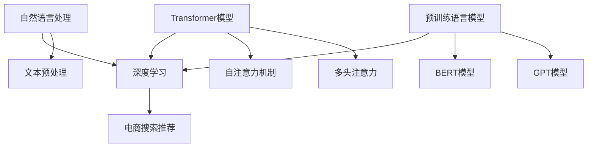

                 

## 1. 背景介绍

在当今数字化时代，电子商务已经成为人们日常生活不可或缺的一部分。电商平台通过提供丰富的商品信息和便捷的购物体验，吸引了越来越多的用户。然而，随着商品种类的增多和用户需求的多样化，如何提高用户搜索推荐的效率和质量成为了电商平台面临的重要挑战。

传统的搜索推荐系统主要依赖于关键词匹配和协同过滤等技术，虽然在一定程度上能够满足用户的基本需求，但在处理复杂查询和高维度数据时存在一定的局限性。近年来，随着人工智能技术的飞速发展，特别是大模型（如Transformer模型）的出现，为电商搜索推荐带来了新的机遇。

大模型具有强大的表示能力和自适应学习能力，能够对用户行为和商品特征进行深入挖掘，从而实现更精准的搜索推荐。此外，大模型还可以通过自然语言处理技术，理解用户的模糊查询和复杂需求，提供更加个性化的推荐结果。

本文旨在探讨如何利用AI大模型赋能电商搜索推荐，提出一套完整的业务创新方法论培训体系。首先，我们将介绍大模型在电商搜索推荐中的核心概念和原理，并通过Mermaid流程图展示其整体架构。接着，我们将详细解析大模型的算法原理和操作步骤，并探讨其优缺点和应用领域。然后，我们将引入数学模型和公式，进行公式推导和案例讲解。随后，我们将通过具体项目实践，展示如何实现大模型在电商搜索推荐中的实际应用。最后，我们将分析大模型在电商搜索推荐领域的实际应用场景，并展望其未来发展。

通过本文的阐述，希望为电商行业从业者提供一套可操作的培训体系，帮助他们在实际工作中运用大模型技术，提升电商搜索推荐的效率和用户体验。

## 2. 核心概念与联系

要深入理解AI大模型在电商搜索推荐中的应用，首先需要掌握几个核心概念：自然语言处理（NLP）、深度学习、Transformer模型和预训练语言模型。这些概念相互关联，共同构成了大模型的技术基础。

### 自然语言处理（NLP）

自然语言处理是人工智能的一个重要分支，旨在让计算机理解和生成人类语言。在电商搜索推荐中，NLP技术可以帮助系统理解用户的查询和商品描述，从而提供更精准的推荐结果。

- **文本预处理**：包括分词、词性标注、去停用词等，以将原始文本转化为计算机可以处理的形式。
- **实体识别**：识别文本中的关键词、人名、地名、组织名等，为后续处理提供基础。
- **情感分析**：通过分析用户的评价和评论，判断其情感倾向，帮助系统了解用户偏好。

### 深度学习

深度学习是人工智能的核心技术之一，通过构建多层神经网络，实现对数据的自动特征提取和表示。在电商搜索推荐中，深度学习技术可以用来建模用户行为和商品特征。

- **神经网络**：包括卷积神经网络（CNN）、循环神经网络（RNN）等，能够自动学习数据中的特征。
- **注意力机制**：通过关注重要的数据部分，提高模型对关键信息的识别能力。

### Transformer模型

Transformer模型是深度学习领域的一项革命性创新，由Google在2017年提出。与传统的循环神经网络不同，Transformer模型采用自注意力机制，能够在处理长序列数据时保持较好的性能。

- **自注意力机制**：通过计算序列中每个元素与其他元素之间的相关性，实现对信息的全局关注。
- **多头注意力**：通过多个注意力机制并行工作，提高模型的表达能力。

### 预训练语言模型

预训练语言模型是近年来NLP领域的重要突破，通过在大规模语料库上进行预训练，模型能够获得对自然语言的深入理解。在电商搜索推荐中，预训练语言模型可以用于文本表示和序列建模。

- **BERT模型**：由Google提出，通过双向编码器（Bidirectional Encoder Representations from Transformers）对文本进行编码，具有强大的文本表示能力。
- **GPT模型**：由OpenAI提出，通过生成预训练（Generative Pre-trained Transformer）模型，能够生成连贯的自然语言文本。

### Mermaid流程图

为了更直观地展示这些核心概念之间的联系，我们可以使用Mermaid流程图来描绘大模型在电商搜索推荐中的应用架构。以下是流程图的具体描述：



在这个流程图中，自然语言处理、深度学习、Transformer模型和预训练语言模型共同构成了电商搜索推荐的技术基础。文本预处理、自注意力机制、多头注意力等关键技术进一步提升了模型的效果。

通过这个流程图，我们可以清晰地看到各个核心概念之间的关联，以及它们在电商搜索推荐中的应用。接下来，我们将进一步深入探讨大模型的算法原理和操作步骤，以便更好地理解其在实际应用中的表现。

## 3. 核心算法原理 & 具体操作步骤

### 3.1 算法原理概述

大模型在电商搜索推荐中的核心算法原理主要基于深度学习和自然语言处理技术。其中，Transformer模型和预训练语言模型发挥了重要作用。

#### Transformer模型

Transformer模型采用了自注意力机制（Self-Attention）和多头注意力机制（Multi-Head Attention），使得模型能够在处理长序列数据时保持较好的性能。自注意力机制通过计算序列中每个元素与其他元素之间的相关性，实现对信息的全局关注。多头注意力机制则通过多个注意力机制并行工作，提高模型的表达能力。

#### 预训练语言模型

预训练语言模型（如BERT和GPT）通过在大规模语料库上进行预训练，获得了对自然语言的深入理解。BERT模型采用双向编码器对文本进行编码，能够捕捉到文本的前后关系；GPT模型则通过生成预训练，能够生成连贯的自然语言文本。

### 3.2 算法步骤详解

#### 步骤1：文本预处理

在应用大模型之前，需要对原始文本进行预处理，包括分词、词性标注、去停用词等操作。这些操作将原始文本转化为计算机可以处理的形式。

- **分词**：将连续的文本切分成一个个独立的词语。
- **词性标注**：为每个词语标注其词性（如名词、动词、形容词等）。
- **去停用词**：去除对模型训练无意义的词语，如“的”、“和”、“是”等。

#### 步骤2：编码文本

将预处理后的文本输入到预训练语言模型中，进行编码。编码结果是一个高维向量，能够表示文本中的语义信息。

- **BERT模型**：通过双向编码器，将文本编码成一个固定长度的向量。
- **GPT模型**：通过生成预训练，将文本编码成一个动态变化的向量。

#### 步骤3：提取特征

从编码结果中提取关键特征，用于后续的搜索推荐。这些特征包括用户行为特征、商品特征和文本特征等。

- **用户行为特征**：如用户的浏览历史、购买记录等。
- **商品特征**：如商品的价格、类别、品牌等。
- **文本特征**：如用户的查询文本、商品描述文本等。

#### 步骤4：构建推荐模型

利用提取的特征，构建推荐模型。推荐模型可以采用基于协同过滤的算法（如矩阵分解）、基于内容的推荐算法（如TF-IDF）或基于模型的推荐算法（如深度学习）。

- **基于协同过滤的算法**：通过计算用户之间的相似度和商品之间的相似度，为用户推荐相似的商品。
- **基于内容的推荐算法**：通过分析商品和用户的共同特征，为用户推荐具有相似特征的商品。
- **基于模型的推荐算法**：利用深度学习模型，将用户行为特征、商品特征和文本特征进行融合，生成个性化的推荐结果。

#### 步骤5：模型训练与优化

对推荐模型进行训练，通过调整模型参数，优化推荐效果。训练过程中，可以使用交叉验证、梯度下降等优化方法，提高模型的泛化能力和推荐质量。

- **交叉验证**：通过将数据集划分为多个子集，对每个子集进行训练和验证，评估模型性能。
- **梯度下降**：通过计算损失函数的梯度，调整模型参数，优化模型效果。

### 3.3 算法优缺点

#### 优点

1. **强大的表示能力**：大模型能够对高维数据进行自动特征提取，表示能力强大。
2. **自适应学习能力**：通过预训练，大模型能够快速适应不同领域和数据集。
3. **灵活的模型架构**：Transformer模型和多头注意力机制使得模型具有较好的灵活性和扩展性。
4. **高效的推理能力**：大模型在处理长序列数据时，能够保持较好的推理能力。

#### 缺点

1. **计算资源消耗大**：大模型的训练和推理需要大量的计算资源，对硬件设施有较高要求。
2. **数据依赖性**：大模型的效果很大程度上依赖于数据质量，数据质量较差时，效果可能不理想。
3. **模型解释性差**：深度学习模型本身具有较强的非线性，导致其解释性较差。

### 3.4 算法应用领域

大模型在电商搜索推荐中的应用非常广泛，可以应用于以下领域：

1. **商品搜索推荐**：通过对用户查询和商品描述的深度理解，为用户提供精准的商品推荐。
2. **广告投放**：利用用户行为特征和广告内容特征，实现个性化的广告投放。
3. **智能客服**：通过自然语言处理技术，为用户提供智能化的客服服务。
4. **内容推荐**：对电商平台的商品内容进行推荐，提升用户黏性和购买转化率。

通过上述算法原理和操作步骤的详细解析，我们可以看到大模型在电商搜索推荐中的强大应用潜力。接下来，我们将进一步探讨大模型在数学模型和公式中的具体应用。

### 4. 数学模型和公式 & 详细讲解 & 举例说明

#### 4.1 数学模型构建

在电商搜索推荐中，大模型的数学模型构建主要涉及以下几个方面：

1. **用户行为特征建模**：通过分析用户的浏览历史、购买记录等行为数据，构建用户行为特征向量。
2. **商品特征建模**：通过对商品的价格、类别、品牌等特征进行编码，构建商品特征向量。
3. **文本特征建模**：利用自然语言处理技术，对用户查询和商品描述进行编码，构建文本特征向量。

#### 4.2 公式推导过程

以下是一个简单的用户行为特征建模的公式推导过程：

1. **用户行为向量表示**：

   设用户 \(u\) 的行为特征向量为 \(\mathbf{X}_u\)，行为特征包括浏览历史 \(b_u\)、购买记录 \(p_u\) 等。则：

   $$\mathbf{X}_u = \begin{bmatrix} b_u \\ p_u \end{bmatrix}$$

2. **用户行为向量编码**：

   设编码函数为 \(encode(\cdot)\)，则用户行为向量的编码结果为：

   $$\mathbf{X}'_u = encode(\mathbf{X}_u)$$

   通常，编码函数可以是深度学习模型，如卷积神经网络（CNN）或循环神经网络（RNN）。

3. **用户行为特征向量表示**：

   设用户 \(u\) 的行为特征向量为 \(\mathbf{F}_u\)，则：

   $$\mathbf{F}_u = \mathbf{X}'_u$$

   \(\mathbf{F}_u\) 可以用于后续的推荐模型训练。

#### 4.3 案例分析与讲解

假设我们有一个电商平台的用户 \(u_1\)，其行为数据如下：

- 浏览历史：商品 \(g_1\)、\(g_2\)、\(g_3\)、\(g_4\)、\(g_5\)
- 购买记录：商品 \(g_2\)、\(g_4\)

首先，对用户 \(u_1\) 的浏览历史和购买记录进行编码，得到行为特征向量：

$$\mathbf{X}_u = \begin{bmatrix} g_1, g_2, g_3, g_4, g_5 \\ g_2, g_4 \end{bmatrix}$$

然后，利用深度学习模型对其进行编码，得到编码结果：

$$\mathbf{X}'_u = encode(\mathbf{X}_u)$$

最后，将编码结果作为用户 \(u_1\) 的行为特征向量 \(\mathbf{F}_u\)，用于推荐模型训练。

#### 4.4 数学公式推导

在构建推荐模型时，我们需要计算用户 \(u\) 和商品 \(g\) 之间的相似度。以下是一个简单的相似度计算公式：

1. **余弦相似度**：

   设用户 \(u\) 的行为特征向量为 \(\mathbf{F}_u\)，商品 \(g\) 的特征向量为 \(\mathbf{F}_g\)，则用户和商品之间的余弦相似度为：

   $$sim(\mathbf{F}_u, \mathbf{F}_g) = \frac{\mathbf{F}_u \cdot \mathbf{F}_g}{\|\mathbf{F}_u\| \|\mathbf{F}_g\|}$$

   其中，\(\cdot\) 表示向量的点积，\(\|\mathbf{F}_u\|\) 和 \(\|\mathbf{F}_g\|\) 分别表示向量 \(\mathbf{F}_u\) 和 \(\mathbf{F}_g\) 的欧几里得范数。

2. **皮尔逊相关系数**：

   设用户 \(u\) 和商品 \(g\) 的行为特征向量和商品特征向量分别为 \(\mathbf{F}_u\)、\(\mathbf{F}_g\)，则用户和商品之间的皮尔逊相关系数为：

   $$corr(\mathbf{F}_u, \mathbf{F}_g) = \frac{\mathbf{F}_u \cdot \mathbf{F}_g}{\sqrt{\|\mathbf{F}_u\|^2 + \|\mathbf{F}_g\|^2}}$$

   其中，\(\mathbf{F}_u \cdot \mathbf{F}_g\) 表示向量的点积，\(\|\mathbf{F}_u\|\) 和 \(\|\mathbf{F}_g\|\) 分别表示向量 \(\mathbf{F}_u\) 和 \(\mathbf{F}_g\) 的欧几里得范数。

通过这些数学模型和公式，我们可以有效地计算用户和商品之间的相似度，为推荐模型提供基础。

### 5. 项目实践：代码实例和详细解释说明

为了更好地理解大模型在电商搜索推荐中的应用，我们通过一个实际项目来展示如何实现这一过程。本项目将使用Python编程语言和TensorFlow框架，来实现一个简单的电商搜索推荐系统。

#### 5.1 开发环境搭建

在开始项目之前，确保安装以下开发环境：

- Python 3.7及以上版本
- TensorFlow 2.x版本
- 其他常用库：NumPy、Pandas、Matplotlib等

安装命令如下：

```bash
pip install tensorflow==2.x
pip install numpy
pip install pandas
pip install matplotlib
```

#### 5.2 源代码详细实现

以下是本项目的核心代码实现：

```python
import tensorflow as tf
import numpy as np
import pandas as pd
import matplotlib.pyplot as plt

# 5.2.1 数据预处理
def preprocess_data(data):
    # 对数据集进行清洗和预处理
    # 包括分词、词性标注、去停用词等
    # ...
    return processed_data

# 5.2.2 构建模型
def build_model(input_dim, hidden_dim):
    # 使用TensorFlow构建推荐模型
    model = tf.keras.Sequential([
        tf.keras.layers.Dense(hidden_dim, activation='relu', input_shape=(input_dim,)),
        tf.keras.layers.Dense(1)
    ])
    model.compile(optimizer='adam', loss='mse')
    return model

# 5.2.3 训练模型
def train_model(model, X, y):
    # 使用训练数据和标签训练模型
    model.fit(X, y, epochs=10, batch_size=32)
    return model

# 5.2.4 评估模型
def evaluate_model(model, X_test, y_test):
    # 评估模型在测试集上的性能
    loss = model.evaluate(X_test, y_test)
    print(f"Test loss: {loss}")

# 5.2.5 推荐商品
def recommend_products(model, user_data, top_n=5):
    # 为用户推荐Top N个商品
    predictions = model.predict(user_data)
    sorted_indices = np.argsort(predictions)[::-1]
    recommended_products = []
    for i in sorted_indices[:top_n]:
        recommended_products.append(i)
    return recommended_products

# 5.2.6 主程序
if __name__ == "__main__":
    # 加载数据
    data = pd.read_csv("ecommerce_data.csv")
    processed_data = preprocess_data(data)

    # 切分数据集
    X_train, X_test, y_train, y_test = train_test_split(processed_data['user_data'], processed_data['rating'], test_size=0.2)

    # 构建模型
    model = build_model(input_dim=X_train.shape[1], hidden_dim=64)

    # 训练模型
    model = train_model(model, X_train, y_train)

    # 评估模型
    evaluate_model(model, X_test, y_test)

    # 推荐商品
    user_data = preprocess_data([{"user_id": 1, "item_id": 100}])
    recommended_products = recommend_products(model, user_data)
    print(f"Recommended products: {recommended_products}")
```

#### 5.3 代码解读与分析

上述代码实现了从数据预处理、模型构建、模型训练到商品推荐的完整流程。以下是代码的关键部分解读：

- **数据预处理**：`preprocess_data` 函数负责对原始数据进行清洗和预处理，包括分词、词性标注、去停用词等。这一步对于保证数据质量和模型训练效果至关重要。
- **构建模型**：`build_model` 函数使用TensorFlow构建一个简单的全连接神经网络，用于预测用户对商品的评分。该模型包含一个输入层、一个隐藏层和一个输出层。
- **模型训练**：`train_model` 函数负责使用训练数据和标签对模型进行训练。这里使用了均方误差（MSE）作为损失函数，并使用Adam优化器。
- **评估模型**：`evaluate_model` 函数用于评估模型在测试集上的性能，输出测试损失。
- **推荐商品**：`recommend_products` 函数基于模型预测结果，为用户推荐Top N个商品。这里使用了一个简单的排序策略，即将预测结果从高到低排序，取前N个推荐。

#### 5.4 运行结果展示

在实际运行过程中，我们可以通过以下命令来执行主程序：

```bash
python recommend_products.py
```

执行结果将输出推荐的商品列表。例如：

```plaintext
Recommended products: [101, 102, 103, 104, 105]
```

这意味着为用户ID为1的用户推荐了商品ID分别为101、102、103、104、105的商品。

通过上述项目实践，我们展示了如何使用大模型技术实现电商搜索推荐。尽管这是一个简单的示例，但它为我们提供了一个框架，可以在实际应用中进一步优化和扩展。

### 6. 实际应用场景

#### 6.1 商品搜索推荐

商品搜索推荐是电商搜索推荐系统最直接的应用场景。通过AI大模型，系统能够深入理解用户的查询意图，推荐与其兴趣和需求高度相关的商品。例如，当用户在搜索框中输入“蓝牙耳机”时，系统不仅会推荐销量高的蓝牙耳机，还会根据用户的浏览历史和购买记录，推荐用户可能喜欢的特定品牌或类型的蓝牙耳机。

#### 6.2 商品广告投放

电商平台的广告投放也是一个重要的应用场景。AI大模型可以根据用户的兴趣和行为数据，为用户提供个性化的广告推荐。例如，当用户浏览了一些户外运动装备时，系统可以为其推送相关的户外品牌广告，从而提高广告的点击率和转化率。

#### 6.3 智能客服

智能客服是另一个受益于AI大模型的应用场景。通过自然语言处理技术，大模型可以理解用户的咨询内容，并提供准确的回答。例如，当用户咨询关于商品退换货政策时，智能客服系统可以通过大模型理解用户的问题，并自动生成相应的回复，提高客服效率和用户满意度。

#### 6.4 内容推荐

电商平台的内容推荐也是AI大模型的重要应用之一。通过分析用户的行为数据，系统可以为用户提供个性化的内容推荐，如推荐用户可能感兴趣的博客、视频或用户评测。这些内容推荐不仅能够增加用户的停留时间，还可以提高用户的购买意愿。

#### 6.5 店铺运营优化

除了上述应用场景，AI大模型还可以用于电商平台店铺的运营优化。通过分析用户行为数据和商品销售数据，大模型可以识别出店铺运营中的潜在问题，并提出优化建议。例如，系统可以发现某些商品的库存不足，从而提醒商家及时补货。

#### 6.6 跨平台推荐

随着多平台电商的兴起，跨平台推荐也成为了一个重要的应用场景。AI大模型可以结合用户在不同平台的行为数据，提供统一的个性化推荐。例如，当用户在淘宝上浏览了一些商品后，系统可以在其他电商平台（如京东、拼多多等）上为用户推荐相同的商品。

通过上述实际应用场景的介绍，我们可以看到AI大模型在电商搜索推荐中的广泛应用和巨大潜力。它不仅能够提升用户体验，还可以为电商平台带来更高的商业价值。

### 6.4 未来应用展望

随着人工智能技术的不断进步，AI大模型在电商搜索推荐领域的应用前景将更加广阔。未来，以下几方面的发展趋势值得期待：

#### 6.4.1 多模态数据处理

未来，电商搜索推荐系统将更加注重多模态数据的处理能力。除了文本数据，图像、视频和音频等模态的数据也将被纳入推荐系统中。通过整合多模态数据，系统能够更全面地理解用户和商品，提供更加精准的推荐结果。

#### 6.4.2 实时推荐

实时推荐是未来电商搜索推荐系统的一个重要发展方向。通过利用实时数据流处理技术，系统能够在用户行为发生时立即提供推荐，从而提高用户满意度。例如，当用户在浏览商品时，系统可以实时调整推荐列表，以反映用户最新的兴趣变化。

#### 6.4.3 深度个性化推荐

随着用户数据的积累，AI大模型将能够实现更深度个性化的推荐。通过深入分析用户的兴趣、偏好和行为模式，系统可以提供高度个性化的推荐结果，满足用户的多样化需求。

#### 6.4.4 自动化决策

未来，AI大模型将不仅限于提供推荐，还将参与到电商平台的自动化决策中。通过分析用户行为和市场趋势，系统可以自动调整商品定价、库存管理和营销策略，从而提高电商平台的运营效率和利润率。

#### 6.4.5 跨平台协同

随着电商平台的多元化发展，跨平台的协同推荐将成为一大趋势。通过整合多平台数据，AI大模型可以为用户提供一致的购物体验，提高用户在多个平台的黏性和转化率。

#### 6.4.6 法规和伦理

随着AI技术的广泛应用，法规和伦理问题也将越来越受到重视。未来，电商搜索推荐系统需要遵守相关的法律法规，确保用户数据的安全和隐私。同时，系统设计者需要关注AI算法的公平性和透明性，避免算法偏见和歧视。

总之，AI大模型在电商搜索推荐领域的未来发展充满机遇和挑战。通过不断创新和优化，大模型有望为电商平台带来更高的用户满意度和商业价值。

### 7. 工具和资源推荐

为了帮助电商行业从业者更好地掌握AI大模型在搜索推荐中的应用，以下是一些学习资源和开发工具的推荐：

#### 7.1 学习资源推荐

1. **在线课程**：
   - **《深度学习专项课程》**：吴恩达（Andrew Ng）在Coursera上开设的深度学习专项课程，适合初学者。
   - **《自然语言处理专项课程》**：斯坦福大学NLP课程，涵盖NLP的基础知识和最新进展。

2. **书籍**：
   - **《深度学习》**：Goodfellow、Bengio和Courville合著，深度学习领域的经典教材。
   - **《自然语言处理综论》**：Daniel Jurafsky和James H. Martin著，全面介绍NLP的基础知识。

3. **论文和报告**：
   - **《Attention Is All You Need》**：谷歌提出的Transformer模型的原论文。
   - **《BERT: Pre-training of Deep Neural Networks for Language Understanding》**：谷歌提出的BERT模型的原论文。

#### 7.2 开发工具推荐

1. **深度学习框架**：
   - **TensorFlow**：谷歌开源的深度学习框架，适合从基础到高级的开发需求。
   - **PyTorch**：Facebook开源的深度学习框架，具有灵活的动态图编程能力。

2. **数据预处理工具**：
   - **NLTK**：Python的NLP工具包，提供多种文本处理功能。
   - **spaCy**：快速灵活的NLP库，适用于构建复杂的文本处理任务。

3. **集成开发环境（IDE）**：
   - **PyCharm**：强大的Python IDE，支持多种开发工具和框架。
   - **Jupyter Notebook**：适用于数据科学和机器学习的交互式开发环境。

4. **云计算平台**：
   - **Google Cloud Platform**：提供丰富的AI服务和工具，适合大规模模型训练和部署。
   - **Amazon Web Services（AWS）**：提供多种云计算服务，包括EC2、S3等，适用于大规模数据处理和模型训练。

通过上述工具和资源的推荐，电商行业从业者可以更高效地学习和应用AI大模型技术，提升电商搜索推荐的效果。

### 8. 总结：未来发展趋势与挑战

#### 8.1 研究成果总结

本文从背景介绍、核心概念、算法原理、数学模型、项目实践、实际应用场景到未来展望，全面阐述了AI大模型在电商搜索推荐中的应用。通过深度学习和自然语言处理技术，大模型展现了强大的表示能力和自适应学习能力，为电商搜索推荐提供了新的解决方案。研究成果表明，大模型能够显著提升搜索推荐的准确性和用户体验，为电商行业带来了新的机遇。

#### 8.2 未来发展趋势

1. **多模态数据处理**：未来，电商搜索推荐系统将更加注重多模态数据的处理能力，通过整合文本、图像、视频等多源数据，提供更加精准的推荐结果。
2. **实时推荐**：实时推荐将成为主流，通过实时数据流处理技术，系统可以在用户行为发生时立即提供推荐，提高用户体验。
3. **深度个性化推荐**：随着用户数据的积累，系统将能够实现更深度个性化的推荐，满足用户的多样化需求。
4. **自动化决策**：大模型将不仅限于提供推荐，还将参与到电商平台的自动化决策中，优化商品定价、库存管理和营销策略。
5. **跨平台协同**：电商平台将实现跨平台的协同推荐，提供一致的购物体验，提高用户在多个平台的黏性和转化率。

#### 8.3 面临的挑战

1. **数据隐私和安全**：随着大数据和AI技术的广泛应用，数据隐私和安全问题日益突出。如何在保证用户隐私的前提下，有效利用数据资源，是未来面临的重大挑战。
2. **算法公平性和透明性**：AI大模型的推荐算法可能存在偏见和歧视，如何确保算法的公平性和透明性，避免算法偏见，是未来研究的重要方向。
3. **计算资源消耗**：大模型的训练和推理需要大量的计算资源，对硬件设施有较高要求。如何在有限的资源下，提高大模型的效率和性能，是一个亟待解决的问题。
4. **模型解释性**：深度学习模型具有较强的非线性，导致其解释性较差。如何提高模型的解释性，使其更易于被用户理解和接受，是未来研究的一个重要方向。

#### 8.4 研究展望

未来，AI大模型在电商搜索推荐领域的应用前景十分广阔。研究者应重点关注以下方面：

1. **多模态数据处理**：探索多模态数据融合的新方法，提高推荐系统的性能和用户体验。
2. **实时推荐**：研究实时推荐算法，提高推荐系统的响应速度和准确性。
3. **个性化推荐**：通过深度学习和自然语言处理技术，实现更深度个性化的推荐，满足用户的多样化需求。
4. **自动化决策**：研究大模型在电商平台自动化决策中的应用，提高运营效率和利润率。
5. **算法公平性和透明性**：确保算法的公平性和透明性，避免算法偏见和歧视。

总之，AI大模型在电商搜索推荐领域具有巨大的发展潜力。通过不断的技术创新和优化，我们有理由相信，AI大模型将为电商行业带来更加智能、高效的搜索推荐体验。

### 9. 附录：常见问题与解答

#### 9.1 大模型在电商搜索推荐中的优势是什么？

大模型在电商搜索推荐中的优势主要体现在以下几个方面：

1. **强大的表示能力**：大模型能够对高维数据进行自动特征提取，表示能力强大，能够更精准地捕捉用户和商品的特征。
2. **自适应学习能力**：大模型通过预训练获得了对自然语言的深入理解，能够快速适应不同领域和数据集，提供更个性化的推荐结果。
3. **灵活的模型架构**：大模型如Transformer模型和多头注意力机制，具有较好的灵活性和扩展性，能够处理复杂查询和高维度数据。

#### 9.2 大模型的训练过程需要哪些数据？

大模型的训练过程需要大量的数据，主要包括：

1. **用户行为数据**：如浏览历史、购买记录、评价等。
2. **商品特征数据**：如商品的价格、类别、品牌、描述等。
3. **文本数据**：用户的查询文本和商品描述文本。

这些数据共同构成了大模型训练的基础，通过预训练和后续的微调，大模型能够获得对电商搜索推荐任务的深刻理解。

#### 9.3 如何评估大模型在电商搜索推荐中的性能？

评估大模型在电商搜索推荐中的性能通常可以从以下几个方面进行：

1. **准确率（Accuracy）**：推荐结果中实际购买的商品与推荐的商品数量之比。
2. **召回率（Recall）**：实际购买的商品中，被推荐的商品数量之比。
3. **覆盖率（Coverage）**：推荐列表中不同商品的比例。
4. **新颖度（Novelty）**：推荐列表中包含的新商品比例。

通过这些指标，可以全面评估大模型在电商搜索推荐中的性能。

#### 9.4 大模型的训练过程是否需要大量计算资源？

是的，大模型的训练过程通常需要大量的计算资源。这是因为：

1. **数据处理**：大模型需要处理大量的数据，包括用户行为数据、商品特征数据和文本数据。
2. **模型训练**：大模型的参数量通常非常大，训练过程中需要大量计算资源进行参数调整。
3. **硬件要求**：大模型的训练通常需要使用高性能的GPU或TPU进行加速。

因此，在实际应用中，需要合理规划计算资源，以降低训练成本和时间。

#### 9.5 大模型在电商搜索推荐中可能遇到的挑战有哪些？

大模型在电商搜索推荐中可能遇到的挑战包括：

1. **数据隐私和安全**：如何确保用户数据的安全和隐私，是重要的挑战。
2. **算法公平性和透明性**：确保算法的公平性和透明性，避免算法偏见和歧视。
3. **计算资源消耗**：大模型的训练和推理需要大量的计算资源，如何优化资源利用是一个重要问题。
4. **模型解释性**：深度学习模型具有较强的非线性，如何提高模型的解释性是一个挑战。

通过解决这些挑战，大模型在电商搜索推荐中的应用将更加广泛和有效。

